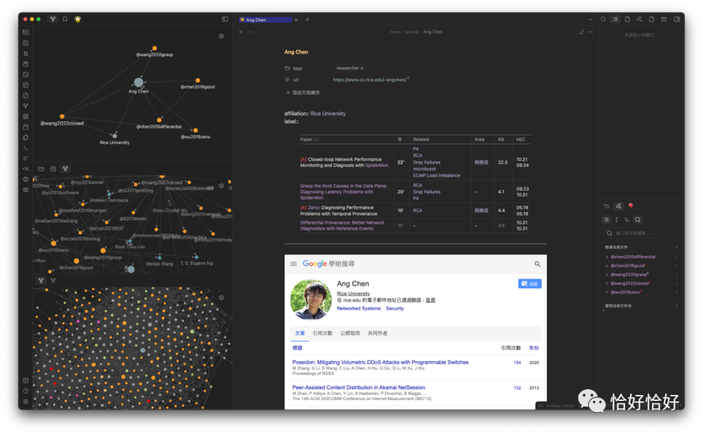
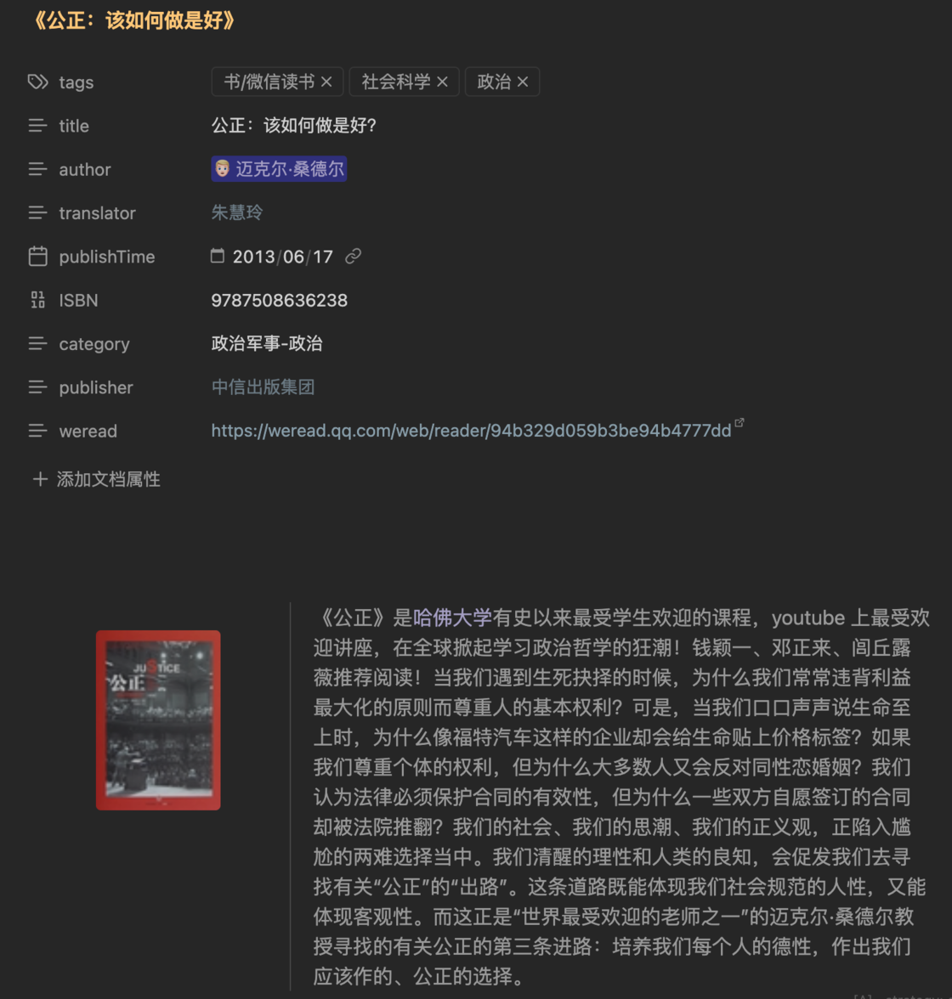

# 笔记系统回顾：我与 Obsidian 不知不觉的 4 年 - 少数派

**Matrix 首页推荐** 

[Matrix](https://sspai.com/matrix) 是少数派的写作社区，我们主张分享真实的产品体验，有实用价值的经验与思考。我们会不定期挑选 Matrix 最优质的文章，展示来自用户的最真实的体验和观点。   
文章代表作者个人观点，少数派仅对标题和排版略作修改。

- - -

2023 将尽，研究生生涯也进入尾声，决定真正总结一下我是怎么用 Obsidian 的。这个想法 21 年就出现了，拖延至今才动笔，也是惭愧。不知不觉，Obsidian 的回顾文章在我的 to-write list 中竟躺了整整三年。😓

当时只是草草回顾了几个重要的时间锚点，现在回看那条微博，惊觉我已经使用 Obsidian 四年了。

除了 Notion 的日记，再补充上本科暑期的日志，有些日期已经可以有五份「某年今日」了！纸有国誉的五年手帐，电子则有如今的五年 Ob。一下能看到五年前的「去年今日」，最是能感慨时过境迁了。

## 邂逅 Obsidian

最初因为双链笔记了解到 Obsidian，又因为贫穷放弃了 Roam Research，最终权衡之下选择了 Obsidian。因为最开始的使用是作为日记本而存在，所以还是比较看重本地化笔记这种更私密的形式。

也曾试过拿来做播客的笔记，毕竟 Obsidian 还支持多级 tag，可以细分一下不同的讨论议题，相似的讨论也可以联系起来。不过毕竟 Obsidian 的移动端出来得比较晚且同步比较慢，播客笔记这种更偏移动端侧的行为后来落到了 [flomo](https://sspai.com/link?target=https%3A%2F%2Fflomoapp.com%2F) 上去了。

第一次正经尝试做学习笔记是用在计算物理这门课的期末考上，在此之前我只是简单地用 Markdown 做每一章笔记。对于多个章节都有涉及到的知识点，我就经常苦恼于应该把内容写到哪一章的 md 文件里。把笔记迁移到 Obsidian 的仓库里后，终于不用犯这个纠结了，直接简单粗暴把这个知识点新开一个 md，再在各自章节相应位置 link 这个知识点即可。

另外值得一提的点在于，因为 Obsidian 集成了 tag 功能，复习的时候我则打上了「不懂」和「重点」的 tag，一个方便在提问老师时快速找到具体问题并且不丢失上下文，另一个则方便我在进考场的前几分钟快速复习时间内点点点、跳跳跳，速览那些重难知识点。

后来发现了 Citation 这个可以和 Zotero 联动的插件之后，很高兴地让 Obsidian 再多承担了科研笔记的任务，成了研究生中离不开的工具。科研笔记是我在 Obsidian 最费心机折腾的部分，也是这篇回顾最想分享的重点。

## 日记部分

日记的核心是 [Calendar](https://sspai.com/link?target=obsidian%3A%2F%2Fshow-plugin%3Fid%3Dcalendar) 插件，侧栏展示的日历可以快速切换日期以及进行周回顾 / 规划，日记内容可以根据模板自动生成。

我的日记模板主要分成四大块：

-   行云 ：一天的流水账式的记录，一般是时间地点人物那种小学生作文。「行云」二字是从「行云流水」里「断章取义」的。
-   跬步：工作日志部分，如果是科研日志一般还会打上一个科研 log 的 tag，以备需要科研回滚的需要。
-   日新：主要是一些比较重要的历史事件新闻，比如俄乌冲突、名人辞世；以及公众号或者网上漫游时学到的一些新技巧（不过新技巧之类的链接一般会存在 [Cubox](https://sspai.com/link?target=https%3A%2F%2Fcubox.pro%2F)）。
-   温故知新：展示昨日 / 今日新建的笔记；过往日记的回顾，包括前日、后日的快速切换；上一个周期（周、月、季度、半年度、年度）的日记；今天编辑过的笔记文件。

日记模板（前三块内容收了起来没有展示）

比较想重点说下最后一个回顾的部分，但首先需要介绍一下 [Dataview](https://sspai.com/link?target=obsidian%3A%2F%2Fshow-plugin%3Fid%3Ddataview) 这个插件。简单来说，这是一个可以根据文件名、路径、tag、引用关系进行查询并展示的插件，支持 javascript 语言。配合上 [CustomJS](https://sspai.com/link?target=obsidian%3A%2F%2Fshow-plugin%3Fid%3Dcustomjs) 插件，可以把具体的 js 代码放到单独文件中，从此每个日记使用同样的简单两行调用命令就可以生成自定义的回顾内容进行展示。

原本回顾只有「往年今日」，纯粹当作一个回忆的乐子，就像微博、QQ 空间整的那样。但今年经历了若干次突发性的巨大压力感后，我感到我很需要向前几天（周）的我自己借取力量。于是我补充了上周、上月的回顾。这种中期记忆的 remind 让我有机会重置下状态血量，不至于被一些突发信息打得措手不及而持续状态低靡。另外，回顾上一周期的经历，有时候让我重新想起当时心中立下的某某小 flag，这种想法可能转瞬即逝，即便是当时也没有记下在 todo 或者本子中，但通过上下文的重温却能让我成功「捡漏」，同样也是一种能量的拾回。

## 笔记部分

Zotero

科研笔记常用的三件套是 Zotero、MarginNote、Obsidian，外加 OneNote 作为一些草稿性质的 log。简单分别介绍一下，Zotero 是一个文献管理工具；MarginNote 是一款 PDF 阅读器，支持将笔记整理为思维导图（目前更进一步已经可以当白板，支持笔画墨迹）；OneNote 是微软开发的可以无限延展白板的免费应用。

MarginNote3

Zotero 是文献的中枢，通过其官方的浏览器插件一键保存导师发的、谷歌学术检索的、邮件订阅的文献。文献阅读视情况使用 Zotero 自带的阅读器或者 MarginNote，一般精读是用 MarginNote，因为 Zotero 阅读器的墨迹功能比较一般。

### 文献精读

文献的笔记则在 Obsidian 上做，通过 [Citations](https://sspai.com/link?target=obsidian%3A%2F%2Fshow-plugin%3Fid%3Dobsidian-citation-plugin) 插件可以自动获取 Zotero 中自动拉取的文献元信息，比如标题、作者、年份、期刊 / 会议、缩写等，把他们填入文档的 metadata 中（参见下图）。同时还会生成 Zotero 的反向链接（URL Scheme），点击文献题目旁边的 emoji 🆉 可以自动跳转到 Zotero App 中对应的那项文献。另外模板还会自动用 `[[]]` 把各个作者链接起来（`authors::`），后面会解释为什么需要为每个作者都建立一个文档。后续的一些信息栏则自己根据文章内容填入：讨论哪些相关话题（`related::`）、所属机构（`affliation::`）等。使用两个冒号是 dataview 的一个语法，对应内容和 metadata 一样可以当作文档的属性进行提取。

对于会议论文，他们的演讲视频一般都是网络公开的，通过嵌入 iframe 可以把视频也放进笔记中。

如今有了 ChatGPT（等一众类似工具，如 Claud、Kimi Chat、ChatPDF），还可以让 AI 先帮忙粗读一下文章。

Kimi Chat

文献往往要和过往工作比较，也要依赖（或受启发于）前人工作，将这些信息 link 起来（图中紫色字即是与其他笔记文件的 link），在左侧便能看到不同层级、不同深度的图谱显示，不同颜色节点表示不同类型的文件（橙色 - 文献笔记、天蓝色 - 作者、红色 - 科研细分方向）。

在笔记中某些行末有 emoji（📑/🔖），这不只是为了好看，他们是指向文献 PDF 出处的链接，通过 URL Scheme 实现。有些链接的右上角有不同颜色的标记 A/B/C/x，指明这篇文章是 CCF-A/B/C 或者不在 CCF 推荐名单中。

有时候偷懒直接从文章剪贴全文，为了更好结构化文本，我还折腾了一个 [Text-Format](https://sspai.com/link?target=obsidian%3A%2F%2Fshow-plugin%3Fid%3Dobsidian-text-format) 插件，一键格式化（如有序、无序列表，PDF 文本复制常见的多余换行问题）。

### 主题阅读

刚才讨论的是一篇文献是如何做笔记的，当我对一个课题进行了若干篇文献的调研后，就需要拔高一层来去看待这些文献。正因为我对各篇文献都在 `related::` 处 link 了相应的话题，我可以用 dataview 来查询都讨论相同某一问题的文章，以表格形式展现出来。其中 KB 列说明笔记文件大小（体现精读的程度），M/C 列说明笔记的修改 / 创建时间（大概能体现我是什么时候看的那篇文章）。

查询都讨论了某一问题的文献，此处查询得到共计 35 篇文献。

### 作者图谱

### 小结

当然这里的图谱只能局限于自己阅读过、做过笔记的文献，是一种观察自己种植的知识树生长过程的方式。如果想进行拓展性的图谱漫游，可以试试 [Connected Papers](https://sspai.com/link?target=https%3A%2F%2Fwww.connectedpapers.com%2F)、[Research Rabbit](https://sspai.com/link?target=https%3A%2F%2Fwww.researchrabbit.ai%2F)。

## 其他

### 看书、观影

本科的时候我用 Notion 去管理看过的书本、影视，记录观看的日期区间，书影的类型等。大概从 2021 年开始，我开始用豆瓣对观看过的书、影进行标记。但对于里面一些话题的探讨，其实更适合用 Obsidian 来做整理。

「微信读书笔记助手」浏览器插件导出标记

和前文的作者图谱相似，也可以展示某作家的著作表格以及相关图谱。

阅读一些影评、博客我会用浏览器插件 [MarkDownload](https://sspai.com/link?target=https%3A%2F%2Fchromewebstore.google.com%2Fdetail%2Fmarkdownload-markdown-web%2Fpcmpcfapbekmbjjkdalcgopdkipoggdi) 剪藏到 Obsidian 中。比如在一篇关于《心理测量者》的 [剧评](https://sspai.com/link?target=https%3A%2F%2Fzhuanlan.zhihu.com%2Fp%2F26223829)，从剧情设定出发，到边沁的圆形监狱，最终到社会公平。很自然地会联想到《你会杀死那个胖子吗？》、《公正该如何做是好》等书，前者专门讨论的就是剧中主角面临的电车难题，后者是我第一次了解到边沁的书，其主题也与剧情所要讨论的内核相符。

诸如此类，Obsidian 的 link 可以更好地体现出这些似有若无的联系。当一本书或者一部剧被链接了很多次时，我就有很强的动机去看他们了。

另外一提，对于影视的链接在预览渲染中前面都多个 emoji（📖、📺），有点仿 Notion 的样子。这是用了 [Supercharged Links](https://sspai.com/link?target=obsidian%3A%2F%2Fshow-plugin%3Fid%3Dsupercharged-links-obsidian) 插件，可以根据文件的 tag 来自定义前缀图标。

### **侧栏：最近编辑**

因为侧栏支持放入文件，所以我利用 dataview 来展示最近编辑过的文献（recent PAPERs）、笔记（recent PAGEs）。就跟 Word 之类的 「最近打开的文件」 同样作用，可以帮我快速回溯近期在干嘛。也跟操作系统课学的 LRU 置换算法（最近最久未使用）一个道理，最近编辑的文件更有可能还要再进行编辑。

### **新词条**

在参加报告、听播客、看博客 / 推送的过程，总有些字眼引起我的兴趣，想对这些概念做进一步的了解。曾经尝试在 Obsidian 列一个 todo list 来放这些新词条，通过链接文件是否存在（淡紫色说明文件已被创建）来判断这个词条是否已经 「学习」 了。可惜后来没有形成习惯而不了了之。

新词条的学习一般分为两个阶段：

1.  阶段一：词条打 tag，贴上一些概念介绍的链接如知乎、维基百科、博客、播客、推送等（维基百科一般放在 metadata 的 wiki 栏中）。
2.  阶段二：摘录比较核心的句子或自己总结到笔记中，link 相关概念，形成概念图谱。如果存在主从关系的概念，则用 `parent::` 和 `children::` 来表示。

## 尾声

说到底，Obsidian 这类双链笔记只是脑中各种信息连接的具现罢了，最重要的还是自己对每一个概念的理解，才能有机会产生更多的连接。但双链笔记有时候又确实 fancy，不知不觉容易沉迷在折腾工具中这种奇怪沼泽中——笔记行为喧宾夺主而弱化了吸收 / 理解的行动。

\> 下载少数派 [客户端](https://sspai.com/page/client)、关注 [少数派小红书](https://sspai.com/link?target=https%3A%2F%2Fwww.xiaohongshu.com%2Fuser%2Fprofile%2F63f5d65d000000001001d8d4)，感受精彩数字生活 🍃

\> 实用、好用的[正版软件](https://sspai.com/mall)，少数派为你呈现🚀
