# 精准转写：利用 Whisper 处理音视频转文字不完全指南 - 少数派

## 背景

前阵子女朋友去读研，授课是全英的，加之又有很多专业名词，有时就会出现理解能力跟不上讲课速度的情况。

因此借助课堂回放/录音复习也变成了一项每周必做的工作，但是完全回看一个三小时长的课程显然是不现实的，所以，音视频转文字就成了必选项。

## 方案选择

### **商用 ASR 服务大多难以实现高精度转写**

我是飞书妙记的会员，所以遇到了这个需求，我马上想到先用妙记试试。

然而，尝试转录的结果表明，妙记在专业课程上的转录准确度相当差，无法满足通过文字转录来提高复习速度的需求。

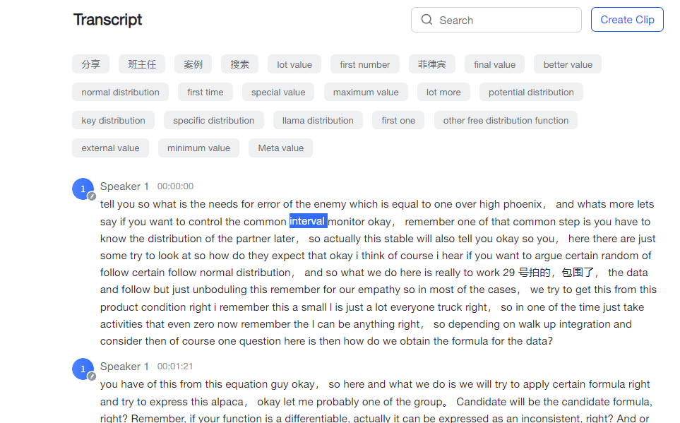

妙记转录结果：词汇未转录、转录错误问题频发

其他商用服务(如通义听悟、讯飞听见、Notta 等)的转录效果和飞书妙记差不太多，大体原因有三点：

1.  手机远距离收音比较差，音频文件质量不高。
2.  一般的商业自动语音识别（ASR-Automatic Speech Recognition）服务主要面对会议等日常场景。但若音频内容含有过多的专业词汇，此类 ASR 服务则有点力不从心了。
3.  商业 ASR 服务需在速度、准确性和成本之间取得平衡，高准确度通常需要以成本变高、速度变慢作为代价。

基于问题 2 和 3 ，我放弃了继续寻找其他商业 ASR 服务的想法。

### **Whisper 的惊艳效果**

因为平时业务里我自己基于

[↓↓↓](https://sspai.com/link?target=https%3A%2F%2Fplatform.openai.com%2Fdocs%2Fguides%2Fspeech-to-text)  
  
OpenAI 发布的 Whisper API  
  
[↑↑↑](https://sspai.com/link?target=https%3A%2F%2Fplatform.openai.com%2Fdocs%2Fguides%2Fspeech-to-text)

写了不少工作流，所以我又试了试 Whisper（Large-v2）的转录效果。——**非常惊艳**，甚至连符号的写法（theta\_i^t）它都转写了出来。

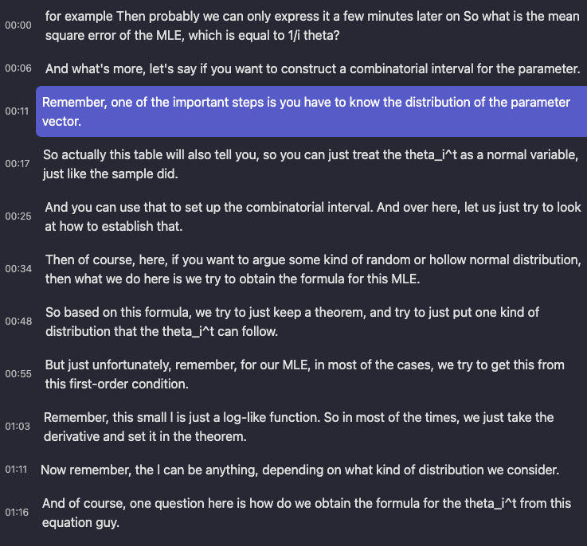

Whipser LargeV2 转录结果：精度高到甚至照顾到了符号写法

这里简要介绍一下

[↓↓↓](https://sspai.com/link?target=https%3A%2F%2Fopenai.com%2Fresearch%2Fwhisper)  
  
Whisper  
  
[↑↑↑](https://sspai.com/link?target=https%3A%2F%2Fopenai.com%2Fresearch%2Fwhisper)

，Whisper 是 OpenAI（没错，还是 chatGPT 背后的公司）在 2022 年 9 月开源的音频转文本的模型，它的转写精确度非常高。

但想使用 Whisper 进行转写也并非易事。它有两种实现方式：云端 Or 本地。

云端转写的优势在于不会受到本地机器性能的限制，且速度相对较快。但它存在两个问题：

1.  项目处理流程复杂：OpenAI 的 Whisper API 限制单次请求的音频大小为 25Mb，而一节 3h 的音频通常都会有大几十 MB。这就需要对音频先做分段处理，再请求结果，最后合并结果。如果是 mp4 文件则还需要从中抽取音频文件，这个过程里没少踩坑。
2.  成本问题：OpenAI 的 Whisper 模型 1min 收费 0.006 美元，1h 的音频按照 7.3 的汇率需要收费 2.7 元。坦白讲，Whisper 的 API 价格非常便宜了，几乎只是 Google Speech2Text API 的四分之一。但是，如果我们假设有 5 门课程，每堂课长 3小时，每周有一次课，那么每个月的转写成本 = 5 x 3 x 4 x 2.7 = 162 元，这个价格还是有点肉疼。

本地转写的话倒是没有上述两个问题，但本地转写的麻烦之处在于：

1.  笔记本上缺乏好的硬件：纯 CPU 模式跑 Whisper 速度非常慢，3 小时的音频可能需要**十几个小时**才能转写完毕。如果想用 GPU 加速，根据
    
    [↓↓↓](https://sspai.com/link?target=https%3A%2F%2Fgithub.com%2Fopenai%2Fwhisper%2Fdiscussions%2F5)  
      
    Whisper 模型显存需求表格  
      
    [↑↑↑](https://sspai.com/link?target=https%3A%2F%2Fgithub.com%2Fopenai%2Fwhisper%2Fdiscussions%2F5)
    
    ，官方的 Whisper-large 模型需要 10G 显存，我这台核显本实在是力不从心。后续的
    
    [↓↓↓](https://sspai.com/link?target=https%3A%2F%2Fgithub.com%2Fggerganov%2Fwhisper.cpp)  
      
    Whisper cpp 项目  
      
    [↑↑↑](https://sspai.com/link?target=https%3A%2F%2Fgithub.com%2Fggerganov%2Fwhisper.cpp)
    
    倒是大幅降低了内存需求，但这也引出了第二个问题。
2.  环境部署复杂：OpenAI 开放的毕竟是项目代码，自己写代码适配的成本还是有点高。Whisper 的 GUI 客户端在 Mac 上不少(Whisper Transcription、MacWhisper..)，Windows 上也有 Buzz ，然而要找到一个支持 GPU 加速的客户端依然十分困难。

且不论是云端转还是本地转，上述方案只是实现了音频转文字的过程，但却少了一个直观的用户界面，帮助我们快速通过文字理解音频内容。

一个理想的转文字结果页面可以借鉴妙记的设计：

-   左侧是音视频播放，而右侧是完整的字幕方便阅读。
-   在点击字幕时，能立刻跳转到对应的音频位置进行播放。

Potplayer 的字幕浏览器倒是能变相实现这个效果，但它文本一长就被截断了，也就是勉强能用的程度。

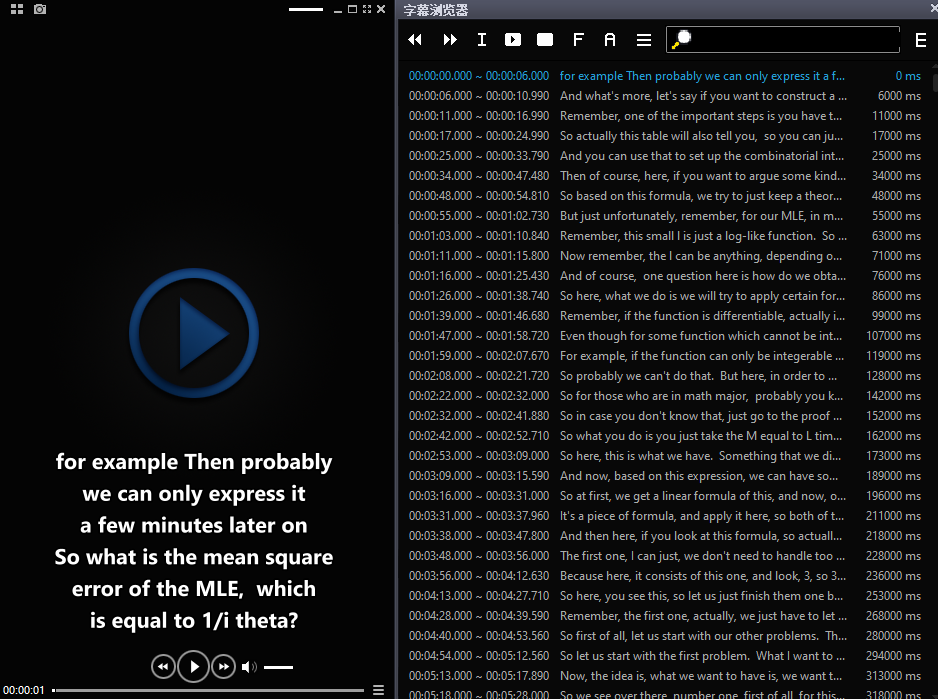

PotPlayer 自带的字幕浏览器 Alt+E

### **Memo，可能是目前最好用的 Whisper 客户端**

后来某天逛小众软件的时候发现了

[↓↓↓](https://sspai.com/link?target=https%3A%2F%2Fmemo.ac%2Fzh%2F)  
  
Memo AI  
  
[↑↑↑](https://sspai.com/link?target=https%3A%2F%2Fmemo.ac%2Fzh%2F)

的内测，它的功能刚好能满足我的需求。

-   不论 Mac 还是 Windows，调用 Whisper 都支持 GPU 加速。哪怕核显本也能有不错的速度。
-   结果页面既可以快速浏览全部转写内容，也可以点击字幕跳转播放。
-   字幕支持一键翻译，双语对照更方便。
-   进一步做了批量转写、AI 对话等功能。

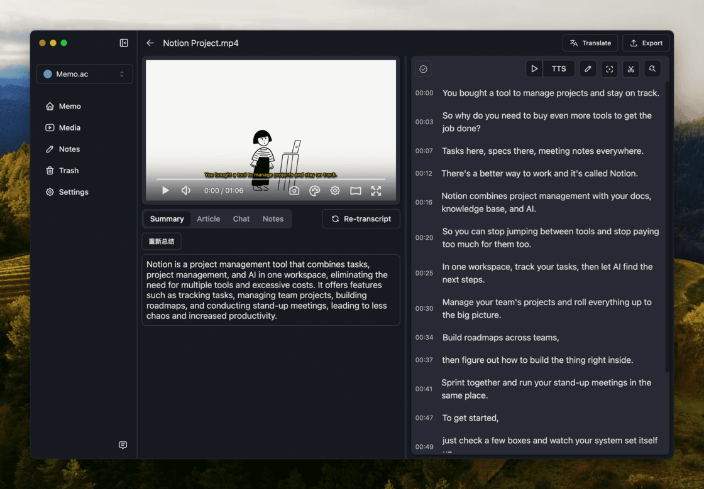

Memo 页面截图

这可真是刚想瞌睡就有人送枕头。有了 Memo 之后，下面就可以介绍我们整个转录工作的流程了。

## 操作流程

### **音视频文件来源**

音视频文件主要有两种来源：学校提供的课程视频回放、手机/录音笔的录音结果。

#### **课程视频回放下载**

某些课程在

[↓↓↓](https://sspai.com/link?target=https%3A%2F%2Fwww.canvaslms.net%2F)  
  
Canvas LMS  
  
[↑↑↑](https://sspai.com/link?target=https%3A%2F%2Fwww.canvaslms.net%2F)

平台上提供了视频回放的功能，但却没有视频下载的选项。

不过网站视频的下载也并不困难，视频是基于 m3u8 的，并且没有加密。只需要获取到 m3u8 地址，随后使用 m3u8下载器就能把视频下载到本机。

至于提取视频url的工具，我推荐使用

[↓↓↓](https://sspai.com/link?target=https%3A%2F%2Fgithub.com%2Fxifangczy%2Fcat-catch)  
  
xifangczy/cat-catch: 猫抓 chrome资源嗅探扩展  
  
[↑↑↑](https://sspai.com/link?target=https%3A%2F%2Fgithub.com%2Fxifangczy%2Fcat-catch)

。通过使用「猫抓」，可解决大约 80% 的网页视频下载问题。

m3u8 下载器则推荐

[↓↓↓](https://sspai.com/link?target=https%3A%2F%2Fgithub.com%2Fnilaoda%2FN_m3u8DL-CLI)  
  
N\_m3u8DL-CLI  
  
[↑↑↑](https://sspai.com/link?target=https%3A%2F%2Fgithub.com%2Fnilaoda%2FN_m3u8DL-CLI)

，一键搞定。

#### **录音**

没有提供视频回放的课程只能通过自己录音来解决。设备不外乎两种：手机或者录音笔。

至于具体选什么设备，这里得根据自己的情况来确定。

通常，手机的远距离收音效果比较一般。在课堂这样的场合，如果不能坐在前排，老师的声音往往会被其他噪音掩盖。

录音笔的效果通常会比手机更好，一般 100-200 元的价格就可以满足需求。

如果是部分留学&专业课程场景，**不建议为了实时语音转文字功能而选择某些录音笔**，可能会有三个比较大的问题：

1.  实时转写准确度很差：从理论上讲，实时转写的难度更大，而非实时的商用 ASR 服务转写的准确度已经是那个德性了，那么在专业课场景下，实时转写几乎毫无用处。
2.  人在境外可能会有网络问题：实时转写实际上是把录到的音频发送到制造商的服务器，服务器再把转译结果发送回来。但很多厂家的服务器都在国内，如果人在国外，可能经常会遇到网络中断的问题。
3.  App 的维护差：目前，主打免费实时语音转文字的录音笔通常都配有相应的客户端，但这些客户端的长期稳定性很难让人放心。像讯飞的录音笔就硬生生地拆出了三个独立的手机应用（极智、听见、语记），不同的录音笔只能连接特定的应用，而有的应用在 iOS 上已经下架一年多了。。

### **文件前置处理（可选）**

#### **降噪&响度均衡&人声增强**

有时, 录音效果可能比较尴尬。这可能是由于手机的收音能力较弱，或者是录音位置与声源之间的距离过大。这种情况下，我们可能会遇到以下问题：

-   在录音中，目标声源的音量过小，以至于无法听清楚。
-   录音中存在大量噪声。
-   录音中前后两部分的声音音量存在很大差异，导致播放时声音大小起伏不定。

因此，在进行转录前，最好先对音频进行一些处理，这可以有效提升 Whisper 转录的效果。我主要做三个操作：人声增强、降噪、响度均衡。

具体的软件在 Windows 上我使用 Pr，在 Mac 上我使用 Final Cut Pro。

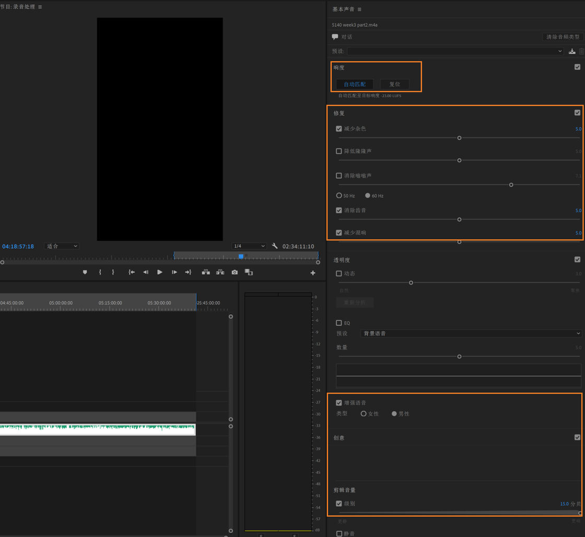

Pr2020，选项和数值仅供参考。

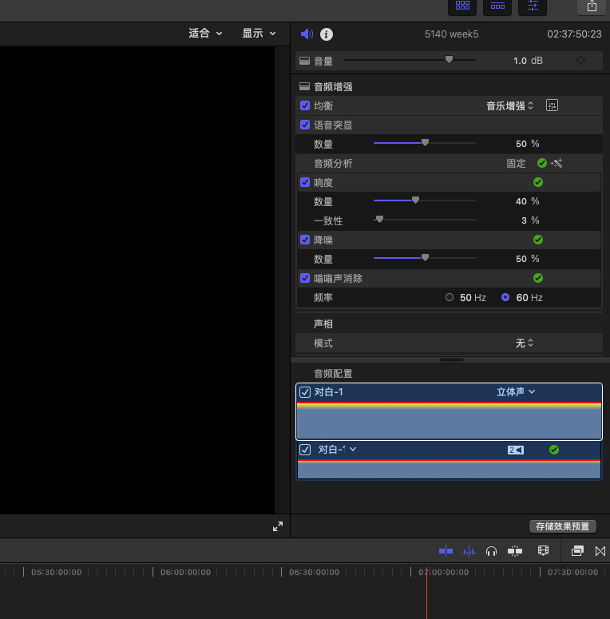

Final Cut Pro, 选项和数值仅供参考。

#### **去除大段空白**

下载的课程回放视频通常都包含 20 至 30 分钟的课间休息时间，我通常会选择把这部分片段从视频里切掉。这么做有两个目的：

1.  减小文件体积：一个 3 小时的回放视频大约占据 1.5G 的空间，移除 30 分钟的视频可以节省约 200M 的存储空间。
2.  降低 Whisper 出现幻觉的可能：虽然 Whisper 的转写精度相当高，但它偶尔也会出现幻觉——即从某一时间点开始，转录文本会不断重复某句话。而大量的空白时间可能会触发这种幻觉。

手动删除空白时间段内容是一种很糙的解决方案，更优雅的方案是结合声音活动检测（VAD, Voice Activity Detection）来做转写，自动忽略掉空白时间段。（开发者说 Memo 的后续版本会接入 VAD）

至于切视频，可以使用 Pr/FCP 等剪辑软件，但这种方式需要重新编码处理后的视频，比较耗时间。愿意折腾一下的话此处建议使用 ffmpeg 通过复制流的方式来做，通常 3 小时的视频文件切掉空白只需几秒钟。

核心的命令为两个：

**从视频里提取特定时间段**

```plain
$$ffmpeg -i "{OriFileLoc}" -ss {RangeTimeStart} -to {RangeTimeEnd} -c:v copy -c:a copy "{OriFileParDir}\temp\temp_video_{temp_video_index}{OriFileExtension}"
```

**利用 concat 衔接多个视频(格式一致)**

```plain
$$ffmpeg -y -hide_banner -vsync 0 -safe 0 -f concat -i "{OriFileParDir}\temp\fileList.txt" -c copy "{OriFileParDir}\RmBlank_{OriFileName}{OriFileExtension}"
```

你可以把本地文件地址丢给 chatGPT 让他直接给你生成最终的命令，抑或使用

[↓↓↓](https://sspai.com/link?target=https%3A%2F%2Fgithub.com%2FHaujetZhao%2FQuickCut)  
  
QuickCut: Your most handy video processing software  
  
[↑↑↑](https://sspai.com/link?target=https%3A%2F%2Fgithub.com%2FHaujetZhao%2FQuickCut)

或者我编写的

[↓↓↓](https://sspai.com/link?target=https%3A%2F%2Fgetquicker.net%2FSharedaction%3Fcode%3D1783e573-f3af-49b8-127a-08dbbe5b3358)  
  
Quicker 动作  
  
[↑↑↑](https://sspai.com/link?target=https%3A%2F%2Fgetquicker.net%2FSharedaction%3Fcode%3D1783e573-f3af-49b8-127a-08dbbe5b3358)

。

### **确定 Prompt**

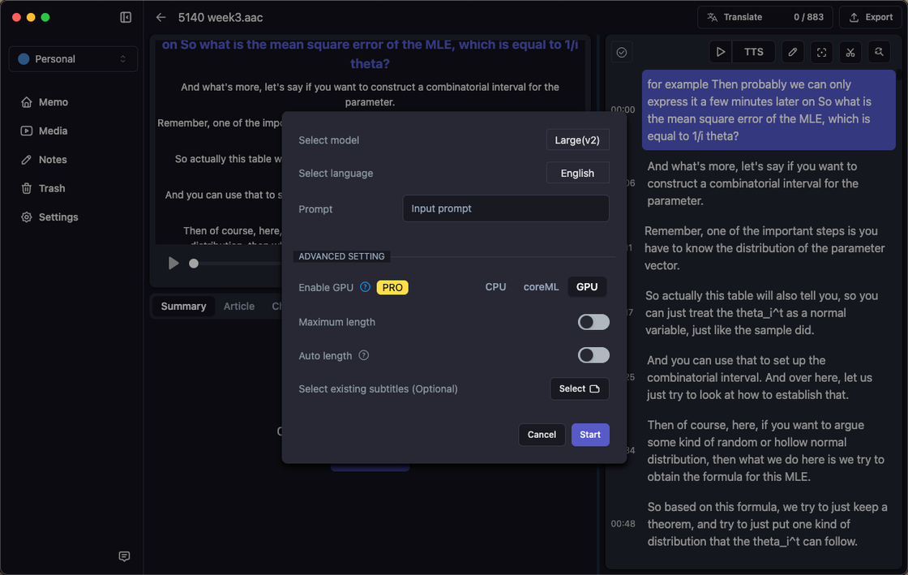

Memo 里 Whisper 的转写选项

#### **Whisper 的 Prompt 和 chatGPT 的 Prompt 是两种东西**

与传统的 ASR 模型不同，Whisper **在某些情况下**可以借助 Prompt 提升音频转文字的准确度。

虽然同属于 OpenAI，但 Whisper 和 chatGPT 的 Prompt 差别非常大。

如果 Whisper 的 Prompt 是 "请尽力保持每句话的完整 并给每句话都添加标点符号"，你会发现这句 Prompt 没有任何作用，Whisper 的转录结果里可能还是会出现大量中断的句子，或者转录结果无标点。

**这是因为 Whisper 是在尝试学习 Prompt 里的**「**风格(style)**」**，而非具体的指令。**

那什么是 Prompt 的「风格」？

根据 Whisper 的

[↓↓↓](https://sspai.com/link?target=https%3A%2F%2Fgithub.com%2Fopenai%2Fopenai-cookbook%2Fblob%2Fmain%2Fexamples%2FWhisper_prompting_guide.ipynb)  
  
cookbook  
  
[↑↑↑](https://sspai.com/link?target=https%3A%2F%2Fgithub.com%2Fopenai%2Fopenai-cookbook%2Fblob%2Fmain%2Fexamples%2FWhisper_prompting_guide.ipynb)

、

[↓↓↓](https://sspai.com/link?target=https%3A%2F%2Fgithub.com%2Fopenai%2Fwhisper%2Fdiscussions%3Fdiscussions_q%3Dprompt)  
  
Whisper prompt 的 issues  
  
[↑↑↑](https://sspai.com/link?target=https%3A%2F%2Fgithub.com%2Fopenai%2Fwhisper%2Fdiscussions%3Fdiscussions_q%3Dprompt)

和我的实际体验，Prompt 的风格可以表现在下面几个方面：

**风格 1：Prompt 里是否包含标点符号。**

Whisper 的转录结果有时会缺乏标点符号，这个时候你可以使用带标点符号的 Prompt 的来引导 Whisper 添加标点。

1.  「生于忧患，死于安乐。岂不快哉？」
2.  「请为转写的文本添加标点符号」

Prompt 1 是有意义的，Prompt 2 是无意义的。

不过 Whisper 也不是能每一次都学会 Prompt 的风格添加标点符号。实测在 Whisper-large v2 模型下，通常英文内容使用 prompt 可以为结果添加标点，中文内容则要看运气。

**风格2：一些容易拼写错误的人名、产品名、公司名**

这里比较好理解，不同的词汇可能会有同一个发音。你可以在 Prompt 里指定你希望的拼写格式。

比如一段对话里提到了张三和李四，而「张三」的音同「章三」、「樟叁」...

那 Prompt 里就可以包含 「张三，李四。」

**风格3：是否包含一些填充词（filler words）**

这里直接引用官方的说法来解释，翻译成中文会有点怪异。

> The model may also leave out common filler words in the audio. If you want to keep the filler words in your transcript, you can use a prompt that contains them: "Umm, let me think like, hmm... Okay, here's what I'm, like, thinking."

**风格4：简体中文和繁体中文**

因为中文有两种，有的时候 Whisper 会把音频以繁体中文的形式转录。此时用简体中文来陈述 Prompt 大概率可以解决此问题。

一般建议 Whisper 的 Prompt 语言和转录的音频语言一致。即英文音频用英语 Prompt，中文音频用简中/繁中 Prompt。

**风格5：通过对话风格的 Prompt 变相实现转录结果区分说话人**

这个技巧来自于

[↓↓↓](https://sspai.com/link?target=https%3A%2F%2Fgithub.com%2Fopenai%2Fwhisper%2Fdiscussions%2F117)  
  
prompt vs prefix in DecodingOptions  
  
[↑↑↑](https://sspai.com/link?target=https%3A%2F%2Fgithub.com%2Fopenai%2Fwhisper%2Fdiscussions%2F117)

，有的时候会有效果。

单纯的 Whisper 模型并不能在转录结果里区分出说话人，想要区分说话人，一般会配合 Pyannote 来做。但在某些场景下，我们可以通过 Prompt 来变相实现区分说话人——**每一句的转录结果都属于单个说话人**，不会出现某一句的转录结果属于多个说话人的情况。

方法就是用一个对话式的 Prompt：

-   「- How are you? - I'm fine, thank you.」
-   「- 吃了没？- 吃了。」

播客这种场景可以试试。

**Whisper Prompt 的其他 Tips**

-   Whisper 的 Prompt 应该尽可能长一些，太短的 prompt 的风格难以学习。
-   Whisper 的 Prompt 只会使用 224 个 token，如果超过 224 个 token 则会默认使用最后 224 个 token。token 的概念可以参考
    
    [↓↓↓](https://sspai.com/link?target=https%3A%2F%2Fzhuanlan.zhihu.com%2Fp%2F618029100)  
      
    这篇文章  
      
    [↑↑↑](https://sspai.com/link?target=https%3A%2F%2Fzhuanlan.zhihu.com%2Fp%2F618029100)
    
    ，但 Memo 的 Prompt 直接限制了字符串长度，这里就不用在乎 token 长度了，只需要尽量让自己的 prompt 完整输入到 Memo 输入框里就行。
-   Whisper 的 Prompt 最好可以和音频的源语言保持一致。

#### **怎样快速生成 Prompt？**

因为我主要转录的是课程内容，所以我的 Whisper Prompt 通常会使用这节课的关键词列表。如果课程有讲义 pdf 文件，我会直接把它丢给

[↓↓↓](https://sspai.com/link?target=https%3A%2F%2Fclaude.ai%2F)  
  
Claude  
  
[↑↑↑](https://sspai.com/link?target=https%3A%2F%2Fclaude.ai%2F)

，然后：

```applescript
summarize the file, response me with format like :"keyword1, keyword2, keyword3,keyword4.."
```

如果课程没有讲义，我会手动输入几个关键词，或者直接从课本里随便挑一段话作为 prompt。

### **转写**

#### **模型选择**

Whisper 转写需要指定模型。模型越大，转写越精准，转写速度越慢。

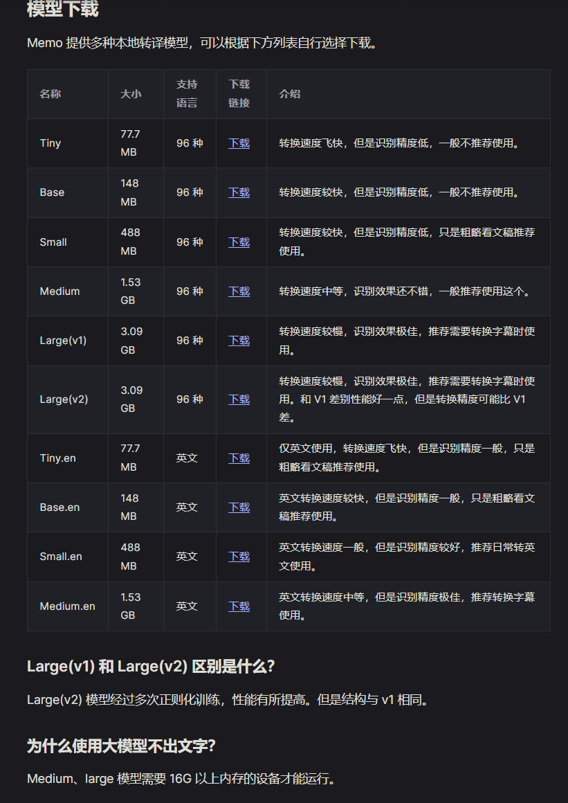

Whisper 模型与说明

#### **GPU 加速**

Memo 在 Windows 和 Mac 上都实现了 GPU 加速。

**Windows**

Windows 电脑如果是独显机器大部分应该没什么问题，部分显卡的测试转录速度如下：

> RTX4090 显卡在 Large 模型下转录 1.2 小时音频时间为 7 分钟
> 
> RTX3080Ti 显卡在 Large 模型下转录 1.2 小时音频时间为 8 分钟
> 
> RTX3080Ti 显卡在 Large 模型下转录 0.4 小时日漫时间为 2 分钟
> 
> RTX3060 laptop 显卡在 Large 模型下转录 1.2 小时音频时间为 20 分钟
> 
> RTX3060 在 Large 模型下转录 1.2 小时音频时间为 12 分钟
> 
> 6600XT 显卡在 Large 模型下转录 1.2 小时音频时间为 11 分钟
> 
> 5700XT 显卡在 Large 模型下转录 1.2 小时音频时间为 15 分钟

如果你的电脑只有核显，那可能会遇到显存不足的问题。

但这里如果是 AMD 的核显，你可以尝试在 Bios 里调整显存大小。（高风险行为，谨慎操作）

[↓↓↓](https://www.bilibili.com/video/BV1UV4y1c7br/?spm_id_from=333.880.my_history.page.click&vd_source=c2b8be35c825954dae60fa802e7dba82)  
  
游戏爆显存？显示器黑屏花屏？BIOS 没有调整选项？AMD 核显显存大小调整教程（UniversalAMDFormBrowser  
  
[↑↑↑](https://www.bilibili.com/video/BV1UV4y1c7br/?spm_id_from=333.880.my_history.page.click&vd_source=c2b8be35c825954dae60fa802e7dba82)

[↓↓↓](https://www.bilibili.com/video/BV1w84y167ep/?spm_id_from=333.880.my_history.page.click&vd_source=c2b8be35c825954dae60fa802e7dba82)  
  
AMD 台式及笔记本改核显显存教程，核显还只有 512M？  
  
[↑↑↑](https://www.bilibili.com/video/BV1w84y167ep/?spm_id_from=333.880.my_history.page.click&vd_source=c2b8be35c825954dae60fa802e7dba82)

我手里的笔记本是 R7-6800H，32G 内存，出厂分配 4G 作为 GPU 显存。在 Large 模型下，开启 GPU 加速后显存会占满，转录时长：音频时长大概等于 1:2 。

我尝试把显存开到 8G，跑 Whisper 时大概会占用 6G 显存，但速度相较于 4G 显存无提升。所以如果调整 Bios 的显存大小，通常调整到 4G 就足够使用了。

**Mac**

Intel 的机器我手上没有，主要分享一下 M 系列的机器速度。

M 系列的 GPU 加速倍数近似和 GPU 核心数成正比：

-   M1 Max 32 gpu core ，转录时长：音频时长 = 1：12
-   M2 Pro 16 gpu core，转录时长：音频时长 = 1：6

Mac GPU 核心数对比可参考

[↓↓↓](https://sspai.com/link?target=https%3A%2F%2Fwww.macworld.com%2Farticle%2F670873%2Fwhich-mac-processor-apple-processor-comparison-m1-vs-intel.html)  
  
Mac processor comparison: M1 & M2 vs Intel | Macworld  
  
[↑↑↑](https://sspai.com/link?target=https%3A%2F%2Fwww.macworld.com%2Farticle%2F670873%2Fwhich-mac-processor-apple-processor-comparison-m1-vs-intel.html)

。

使用 Whisper GPU 加速时，除了消耗 GPU，同时也会消耗大量内存。我用 Large 模型时 Memo 占用 6.4 G 内存。

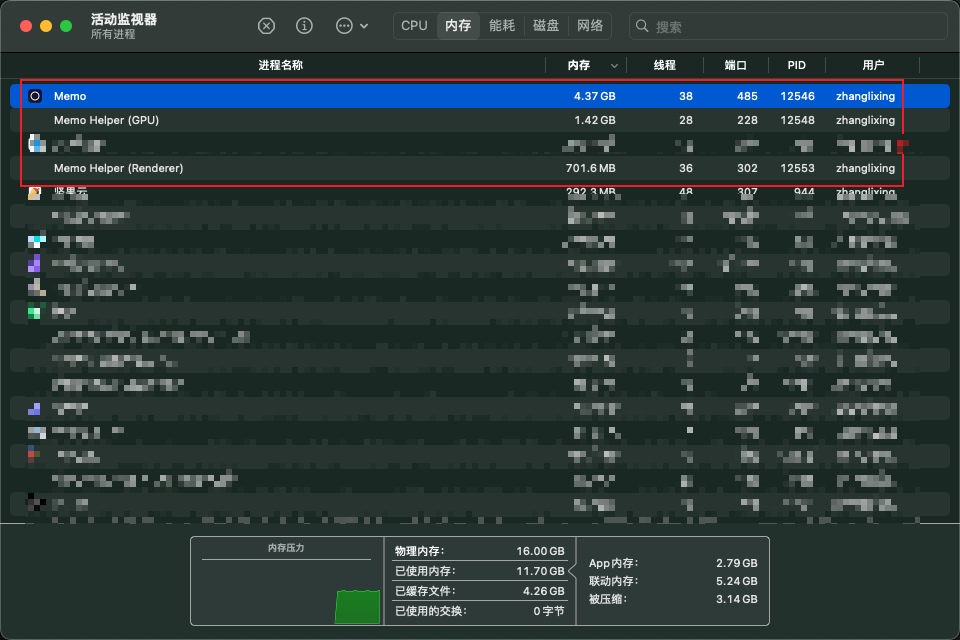

Whisper Large GPU 加速时内存占用 6.4G

### **转写结果优化处理**

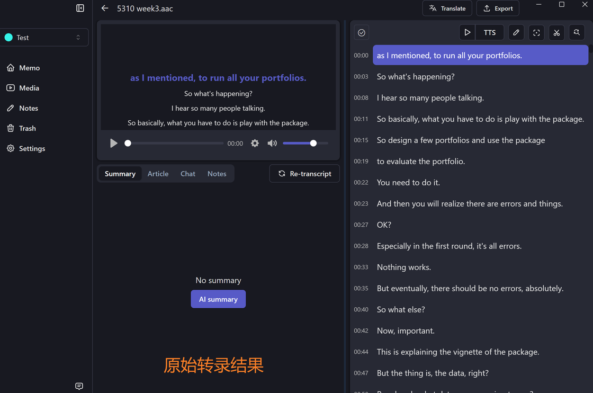

Whisper 原始转录结果

如果是在为视频创建简易的字幕文件，那到这里基本可以收工了。但如果是在为需要快速阅读全文的课程或会议等场景进行操作，那么此处可以对转写结果做一些优化，主要解决两个问题：

-   有的句子被拆分成了两行，调用翻译的时候不方便。（比如 00:15-00:19）
-   每行的字数太短，读起来很累。最好是有个段落模式，每个时间点的内容多一些。

开发者说这两个功能未来的版本都会实现，但在没实现之前只能靠我们自己来处理了。我写了一段 Python 的脚本将原始的字幕转换成段落模式的字幕：

[↓↓↓](https://sspai.com/link?target=https%3A%2F%2Fgithub.com%2Fzj1123581321%2FAdjust_SubTitle)  
  
Adjust\_SubTitle: 调节 Whisper 转录生成的 srt 文件，避免一句话被分成两行，避免一句话过短。  
  
[↑↑↑](https://sspai.com/link?target=https%3A%2F%2Fgithub.com%2Fzj1123581321%2FAdjust_SubTitle)

你可以导出原始转录的 srt 文件，然后修改 AdjustSrt.py 里的 srt 文件路径，运行脚本后会自动在原始路径下生成段落模式的 srt 的字幕。最后只需重新创建 Memo 任务，同时指定需导入的音频和字幕文件即可。

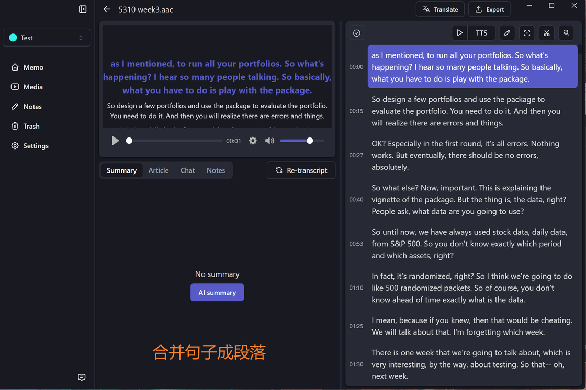

合并句子成段落

因为段落模式的实现逻辑是基于原始转录结果里的标点符号，所以运行脚本的前置条件是 **Whisper 生成的字幕里有标点**。

除此之外，基于标点符号的段落模式**只能用于只有一个说话人的情况**。否则可能会导致一句话里出现了多个说话人，容易造成误解。

## 潜在问题与更多场景

### **Whisper 的不足**

虽然 Whisper 结合上下文的能力很强，转写准确度非常高。但 Whisper 也有两个比较麻烦的问题：

#### **令人头疼的幻觉问题**

所谓「幻觉」是指 Whisper 转录的文本和音频不相关，而是在不断重复之前的转录结果。

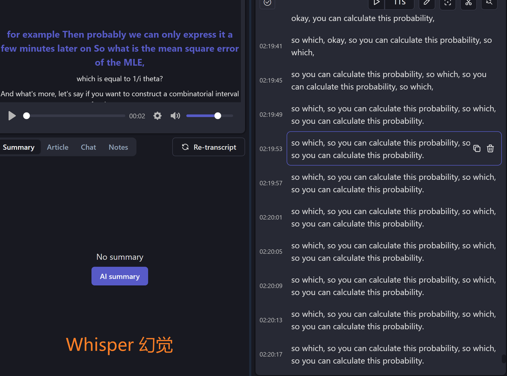

Whisper 幻觉：重复某一句话

我体验下来目前主要是两种情况会造成幻觉：

1.  大段的空白内容。
2.  低录音质量，有比较大的噪音。

1 比较好处理，Memo 之后会引入 VAD 自动过滤空白内容。

同时根据

[↓↓↓](https://sspai.com/link?target=https%3A%2F%2Fgithub.com%2Fopenai%2Fwhisper%2Fpull%2F1253)  
  
Ignore repeated prompt by heimoshuiyu · Pull Request #1253 · openai/whisper  
  
[↑↑↑](https://sspai.com/link?target=https%3A%2F%2Fgithub.com%2Fopenai%2Fwhisper%2Fpull%2F1253)

这个 issue，设定 `--condition_on_previous_text False` ，也就是不让 Whisper 用前文的转写结果转录后面的音频，也能降低空白引起幻觉的概率，但代价是丧失了 Whisper 在上下文理解上的优势。（

[↓↓↓](https://sspai.com/link?target=https%3A%2F%2Fgithub.com%2FMakememo%2FMemoAI%2Fissues%2F23)  
  
开发者说后续会开放此参数  
  
[↑↑↑](https://sspai.com/link?target=https%3A%2F%2Fgithub.com%2FMakememo%2FMemoAI%2Fissues%2F23)

。）

但 2 目前还没找到比较好的解决方案，只能是再尝试对音频调整降噪、人声增强的强度试试..

#### **薛定谔的标点符号**

从天梯榜上看，Whisper 的英语转录效果名列前茅，而对于中文的转录效果在中等水平。

上文提到过，如果是英文音频，那合适的 Prompt 大概率可以给转写结果添加标点，但中文音频则有概率无法添加标点。此时就比较尴尬了，我也没有找到比较好的解决方案，如果有朋友知道怎么解决，欢迎评论区里分享。

我曾经尝试利用 gpt 3.5 来给生成的文本添加标点符号，但由于 gpt 也存在幻觉，它经常直接将文本合并，然后时间戳和文本就对不上了。。如果用 4 的话成本则有点高。


Whisper 在不同语言的转写效果，数值越低越好。

### **适合使用 Whisper 的人群**

-   对音频转文字有强需求，同时愿意用更长的时间换更高的转写精度。
-   对隐私敏感，音频不能传到互联网的场景。
-   手里有不错的电脑设备（16G 内存+，能开启 GPU 加速）。

- - -
