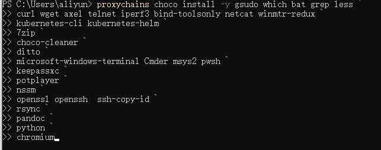

# 【精选】Windows使用choco包管理器_windows choco-CSDN博客

# Windows使用choco包管理器

#### Windows使用choco包管理器

-   [安装\`choco\`](#choco_2)
-   -   [\`powershell 2+\`安装\`choco\`](#powershell_2choco_21)
-   [choco\`安装失败\`](#choco_29)
-   -   [修改choco后续安装软件的默认安装路径--有\`bug\`，失败](#chocobug_35)
-   [choco包下载目录](#choco_46)
-   -   [安装的常见命令行工具位置](#_55)
    -   [常见的命令行工具安装目录](#_63)
-   [choco常见操作](#choco_72)
-   -   [搜索软件包](#_83)
    -   -   [查看指定软件的所有版本](#_91)
    -   [安装软件包](#_100)
    -   -   [安装指定版本的软件包](#_111)
    -   [查看软件包](#_124)
    -   [更新软件包](#_138)
    -   [卸载软件包](#_155)
    -   [不需要每次输入Y](#Y_163)
-   [必装软件](#_182)
-   -   -   [\`powershell\`续行符](#powershell_232)
    -   [choco清理工具(必装)](#choco_239)
    -   [安装Windows隐私配置工具](#Windows_250)
    -   [安装obs录屏软件](#obs_264)
    -   [安装k8s命令行工具](#k8s_272)
    -   [移动测试工具类](#_280)
    -   [安装Windows补丁包](#Windows_293)
-   [choco常用软件安装](#choco_302)
-   [故障排除](#_355)
-   -   [基础连接已经关闭: 连接被意外关闭](#__364)

## 安装`choco`

参考: [https://chocolatey.org/install](https://chocolatey.org/install)

```powershell
# 查看Get-ExecutionPolicy是否受限制
Get-ExecutionPolicy
## 如果它返回Restricted，则运行下面的语句（3选1即可）

# 信任脚本执行策略
set-ExecutionPolicy RemoteSigned -Force
# 或
# 设为AllSigned策略提高安全性
Set-ExecutionPolicy AllSigned
# 或
# 设置Bypass策略
Set-ExecutionPolicy Bypass -Scope Process
```

  

### `powershell 2+`安装`choco`

```shell
# 以管理员运行powershell 2+
Set-ExecutionPolicy Bypass -Scope Process -Force; [System.Net.ServicePointManager]::SecurityProtocol = [System.Net.ServicePointManager]::SecurityProtocol -bor 3072; iex ((New-Object System.Net.WebClient).DownloadString('https://community.chocolatey.org/install.ps1'))
```

  

## choco`安装失败`

国内`安装失败`，可以使用win10离线安装choco方案  
[https://blog.csdn.net/omaidb/article/details/126669503](https://blog.csdn.net/omaidb/article/details/126669503)

  

### 修改choco后续安装软件的默认安装路径–有`bug`，失败

修改`用户`变量`ChocolateyToolsLocation`的值为指定的安装路径即可  


  

修改`系统`变量`ChocolateyInstall`的值为指定目录  


  

## choco包下载目录

```shell
#下载的包源码目录
C:\Users\username\AppData\Local\Temp\
```

  

### 安装的常见命令行工具位置

```shell
C:\ProgramData\chocolatey\bin
```

  

### 常见的命令行工具安装目录

```shell
C:\ProgramData\chocolatey\lib
```

  

## choco常见操作

```shell
# choco版本查看
choco -v

# choco版本更新
choco upgrade chocolatey
```

  

### 搜索软件包

```shell
# 搜索软件
choco search 软件包名
```

  

#### 查看指定软件的所有版本

```shell
# 查看指定软件的所有版本
choco search 软件包名 --all-versions
```


  

### 安装软件包

```shell
# 安装
choco install 软件包名

# 强制安装/重新安装
choco install --force 软件包名
```

  

#### 安装指定版本的软件包

`前提条件`：choco源仍提供指定的版本

```shell
# 查看指定软件的所有版本
choco search 软件包名 --all-versions

# 安装指定版本的软件包
# choco install 软件包名 --version=版本号
choco install go-ipfs --version=0.13.1
```

  

### 查看软件包

```shell
# 查看Chocolatey安装的装所有程序的列表
choco list --local

# 查看本地安装的软件
choco list -li 

# 查看软件包详情
choco info 软件包名
```

  

### 更新软件包

```shell
# 更新choco到最新版
choco upgrade chocolatey -y

# 查看需要更新的软件列表
choco outdated

# 更新指定软件包
choco upgrade 软件包名 -y

# 更新所有软件
choco upgrade all -y
```

  

### 卸载软件包

```shell
# 卸载
choco uninstall 软件包名
```

  

### 不需要每次输入Y

以下将启用`allowGlobalConfirmation`，它将在没有确认提示的情况下安装或更新。

```shell
choco feature enable -n=allowGlobalConfirmation
```

如果您想重新打开提示，请使用`disable`运行相同的命令：

```shell
choco feature disable -n=allowGlobalConfirmation
```

这对于无人值守脚本很有用，而不会影响提示的未来状态。

  

## 必装软件

`powershell`的`续行符`是`左上角`的反撇号\`.

```shell
# 更新choco到最新版
choco upgrade chocolatey -y

# 必装软件
choco install -y gsudo which bat grep less `
curl wget axel whois aria2 `
telnet tcping iperf3 bind-toolsonly netcat winmtr-redux `
7zip `
choco-cleaner `
ditto `
powershell-core pwsh microsoft-windows-terminal Cmder gnuwin32-coreutils.portable`
keepassxc `
potplayer `
nssm `
openssl openssh  ssh-copy-id `
rsync `
pandoc `
python2 python `
rust `
chromium firefoxesr `
quicklook `
shfmt `
notepadplusplus everything
# quicklook是空格预览的
# shfmt是shell脚本格式化工具
# ungoogled-chromium是去谷歌的chrome

# msys2安装速度实在太慢了，单独装
choco install -y msys2

# 执行清理
choco-cleaner
```

一个纯净的`chromium`内核浏览器`midori-browser`  
[https://astian.org/midori-browser-desktop/download-midori-browser-desktop/](https://astian.org/midori-browser-desktop/download-midori-browser-desktop/)

开源终端`WindTerm`,性能比`FinalShell`和`Electerm`好很多.  
[https://github.com/kingToolbox/WindTerm/](https://github.com/kingToolbox/WindTerm/)

```shell
# 安装开源终端WindTerm
choco install windterm.portable -y
```

  

#### `powershell`续行符

`powershell`的续行符是左上角的反撇号;  
可以看到当你输入 \` 后， 会有一个 >> 表示可以接着输入命令。  


  

### choco清理工具(必装)

```shell
# 安装清理工具
choco install choco-cleaner -y

#执行清理
choco-cleaner
```

  

### 安装Windows隐私配置工具

```shell
# 安装Windows隐私配置工具
choco install w10privacy -y

# 安装隐私清理工具
choco install bleachbit -y

# 安装DNSCrypt
choco install dnscrypt-proxy -y
```

  

### 安装obs录屏软件

```shell
# 安装obs录屏
choco install obs-studio -y
```

  

### 安装k8s命令行工具

```shell
# 安装K8S命令行工具
choco install kubernetes-cli kubernetes-helm -y
```

  

### 移动测试工具类

```shell
# 安装adb
choco install adb -y

# 安装apktool,会自动安装依赖包jre.
choco install apkool -y
```

  

### 安装Windows补丁包

```shell
# 安装kb补丁
choco install kb编号
```

  

## choco常用软件安装

```shell
# python解释器
choco install python -y

# jdk8
choco install jdk8 -y

# 或 jdk11
choco install jdk11 -y

# Windows终端
choco install cmder -y

# Windows管理员提权工具
choco install gsudo -y 

# 命令行下载工具
choco install curl wget axel aria2 -y

# 笔记工具
choco install typora -y

# ssh工具
choco install openssh ssh-copy-id rsync -y

# 网络工具
choco install telnet netcat -y

# 命令行目录查看工具
choco install which -y

# 多媒体
choco install potplayer -y

# 安装7zip压缩工具
choco install 7zip -y

# 安装增强剪切板
choco install ditto -y

# ntop资源查看器和grep便于管道符过滤命令行结果
choco install ntop.portable grep -y

# pandoc文档格式转换工具
choco install pandoc -y

# potplayer播放器
choco install potplayer -y
```

  

## 故障排除

使用 `-dv` 参数捕获更多输出

```shell
# 查看详细输出
choco install pkg_name -dv
```

  

### 基础连接已经关闭: 连接被意外关闭

使用“1”个参数调用“DownloadString”时发生异常:“基础连接已经关闭: 连接被意外关闭。”

```shell
# 修改策略
Set-ExecutionPolicy RemoteSigned -Scope CurrentUser
```
