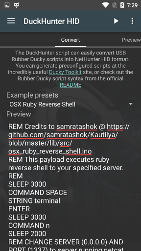

# 红蓝对抗中的近源渗透

### 编者按

近源渗透（物理渗透）是红蓝对抗演练中的一个关键点，从相关新闻及实际测试结果来看，许多企业线上部署各种安全设备严阵以待，结果马奇诺防线在线下被物理渗透绕过 —— 物理安全或许就是部分企业的短板。本期TSRC特别邀请到腾讯企业IT部蓝军团队成员、《黑客大揭秘：近源渗透测试》第二作者杨芸菲（yyf），他将撰文与大家一起探讨近源渗透攻防。同时也向对近源渗透感兴趣的同志推荐该书。

### 前言

近源渗透是这两年常被安全业内人员谈起的热门话题。不同于其他虚无缥缈的安全概念，近源渗透涉及到的无线安全、物理安全、社会工程学都十分容易落地实践，许多企业内部的攻防对抗演练也都出现了看上去“很过分”的近源渗透攻击手法，给防守方团队上了生动的一课。

19年的时候，笔者和朋友们就推出了漫画《黑客特战队·近源渗透》和出版书《黑客大揭秘：近源渗透测试》。作为近源渗透概念的主力“炒作者”之一，这篇文章和大家聊聊我对近源渗透的理解。

# 一、什么是红蓝对抗

红蓝对抗原本是一个军事概念，指在部队模拟对抗时，专门成立一个扮演假想敌的部队（蓝军）与我方正面部队（红军）进行对抗性演练。在信息安全领域中的红蓝对抗也是类似的思路，一方扮演黑客，另一方扮演防守者进行网络安全攻防演练。在演练过程中，蓝军模拟真实的攻击来评估企业现有防守体系的安全能力，红军对发现的问题做出相应的优化整改。通过周期性的红蓝对抗攻防演习，持续性地提高企业在攻击防护、威胁检测、应急响应方面的能力。

需要注意，国外流行使用Red Team（红队）代表攻击方，Blue Team（蓝队）代表防守方。

# 二、什么是近源渗透

在《黑客大揭秘：近源渗透测试》书中，笔者将近源渗透定义为“指测试人员靠近或位于测试目标建筑内部，利用各类无线通信技术、物理接口和智能设备进行渗透测试的方法总称”。

用通俗的话来讲，就是通过乔装、社工等方式实地物理侵入企业办公区域，通过其内部各种潜在攻击面（如Wi-Fi网络、RFID门禁、暴露的有线网口、USB接口等）获得“战果”，最后以隐秘的方式将评估结果带出上报，由此证明企业安全防护存在漏洞。

可以直观地感觉到，近源渗透与传统渗透测试的主要区别体现在对“边界”的理解上。在通过外网网络入口入侵企业这条路上，将面对防火墙、入侵检测等重重防御措施，攻击门槛逐渐变高。而在近源渗透的场景中，由于测试人员位于目标企业附近甚至建筑内部，这些地方往往存在大量被企业忽视的安全盲点。我们可以根据目标的网络状态、现场环境、物理位置等因素灵活地更换渗透测试方式，这也更接近渗透测试的本质。

# 三、近源渗透的测试目标

如果做完整的攻击面分析，近源渗透可以涉及到的测试对象会非常多，包括WiFi、蓝牙、RFID、ZigBee、蜂窝、Ethernet等等各类物联网通信技术，甚至包括智能设备的嵌入式安全。在本文中，笔者将挑选其中较为通用且容易在红蓝对抗中实施的近源渗透技术进行探讨。

## 3.1 无线渗透

在过去很长一段时间里，由于没有明显的竞争对手，人们普遍把无线安全用作Wi-Fi安全的同义词，把无线网络等同于Wi-Fi，下文中笔者将延续使用此习惯。

• 2015年3月，由于某公司内部存在开放的无线网络，导致超级计算机“XX一号”的某节点被攻击，大量敏感信息疑遭泄露。

• 2015年5月，某航站楼Wi-Fi提供商的服务器安全设施不足和代码漏洞，导致服务器中的用户隐私数据被泄露。

• 2016年，某手机售后中心因Wi-Fi安全缺陷导致内网被攻击者入侵。

• 2016年4月，富士康前员工秘密桥接无线网络侵入苹果公司的网络，为他人提供“改机、解锁”服务。

• 2018年，国内某安全研究员在新加坡参加安全会议，在入住酒店期间通过酒店无线网络入侵内部系统，并发表博客介绍入侵过程。

如今，无线网络已经事实上成为了企业移动化办公的重要基础设施，但由于普遍缺乏有效管理，部署与使用人员的安全意识和专业知识的不足，导致AP分布混乱，设备安全性脆弱，无线网络也越来越多地成为黑客入侵企业内网的突破口。正因为如此，笔者在《近源渗透测试》一书中花了大量笔墨用于描述基于无线网络的安全攻防，无线渗透是目前近源渗透中的主要测试手段。

在笔者之前的工作中，曾对军工、能源、金融、政企、电信等各种类型的行业客户做过大量的无线渗透测试服务，发现各单位对无线安全的建设都处于相对模糊和薄弱的阶段，主要反应在三块：

### 1\. 不知道内部有多少无线热点

企业内部存在的热点，从“是否由AP下发”和“使用目的”的角度，可分为以下几类：

• **官方下发热点**  
正式热点：有规划搭建的长期热点  
事件类热点：支持业务项目的中短期热点  
历史遗留热点：不再使用却未下线的热点

• **非官方热点**  
邻居热点：所有未接入到内部网络的热点  
业务热点：业务部门报备审批后自行建立的热点  
员工私建热点：在办公机上通过无线网卡分享出的热点。  
恶意热点：用于攻击客户端的钓鱼热点

### 2\. 不知道黑客具体的攻击手法

从无线攻击的目标来看，可以分为三类：

• 绕过无线认证，获取无线网络访问权限  
• 攻击无线终端，窃取敏感信息  
• 破坏无线基础设施

这些目标可能会同时出现，比如先攻击无线终端获取凭据，再使用凭据连入网络。针对相应的目标，黑客会采取对应具体的攻击手法。

### 3\. 不知道如何做无线防护

在不知道前两点的前提下，就不可能做得好防护。

了解内部存在哪些无线热点其实就是在梳理暴露的攻击面，如果对此没有清晰的认识，在这种基础上做的无线安全防护就如同“马其诺防线”一样，一打就穿。

笔者曾受邀对一个大型金融企业做无线安全检测，由于行业的敏感性同时他们高层领导对无线网络不安全有清醒的认识，于是采取了不部署任何无线网络的策略。初看下，连无线网络都没部署，自然就不会面对无线威胁。而事实是，笔者在该企业移动端开发团队所在区域，发现了一个由mac办公机共享出来的私建热点，破解密码连上网络后，就拥有了办公机同样的访问权限，直通内网。这样一个简单的私建热点就把想象中“无懈可击”的无线防护策略打破了。

  
从无线攻击的目标来思考，会发现获取无线网络访问权限仅是其中之一。我知道现在的企业级AP基本都自带了钓鱼热点防护功能，那员工拿到公共场所使用怎么防钓鱼热点呢。移动化办公是不可逆的浪潮，我们就得假设员工一定会在钓鱼热点环境下办公，基于这种假设提出的防护策略才能扛得住真实攻击。

对于另外一个目的“破坏无线基础设施”可以想象这样一个场景：由于移动化办公的普及，大家都习惯使用笔记本设备来干活，假设在关键时期攻击者在目标团队工位偷偷放置一个无差别全阻断的盒子进行Wi-Fi Deauth攻击，让受害者的运营能力在短时间内极具降低。那么是否能结合AP日志建立一套及时发现Wi-Fi Deauth攻击，物理定位，现场排查可疑人员/设备的机制？在极端情况下，这些笔记本是否可以快速通过网线接入网络恢复办公能力？

企业无线安全体系建设是一个包含技术与管理的庞大话题，为了不过于偏离主题这里仅作举例不再近一步展开。虽然这部分内容是以防守方视角写的，但了解到防守方的痛点与难点后，可以为攻击测试方向指明道路。“道”清晰了，“器”和“术”的积累只是时间问题。

## 3.2 HID攻击

HID（human interface device）指键盘、鼠标与游戏标杆等这类用于为计算机提供数据输入的人机交互设备。攻击者可以将特殊的USB设备模拟成为键盘，一旦连接上计算机就执行预定的恶意操作，这便是HID攻击。

在过去十年间，出现了Teensy、USB Rubber Ducker、BadUSB、BashBunny、WHID等等不同形式、各具特色的HID攻击设备，它们通过DEFCON、BlackHat等安全会议和新闻媒体向外宣传，无论是业内、业外都对这种攻击手法具有一定了解和防范意识。笔者将介绍两种较为有隐蔽性的HID攻击手段，以贴近在真实环境下的攻击场景。

### 1.利用Android设备执行HID攻击

这种方式的优势是显而易见的，可以便捷地在手机上切换和修改攻击指令，自带电源免去了从插入到发动攻击前这段不短的初始化时间，极大挺高了攻击隐蔽性。当然，这对Android设备有一定的要求，需要root同时内核要打入USB HID补丁（[https://github.com/pelya/android-keyboard-gadget）。](https://github.com/pelya/android-keyboard-gadget%EF%BC%89%E3%80%82)

笔者喜欢使用Kali Linux Nethunter来部署该攻击工具。NetHunter是一个基于Android的开源渗透测试平台，由 Kali Linux 社区与 Offensive Security 共同创建，系统中包含大量 Kali Linux 中的渗透测试工具，还支持 802.11帧注入、HID 攻击、MANA恶意热点攻击等。利用其中的DuckHunter HID工具，编写好USB Rubber Ducky格式的脚本后，将该Android设备与目标计算机相连，随后便会模拟成键盘进行输入。

从插入电脑到恶意操作执行完所需时间不过几秒，这可以帮助你给那些离开工位不锁屏的同事好好上一课。

### 2\. USBNinja

前面把Android手机改造成了HID攻击设备，而USBNinja更加过分，伪装成一条数据线。

它拥有与普通数据线一致的外观，并且可以像正常数据线一样进行充电和传输数据。而一旦接收到遥控器或手机APP的指令时，它就会执行预设好的攻击指令，模拟键盘输入或鼠标点击进行攻击。

在最近更新的USBNinja Pro版本中进行了近一步加强，所有配置过程可在手机APP上进行，同时拥有更快的USB2.0打字速度、自毁模式清除固件、自动检测大写锁定、支持BLE5.0等新功能，还增加了键盘、鼠标等新外形。

Pro版的USBNinja数据线售价为468元，虽然价格较贵，还是推荐蓝军同学们至少购买一套以用作向老板们进行风险演示或员工安全意识教育的工具。我们也许会怀疑U盘、怀疑手机，但实在很难对一根能充电的数据线产生怀疑。

## 3.3 LockPicking

LockPicking指开锁的艺术。在DEFCON大会上历来就有一个LockPicking Village展区来教参会者开锁技巧，尽管撬锁经常被与犯罪联系起来，但开锁技巧也可以被当做一项有用的生活技巧来学习，更或者仅仅作为一种爱好。在全球大多数的城市中，只要不将它用作犯罪目的，学习开锁技术都是可行且合法的。

2017年，在笔者和小伙伴们组织的DC010深圳站沙龙上，便将LockPicking Village第一次引进到国内，现在已经成为DEFCON GROUP国内各本地化社区的热门演示项目。LockPicking Village的目的在于让我们了解到不同锁类的安全性，以便在今后的生活中挑选购买安全性更高的锁具。

之所以在这里提到锁具安全，是因为笔者在各种企业内部看到太多敏感区域的门锁仅使用了A级或B级的锁芯，这两种安全等级的锁芯极易被撬开。比如笔者曾在某一企业内发现，所有楼层的弱电井门使用的都是A级锁，利用单勾形式的便携工具即可轻松打开，而门后便是多台交换机和服务器设备，风险可想而知。

3.4 物理潜入  
这里的潜入是指在未授权情况下进入目标区域，同样是个与Cyber Security无关却很有趣的话题。考虑到话题敏感性，以下内容读者请认为是虚构，如有雷同纯属巧合。

• 电影《平原上的夏洛克》中，主角需要进入某高档小区跟踪目标，小区有较为严格的出入门禁管理，门禁卡每刷一次只能进一人无法尾随。于是主角想办法弄来了一套外卖服装，以送外卖名义让保安帮开门进入了小区。

• XX市科学技术馆，由于正值暑期高峰进入场馆需要提前预约，是否今天没法进入了呢。我发现在场馆一侧是一座与之相连的办公楼，我走进办公楼时没遭到任何阻拦。步入转角处的电梯来到3楼，走到办公楼与场馆相连的走道。交界处站着安保人员，我整理了一下表情，大方地走了过去。果然安保人员并没有阻拦我，他们的任务是防止观众进入办公区，而反向就默认放行了。如此，我便进入了场馆。

• XX市XX洞景点，作为该市的知名网红免费景点，每到节假日都需要排长长的队伍才能进入。这时有黄牛走过来，悄悄吆喝道“正常得排1个小时，100元走VIP通道，5分钟就能进去”。因为带着朋友，为避免无意义的排队我交了钱。他带着我七拐八绕，还不到5分钟就进去了，不过这时我反应过来这所谓的VIP通道不就是消防通道吗。

• XX国XX安全会议，门票以RMB计算特别昂贵，在一楼处是检票口，工作人员审核后才能乘坐扶梯上二楼会议区。作为演讲者的我虽然拥有一张票，但随行的小伙伴就没法进入了。这时我们发现角落有一部货梯，乘坐到二楼推开消防安全门便直接进入了人来人往的会场区。虽然没有观众胸卡，但会场里边已经没人做检查了。

这些案例都反应出一个共同点，正门是严格审核的区域，但对于员工通道、消防通道、货梯、地下车库等“隐藏入口”，往往就处于安保薄弱区域。对于近源渗透人员，能越近一步地进入目标内部，意味着发现问题的可能性越大。

# 四、近源渗透的未来发展

近源渗透并不是一个新出现的概念，以前也有“抵近攻击”、“物理渗透”等说法，但相比于10 年前，近源渗透的测试对象增加了更多无线通信方面的技术。这是因为随着物联网 （IoT）的蓬勃发展，企业内部出现了各种形式的智能设备，如蓝牙键盘鼠标、无线打印机、智能照明、智能摄像头、智能电视、智能音箱等等，这个名单在持续增长。甚至在电梯、自动售货机、中央空调或其他基础设施中，也配套使用了物联网技术，它们通过 Wi-Fi、蓝牙、ZigBee、NFC 或其他无线技术进行通信。

对于企业而言，物联网设备的特性给企业带来了严重的安全挑战。各式各样的设备外观，配备各式各样的传感器组件，采用不同的无线通信技术，运行于不同的操作系统和CPU架构中。它们大部分都没有固定的安全配置，没有用户交互界面，也无法安装安全软件或代理以便于管控。传统的安全实践，如防火墙、反恶意软件或其他安全解决方案在面临来自物联网的安全威胁时是不够的，IT 管理人员甚至只能发现企业内 40%的设备，像员工带来的智能设备等都处于企业管理视野的盲区，更无从谈起如何保护它们，而它们可能已经通过某种形式接入了企业内网。

对于潜在的攻击者来说，以这些物联网设备作为渗透切入点是十分具有想象空间的：

• 2016年，Bastille的研究团队发布了一个关于无线鼠标、无线键盘的漏洞披露，攻击者可以嗅探并劫持来自无线键鼠的操作指令；

• 2017年，腾讯Blade Team利用无人机渗透智能楼宇，远程控制办公楼中的照明、空调、插座和电动窗帘等智能设备；

• 2019年，东京电气通信大学副教授 Takeshi Sugawara 等研究者发表了一种利用激光劫持智能音箱的攻击方式，研究者以特定频率改变激光强度，智能设备便会认为收到了特定频率的声音，从而接收指令；

• 2020年，安恒海特实验室在BlackHat会议上公布了一个针对蓝牙的攻击利用，攻击者可利用Android设备中的蓝牙漏洞窃取用户通讯录、呼叫历史记录和短信验证码等敏感信息。

可以预见，越来越多的公司和团队会希望红蓝对抗等攻防演习活动能覆盖到企业的物联网环境，挖掘近源环境下的潜在安全威胁。这些新的需求依旧需要常规的安全服务团队来满足，实际上这就要求我们的渗透测试从业人员掌握更多的近源渗透技术以应对相关的攻防需求。

对于更广泛的信息安全研究人员，近源渗透也将是无线通信安全、物联网安全、物理安全、社会工程学等安全领域将攻防理论进行落地实践的最佳场景。

### 后记

前不久，笔者从之前以安全研究为主的工作，转向加入到腾讯企业IT部·安全运营中心这个更贴近业务的安全团队，其中的主要动机之一便是希望自己在无线安全、物联网安全上积累的攻防理念可以有机会在TOP规模的互联网办公场景中进行落地。

腾讯企业IT部肩负着为腾讯内部所有员工提供安全、稳定、高效的办公基础设施的使命，安全运营中心作为其中的安全保障团队，也希望能在即将来临的万物互联、智能办公的浪潮中，保护员工和办公基础设施免受来自各种场景的安全威胁，助力办公安全能力的持续提升。

从笔者个人观点来看，各类无线网络因其本身的移动性和灵活性，无线覆盖区域内的任何用户都有可能接入或监听数据，基于无线层面的身份认证最终都有可能被绕过。无线通信技术在企业中的流行将不可避免地瓦解传统基于网络边界的授信策略，以近源渗透场景可能涉及的种种攻击途径为例，可以发现：要想更好地应对来自全方位的安全威胁，需要做到“确认用户身份”、“控制设备网络权限”、“确认设备安全配置”、“确认应用软件安全状态”、“通信链路全加密”等一系列管控措施。

实际上这就是零信任安全体系的标配。当我初来腾讯，头几件让我惊讶的事就是零信任在腾讯内部已经处于全面落地实践的阶段，为需要接入内网的各类平台设备都赋予了在用户身份、网络权限、安全状态等方面的管控能力。有机会在之后的文章和大家聊聊，如何用零信任安全的思路去解决企业无线安全中“钓鱼热点”、“私建热点”等安全顽疾。

### 参考资料

• 柴坤哲、杨芸菲、王永涛、杨卿，《黑客大揭秘：近源渗透测试》，[https://www.ituring.com.cn/book/2770](https://www.ituring.com.cn/book/2770)  
• lake2，《网络空间安全时代的红蓝对抗建设》，[https://mp.weixin.qq.com/s/dzU7mTbD-Hmw7ZxB6FRb5Q](https://mp.weixin.qq.com/s/dzU7mTbD-Hmw7ZxB6FRb5Q)  
• 腾讯技术工程，《腾讯iOA零信任安全：IT变革下的新一代企业网》，[https://mp.weixin.qq.com/s/e\_E6Tnv9J-LCir7Wl86YmQ](https://mp.weixin.qq.com/s/e_E6Tnv9J-LCir7Wl86YmQ)
