# 红蓝对抗之域名搜集方法总结

**前言**

  

在历次HW、红蓝对抗、渗透测试项目中，外网的信息收集是至关重要的一个环节，外网打点信息收集全面了，可能会有四两拨千斤效果，直接突破外网边界进入内网。 

  
最近我们三人加入腾讯蓝军学习渗透技巧，导师让我们对域名资产收集方式做一次全面梳理研究。子域名是域名信息收集的一个重要部分，在防御措施严密情况下我们无法直接拿下主域名，那么就可以采用迂回战术拿下子域名，然后无限靠近主域名。  
  

**一、方法原理介绍  
**  

**1、利用证书透明度收集子域**  
  

**原理：**  
引用谷歌的项目介绍：“要向用户提供加密流量，网站必须先向可信的证书授权中心 (CA) 申请证书。然后，当用户尝试访问相应网站时，此证书即会被提供给浏览器以验证该网站。近年来，由于 HTTPS 证书系统存在结构性缺陷，证书以及签发证书的 CA 很容易遭到入侵和操纵。Google 的证书透明度项目旨在通过提供一个用于监测和审核 HTTPS 证书的开放式框架，来保障证书签发流程安全无虞。” 

  
那么，通过这样的证书透明度项目，我们就可以在其中获取一些有价值的域名。 

  
**实现方法：访问以下链接搜索需要查询的域名如：tencent.com**  

> （1）crtsh：https://crt.sh/  
> （2）facebook：https://developers.facebook.com/tools/ct  
> （3）entrust：https://www.entrust.com/ct-search/  
> （4）certspotter：https://sslmate.com/certspotter/api/  
> （5）spyse：https://spyse.com/search/certificate  
> （6）censys：https://censys.io/certificates  
> （7）google： https://google.com/transparencyreport/https/ct/

  

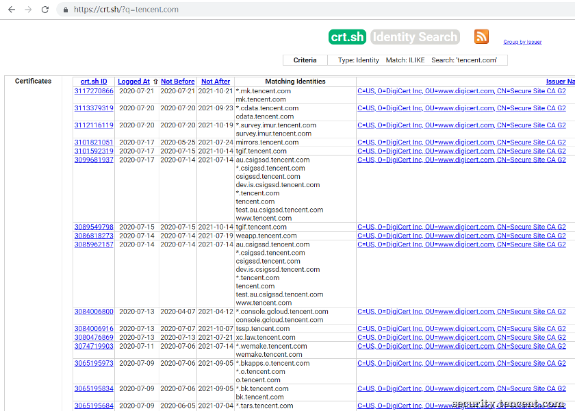  

  
  
**2、常规检查收集子域** 

2.1 域传送  
  

**原理：**  
域传送操作是指备用服务器向主服务器查询来刷新自己的Zone数据库，保证数据一致性。此操作的目的是为了防止主域名服务器因意外故障变得不可用时影响到全局。正常情况下,只有在网络里存在备用域名 DNS 服务器时，DNS区域传送操作才有必要执行。一旦DNS服务器被错误地配置成任何人发出请求，都向其提供Zone数据库的拷贝，就会被攻击者利用。 

  
**实现方法：** 

> 1.dig命令  
> 如dig @ns2.xxx.com xxx.com axfr  
> ns2.xxx.com为提供数据的服务器，xxx.com为要传输的关键字，axfr为区域传输选项。

>   
> 2.python中dns库  
> xfr = dns.query.xfr(where=server, zone=self.domain, timeout=5.0, lifetime=10.0)  
> zone = dns.zone.from\_xfr(xfr) 

**存在问题：**   
一般情况下，DNS服务器都配置正确，关闭了dns传输或设置了白名单，漏洞利用成功的概率较低。  
  
2.2 站点配置文件  
  

**原理：**  
信息泄露问题主要就是某域名下的一些文件会存储与其相关的一些域名，如子域名。此类文件包括跨域策略文件crossdomain.xml， sitemap文件。  
  

**实现方法：**  
建立文件列表，拼接域名后直接访问，判断改文件是否存在。若存在则提取数据，若不存在则跳过。 

  

> 1\. crossdomain.xml文件  
> 直接访问crossdomain.xml路径 

>   
> 2\. sitemap文件  
> 直接访问sitemap.xml、sitemap.txt、sitemap.html、sitemapindex.xml、sitemapindex.xml路径

  

**存在问题：**  
文件往往不存在，即使存在，域名信息也不够多不够完全。  
  
2.3 检查内容安全策略  
  

**原理：**  
内容安全策略（CSP，Content Security Policy）是一种声明的安全机制，可以让网站运营者能够控制遵循CSP的用户代理（通常是浏览器）的行为。通过控制要启用哪些功能，以及从哪里下载内容，可以减少网站的攻击面。CSP的主要目的是防御跨站点脚本（cross-ste scripting，XSS）攻击。例如，CSP可以完全禁止内联的JavaScript，并且控制外部代码从哪里加载。它也可以禁止动态代码执行。禁用了所有的攻击源，XSS攻击变得更加困难。CSP中的关键字有default-src、img-src、object-src和script-src。其中\*-src可能会存在域名信息。 

  
**实现方法：**  

> 1.手动抓包获取  
> HTTP header的Content-Security-Policy属性

>   
> 2.Python的Requests获取  
> import requests  
> res = requests.post(url=url, headers=headers, data=data, allow\_redirects=False)  
> if not res.headers\['Content-Security-Policy'\]:  
> print("There is no Content-Security-Policy in the header")  
> else:  
> \# 处理主体代码

  
2.4 利用DNS查询收集子域  
  

**原理：**  
通过枚举常见的SRV记录并做查询来收集子域srv，以及通过查询域名的DNS记录中的MX,NS,SOA,TXT记录来收集子域。  
  

**SRV记录：** 添加服务记录服务器服务记录时会添加此项，SRV记录了哪台计算机提供了哪个服务。格式为：服务的名字.协议的类型（例如：example-server.tcp）。  
以下命令枚举给定域名的SRV记录:  
nmap --script dns-srv-enum.nse --script-args "dns-srv-enum.domain='google.com'" 

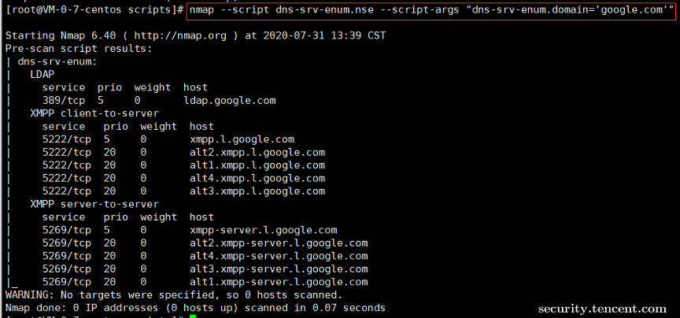  

   
**MX记录：** 建立电子邮箱服务，将指向邮件服务器地址，需要设置MX记录。建立邮箱时，一般会根据邮箱服务商提供的MX记录填写此记录。  
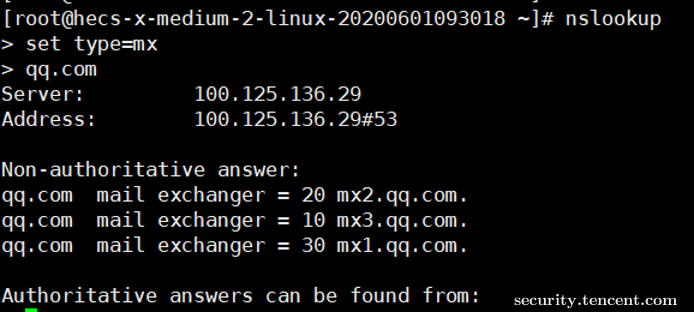  

**NS记录：** 域名解析服务器记录，如果要将子域名指定某个域名服务器来解析，需要设置NS记录。  
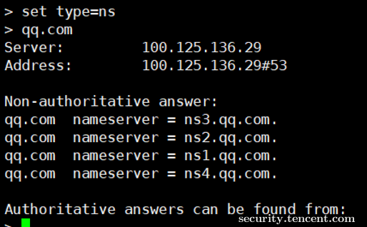  
  
**SOA记录：** SOA叫做起始授权机构记录，NS用于标识多台域名解析服务器，SOA记录用于在众多NS记录中那一台是主服务器。  
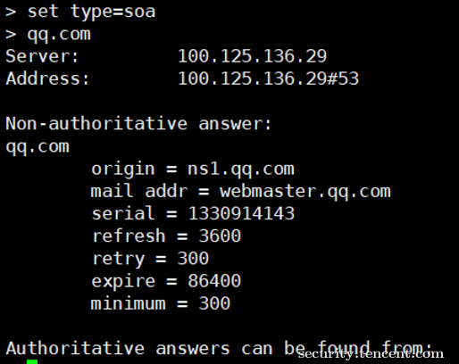  
  
**TXT记录：** 可任意填写，可为空。一般做一些验证记录时会使用此项，如：做SPF（反垃圾邮件）记录。  
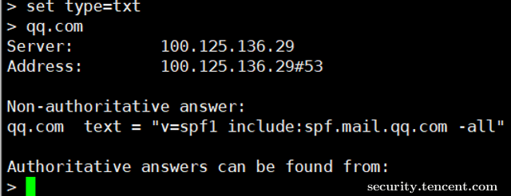  
  
  
**3、利用DNS数据集收集子域** 

利用DNS记录公开数据收集 

  
（注：将需要{domain}换成需要查询的域名，标★的是我们认为效果较好的） 

> ★（1）ip138：https://site.ip138.com/{domain}/domain.htm  
> ★（2）百度云观测：http://ce.baidu.com/index/getRelatedSites?site\_address={domain}  
> ★（3）hackertarget：https://hackertarget.com/find-dns-host-records/  
> （4）riddler：https://riddler.io/search?q=pld:{domain}  
> （5）bufferover：https://dns.bufferover.run/dns?q={domain}  
> ★（6）dnsdb：https://dnsdb.io/zh-cn/search?q={domain}  
> （7）ipv4info：http://ipv4info.com/  
> （8）robtex：https://www.robtex.com/dns-lookup/  
> （9）chinaz：https://alexa.chinaz.com/  
> ★（10）netcraft：https://searchdns.netcraft.com/  
> （11）dnsdumpster：https://dnsdumpster.com/  
> （12）sitedossier：http://www.sitedossier.com/  
> ★（13）findsubdomains：https://findsubdomains.com/

  

**4、利用威胁情报平台数据收集子域** 

  
(注：将需要{domain}换成需要查询的域名, 以下平台均需注册，注册后免费试用) 

  

> (1) https://otx.alienvault.com/api/v1/indicators/domain/{domain}/{section}  
> {section}指其他指令动作，可参考Docs关于API的使用说明。  
> https://otx.alienvault.com/api/v1/indicators/domain/qq.com/url\_list  
>   
> (2) https://community.riskiq.com/search/{domain}/subdomains  
>   
> (3) https://x.threatbook.cn/nodev4/domain/{domain}  
> API：https://api.threatbook.cn/v3/domain/sub\_domains  
>   
> (4) https://www.threatminer.org/domain.php?q={domain}  
>   
> (5) https://www.virustotal.com/ui/domains/{domain}/subdomains  
> 或者https://www.virustotal.com/gui/domain/{domain}/relations  
>   
> (6) https://pentest-tools.com/information-gathering/find-subdomains-of-domain#

  

  
**5、利用搜索引擎发现子域**  
  

**(1) 谷歌搜索语法—site**  
当使用site提交查询时，Google会将查询限制在某个网站/某个域下面进行，此时配合其他指令效果更佳，如使用减号“-”来排除不想要搜集到的域名。  
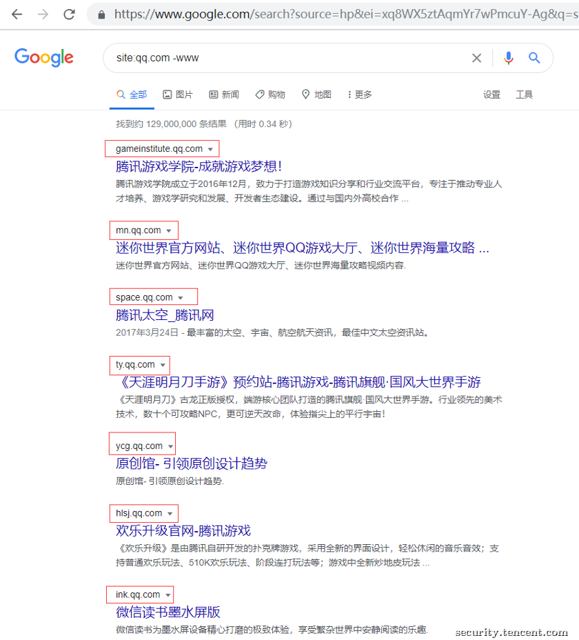  
  
**(2) Site:x.x.x. \*(目标IP)**  
当我们获取到了子域名的真实ip后，可以尝试搜索site:x.x.x.\* 进行C段搜索，通过这种方法也能找出很多有价值的其他相关域名。经笔者尝试，这种方法在搜狗、谷歌搜索引擎上使用有效，谷歌搜索引擎效果更好。  
如图：  

  
  
**6、域名备案搜集资产**  
  

**原理：**  
在对一些大型的目标进行信息搜集时，还可以通过查找域名备案信息来发现同备案的其他域名资产。如搜集qq的子域名时，最常见的即为对qq.com进行子域名搜集，此时就会遗漏其余顶级域名资产。  
查询网址：www.beianbeian.com  
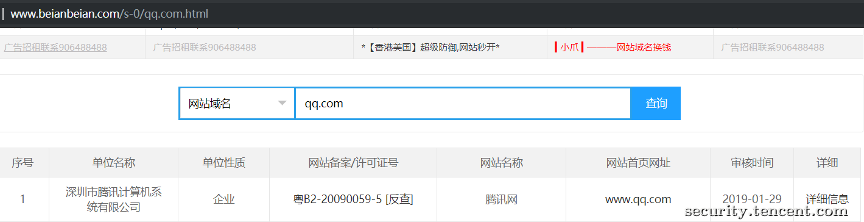

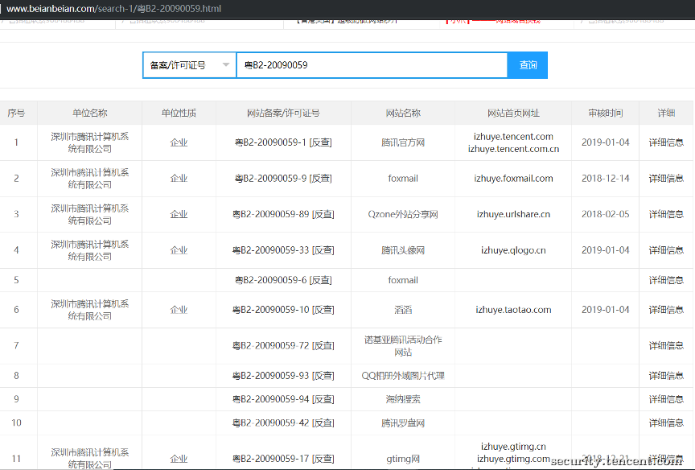  
  
如上图通过查询qq.com的网站备案/许可证号，再对其进行反查，即可发现qq.com同备案的其他顶级域名资产。  
通过域名备案查找同备案的其他域名资产，**能够更全面的搜集目标资产信息，提升发现漏洞的概率。  
**  
**7、whois查询和关联查询**  
  

工具：站长工具  
在此我们以facebook.com做演示，如何进行whois查询和反查 

  
1) 查询whois 

http://whois.chinaz.com/facebook.com  
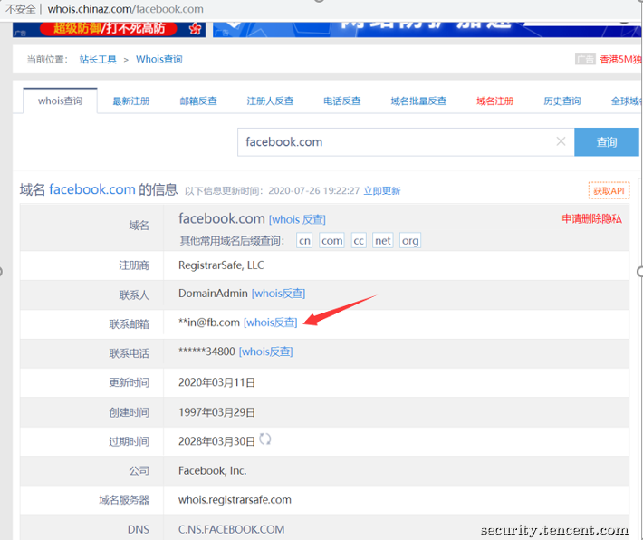  
  

2) 反查whois 

http://whois.chinaz.com/reverse?host=\*\*in@fb.com&ddlSearchMode=1&domain=facebook.com  
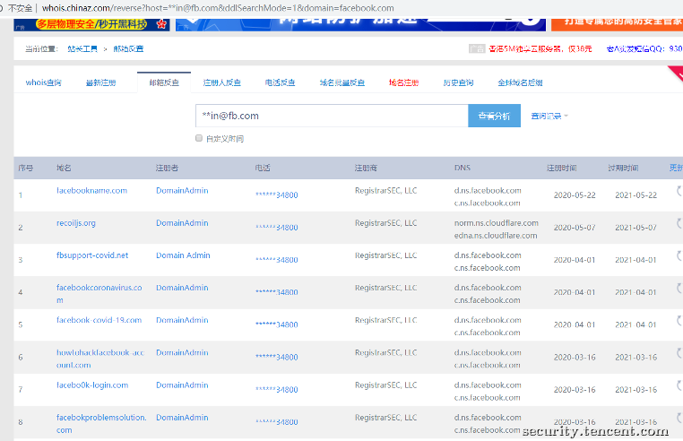  
获得关联域名信息。 

  

**8、域名爆破**

   
爆破的原理其实是通过枚举的方式来实现的，通过不断的拼接字典中的内容去枚举域名的A记录，但是该方法一般需要解决泛解析问题。比如开源工具oneforall会首先访问一个随机的并不存在的域，通过返回结果判断是否存在泛解析，确定存在泛解析以后，程序会开始不断的循环产生随机域名，去向服务器查询，将每次查询到的IP和TTL记录下来，直到大部分的IP地址出现次数都大于两次，则IP黑名单的收集结束，在得到了IP黑名单以后，oneforall接下来会将自己的字典中的每一项和要指定查询的域名进行拼接。在爆破过程中根据IP黑名单进行过滤。但这种宽泛的过滤容易导致漏报，所以oneforall将 TTL 也作为黑名单规则的一部分，评判的依据是：在权威 DNS 中，泛解析记录的 TTL 肯定是相同的，如果子域名记录相同，但 TTL 不同，那这条记录可以说肯定不是泛解析记录。 

  
**二、优秀开源工具** 

我们调研了市面上多款开源的子域名收集工具，列举多款优秀工具的功能和优点。在此以tencent.com为例收集其子域名．简单对比各工具的性能和效果。 

  
**工具名称：oneforall**  
**项目地址：**https://github.com/shmilylty/OneForAll  
**工具描述：**oneforall是近几年出现的比较优秀的子域名收集工具之一，目前还在不断地进行更新优化。这款工具集成了各种域名信息收集的“姿势”，手段可谓是非常全面了。包括利用证书透明度、常规检查、利用网上爬虫（正在实现）、DNS数据集、DNS查询、威胁情报平台、搜索引擎等，但笔者发现它对域名泛解析的处理还不是特别理想，存在较多误收集，同时存在用时较长等缺点。  
  
**工具名称：SubdomainBrute  
项目地址：**https://github.com/lijiejie/subDomainsBrute  

**工具描述：**李劼杰的SubdomainBrute是业内比较出名的子域名收集工具了，工具采用协程加快爆破速度，使用114DNS、百度DNS、阿里DNS这几个快速又可靠的公共DNS进行查询。准确率高，效果比较好。但对泛解析的处理规则是：超过10个域名指向同一IP，则此后发现的其他指向该IP的域名将被丢弃，该方法可能存在误删，但不可否认的是，该规则在一定程度上简便有效。  
  
**工具名称：ESD**  
**项目地址**：https://github.com/FeeiCN/ESD  
**工具描述：**ESD的爆破速度极快，62万条数据只用了4分30秒左右，这款工具存在的缺点之一就是对性能要求高，１G２核的服务器CPU占用率达100%。除此之外，输出的结果也比较不稳定，同一网络下对同一域名进行收集，几次结果数量都不一样。  
  
**工具名称：subfinder**  
**项目地址：**https://github.com/projectdiscovery/subfinder  
**工具描述：**使用subfinder来进行子域名信息的收集，它的输出结果多、基数大、速度快，并且输出格式多，便于后续处理（oneforall也有相同的优点）。  
美中不足的就是此工具无爆破功能，被动源相比其他工具来说较少。  
  
  

**三、各工具效果对比**  
  

各工具优缺点与功能对比如下：  
  

（注：因各工具提供的默认字典是不同的，字典往往需要自行定义才能发挥更大作用，故各工具下载后均不做修改，使用自带默认字典进行爆破。使用单一域名测试不具有普遍性，爆破结果仅供参考。）  
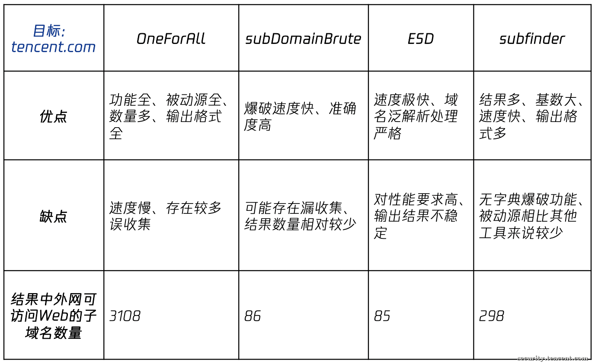  

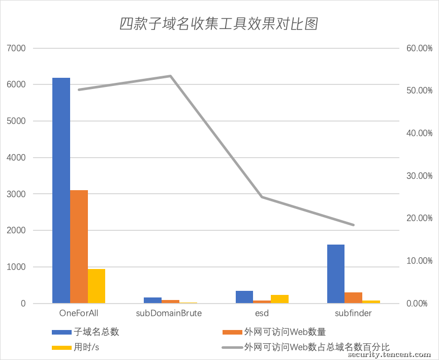  

  
　　按照上图，单从数据层面上看，四款工具中OneForAll的表现比较突出，而李劼杰的subdomainBrute表现也算优异，可访问子域名数的百分比和时间都很优秀，美中不足的就是爆出的子域名相对较少。

 **四、子域名收集常见问题**  
  

**1、DNS缓存问题**  
对于不同的DNS服务器，其缓存策略可能不同，其缓存结果也可能会存在差异，导致在域名查询时获取到未及时更新的解析结果。通常情况下，要解决上述问题需要进行多次DNS查询来迫使DNS服务器刷新缓存，从而获取正确的结果。这无疑增加了泛解析判断和子域名爆破的难度。 

  
其实这个问题在OneForAll中也未能得到较好的解决。在判断是否存在泛解析问题时，OneForAll使用了函数 detect\_wildcard(domain, ns\_ip\_list)，在该函数里面，OneForAll是通过使用不存在的子域名进行查询，从而判断是否存在泛解析。但是只进行一次判断就下决定是不够准确的，可能导致误判。  
  
**2、“死板”的字典**  
爆破是子域名收集方法的重要组成部分，对于大部分的这类工具而言，字典的好坏决定了最终的爆破效果。但大部分的字典仅仅只是遍历字符集，使用常用的高频词而不进行及时的更新。当字典文件太大时爆破速度就变得非常慢，并且低效率的字典即使再大也达不到理想的效果。  
  

在实际进行域名爆破的时候，一个能够自动更新的字典无疑会比普通字典效果更好，在此我们提出一种字典自动更新的方案。  
  

**五、动态字典** 

在本节我们对字典自动更新的方案进行较为详细的阐述，具体可分为三个步骤：对词语的权重进行更新——删除原字典中权值低的词——从数据集中提取高频词语加入字典,以此实现字典的更新。 

  
**测试工具：Subdomainbrute**  
流程图如下：  
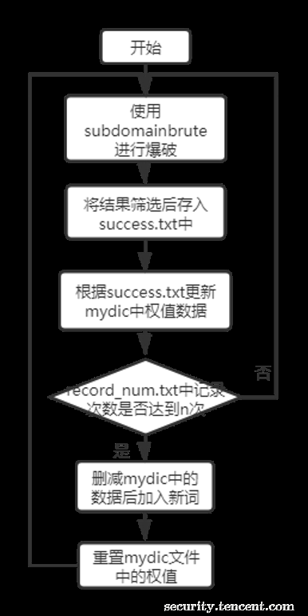  
  
**1、 权值更新**  
首先，利用工具subdomainbrute及其默认字典进行子域名爆破，将得到的结果利用如下脚本进行进一步批量检测，判断该域名是否外网可访问，并将能够外网正常访问的域名保存到success.txt中。  
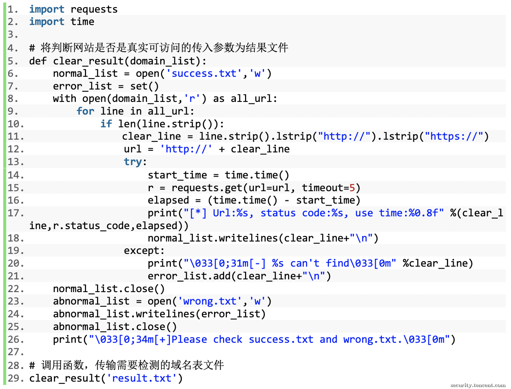  
  
接下来，将mydic中词语的权值全部初始化为0。然后比对success.txt中的三级域名，将mydic中对应词语的权值+1，其他词语权值不变。此外需要记录下本次所查询的域名，以后查询相同域名的时候，不再重复更新mydic中词语的权值。 

  
（注：mydic用于记录字典中词语及对应权值，格式形如www,0）  
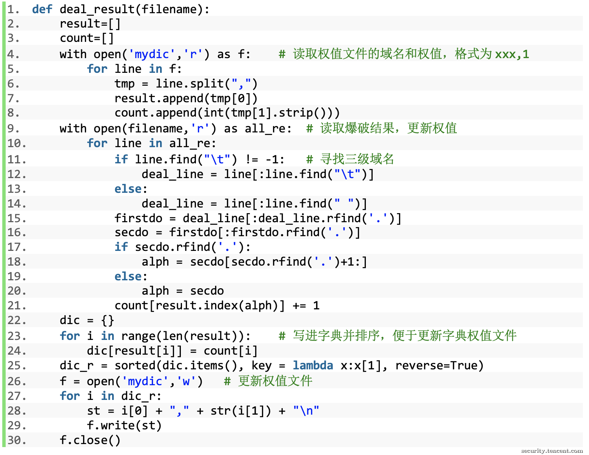  
  
**2、词语删除** 

  
在使用该字典对不同域名进行n次爆破（如20次）以后，开始对字典进行更新，即对字典中的词语进行删除操作。具体步骤如下： 

  
首先，使用record\_num.txt文件记录字典使用的次数。当record\_num.txt文件不存在时则生成，每查询不同的域名使用次数+1，重复查询相同域名只算作一次。  
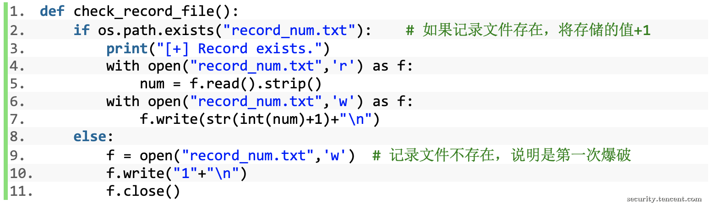  
  
程序每次运行结束后，判断是否需要重置mydic。若需要更新，则先删除record\_num.txt文件，然后对mydic中的数据按照权值大小进行排序，排序完成后删去底部的30%数据。

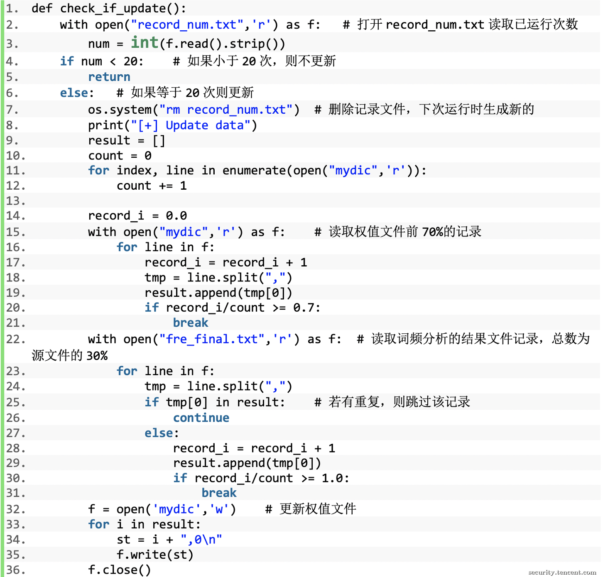  
  
**3、字典更新**  
在删除了原字典30%的值以后，需要补充新的值到字典中。我们解析opendata.rapid7.com上的公开DNS记录来更新自己的字典。由于下载的数据集大小一般有几十个G，难以直接处理，所以我们先对数据进行切割以减小处理的难度。首先将数据集分割为每个大概100MB的数据文件，然后从这些数据文件中随机抽取一部分，提取出里面的所有子域名，拼接成为字典的“数据源”。将提取出来的子域名数据进行词频分析，并将其中的内容按照出现的频率从大到小进行排序。选择出现频率最高的值加入字典中，直到新字典的大小与旧字典相同为止。最后，需要将新字典中的所有值的权重清零。  
  
  
**六、总结** 

  
1、除了使用爆破工具外，子域名收集的方法还有很多。比如域传送漏洞、DNS查询等常规手段，还有利用证书透明度、DNS数据集、威胁情报平台、搜索引擎、域名备案和whois查询。综合来看，在这些方法中威胁情报平台效果最好，证书透明度和DNS数据集次之。  
2、在本篇文章中我们还对业内较为优秀的几款工具作了研究、对比。在对tencent.com的子域名收集测试中，subfinder和OneForAll的表现较为突出。  
3、子域名收集存在的一些主要问题是域名泛解析、不同线路解析出不同IP、子域名爆破时字典的效率不高等。  
4、针对字典的问题，我们提出了一种字典自动更新的方案。 

  
网上关于子域名收集的方法、工具都很多，但实际运用时结果都不够理想、全面。要想获得一份高效、有价值的子域名列表，需要我们结合不同的方法，合理地运用工具进行收集。  
  

为了方便在实战环境中使用，我们将大部分常用的方法都梳理整合到了这篇文章中。作为学习的记录，本文可能存在些许纰漏，如有错误，欢迎指正。希望大家与我们一起，探索更多更高效子域名收集方法，共同学习共同进步。  
最后，也非常感谢导师leon老师和小五老师的帮助和指导。  
  
  
**附录：**  
  

> Google证书透明度项目 https://www.certificate-transparency.org/  
> 枚举子域名 https://feei.cn/esd/  
> DNS域传送漏洞 http://www.lijiejie.com/dns-zone-transfer-1/  
> 史上最全的子域名搜集方法：https://www.cnblogs.com/bighammerdata/p/13268624.html
