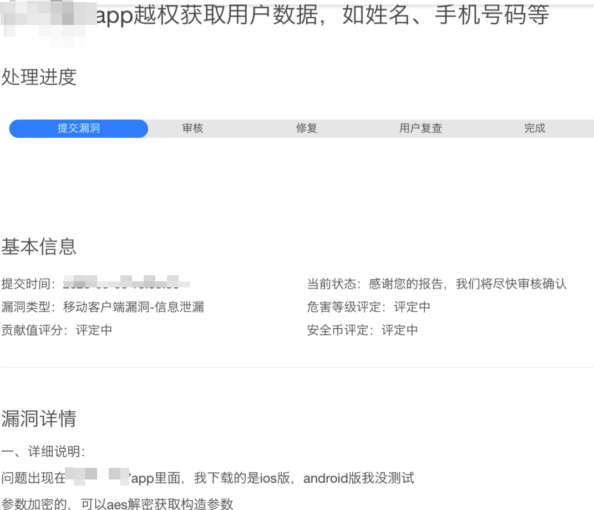
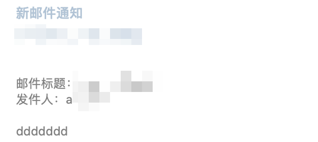

# 红蓝对抗之邮件钓鱼攻击

作者｜ 安平蓝军 jumbo

**红蓝对抗越加普遍及重要，甚至成为了大型赛事，随之⽽来的是防守方大量部署安全设备**，如FW、WAF、IDS、IPS等，想要从Web端深⼊到对⽅内⽹已经困难重重。但是，**⼈永远是最⼤的弱点，在日渐增多的防护设备⾯前，钓⻥攻击（Phishing）已经成为对抗中⼀种必不可少且非常有效的攻击⼿法**（近期也见到实际攻击中针对HR的邮件钓鱼攻击），一旦有人中招，攻击队就直接能进⼊目标办公⽹，这也是钓⻥的魅⼒之⼀。其实钓鱼攻击也一直是APT高级持续威胁的主要打点手段，网络上公开的APT攻击案例中超过80%都使用钓鱼攻击。

本⽂将以**腾讯蓝军**真实项⽬中的一部分细节为⼤家介绍⼀些钓⻥⼿段和钓⻥话术。

# 一、钓鱼手段

## 1.1 lnk

lnk文件，简单理解为快捷方式，创建方式如下：

下图为calc.exe的快捷方式的属性信息，我们可以在“目标”栏写入自己的恶意命令，如powershell上线命令：

而在实施钓鱼过程中，对于我们的calc.exe的快捷方式来说，一个大大的计算机ico图标，显然看起来不像一个好玩意，因此可以尝试在“属性”中去更改该文件的图标：

但是用系统自带的ico去做文件图标替换的话，有个弊端，即当替换的ico在目标机器上不存在时，就会出现类似空白ico图标：

根据crazyman师傅所说，修改lnk的icon\_location标志位，修改为相关后缀，系统即可⾃动联想到对应的打开⽅式：

⽐如我的pdf默认是由edge浏览器打开，则在icon\_location中设置为pdf后缀时，⽂件的ico也会自动显示为edge浏览器打开的图标， 这样可以达到**⾃适配**的效果：

当受害者中招打开我们的所谓的pdf，实则为恶意的快捷方式时，双击两下，什么反应都没有，可能会有一丝疑惑，因此可以当尝试用powershell、mshta等方式上线时，我们可以更改如cobaltstrike生成的代码，加上一段自动下载打开一份真的pdf，来达到逼真的效果。

下面的动图，展示了打开一个快捷方式钓鱼文件时，逼真的打开了真实的简历，然后在背后悄悄的上了线：  

## 1.2 宏

在word中可以植入宏来达到运行宏上线的目的，而cobaltstrike也正好自带了这种攻击方式：

然后在word的视图功能中植入相关宏：

但是此种办法有个弊端，就是宏代码是存在本地的，极易被杀软查杀。

因此我们可以尝试使用远程加载模板的方式在进行宏加载。我们可以更改word中\\word\_rels\\settings.xml.rels内容来加载远程模板，加载远程模板打开word会有类似如下提示：

成功加载远程模板：

并且，像cobaltstrike⽣成的宏代码，使⽤的是AutoOpen进⾏触发，这⾥可以尝试使⽤AutoClose，即关闭word时触发来达到⼀些杀软、沙箱的绕过：

利⽤远程模板，因为不具备恶意宏代码，文件本身成功绕过了某杀软,并且cobaltstrike上线也毫无阻拦： 

## 1.3 RLO

Rlo，即Right-to-Left Override,我们可以在文件名中插入此类unicode字符，来达到文件名反转的效果，如下图就是一个插入Rlo字符后的文件名，看后缀是个txt：

但是看文件详情又是个scr文件：

下图展示了打开一个看似是png图片后缀的文件，却执行了notepad：

## 1.4 自解压

rar压缩文件，可以把文件进行压缩，然后运行后进行自解压的操作：

如果我们把一个恶意的文件和一个图片组合在一起，打包运行后，程序进行自解压，看到的是一张图片，但是后面木马程序已经悄悄运行了，这种效果如何？看下面的动图展示：

## 1.5 自解压+RLO

上面介绍了自解压和RLO，那如果两者组合在一起呢？

我们把pe文件反转成png后缀、修改pe文件的ico图标，最后实施自解压操作。即看起来是个图片，后缀也是个图片，打开也是个图片，效果如何呢？

## 1.6 回执

当我们想要对从⽹上收集到的邮箱进⾏邮件钓⻥时，⼀⼤堆邮箱，怎么确保对应的邮箱依然存活，⼜或者说哪些邮箱的钓⻥成功率⾼点？这时候就需要⽤到邮箱的回执功能，当开启回执时，我们的邮件被对⽅已读时，我们就会收到⼀份回执信息：

这种情况下，我们就可以对已读的邮箱进⾏深⼊钓⻥。

# 二、钓鱼话术

上面提到了很多钓鱼攻击手段，但是就如word宏章节，如果不依赖漏洞的情况下，如何让对方点击启用宏，如何让对方信任你的文件，都需要话术的支撑。下面就来看看钓鱼的一些话术和手段。

## 2.1 SRC假漏洞

当⽬标企业存在类似SRC漏洞奖励计划时，我们可以去提交⼀个假漏洞，并把恶意⽂件附在其中，并说是漏洞复现程序：

有些同学就会说了，对SRC安全技术人员进行钓鱼，这不是⾃投罗⽹吗。当然，钓⻥安全⼈员，成功率极低。但是换位思考下，如果你是SRC审核⼈员，⼀个⽩帽⼦提交了核⼼应⽤，且有图有真相的漏洞复现截图的时候，这种情况下，明知道可能有恶意⽊⻢的⻛险，也不得不去冒险，因为如果这是⼀个真的大漏洞的话，不及时处理可能会造成极大坏影响。

这里为了保证“漏洞”的有效性，特地让程序随机吐出看似逼真的数据，SRC审核⼈员，你还敢点击⽩帽⼦的复现⼯具吗？

当SRC审核⼈员迟迟不点击的时候，可以施加压力，站在更高的角度上来进⾏“漏洞督促”：

## 2.2 简历

简历投递是一个百试不爽的钓鱼话术手段，从腾讯蓝军进行的远程办公安全演习也能窥之一二。

这里再提一句，一定要逼真，比如在简历钓鱼邮件中，可以留上你的名字、手机号码、学校等信息。

我们讨论下，**为什么简历投递钓鱼在腾讯蓝军的远程办公安全演习、其他红蓝对抗项目中效果出类拔萃呢？**我觉得有如下几点：

1、首先，我们的邮箱从哪里来？邮箱收集可以从领英、v2ex、搜索引擎等渠道获取，那为什么会在上述地方出现邮箱地址？**大多数原因都是用人单位急招人，项目急需人**，因此会在各平台留下简历投递的邮箱，而又正好被攻击者获取，而受害者又相信投递者都是善良的，还能解决**招人的燃眉之急**，在这种情况下，提高了简历投递钓鱼的成功率；

2、如果你的简历邮件写的足够漂亮，对于一个公司、面试官来说，**一个好的人才，怎能轻易放过？**

3、别忘了，**收简历的人大多数是什么人，是HR**。那我们继续想想，为什么HR不提防？首先，HR大多数是女生，女生比较善良、不设防，又非技术人员，这两者组合在一起，绝对是属于安全意识最薄弱的人之一了；

4、**简历拥有分发属性**。我们在多次钓鱼项目中发现，当你投递的简历到非对应项目人的邮箱里时，他会帮你转发，甚至有些热心的HR还会帮你录入到内部人才库，这相当于一下子从不可信变成内部可信了，这也是简历投递钓鱼有意思的地方。

## 2.3 宏钓鱼

在上面钓鱼手段中的宏钓鱼攻击中，如何让受害者点击允许运行宏呢？

我们可以尝试使用如下手段，背景为一个虚化的简历图片，然后在上方再加上一段文字，意思告诉受害者，这是一份简历，但是因为你没点击宏运行，所以看不清，要想看清，请点击运行宏。

## 2.4 合作

合作是一个公司必不可少的业务之一，我们可以在网站下方找一些合作邮箱，以合作的名义去进行合作邮件钓鱼。

并且，在下面的案例中，**笔者伪造的公司是跟受害者公司是一个区域的**，因为如果你随便找了个其他地域的公司，受害者公司业务没覆盖到那边的话，很可能就不会理会你的邮件。

## 2.5 可信站点附件中转

我们进行钓鱼攻击时，会常常把木马直接放在邮件正文中，但是对方邮件网关可能有杀软沙箱，会拦截带有恶意文件的邮箱，这时候可以尝试对文件进行加密处理。

除了加密处理外，还可以使⽤可信站点作为中转，⽐如我准备钓⻥的员⼯是{domain}.com公司下的，那如果我们把附件传到\*.{domain}.com域下的话，当对⽅看到下载地址是{domain}.com域的话，下载点击的成功率是不是更⼤了点呢？是不是有点像XSS？

## 2.6 技术交流

技术人员，最喜欢的莫过于有个志同道合的朋友一起交流技术。

下图钓鱼话术手段，就是伪造一个**跟受害者研究同个技术**的技术交流邮件，来进行钓鱼欺骗：

## 2.7 钓鱼网站

如果能获取到对方的账号密码，那肯定是极其不错的。

常见的话术有：

1、大型安全演习期间，请打补丁；

2、公司福利活动，请登录下载领取；

……

这次我们的钓鱼手段为想要获取该公司使用的某个平台的账号密码，因此我们发的钓鱼邮件是跟该平台有所关系，即平台升级：

并且购买一个相似域名，编写一摸一样的登录页面：

并且访问后做**引导**，告知让他登录更新：

发现该平台使用了多因子认证，Token还有1分钟有效期，因此再次编写监控程序，当监控到有人输入账号密码，就进行邮件提醒，最后，顺利获取到受害者的账号密码：

## 2.8 第三方平台

很多公司都会在比如拉勾网、智联招聘进行工作招聘，这种情况下，我们也可以在这些第三方平台上，与面试者面对面的沟通交流，取得信任，最后进行钓鱼攻击：

## 2.9 加好友

在日常生活中，只有你多跟别人沟通，人家才会愿意跟你聊天，钓鱼亦然。

我们可以多加些受害者的项目群、聊天群，甚至是加里面的好友，多聊聊天，让大家记住你，觉得你是个“好人”，就可以为后续的钓鱼做铺垫，提高钓鱼成功率：

下面的图片展示了当与受害者“交流沟通”一段时间后，已经完全“掌控”了对方，甚至对方在周末问我要简历时，为了防止客户机周末不间断的关机休眠，特地美名其曰的说不想打扰到对方，等到工作日再投递相关木马：

总结：

钓⻥⼿段层出不穷，了解钓⻥⼿段是在攻防演习⼤环境下必不可少的技能之⼀。本⽂从真实项⽬中提取出来的钓⻥⼿段、钓⻥话术给读者介绍了钓⻥中的管中窥豹。

⼈永远是最⼤的弱点，未知攻，焉知防。以攻促防希望能给安全建设带来帮助，祝愿人人都可以识别骗局，保护好自己和公司。

文中涉及的全部信息，只限用于技术交流和安全教育，切勿用于非法用途。
