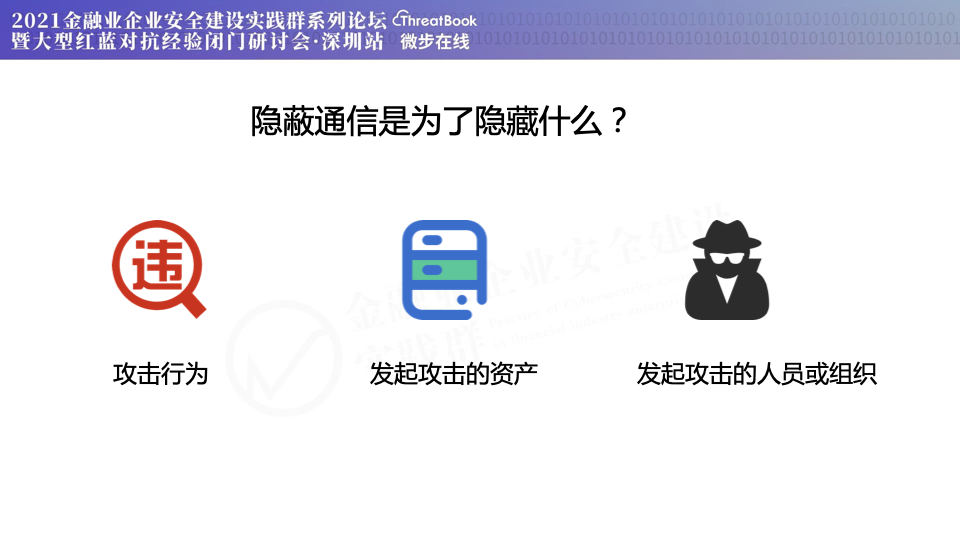
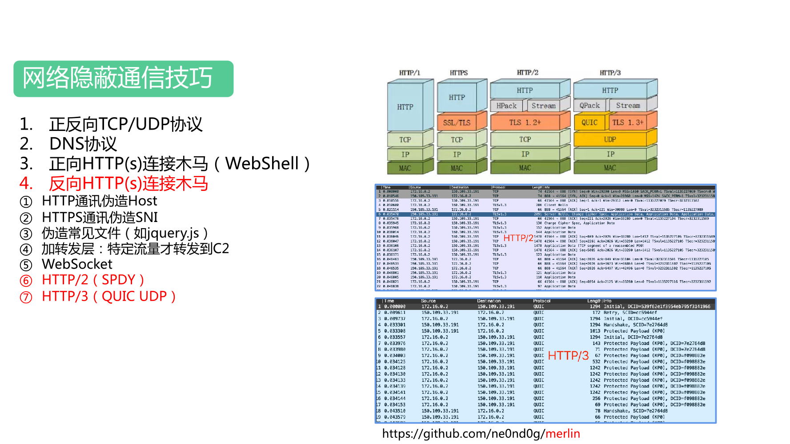

# 红蓝对抗之隐蔽通信应用及防御

笔者最近参加聂君和郭威两位资深安全人士主办的“2021金融业企业安全建设实践群系列论坛暨大型红蓝对抗经验闭门研讨会（深圳站）”学习网络安全建设经验，受益匪浅。会上笔者也分享了隐蔽通信应用及防御的相关内容，很高兴收到不少安全同行反馈说“议题内容对我们安全建设有很大的帮助，有不少信息是之前没有了解过的”。为了让更多企业单位更全面了解攻击者多样化的隐蔽通信手段以及更好的完善防御，笔者也将演讲稿分享出来，这些也是腾讯蓝军和红军在十多年的对抗中长期保持调研学习业界案例和经验、总结沉淀并延伸的成果，希望可以给行业带来帮助，也请大家不吝指正。

非常感谢国内外广大安全从业者的无私分享，PPT里面一部分图片也是引用于网络，推荐读者对每一章节都完整阅读“PPT截图内容”+“演讲口述内容”+“参考链接内容”，这样可以更加深入掌握相关信息。

OK，咱们开始。

**首先需要了解隐蔽通信到底是为了隐藏什么？**站在攻击者的角度看，隐藏自己的攻击行为和路径，让对方察觉不到已经被入侵，假设对方发现了攻击行为，那么也要让对方定位不到发起攻击的资产，再假设对方定位到了真实攻击源，那么也要让对方定位不到与现实关联的人或组织。

接下来从4个部分进行分享，首先是简单回顾下有哪些远程控制木马和软件，然后详细分析黑客所使用的网络隐蔽通信技巧，再说说其他需要注意的，最后聊聊缓解和检测措施。

# 第一部分：远程控制木马/软件

最早的时候是功能单一的正向或反向shell，主要以TCP、UDP通讯为主，大家可以看到各种脚本工具的一小段代码都可以实现这个功能。

然后发展到专业的CS远控木马，主要协议方面除了TCP、UDP，还有HTTP(S)和DNS等，国内第一款相关软件是由黄鑫前辈在1999年开发的冰河，让国内早期安全从业者很便捷地开展安全研究。大量新的远控木马不断涌现，各有千秋，目前使用量比较大的是国外的CobaltStrike和Metasploit。

然后是WebShell木马，从早期的比如海洋顶端ASP木马、lanker/lake2一句话WebShell到现在常见的菜刀、蚁剑、冰蝎等，由于没有开启新端口，传统网络防火墙无法检测和阻断通信，需要部署Web防火墙来应对。

最后是正规的远程控制软件，比如RDP、SSH、VNC、TeamViewer等等，有些企业本身就使用这些软件，那么攻击者同样使用这些就可以很好地隐藏恶意行为流量。

# 第二部分：网络隐蔽通信技巧

最常见的是TCP协议，使用简单并且通信稳定，在一些企业里无论是出站还是入站，常常只允许特定的端口进行通讯，比如80、443，那么攻击者也会使用这些端口在一定程度上绕过端口封锁。另外UDP也经常被忽视，无论是防火墙的限制规则还是网络入侵检测系统，缺乏拦截和检测。左下两个图是普通的反弹shell，可以看到是明文内容，为了躲避流量内容检查，攻击者还常进行加密，由右边俩图。

> 更多参考资料：  
> [https://github.com/swisskyrepo/PayloadsAllTheThings/blob/master/Methodology%20and%20Resources/Reverse%20Shell%20Cheatsheet.md](https://github.com/swisskyrepo/PayloadsAllTheThings/blob/master/Methodology%20and%20Resources/Reverse%20Shell%20Cheatsheet.md)

DNS协议目前用的也很多，它可以利用TXT、CNAME、A等多种记录类型进行传输数据，而且利用DNS递归特性可以突破流量出站限制，流量先经过内网DNS服务器，再到外网权威DNS服务器，再到黑客服务器。另外如果使用直连黑客DNS服务的方式还可以伪造高信誉域名，比如右上图，可以看到查询的是google.com子域名。由于DNS是明文通讯，缺少保密性，黑客还会利用新兴的加密方案DNS-over-HTTPS（DoH）和DNS-over-TLS（DoT），DoH实现方式就是客户端通过HTTPS协议与DoH服务商进行通讯，由DoH服务商代为使用DNS协议去解析域名，再把结果返回给客户端，比如左下图就是使用了Google的DoH服务进行DNS查询，右下图是真实木马通讯，流量上只能看到访问了dns.google.com，但看不到具体查询了什么域名，所以隐蔽性是很高的。当然DNS通讯相对于其他协议来说速度是比较慢的，所以也常作为备用方案，如使用TCP通道作为首选通信，当无法连通时再启用DNS通道。

> 更多参考资料：  
> [https://github.com/iagox86/dnscat2](https://github.com/iagox86/dnscat2)  
> [https://github.com/sensepost/godoh](https://github.com/sensepost/godoh)  
> [https://github.com/SpiderLabs/DoHC2](https://github.com/SpiderLabs/DoHC2)  
> [https://sensepost.com/blog/2018/waiting-for-godoh/](https://sensepost.com/blog/2018/waiting-for-godoh/)  
> [https://community.rsa.com/t5/netwitness-blog/using-the-rsa-netwitness-platform-to-detect-c-c-godoh/ba-p/520484](https://community.rsa.com/t5/netwitness-blog/using-the-rsa-netwitness-platform-to-detect-c-c-godoh/ba-p/520484)  
> [https://dns.google.com/resolve?name=force.tencent.com](https://dns.google.com/resolve?name=force.tencent.com)  
> [https://github.com/curl/curl/wiki/DNS-over-HTTPS](https://github.com/curl/curl/wiki/DNS-over-HTTPS)

WebShell经历多年的演变发展，从原来文件体积大，功能固定，到现在大多数是一句话木马，功能灵活，同时体积小更容易插入到业务正常文件中。从文件落地到JAVA内存马，从BS架构的内容明文通讯到CS架构的内容加密通讯，无论是对抗主机层检测还是对抗流量层检测，隐蔽性都是大大提高的，从右边的演示图可以看到请求的文件在服务器上是不存在的，流量也是加密的。

> 更多参考资料：  
> [https://www.freebuf.com/articles/web/235651.html](https://www.freebuf.com/articles/web/235651.html)  
> [https://github.com/rebeyond/Behinder](https://github.com/rebeyond/Behinder)  
> [https://github.com/AntSwordProject/antSword](https://github.com/AntSwordProject/antSword)

HTTP(S)协议木马现在是很常用的，而其中一些伪造手段也是比较有效的。比如右上图中伪造HTTP通讯中的Host字段和资源名称，设置成高信誉的域名和文件名。比如右下图中伪造HTTPS请求中TLS握手的SNI（Server Name Indication）字段，也是设置成高信誉域名，这样网络入侵检测系统只能看到与高信誉域名进行通讯，但看不到通讯内容。再比如左下图是中间加一个转发层，只有特定的流量转发到C2，其他流量转发到合法网站，防止C2被发现。

> 更多参考资料：  
> [https://www.freebuf.com/news/189948.html](https://www.freebuf.com/news/189948.html)  
> [https://www.cnblogs.com/nul1/p/15113996.html](https://www.cnblogs.com/nul1/p/15113996.html)  
> [https://github.com/rsmudge/Malleable-C2-Profiles](https://github.com/rsmudge/Malleable-C2-Profiles)  
> [https://github.com/xx0hcd/Malleable-C2-Profiles](https://github.com/xx0hcd/Malleable-C2-Profiles)  
> [https://posts.specterops.io/a-deep-dive-into-cobalt-strike-malleable-c2-6660e33b0e0b](https://posts.specterops.io/a-deep-dive-into-cobalt-strike-malleable-c2-6660e33b0e0b)  
> [https://bluescreenofjeff.com/2016-06-28-cobalt-strike-http-c2-redirectors-with-apache-mod\_rewrite/](https://bluescreenofjeff.com/2016-06-28-cobalt-strike-http-c2-redirectors-with-apache-mod_rewrite/)  
> [https://www.anquanke.com/post/id/104784/](https://www.anquanke.com/post/id/104784/)

另外WebSocket也是比较容易被遗漏的，网上开源的WSC2项目比较有意思，它会注入到IE浏览器并与C2服务端进行HTTP WebSocket通讯，流量也是加密的，隐蔽性比较高。

> 更多参考资料：  
> [https://github.com/Arno0x/WSC2](https://github.com/Arno0x/WSC2)  
> [https://www.blackhillsinfosec.com/command-and-control-with-websockets-wsc2/](https://www.blackhillsinfosec.com/command-and-control-with-websockets-wsc2/)

还有HTTP2和基于UDP的HTTP3，这些也算是比较新的协议，很多网站还没有支持，所以其实一些网络入侵检测系统也并还没有去覆盖这些协议。右边两个抓包图是真实木马通讯情况，流量也都是加密的。

> 更多参考资料：  
> [https://github.com/ne0nd0g/merlin](https://github.com/ne0nd0g/merlin)  
> [https://zhuanlan.zhihu.com/p/102561034](https://zhuanlan.zhihu.com/p/102561034)

上面提到的HTTP(S)通讯可以很好的隐藏通讯内容，但是仍然会泄露IP地址，所以更加高级的技巧就是利用CDN服务来隐藏IP。首先最基础的方式就是攻击者注册域名和CDN，流量上看到的是CDN的IP，看不到C2的真实IP，但是仍会泄露C2恶意域名，容易遭拉黑域名。所以后来又出现配合其他一些技巧来进一步隐藏。

> 更多参考资料：  
> [https://cloud.tencent.com/product/cdn](https://cloud.tencent.com/product/cdn)  
> [https://infosecwriteups.com/finding-the-origin-ip-behind-cdns-37cd18d5275](https://infosecwriteups.com/finding-the-origin-ip-behind-cdns-37cd18d5275)

域前置技术在2010年开始流行，最早被用于翻墙，早期翻墙软件GoAgent就是利用这种技术，原理是什么呢？这其实是CDN的转发特性，大家可以看这两个请求，这两个请求都是wget访问google.com，但是第二个将请求头Host修改成youtube.com，成功访问了youtube.com，而从流量上看到TLS的SNI却是google.com，简单说就是客户端和CDN之间是使用google.com进行握手加密通讯，当CDN接收到请求后把流量转发给了Host指定的youtube.com。

> 更多资料参考：  
> [https://en.wikipedia.org/wiki/Domain\_fronting](https://en.wikipedia.org/wiki/Domain_fronting)

2015年国外安全研究员提出可以用于C2隐蔽通信，核心思想就是在HTTPS外层TLS通讯使用高信誉域名，内层Host使用攻击者域名。这种手段其实对企业防御来说是很难的，如果直接封堵高信誉域名或者CDN的全部IP，那么影响很大，可能导致服务不可用。比如之前Telegram就利用了谷歌和亚马逊的CDN域前置进行逃避俄罗斯封锁，最终俄罗斯不得不粗暴地封堵了1580万个CDN IP，导致包括银行在内的一些网站出现网络中断。另外，也有不少人认为域前置不一定要HTTPS通信，HTTP通信中Host使用高信誉域名也算域前置，这种是因为部分CDN厂商没有验证域名所有权，攻击者可以在CDN平台上随意登记高信誉域名进行利用。现在部分CDN厂商已经阻止域前置恶意利用，但仍有一些CDN可以被利用。

> 更多参考资料：  
> [https://www.icir.org/vern/papers/meek-PETS-2015.pdf](https://www.icir.org/vern/papers/meek-PETS-2015.pdf)  
> [https://evi1cg.me/archives/Domain\_Fronting.html](https://evi1cg.me/archives/Domain_Fronting.html)  
> [https://www.freebuf.com/articles/network/276159.html](https://www.freebuf.com/articles/network/276159.html)  
> [https://xz.aliyun.com/t/4509](https://xz.aliyun.com/t/4509)  
> [https://www.moonsec.com/archives/2928](https://www.moonsec.com/archives/2928)  
> [https://www.ntop.org/ndpi/how-to-detect-domain-hiding-a-k-a-as-domain-fronting/](https://www.ntop.org/ndpi/how-to-detect-domain-hiding-a-k-a-as-domain-fronting/)

HTTPS很好的隐藏了通信内容，但是并没有隐藏通信对象，从SNI可以看出和哪个域名进行通信。国外安全研究员在去年defcon会议提出域隐藏，利用TLSv1.3版本引入的ESNI来隐藏通信对象，不过目前ESNI还是IETF草案，只有个别CDN支持。流程是先通过DoH、DoT等方式先获取密钥，再对SNI进行加密得出ESNI，然后使用ESNI和CDN进行通信，这样从流量上就看不出是和哪个域名通信。因为隐蔽性确实比较高，目前一些国家防火墙已经直接禁止使用ESNI通信。

> 更多参考资料：  
> [https://www.zdnet.com/article/def-con-new-tool-brings-back-domain-fronting-as-domain-hiding/](https://www.zdnet.com/article/def-con-new-tool-brings-back-domain-fronting-as-domain-hiding/)  
> [https://github.com/SixGenInc/Noctilucent](https://github.com/SixGenInc/Noctilucent)  
> [https://github.com/Ridter/DomainHiding](https://github.com/Ridter/DomainHiding)  
> [https://mp.weixin.qq.com/s/dfjzdF74U\_iLrN9YLMiKuA](https://mp.weixin.qq.com/s/dfjzdF74U_iLrN9YLMiKuA)

今年玄武实验室在blackhat会议提出了域借用，实施思路也是CDN+高信誉域名+HTTPS，与域前置不同点是利用漏洞或者特性获得了高信誉域名在CDN上的使用权并拥有HTTPS合法正确证书，使得SNI等于Host。

因为一些CDN平台没有验证域名归属，所以攻击者可以注册任意高信誉域名，在域前置也提到这个内容。那么留下一个问题就是HTTPS合法证书怎么搞，主要是两个途径。第一个途径是在CDN平台上按正常流程申请证书，其中验证方式之一是在目标网站放置指定的文件和内容，那么攻击者可以通过目标网站的RCE等漏洞放置文件来获得合法证书。第二个途径是利用CDN平台漏洞，比如玄武发现国外一家CDN平台存在漏洞可以使用其他用户的证书。

> 更多参考资料：  
> [https://xlab.tencent.com/cn/2021/05/14/domain-borrowing/](https://xlab.tencent.com/cn/2021/05/14/domain-borrowing/)  
> [https://www.blackhat.com/asia-21/briefings/schedule/index.html#domain-borrowing-catch-my-c-traffic-if-you-can-22314](https://www.blackhat.com/asia-21/briefings/schedule/index.html#domain-borrowing-catch-my-c-traffic-if-you-can-22314)

大家知道HTTP请求走私漏洞主要的利用和危害是污染或窃取其他用户的请求，最近我们在研究HTTP请求走私的测试用例时发现一个新的利用方式。比如一个请求声明分块传输，第一块的Host是高信誉域名，第二块的Host是攻击者在CDN登记的任意域名，当CDN收到这个请求时可能会错误地把第二块进行转发，这时达到的效果就是从客户端流量上看只是和高信誉网站进行HTTPS通信，而内容会通过CDN中转转发到黑客服务器，因此可以隐蔽传输数据。

> 更多参考资料：  
> [https://cobalt.io/blog/a-pentesters-guide-to-http-request-smuggling](https://cobalt.io/blog/a-pentesters-guide-to-http-request-smuggling)  
> [https://lab.wallarm.com/cloudflare-fixed-an-http-2-smuggling-vulnerability/](https://lab.wallarm.com/cloudflare-fixed-an-http-2-smuggling-vulnerability/)  
> [https://portswigger.net/web-security/request-smuggling](https://portswigger.net/web-security/request-smuggling)  
> [https://portswigger.net/research/http-desync-attacks-request-smuggling-reborn](https://portswigger.net/research/http-desync-attacks-request-smuggling-reborn)  
> [https://portswigger.net/web-security/request-smuggling/exploiting](https://portswigger.net/web-security/request-smuggling/exploiting)  
> [https://www.signalsciences.com/blog/detecting-and-mitigating-http-request-smuggling/](https://www.signalsciences.com/blog/detecting-and-mitigating-http-request-smuggling/)  
> [https://blog.securelayer7.net/http-request-smuggling/](https://blog.securelayer7.net/http-request-smuggling/)  
> [https://www.akamai.com/blog/security/http-2-request-smulggling](https://www.akamai.com/blog/security/http-2-request-smulggling)

Tor洋葱网络大家也了解，就是暗网使用的通讯方式，它可以做到通讯加密，并且不会暴露服务器IP，端口仅在Tor网络中开放。

> 更多参考资料：  
> [https://zh.wikipedia.org/wiki/Tor](https://zh.wikipedia.org/wiki/Tor)  
> [https://2019.www.torproject.org/about/overview.html.en](https://2019.www.torproject.org/about/overview.html.en)  
> [https://2019.www.torproject.org/docs/tor-onion-service](https://2019.www.torproject.org/docs/tor-onion-service)

木马基于Tor隐藏的利用方式有4种。第一种是在受害者电脑安装Tor客户端，客户端提供了接入Tor网络的本地代理端口，这时木马可以使用这个代理进行Tor通讯。第二种是在受害者电脑安装Tor服务端并创建隐藏服务让其在Tor网络中提供服务，这时攻击者可以通过Tor网络远程接入控制受害者。第三种是Tor2web，也可以理解成Tor Fronting，正常来说大家是不能直接访问暗网域名的，但是网上有人提供从HTTP协议到Tor协议的转发服务，比如在.onion域名后面加.to就可以直接访问，那么C2也可以这样进行通讯。第四种是Tor和域前置的结合，两种隐藏手段结合一起就更加隐蔽了，这也是Tor恶意翻墙手段之一。

> 更多参考资料：  
> [https://www.microsoft.com/security/blog/2014/03/05/sefnits-tor-botnet-cc-details/](https://www.microsoft.com/security/blog/2014/03/05/sefnits-tor-botnet-cc-details/)  
> [https://www.synack.com/blog/mac-malware-2016/](https://www.synack.com/blog/mac-malware-2016/)  
> [https://evi1cg.me/archives/Tor\_Fronting.html](https://evi1cg.me/archives/Tor_Fronting.html)  
> [https://www.mdsec.co.uk/2017/02/tor-fronting-utilising-hidden-services-for-privacy/](https://www.mdsec.co.uk/2017/02/tor-fronting-utilising-hidden-services-for-privacy/)  
> [https://www.tor2web.org/](https://www.tor2web.org/)  
> [https://www.tor2web.to/](https://www.tor2web.to/)  
> [https://github.com/tor2web/Tor2web](https://github.com/tor2web/Tor2web)  
> [https://gitlab.torproject.org/legacy/trac/-/wikis/doc/meek](https://gitlab.torproject.org/legacy/trac/-/wikis/doc/meek)  
> [https://www.fireeye.com/blog/threat-research/2017/03/apt29\_domain\_frontin.html](https://www.fireeye.com/blog/threat-research/2017/03/apt29_domain_frontin.html)  
> [https://www.sentinelone.com/blog/privacy-2019-tor-meek-rise-fall-domain-fronting/](https://www.sentinelone.com/blog/privacy-2019-tor-meek-rise-fall-domain-fronting/)

知名应用程序通讯也正在被利用，并且都已有开源的C2项目，原理就是使用知名应用程序的服务端作为中转，通过调用API来完成各种远控功能。很难缓解和检测，如果直接封禁，会影响使用，如果不封禁，通讯是加密的，很起来跟正常访问没有什么区别，不好检测。

> 更多资料参考：  
> [https://github.com/maldevel/canisrufus](https://github.com/maldevel/canisrufus)  
> [https://www.n00py.io/2019/06/introducing-slackor-a-remote-access-tool-using-slack-as-a-c2-channel/](https://www.n00py.io/2019/06/introducing-slackor-a-remote-access-tool-using-slack-as-a-c2-channel/)  
> [https://github.com/n00py/Slackor](https://github.com/n00py/Slackor)  
> [https://www.anquanke.com/post/id/86974](https://www.anquanke.com/post/id/86974)  
> [https://pentestlab.blog/2017/08/03/command-and-control-gmail/](https://pentestlab.blog/2017/08/03/command-and-control-gmail/)  
> [https://github.com/byt3bl33d3r/gcat](https://github.com/byt3bl33d3r/gcat)  
> [https://github.com/maldevel/gdog](https://github.com/maldevel/gdog)  
> [https://pentestlab.blog/2017/09/26/command-and-control-twitter/](https://pentestlab.blog/2017/09/26/command-and-control-twitter/)  
> [https://github.com/PaulSec/twittor](https://github.com/PaulSec/twittor)  
> [https://blog.blazeinfosec.com/bt2-leveraging-telegram-as-a-command-control-platform/](https://blog.blazeinfosec.com/bt2-leveraging-telegram-as-a-command-control-platform/)  
> [http://drops.xmd5.com/static/drops/tips-16142.html](http://drops.xmd5.com/static/drops/tips-16142.html)  
> [https://github.com/blazeinfosec/bt2](https://github.com/blazeinfosec/bt2)  
> [https://pentestlab.blog/2017/08/29/command-and-control-dropbox/](https://pentestlab.blog/2017/08/29/command-and-control-dropbox/)  
> [https://truneski.github.io/post/2018/11/05/cobaltstrike-over-external-c2-via-dropbox/](https://truneski.github.io/post/2018/11/05/cobaltstrike-over-external-c2-via-dropbox/)  
> [https://github.com/0x09AL/DropboxC2C](https://github.com/0x09AL/DropboxC2C)  
> [https://github.com/Arno0x/DBC2](https://github.com/Arno0x/DBC2)  
> [https://rhinosecuritylabs.com/aws/hiding-cloudcobalt-strike-beacon-c2-using-amazon-apis/](https://rhinosecuritylabs.com/aws/hiding-cloudcobalt-strike-beacon-c2-using-amazon-apis/)  
> [https://github.com/alphaSeclab/awesome-rat](https://github.com/alphaSeclab/awesome-rat)

正常远程控制软件木马化也需要我们警惕，比如说TeamSpy这个恶意软件就是利用TeamViewer进行远程控制，大家使用过TeamViewer就会知道启动后它是有窗体的，一点都不隐蔽，很容易被发现，但是这个恶意软件会通过挂钩Windows API函数来隐藏窗体。

> 更多参考资料：  
> [https://blog.avast.com/a-deeper-look-into-malware-abusing-teamviewer](https://blog.avast.com/a-deeper-look-into-malware-abusing-teamviewer)  
> [https://www.malwaretech.com/2015/09/hidden-vnc-for-beginners.html](https://www.malwaretech.com/2015/09/hidden-vnc-for-beginners.html)  
> [https://securityintelligence.com/anatomy-of-an-hvnc-attack/](https://securityintelligence.com/anatomy-of-an-hvnc-attack/)  
> [https://reaqta.com/2017/11/short-journey-darkvnc/](https://reaqta.com/2017/11/short-journey-darkvnc/)

还有其他常见应用层的协议，比如说FTP、MAIL等等，这里不展开了。

上面提到了传输层、应用层等多个协议，而在网络层，ICMP协议也是可以用来进行木马通讯的，很多企业也都允许ICMP协议出网，也就是可以ping外部IP，所以这也是需要检测的场景。

> 更多参考资料：  
> [https://www.javatpoint.com/computer-network-tcp-ip-model](https://www.javatpoint.com/computer-network-tcp-ip-model)  
> [https://www.hackingarticles.in/command-and-control-tunnelling-via-icmp/](https://www.hackingarticles.in/command-and-control-tunnelling-via-icmp/)  
> [https://pentestlab.blog/2017/07/28/command-and-control-icmp/](https://pentestlab.blog/2017/07/28/command-and-control-icmp/)  
> [https://github.com/bdamele/icmpsh](https://github.com/bdamele/icmpsh)  
> [https://github.com/nocow4bob/PiX-C2](https://github.com/nocow4bob/PiX-C2)

随着IPv6逐步普及，也出现了木马使用IPv6进行通讯，而不少企业还没有及时完善IPv6的安全监测，这两个图是使用IPv6进行通讯的反弹shell。

> 更多参考资料：  
> [http://eelsivart.blogspot.com/2015/02/python-tty-reverse-shell-over-ipv6-one.html](http://eelsivart.blogspot.com/2015/02/python-tty-reverse-shell-over-ipv6-one.html)  
> [https://oscp.infosecsanyam.in/shells/reverse-shell-cheat-sheet](https://oscp.infosecsanyam.in/shells/reverse-shell-cheat-sheet)

端口代理转发也比较常用，包括使用在线反向代理服务来隐藏C2的IP，使用SSH隧道来将木马通讯包裹在SSH流量中，还有其他一些内网穿透软件也值得关注。

> 更多参考资料：  
> [https://www.zdnet.com/article/sly-malware-author-hides-cryptomining-botnet-behind-ever-shifting-proxy-service/](https://www.zdnet.com/article/sly-malware-author-hides-cryptomining-botnet-behind-ever-shifting-proxy-service/)  
> [https://ngrok.com/download](https://ngrok.com/download)  
> [https://www.blackhillsinfosec.com/sshazam-hide-your-c2-inside-of-ssh/](https://www.blackhillsinfosec.com/sshazam-hide-your-c2-inside-of-ssh/)

端口保护也是攻击者会利用的手段，当攻击者在受害者电脑安装正向木马但又不想让端口对公众开放时，端口敲门就是一种很好保护后门不被其他人发现的手段，通过预设连接序列来控制防火墙对来源IP打开或关闭端口。可以看这几个图，开始时端口是关闭的，当正确敲门后，端口就对且仅对攻击者开放。

> 更多参考资料：  
> [https://en.wikipedia.org/wiki/Port\_knocking](https://en.wikipedia.org/wiki/Port_knocking)  
> [http://einverne.github.io/post/2019/07/how-to-use-port-knocking-hide-ssh-daemon-port.html](http://einverne.github.io/post/2019/07/how-to-use-port-knocking-hide-ssh-daemon-port.html)  
> [https://www.rapid7.com/blog/post/2017/10/04/how-to-secure-ssh-server-using-port-knocking-on-ubuntu-linux/](https://www.rapid7.com/blog/post/2017/10/04/how-to-secure-ssh-server-using-port-knocking-on-ubuntu-linux/)

不过端口敲门的安全等级比较低，所以后来又有了单包授权技术，验证过程更加安全。

> 更多参考资料：  
> [http://www.cipherdyne.org/fwknop/docs/fwknop-tutorial.html](http://www.cipherdyne.org/fwknop/docs/fwknop-tutorial.html)  
> [https://github.com/mrash/fwknop](https://github.com/mrash/fwknop)

数据加密这块包括数据编码和混淆，方式也是比较多，主要就是防止通讯内容被直接识别和检测，就不细说了。

> 更多参考资料：  
> [https://attack.mitre.org/techniques/T1132/](https://attack.mitre.org/techniques/T1132/)  
> [https://attack.mitre.org/tactics/TA0011/](https://attack.mitre.org/tactics/TA0011/)

上面交流了很多通讯的内容，其实C2寻址也是有不少技巧，主要有DNS和网络公共服务这两块，其中域名生成算法DGA是比较多变、难以封禁的，根据不同的算法和种子，生成大量攻击者可预测的域名，如做到每天域名不同，也就是说木马的通讯域名每一天都是不一样的，防火墙很难通过黑名单完全封禁域名和IP，除非逆向木马找出了域名生成方法。

> 更多参考资料：  
> [https://www.4hou.com/posts/L05W](https://www.4hou.com/posts/L05W)  
> [https://www.4hou.com/posts/NX5K](https://www.4hou.com/posts/NX5K)  
> [https://f5.pm/go-33799.html](https://f5.pm/go-33799.html)  
> [https://www.cnblogs.com/KevinGeorge/p/11301730.html](https://www.cnblogs.com/KevinGeorge/p/11301730.html)  
> [https://attack.mitre.org/techniques/T1568/003/](https://attack.mitre.org/techniques/T1568/003/)  
> [https://www.bilibili.com/read/cv10665976](https://www.bilibili.com/read/cv10665976)  
> [https://www.topsec.com.cn/article/4797.html](https://www.topsec.com.cn/article/4797.html)  
> [https://github.com/baderj/domain\_generation\_algorithms](https://github.com/baderj/domain_generation_algorithms)  
> [https://data.netlab.360.com/dga/](https://data.netlab.360.com/dga/)  
> [https://zvelo.com/domain-generation-algorithms-dgas/](https://zvelo.com/domain-generation-algorithms-dgas/)  
> [https://jason-trost.medium.com/getting-started-with-dga-domain-detection-research-89af69213257](https://jason-trost.medium.com/getting-started-with-dga-domain-detection-research-89af69213257)  
> [https://attack.mitre.org/techniques/T1568/002/](https://attack.mitre.org/techniques/T1568/002/)  
> [https://mp.weixin.qq.com/s/95EjmJZBSvye1FuAu2J\_pQ](https://mp.weixin.qq.com/s/95EjmJZBSvye1FuAu2J_pQ)

# 第三部分：其他需要注意的

**第一个是Serverless无服务器计算，**Serverless简单理解就是平台方给你提供运行环境，你把代码放上去跑就可以了。它具备多个随机出口IP的特性，对攻击者来说它可以充当“肉鸡”角色，运行黑客程序对目标进行扫描攻击，因为出口IP是共用的，甚至有些平台方没有记录全流量，不知道到底是哪个用户发起攻击，对被攻击方来说要溯源定位到攻击者太难了。另外结合API网关触发器还可以中转HTTP流量，一方面可以当作HTTP代理池使用，另一方面可以隐藏C2，因为API网关域名也是一个相对高信誉的平台方域名。这是Serverless厂商需要注意和加固的，避免服务遭攻击者利用。

> 更多参考资料：  
> [https://fortynorthsecurity.com/blog/azure-functions-functional-redirection/](https://fortynorthsecurity.com/blog/azure-functions-functional-redirection/)  
> [https://blog.xpnsec.com/aws-lambda-redirector/](https://blog.xpnsec.com/aws-lambda-redirector/)  
> [http://blog.nsfocus.net/cdn-faas/](http://blog.nsfocus.net/cdn-faas/)  
> [https://www.anquanke.com/post/id/238142](https://www.anquanke.com/post/id/238142)  
> [https://www.anquanke.com/post/id/239180](https://www.anquanke.com/post/id/239180)  
> [https://www.anquanke.com/post/id/239640](https://www.anquanke.com/post/id/239640)  
> [https://mp.weixin.qq.com/s/6nBrRJHFFpCw4N90n8aURA](https://mp.weixin.qq.com/s/6nBrRJHFFpCw4N90n8aURA)  
> [https://rhinosecuritylabs.com/aws/bypassing-ip-based-blocking-aws/](https://rhinosecuritylabs.com/aws/bypassing-ip-based-blocking-aws/)

**第二个是互联网巨头企业子域名接管，**国外新闻资讯曾称某巨头多个子域名可能存在被黑客劫持用于攻击用户的风险，如果真的出现黑客利用巨头企业域名进行木马传播和通信的话，由于大多数企业会信任巨头们域名，攻击将会是很隐蔽的，所以我们做安全检测时最好不要直接信任外部任何高信誉域名，同时巨头企业们应当保障好域名安全性，避免高信誉域名遭攻击者利用。

> 更多参考资料：  
> [https://www.zdnet.com/article/microsoft-has-a-subdomain-hijacking-problem/](https://www.zdnet.com/article/microsoft-has-a-subdomain-hijacking-problem/)  
> [https://vullnerability.com/blog/microsoft-subdomain-account-takeover](https://vullnerability.com/blog/microsoft-subdomain-account-takeover)  
> [https://0xpatrik.com/subdomain-takeover-starbucks-ii/](https://0xpatrik.com/subdomain-takeover-starbucks-ii/)  
> [https://www.hackerone.com/application-security/guide-subdomain-takeovers](https://www.hackerone.com/application-security/guide-subdomain-takeovers)

# 第四部分：缓解及检测措施

在安全缓解措施方面，对于服务器，重点是收敛出站权限，包括不分配外网IP，不分配出网NAT，使用反向代理对外提供服务，同时部署WAF阻断WebShell上传及利用。对于办公机，主要考虑还是减少协议的对抗，比如收拢到HTTP和DNS协议，包括统一使用公司HTTP代理出网、公司内部权威DNS服务，禁止HTTPS ESNI通讯，禁止访问DoH服务，禁止使用第三方远程控制软件等等。

在安全检测措施方面，优先推荐使用完善的商业安全产品和能力，比如腾讯安全多年经验积累落地的商业安全产品NDR、EDR等。如果有条件自主研发安全检测策略，那么可以深入分析各类木马通讯实现特性，针对性补齐检测规则，不管是DNS、ICMP，还是HTTP、CDN通讯，大部分还是有一些特征的。然后还可以尝试使用AI做流量检测，非白即黑，当然真正落地难度是很大的。仅依靠流量检测肯定是不行的，还需要构建纵深检测体系，包括主机异常行为，内网横移行为、数据外传行为等，端点安全检测是很重要的。

流量分析部分，宙斯盾流量安全分析团队也做了一些工作，可以参考《[流量分析在安全攻防上的探索实践](https://mp.weixin.qq.com/s/xz9v7cxQiGdsCUWbl5Lp1A "流量分析在安全攻防上的探索实践")》

端点检测部分，洋葱入侵对抗团队也输出过很多文章，比如《[披荆斩棘：论百万级服务器反入侵场景的混沌工程实践](https://mp.weixin.qq.com/s/N3nTAlHAFG9FO5a0d6l_XQ "披荆斩棘：论百万级服务器反入侵场景的混沌工程实践")》

更多防御技术参考资料可以访问TSRC博客和微信公众号。

此外，还要持续开展红蓝对抗安全演习，以攻促防，提升安全系统的防护能力。比如说我们腾讯蓝军每年都要开展数十次安全演习，包括安全策略场景反向验证演习和背靠背真实对抗攻防演习，两种方式的侧重点不一样，反向验证主要是尽可能测试全部攻击用例，用于全面检验能力，而背靠背主要是检验应对真实攻击的情况，我们还研发了倚天蓝军自动化渗透平台，助力快速全面梳理资产和打点渗透。

> 更多蓝军建设参考资料：  
> 《腾讯蓝军介绍官网》[https://force.tencent.com/](https://force.tencent.com/)  
> 《[网络空间安全时代的红蓝对抗建设](https://mp.weixin.qq.com/s/dzU7mTbD-Hmw7ZxB6FRb5Q "网络空间安全时代的红蓝对抗建设")》  
> 《[以攻促防：企业蓝军建设思考](https://mp.weixin.qq.com/s/8iJs2ON66NY1Jdbt7c-BTA "以攻促防：企业蓝军建设思考")》

希望通过这个分享可以让大家快速较为全面了解攻击者的隐蔽通信，促进提高安全防护能力。感谢大家的相互交流分享，一起进步成长。有任何意见或者建议都可以联系我们。最后强调，安全技术切勿用于非法用途。可以访问 [https://force.tencent.com/docs/红蓝对抗之隐蔽通信应用及防御.pptx](https://force.tencent.com/docs/%E7%BA%A2%E8%93%9D%E5%AF%B9%E6%8A%97%E4%B9%8B%E9%9A%90%E8%94%BD%E9%80%9A%E4%BF%A1%E5%BA%94%E7%94%A8%E5%8F%8A%E9%98%B2%E5%BE%A1.pptx) 下载PPT。

本文主要分析常见的隐蔽通信，传输层及以下非常见隐蔽通信可以参考lake2大师傅的文章《[匿名信使：木马隐蔽通信浅谈](https://mp.weixin.qq.com/s/X_qPqmpx6uGAs6Y84rV8Jg "匿名信使：木马隐蔽通信浅谈")》
