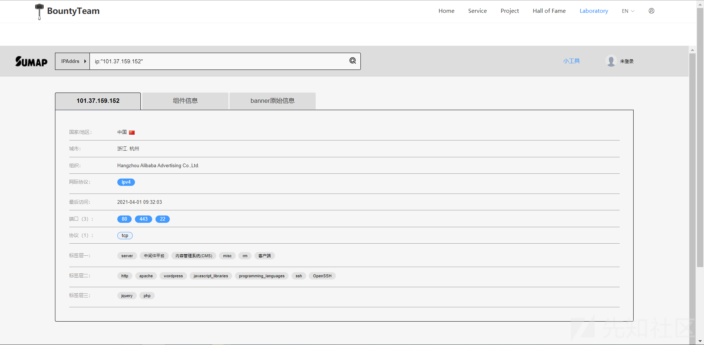
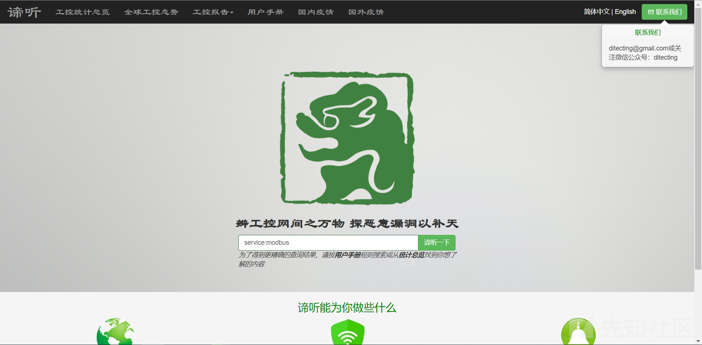

网络空间搜索引擎的区别

- - -

## 网络空间搜索引擎的区别

1.  \### [fofa](https://fofa.so/)

fofa是白帽汇推出的网络空间测绘引擎。白帽汇是一家专注于网络空间测绘与前沿技术研究的互联网安全公司，主要从事网络安全产品开发与服务支撑等相关工作，为国家监管部门及政企用户提供综合性整体解决方案，有效提升网络安全整体防御实力。

#### 优点

个人使用比较多的一个。fofa特点是对资产特征收集比较完善，fofa语法我数了数多达40条，每一条都可以算作是资产的一个特征。fofa还支持图标搜索。

fofa新出的蜜罐识别功能可真是吊炸天了。攻防演练时对红队来说绝对是好消息。

fofa最好用的一点是针对服务进行结果展示。每当有新漏洞出现时，你会发现那些漏洞复现文章都喜欢放上一个fofadork，也就是fofa的搜索语法，使用这个语法可以快速的找到符合条件的可能有漏洞资产。这么说吧，fofa的漏洞相关性最好，更符合我们想快速复现漏洞的需求。

#### 缺点

资产重复性，还是这张图，可以看到虽然域名不同，但是ip是相同的，这对于想通过fofa来复现漏洞的需求来说这两条其实是一条。

#### 会员

普通用户网站查询结果只有50条，偏少。不过会员是终身的，这点还是很香的。

1.  \### [zoomeye](https://www.zoomeye.org/)

zoomeye是知道创宇推出的国内最早的空间测绘引擎。

#### 优点

zoomeye怎么说呢，算是中规中矩吧。搜索结果主观显示ip和地理位置，右上角的小地图可以直观展示某个国家的数量，右下角是按照年份的统计。

#### 缺点

没有像fofa那样有域名相关的展示，对域名的搜索不是很友好

再一点就是结果展示耗时比较久，虽然它上面写的用时挺短的，但是从浏览器开始搜索到浏览器结果展示出来耗时挺多的。

#### 会员

会员比较贵而且按月付费。注册用户1000条api还是比较香的，通过网站查询最多浏览400条。

1.  \### [shodan](https://www.shodan.io/)

#### 优点

shodan更关注互联网上的主机。

shodan的结果展示比较全面，有Technologies专门展示这台主机的所有指纹。

主机详情页面，最上面可以查看主机的地理位置，右下角是开放的所有端口，左下角可以查看这台主机指纹，甚至某些主机还好在左下角展示出存在的漏洞。

#### 缺点

每天网站搜索限额，多少我忘记了。如果搜索比较多的话，很快就会限额不能搜索了。

#### 会员

按月付费，偏贵，会员搜索结果还是比较多的，而且可以用于商业用途。

普通用户网站查询最多20条。

1.  \### [sumap](https://www.bountyteam.com/laboratory)

sumap是雷神众测实验室中的一款空间搜索引擎。

#### 优点

界面总体感觉跟fofa很像，然后结果展示跟shodan很像。

可以查看详情页，查看某一台主机的详细指纹和详细信息

还可以下载数据，下载结果是json格式的。fofa下载是要付费的。

#### 缺点

没有api查询，网站查询单次只能查看100条，比fofa多...。

#### 会员

未发现会员入口。

1.  \### [quake](https://quake.360.cn/quake/#/index)

quake是360的一款空间测绘引擎。

#### 优点

可以很方便组合查询条件，点击条件即可自动加入and查询

还可以导出数据

#### 缺点

还不太成熟，经常性语法错误

ip地址显示不全面，好多都是星号，导出的结果里面也是好多星号\*。就这一点来说使用体验极差。

#### 会员

注册用户每月3000积分，积分可以用来查询和导出数据。1积分可以导出1条数据，也就是说每月最多导出3000条数据。

1.  [censys](https://censys.io/ipv4)

Censys是一款免费的搜索引擎，最初由密歇根大学的研究人员在10月发行，目前由谷歌提供支持。

#### 优点

结果展示比较友好，ip和域名，指纹，端口，系统，协议，地理位置等可以有个直观的展示。网站查询结果可以达到1000条。

#### 缺点

语法比较复杂，上手难度大。

每月查询次数限额，注册用户每月最多查询250次。基本够用了。

#### 会员

普通用户基本够用，不能用于商业用途。

1.  [谛听](http://www.ditecting.com/index.php/Home/Index/index?l=zh-cn)

东北大学计算机学院姚羽教授组织学生编写研发——谛听(ditecting)网络空间工控设备搜索引擎。

#### 优点

是一款工控设备的网络空间搜索引擎，主要关注工控设备。对研究工控设备比较有用。

#### 缺点

只关注工控设备，平时用不到，这里就不多做笔墨了。

#### 会员

未发现会员入口

1.  [dnsdb](https://www.dnsdb.io/zh-cn/)

全球DNS搜索引擎

#### 优点

DNSDB拥有近30亿DNS条记录，提供快速查询和反查功能

#### 缺点

普通用户功能较少，主要功能在会员用户上。查询解析到8.8.8.8的域名，查询出的结果不少，就是有星号，开会员可以去掉星号。

#### 会员

会员价格偏贵，毕竟只是查询dns。

