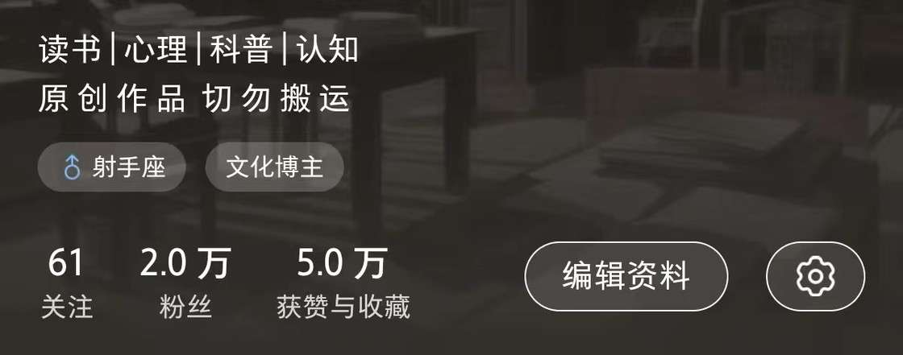
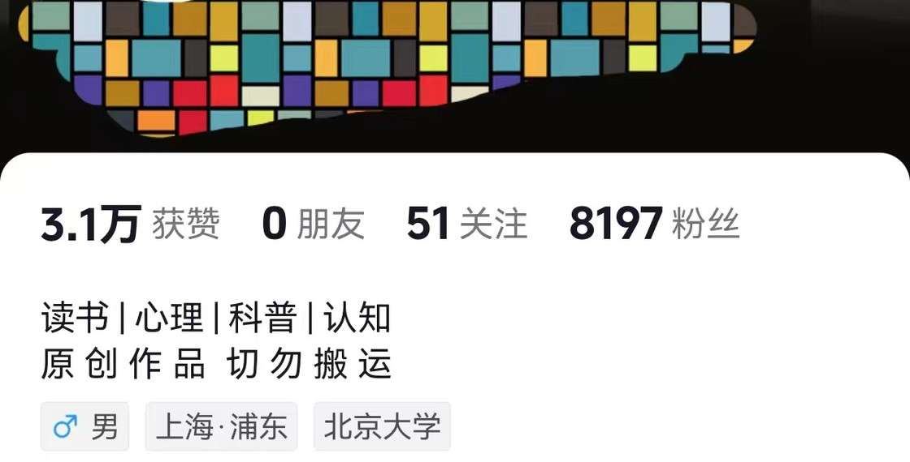
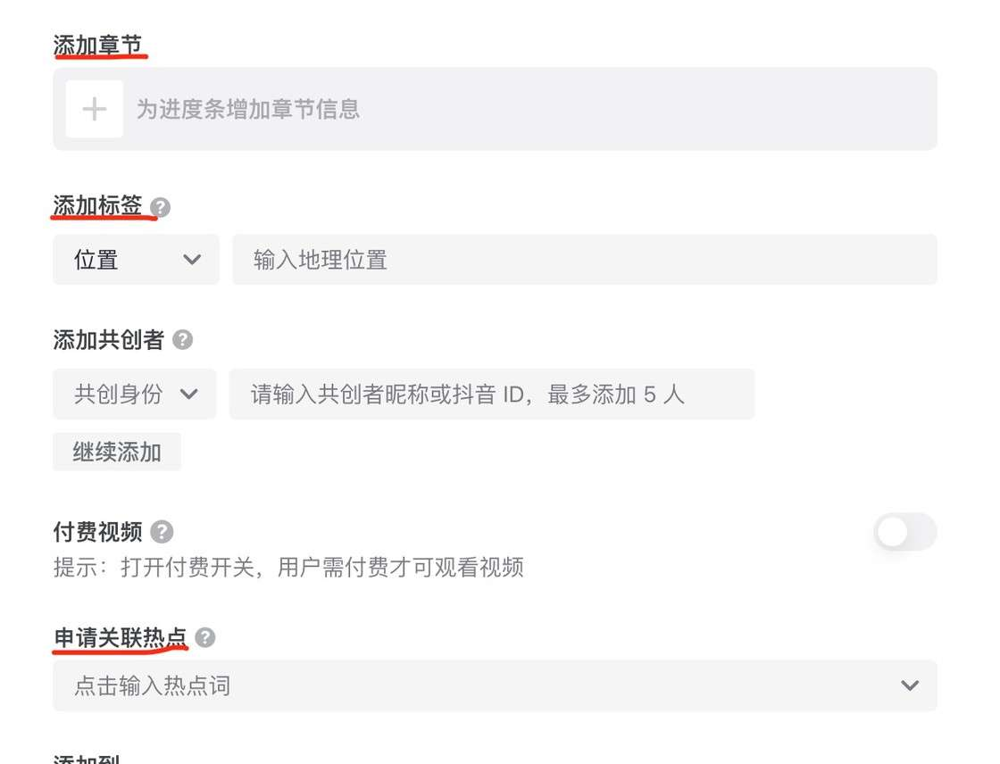

# 聊聊我在一个月抖音小红书粉丝累积到 3 万最后不再维护的事。 - 少数派

聊聊我在一个月抖音小红书粉丝累积到 3 万最后不再维护的事。

[超级浩码](https://sspai.com/u/vastzh/updates)

11 月 29 日

> 作为一个有大把时间折腾的人，除了折腾开发APP外，有时也会思考其他赚钱的方法，或许将来也能给自己多一份收入。
> 
> 前段时间，我花了些一个多月的时间实践如何做原创短视频，并把抖音和小红书的粉丝积攒到3W，也算起号成功。还经常有粉丝在后台问我收不收徒。
> 
> 你应该不会想到，明明起号成功了，我却不想再维护这个账号了。能申明的是，制作的每一个视频没有任何违规或不合法，只是单纯的不想运营下去了。在接下来的文章中我会分享是怎么起号成功，以及为什么不想再维护了。
> 
> 如果你对我的自媒体短视频账号有兴趣，可以在同名公众号回复「自媒体」即可看到我的视频号。

**小红书**

**抖音**

**如果你和我一样想做自媒体，如做了一段时间却粉丝数不理想，或者有想法但还没开始执行的。希望通过我的复盘，能对你有所启发。**  
 

## **背景**

在过去几个月，**ChatGPT**横空出世。当时我关注了很多AI领域相关的博主。每天都是**Prompt**，**Stable Diffuison**，**Midjounry**，**AIGC**，各种大语言模型，AI新工具的信息。   
  
 

当时最大的感触是 —— 每个人都是**超级个体**的时代已经来了（其实还没完全到来。。）   
  
 

那会我就想通过**AIGC**来做短视频。把自身的弱项交给AI去完成。通过AI来生成文案。再通过文案生成视频，就是“**图文成片**”的方式来制作。

## **调研**

刚好在抖音刷到一个叫「**不略**」的博主非常火，他做的书单号。以三分钟读一本书的形式，加上卡通的图文讲解，介绍每本书。当时看到他分享的《**纳瓦尔宝典**》视频让我很有感触。。   
  
 

我尝试让chatGPT去解读《纳瓦尔宝典》这本书。输入适当的prompt。确实得到有关：“三分钟读一本书，今天我们分享《纳瓦尔宝典》。。”这样的文案内容。但是相较于博主不略的文案，**AI生成的太过生硬，文案用词也太多呆板**。   
  
 

有关**TTS(文字转语音)**，那会也恶趣味的用**不略**的声音，周杰伦的声音，去做训练，效果不是很满意。并且可能有法律责任就放弃了。不过也找到不错的现成的产品。   
  
 

市面上的**图文成片**，最好的或许就是**剪映**自带的，但效果不能让我满意，感觉这样的视频很难火起来。   
  
 

短视频做的好不好很重要的一个因素是有没有**视觉冲击**，抓住用户的眼球。对于书单号来说，当视频里说到某些知识点的时候，需要在视频里即时的出现对应的内容支撑与之呼应，这其实也是一种反馈机制。这样用户才更愿意看下去不划走。

可能因为有一些强迫症，我不愿意完全为了节省时间而牺牲视频质量。最后我选择以一种白板动画的形式去做好视频。调研了如Videoscribe、Doodly、万彩等等，最后我选择了Videoscribe，效果如下：

所以现在我的视频制作流程变成：  
**选一本书 -> 让chatgpt生成文案 -> 通过tts生成音频 -> 在Videoscribe导入音频做动画脚本 -> 校对音频和动画的帧 -> 导入剪映生成字幕 -> 发布各大平台**

上面说的过程做了一些简化。

## **涨粉**

### **发布周期**

说到涨粉问题，有一个前提，就是要**坚持不懈**的发视频。如果你是三分钟热度那想做好短视频几乎不可能。  
  
 

特别是刚开始，要知道 当用户在关注一个博主前，大概率会点进你的头像，看你的一些信息，例如你有多少粉丝，你有多少个作品，你的自我介绍等等，前提尽快把作品数量堆满9个以上，因为一屏是可以展示9个作品，超过一屏显的作品也会比较多一些。   
  
 

你可以设定一个周期，例如：每天的下午17点发，或者每周一三五，不要三天打鱼两天晒网。   
  
 

发视频的频率我建议根据制作**视频的难度**。如果你是记录健身，并且你每天都这么做，那每天发就行。如果你和我一样，做一个视频要花几个小时。那就根据自己的情况而定。  
  
 

我是每周一三五发视频，发的时间可以是下班高峰，晚饭后的一个时间段。我认为具体可以根据你的目标用户的一个作息时间来定。  
  
 

### **制作合集**

建议做的视频，根据细分门类放到不同的合集里。这样当用户看完一个视频，有一定概率可以通过合集继续看你的视频。

### **发布**

建议使用网页版的抖音来发布作品。 

因为对视频有更好的能力加持，例如：章节（对视频内容增加锚点）、标签（类似于seo提升排名），关联热点等等。  
  
 

### **视频长度**

建议视频长度不要太长，控制在**1分钟左右**。因为如果视频太长，就会影响你的**完播率**。在这个浮躁的世界，很少有人静下心来看完整个视频。即使你的视频做的很棒。但比较是短视频平台，做的太长没有任何意义。这也是我不想运营我的账号原因之一。  
  
 

### **追热点**

网上有很多追踪热点视频的方法，我们可以追踪相同领域的爆款视频。不要怕模仿，如果没有好的素材就可以去模仿别人的爆款，我们开始最需要的就是流量，有了流量才有涨粉的机会，粉丝多了流量才会越来越多。  
  
 

### **推广**

当你的视频数量达到10个以上。同时我们在后台**数据中心**，关注有数据不错的视频作品。这时候可以适当的使用**抖加**。  
  
 

我就是一个例子，其实能累积到3万的粉丝，主要也是靠几个视频。经过测试推广了这些效果比较好的视频。连续投了几次100元的抖加。一般来说投一次抖加我可以获得100～200个精准粉丝，1000～2000的播放量。但也有可能获得几十万的播放量甚至更多。我当时就是在一次推广时视频的播放量达到了50万。原因是进入了下一层的流量池，自然就获得了大量的流量。在网上可以找到流量池的图表这里就不再展示了。  
  
 

总之**以少量推广去撬动巨大流量**是快速起号的一个重要手段。  
  
 

### **视频门类**

我们在发视频时，需要抓住一个特定的领域。切记不要什么类型的视频都去拍。要知道，如果你什么都想做，就可能什么也做不好。拿抖音举例，每个账号都有自己的标签，比如做科普的，健身的，vlog，解说类的等等等。如果你什么类型都做，抖音就没办法给你打标签，也没办法把你的视频推送给目标用户，自然刷到你的视频也大概率不喜欢了。  
  
 

我们可以做一些泛垂直的尝试。比如，你是健身的也可以发跑步的，打球的。同样的，我做的书单视频，从事也会拍心理学的，认知类的内容。只要输出的形式不变还是可以抓住用户。  
  
 

## **不同平台**

现在各个平台都在占领市场，比如抖音也开始做类似小红书的图文笔记。小红书也做起来短视频以及电商。既然，我们创作了内容，内容就可以在不同的平台发布。来增加我们的曝光率。因为每个用户一天就这么多时间，他花了一个小时刷抖音，同样的他就少了一个小时时间看小红书。  
  
 

同样的短视频平台都已经达到了饱和，谁的视频能抓人眼球，平台给的流量就多。我们可以尽量在平台尝试新玩法的时候较早的涉入其中因为这些时候都有流量扶持。不要等饱和了再去尝试那样就晚了。  
  
 

## **不再维护**

一开始我说过，不再维护我的短视频账号。有一个很重要的原因：我当时选错了领域。其实我并不适合做书单和认知类的视频。因为我看书不多，这不是我擅长的事，每天做的都很难，当没有足够的正反馈，也不能赚钱时，往往就需要为爱发电，没有兴趣就会很煎熬。  
  
 

做书单号我的初衷是大量依靠AI的力量，但经过实践，无论是AI的文案能力，还是做视频能力，或者是TTS都没有达到我想要的水准。于是有大量的工作，还是靠我自己手动完成。有时做一个视频，从选题到查阅资料写文案再到做动画，往往可能会花3-4小时。  
  
 

## **写在最后**

虽然视频起号成功了，没有再维护下去让我很遗憾，都是也放松了许多。如果你看到这里，那么我最想告诉你，做自媒体，最好是找自己喜欢感兴趣的领域。这样才能长期以往的坚持下去。无论有没有粉丝，都可以为爱发电！就像此时开始练习写文章的我一样。  
 

背景

调研

涨粉

发布周期

制作合集

发布

视频长度

追热点

推广

视频门类

不同平台

不再维护

写在最后

全部评论(4)

热门排序

写下尊重、理性、友好的评论，有助于彼此更好地交流～

[下辈子当个树](https://sspai.com/u/catchup/updates)

16 分钟前

写的清晰明白且非常有帮助，想在公众号申请转载分享，@杯子玩家cuuup

00

[叶大侠](https://sspai.com/u/uv3rugrz/updates)

1 天前

感谢分享，可以转载吗？公众号@33黑板报。

20

[超级浩码](https://sspai.com/u/vastzh/updates)

12 小时前

可以转载，著名来源，已加白名单。

0

[超级浩码](https://sspai.com/u/vastzh/updates)

回复

[超级浩码](https://sspai.com/u/vastzh/updates)

12 小时前

著名来源和授权

0

没有更多评论了哦
