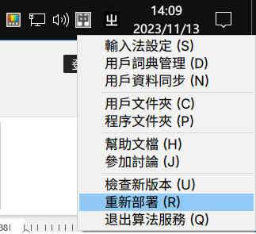
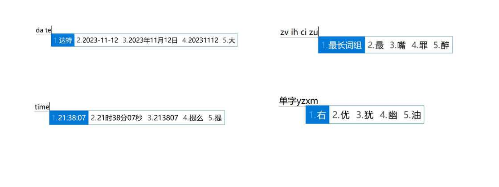
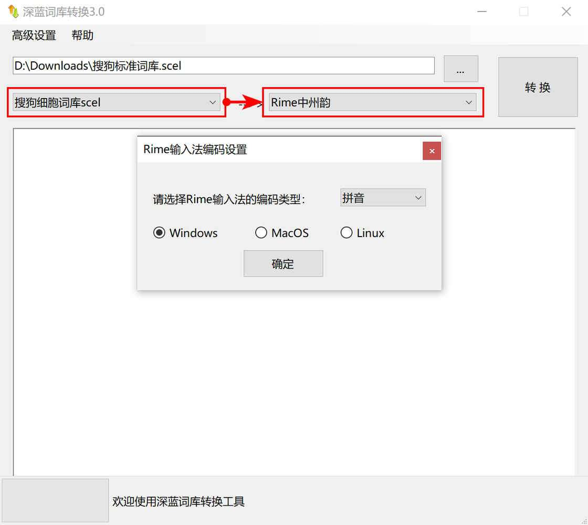
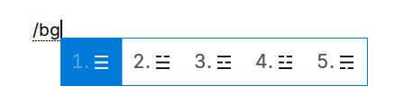

# 自由输入法 RIME 简明配置指南 - 少数派

**Matrix 首页推荐** 

[Matrix](https://sspai.com/matrix) 是少数派的写作社区，我们主张分享真实的产品体验，有实用价值的经验与思考。我们会不定期挑选 Matrix 最优质的文章，展示来自用户的最真实的体验和观点。

文章代表作者个人观点，少数派仅对标题和排版略作修改。

- - -

[原文首发于 2019 年 07 月 16 日。](https://sspai.com/post/55699)是我在少数派第一篇发文，也是我首次尝试使用 Markdown 语法写作。漫长的几年间，有过配图失效，有过读者大量私信，有空时都一一解决了。偶然间，发现这篇文章居然列入了搜索引擎的第一页。阅读量也达到近 15 万，而且也发现文章中分享的皮肤配色方案在一些高级用户的配置方案中流传。

今年，RIME 突然更新了 0.15.0 版本，回望这篇文章，生涩的语法、混乱的结构、不甚了了的陈述，不仅显得陈旧和落伍，而且不少已经失效了。同时，几年间对 RIME 的折腾，有了许多新的收获，也解决了一些之前未能解决的问题。

这期间，也并非没有尝试过成品输入法。但我发现，这些成品输入法总是不能如意。比如支持单行模式的输入法只剩下久未更新的手心输入法和 QQ 输入法。百度输入法和搜狗输入法新版本也相继取消了「以词定字」的功能。广告的烦恼、隐私的担忧、功能的缺失……相信成品输入法在「少数派」手里，总归不够趁手和如意。

这使我愈发觉得，一个自由的、开源的、安全的、如我心意的输入法，是多么的难得。

于是，我决定，把这篇文章推倒重构，希望能够因此帮助更多的人。便觉幸甚。

## 为什么选择 RIME

输入法是工具。工具，唯趁手、唯如意。趁手、如意，且自由、安全，这样的输入法，无它，唯 RIME 耳。

市面上的成品输入法，你所能定制的自由，被框限在「设置」标签里。有别于此，RIME 突出的就是自由的特性。你需要什么功能，需要什么输入方案，输入细节上有什么与常人不同的习惯和需求，它几乎都能满足。即使 RIME 同样有着种种不足和缺点，但不可否认，它，就是目前唯一能实现你几乎所有输入个性化定制需求的最好选择。

**自由。这就是我选择 RIME 的唯一原因。**

如果你崇尚自由，着意隐私，我相信，RIME 不会辜负你的选择。

但也正是因为 RIME 的高度自由，引入的高度个性定制化，使得它有着很高的准入门槛。定制困难，劝退了绝大多数人。

因此，我希望，借由分享自己初步成型的配置方案，并介绍定制方法，以此帮助有自由输入法需求的朋友，首先快速上手，然后再慢慢学习精进，精心雕琢，使它成为自己想要的样子。

## RIME 的特性

1.  高度自由可定制。
2.  全平台兼容：Windows、macOS、Linux、Android。
3.  全输入方案兼容：
    -   双拼：包括小鹤、自然码、微软在内的所有双拼方案，支持小鹤形码辅助。
    -   全拼、注音、五笔、仓颉……市面上能见到几乎所有的方案。
    -   市面上完全见不到的，只属于个人的自定方案。
    -   标点自定、模糊音、词语联想、个人词库……该有的功能都有。
4.  高准入门槛。
    -   无图形界面，自定全靠代码。
    -   配置繁琐，容易出错。

## 本文想要解决的问题

RIME 我对它的定义是「自由」。如果仅仅只是分享一套已经配置好了的方案，则失去了用户随心所欲「自由」定制的意义。因此，本文希望从如下几个方面的痛点为引子，作出简明指南。

1.  单行模式。
2.  以词定字。
3.  二三候选。
4.  词库制作。
5.  符号自定。
6.  短语自定。
7.  方案配置。
8.  多端同步。

本文将以 Windows 平台小鹤双拼配置方案为例。其它平台或方案，配置方法共通，请自行举一反三。本文默认读者具有一定水平的计算机实操能力和简单代码理解能力。如遇困难与问题，欢迎评论区或私信友好交流。

## 开始安装 RIME

[RIME 下载及安装](https://sspai.com/link?target=https%3A%2F%2Frime.im%2Fdownload%2F)

在此页面取得适合你系统的 RIME 输入法。分别为以下发行版：

-   【中州韻】 ibus-rime → Linux
-   【小狼毫】 Weasel → Windows
-   【鼠鬚管】 Squirrel → Mac OS X

RIME 默认使用朙月拼音作为初始方案，该方案等同于全拼输入法。


小狼毫安装选项

安装时，请另行指定「用户文件夹」：`~\Rime`。下文所称「用户文件夹」均指此文件夹。

安装完成后，原则上，你已经可以正常使用 RIME 了。只不过此时的 RIME 更像是未经装修的毛坯房，能用，但不好用。

此时，你如果从未接触过 RIME ，建议鼓捣一番，了解它独特的方案选单切换方式。


Ctrl+\` 或者 F4 是默认的选单快捷键

> 按组合键 `Ctrl+顿号` 或 `F4` 键唤出输入方案选单，由此调整 Rime 输入法最常用的选项。

## 学习基础知识，为配置做准备

现在，打开 [RIME 定制指南](https://sspai.com/link?target=https%3A%2F%2Fgithub.com%2Frime%2Fhome%2Fwiki%2FCustomizationGuide)，详细阅读并学习。

此时，你首先需要知道的要点是，接下来，你对方案进行的任意一项修改，都需要通过「**重新部署**」来使其生效。

> **重新部署的操作方法**
> 
> 【中州韵】点击输入法状态栏上的 ⟲ (Deploy) 按钮，或：如果找不到状态栏，在终端输入以下命令，可触发自动部署： `touch ~/.config/ibus/rime/; ibus restart`
> 
> 【小狼毫】1. 开始菜单→小狼毫输入法→重新部署；2. 当开启托盘图标时，右键点选「重新部署」
> 
> 【鼠鬚管】在系统语言文字选单中选择「重新部署」



Windows 右击系统托盘图标重新部署

RIME 的配置文件、输入方案、符号集合及词库文件，均为特定格式的文本文档。分别为：

> -   〔全局设定〕 `default.yaml`
> -   〔发行版设定〕 `weasel.yaml`
> -   〔预设输入方案〕 `<方案标识>.schema.yaml`

此外，还有记录用户输入习惯的文件：

> -   ※〔用户词典〕 `<词典名>.userdb/` 或 `<词典名>.userdb.kct`

由于随着软件的更新，这三个预设配置文档有可能被新版文件所覆盖。因此，RIME 引入了一种类似于「补丁」的定制方式。如上的三个「预设配置文档」，分别对应者如下三个「用户配置文档」：

> -   ※〔用户对全局设定的定制信息〕 `default.custom.yaml` 用于设置输入法方案、切换输入法快捷键、中英文切换、翻页等等。
> -   ※〔用户对发行版设定的定制信息〕 `weasel.custom.yaml` 用于设置托盘图标、指定软件默认英文输入、候选词横竖排列、界面布局、配色方案等等。
> -   ※〔用户对预设输入方案的定制信息〕 `<方案标识>.custom.yaml` 用于设置具体的输入方案。

所有对如上三个 `custom` 配置文档的修改，最终都会以「补丁」的方式映射汇入到 `default.yaml` 、`weasel.yaml`、和 `<方案标识>.schema.yaml` 三个文本文档中，经由重新部署而生效。

修改如上配置文档，请配合你所习惯使用的超级文本编辑器（例如 Emeditor），确保所配置的所有文本文档，均以 `UTF-8 无签名` 编码，使用 `LF 换行符` 。并在文档中，合理使用换行符、空格及制表符，以确保配置代码对齐。

注意：如上标注了星号 ※ 的文件，均含有用户定制信息，请注意备份。

最后，在编辑配置文档时，通常采用「注释」的方式，来对某一项具体功能或某一条具体配置进行「开关」。例如：

```plain
key_binder:
  select_first_character: "bracketleft" # lua 选词快捷键，左方括号选前字，此行代表反注释开启
  # select_last_character: "bracketright" # lua 选词快捷键，右方括号选后字，此行代表注释关闭
```

如上，是「以词定字」功能的语句。第二条句首的 `#`，代表该条配置代码被「注释」成说明文字，不再生效。亦即该条配置代码所对应的功能被「关闭」。反之，第一条，则代表配置代码正常生效。亦即所对应的功能被「开启」。

利用此方法，注释与反注释配置文件中的相关代码语句，开启和关闭相关功能，以此达到灵活定制的效果。

## 配置输入方案

在此处下载：[官方提供的输入方案](https://sspai.com/link?target=https%3A%2F%2Fgithub.com%2Frime%2Fplum%23packages)

得到输入法方案配置文档 `double_pinyin_flypy.schema.yaml`。

将方案配置文档放入用户文件夹。

### 配置方案选单

在 `default.custom.yaml` 配置文档中添加如下语句：

```plain
Patch：
  schema_list:
    -schema：double_pinyin_flypy 
```

重新部署后，按 `F4` 方案选单中，就有「小鹤双拼」可选使用了。


方案菜单

当需要更多输入方案时，另起一行，继续添加相应的输入方案即可：

```haml
Patch：
  schema_list:
    -schema：double_pinyin_flypy 
    -schema：flypy # 注意，此处方案名应与方案配置文档中 schema_id 字段相同。
```

也可以在这里，利用[东风破](https://sspai.com/link?target=https%3A%2F%2Fgithub.com%2Frime%2Fplum)组件，快速安装输入方案。

请注意：`Patch：` 语句仅用于 `custom.yaml` 配置文档，整个配置文档有且只能有一个。请合理使用代码缩进进行对齐。

### 配置输入习惯

在 `default.custom.yaml` 配置文档中配置如下输入习惯。

-   配置方案选单快捷键：

```plain
Patch:
  switcher:
    hotkeys:
      - F2 # 配置 F2 为方案菜单快捷键
```

-   配置候选项数量：

```plain
Patch:
  menu:
    page_size: 5 # 配置候选项数量为 5 个
```

-   配置候选项翻页按键：

```yaml
Patch:
  key_binder:
    bindings:
      - { when: has_menu, accept: period, send: Page_Down } # 句号向下翻页
      - { when: has_menu, accept: comma, send: Page_Up } # 逗号向上翻页
```

-   配置符号表：（符号表 symbols 制作在后文）

```plain
Patch:
  punctuator:
    full_shape:
      __include: symbols:/punctuator/full_shape # 配置全角符号表
    half_shape:
      __include: symbols:/punctuator/half_shape # 配置半角符号表
```

-   配置中英文切换快捷键：4 种按键动作代码在注释中作了详细说明，可以根据需要自由配置

```plain
Patch：
  ascii_composer:
    switch_key:
      Shift_L: commit_code # 按左 shift 键，已输入字符上屏，同时切换为英文输入
      Shift_R: inline_ascii # 按右 shift 键，切换为英文输入，同时保留已输入字符继续输入，回车上屏
      Control_L: noop # noop 指无操作
      Control_R: noop
      Caps_Lock: clear # 按大小写切换键，清除已输入字符，同时切换为英文输入
```

-   配置软件默认中英文模式：这个功能非常舒服，能配置输入法在常用软件中的默认中英文状态。例如：配置在 PS 中默认为英文状态；在 CMD 命令行中默认为英文状态。你可以配置 RIME 在任意软件中的中英文状态。该功能在另外一个配置文件中 `weasel.custom.yaml`：

```css
Patch:
   # 设置应用默认中英文模式
    app_options: # 设置为在以下列表软件中，RIME 默认为英文模式
      totalcmd64.exe:{ascii_mode: true}
      cmd.exe:{ascii_mode: true}
      photoshop.exe:{ascii_mode: true}
```

其它更多输入习惯配置，请参考[输入习惯](https://sspai.com/link?target=https%3A%2F%2Fgithub.com%2Frime%2Fhome%2Fwiki%2FCustomizationGuide%23%25E8%25BC%25B8%25E5%2585%25A5%25E7%25BF%2592%25E6%2585%25A3)。

### 配置个性化输入方案

定制一份全新的输入方案，是 RIME 的进阶技巧。需要理解「输入引擎 Processors」、「翻译器 Translators」、「过滤器 Filters」、「拼写运算」、「码表」、「词典」等一系列系统知识。

有能力的朋友，可以在此处参考 [《Rime 輸入方案設計書》](https://sspai.com/link?target=https%3A%2F%2Fgithub.com%2Frime%2Fhome%2Fwiki%2FRimeWithSchemata%23%25E7%2588%25B2%25E5%2595%25A5%25E9%2580%2599%25E9%25BA%25BC%25E7%25B9%2581)，进行完全体的个性化定制。

作为普通用户，更建议基于官方输入方案进行细节定制，或者获取其它高级用户制作的输入方案。

此处以我个人定制的输入方案 `flypy.schema.yaml`1（基于小鹤双拼输入方案定制）为例，说明几处关系输入体验和输入习惯的修改位置和修改方法。

阅读整张输入方案文档。注意几个重要的字段：

1.  Engine：输入引擎，其下的组件关系各个功能的实现：
    -   Processors 组件。引擎核心，处理按键消息。利用选词扩展实现「以词定字」功能，即在此组件下配置。
    -   Translators 组件。翻译器，完成编码到文字的翻译。类似「动态日期时间」、「符号转换」、「用户自定义词典」等功能，即在此组件下配置。
    -   Filters 组件。过滤器，过滤重排候选项，进入候选序列。「emoji」、「简繁转换」、「去重」、「单字优先」、「长句优先」等功能，即在此组件下配置。
2.  Dictionary：字典，亦即词库。
3.  Custom\_phrase：用户自定义短语。

### 利用脚本扩展实现「以词定字」、「二三候选」、「动态日期时间输入」、「长句优先」等功能

#### 分别安装：

1.  [RIME librime-lua 脚本扩展](https://sspai.com/link?target=https%3A%2F%2Fgithub.com%2Fhchunhui%2Flibrime-lua)
2.  [RIME 以词定字 lua 扩展](https://sspai.com/link?target=https%3A%2F%2Fgithub.com%2FBlindingDark%2Frime-lua-select-character)
3.  [动态日期时间输入 lua 扩展](https://sspai.com/link?target=https%3A%2F%2Feinverne.github.io%2Fpost%2F2021%2F09%2Frime-plugin-lua-octagram.html)

#### 安装方法：以「以词定字」lua 扩展为例：

1.  下载 `select_character.lua` 脚本并放到 `用户资料夹/lua/` 目录下。
2.  修改（若不存在则新建）`～用户文件夹/rime.lua`，在合适的位置添加一行：`select_character = require("select_character")`。
3.  修改输入方案配置文件 `flypy.schema.yaml`，在 `engine/processors:` 下添加一项：`- lua_processor@select_character`。
4.  注意，不同的 lua 扩展脚本经由不同的输入引擎组件生效。例如上方「以词定字」扩展组件经由 `processors` 组件生效，因此添加在 `engine/processors:` 下。「动态日期时间输入 lua 扩展」经由 `translators` 翻译器组件生效，则应该添加在 `engine/translators:` 下。因此，你首先需要知晓，你希望加载的 lua 扩展经由那个组件生效。通常来说，扩展详情页面，作者会做介绍。
5.  重新部署即可生效。
6.  如需其它 lua 扩展，实现更多个性化功能，请自行根据扩展作者说明文档进行配置。

此处配置较为困难，为方便理解，还是举例说明：

```plain
engine:
  processors: # 输入引擎核心
    - lua_processor@select_character # lua 以词定字选词扩展
  translators: # 输入引擎翻译器
    - lua_translator@date_translator # 动态日期时间输入
    - lua_translator@unicode_input # Unicode 输入支持
    - table_translator@custom_phrase # 用户自定义词典
  filters: # 输入引擎过滤器
    - lua_filter@long_phrase_first # 最长词组和单字优先（此扩展 3 条规则中，只应有 1 条规则生效）
    # - lua_filter@single_char_first # 单字优先（其他 2 条规则相应被注释）
    # - lua_filter@single_char_only # 只显示单字（其他 2 条规则相应被注释）
```

同样的，`rime.lua` 配置文件也举例说明：

```plain
-- select_character_processor: 以词定字
-- 详见 lua/select_character.lua
select_character = require("select_character")

-- date_translator: 动态日期时间输入
-- 详见 lua/date_translator.lua
date_translator = require("date_translator")

-- long_phrase_first: 最长词组和单字优先
-- 详见 lua/candidate_sorting/long_phrase_first.lua
long_phrase_first = require("candidate_sorting.long_phrase_first")

-- single_char_first: 单字优先
-- 详见 lua/candidate_sorting/single_char_first.lua
single_char_first = require("candidate_sorting.single_char_first")

-- single_char_only: 只显示单字
-- 详见 lua/candidate_sorting/single_char_only.lua
single_char_only = require("candidate_sorting.single_char_only")

-- unicode_input: Unicode 输入
-- 详见 lua/candidate_sorting/unicode_input.lua
unicode_input = require("unicode_input")
```

安装遇到困难的。可以下载文末分享的相应扩展包。解压后放入「用户文件夹」，重新部署后可以生效。

在 `flypy.schema.yaml` 配置文档中，`processors` 核心组件下添加如下语句：

```haml
  engine：
    processors：
      - lua_processor@select_character # lua 选词扩展，以词定字
```

同时，在 `default.custom.yaml` 配置文档中，添加如下语句，指定以词定字的按键：

```plain
  Patch:
    key_binder:
      select_first_character: "bracketleft" # lua 选词以词定字快捷键，左方括号选前字
      select_last_character: "bracketright" # lua 选词以词定字快捷键，右方括号选后字
```

在 `flypy.schema.yaml` 配置文档中，`translators` 翻译器组件下添加如下语句：

```plain
engine:
  translators:
    - lua_translator@date_translator # 动态日期时间输入
    - lua_translator@unicode_input # Unicode 输入支持
    - table_translator@custom_phrase # 用户自定义词典
```

在 `flypy.schema.yaml` 配置文档中，`filters` 过滤器组件下添加如下语句：

```plain
engine:
  filters:
    - simplifier@emoji_suggestion # emoji
    - simplifier@traditionalize # 简繁转化
    - uniquifier # 去重
    # - lua_filter@long_phrase_first # 最长词组和单字优先。开启哪个功能，取消哪行注释
    # - lua_filter@single_char_first # 单字优先
    # - lua_filter@single_char_only # 只显示单字
```



扩展能够实现不同的个性化输入模式

在 `flypy.schema.yaml` 配置文档中，`speller` 组件下添加如下语句，配置模糊音，根据个人容易出错的拼音编码灵活设置。模糊音设置得太多，将导致重码率上升，请根据个人实际情况配置。如果你使用双拼，建议尽量不设或少设模糊音。比如我只设置了 ang<->an 和 eng<->en 两组我最容易出错的韵母。

```null
    # 模糊音区域
    # 依据个人需要注释和反注释
    # 格式：键盘的输入码 -> 转化后的输入码
	
    # 声母部分
    # - derive/^([z])h/$1/ # z -> zh
    # - derive/^([z])([^h])/$1h$2/ # zh -> z
    # - derive/^([c])h/$1/ # c -> ch
    # - derive/^([c])([^h])/$1h$2/ # ch -> c
    # - derive/^([s])h/$1/ # s -> sh
    # - derive/^([s])([^h])/$1h$2/ # sh -> s
    # - derive/^l/n/ # n -> l
    # - derive/^n/l/ # l -> n
    # - derive/^r/l/ # l -> r
    # - derive/^r/y/ # y -> r
    # - derive/^hu$/fu/ # fu -> hu
    # - derive/^fu$/hu/ # hu -> fu
	
    # 韵母部分
    - derive/([^iu])([a])n$/$1$2ng/ # ang -> an
    - derive/([^iu])([a])ng$/$1$2n/ # an -> ang
    - derive/([e])n$/$1ng/ # eng -> en
    - derive/([e])ng$/$1n/ # en -> eng
    # - derive/([i])n$/$1ng/ # ing -> in
    # - derive/([i])ng$/$1n/ # in -> ing
    # - derive/([i])an$/$1ang/ # iang -> ian
    # - derive/([i])ang$/$1an/ # ian -> iang
    # 由于小鹤双拼方案此对韵母在相同按键，无需 uang <-> iang ，其他双拼方案如有需求，请按格式修改
```

注意：因为此处配置了独立的输入方案 `flypy.schema.yaml` ，与默认输入方案不冲突，不会因为更新的原因导致配置文件被覆盖。因此，此处没有使用 `flypy.custom.yaml` 补丁文件，而是直接在输入方案配置文件中进行配置，因此没有 `Patch:` 语句。下同。

## 制作和配置词库

词库，是除开输入习惯之外，影响输入体验的重中之重。

配置词库有两条思路：

-   用时间慢慢养好一个词库
-   制作大而全兼容并包的词库

两种方式各有优劣。

自己养词库需要较长时间。优点在于非常贴合输入习惯、生活习惯和工作需求，养好的个人词库无比丝滑。

大而全词库虽然能兼容日常使用。但往往因为大而全导致候选项混乱，特别是候选项自学习阶段，混乱排序的候选项非常影响输入体验。

我倾向于慢慢培养个人词库。同时制作细分词库来确保词库养成期间的输入体验和工作需求。这也非常像搜狗输入法的细胞词库的方案。

### 制作一个词库

鉴于大部分朋友的需求，本例子以拥有近 40 万词条的「搜狗标准词库」为基础进行制作。你可以根据自身需求，选择不同的词库蓝本进行制作。

-   下载[搜狗标准词库](https://sspai.com/link?target=https%3A%2F%2Fpinyin.sogou.com%2Fdict%2Fdetail%2Findex%2F11640)，得到「搜狗标准词库.scel」文件。
-   下载[深蓝词库转换](https://sspai.com/link?target=https%3A%2F%2Fgithub.com%2Fstudyzy%2Fimewlconverter)。深蓝词库转换需要 [.net 6.0](https://sspai.com/link?target=https%3A%2F%2Fdotnet.microsoft.com%2Fzh-cn%2Fdownload%2Fdotnet%2F6.0) 支持。
-   按照下图所示，进行词库转换。



-   将得到的 .txt 格式文本文件，改名为 `<词库名>.dict.yaml`。并使用文本编辑器打开。  
    由于转换的词库带有词频。如下图：


转换得到的词库带有词频

  
而我们需要不带词频的词库文件。使用文本编辑器的搜索替换功能，将所有词频删除。  
得到编码格式为：`词组+tab+拼音串1+空格+拼音串2+空格+拼音串3` 的词库文件。如下图：


删除词频之后的词库

加入词库文件头：

```yaml
 # 搜狗标准词库 40万条 由深蓝转换 无词频
---
name: sougou_standard  # 词库名
version: "2023.11.09"  # 词库版本
sort: by_weight # 排序依据：按照权重
...

啊啊啊    a a a
阿埃二氏病变    a ai er shi bing bian
```

按照前文所述的文本文件编码格式「 UTF-8 无签名」保存。

在「用户文件夹」新建 `～用户文件夹/dicts`，将词库文件导入该文件夹。

至此，基于搜狗标准词库的 RIME 词库就制作完备了。

#### 一些不错的开源词库

-   [GitHub - rime-aca/dictionaries: Rime詞庫](https://sspai.com/link?target=https%3A%2F%2Fgithub.com%2Frime-aca%2Fdictionaries)
-   [GitHub - Iorest/rime-dict: RIME 词库增强](https://sspai.com/link?target=https%3A%2F%2Fgithub.com%2FIorest%2Frime-dict)
-   [GitHub - thunlp/THUOCL: THUOCL（THU Open Chinese Lexicon）中文词库](https://sspai.com/link?target=https%3A%2F%2Fgithub.com%2Fthunlp%2FTHUOCL)
-   [GitHub - Chernfalin/SuperRimeDict: SuperRime拓展词库 for 朙月拼音&Win10拼音版(700万词-含BetterRime)](https://sspai.com/link?target=https%3A%2F%2Fgithub.com%2FChernfalin%2FSuperRimeDict)

### 理解 RIME 的词库架构

RIME 允许扩充很多词库。词库架构如下图所示：


RIME 词库架构

主词库与扩充词库之间，是集合的关系。因此，调用主词库就相当于同时调用了 ABCD 四个扩充词库。

你可以理解为，RIME 调用主词库，主词库再调用各个扩充词库。

这非常方便。使得分门别类制作「细胞词库」成为可能。

并且可以灵活运用 RIME 注释关闭的特点，根据工作语境、生活语境、娱乐语境，定制词库调用。比如工作时调用「工作词库」「行业专业词汇词库」；娱乐时调用「游戏专属词汇词库」……

这和百度输入法的「工作模式&娱乐模式」有异曲同工之妙。不过，RIME 还没有智能判断语境自动切换模式的功能。如果想要智能切换，需要配合第三方自动化工具实现。

### 配置词库

基于 RIME 的词库架构，我们可以按两条思路配置词库：

-   制作一个含有词条的通用词库，并在这个词库中加入扩充词库。
-   制作一个空词库，并在这个词库中加入扩充词库。

基于对词库调用逻辑关系的清晰明快以及如上根据不同语境调用词库的需求两个方面的考虑，我采用了第二种方案。

在「用户文件夹」新建文本文档，并命名为 `extended.dict.yaml`，作为主词库。

编辑如下文件内容，完成主词库对扩充词库的调用：

```plain
 # Rime extended dictionary
 # encoding: utf-8
 ---
 name: extended
 version: "2023-11-10"

 import_tables:
  - dicts/sougou_standard # 搜狗标准词库
  - dicts/A # 扩充词库 A，此处 A 应为实际词库名称
  - dicts/B # 扩充词库 B，此处 B 应为实际词库名称
 ...
  # 如果是带有词条的词库，请在这里，按照编码格式添加词条
```

打开输入方案配置文档文件 `flypy.schema.yaml`，在 `translator` 组件下添加如下语句，完成输入方案对词库的调用：

```plain
translator:
  dictionary: extended # 此处 extended 为主词库名称
```

如果同时使用其它输入方案，则在其它输入方案配置文档文件的相同位置，添加相同的语句。

## 制作和配置符号表

自定义符号也是影响输入体验的一个重要方面。比如各方面表现都不错的微软输入法，恰恰不能支持自定义符号。对于像我这样，学习并且已经开始使用 Markdown 语法进行写作的人来说，如果不能自定义符号，只能疲于奔命地在中英文之间切换，或者在不同的输入法之间切换。

RIME 支持自定义符号，并且支持反斜杠输入特殊符号、颜文字。在旧的那篇文章里，我没有找到双拼模式下反斜杠模式的实现方法。现在，它实现了。

由于符号表涉及非常多符号，建议使用官方符号表为蓝本进行修改。或者使用已经制作好的符号表，再根据个人的实际需求，进行码表修改。

此处以名称为 `symbols.yaml` 的符号表为例。

打开这张符号表，发现其分为两个部分，全角符号部分及半角符号部分。如下图

```plain
punctuator:
  full_shape:
    ",": { commit: ， }
    ".": { commit: 。 }
  half_shape:
    ",": { commit: ， }
    ".": { commit: 。 }
    "[": "「"
    "*": ["*", ＊, ·, ・, ×, ※, ❂]
```

其中需要注意的是如下两种语法，分别是:

1.  `"[": "「"`
2.  `"*": ["*", ＊, ·, ・, ×, ※, ❂]`

第一种语法是一一对应的关系，按下「左方括号」，直接上屏唯一项「左直角引号」。

第二种语法是一对多的关系，按下「星号」，弹出候选项选单，通过选中候选项，上屏相应符号。

配置好自定义符号后。需要在输入法案中，指定调用这张符号表。

打开 `flypy.schema.yaml` 输入方案，找到并修改如下代码：

```plain
punctuator:
  import_preset: symbols # 修改此处 symbols 为需要调用的符号表的名称
```

这就完成了符号表的调用。

同样的，如果需要使用反斜杠输入特殊符号的功能，则在 `symbols.yaml` 符号表中新增：

```prolog
symbols:
 # 八卦、八卦名、六十四卦
  '/bg': [ ☰, ☱, ☲, ☳, ☴, ☵, ☶, ☷ ]
  '/bgm': [ 乾, 兑, 离, 震, 巽, 坎, 艮, 坤 ]
  '/lssg': [ ䷀, ䷁, ䷂, ䷃, ䷄, ䷅, ䷆, ䷇, ䷈, ䷉, ䷊, ䷋, ䷌, ䷍, ䷎, ䷏, ䷐, ䷑, ䷒, ䷓, ䷔, ䷕, ䷖, ䷗, ䷘, ䷙, ䷚, ䷛, ䷜, ䷝, ䷞, ䷟, ䷠, ䷡, ䷢, ䷣, ䷤, ䷥, ䷦, ䷧, ䷨, ䷩, ䷪, ䷫, ䷬, ䷭, ䷮, ䷯, ䷰, ䷱, ䷲, ䷳, ䷴, ䷵, ䷶, ䷷, ䷸, ䷹, ䷺, ䷻, ䷼, ䷽, ䷾, ䷿ ]
```

可以通过此方法，在符号表中配置各种稀奇古怪的特殊符号。



虽然奇怪，但又很有趣的符号

## 配置用户自定义短语

自定义短语作为极度私有化，且能极大提升输入效率的工具，在 RIME 中具有十分重要的意义。不少朋友用自定义短语挂载超大词库的做法，并不被 RIME 所建议。自定义短语有它更为重要的作用和意义。所以，请不要在自定义短语中添加超量词条。

用户自定义短语存储于用户文件夹下的 `custom_phrase.txt` 文本文件中。

```plain
# Rime table
# coding: utf-8
#
# 请将该文件以 UTF-8 无签名编码保存
# 存储位置为 ~Rime 用户文件夹/custom_phrase.txt
#
# 码表各字段以制表符（Tab）分隔
# 编码格式：词条+tab+编码+tab+权重 权重决定短语词条在候选项中的排序，权重非必须项

xxx@gmail.com  gmail   1
xnom	id	1
```

然后，需要在输入方案配置文件 `flypy.schema.yaml` 中，指定调用这张自定义短语表。和词库一样，如果你使用多个输入方案，需要在每个输入方案中调用。

```plain
custom_phrase:
  user_dict: custom_phrase
```

重新部署后，自定义短语就能生效。


## 配置输入法样式、布局与配色

到了这一步，输入法的输入体验部分就完成了。根据你的输入习惯配置的个性化方案，已经超越了市面上绝大多数成品输入法所能提供的体验。

那么，现在开始配置很多朋友在意的「皮肤」，也就是 RIME 输入法的样式、布局与配色。

需要说明一点，RIME 之所以不称为「皮肤」，而是称为「样式、布局与配色」，在于：RIME 并不能指定背景图片。比如成品输入法皮肤市场各种各样动漫皮肤、卡通皮肤、风景皮肤，这并不支持。

RIME 只能配置输入法候选项的样式、布局和配色。

-   样式涉及的方面有：候选框直排/横排、字体字号、单行模式/双行模式等等；
-   布局涉及的方面有：候选框直角/圆角、候选框边距、候选项间距、阴影等等；
-   配色涉及的方面有：候选框背景色、边框色，候选项色，待选项色，候选项高亮色，编码色等等。

具体到方案配置，打开 `weasel.custom.yaml` 文件，具体的设置项对应的功能，我已经在方案代码旁边作了详细的注释。

```yaml
Patch：
  style：# 此行之下为样式设置
    display_tray_icon: true # 显示系统托盘图标
    inline_preedit: true # 在光标位置显示预编辑文本
    preedit_type: composition # 预编辑文本类型
    mouse_hover_ms: 0 # 鼠标悬停选词响应时间
    paging_on_scroll: false # 鼠标滚轮翻页候选词
    fullscreen: false # 全屏候选词窗口
    horizontal: true # 横排显示
    font_face: "Microsoft YaHei" # 主要字体
    font_point: 13 # 主要字体大小
    label_font_point: 13 # 标签字体大小
    comment_font_point: 13 # 注释字体大小
    inline_preedit: true # 嵌入式候选窗，单行模式

    shadow_offset_x": 5 # 阴影 X 轴偏移
    shadow_offset_y": 5 # 阴影 Y 轴偏移
    shadow_radius": 10 # 阴影半径

    layout： # 此行之下为布局设置
      border_width: 0 # 边框宽度
      border": 0
      margin_x": 12 # 候选项左右边距
      margin_y": 12 # 候选项上下边距
      hilite_padding": 12 # 激活候选项背景色高度
      hilite_spacing": 3 # 序号和候选项之间的间隔
      spacing": 10 # 候选项间距
      candidate_spacing": 24 # 候选项内部间距
      round_corner": 0 # 圆角幅度，0为直角

  "preset_color_schemes/Micosoft": # 此行之下为配色设置
    name: "Micosoft" # 配色名称
    author: "XNOM" # 作者名称
    text_color: 0xD77800 # 内选区文字色
    hilited_text_color: 0x000000 # 内选区编码色
    hilited_back_color: 0xFFFFFF # 内选区背景色
    hilited_candidate_text_color: 0xFFFFFF # 激活候选项文字色
    hilited_candidate_back_color: 0xD77800 # 激活候选项背景色
    candidate_text_color: 0x000000 # 其他候选项文字颜色
    comment_text_color: 0x000000 # 其他候选项提示色

  "style/color_scheme": Micosoft #最后加上这句，设置配色方案为 Micosoft，此处填入实际的配色方案名称
```

注意：RIME 的配色颜色编码使用 16 进制表示。并且，和常规的「RGB 红绿蓝」颜色编码不同，使用的是「BGR 蓝绿红」颜色编码。

你可以在 [RIME See Me](https://sspai.com/link?target=https%3A%2F%2Fbennyyip.github.io%2FRime-See-Me%2F) 调整配色后，复制右侧自动生成的代码。非常方便。

我非常喜欢原必应输入法的样式和配色，清爽、轻盈、明快，也不喜欢 win 11 style 那种圆角设置。因此，多年来我一直使用这套样式布局配色方案。相关方案配置代码如上，配置文件在文末的方案包内。如果你喜欢这套配色，请在引用时，保留 `author: "XNOM"` 作者字段。


微软拼音配色方案：全直角，极窄边框。

## 配置用户资料同步

RIME 没有云同步功能，但有本地同步功能。能够将用户数据同步至本地文件夹。

我们可以借助坚果云、onedrive 等第三方云将这个本地文件夹同步至云端，以此实现个人词典和配置方案在不同电脑间的同步和备份。

以坚果云举例：

-   在你的坚果云同步文件夹内，这里举例为 `D:\Nutstore` ，新建一个 `RimeSync` 文件夹。
-   其次，先打开用户资料夹，打开 `installation.yaml` 文件，在合适的地方添加如下代码：

```plain
sync_dir: 'D:\Nutstore\RimeSync'
```

最后完成后的样子是这样：

```plain
distribution_code_name: Weasel
distribution_name: "小狼毫"
distribution_version: 0.15.0
install_time: "Sat Nov 11 21:51:51 2023"
installation_id: "XNOM" # 此处填写喜欢的名字
rime_version: 1.8.5
sync_dir: 'D:\Nutstore\RimeSync'
```

-   在开始菜单运行 `【小狼毫】用户资料同步`，如果启用了托盘图标，也可以右击运行用户资料同步。完成后，你就能在 RimeSync 文件夹中找到 XNOM 文件夹，其中的内容就是你的用户资料，包含了自学习个人词典文件和配置文件等等。
-   利用坚果云，将此文件夹同步至云端。
-   在另外一台电脑，按照相同的方式操作。将云端文件夹同步至本地。

这里，很有必要理解 RIME 的同步逻辑：

-   RIME 同步两个方面的资料，一为个人词典；二为个人配置。
-   个人词典同步逻辑为双向同步；个人配置同步逻辑为单向同步。
-   个人词典双向同步逻辑，举例来说：甲电脑个人词典累积了词汇 ABC，乙电脑累积了词汇 DEF，那么，通过第三方云同步和 Rime 同步后，甲乙两地个人词典词汇都会同步且合并为 ABCDEF。通过第三方云同步，可以非常方便地同步两地之间的个人词典，保持相同的输入体验。
-   个人配置单向同步逻辑，是指 RIME 只会将配置文件，单向地从「用户文件夹 ~\\Rime」同步至「同步文件夹 RimeSync」。换句话说，个人配置只会在「同步文件夹 RimeSync」里在甲乙两地被反复同步和覆盖，而不会导入配置文件。如果你需要导入异地的配置文件，可以在第三方云完成同步后，手动将配置文件导入。
-   这样的同步逻辑是为了保持配置的一致性。因为，配置文件之于 RIME 十分重要，关系着 RIME 是否能够正常运行。也必须在修改后通过重新部署才能生效。若两地的配置不一致时或其中一地有错误时，必然产生无法预估的混乱后果。不过，个人配置定制好之后，也很少需要修改，权且当作备份。云同步个人配置更多用于异地新电脑部署时。


RIME 同步逻辑示意图

## 一些需要注意的地方和总结

关于 `.custom` 定制文档的语法，上文并没有详细说明。因为在 [定制指南](https://sspai.com/link?target=https%3A%2F%2Fgithub.com%2Frime%2Fhome%2Fwiki%2FRimeWithSchemata%23%25E5%25AE%259A%25E8%25A3%25BD%25E6%258C%2587%25E5%258D%2597) 中都有详细的说明。鉴于部分朋友，可能并不会真的去读《定制指南》，语法示例引用如下：

> ```perl
> Patch:
>  "一级设定项/二级设定项/三级设定项": 新的设定值
>  "另一个设定项": 新的设定值
>  "再一个设定项": 新的设定值
>  "含列表的设定项/@0": 列表第一个元素新的设定值
>  "含列表的设定项/@last": 列表最后一个元素新的设定值
>  "含列表的设定项/@before 0": 在列表第一个元素之前插入新的设定值（不建议在补丁中使用）
>  "含列表的设定项/@after last": 在列表最后一个元素之后插入新的设定值（不建议在补丁中使用）
>  "含列表的设定项/@next": 在列表最后一个元素之后插入新的设定值（不建议在补丁中使用）
> ```

再次强调，上文中，因为我配置了个人专属输入方案 `flypy.schema.yaml`，因此，并没有使用 `flypy.custom.yaml` 的配置补丁进行配置，因此上文涉及定制输入方案的部分，都是对输入方案本身的修改，因此没有加入 `Patch:`。总之一句话：对于 `schema.yaml` 的修改是直接修改，可能会被更新覆盖；对于 `custom.yaml` 的修改是补丁修改，不会被更新覆盖，但该补丁文件需以 `Patch：` 开头，并有且只能有一句。

最后，作为一款核心思想是「自由」的输入引擎，虽然无可争议地可以寻找和下载高级用户制作的方案包来使用，但我更建议你根据自己的输入习惯和输入需求进行定制。高级用户制作的方案包，则可以用于学习和借鉴。当然，整个配置过程也许艰难、也许曲折、也许漫长、也许反复，但如果结果是令人欣喜、令人愉悦、令人满足、令人得意的话，未尝不是一种别样的人生体验。这，不仅仅只是配置一个输入法而已。人生长长，何事不是如此呢？

## 参考资料及扩展阅读：

1.  [幫助與反饋 | RIME | 中州韻輸入法引擎](https://sspai.com/link?target=https%3A%2F%2Frime.im%2Fdocs%2F)
2.  [GitHub - LufsX/rime: Rime（中州韵）全拼与双拼的自用配置方案](https://sspai.com/link?target=https%3A%2F%2Fgithub.com%2FLufsX%2Frime) 十分感谢 LufsX 的配置方案给予的莫大启发
3.  [GitHub - halfmoonvic/Rime: 致第一次安装Rime的你](https://sspai.com/link?target=https%3A%2F%2Fgithub.com%2Fhalfmoonvic%2FRime)
4.  [GitHub - rime/librime: Rime Input Method Engine, the core library](https://sspai.com/link?target=https%3A%2F%2Fgithub.com%2Frime%2Flibrime)
5.  [一位匠人的中州韵——专访Rime输入法作者佛振 - 图灵访谈 - SegmentFault 思否](https://sspai.com/link?target=https%3A%2F%2Fsegmentfault.com%2Fa%2F1190000002424698)
6.  [最新版 Rime 输入法使用](https://sspai.com/link?target=https%3A%2F%2Fjdhao.github.io%2F2019%2F02%2F18%2Frime_configuration_intro%2F)
7.  [Issue #6 · rime/rime-emoji · GitHub](https://sspai.com/link?target=https%3A%2F%2Fgithub.com%2Frime%2Frime-emoji%2Fissues%2F6)
8.  [别再用「六个点」当省略号了，这些标点都有更规范的输入方式 - 少数派 (sspai.com)](https://sspai.com/post/45516)
9.  [旧版自由输入法RIME简明配置指南 - 少数派 (sspai.com)](https://sspai.com/post/55699)
10.  [文中所涉及配置文件、扩展包、词库等-分享在此-百度网盘-提取码XNOM](https://sspai.com/link?target=https%3A%2F%2Fpan.baidu.com%2Fs%2F1CaPlEKiSjHGgZbhs76x8zQ%3Fpwd%3DXNOM)
11.  其它参考资料，在原文提供链接，此处不再重复添加

\> 关注 [少数派公众号](https://sspai.com/s/J71e)，解锁全新阅读体验 📰

\> 实用、好用的 [正版软件](https://sspai.com/mall)，少数派为你呈现 🚀

-   1此方案受到 LufsX 这位高阶用户所分享方案的大量启发，详见参考资料链接。
