# 致远OA鉴权浅析与wpsAssistServlet 任意文件上传漏洞分析 - 先知社区

致远OA鉴权浅析与wpsAssistServlet 任意文件上传漏洞分析

- - -

# 路由分析

核心路由在/ApacheJetspeed/webapps/seeyon/WEB-INF/web.xml配置文件中，部分内容如下图  
[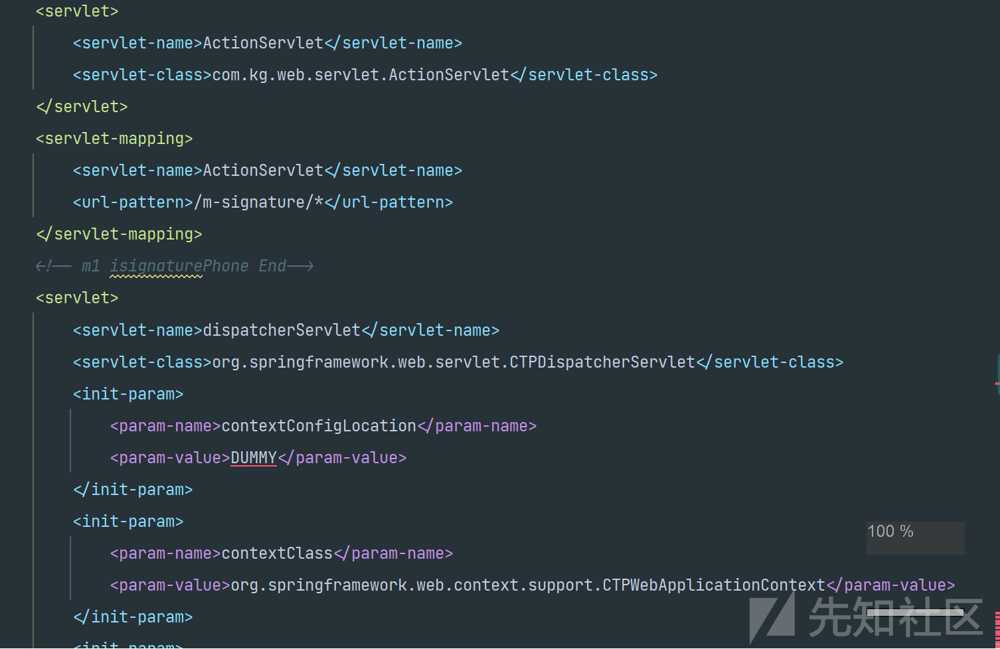](https://xzfile.aliyuncs.com/media/upload/picture/20231217210440-d6ff4462-9cdc-1.png)  
[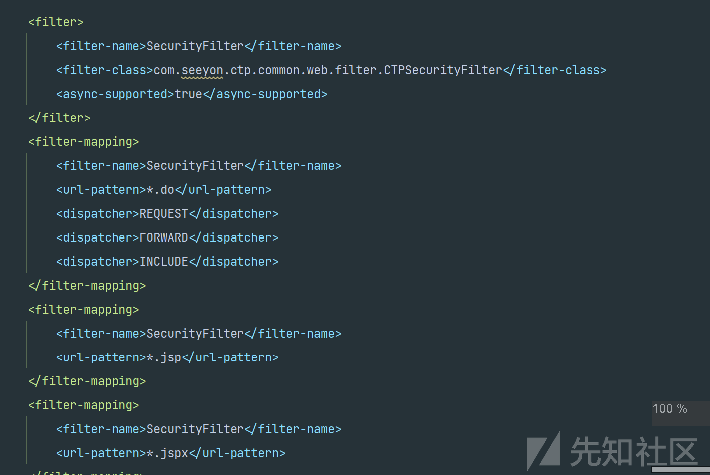](https://xzfile.aliyuncs.com/media/upload/picture/20231217210451-dd3b9b78-9cdc-1.png)  
定义了Servlet组件，和过滤器。查看web.xml可以知道主要权限校验部分在CTPSecurityFilter过滤器中。可以在配置文件查看应用程序的Servlet组件，再去WEN-INF下的lib里找相应的jar包反编译得到源码。另外系统使用了Spring框架，我们知道spring中路由注解（如`@RequestMapping`）来定义或者通过Spring的配置文件来定义，这里使用配置文件定义。我们可以去存放配置文件的地方，这里是ApacheJetspeed/webapps/seeyon/WEB-INF/cfgHome/spring中，查看相应路由。  
[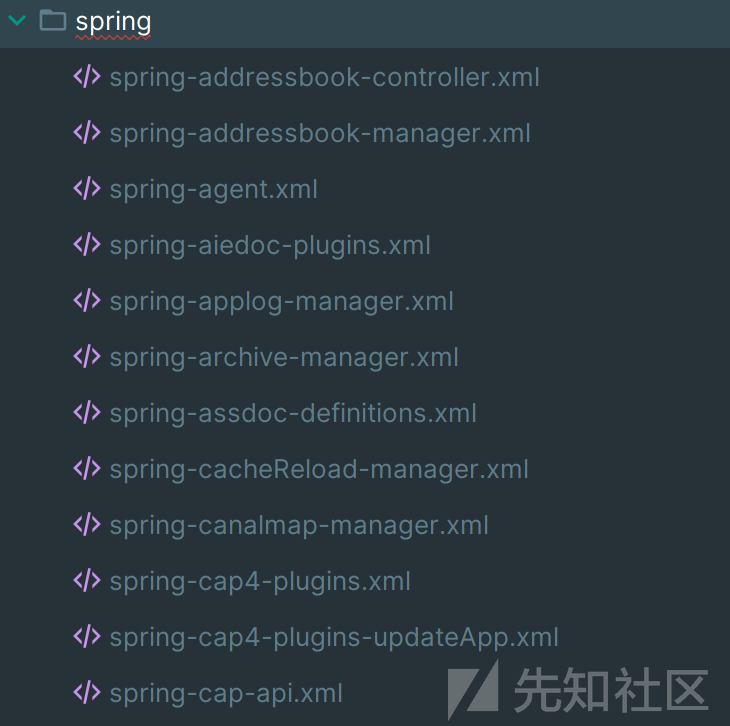](https://xzfile.aliyuncs.com/media/upload/picture/20231217210504-e53a02e2-9cdc-1.png)

# 鉴权分析

权限校验在CTPSecurityFilter过滤器中，其中doFilter方法部分代码如下，其中重点方法为`authenticate`，进行用户认证，并获取结果。后续都为对认证通过后的Url的检查，看是否在保护名单中。  
[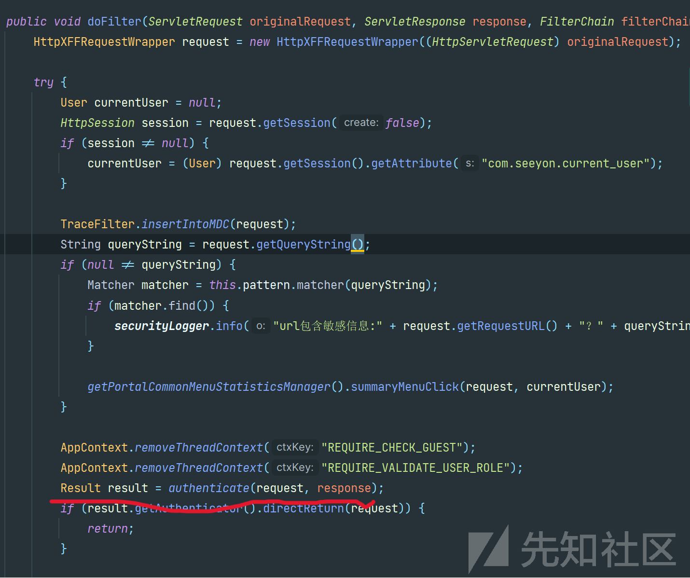](https://xzfile.aliyuncs.com/media/upload/picture/20231217210514-eb0d2e7e-9cdc-1.png)  
所以目前重点为对`authenticate`方法进行分析，看能否绕过相应校验。查看方法首先会检查URI是否存在攻击。  
[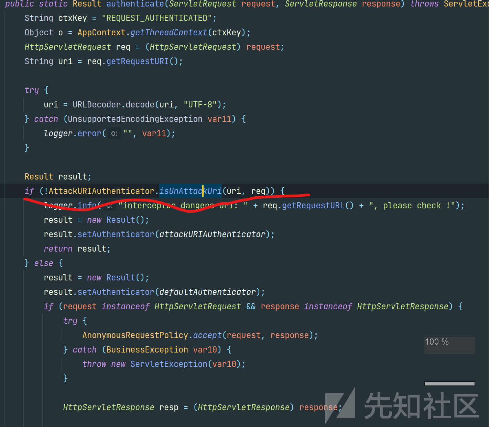](https://xzfile.aliyuncs.com/media/upload/picture/20231217210528-f360d7e2-9cdc-1.png)

不是的话才会进入else中进行以下的if判断。

```plain
try {
                    if (isSpringController(uri, req)) {
                        result.setAuthenticator(controllerAuthenticator);
                        result.authenticate(req, resp);
                        if (result.getResult()) {
                            if (tokenAuthenticator.validate(uri, req)) {
                                result.setAuthenticator(tokenAuthenticator);
                                result.authenticate(req, resp);
                                return result;
                            }

                            if (isAjax(uri, req)) {
                                result.setAuthenticator(ajaxAuthenticator);
                                result.authenticate(req, resp);
                            }
                        }
                    } else if (tokenAuthenticator.validate(uri, req)) {
                        result.setAuthenticator(tokenAuthenticator);
                        result.authenticate(req, resp);
                    } else if (isRest(uri, req)) {
                        result.setAuthenticator(restAuthenticator);
                        result.authenticate(req, resp);
                    } else if (isV3xAjax(uri, req)) {
                        result.setAuthenticator(v3xAjaxAuthenticator);
                        result.authenticate(req, resp);
                    } else if (isSOAP(uri, req)) {
                        result.setAuthenticator(soapAuthenticator);
                        result.authenticate(req, resp);
                    } else if (isServlet(uri, req)) {
                        result.setAuthenticator(servletAuthenticator);
                        result.authenticate(req, resp);
                    } else if (isJSP(uri, req)) {
                        result.setAuthenticator(jspAuthenticator);
                        result.authenticate(req, resp);
                    } else if (webOfficeAuthenticator.validate(uri, req)) {
                        result.setAuthenticator(webOfficeAuthenticator);
                        result.authenticate(req, resp);
                    } else {
                        result.setAuthenticator(defaultAuthenticator);
                        result.authenticate(req, resp);
                    }

                    if (result.getResult()) {
                        getHttpSecurityFilterManager().doFrameFilter(req, resp);
                    }
                } catch (Exception var9) {
                    logger.error(var9.getLocalizedMessage(), var9);
                }
```

会根据请求的URI，选择并执行不同的认证策略。这里我们先看后续分析的漏洞，会利用到的isServlet判断。查看代码，发现是调用 `ServletAuthenticator` 类的 `accept` 方法对请求进行判断。  
[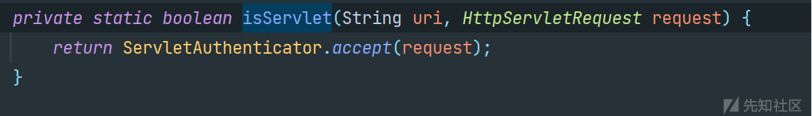](https://xzfile.aliyuncs.com/media/upload/picture/20231217210545-fdb7ce76-9cdc-1.png)  
查看`accept` 方法，首先获取请求的 URI，然后判断是否以特定的后缀 ".psml" 结尾，是的话立即返回true。不是的话判断uri是否在集合 servlets中。  
[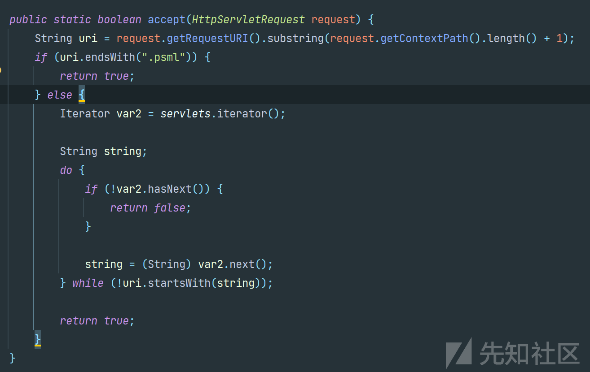](https://xzfile.aliyuncs.com/media/upload/picture/20231217210559-05b5b75a-9cdd-1.png)  
其中servlets为如下静态成员变量  
[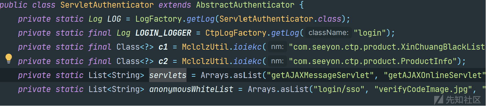](https://xzfile.aliyuncs.com/media/upload/picture/20231217210610-0c700d3e-9cdd-1.png)  
这里我们可以发现web.xml中的servlet比servlets列表中的多。也就是并不是所有定义的servlet都会进入ServletAuthenticator。所以这也导致一些web.xml中配置的servlet会进入到defaultAuthenticator，而默认的认证器defaultAuthenticator，根据以下代码可知。并未做任何校验所有传入的URI都被视为有效。  
[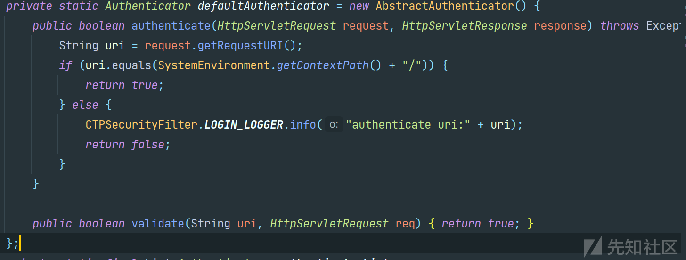](https://xzfile.aliyuncs.com/media/upload/picture/20231217210626-1634182e-9cdd-1.png)

# Wps任意文件上传

这里我们可以发现这个servlet，进入CTPSecurityFilter过滤器，且不在ServletAuthenticator的servlets列表中，也就是会进入默认的认证器defaultAuthenticator。那么就是没有鉴权的操作。  
[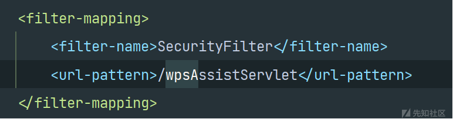](https://xzfile.aliyuncs.com/media/upload/picture/20231217211258-ff6721f8-9cdd-1.png)  
进入WPSOfficeServlet查看代码，这里会从请求中获取名为 `flag` 的参数，这个参数表示后续要执行的操作类型。  
[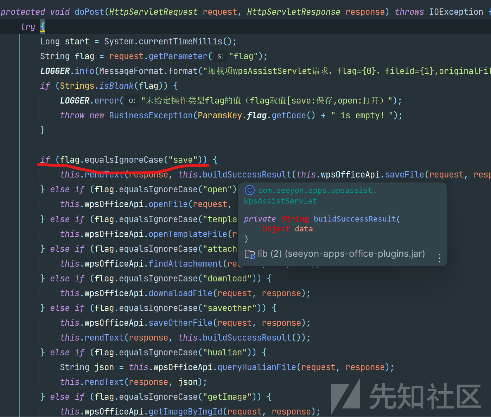](https://xzfile.aliyuncs.com/media/upload/picture/20231217211359-24148fae-9cde-1.png)  
这里可以发现当，flag为save时会执行saveFile方法，应该是上传保存文件的操作，这里跟进方法。  
[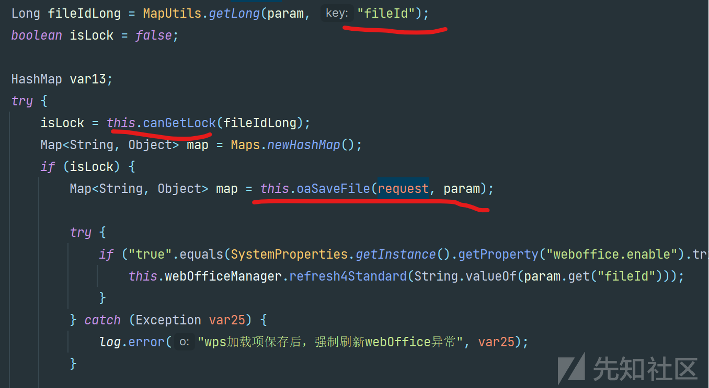](https://xzfile.aliyuncs.com/media/upload/picture/20231217210741-42a8c918-9cdd-1.png)  
可以发现这里，从请求头中获取，fileId参数作为要保存的文件的标识，然后调用canGetLock(Long fileId) 方法检查locksMap中是否已经存在对应fileId的锁定标记。所以请求中必须要包含fileId参数，切locksMap中存在。然后才会调用oaSaveFile方法进行保存。  
[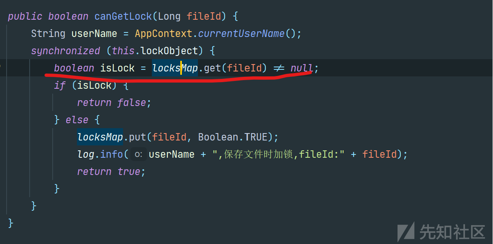](https://xzfile.aliyuncs.com/media/upload/picture/20231217210757-4c4adbdc-9cdd-1.png)  
这里oaSaveFile方法会将请求中的realFileType参数拼接进入文件路径中，所以这里可以通过../穿越目录。便可以上传jsp文件至可执行目录。  
[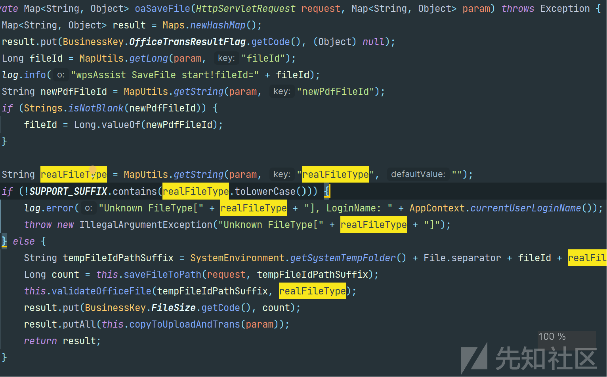](https://xzfile.aliyuncs.com/media/upload/picture/20231217210811-5488be0e-9cdd-1.png)  
我们便可以构造任意jsp文件上传至指定目录并执行了。  
[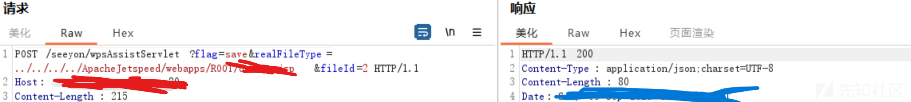](https://xzfile.aliyuncs.com/media/upload/picture/20231217210829-5f1afb8e-9cdd-1.png)

参考：\[[https://mp.weixin.qq.com/s/TjKLMesbRCry7Tk8k8kjYA](https://mp.weixin.qq.com/s/TjKLMesbRCry7Tk8k8kjYA)\]
