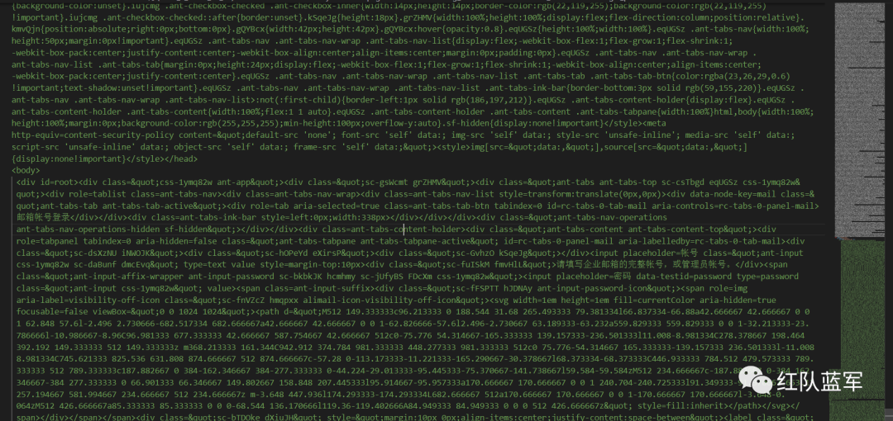

# 记一次使用gophish开展的钓鱼演练

原创 niko

[↓↓↓](javascript:)  
  
红队蓝军  
  
[↑↑↑](javascript:)

*2023-06-02 15:00* *发表于四川*

收录于合集

#钓鱼 3 个

#投稿 7 个

这周接到客户要求，组织一次钓鱼演练，要求是发送钓鱼邮件钓取用户账号及个人信息。用户提交后，跳转至警告界面，以此来提高客户单位针对钓鱼邮件的防范意识。

与客户沟通后得知他们企业内部是由邮箱网关的，那么就意味着大批量将钓鱼邮件发送至目标邮箱中是难以做到的，但沟通后客户同意将我报备的IP和域名添加进白名单，这样能解决邮件能否成功接收这一大难题了。因此这里使用gophish进行钓鱼邮件演练，使用该工具的好处在于：

1.  可以快速部署一次钓鱼行动
    
2.  获取到的数据信息很直观，UI交互合理
    

此外还需要我们做好如下两个准备。

## 前期准备：

### 1.域名申请

这里使用的是godaddy来申请的域名。域名选择上尽量选择与客户域名相似。例如**Think.com可以考虑使用Thlnk.com**、Th1nk.com来掩人耳目，或者使用IDN伪造域名手段。

#### IDN伪造域名手段

这里浅析一下该手段：

早期的DNS（Domain Name System）是只支持英文域名解析。在IDNs（国际化域名Internationalized Domain Names）推出以后，为了保证兼容以前的DNS，所以，对IDNs进行punycode转码，转码后的punycode就由26个字母+10个数字，还有“-”组成。

其实就是将unicode编码转化成Punycode，而转换后的Punycode在浏览器中显示的是unicode编码后的字符。

如我们想有个`тhink.com`域名，可以申请`xn--hink-p6d.com`。

这里推荐使用网站直接转换：https://www.cha127.com/cndm/?decoded=&encode=Encode+>>

但不同浏览器在针对IDN域名伪造这个手段上，有不同的防护策略。火狐中并未对IDN伪造进行防护，因此如`https://www.xn--80ak6aa92e.com/`这个域名，就显示的是`https://www.аррӏе.com/`。

而谷歌会先弹出访问警告，忽略警告后访问后仍显示的是`https://www.xn--80ak6aa92e.com/`


edge同谷歌一样，虽然不警告，但最后显示的也是`https://www.xn--80ak6aa92e.com/`。

但如果仅想为邮箱服务器搞个域名，可以直接使用申请 `тhink.com`。这种类似字符可以在wiki中找到：https://zh.wikipedia.org/wiki/Unicode字符列表

### 2.服务器

服务器选择上需要注意以下3点

1.  配置 如果同时部署上邮箱服务器和gophish，且邮箱服务部署的若是ewomail，则推荐2核4g，最低2核2g，不然会很卡
    
2.  购买途径 购买途径方面根据客户需求择定，考虑数据安全则使用国内的，使用国外的vps好处就是域名解析不需要备案。如果短期需要备上案，尽量选择国外vps
    
3.  25端口是否放开 不少服务器的25端口默认是不放开的，只有向官方申请工单才行。如果为了避免麻烦，可以先搜索下每家服务器的端口默认限制情况。我用过的腾讯云和国外的justhost都是可以默认放开25端口的
    

## ewomail部署

以上两个步骤完成后，就可以优先部署上邮箱服务了。这里选用的ewomail，官方推荐使用centos进行安装，所以我选择的vps也是centos的。

安装过程全程参考官方文档即可：

http://doc.ewomail.com/docs/ewomail/install

部署好后需要添加邮箱用户或是直接使用admin用户进行后续邮件发送也可以。

下图为官方提供的域名dns解析记录


设置完解析，邮件能成功发送后，即可进入下一步了。

## gophish部署

邮箱服务搭建好后，就需要部署gophish了。以下是gophish搭建命令，还是相当快捷的。如果是centos安装，可能会报`centos /lib64/libc.so.6: version GLIBC_2.28' not found`的错误。此处参考链接进行解决即可：https://www.cnblogs.com/FengZeng666/p/15989106.html

```plain
wget https://github.com/gophish/gophish/releases/download/v0.12.1/gophish-v0.12.1-linux-64bit.zip
mkdir gophish
unzip gophish-v0.12.1-linux-64bit.zip -d ./gophish
cd gophish/
vim config.json 
chmod +x gophish
nohup ./gophish &
```

此处的的配置文件根据实际需求进行填写，无特殊要求仅需要更改注释内容即可。

```plain
{
        "admin_server": {
                "listen_url": "0.0.0.0:3333", //管理后台放行ip
                "use_tls": true,
                "cert_path": "gophish_admin.crt",
                "key_path": "gophish_admin.key",
                "trusted_origins": []
        },
        "phish_server": {
                "listen_url": "0.0.0.0:88",  //伪造界面放行ip
                "use_tls": false,
                "cert_path": "example.crt",
                "key_path": "example.key"
        },
        "db_name": "sqlite3",
        "db_path": "gophish.db",
        "migrations_prefix": "db/db_",
        "contact_address": "",
        "logging": {
                "filename": "",
                "level": ""
        }
}
```

运行成功后查看`nohup.out`文件，gophish首次使用会随机生成密码，登录后台后可更改密码

gophish官方文档\[1\]

项目中 常用到的功能模块为`Dashboard`、`Campaigns`、`uers & Groups`、`Email Templates`、`Landing Pages`、`Sending Profiles`

### Sending Profiles（配置邮件发送凭证）


添加配置如上，**例如申请的域名为abc.com**，则成功搭建个人邮箱服务器后，依次填入\[anything\]<\[anything\]**mail.abc.com**\>，**smtp.mail.abc.com:25**，用户账号密码，邮件头部分可根据需要进行添加。

### user&group（添加目标邮箱）


添加需要发送的目标邮箱，支持csv导入。仅需填入Email即可

### Landing Pages（伪造页面）

添加需要伪造的界面

伪造页面是钓鱼的一个核心内容，页面的仿真程度将决定鱼儿是否上钩，下面是客户要求伪造的邮箱网站

网站伪造根据需求进行选择不同方案，一般项目在一周甚至是2-3天左右，单纯手写前端的话时间投入和收益不成正比。直接ctrl+s保存的网站大部分效果不好，因为很多界面都是通过渲染得到。这次项目中使用了以下三种方案供参考：

方案一：

直接在landing pages页面导入界面，gophish会自行仿造目标网站。此处碰到两个问题点，1.网站项目缺失，显示如下

静态资源加载问题获取不到是相对好解决的，可以考虑将前端需要的js、背景图放置在vps上再去获取即可。放置路径可以是gophish下的`static/endpoint`，此时前端引用时的路径应为`http[s]://ip or domain/static/filename`。

但在获取密码环节出了问题，gophish抓取密码的原理是寻找form表单，获取到其中的`input`字段。因此很多时候，明明伪造的网站，受害者提交了信息，但却未收到数据，很大可能是因为前端没有构造出符合规定的form表单。此处的原因则是登录使用的是`iframe`调用的外部资源。

方案二：

使用谷歌插件：`Save Page We`、`SingleFile`拷贝目标页面。此方法的优势在于伪造的静态页面表现优异，其原理类似于将网站部分静态图片或资源直接base64加密后保存在单个html中。



缺点显而易见，直接用插件保存下来网站会“失真”，不能很好的配合gophish抓取密码。因此这次项目中该方案就不能很好的实现form表单，虽然有尝试在上图源码中进行修改，但未能奏效，绝大部分html文件连编辑器也无法格式化，大量杂乱的内容改起来也更加费时费力。也是因为该系统使用了`iframe`的关系，这次拷贝下来的html内容比之前拷贝到的文件内容要更乱更杂。

以往项目案例中，使用插件能很好的更改

例如如下网页中自带了form表单，此时使用插件能很好的仿造并改过。

修改表单，添加重要字段以便gophish识别。很多前端拷贝下来的提交按钮均是button，这种情况是需要更改为`input`标签的`submit`类型。

修改后，能成功获取到用户输入内容

方案三：

一半自动+一半人工的方式

使用了https://github.com/Threezh1/SiteCopy，本质跟crtl+s保存网站一致，但更加方便。保存后的网站效果跟方案一类似，再对拷贝下来的前端代码进行修改（不可避免），对照着原网站的css进行抄袭，基本上能模拟出原网站界面。

切记需要有如下几个关键标签

```plain
<form action="" method="post" name="form">
<input name="username" type="text"/>
<br/>
<input name="password" type="password"/>
<br/>
<input id="login" name="login" type="submit" value="Login"/>
</form>
```

ps：写文章时发现可能在方法一的基础上进行手动添加修改可能更加便利

### Email Templates（编辑邮件内容）

添加邮件发送模板

可支持导入邮件，如果需要制作一份比较完美的钓鱼邮件可自行先设计好后，保存为eml文件，再进行导入。

Add tracking image是在钓鱼邮件末添加一个跟踪图像，用来跟踪受害用户是否打开了收到的钓鱼邮件。

客户需求是将链接放置在邮件中，调取受害者输入信息，因此这里crtl+k添加了链接，URL添加{{.URL}}即可。

### Campaigns（任务部署）


任务部署的URL填写当前VPS ip（或解析的域名）和gophish部署端口。

Launch Date和Send Emails By用来控制邮件发送时间，gophish会根据两个时间间隔长度，来调控邮件发送的速率，间隔越长相对的发送速率就越慢。

**这里推荐将Send Emails By的值设置在一个合理的时间范围内。将邮件速率控制在一分钟5-10封，速率过快的话非常有可能出现邮件发送失败，到达不了用户邮箱的情况。**

### Dashboard（成果面板）

部署完后就是静候佳音，等待鱼儿上钩了。最后在Dashboard中可以很直观的看到用户打开邮件、点击链接、提交数据等行为的对应数量。

可以看到成果还是颇丰的，也算是圆满完成了一次钓鱼演练。

### 参考资料

\[1\]

gophish官方文档: *https://docs.getgophish.com/*      

加下方wx，拉你一起进群学习

  


