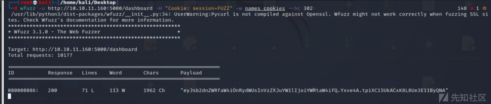
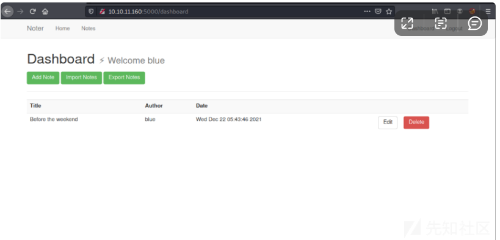

# 记一次对Noter的渗透测试 - 先知社区

记一次对Noter的渗透测试

- - -

# 信息收集

## 端口扫描

nmap找到三个开放的 TCP 端口，FTP (21)、SSH (22) 和 Python 托管的 HTTP (5000)：

[](https://xzfile.aliyuncs.com/media/upload/picture/20231130213409-23eed194-8f85-1.png)

发现存在ftp匿名登录，使用ftp进行登录。

[](https://xzfile.aliyuncs.com/media/upload/picture/20231130213415-2788f7d0-8f85-1.png)

## Flask App

访问5000端口，发现开启了web服务。

[](https://xzfile.aliyuncs.com/media/upload/picture/20231130213422-2c2aa504-8f85-1.png)

在登录框测试了一些常规漏洞，SQL注入和弱口令都没有用。  
网站上没有什么有趣的东西，我们去注册看看：

[](https://xzfile.aliyuncs.com/media/upload/picture/20231130213430-30d2c10e-8f85-1.png)

登录之后，重定向到/dashboard这个目录下。

[](https://xzfile.aliyuncs.com/media/upload/picture/20231130213437-35034050-8f85-1.png)

“添加注释”按钮指向/add\_note，它有一个表格。尝试提交一个note进行测试。

[](https://xzfile.aliyuncs.com/media/upload/picture/20231130213445-3998a54c-8f85-1.png)

[](https://xzfile.aliyuncs.com/media/upload/picture/20231130213453-3e738da2-8f85-1.png)

它显示在我的仪表板上。

[](https://xzfile.aliyuncs.com/media/upload/picture/20231130213459-421c23ec-8f85-1.png)

尝试各种 XSS 有效负载，但一切似乎都正确地转义了。“Notes” ( /notes) 现在显示我的笔记：

[](https://xzfile.aliyuncs.com/media/upload/picture/20231130213514-4adf0846-8f85-1.png)

单击它会导致/note/3并显示注释：

[](https://xzfile.aliyuncs.com/media/upload/picture/20231130213521-4f5680a2-8f85-1.png)

我将尝试通过检查其他注释 ID（/note/1）。例如，点击“升级到VIP”的链接显示该选项当前不可用

[](https://xzfile.aliyuncs.com/media/upload/picture/20231130213527-52834c7e-8f85-1.png)

# 漏洞发现

## JWT解密

尝试解密cookie。

[](https://xzfile.aliyuncs.com/media/upload/picture/20231130213534-56a71c86-8f85-1.png)

Flask cookie 看起来很像 JWT。我将尝试flask-unsign，一个用于解码、暴力破解和制作 Flask cookie 的工具，它可以工作：

[](https://xzfile.aliyuncs.com/media/upload/picture/20231130213541-5ac6ec4c-8f85-1.png)

## 目录爆破

没有发现啥可以利用的地方，就继续看cookie。

[](https://xzfile.aliyuncs.com/media/upload/picture/20231130213548-5f30d054-8f85-1.png)

## Flask Unsign解密

使用flask-unsign解密  
flask-unsign --decode--cookie'.eJwlx0EKgCAQBdCrDH\_torU3iZCQHC0wBUcpEO-e0OrxOnYfrZws0FsH1QmkHQeLQGHNjWxhSvmhmENgR1eCGUbh7z6ra2ms0IRLsjdDY3mdx\_gAqEYfRw.YkOi3g.uAoRysM25q2FzuEUmYMaCRMQ4aA'{'\_flashes': \[('success', 'You are now logged in')\], 'logged\_in': True, 'username': '0xdf'}  
cookie:eyJsb2dnZWRfaW4iOnRydWUsInVzZXJuYW1lIjoiYWRtaW4ifQ.Yxvarg.S9d5IqA4nL7CBjzYp4CfnG8IoLk  
命令：flask-unsign --decode --cookie 'eyJsb2dnZWRfaW4iOnRydWUsInVzZXJuYW1lIjoiYWRtaW4ifQ.Yxvarg.S9d5IqA4nL7CBjzYp4CfnG8IoLk'

[](https://xzfile.aliyuncs.com/media/upload/picture/20231130213557-64bd47d2-8f85-1.png)

使用flask-unsign. Flask cookie 使用秘密签名，因此在不知道该密码的情况下无法修改它们。可以进行暴力破解来测试弱密码，并通过flask-unsign来提供该功能。--unsign-w，运行它会rockyou.txt返回错误：

[](https://xzfile.aliyuncs.com/media/upload/picture/20231130213610-6c4d869c-8f85-1.png)

它似乎将文件中的“123456”通过添加--no-lteral-eval. 我将添加它，它可以很快找到秘密：

[](https://xzfile.aliyuncs.com/media/upload/picture/20231130213619-718164ee-8f85-1.png)

## 以管理员身份访问测试

生成一个管理员的cookie，然后替换到浏览器当中去。  
eyJsb2dnZWRfaW4iOnRydWUsInVzZXJuYW1lIjoiYWRtaW4ifQ.YxvdIw.PpnxZ3h8WkIo\_5JMIfhCDD7hXo8

[](https://xzfile.aliyuncs.com/media/upload/picture/20231130213626-75ec48fa-8f85-1.png)

## 带有 Cookie 的暴力用户名

使用time将可能的用户名生成一个cookie 列表。

[](https://xzfile.aliyuncs.com/media/upload/picture/20231130213634-7ab70776-8f85-1.png)

## 代码分析

这将获取一个名称列表并生成我需要的所有 cookie。这实际上很慢，运行时间超过 8 分钟。这是因为每项工作都必须启动，其中包括导入所有 Flask。  
我可以深入研究一下flask-unsign源代码，并跟踪我用--sign.  
@lru\_cache()  
def get\_serializer(secret: str, legacy: bool, salt: str) -> URLSafeTimedSerializer:

```plain
"""
    Get a (cached) serializer instance
    :param secret: Secret key
    :param salt: Salt
    :param legacy: Should the legacy timestamp generator be used?
    :return: Flask session serializer
    """
    if legacy:
        signer = LegacyTimestampSigner
    else:
        signer = TimestampSigner

    return URLSafeTimedSerializer(
        secret_key=secret,
        salt=salt,
        serializer=TaggedJSONSerializer(),
        signer=signer,
        signer_kwargs={
            'key_derivation': 'hmac',
            'digest_method': hashlib.sha1})
```

向后追溯，我可以发现默认的 salt 是“cookie-session”。我知道或只是在文件顶部导入的其他内容。我可以使用它来生成我自己的脚本：

```plain
#!/usr/bin/env python3

import hashlib
import sys
from flask.json.tag import TaggedJSONSerializer
from itsdangerous import TimestampSigner, URLSafeTimedSerializer

if len(sys.argv) < 2:
    print(f"{sys.argv[0]} [wordlist]")
    sys.exit()

with open(sys.argv[1], 'r') as f:
    names = f.readlines()

for name in names:
    cookie = URLSafeTimedSerializer(
            secret_key='secret123',
            salt='cookie-session',
            serializer=TaggedJSONSerializer(),
            signer=TimestampSigner,
            signer_kwargs={
                'key_derivation': 'hmac',
                'digest_method': hashlib.sha1
                }
            )
    print(cookie.dumps({"logged_in": True, "username": name.strip()}))
```

使用wfuzz检查每个 cookie，隐藏 302 响应（重定向回/login

[](https://xzfile.aliyuncs.com/media/upload/picture/20231130213655-872729be-8f85-1.png)

枚举到一个，解码为blue，发现一个blue用户。

[](https://xzfile.aliyuncs.com/media/upload/picture/20231130213702-8b0d0a6c-8f85-1.png)

## 使用登录 Oracle 的暴力用户名

使用wfuzz对所有用户发送登录请求，并注意任何不响应“无效凭据”的用户。有一个文件： names.txt  
[](https://xzfile.aliyuncs.com/media/upload/picture/20231130213713-91bf0a54-8f85-1.png)  
它返回了一个有效的用户名，blue（就像我通过制作 cookie 找到的一样）。我将flask-unsign用来制作 cookie：

[](https://xzfile.aliyuncs.com/media/upload/picture/20231130213720-96338308-8f85-1.png)

## 站点访问/枚举

无论我以哪种方式获得blue的cookie，替换 Firefox 开发工具中的当前 cookie，然后重新加载/dashboard显示我现在以blue登录：

[](https://xzfile.aliyuncs.com/media/upload/picture/20231130213735-9f1d5386-8f85-1.png)

还有“导入笔记”和“导出笔记”按钮。我稍后会回到这些。

[](https://xzfile.aliyuncs.com/media/upload/picture/20231130213742-a2d7111a-8f85-1.png)

发现FTP登录的用户和密码。

[](https://xzfile.aliyuncs.com/media/upload/picture/20231130213749-a7355244-8f85-1.png)

[](https://xzfile.aliyuncs.com/media/upload/picture/20231130213758-ac91a9fe-8f85-1.png)

## FTP登录

[](https://xzfile.aliyuncs.com/media/upload/picture/20231130213804-b08388fc-8f85-1.png)

发现一个 是关于密码安全的PDF，下载下来，然后进行分析。  
发现了默认的用户名格式。

[](https://xzfile.aliyuncs.com/media/upload/picture/20231130213812-b4db1348-8f85-1.png)

## 以 ftp\_admin 身份访问 FTP

ftp\_admin@Noter！  
有一个目录files和一个PDF。目录为空：  
发现2个zip文件，将它们都下载到本地。

[](https://xzfile.aliyuncs.com/media/upload/picture/20231130213818-b8b315e2-8f85-1.png)

md 到 pdf 中的 RCE  
使用unzip -l查看压缩包文件内容。

[](https://xzfile.aliyuncs.com/media/upload/picture/20231130213827-be013998-8f85-1.png)

使用diff命令比较2个压缩包的区别。

[](https://xzfile.aliyuncs.com/media/upload/picture/20231130213833-c1c4cbb2-8f85-1.png)

我app.py将从每个中提取，并将它们重命名为app-1.pyand app-2.py：  
继续使用diff进行比较。运行diff app-1.py app-2.py显示第一个对数据库有不同的信任：

[](https://xzfile.aliyuncs.com/media/upload/picture/20231130213841-c62d8216-8f85-1.png)

## 来源分析

该代码很有趣，export\_note\_local在andexport\_node\_remote函数中有一个有趣的东西。每个人都会得到一个注释，要么在本地读取它，要么从给定的 URL 读取它，然后用来针对它subprocess运行一个nodeJavaScript 程序。例如，来自

```plain
export_node_local：
rand_int = random.randint(1,10000)
command = f"node misc/md-to-pdf.js  $'{note['body']}' {rand_int}"
subprocess.run(command, shell=True, executable="/bin/bash")

return send_file(attachment_dir + str(rand_int) +'.pdf', as_attachment=True)
```

CVE-2021-23639  
漏洞描述：

```plain
影响 md-to-pdf 包，版本
<5.0.0md-to-pdf是一个用于将 Markdown 文件转换为 PDF 的 CLI 工具。此软件包的受影响版本容易受到远程代码执行 (RCE) 的影响，因为它利用库灰质来解析前端内容，而不禁用 JS 引擎。
该package-lock.json文件将给出所需 JavaScript 包的版本。我将从档案中提取它并通过以下方式找到它grep：
```

[](https://xzfile.aliyuncs.com/media/upload/picture/20231130213855-ce9dc924-8f85-1.png)

google搜索这个包和漏洞利用会返回一个页面：

[](https://xzfile.aliyuncs.com/media/upload/picture/20231130213902-d2e01082-8f85-1.png)

攻击者可以将有效载荷放入传入的降价中，这将导致 RCE。

[](https://xzfile.aliyuncs.com/media/upload/picture/20231130213908-d69aa4c6-8f85-1.png)

## 获取权限

反向壳  
创建一个md文件，写入反弹shell的语句来利用它。

[](https://xzfile.aliyuncs.com/media/upload/picture/20231130213936-e6f39a44-8f85-1.png)

本地先启动一个80端口，然后使用nc进行监听，接着使用网站的Export功能。

[](https://xzfile.aliyuncs.com/media/upload/picture/20231130213943-eb802442-8f85-1.png)

## 反弹Shell

[](https://xzfile.aliyuncs.com/media/upload/picture/20231130213950-ef869a58-8f85-1.png)

## 获得user.txt

获得第一个user.txt文件，使用cat命令进行查看。

[](https://xzfile.aliyuncs.com/media/upload/picture/20231130213926-e15ea376-8f85-1.png)

## MySQL

我们在其中一个脚本中发现了 mysql 凭据。由于这是一个 CTF，这样的事情总是会引起怀疑。  
我们检查mysql是否在本地运行：

[](https://xzfile.aliyuncs.com/media/upload/picture/20231130214001-f5ecc746-8f85-1.png)

我们在默认端口 3306 上看到它。我们还可以检查服务，看看它是否以 root 身份运行

[](https://xzfile.aliyuncs.com/media/upload/picture/20231130214011-fbe52e5e-8f85-1.png)

## 在 MySQL 中利用 UDF

这是。所以我们知道 mysql 以 root 身份运行，并且我们有 root 凭据来登录它。经过一番搜索，我发现 HackTricks 有我需要的东西。使用 Exploit-DB 上的漏洞利用，我们可以将源代码复制到盒子中，编译它，然后使用它在 mysql 中创建的共享库以 root 身份执行代码。  
让我们使用 searchsploit 获取代码：

[](https://xzfile.aliyuncs.com/media/upload/picture/20231130214030-0768a8be-8f86-1.png)

本地开启一个web服务，将文件下载到目标机器上。  
接着使用gcc进行编译。

[](https://xzfile.aliyuncs.com/media/upload/picture/20231130214036-0b1a1420-8f86-1.png)

然后下载到目标机器上。

[](https://xzfile.aliyuncs.com/media/upload/picture/20231130214042-0e88d0c4-8f86-1.png)

## MYsql登录

在之前获取到了机器的用户和密码，然后进行登录。

[](https://xzfile.aliyuncs.com/media/upload/picture/20231130214056-1687c51e-8f86-1.png)

# 权限提升

## Raptor

漏洞利用：  
有很多关于如何使用称为 Raptor 的代码来利用以 root 身份运行的 MySQL的帖子。我的想法是，我将编写一个共享库，将 SQL 中的命令运行到插件目录中，然后添加一个命令来访问它并以 root 身份执行。  
我需要获取漏洞利用文件的副本并使用注释中的说明进行编译：

[](https://xzfile.aliyuncs.com/media/upload/picture/20231130214105-1c6521a2-8f86-1.png)

将脚本文件上传上去。

[](https://xzfile.aliyuncs.com/media/upload/picture/20231130214112-2026453c-8f86-1.png)

## 漏洞利用过程

1.创建一个foo表并将二进制文件读入其中：  
2.查看插件目录  
3.将二进制文件写入上面的插件目录，并将其作为用户定义的函数加载：  
4.测试文件权限。

[](https://xzfile.aliyuncs.com/media/upload/picture/20231130214118-2408e286-8f86-1.png)

5.运行。  
mysql复制bash并将其更改为 SUID：  
需要找一个文件运行的地方不是/dev/shm，因为它已经安装nosuid：  
而/tmp会正常工作。因为bash删除 privs，运行它会返回一个非 root的 shell：

[](https://xzfile.aliyuncs.com/media/upload/picture/20231130214125-27f29a18-8f86-1.png)

## 获得root.txt

读取root.txt

[](https://xzfile.aliyuncs.com/media/upload/picture/20231130214411-8afc4622-8f86-1.png)

总结:  
靶机主要是从信息收集开始，发现是flask搭建的，然后使用flask unsign进行解密，暴力破解。接着使用枚举出的用户进行FTP登录，FTP登录之后，下载pdf文件，发现管理员账号和密码规则，然后登录FTP管理员，接着下载压缩包，进行文件分析，发现可以使用CVE-2021-23639历史漏洞可以获取权限，在文件中发现存在mysql服务，接着进行权限提升，获取到了root文件。
