# 记一次对seventeen的渗透测试 - 先知社区

记一次对seventeen的渗透测试

- - -

# 信息收集

## 端口扫描

使用nmap扫描之后，发现22，80，8000端口开放。

[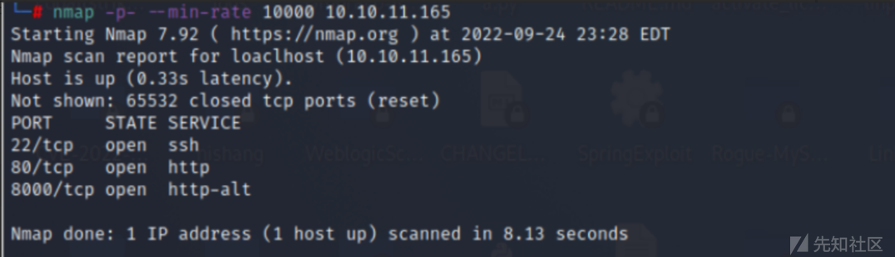](https://xzfile.aliyuncs.com/media/upload/picture/20240109142237-7be2c6ac-aeb7-1.png)

基于OpenSSH和Apache版本，主机可能运行的是 Ubuntu 18.04

[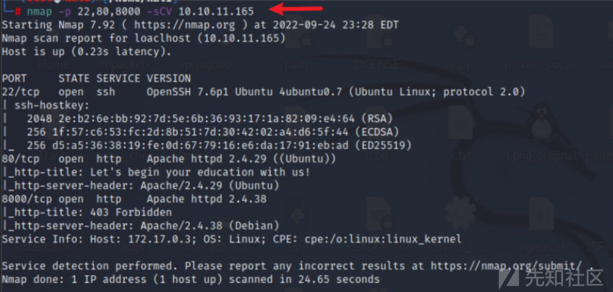](https://xzfile.aliyuncs.com/media/upload/picture/20240109142247-81ebc8aa-aeb7-1.png)

访问80端口，该网站适用于教育类型的公司：

[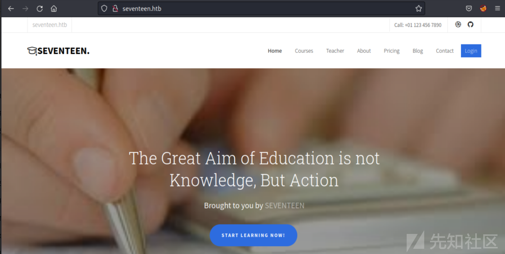](https://xzfile.aliyuncs.com/media/upload/picture/20240109142257-87800a42-aeb7-1.png)

## 目录爆破

使用feroxbuster工具对其目录进行爆破。

[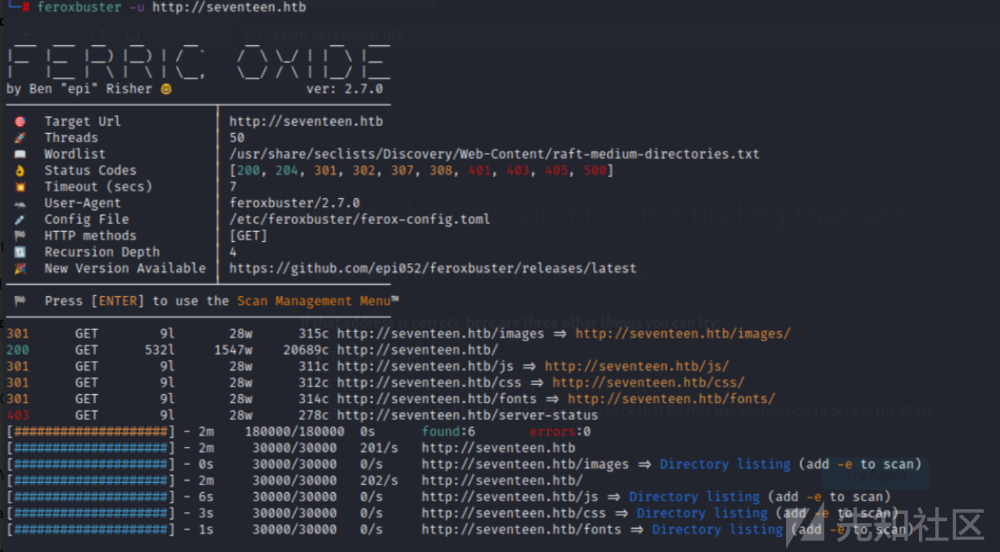](https://xzfile.aliyuncs.com/media/upload/picture/20240109142304-8bbd5330-aeb7-1.png)

没找到有用的东西。

[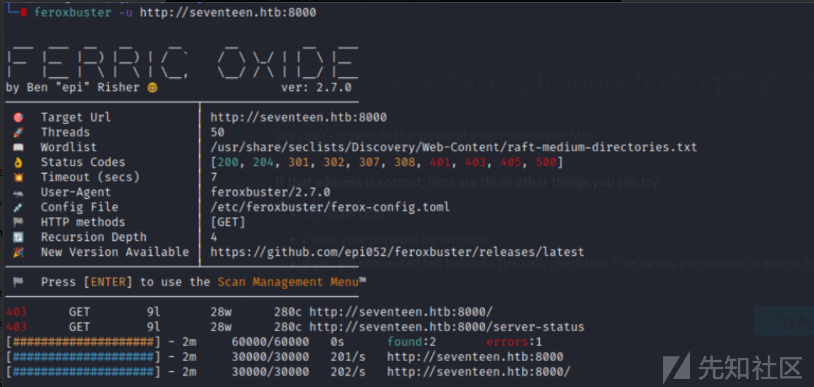](https://xzfile.aliyuncs.com/media/upload/picture/20240109142312-90e5bd20-aeb7-1.png)

## 子域名枚举

使用wfuzz对主域名进行子域名探测，发现存在exam子域。

[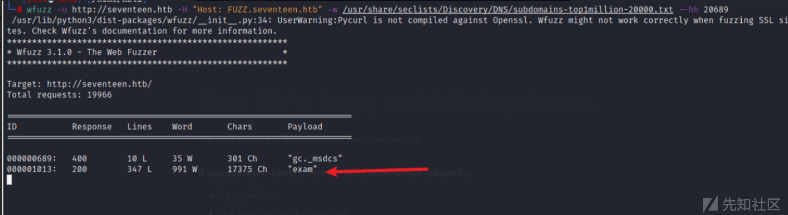](https://xzfile.aliyuncs.com/media/upload/picture/20240109142330-9b4743b0-aeb7-1.png)

访问子域名。发现该站点是托管考试管理系统。

[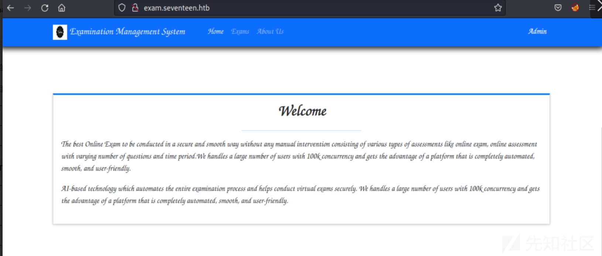](https://xzfile.aliyuncs.com/media/upload/picture/20240109142339-a08f9fac-aeb7-1.png)

单击“admin”链接转到/admin/login.php，它只是弹出一个消息框：

[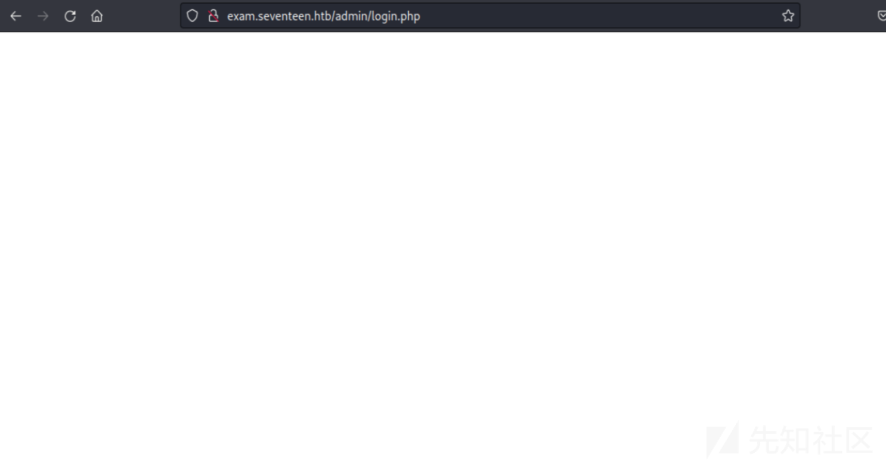](https://xzfile.aliyuncs.com/media/upload/picture/20240109142347-a5c57a14-aeb7-1.png)

继续对子域名的目录进行探测。

[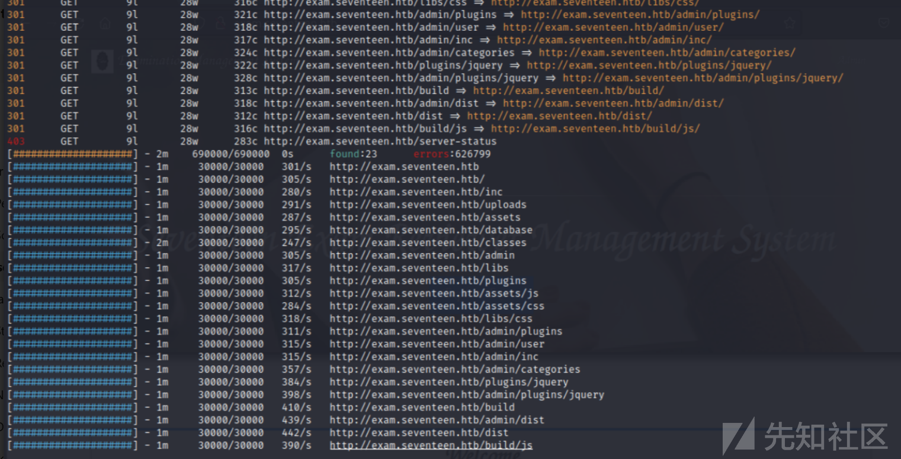](https://xzfile.aliyuncs.com/media/upload/picture/20240109142356-ab0cd63e-aeb7-1.png)

# 漏洞利用

## SQL注入漏洞

使用searchsplouit搜索历史漏洞。

[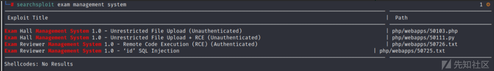](https://xzfile.aliyuncs.com/media/upload/picture/20240109142406-b0a29ed0-aeb7-1.png)

通过历史漏洞搜索，发现其payload：poc=take\_exam&id=1' AND 4755=4755 AND 'VHNu'='VHNu

[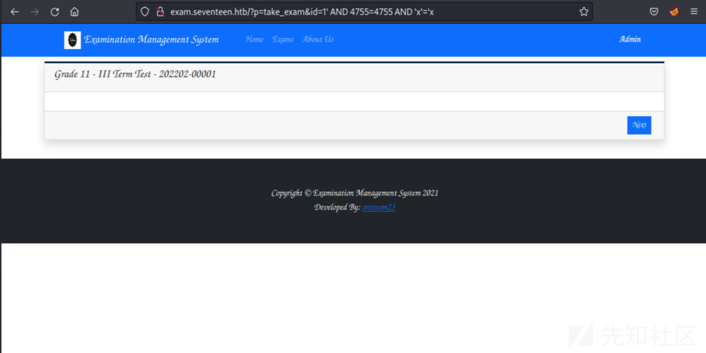](https://xzfile.aliyuncs.com/media/upload/picture/20240109142414-b57d61ce-aeb7-1.png)

经过测试之后，发现该版本还存在sql注入。

[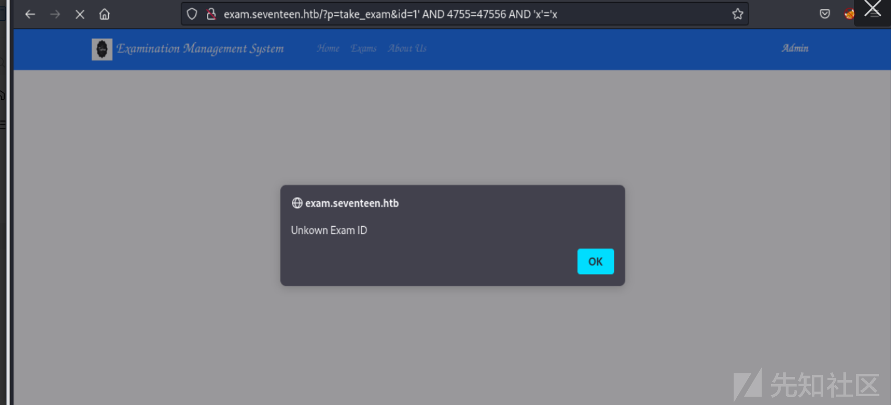](https://xzfile.aliyuncs.com/media/upload/picture/20240109142423-bac3f38c-aeb7-1.png)

## 使用sqlmap枚举数据库

首先判断注入点。用法：sqlmap -u'[http://exam.seventeen.htb/?p=take\_exam&id=1'-p](http://exam.seventeen.htb/?p=take_exam&id=1%27-p) id --technique B --batch

[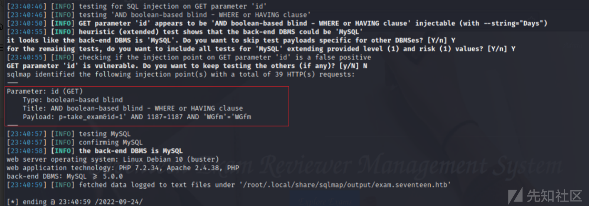](https://xzfile.aliyuncs.com/media/upload/picture/20240109142432-c066ceb8-aeb7-1.png)

接下来，使用--dbs列出数据库。

[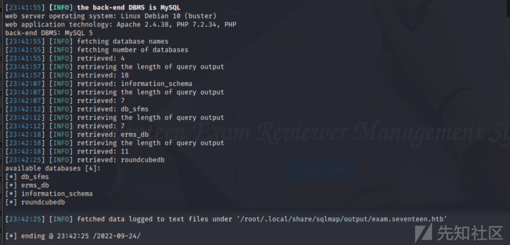](https://xzfile.aliyuncs.com/media/upload/picture/20240109142443-c6c3e214-aeb7-1.png)

列出数据库里面的表。

[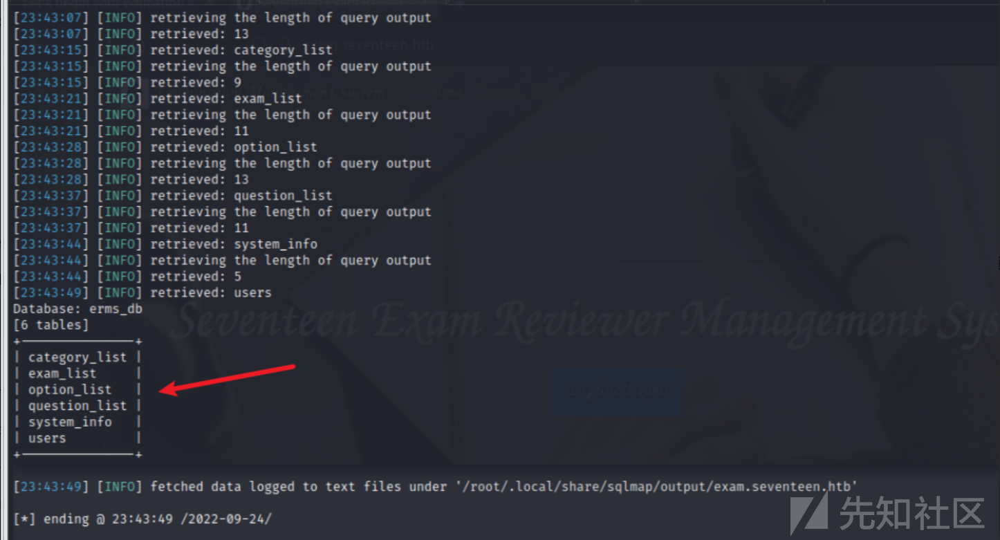](https://xzfile.aliyuncs.com/media/upload/picture/20240109142453-cca00c12-aeb7-1.png)

接着读出表里面的用户。

[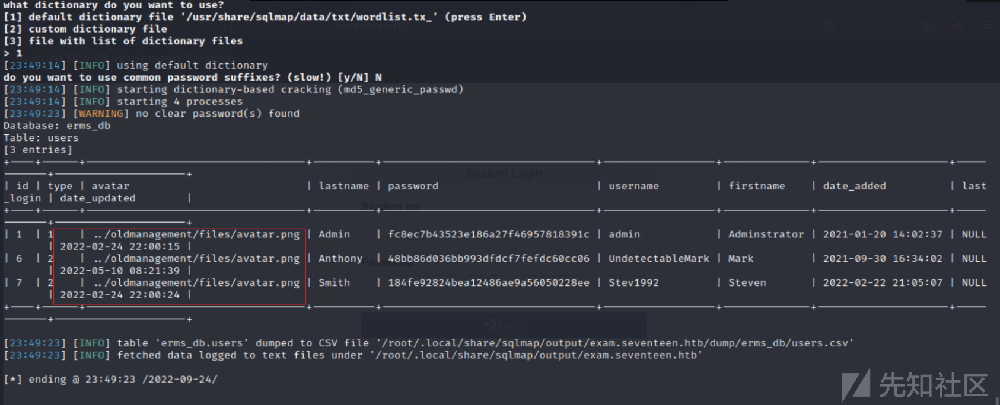](https://xzfile.aliyuncs.com/media/upload/picture/20240109142502-d226f2d6-aeb7-1.png)

在表里面，发现都指导了这个../oldmanagement/files/文件目录。  
访问一下试试，发现是一个登录框。

[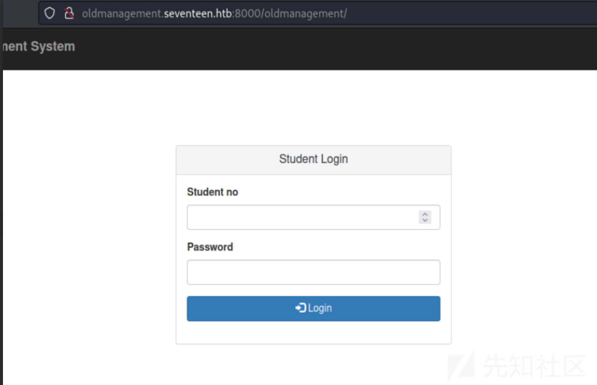](https://xzfile.aliyuncs.com/media/upload/picture/20240109142512-d7f08a88-aeb7-1.png)

接着继续读数据库里面的表。发现存在user表。

[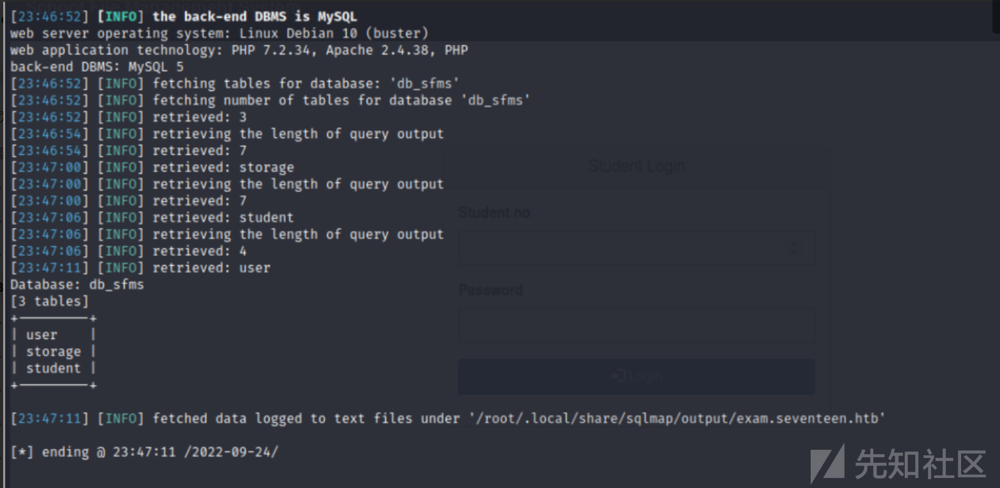](https://xzfile.aliyuncs.com/media/upload/picture/20240109142521-dd583c96-aeb7-1.png)

然后读里面的内容。发现了一些登录用户。

[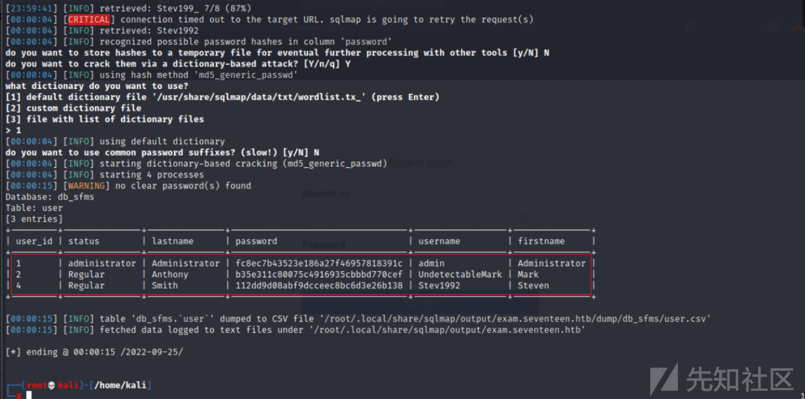](https://xzfile.aliyuncs.com/media/upload/picture/20240109142529-e26e7466-aeb7-1.png)

继续读下去。

[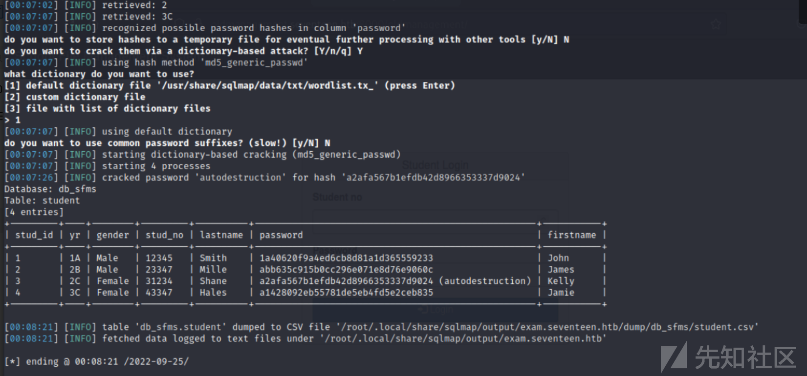](https://xzfile.aliyuncs.com/media/upload/picture/20240109142537-e721a7f8-aeb7-1.png)

[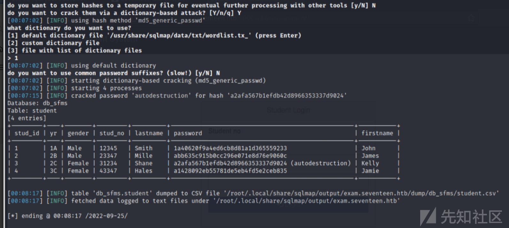](https://xzfile.aliyuncs.com/media/upload/picture/20240109142545-ebbf43a6-aeb7-1.png)

## 密码解密

可以使用CrackStation：[https://crackstation.net/来进行解密](https://crackstation.net/%E6%9D%A5%E8%BF%9B%E8%A1%8C%E8%A7%A3%E5%AF%86)

[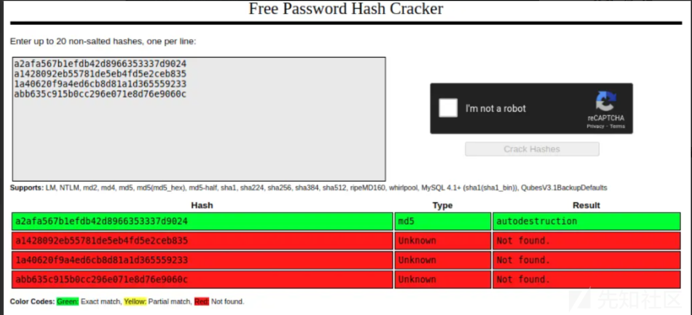](https://xzfile.aliyuncs.com/media/upload/picture/20240109142554-f1190bb6-aeb7-1.png)

或者使用somd5解密。密码为：autodestruction使用id和密码成功登录进行。

[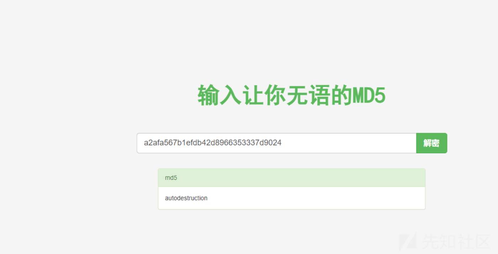](https://xzfile.aliyuncs.com/media/upload/picture/20240109142603-f688d752-aeb7-1.png)

## 命令执行漏洞

发现是一个上传界面。我上传了一个php木马。

[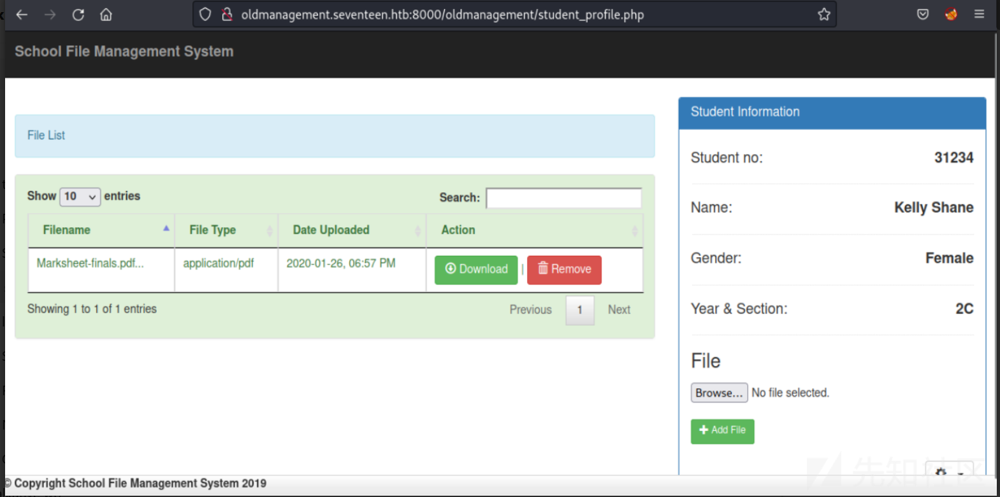](https://xzfile.aliyuncs.com/media/upload/picture/20240109142611-fb9d9ee4-aeb7-1.png)

里面有一个pdf，看看里面有什么东西可以利用。是一份成绩单。  
在里面发现了一个新的域名。

[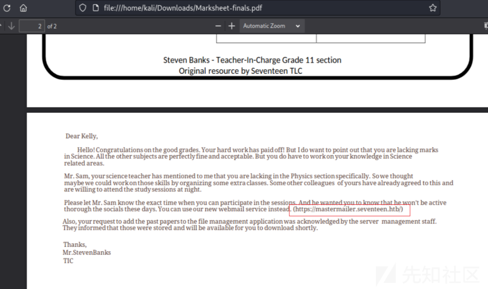](https://xzfile.aliyuncs.com/media/upload/picture/20240109142619-005e226e-aeb8-1.png)

添加到/etc/hosts,然后访问看看。

[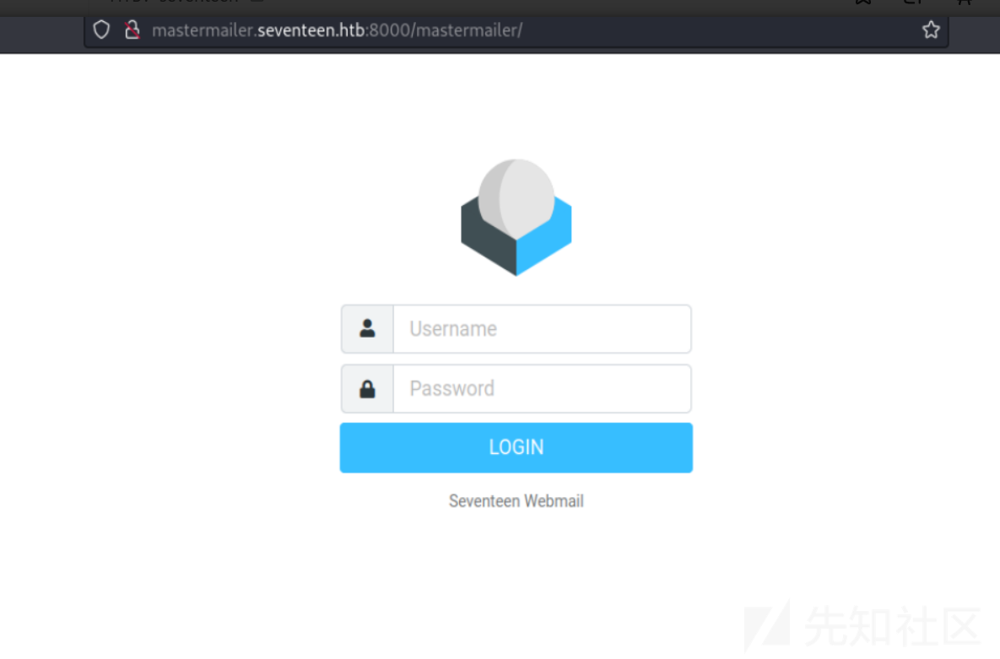](https://xzfile.aliyuncs.com/media/upload/picture/20240109142626-047d2d22-aeb8-1.png)

## 查看版本信息

访问/CHANGELOG可以判断其版本，或者使用f12查看。

[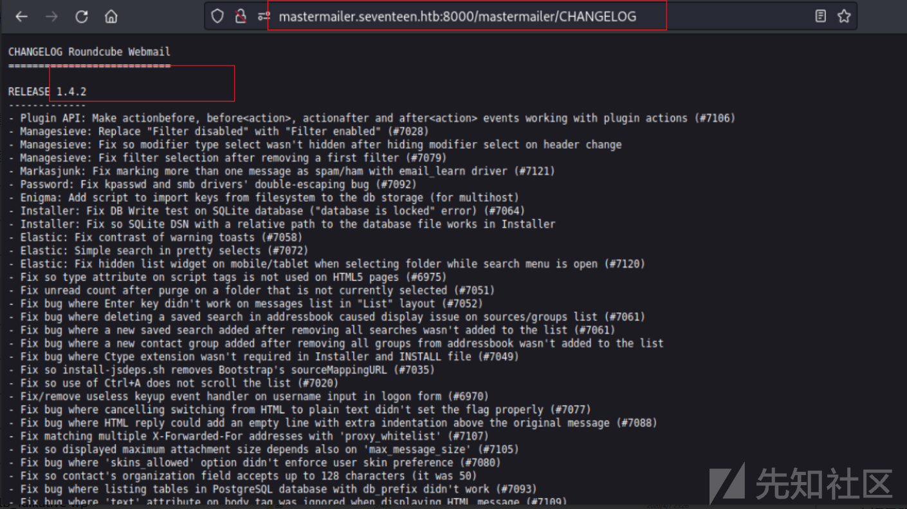](https://xzfile.aliyuncs.com/media/upload/picture/20240109142641-0d344018-aeb8-1.png)

## 源代码分析

下载源代码，对其进行代码审计一下看看下载处的代码逻辑。

[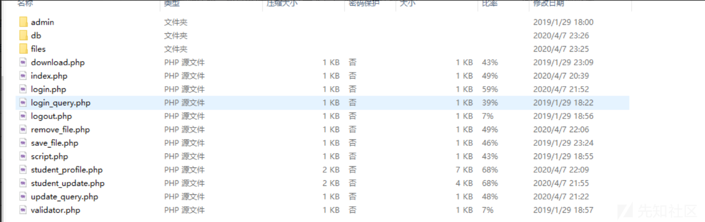](https://xzfile.aliyuncs.com/media/upload/picture/20240109142650-1268df58-aeb8-1.png)

download.php很简单：

[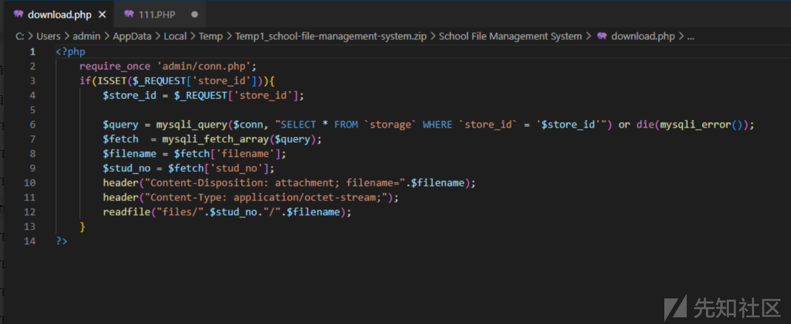](https://xzfile.aliyuncs.com/media/upload/picture/20240109142658-177907e8-aeb8-1.png)

storage它从数据库的表中获取一行，并从结果中获取文件名。它返回readfile(files/\[stud\_no\]/\[filename\])。  
所以它应该在/var/www/oldmanagement/files/31234/0xdf.php.需要一个目录来放在我的上传文件旁边。download.php使用store\_id获取路径，但也许我可以/files/31234直接访问

[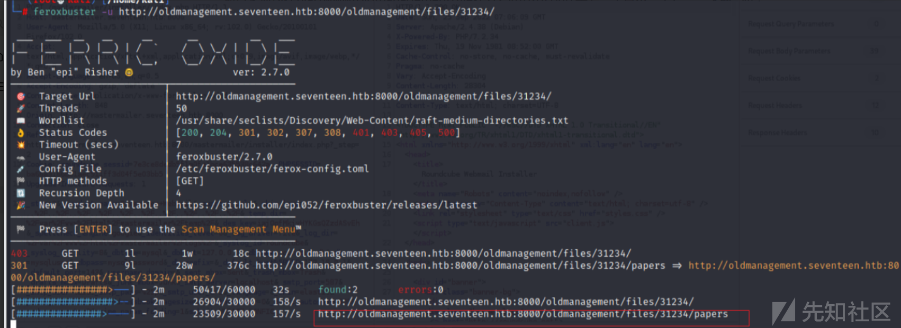](https://xzfile.aliyuncs.com/media/upload/picture/20240109142709-1dd76512-aeb8-1.png)

在这个文件夹中运行feroxbuster找到一个papers目录！

[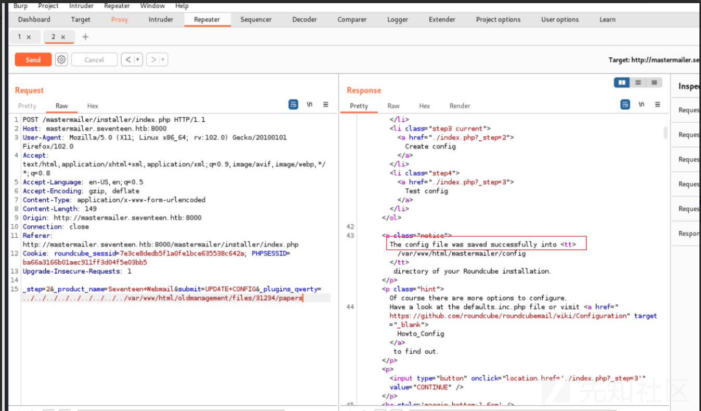](https://xzfile.aliyuncs.com/media/upload/picture/20240109142717-23071122-aeb8-1.png)

访问之后，发现提示报错。

首先上传一个php文件，然后将文件名更改为.htaccess  
[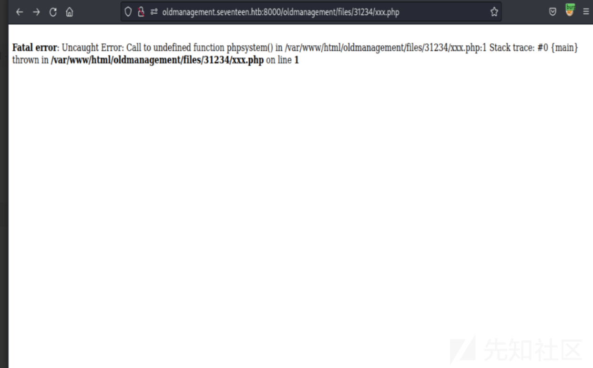](https://xzfile.aliyuncs.com/media/upload/picture/20240109142730-2a953874-aeb8-1.png)

## getshell

然后访问上传的php木马文件，成功getshell。

[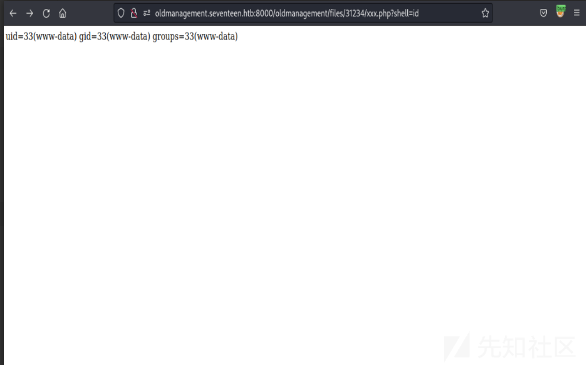](https://xzfile.aliyuncs.com/media/upload/picture/20240109142743-320fc79a-aeb8-1.png)

使用script /dev/null -c bash进行外壳升级

[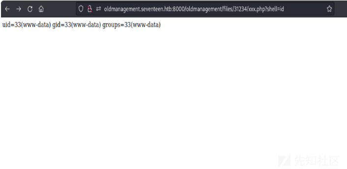](https://xzfile.aliyuncs.com/media/upload/picture/20240109142754-3906efd8-aeb8-1.png)

## 主机信息收集

继续翻一下，机器里面的这些文件，找一些有用的东西。

[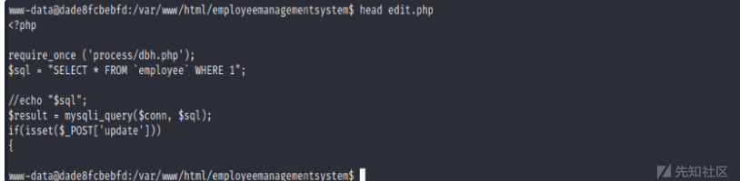](https://xzfile.aliyuncs.com/media/upload/picture/20240109142809-41aea1b2-aeb8-1.png)

发现数据库的登录密码。

```plain
$dBUsername = "root";
$dbPassword = "2020bestyearofmylife";
```

[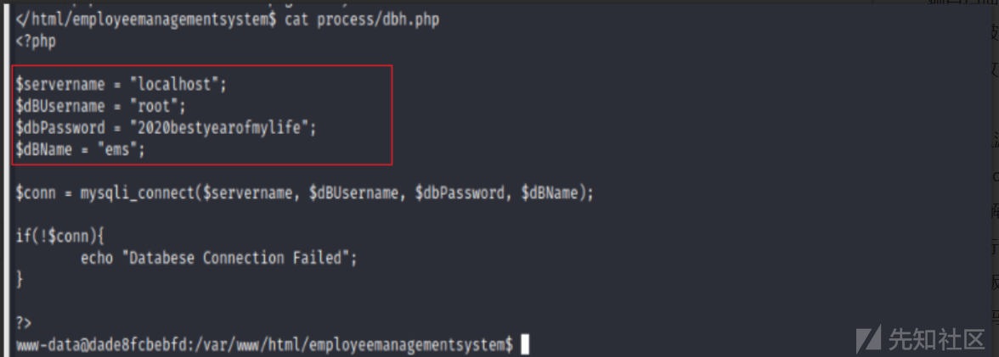](https://xzfile.aliyuncs.com/media/upload/picture/20240109142821-48c922c4-aeb8-1.png)

在mastermailer/config/config.inc.php我会找到这个连接字符串。

[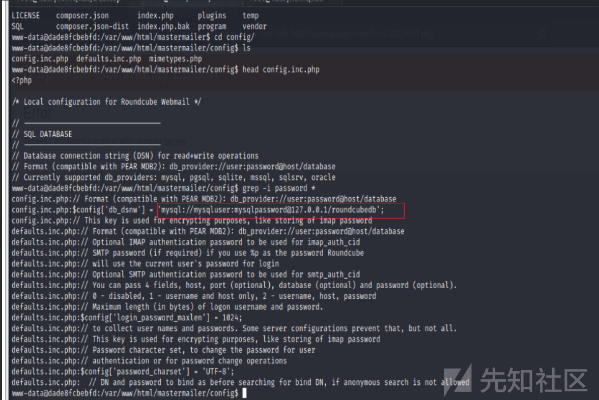](https://xzfile.aliyuncs.com/media/upload/picture/20240109142829-4da0b7c6-aeb8-1.png)

在oldmanagement/admin/conn.php另一个连接中，也含有一些信息。

[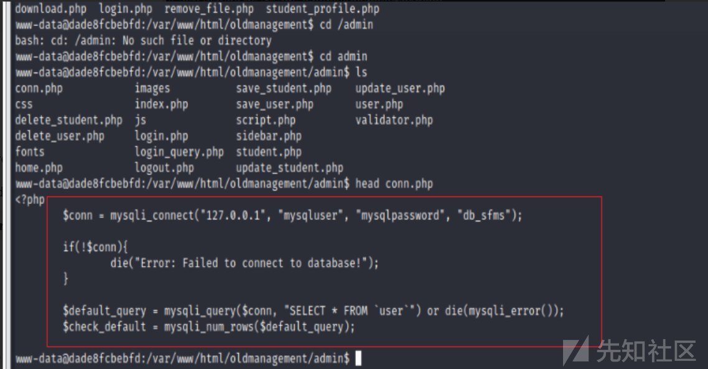](https://xzfile.aliyuncs.com/media/upload/picture/20240109142837-5232df94-aeb8-1.png)

## ssh登录

使用上面获取到的登录密码进行登录。

[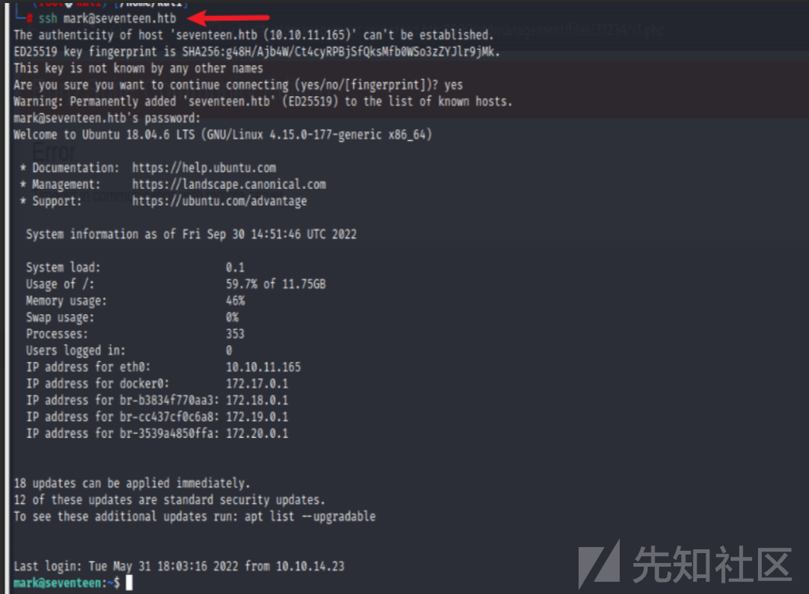](https://xzfile.aliyuncs.com/media/upload/picture/20240109142845-56ff87de-aeb8-1.png)

## 获取user.txt

登录之后，发现存在user.txt

[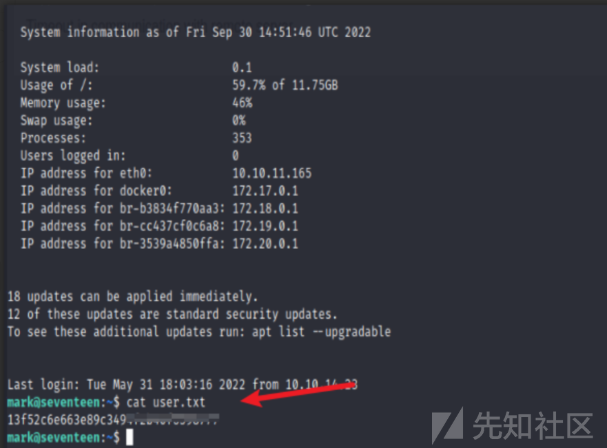](https://xzfile.aliyuncs.com/media/upload/picture/20240109142853-5bda47a8-aeb8-1.png)

使用ls -la 判断当前用户的权限。

[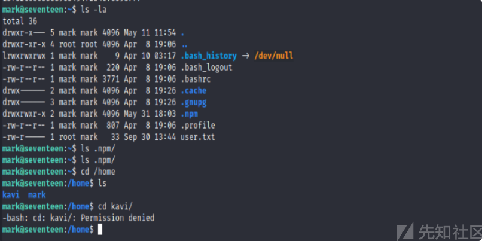](https://xzfile.aliyuncs.com/media/upload/picture/20240109142900-60575492-aeb8-1.png)

## 邮件提示

发现一个邮件，有 kavi 的邮件/var/mail：  
邮件提到了一个新项目、一个私有注册表（有一些问题）和一个旧记录器被替换为loglevel（一个公开可用的 JavaScript记录应用程序）

[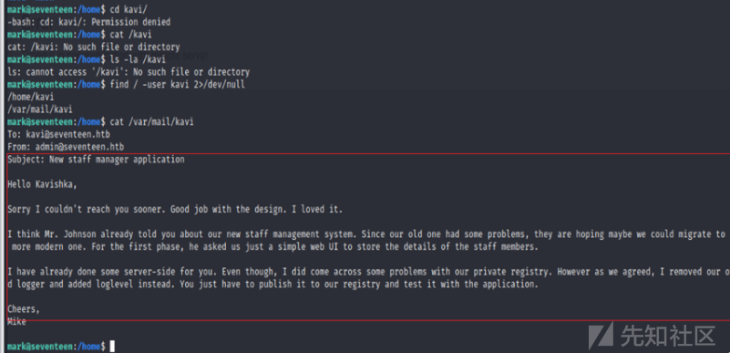](https://xzfile.aliyuncs.com/media/upload/picture/20240109142909-6551bbf4-aeb8-1.png)

查看监听端口，有一堆东西只在 localhost 上监听：

[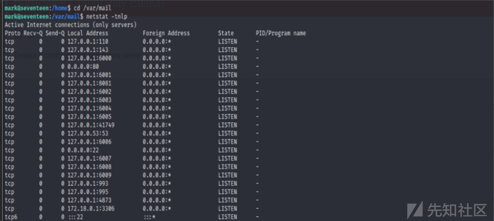](https://xzfile.aliyuncs.com/media/upload/picture/20240109142918-6acf14dc-aeb8-1.png)

通过一些研究，我可以将其余这些端口分为：  
● Roundcube 的邮件服务器 - 110、143、993、995  
● 用于各种网络服务器的 MySQL - 3306  
● 域名系统 - 53  
● 网站转发到 Docker - 8081 (exams), 8082 (oldmanager)  
● 未知 - 4873，但在.npm上面的文件夹中引用。  
老记录器  
该电子邮件提到了“旧记录器”，并提升了“注册表”。  
然后使用npm在本地注册表中搜索哪些日志记录模块。

[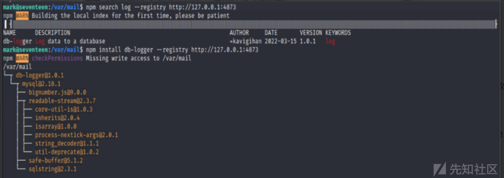](https://xzfile.aliyuncs.com/media/upload/picture/20240109142927-7083eaa6-aeb8-1.png)

运行npm install并将其指向本地存储库

[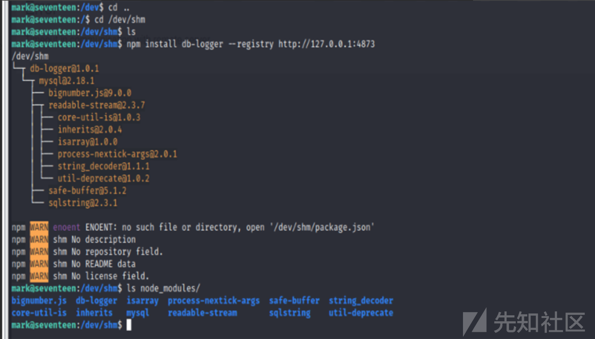](https://xzfile.aliyuncs.com/media/upload/picture/20240109142936-7553e8e2-aeb8-1.png)

将其下载到当前目录，从而创建一个node\_modules目录。在那里，我看到了一堆模块，包括db-logger：

[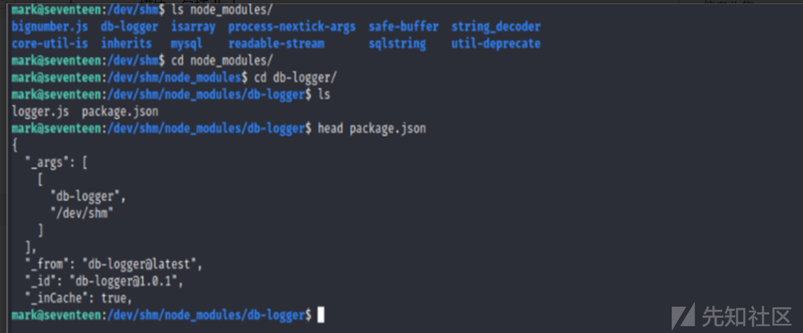](https://xzfile.aliyuncs.com/media/upload/picture/20240109142943-79e24a52-aeb8-1.png)

## 文件分析

该模块由一个 JavaScript 文件和一个package.json

[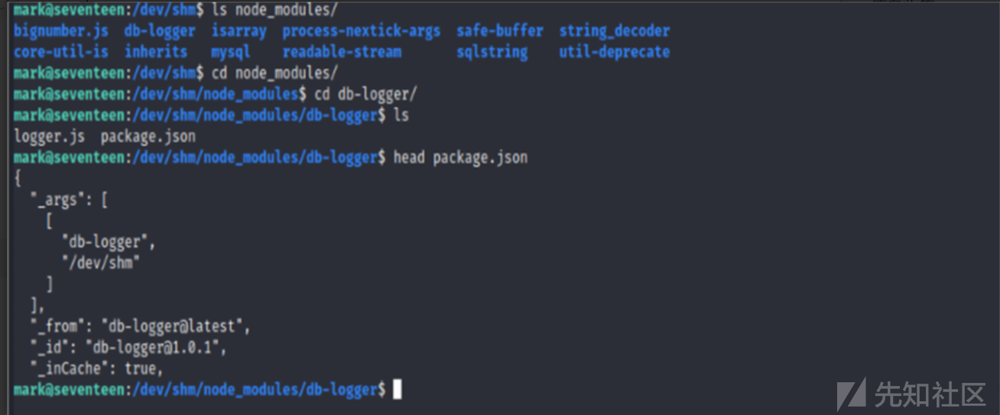](https://xzfile.aliyuncs.com/media/upload/picture/20240109142952-7edb41da-aeb8-1.png)

该package.json文件描述了该模块

[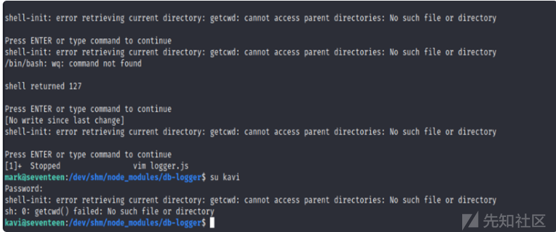](https://xzfile.aliyuncs.com/media/upload/picture/20240109143008-88dff220-aeb8-1.png)

在js文件里面翻到了登录密码。

```plain
var mysql = require('mysql');

var con = mysql.createConnection({
  host: "localhost",
  user: "root",
  password: "IhateMathematics123#",
  database: "logger"
});

function log(msg) {
    con.connect(function(err) {
        if (err) throw err;
        var date = Date();
        var sql = `INSERT INTO logs (time, msg) VALUES (${date}, ${msg});`;
        con.query(sql, function (err, result) {
        if (err) throw err;
        console.log("[+] Logged");
        });
    });
};

module.exports.log = log
```

继续使用ssh进行登录。、  
使用ls -la 查看有那些文件。

[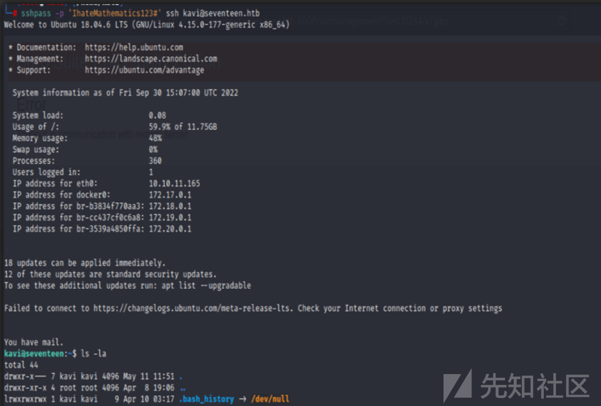](https://xzfile.aliyuncs.com/media/upload/picture/20240109143021-9030714e-aeb8-1.png)

有一个.npmrc文件，它配置如何npm运行，将默认注册表设置为本地注册表：

[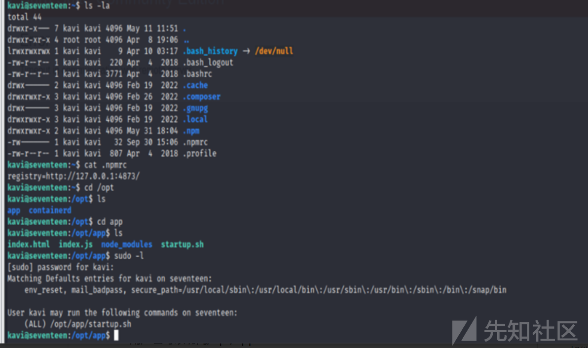](https://xzfile.aliyuncs.com/media/upload/picture/20240109143029-95753036-aeb8-1.png)

# 权限提升

kavi 用户也可以访问/opt/app  
创建模块步骤：[https://docs.npmjs.com/creating-node-js-modules](https://docs.npmjs.com/creating-node-js-modules)

[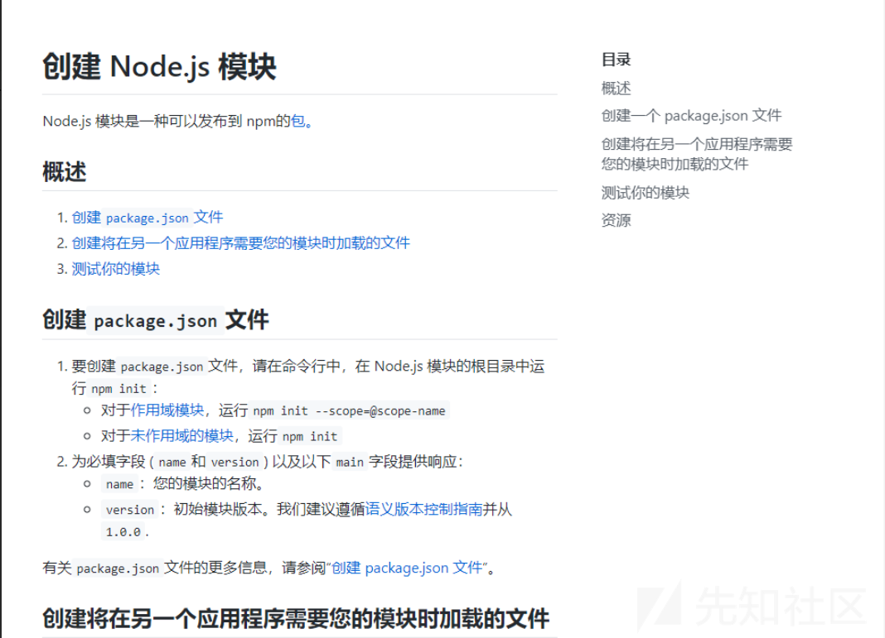](https://xzfile.aliyuncs.com/media/upload/picture/20240109143042-9d2ce3e6-aeb8-1.png)

恶意的js模块  
使用npm login，发现是注册被禁用。  
我在上面注意到有一个.npmrc文件/home/kavi设置了这个用户使用的存储库。我将尝试将其更改为指向我的主机，然后让 Verdaccio 的实例在那里提供恶意程序包。

[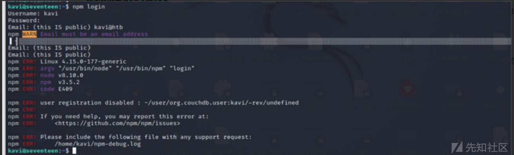](https://xzfile.aliyuncs.com/media/upload/picture/20240109143056-a5598290-aeb8-1.png)

## 创建节点模块。

创建一个loglevl目录，然后使用npm init 开始本地的模块

[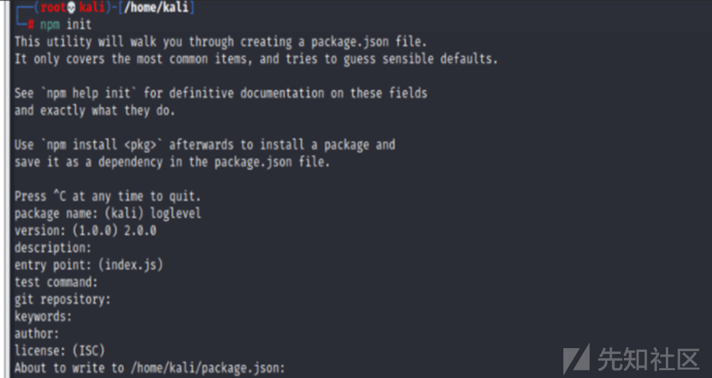](https://xzfile.aliyuncs.com/media/upload/picture/20240109143104-aa4802ae-aeb8-1.png)

创建一个loglevel目录，然后编辑index.js文件。

[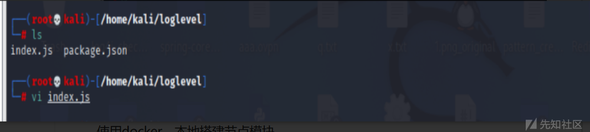](https://xzfile.aliyuncs.com/media/upload/picture/20240109143111-ae7535ea-aeb8-1.png)

## 本地搭建

使用docker，本地搭建节点模块

[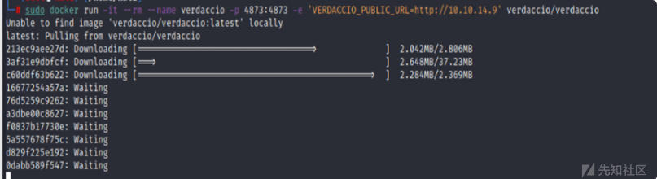](https://xzfile.aliyuncs.com/media/upload/picture/20240109143124-b5e8a85c-aeb8-1.png)

## 注册模块

[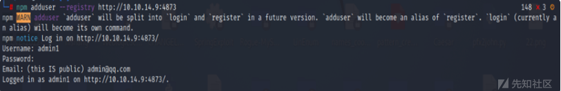](https://xzfile.aliyuncs.com/media/upload/picture/20240109143131-ba12ff68-aeb8-1.png)

运行docker pull verdaccio/verdaccio（以 root 身份、使用sudo或使用我的用户在docker组中）以获取容器映像的副本。  
发布模块

[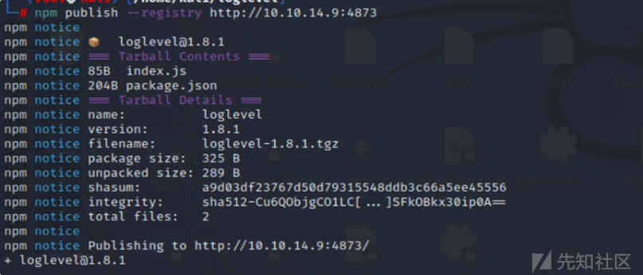](https://xzfile.aliyuncs.com/media/upload/picture/20240109143138-be1a796a-aeb8-1.png)

## 设置.npmrc文件

[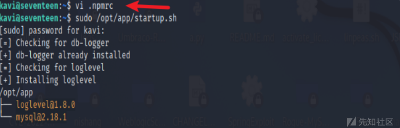](https://xzfile.aliyuncs.com/media/upload/picture/20240109143144-c1e3df64-aeb8-1.png)

## 运行文件

运行脚本，sudo /opt/app/startup.sh

[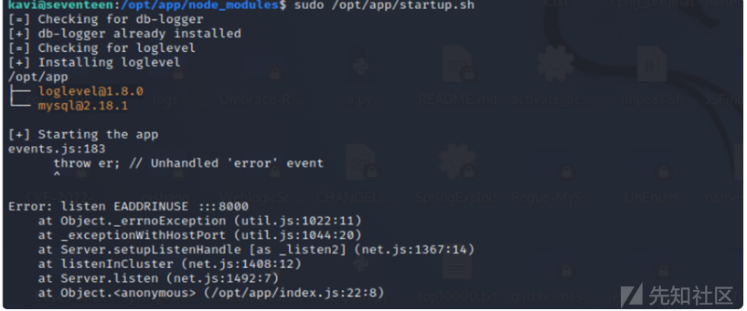](https://xzfile.aliyuncs.com/media/upload/picture/20240109143150-c5c028b8-aeb8-1.png)

## 成功获得shell。

获取root.txt

[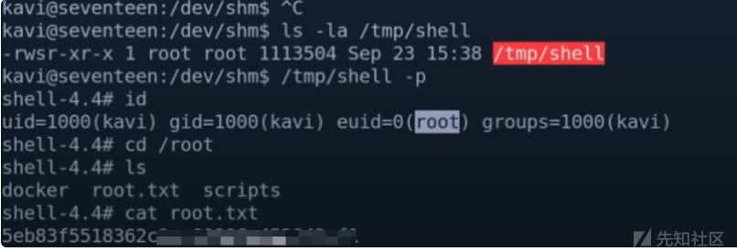](https://xzfile.aliyuncs.com/media/upload/picture/20240109143157-c9af9e0e-aeb8-1.png)

总结：  
首先通过信息收集中的常规操作，先端口扫描，然后继续目录爆破，接着子域名枚举。发现一个登录页面，通过历史漏洞搜索，发现其存在sql注入漏洞，然后使用sqlmap枚举数据库。接着登录之后，发现可以上传文件，上传之后进行命令执行，命令执行获取shell之后，进行主机信息收集，搜索一些登录信息，然后ssh远程登录。登录之后，获取user.txt，接着发现一封邮件，然后根据提示，发现了node.js模块，然后进行恶意js的模块利用进行权限提升，接着获取root.txt。该靶机为困难模式的靶机，在gethsll的时候，有2种方法，权限提升到最高权限有3种方法。
