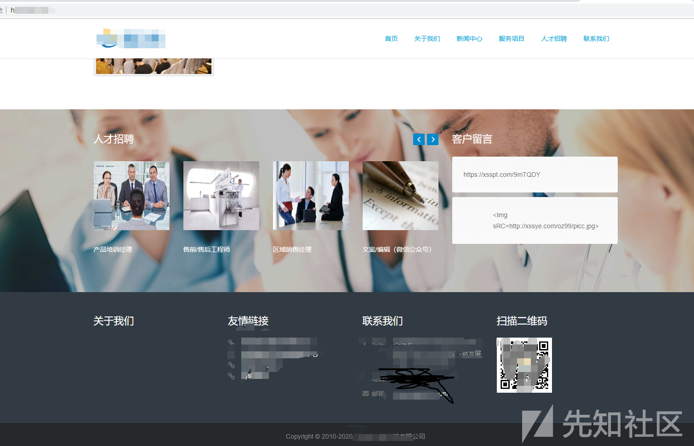
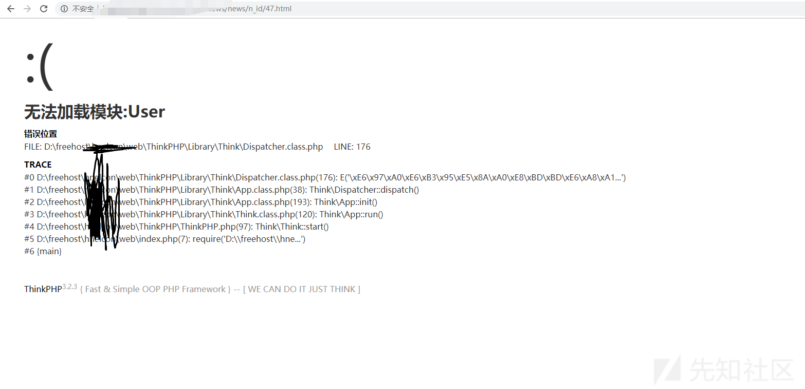
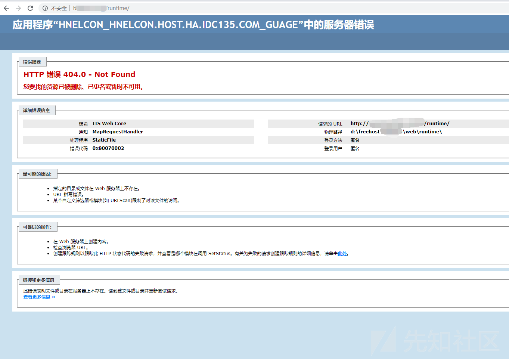
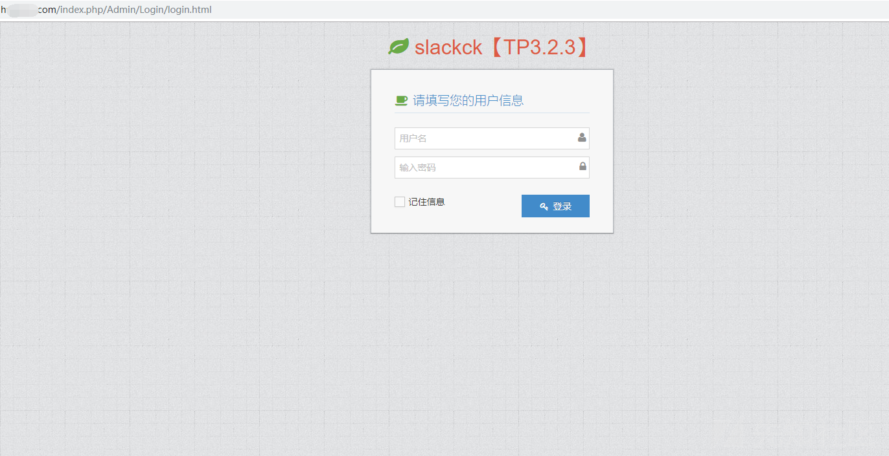
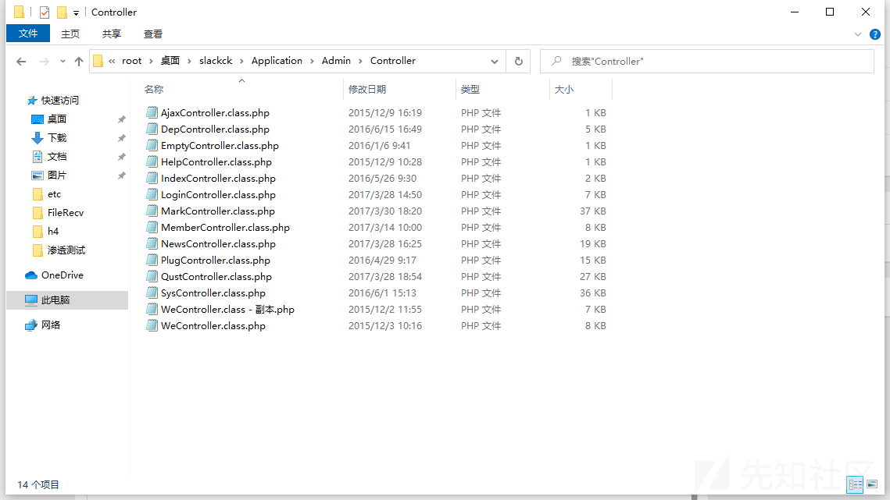
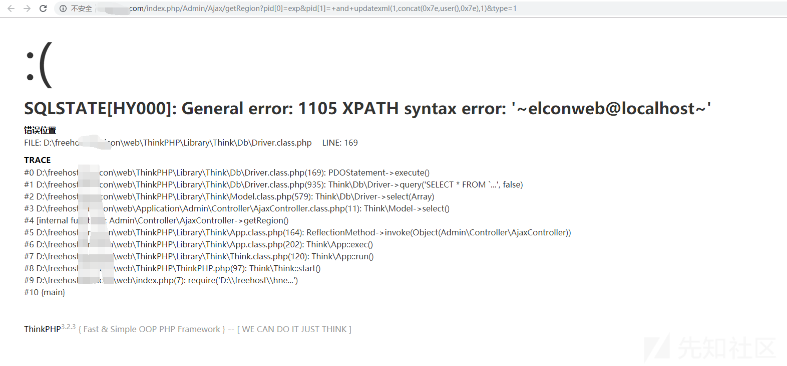
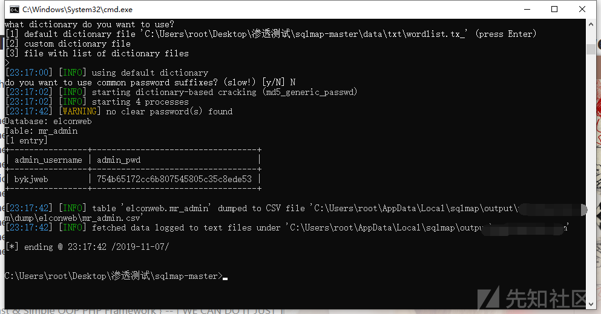

# 记一次渗透测试 - 先知社区

记一次渗透测试

- - -

### 0x01 信息收集:

打开网页后，网站长这样：  
[](https://xzfile.aliyuncs.com/media/upload/picture/20191115094241-36276498-0749-1.png)

随便进个网页：  
url:[http://www.\*.com/index.php/Home/News/lists/c\_id/12.html](http://www.*.com/index.php/Home/News/lists/c_id/12.html)

Emmmm，熟悉的URL，盲猜目标为ThinkPHP,改下URL：

url:[http://www.\*.com/index.php/User/News/lists/c\_id/12.html](http://www.*.com/index.php/User/News/lists/c_id/12.html)

[](https://xzfile.aliyuncs.com/media/upload/picture/20191113093538-e5b9123e-05b5-1.png)

还真是thinkphp，3.2.3，在thinkphp中可以查看日志文件来进行渗透，有的程序会将cookie写入日志，日志目录为runtime，但是这个站并不存在runtime:  
[](https://xzfile.aliyuncs.com/media/upload/picture/20191107230330-c2bb27bc-016f-1.png)

但是审这么久的代码也没白审，路由还是会猜的，单入口模式可以直接在index.php后面加admin，看看有没有后台：  
[](https://xzfile.aliyuncs.com/media/upload/picture/20191107230507-fc4c9a60-016f-1.png)

果然是这个路由，并且还得知了目标后台管理框架。

### 0x02 代码审计：

既然得知了目标后台使用的框架，所以我直接下载了回来。直接进入Admin的控制器：

[](https://xzfile.aliyuncs.com/media/upload/picture/20191107230742-58a5abf8-0170-1.png)

我看了代码直接发现控制器会继承至两个类，分别为：Controller、AuthController

其中 AuthController 需要身份认证，Controller不需要，所以我们只能找继承至Controller的控制器：

1.  login.php
2.  Ajax.php
3.  Dep.php
4.  Empty.php

理清思路后大概花了2分钟的时间在 AjaxController.class.php 找到了一处无条件注入：

```plain
public function getRegion(){
        $Region=M("region");
        $map['pid']=$_REQUEST["pid"];
        $map['type']=$_REQUEST["type"];
        $list=$Region->where($map)->select();
        echo json_encode($list);
    }
```

### 0x03 利用漏洞:

[](https://xzfile.aliyuncs.com/media/upload/picture/20191107231325-2501d6c2-0171-1.png)  
没有任何WAF，一马平川，直接上sqlmap：  
[](https://xzfile.aliyuncs.com/media/upload/picture/20191107231816-d2b877bc-0171-1.png)

### 0x04 Getshell:

Getshell的思路也很简单，php+iis7.5，可以直接用fastcgi的解析漏洞，我只需要找到一个上传图片的点就可以了。过于简单，就不贴图了。

### 0x05 后记：

**某些傻逼不要去复现,OK?和NM弱智一样，还好意思在评论问我为什么不行。发出来是为了学习，不是让你害我**
