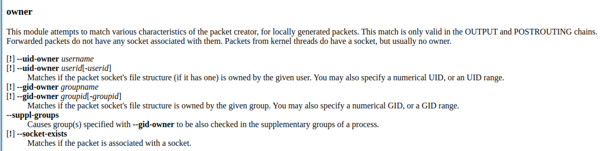
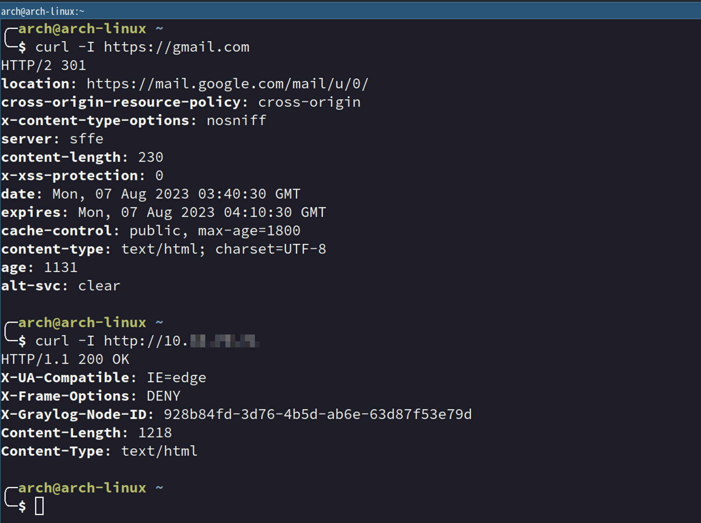

# 记录一下配置Clash透明代理

2023-8-7|2023-8-10

18118


倾旋

😀

我日常使用Arch Linux来进行办公，但公司的办公网络和上网需要挂不同的代理，浏览器切换起来有点麻烦，我需要一个解决方案支持配置规则的方式来让我系统上的流量进行选择性的转发，我发现Clash+iptables（Linux用户独有的福利）可以非常简单的做到。

## 

[↓↓↓](#57f19022c0ab4373b9e5f21c46f73ec6 "📝Clash是什么？")  
  
  
  
[↑↑↑](#57f19022c0ab4373b9e5f21c46f73ec6 "📝Clash是什么？")

📝Clash是什么？

[↓↓↓](https://github.com/Dreamacro/clash)  
  

clash

Dreamacro • Updated Invalid Date NaN, NaN

  
  
[↑↑↑](https://github.com/Dreamacro/clash)

Clash是一个支持多种协议隧道转发的工具，主要功能如下：

-   Inbound: HTTP, HTTPS, SOCKS5 server, TUN device

-   Outbound: Shadowsocks(R), VMess, Trojan, Snell, SOCKS5, HTTP(S), Wireguard

-   Rule-based Routing: dynamic scripting, domain, IP addresses, process name and more

-   Fake-IP DNS: minimises impact on DNS pollution and improves network performance

-   Transparent Proxy: Redirect TCP and TProxy TCP/UDP with automatic route table/rule management

-   Proxy Groups: automatic fallback, load balancing or latency testing

-   Remote Providers: load remote proxy lists dynamically

-   RESTful API: update configuration in-place via a comprehensive API

目前作者还在维护[高级核心版](https://dreamacro.github.io/clash/premium/introduction.html)（免费），为了尝试支持更多功能。

## 

[↓↓↓](#3717066287dc4c839e499d6ab986ab96 "🪢关于透明代理")  
  
  
  
[↑↑↑](#3717066287dc4c839e499d6ab986ab96 "🪢关于透明代理")

🪢关于透明代理

这里可以参考之前写过的一篇介绍：

[↓↓↓](https://payloads.online/article/93929c47-1f25-419b-96d8-7c8f396c036a)  
  

Linux透明代理在红队渗透中的应用 | 倾旋的博客

本篇文章，主要是记录工作中想让外网打点和内网渗透的场景进行透明代理的体验。


https://payloads.online/article/93929c47-1f25-419b-96d8-7c8f396c036a


  
  
[↑↑↑](https://payloads.online/article/93929c47-1f25-419b-96d8-7c8f396c036a)

## 

[↓↓↓](#9ddeca2f52b64351ac9ba497deecd2e7 "配置Clash服务")  
  
  
  
[↑↑↑](#9ddeca2f52b64351ac9ba497deecd2e7 "配置Clash服务")

配置Clash服务

这里需要注意的是需要设置redir-port，这个选项: *Linux 和 macOS 的透明代理服务端口 (TCP 和 TProxy UDP 重定向)*

```yaml
port: 7890
socks-port: 7891
allow-lan: true
redir-port: 7892
mode: Rule
log-level: info
external-controller: 127.0.0.1:9090
experimental:
  interface-name: enp34s0 # your interface-name
dns:
  enable: true
  listen: 127.0.0.1:53
  nameserver:
    - 223.5.5.5
  fallback:
    - 'tls://1.1.1.1:853'
    - 'tcp://1.1.1.1'
    - 'tcp://208.67.222.222:443'
    - 'tls://dns.google'
```

YAML

Copy

除此之外，最好编写一个服务文件，将Clash运行在其他用户身份下：

```plain
[Unit]
Description=clash daemon

[Service]
Type=simple
StandardError=journal
User=clash
Group=clash
CapabilityBoundingSet=CAP_NET_BIND_SERVICE CAP_NET_ADMIN
AmbientCapabilities=CAP_NET_BIND_SERVICE CAP_NET_ADMIN
ExecStart=/usr/bin/clash -d /home/arch/.config/clash
Restart=on-failure

[Install]
WantedBy=default.target
```

Plain text

Copy

将服务文件拷贝到：/etc/systemd/system/

```plain
$ sudo systemctl daemon-reload # 重新扫描服务单元变更
$ sudo systemctl enable clash  # 开机启动
$ sudo systemctl start clash   # 启动Clash
```

Plain text

Copy

设置DNS服务器地址，直接/etc/resolv.conf文件即可：

```plain
# /etc/resolv.conf
nameserver 127.0.0.1
```

Plain text

Copy

## 

[↓↓↓](#085666d1ac7c4d04b7a19b4de48e2ef6 "配置iptables规则")  
  
  
  
[↑↑↑](#085666d1ac7c4d04b7a19b4de48e2ef6 "配置iptables规则")

配置iptables规则

在iptables中有一个owner模块，可以过滤指定用户的流量，对我们来说只需要将clash运行在一个单独的用户身份下，对这个用户的所有流量放行即可。



iptables命令：

```plain
# 添加规则
sudo iptables -t nat -A OUTPUT -p tcp -m owner ! --uid-owner clash ! -d 127.0.0.1 -j REDIRECT --to-port 7892

# 删除规则
sudo iptables -t nat -D OUTPUT -p tcp -m owner ! --uid-owner clash ! -d 127.0.0.1 -j REDIRECT --to-port 7892
```

Plain text

Copy

这个命令的意思是将所有不属于用户ID为"clash"的TCP流量重定向到端口7892。

## 

[↓↓↓](#689d25c6c5da4204a5acab3f697d0264 "配置Clash规则")  
  
  
  
[↑↑↑](#689d25c6c5da4204a5acab3f697d0264 "配置Clash规则")

配置Clash规则

```yaml
proxies:
  - ...server1
  - ...server2
proxy-groups:
  - name: ProxyChian1
    type: select
    proxies:
      - server1
      - DIRECT
- name: ProxyChian2
    type: select
    proxies:
      - DIRECT
	- name: 工作环境
    type: select
    proxies:
      - server1
rules:
  - DOMAIN-SUFFIX,local,ProxyChian2
  - DOMAIN-SUFFIX,localhost,ProxyChian2
  - DOMAIN-SUFFIX,payloads.online,工作环境
  - IP-CIDR,10.100.0.0/16,工作环境,no-resolve
  - IP-CIDR,10.33.70.0/24,工作环境,no-resolve
  - .....
```

YAML

Copy

通过rules可以配置不同的DNS域名、IP-CIDR目标地址的流量该走到哪个代理链上，这里我的规则仅仅只是示例，为了达到更好的网络体验，规则是上达几百行的。



如此一来，工作/上网问题不需要切换代理解决了。

[技术分享](https://payloads.online/category/%E6%8A%80%E6%9C%AF%E5%88%86%E4%BA%AB)

[工具](https://payloads.online/tag/%E5%B7%A5%E5%85%B7)

[红队行动守则](https://payloads.online/archivers/2023/08/10/0ba7791c-bb0f-42e7-8623-22fe07b59fa8)[使用Appveyor构建VS项目-快速编译](https://payloads.online/archivers/2023/07/23/9e329caf-052d-4bd9-908b-0ae40a0058bd)

#### [0 个表情](https://github.com/Rvn0xsy/rvn0xsy.github.io/discussions/22)

[登录](https://giscus.app/api/oauth/authorize?redirect_uri=https%3A%2F%2Fpayloads.online%2Farchivers%2F2023%2F08%2F07%2F74116aab-0b33-4644-a6cc-28de0b36214d)后可添加回应。

👍👎😄🎉😕❤️🚀👀

#### [5 条评论](https://github.com/Rvn0xsy/rvn0xsy.github.io/discussions/22)

#### ·

#### 1 条回复

*– 由 [giscus](https://giscus.app/) 提供支持*

-   最早
-   最新

[heheda123123](https://github.com/heheda123123)[8 月 11 日](https://github.com/Rvn0xsy/rvn0xsy.github.io/discussions/22#discussioncomment-6697443)

v2raya不需要任何配置就支持透明代理

1

[登录](https://giscus.app/api/oauth/authorize?redirect_uri=https%3A%2F%2Fpayloads.online%2Farchivers%2F2023%2F08%2F07%2F74116aab-0b33-4644-a6cc-28de0b36214d)后可添加回应。

👍👎😄🎉😕❤️🚀👀

1 条回复

[](https://github.com/Rvn0xsy)

[Rvn0xsy](https://github.com/Rvn0xsy)[8 月 11 日](https://github.com/Rvn0xsy/rvn0xsy.github.io/discussions/22#discussioncomment-6697594)

所有者

棒！

[登录](https://giscus.app/api/oauth/authorize?redirect_uri=https%3A%2F%2Fpayloads.online%2Farchivers%2F2023%2F08%2F07%2F74116aab-0b33-4644-a6cc-28de0b36214d)后可添加回应。

👍👎😄🎉😕❤️🚀👀

[coutcin-xw](https://github.com/coutcin-xw)[8 月 13 日](https://github.com/Rvn0xsy/rvn0xsy.github.io/discussions/22#discussioncomment-6713267)

师傅，我目前也是Archlinux作为主系统在使用，看您使用了Clash作为代理软件，但是对于日常的访问google等需求，纯Clash比较难用，使用clash-for-windows可以吗

1

[登录](https://giscus.app/api/oauth/authorize?redirect_uri=https%3A%2F%2Fpayloads.online%2Farchivers%2F2023%2F08%2F07%2F74116aab-0b33-4644-a6cc-28de0b36214d)后可添加回应。

👍👎😄🎉😕❤️🚀👀

0 条回复

[Rvn0xsy](https://github.com/Rvn0xsy)[8 月 13 日](https://github.com/Rvn0xsy/rvn0xsy.github.io/discussions/22#discussioncomment-6713275)

所有者

Clash for Windows不就是包装了一个图形界面吗。 我直接通过浏览器管理Clash的，一样的效果。 你可以在Github搜索这个项目：yacd ，或者 Clash Dashboard，支持Docker部署。

[…](#)

1

[登录](https://giscus.app/api/oauth/authorize?redirect_uri=https%3A%2F%2Fpayloads.online%2Farchivers%2F2023%2F08%2F07%2F74116aab-0b33-4644-a6cc-28de0b36214d)后可添加回应。

👍👎😄🎉😕❤️🚀👀

0 条回复

[Dullxxs](https://github.com/Dullxxs)[8 月 15 日](https://github.com/Rvn0xsy/rvn0xsy.github.io/discussions/22#discussioncomment-6728159)

这不上openwrt+openclash

1

[登录](https://giscus.app/api/oauth/authorize?redirect_uri=https%3A%2F%2Fpayloads.online%2Farchivers%2F2023%2F08%2F07%2F74116aab-0b33-4644-a6cc-28de0b36214d)后可添加回应。

👍👎😄🎉😕❤️🚀👀

0 条回复

[Rvn0xsy](https://github.com/Rvn0xsy)[8 月 15 日](https://github.com/Rvn0xsy/rvn0xsy.github.io/discussions/22#discussioncomment-6728468)

所有者

😁在公司上班，用的台式机，家里倒是可以这么整

[…](#)

1

[登录](https://giscus.app/api/oauth/authorize?redirect_uri=https%3A%2F%2Fpayloads.online%2Farchivers%2F2023%2F08%2F07%2F74116aab-0b33-4644-a6cc-28de0b36214d)后可添加回应。

👍👎😄🎉😕❤️🚀👀

0 条回复

输入预览

[↓↓↓](https://guides.github.com/features/mastering-markdown/ "支持使用 Markdown 语法")  
  
  
  
[↑↑↑](https://guides.github.com/features/mastering-markdown/ "支持使用 Markdown 语法")

[↓↓↓](https://giscus.app/api/oauth/authorize?redirect_uri=https%3A%2F%2Fpayloads.online%2Farchivers%2F2023%2F08%2F07%2F74116aab-0b33-4644-a6cc-28de0b36214d)  
  
使用 GitHub 登录  
  
[↑↑↑](https://giscus.app/api/oauth/authorize?redirect_uri=https%3A%2F%2Fpayloads.online%2Farchivers%2F2023%2F08%2F07%2F74116aab-0b33-4644-a6cc-28de0b36214d)

0%

[📝Clash是什么？](#57f19022c0ab4373b9e5f21c46f73ec6)[🪢关于透明代理](#3717066287dc4c839e499d6ab986ab96)[配置Clash服务](#9ddeca2f52b64351ac9ba497deecd2e7)[配置iptables规则](#085666d1ac7c4d04b7a19b4de48e2ef6)[配置Clash规则](#689d25c6c5da4204a5acab3f697d0264)
