# 记针对某单位一次相对完整的渗透测试 - 先知社区

记针对某单位一次相对完整的渗透测试

- - -

给了7个IP地址

[](https://xzfile.aliyuncs.com/media/upload/picture/20191221195556-d8bd1a3e-23e8-1.png)

### 0x01 加载中

**日常探测端口信息:**

| ip  | port |
| --- | --- |
| x.x.x.222 | 8009 |
| x.x.x.223 | 20080 |
| x.x.x.39 | 8008 |

一度以为自己探测的姿势不对，反复调整还是只扫出这些来。

都是web服务:

[](https://xzfile.aliyuncs.com/media/upload/picture/20191221195656-fc795e74-23e8-1.png)

**日常找目录:**

[](https://xzfile.aliyuncs.com/media/upload/picture/20191221195748-1bb0d5ec-23e9-1.png)

结合结合命名规律扫描最终找到以下有效率页面

```plain
http://x.x.x.xxx:8888/z1234/
http://x.x.x.xxx:20080/download/
```

z1234是一个报名页面,测试时已经过了报名日期,被停用,空有一个登陆页面。

download页面如下

[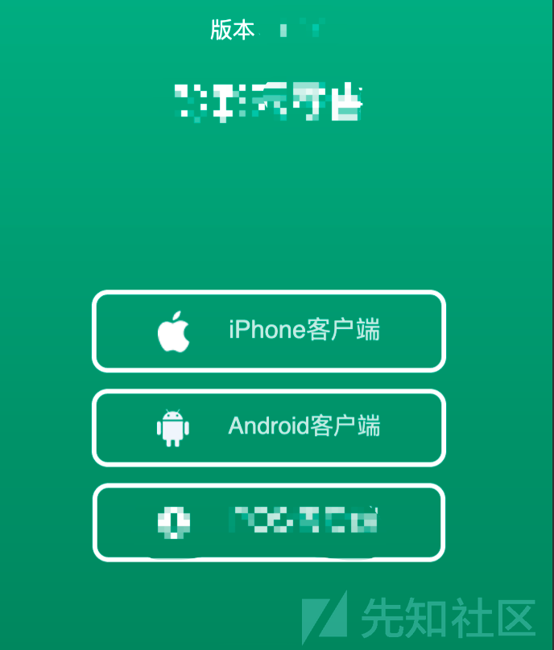](https://xzfile.aliyuncs.com/media/upload/picture/20191230230411-a2b0559e-2b15-1.png)

**日常反编译:**

[](https://xzfile.aliyuncs.com/media/upload/picture/20191221195834-36cd5760-23e9-1.png)

端口对得上,走http协议,挂着代理转换Web的方式进行测试。

[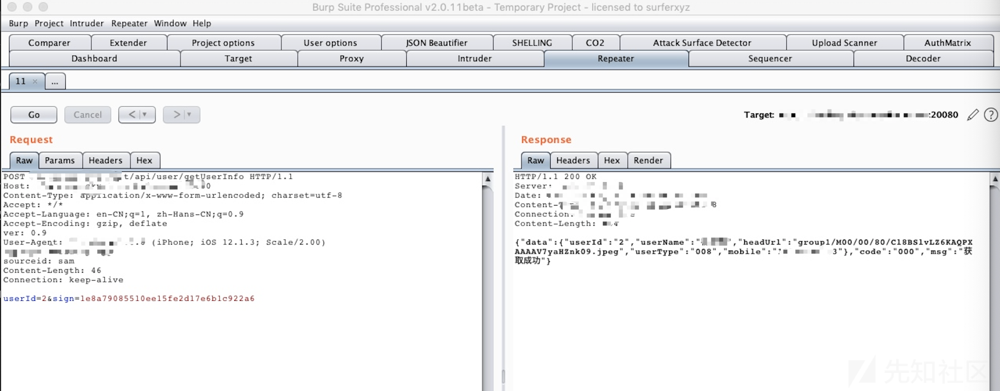](https://xzfile.aliyuncs.com/media/upload/picture/20191221195910-4cb7f5a8-23e9-1.png)

很明显APP有签名机制，代码段如下:

[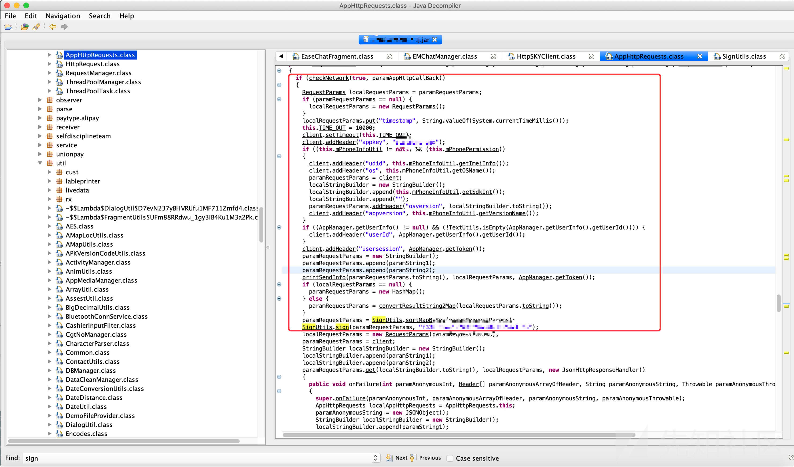](https://xzfile.aliyuncs.com/media/upload/picture/20191221195950-6457c4b8-23e9-1.png)

跟着算法写脚本构造数据包,测试各类逻辑漏洞,代码忘记放哪个文件夹了...看最终成果:

[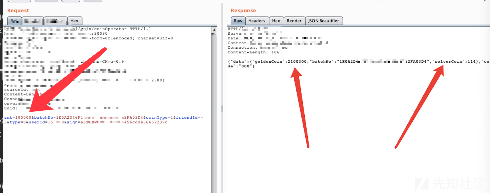](https://xzfile.aliyuncs.com/media/upload/picture/20191221200008-6ef1ffa6-23e9-1.png)

amt参数是转账金额,转100就是参数值-100,对于的改成正数就就可以增加余额了...

[](https://xzfile.aliyuncs.com/media/upload/picture/20191221200053-899528a6-23e9-1.png)

按照系统机制这个金币可以直接兑换RMB或者买东西...

**日常测试：**

[](https://xzfile.aliyuncs.com/media/upload/picture/20191221200209-b76423ea-23e9-1.png)

[](https://xzfile.aliyuncs.com/media/upload/picture/20191221200232-c4bdfad4-23e9-1.png)

任意文件上传拿shell。

[](https://xzfile.aliyuncs.com/media/upload/picture/20191221200313-dd471040-23e9-1.png)

没有域,但是每台都有杀毒软件。(据说之前被某安检查出问题被罚过钱,就做了这个“防御”)

[](https://xzfile.aliyuncs.com/media/upload/picture/20191221200328-e61c199a-23e9-1.png)

这个Hash没能解密成功。有杀软添加账户不方便,没有账户密码的话跑起TV来也是黑屏。有AV条件下添加用户可以参考[https://xz.aliyun.com/t/4078](https://xz.aliyun.com/t/4078), 有密码可以把端口转发到公网，也可以上传TeamViewer去远程连接,转发什么的都省了。

**日常横向：**

[](https://xzfile.aliyuncs.com/media/upload/picture/20191221212631-807b7a3e-23f5-1.png)

扫一个C段半小时。。。

这里最终打到一个03的服务器,激活Guest空口令登陆。

```plain
Windows server 2003默认允许空口令登陆。
AV会拦截添加/删除用户,修改密码的行为，但是不会拦截将已有用户添加至管理组。
```

[](https://xzfile.aliyuncs.com/media/upload/picture/20191221200452-183ff4c8-23ea-1.png)

如图,双网卡。

上传masscan探测两个段:

[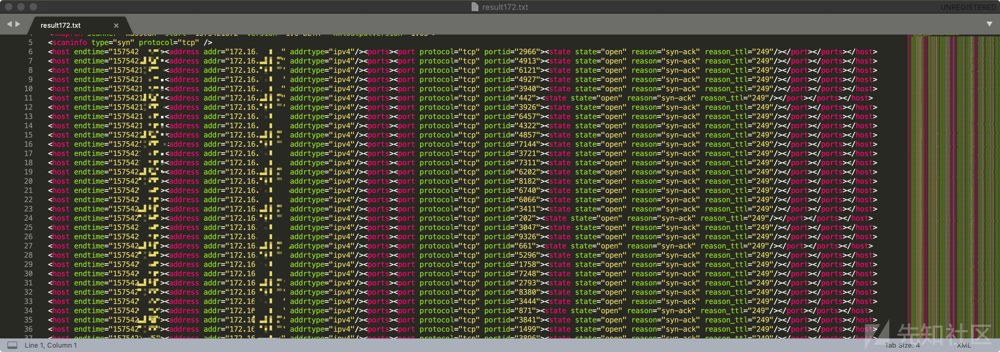](https://xzfile.aliyuncs.com/media/upload/picture/20191221200551-3b52c7ec-23ea-1.png)

然后批量采集端口信息并分类：

[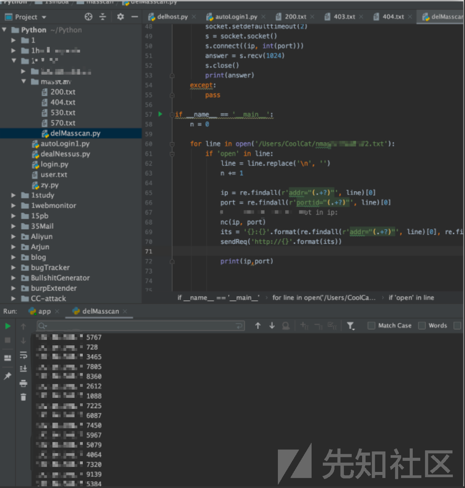](https://xzfile.aliyuncs.com/media/upload/picture/20191221212540-61d64aaa-23f5-1.png)

[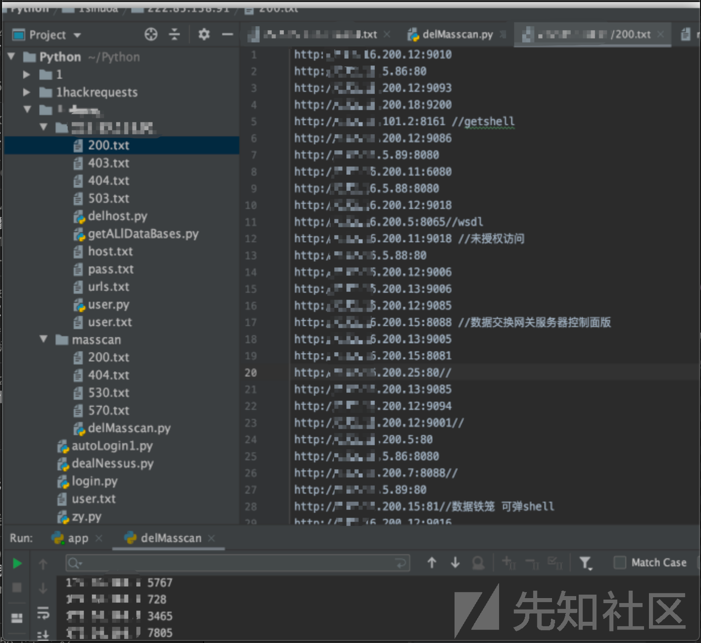](https://xzfile.aliyuncs.com/media/upload/picture/20191221212325-11a902ca-23f5-1.png)

选择相对核心的资产进行端口识别，寻找脆弱点。

[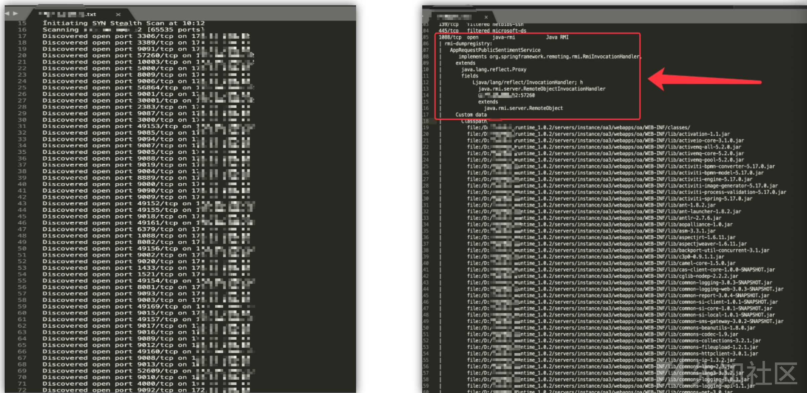](https://xzfile.aliyuncs.com/media/upload/picture/20191221213047-18d18f8a-23f6-1.png)

[](https://xzfile.aliyuncs.com/media/upload/picture/20191221200826-97c7f9d4-23ea-1.png)

同类资产扩散：

[](https://xzfile.aliyuncs.com/media/upload/picture/20191221200851-a69c429e-23ea-1.png)

口令类也一样，找到一个就在扫出来的资产里面去撞，成功率很高。

[](https://xzfile.aliyuncs.com/media/upload/picture/20191221200920-b7f974b2-23ea-1.png)

拿到命令执行权限的都读读口令,同样的再拿去撞。

[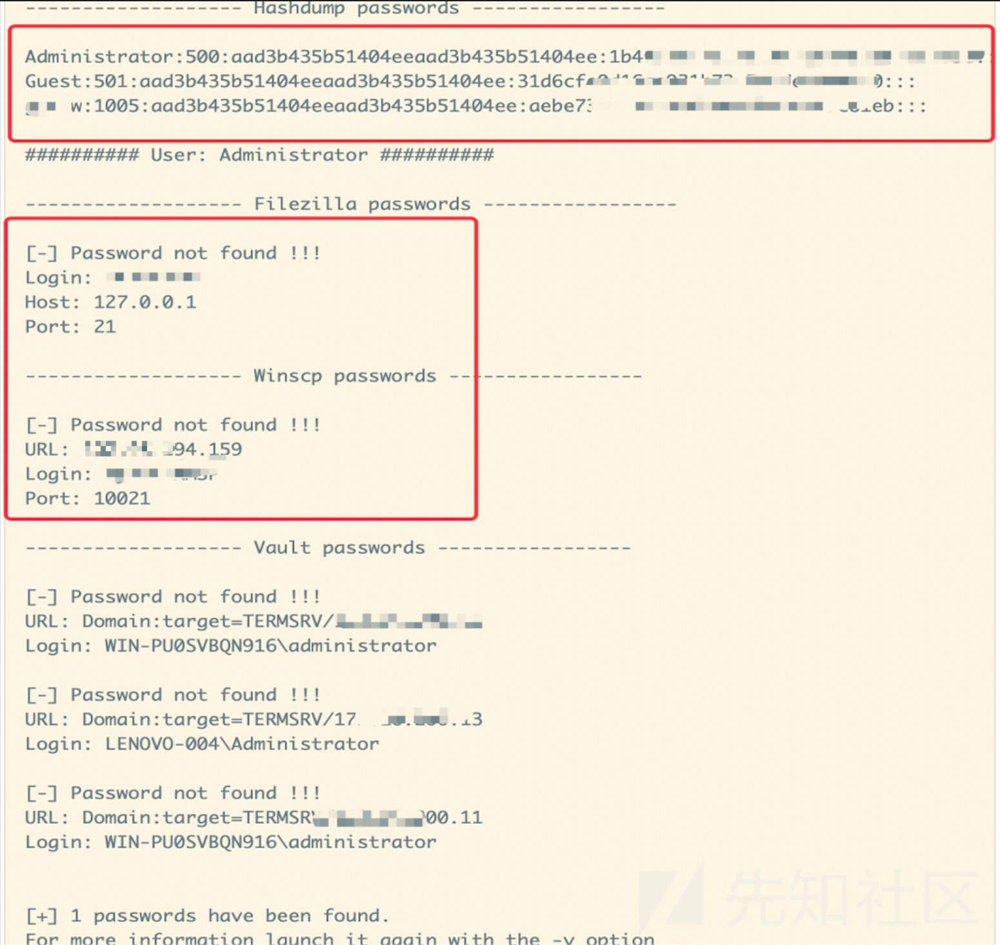](https://xzfile.aliyuncs.com/media/upload/picture/20191221201124-020a03c8-23eb-1.png)

常见漏洞打一波(ms17010,st2,weblogic放序列化),未见过的核心的应用系统仔细测一测。

[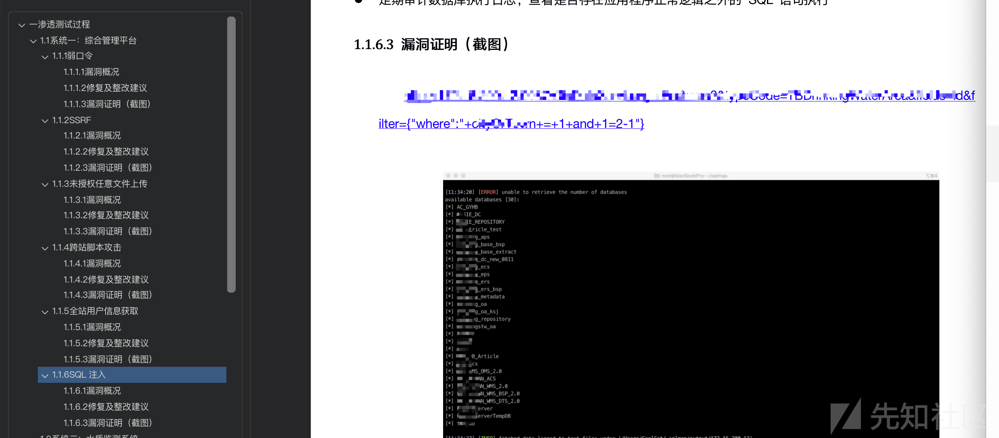](https://xzfile.aliyuncs.com/media/upload/picture/20191221201200-17862196-23eb-1.png)

安服仔的时间不用来屯新漏洞没翻身的空间啊。（图：该单位的行业OA的注入）

### 0x03 加载成功

Web方面相对核心的系统:

[](https://xzfile.aliyuncs.com/media/upload/picture/20191221201251-35e13612-23eb-1.png)

ms17010因为AV的原因大部分打不成功。(03的可以)

[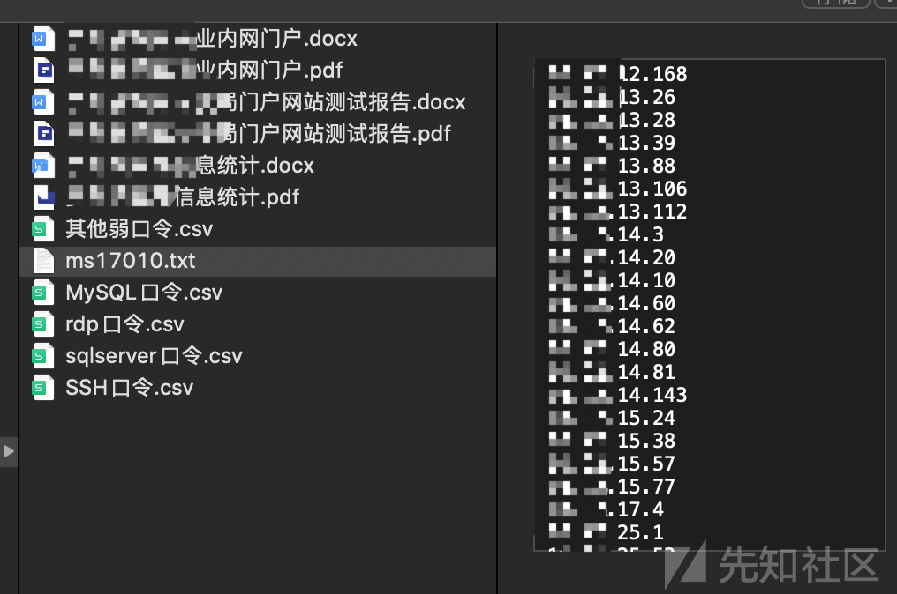](https://xzfile.aliyuncs.com/media/upload/picture/20191221201325-4a4ba6dc-23eb-1.png)

RDP:

[](https://xzfile.aliyuncs.com/media/upload/picture/20191221201354-5b37654e-23eb-1.png)

SSH

[](https://xzfile.aliyuncs.com/media/upload/picture/20191221201409-64594872-23eb-1.png)

MSSQL

[](https://xzfile.aliyuncs.com/media/upload/picture/20191221201431-718a2282-23eb-1.png)

MYSQL

[](https://xzfile.aliyuncs.com/media/upload/picture/20191221201449-7c08b304-23eb-1.png)

以上口令打码的地方大部分都是该单位字母简写。

整个过程一个人花了将近三天,扫外网的7个IP几乎就花了一早上,开放的端口太少且打开都是404或403直接怀疑狗生,换着姿势扫了好几遍，解决APP数据包签名到拿到shell后已经是凌晨了,(其实可以直接Hook那个发包函数的,当时没安卓机也不熟悉,放弃了,孤军战斗的悲哀。)，内网渗透主要担心有态势感知之类的被抓到权限容易掉。通过代理访问网速慢, 这方面TV优化得是真香。其他都可以基本都是在收集信息,同类扩散。
