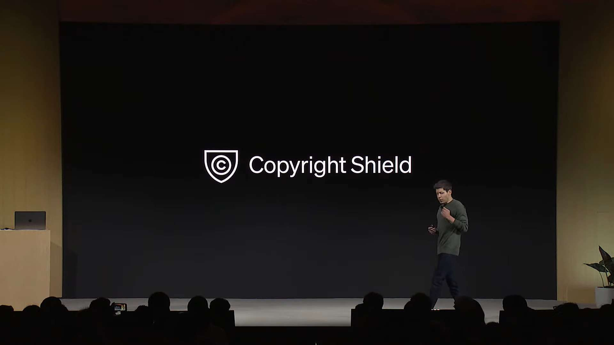
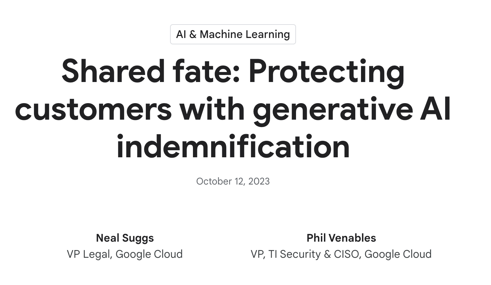
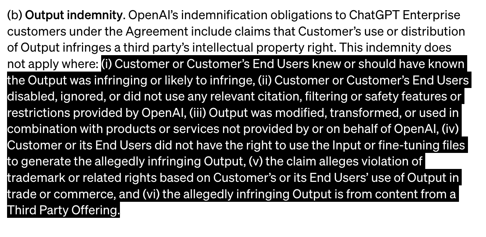

# 谈生成式 AI 服务的「知识产权承诺」

*A version of this article [appears](https://sspai.com/prime/story/gen-ai-ipr-commitments) on Nov. 16, 2023 on SSPAI as a member-only post. [Learn more or subscribe](https://sspai.com/prime)*

*The article is permitted to be self-archived in the version as originally submitted for publication on the author’s personal website under [CC BY-NC 4.0](https://creativecommons.org/licenses/by-nc/4.0/deed.zh) pursuant to § 5.2(b) of the [SSPAI Fellowship Contributor Agreement](https://manual.sspai.com/rules/agreement/).*

在上周的 OpenAI 首届开发者会议（DevDay）上，除了最吸引眼球的新模型和 ChatGPT 新能力，还有一项被[几句话带过](https://www.youtube.com/live/U9mJuUkhUzk?feature=shared&t=700)的「小事」——版权盾（Copyright Shield）。按 OpenAI [官方说法](https://openai.com/blog/new-models-and-developer-products-announced-at-devday#copyright-shield)，这是指 OpenAI 会「在客户面临关于版权侵权的法律主张时介入，为客户抗辩，并支付由此产生的成本」。

实际上，如果你关注生成式 AI 的相关资讯，就会知道 OpenAI 只是「赶了个晚集」，姗姗来迟地跟进了其他几家大厂的动作。例如，微软早在九月就已[宣布](https://blogs.microsoft.com/on-the-issues/2023/09/07/copilot-copyright-commitment-ai-legal-concerns/)，如果客户因版权问题被起诉，微软将承担潜在的法律责任涉及的风险；谷歌则在十月做出了[类似声明](https://cloud.google.com/blog/products/ai-machine-learning/protecting-customers-with-generative-ai-indemnification)。在更垂直的图片生成领域，[Adobe Firefly](https://www.computerworld.com/article/3699053/adobe-offers-copyright-indemnification-for-firefly-ai-based-image-app-users.html)、[Shutterstock AI Design](https://www.computerworld.com/article/3701932/shutterstock-offers-customers-legal-indemnity-for-ai-created-image-use.html) 和 [Canva Magic Studio](https://www.computerworld.com/article/3708249/canva-bolsters-ai-offerings-providing-copyright-indemnity-for-ai-generated-images.html) 也宣布了保护政策。

考虑到生成式 AI 的知识产权问题目前仍然处于「狂野西部」般的混乱状态，这乍听起来好像还挺仗义——平素以「一毛不拔」为纲领的云服务商，难得愿意主动为用户背锅，扛下使用 AI 的风险。

然而，没有无缘无故的爱。如果深究这些承诺的兑现方式，就会发现它跟你想象的意思可能相距甚远。简单来说：

1.  这些承诺目前主要只针对商业用户群体，至少也得是通过 API 访问服务的开发者。如果你只是个人用户，这些慷慨陈词目前跟你还没什么关系。
2.  即使有幸站到了「保护伞」下，这些承诺的背后也跟着一长串「但是」，绝不会让你轻易占到便宜。

下面，我们就结合各大 AI 服务商的服务条款，具体解释这些「知识产权承诺」是如何运作的，又该如何看待和评价。

## 知识产权承诺是如何兑现的

在宣传文案中，各家都发明了一些很高级的专有名词来包装关于版权纠纷的用户权益，例如 OpenAI 的「版权盾」，微软口中的「Copilot 知识产权承诺」，以及谷歌所谓「双管齐下、行业领先的方法」。

听起来，这仿佛是为用户印了一张「免责金牌」，遇到麻烦时亮出来就能保住身家财产……

对不起，走错片场了

……当然不会有这样的好事。在电视剧以外的现实世界，任何承诺最终还是要通过白纸黑字的合同条款来落实。

具体到生成式 AI 的语境下，「知识产权承诺」的本质和最终依据，都是使用条款中类似这样的表述（有所简化）：

> 如果用户因为使用我们的服务受到第三方的索赔，声称我们的服务侵犯了知识产权，我们将会为用户向该第三方作出抗辩，并补偿用户因此遭受的损失。

法律上，这称为「赔偿」（indemnification）条款，其功能是在特定事件发生，通常是合同一方受到第三方的索赔或起诉时，要求另一方根据约定补偿相关成本和费用，有时还要求负责辩护。赔偿条款在英文合同中非常常见，只是中国法律中并没有完全对应的概念（一些观点认为它和中国合同法的规则不太兼容），因此在国内用户看来可能觉得有点陌生。

其实，包括 OpenAI、微软和谷歌在内的几家服务商早就制定过这样的条款，最近的变化只不过是「借花献佛」，明确承认赔偿义务也适用于 AI 产品的输出。

来看几个实例。

#### OpenAI

2023 年 8 月 28 日版本的 OpenAI《[商业条款](https://openai.com/policies/business-terms)》（*Business Terms*）已经规定 [1](#fn:1)：

> 10.1 我们提供的赔偿 如果第三方主张服务（包括我们用来训练驱动服务的模型的训练数据）侵犯任何第三方知识产权，导致你应向第三方支付任何责任、损害和费用（包括合理的律师费），我们同意对你作出赔偿、为你抗辩并使你免受损害。\[…\]

然后，在宣布「版权盾」政策的 11 月 6 日当天，OpenAI 修订其《[服务条款](https://openai.com/policies/service-terms)》（*Service Terms*），进一步明确承认其根据《商业条款》对 API 和 ChatGPT 企业版客户的赔偿义务，也包括关于客户使用或分发输出内容侵犯第三方知识产权的主张（§§ 1, 3(b)）。

#### 微软

2023 年 3 月 1 日版本的微软《[Microsoft 客户协议](https://www.microsoft.com/licensing/docs/customeragreement)》（*Microsoft Customer Agreement*）已经规定：

> 第三方索赔的抗辩 \[…\] A. Microsoft 提供的抗辩 如果任何第三方对客户提出主张，其中包括主张 Microsoft 根据本协议收费提供并在本协议授予的许可范围内使用的产品或服务交付物（未在 Microsoft 提供的形态基础上修改且未与其他任何内容组合）构成盗窃商业秘密，或者直接侵犯第三方的专利、版权、商标或其他专有权利，Microsoft 将在此范围内为客户作出抗辩。\[…\]

然后，在微软正式宣布「Copilot 知识产权承诺」政策之后不久的 10 月 1 日，它修订了《[产品条款](https://www.microsoft.com/licensing/terms/product/ForOnlineServices/MCA)》（*Product Terms*），在「针对在线服务」一节增加了一段「Microsoft 生成式 AI 服务」，规定：微软依据客户协议承担的抗辩义务，也「适用于客户使用或分发涵盖产品 [2](#fn:2) 的输出内容的情况」。

#### GitHub

2022 年 12 月 22 日版本的 GitHub《[客户协议](https://github.com/customer-terms/general-terms)》（Customer Agreement）规定：

> 6.3(a) 如果任何第三方主张 GitHub 收费提供、且客户在本协议范围内使用的某个产品（须按 GitHub 所提供原状且未与任何其他内容结合）存在窃用商业秘密，或直接侵犯第三方的专利、著作权、商标或其他专有权利的情形，GitHub 将为客户做出抗辩。\[…\]

而根据 GitHub Copilo t的《[产品专用条款](https://github.com/customer-terms/github-copilot-product-specific-terms)》（*Product Specific Terms*），客户主协议里的抗辩义务也适用于 GitHub Copilot（§4）。注意由于 GitHub 现在是微软麾下，其服务也有「自营」和通过微软销售之分，因此取决于具体销售渠道，上述「主协议」可能是 GitHub 的客户协议，也可能是微软的客户协议，承担义务的主体也因此有所不同。

#### 谷歌

2023 年 7 月 12 日版本的 Google Cloud Platform 的《[服务条款](https://cloud.google.com/terms)》（*Terms of Service*）规定：

> 13.1 Google 的赔偿义务。对于任何第三方法律程序，如果其原因包括任何服务或 Google 冠名功能（均须按本协议规定使用）侵犯了第三方的知识产权，则 Google 将在此范围内为客户及其关联方使用顾客账户中服务的行为提供抗辩，并作出补偿以使其免于承担应补偿责任。\[…\]

谷歌宣布提供版权保护政策后，分别于 10 月 12 日和 24 日更新了适用于 [GCP](https://cloud.google.com/terms/service-terms) 和 [Workspace](https://workspace.google.com/intl/en/terms/service-terms/) 的《服务专用条款》（*Service Specific Terms*），明确了上述赔偿义务也适用于 (1) 客户被指控生成式 AI 服务生成的输出侵犯了知识产权，以及 (2) 他人主张 Google 所使用的训练数据侵犯了知识产权，而使得客户受到牵连的情况。注意这里关于「训练数据」的承诺在当时是别家没有的，这也就是谷歌宣传稿中所谓「双管齐下」（two-prong）的来源。

- - -

那么，为什么 AI 服务商会不约而同地选择通过赔偿条款来实现「知识产权承诺」呢？用户能不能用其他途径——例如更常见的违约赔偿（liquidated damages）——来弥补损失呢？

可能还真不行。因为……你会发现很难指出他们怎么违约。假如没有赔偿条款，而你因为 AI 版权问题被人告了、赔了，故事的发展可能是这样的：

1.  你去找服务商算账，说，我用你们生成的东西被人告了，说好的智能呢，你赔我。
2.  服务商的律师掏出《服务条款》，指着一段大写加粗的话问你：哪里说好了？多想想自己的原因好不好？
3.  你一看，条款果然规定说，我们不对生成内容做任何保证，用户使用生成内容自负其责。然后……
4.  ……就没有然后了，而且律师语重心长地教育你，这么多年都是这个规定，不要睁着眼睛乱说。

只要能让你看到，按坏一个大写锁定键又怎么样呢

而赔偿条款的优势也就在于此：它是一项独立的义务，有独立的触发条件，不以发生违约为前提。从条款可以看出，只要「第三方主张用户侵权」这个事件出现，服务商就有义务提供抗辩和赔偿；这与服务商有没有违反对用户的承诺没有关系，用户也不需要证明这一点。

其实，比起在事后救济受损一方的违约赔偿，indemnification 更多是一种在事前转移风险的工具：外面有雨，但伞已经撑好了，您请出门吧？

## 锅有所背，更有所不背

到目前为止听起来都还不错？但生活经验告诉我们，每当你对商家的善意产生美好的想象时，都应该默念三遍「卖的没有卖的精」。

知识产权承诺政策也是如此。即使赔偿条款提供了一种看起来很慷慨的解决方案，服务商也有一百种方法能让你无缘获得这份慷慨。

第一道门槛其实跟赔偿条款怎么规定没有关系，而是它在很多情况下可能根本「普照」不到你。你在读之前摘录的条款时可能已经注意到了，它们都是针对商用客户和商用服务的规定，例如 ChatGPT 企业版、Bing Chat 企业版、Google Workspace 企业版，以及各自的 API 等，具体可以参看相应条款开头的序言和术语定义部分。

如果你只是一名个人用户……对不起，以上跟你都没有关系。而如果你找来适用于这些「大众版」产品的条款（例如 OpenAI 的《[使用条款](https://openai.com/policies/terms-of-use)》、微软的《[Bing 对话体验和图像创作条款](https://www.bing.com/new/termsofuse)》、谷歌的《[生成式 AI 补充服务条款](https://policies.google.com/terms/generative-ai)》《[Workspace 实验室个人帐户条款](https://support.google.com/docs/answer/13447401)》等），就会发现服务商都换了一副嘴脸，规定自己彻底免责。对了，你还会很惊喜地发现：反倒是自己要向这些服务商承担赔偿义务。

即使你确实属于赔偿条款的适用群体，真想在出现纠纷时抱住服务商的大腿也没那么容易。

首先，赔偿范围限定于第三方索赔中与知识产权相关的部分。但显然，使用 AI 输出内容可能造成的纠纷绝不仅限于此。例如，目前美国就正在进行多起以侵犯肖像权、隐私权为由提起的生成式 AI 相关案件。即使主要目的是为了维护知识产权，为了提高胜率，原告当然也有动机把能罗列的「罪名」都列上。而对于这些知识产权以外的纠纷，服务商是不会帮你辩护和担责的。

其次，赔偿条款普遍设定了一系列可以免责的例外情况，而这些情况在实际使用中很难避免。

最常见的就是对经过修改或混合的内容免责。例如，OpenAI 在《服务条款》中明确排除的一个情况就是「输出内容被修改、变换，或者与非由 OpenAI 提供、或代表 OpenAI 提供的产品或服务结合使用」（§ 3(b) cl. 2(iii)）。谷歌和微软的条款虽然没有直接排除这种情况，但都规定只对「未经修改的服务和内容」承担赔偿责任，实际效果是类似的。

把数字列表挤在一起是法律民工最后的倔强

问题是，目前这些服务的输出有多少是不经修改就能直接拿来用的呢？但凡使用 API 开发应用，而不只是简单地获取输出，怎么可能不或多或少将生成内容与「其他功能和内容」结合呢？

另一个比较显眼的例外是使用输出构成商标侵权；OpenAI、微软和谷歌都明确排除了这方面的保障。除此之外，常见的免责情况还包括禁用「内容过滤器」之类的安全审核功能，输入的内容本身有版权问题，在应当知道输出可能侵权时仍然使用；等等。

总之，这些例外构成了一片难以下脚的「雷区」；只要服务商愿意，很容易就能从用户身上「找茬」，从而拒绝承担赔偿责任。

即使你突破重重障碍成功触发了赔偿条款，服务商还是给自己留了后手。

根据 OpenAI 的《商业条款》，如果他们知道了自家服务成为（或者可能成为）索赔对象，可以把你的服务替换成不会侵权的版本，或者花钱求你别再用他们的服务；如果你选择赖着不走，他们可以退还你的余额，然后单方终止服务（§ 10.1 cl. 3）。

如果不能解决问题，就解决产生问题的人

GitHub 也有类似招数，根据其《客户协议》，如果它帮你辩着辩着发现胜算不大，也可以选择替换你的服务，或者退款让你走人；如果你赖着不走，接下来 GitHub 也就不会再帮忙擦屁股了（§6.3(a) cl. 2）。

## 展望未来，着眼当下

看到这里，一句义愤填膺的「无良奸商」似乎已经要脱口而出了。但本文倒是愿意冒大不韪，为奸商们说两句话。

其实，知识产权承诺的主要价值并不在于提供的赔偿和辩护本身。正如上文提到的，赔偿条款的首要目的不是救济违约，而是分配风险。因此，以赔偿条款的形式做出知识产权承诺，并不能说明服务商对于打赢官司更有信心，但能说明它更愿意承认 AI 相关知识产权问题的存在，并且更愿意分担由此产生的风险。

对于个人用户和中小开发者，有没有这种表态可能差别不大——大语言模型本身的应用潜力就足够吸引人了；但对于那些通过风险权衡做出决策的公司和组织来说，知识产权承诺可能就是推动它们迈入 AI 门槛的重要因素。那些感到知识产权承诺吸引力不强的用户，其实也不是这项承诺的目标受众。

当然，这种通过「主动背锅」的方式提高产品吸引力的做法毕竟只能是权宜之计。如果知识产权承诺成为一种公认的 AI 服务评价指标，其必然后果就是让法律资源充足、风险承担能力更高的大公司占据优势，对于促进竞争是不利的。

展望今后，最理想的状态肯定是政策法规及时跟进，为 AI 生成内容提供清晰的产权界定，在初始配置阶段就降低交易成本。但考虑到知识产权法律和案例还在气喘吁吁地追赶一些上世纪出现的问题，这个目标可能不会在短期内达成。

相比之下，我认为更容易达成的一个演进方向是由市场形成针对 AI 生成内容的保险政策，并使这类保险成为生成式 AI 服务的一个标准组成部分——就像在货物买卖（例如对于潜在的产品责任投保）、投资并购（例如对于目标公司陈述和保证的真实性投保）和公司运营（例如对于董事和高管的履职过失行为投保）等场合已经普遍存在的那样。

实际上，保险就可以看成一种外置的「赔偿条款」，具有类似的风险转移功能，差别在于引入了更独立的第三方（保险公司），且具有更明确和市场化的价格（保费）。这样，服务商不用自己背锅，用户也对保障的透明度和执行力更有信心，对双方都是更有效率的。

- - -

回到当下，从日常用户的角度看，除了宣示性的知识产权承诺，更应该重点关注的是关于生成内容所有权和使用权的规定。AI 生成的内容归谁所有？服务商是否有权将生成内容用于继续改进和训练 AI？相比于知识产权承诺中那个幽灵般盘旋的「第三方」，这些从作为「第一方」的服务商那里直接获得的承诺，这才是与用户的权益和隐私更密切相关的。

观察下来，对于所有权问题，目前规定属于用户的比较多，但表述方式不太统一。有的直接承认生成内容属于用户内容（因此始终归用户所有）；有的承诺向用户转让生成内容的所有权利和利益；还有的则只做了 quitclaim 式的规定，承诺「不会向用户主张」对生成内容的权利，大概是为了避免承认「服务商对 AI 内容有权利且有权处分」这一法律尚无定论的隐含前提。两个比较显眼的例外包括 MidJourney 免费版（按 CC-BY-NC 4.0 许可给用户）和 Anthropic（只「授权」用户使用）。

此外，无论对所有权如何规定，服务商普遍都要求用户遵守一定的行为准则，例如不得用于制作令人反感的内容、不得用于训练竞品模型等。

至于使用权问题，个人用户和商业用户的区别对待再一次体现了出来，几乎所有面向个人用户的产品都规定服务商有权在某种程度上使用输入和输出内容来改进和训练，而商用条款则普遍明确承诺不会未经同意这么做。因此，如果你对于隐私问题特别介意，最好的选择还是通过 API 而不是成品服务来获取 AI 输出，以便获得商用服务更严格的隐私保护政策。

- - -

1.  笔者自行翻译，请以英文版为准，后同。 [↩︎](#fnref:1)
    
2.  在这里指的是收费提供的 Microsoft Copilot 和 Bing Chat 企业版服务。 [↩︎](#fnref:2)
