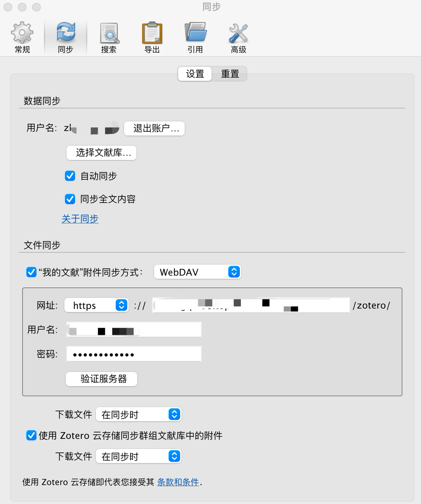

# 跨平台文件同步：如何利用NAS的WebDAV功能 - 少数派

当你手中同时持有 Android 手机和苹果的产品，一个立刻浮现的问题是：如何跨两大平台无缝地传输和使用文件？

设想一下，你刚用 Android 手机截了一张重要的图片。几天后，当你正在使用苹果电脑工作时，需要将这张图片发送给同事。这时，你会思考如何迅速、无损地找到并发送这张图片。

再比如，你在 Zotero 上阅读学术论文，希望将其中的文章保存到云端。更进一步，你希望在不同的设备上都能同步这些论文。这样跨平台存储和无缝地使用文件是许多用户的共同需求。

NAS 的 WebDAV 功能为我们提供了解决方案。通过本文，我希望能为大家提供一些思路，并简要分享关于跨平台解决方案的一些看法。

## WebDAV 究竟是什么？

WebDAV 是 HTTP 协议的一种增强版本，主要用于用户编辑和管理远程服务器上的文件。其跨平台的文件共享、文件管理、版本控制和云存储等功能使其在多种平台和操作系统上均得到广泛应用。而与 HTTPS 结合使用时，WebDAV 能够提供加密及身份验证功能，进一步确保数据的传输安全。

在接下来的部分，我将用具体的示例为各位朋友展示 WebDAV 的应用场景和操作步骤。

## 开始使用WebDAV的条件

本次介绍的 WebDAV 应用主要基于群晖 NAS。当然，如果你手头有其他支持 WebDAV 功能的服务器或电脑，同样可以参考本文的方法。

要想成功使用 WebDAV，首先确保你的 NAS 能够通过外部网络访问。此外，在群晖套件中心，你需要下载并安装 WebDAV server 软件。对于初次涉足此领域的读者，我推荐这篇指南文章：[《无门槛群晖 NAS 搭建指南》](https://sspai.com/post/72672)。

## 场景一：Zotero 论文同步

首先，我们聊聊这个操作能带来的便利。一旦你完成了WebDAV同步设置，无论你使用的是 Windows 电脑，还是在 iPad 上手动标注文献，你都可以体验到即时同步的魅力。每一处修改，每一篇新加入的论文，都会在所有的 Zotero 客户端之间实时更新，确保你的研究和阅读始终保持同步。

接下来，让我们看一下具体操作步骤。在 Zotero 的「账户」设置中，你会发现一个名为「数据同步」的选项。而在这个选项下方，还有一个「文件同步」的设置，这正是我们要关注的地方，用以添加 WebDAV 的相关信息。

这里，需要特别注意以下两个关键设置点：

**路径设置**：以我的使用经验为例，我在群晖NAS的主目录下创建了一个名为「WebDAV」的文件夹。想要把论文同步到这个文件夹中的「zotero」子文件夹里。因此，我设置的路径是：`http://baiye.top:5005/WebDAV/zotero`。

-   这里的 `baiye.top` 是我购买的个人域名。但如果你并没有自己的域名，完全可以利用群晖的「QuickConnect」功能。以我为例，我的 QuickConnect ID 为「baiye」，因此将域名部分改为 `QuickConnect.cn/baiye` 即可。  
     
-   当你查看 NAS 文件夹属性时，可能会看到系统提示的路径为「/volume1/WebDAV/zotero」。但需要注意的是，WebDAV 的路径是从「WebDAV/zotero」开始的，不需要加入「volume1」这种前缀。  
     

**传输协议选择**：WebDAV 的路径通常由 `http` 或 `https` 开始。简单来说，`http` 是明文传输，而 `https` 是加密传输，后者在信息传输中更为安全。

-   若使用 `http`，对应的端口是 `5005`；而如果选择 `https`，你需要把端口改为 `5006`，如：`https://baiye.top:5006/WebDAV/zotero`。这个端口配置是在 NAS 的 WebDAV server 软件中修改的。

## 场景二：Infuse 和 KODI 媒体同步

Infuse 往往是许多苹果用户的首选媒体播放器，不仅因为它界面精美，更因为它具备的自动获取影片信息的功能，既强大又实用。而对于电视或投影仪用户来说，KODI 常成为他们的首选。值得注意的是，即使在没有像 Jellyfin 这样的刮削服务器的支持下，Infuse 和 KODI 仍然可以通过 WebDAV 方式来连接并访问自家NAS上的媒体库。

（若你对 Jellyfin 和 KODI 感兴趣并想要进一步了解，不妨阅读这篇文章：[自建家庭影音系统最优解：NAS+Jellyfin](https://sspai.com/post/79156)）

以 Infuse 为例子（KODI 的 WebDAV 设置与 Infuse 基本相同）。在 Infuse 中，你可以轻松地通过文件设置新增文件来源。步骤如下：

1.  选择“添加 WebDAV”作为新的文件来源。
2.  通讯协议选择“WebDAV(https)”。
3.  对于位址，你可以选择使用上文提到的域名 "baiye.top"，或者"Quickconnect.cn/baiye"。
4.  填写端口“5006”。

完成这些步骤后，设置基本就已完成。接下来，你可以在已设置的 Infuse WebDAV 文件夹中选择你的影片存放位置，并标记星号。完成此操作后，Infuse 会为你自动抓取影片的相关信息。

## 场景三：电脑端用户如何通过WebDAV访问NAS

如果你正好使用的是苹果电脑，并希望随时访问 NAS 中的数据，操作其实非常简单。只需按照以下步骤进行：

1.  在桌面上找到并右键点击「访达」图标。
2.  从菜单中选择“连接服务器”选项。
3.  在弹出的窗口中，键入 WebDAV 路径“https://baiye.top:5006”，以及你的帐户和密码。

这样，你就可以直接访问 NAS 中存储的所有文件了。

对于Windows 用户，建议使用 **RaiDrive**，这是一款免费供非商业用途的驱动器映射应用程序。或者，Internet 上还有许多其他可用的 WebDAV 客户端应用程序。

## 浅谈坚果云和Synology Drive的同步功能

关于跨平台同步照片或重要文件，很多人会优先选择坚果云，亦或是有 NAS 的朋友会选择 Synology Drive。

坚果云最大的卖点，可能就是它的云桥功能，以及不限速（~限速这个为什么能成为卖点我不理解~）。

**云桥功能**的设计初衷是为用户节省本地存储空间。简单地说，即便有一天你不慎丢失了电脑，你依然可以通过访问坚果云的网站，找回所有的文件，完整无损。设定为云桥模式的本地文件夹内的所有文件都会被自动同步至云端。而你也完全可以选择哪些文件只存储于云端，哪些文件需要下载到本地使用。这一点与Dropbox Business的Smart Sync功能相似，都旨在解决本地存储空间不足的问题。

需要注意的是，由于 MacOS 11 (Big Sur) 上的 `fileproviderd` 存在稳定性问题，该系统版本并不支持云桥模式。但对于 MacOS 12.0 (Monterey) 及更高版本的用户，只要安装了坚果云6.0或更高版本的客户端，默认就会启用云桥模式，并且目前看来是稳定无虞的。

坚果云还有**第三方应用管理功能**，允许用户授权特定的WebDAV应用访问其存储空间。用户需要使用坚果云提供的服务器地址和账号，并为每个应用设置独立的应用密码进行授权。**与此类似，如果你选择使用NAS的WebDAV功能，为了安全起见，可以在NAS上分别设置不同的账号和密码，然后使用这些单独的信息为各应用设置WebDAV同步。**

群晖NAS的**Synology Drive**也具备备份功能，并在各大平台上都提供客户端。该服务能够保证文件实时同步至云端，但缺少坚果云的那种智能同步功能，即仅同步部分内容至云端。实际体验下来，两者在同步速度上相差无几，而使用Synology Drive在云端提供的存储空间往往更为充裕。不过，对于那些电脑本地存储空间短缺的用户来说，坚果云的云桥模式可能更为合适。

## 结语

之所以写这篇文章，是因为我在GitHub上发现了一个有趣的安卓阅读应用。在尝试配置WebDAV时，多次遭遇路径设置错误的提示，我意识到WebDAV的配置方式似乎与以前有所不同。为此，我总结了自己的经验与发现，并希望与各位读者分享。如有任何补充或对文章内容产生疑问，欢迎在评论区与我交流。
