# 逆向常见算法之Hash类算法 - 先知社区

逆向常见算法之Hash类算法

- - -

哈希（hash）函数也称为消息摘要函数、单向散列函数或者杂凑函数，是一种将任意长度的消息压缩到某一固定长度（消息摘要的）的函数。

单向散列函数有一个输入和一个输出，其中输入称为消息（message），输出称为散列值（hash value）。单向散列函数可以根据消息的内容计算出散列值，而散列值就可以被用来计算消息的完整性，该过程不可逆。

##### 特点：

正向快速：给定明文和 Hash 算法，在有限时间和有限资源内能计算得到 Hash 值。  
逆向困难：给定 Hash 值，在有限时间内很难逆推出明文。  
输入敏感：原始输入信息发生任何变化，新的 Hash 值都应该出现很大变化。  
冲突避免：很难找到两段内容不同的明文，使得它们的 Hash 值一致。

##### 安全性

MD5与SHA-1算法已被攻破，不应该再用于新的用途；SHA-2与SHA-3还是安全的，可以使用。

| 算法  | 分组长度（bytes） | 输出长度 (bytes） | 是否安全 |
| --- | --- | --- | --- |
| SM3 | 64  | 32  | 安全  |
| MD4 | 64  | 16  | 不安全 |
| MD5 | 64  | 16  | 不安全 |
| SHA1 | 64  | 20  | 不安全 |
| SHA224 | 64  | 28  | 安全  |
| SHA256 | 64  | 32  | 安全  |
| SHA384 | 128 | 48  | 安全  |
| SHA512 | 128 | 64  | 安全  |

## MD5

MD5（Message Digest Algorithm 5）中文名为消息摘要算法第五版，是计算机安全领域广泛使用的一种散列函数，用以提供消息的完整性保护。

### 算法原理

[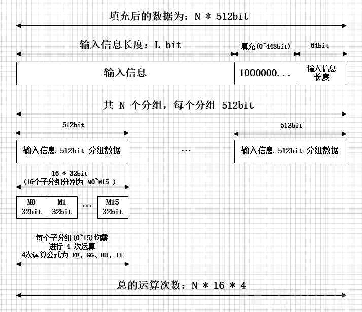](https://xzfile.aliyuncs.com/media/upload/picture/20231127210503-944e20dc-8d25-1.png)

#### 1.数据填充

a.先判断文件（消息）的大小（长度） mod 512 == 448 mod 512 ，就是大小（长度）对512求余等于448。（这里的512、448是“位”为单位，转成“字节”就是64、56，即mod 64 == 56 mod 64）  
b.如果大小（长度）不满足要求，就执行以下操作：填充1个1(这里是以位为单位，如果以字节为单位就是填充0x80),再填充0，直到满足过程的第一步。

> 为什么是448?
> 
> 因为在第一步的预处理后，第二步会再附加上一个**64bit**的数据，用来表示原始报文的长度信息。而448+64=512，正好拼成了一个完整的结构。

#### 2.添加消息长度

用64bit记录 “输入信息” 的位长 (Bits Length)，把64位长度二进制数据补在最后。

经过此步骤后，其位长 (Bits Length) 将扩展到：  
N*512+448+64 = (N+1)*512 ( N>=0 )

#### 3.数据处理

##### 3.1 4个链接变量

```plain
A=0x01234567
B=0x89ABCDEF
C=0xFEDCBA98
D=0x76543210
```

在小端序下为

```plain
A=0x67452301
B=0xEFCDAB89
C=0x98BADCFE
D=0x10325476
```

##### 3.2 4个非线性函数

```plain
F(X，Y，Z)=(X&Y)|((~X)&Z)
G(X，Y，Z)=(X&Y)|(Y&(~Z))
H(X，Y，Z)=X^Y^Z
I(X，Y，Z)=Y^(X|(~Z))
```

##### 3.3 4种操作（轮函数）

```plain
FF(a,b,c,d,Mi,s,tj)->a=b+((a+F(b,c,d)+Mi+tj)<<<s)
GG(a,b,c,d,Mi,s,tj)->a=b+((a+G(b,c,d)+Mi+tj)<<<s)
HH(a,b,c,d,Mi,s,tj)->a=b+((a+H(b,c,d)+Mi+tj)<<<s)
II(a,b,c,d,Mi,s,tj)->a=b+((a+I(b,c,d)+Mi+tj)<<<s)
```

-   公式中初始输入数据a、b、c、d 为A、B、C、D
    
-   tj是常数。在第j步中，tj是4294967296*(abs(sin(j)))的整数部分，i的单位是弧度（4294967296 = 2^32），也可以用0x100000000UL*abs(sin((double)j))计算。tj是伪随机数，共64个，有规律，意味着64次的函数调用都是用不同的数值。
    
    \*T = 0xD76AA478,0xE8C7B756,0x242070DB,0xC1BDCEEE...
    
-   Mi表示消息的第i个子分组（从0到15，共16个）
    
-   <<<S表示循环左移s位
    
-   x循环左移s位：(s<<x)|(s>>(32-x))
    

这四轮（64步）是：

```plain
// 512bit分组数据，16 * 4 次运算
// 输入数据为32bit原始数据，输出为32bit数据
// 第一次运算FF
a = FF(a, b, c, d, M0, 7, 0xd76aa478L);
d = FF(d, a, b, c, M1, 12, 0xe8c7b756L);
c = FF(c, d, a, b, M2, 17, 0x242070dbL);
b = FF(b, c, d, a, M3, 22, 0xc1bdceeeL);
a = FF(a, b, c, d, M4, 7, 0xf57c0fafL);
d = FF(d, a, b, c, M5, 12, 0x4787c62aL);
c = FF(c, d, a, b, M6, 17, 0xa8304613L);
b = FF(b, c, d, a, M7, 22, 0xfd469501L);
a = FF(a, b, c, d, M8, 7, 0x698098d8L); 
d = FF(d, a, b, c, M9, 12, 0x8b44f7afL);
c = FF(c, d, a, b, M10, 17, 0xffff5bb1L);
b = FF(b, c, d, a, M11, 22, 0x895cd7beL);
a = FF(a, b, c, d, M12, 7, 0x6b901122L);
d = FF(d, a, b, c, M13, 12, 0xfd987193L);
c = FF(c, d, a, b, M14, 17, 0xa679438eL);
b = FF(b, c, d, a, M15, 22, 0x49b40821L);

// 第二轮运算GG
a = GG(a, b, c, d, M1, 5, 0xf61e2562L);
d = GG(d, a, b, c, M6, 9, 0xc040b340L);
c = GG(c, d, a, b, M11, 14, 0x265e5a51L);
b = GG(b, c, d, a, M0, 20, 0xe9b6c7aaL);
a = GG(a, b, c, d, M5, 5, 0xd62f105dL);
d = GG(d, a, b, c, M10, 9, 0x2441453L);
c = GG(c, d, a, b, M15, 14, 0xd8a1e681L);
b = GG(b, c, d, a, M4, 20, 0xe7d3fbc8L);
a = GG(a, b, c, d, M9, 5, 0x21e1cde6L);
d = GG(d, a, b, c, M14, 9, 0xc33707d6L);
c = GG(c, d, a, b, M3, 14, 0xf4d50d87L);
b = GG(b, c, d, a, M8, 20, 0x455a14edL);
a = GG(a, b, c, d, M13, 5, 0xa9e3e905L);
d = GG(d, a, b, c, M2, 9, 0xfcefa3f8L);
c = GG(c, d, a, b, M7, 14, 0x676f02d9L);
b = GG(b, c, d, a, M12, 20, 0x8d2a4c8aL);

// 第三轮运算HH
a = HH(a, b, c, d, M5, 4, 0xfffa3942L);
d = HH(d, a, b, c, M8, 11, 0x8771f681L);
c = HH(c, d, a, b, M11, 16, 0x6d9d6122L);
b = HH(b, c, d, a, M14, 23, 0xfde5380cL);
a = HH(a, b, c, d, M1, 4, 0xa4beea44L);
d = HH(d, a, b, c, M4, 11, 0x4bdecfa9L);
c = HH(c, d, a, b, M7, 16, 0xf6bb4b60L);
b = HH(b, c, d, a, M10, 23, 0xbebfbc70L);
a = HH(a, b, c, d, M13, 4, 0x289b7ec6L);
d = HH(d, a, b, c, M0, 11, 0xeaa127faL);
c = HH(c, d, a, b, M3, 16, 0xd4ef3085L);
b = HH(b, c, d, a, M6, 23, 0x4881d05L);
a = HH(a, b, c, d, M9, 4, 0xd9d4d039L);
d = HH(d, a, b, c, M12, 11, 0xe6db99e5L);
c = HH(c, d, a, b, M15, 16, 0x1fa27cf8L);
b = HH(b, c, d, a, M2, 23, 0xc4ac5665L);

// 第四轮运算II
a = II(a, b, c, d, M0, 6, 0xf4292244L);
d = II(d, a, b, c, M7, 10, 0x432aff97L);
c = II(c, d, a, b, M14, 15, 0xab9423a7L);
b = II(b, c, d, a, M5, 21, 0xfc93a039L);
a = II(a, b, c, d, M12, 6, 0x655b59c3L);
d = II(d, a, b, c, M3, 10, 0x8f0ccc92L);
c = II(c, d, a, b, M10, 15, 0xffeff47dL);
b = II(b, c, d, a, M1, 21, 0x85845dd1L);
a = II(a, b, c, d, M8, 6, 0x6fa87e4fL);
d = II(d, a, b, c, M15, 10, 0xfe2ce6e0L);
c = II(c, d, a, b, M6, 15, 0xa3014314L);
b = II(b, c, d, a, M13, 21, 0x4e0811a1L);
a = II(a, b, c, d, M4, 6, 0xf7537e82L);
d = II(d, a, b, c, M11, 10, 0xbd3af235L);
c = II(c, d, a, b, M2, 15, 0x2ad7d2bbL);
b = II(b, c, d, a, M9, 21, 0xeb86d391L);
```

#### 4.MD5运算

对于第一段消息（前512位（64个字节））传入的a，b，c，d的值是上面初始化的ABCD。  
第一段消息处理完后（即4个函数各执行了16次之后），得到新的a，b，c，d的值，将它们分别加上原来a，b，c，d的值（即计算前的值），作为下一段消息（第2个512位（64个字节））的初始a，b，c，d的值。  
当每段消息（512位，64个字节）都处理完之后，得到的a，b，c，d的值，按照地址的顺序从低到高打印对应的值，就是所求的MD5值。

### 程序实现

#### c

```plain
#include <string.h>
#include "MD5.h"

/* MD5转换用到的常量，是算法本身规定的 */
#define S11 7
#define S12 12
#define S13 17
#define S14 22
#define S21 5
#define S22 9
#define S23 14
#define S24 20
#define S31 4
#define S32 11
#define S33 16
#define S34 23
#define S41 6
#define S42 10
#define S43 15
#define S44 21

/* MD5算法本身规定的基本函数 */
#define F(x, y, z) ((x & y) | (~x & z))
#define G(x, y, z) ((x & z) | (y & ~z))
#define H(x, y, z) (x ^ y ^ z)
#define I(x, y, z) (y ^ (x | ~z))

/* 实现将x循环左移n位
 */
#define ROTATE_LEFT(x, n) ((x << n) | (x >> (32 - n)))

/** MD5算法本身规定的 4 轮变换 
 * Rotation is separate from addition to prevent recomputation. 
**/
#define FF(a, b, c, d, x, s, ac) \
{                                \
    a += F(b, c, d) + x + ac;    \
    a = ROTATE_LEFT(a, s);       \
    a += b;                      \
}
#define GG(a, b, c, d, x, s, ac) \
{                                \
    a += G(b, c, d) + x + ac;    \
    a = ROTATE_LEFT(a, s);       \
    a += b;                      \
}
#define HH(a, b, c, d, x, s, ac) \
{                                \
    a += H(b, c, d) + x + ac;    \
    a = ROTATE_LEFT(a, s);       \
    a += b;                      \
}
#define II(a, b, c, d, x, s, ac) \
{                                \
    a += I(b, c, d) + x + ac;    \
    a = ROTATE_LEFT(a, s);       \
    a += b;                      \
}


unsigned char PADDING[] = {0x80, 0, 0, 0, 0, 0, 0, 0, 0, 0, 0, 0, 0, 0, 0, 0,
               0, 0, 0, 0, 0, 0, 0, 0, 0, 0, 0, 0, 0, 0, 0, 0,
               0, 0, 0, 0, 0, 0, 0, 0, 0, 0, 0, 0, 0, 0, 0, 0,
               0, 0, 0, 0, 0, 0, 0, 0, 0, 0, 0, 0, 0, 0, 0, 0};

static void MD5Transform(unsigned int state[4], unsigned char block[64]);
static void MD5Encode(unsigned char *output, unsigned int *input, unsigned int len);
static void MD5Decode(unsigned int *output, unsigned char *input, unsigned int len);

/* MD5 initialization. Begins an MD5 operation, writing a new context. */  
/* 初始化md5的结构 */
void MD5Init(MD5_CTX *context)
{
    /* 将当前的有效信息的长度设成 0 */
    context->count[0] = 0;
    context->count[1] = 0;
    /* Load magic initialization constants.*/
    /* 初始化链接变量 */
    context->state[0] = 0x67452301;
    context->state[1] = 0xEFCDAB89;
    context->state[2] = 0x98BADCFE;
    context->state[3] = 0x10325476;
}


void MD5Update(MD5_CTX *context, unsigned char *input, unsigned int inputlen)
{
    unsigned int i = 0, index = 0, partlen = 0;

    /* 计算已有信息的bits长度的字节数的模64（64bytes = 512bits）。 用于判断已有信息加上当前传过来的信息的总长度能不能达到 512bits， 如果能够达到则对凑够的512bits进行一次处理 */
    index = (context->count[0] >> 3) & 0x3F;    /* (context->count[0] >> 3) = context->count[0]/8 ,即：算字节数； 后面的 & 3F 就是 Mod 64 */
    partlen = 64 - index;                       /* 计算已有的字节数长度还差多少字节可以凑成 64Bytes（512bits） */
    /* 保存输入信息的比特位数 */
    context->count[0] += inputlen << 3;
    if (context->count[0] < (inputlen << 3))
    {
        context->count[1]++;
    }
    context->count[1] += inputlen >> 29;

    /* 如果当前输入的字节数 大于 已有字节数长度补足64字节整倍数所差的字节数 */
    if (inputlen >= partlen)
    {
        /* 用当前输入的内容把 context->buffer 的内容补足 512bits */
        memcpy(&context->buffer[index], input, partlen);
        /* 用基本函数对填充满的512bits（已经保存到context->buffer中） 做一次转换，转换结果保存到context->state中 */
        MD5Transform(context->state, context->buffer);
        /* 对当前输入的剩余字节做转换（如果剩余的字节大于512bits的话 ）， 转换结果保存到context->state中 */
        for (i = partlen; i + 64 <= inputlen; i += 64)
        {
            MD5Transform(context->state, &input[i]);
        }
        index = 0;
    }
    else
    {
        i = 0;
    }
    /*将输入缓冲区中的不足填充满512bits的剩余内容填充到context->buffer中，留待以后再作处理*/
    memcpy(&context->buffer[index], &input[i], inputlen - i);
}


void MD5Final(MD5_CTX *context, unsigned char digest[16])
{
    unsigned int index = 0, padlen = 0;
    unsigned char bits[8];

    /* 计算已有信息的bits长度的字节数的模64（64bytes = 512bits）。 */ 
    index = (context->count[0] >> 3) & 0x3F;
    /* 计算需要填充的字节数，padLen的取值范围在1-64之间 */
    padlen = (index < 56) ? (56 - index) : (120 - index);

    /* 将要被转换的信息(所有的)的bits长度拷贝到bits中 */
    MD5Encode(bits, context->count, 8);
    /*  */
    MD5Update(context, PADDING, padlen);

    /* 补上原始信息的bits长度（bits长度固定的用64bits表示），这一次能够恰巧凑够512bits */
    MD5Update(context, bits, 8);

    /* 将最终的结果保存到digest中 */
    MD5Encode(digest, context->state, 16);
}

static void MD5Encode(unsigned char *output, unsigned int *input, unsigned int len)
{
    unsigned int i = 0, j = 0;
    while (j < len)
    {
        output[j] = input[i] & 0xFF;
        output[j + 1] = (input[i] >> 8) & 0xFF;
        output[j + 2] = (input[i] >> 16) & 0xFF;
        output[j + 3] = (input[i] >> 24) & 0xFF;
        i++;
        j += 4;
    }
}

static void MD5Decode(unsigned int *output, unsigned char *input, unsigned int len)
{
    unsigned int i = 0, j = 0;
    while (j < len)
    {
        output[i] = (input[j]) |
                    (input[j + 1] << 8) |
                    (input[j + 2] << 16) |
                    (input[j + 3] << 24);
        i++;
        j += 4;
    }
}


static void MD5Transform(unsigned int state[4], unsigned char block[64])
{
    unsigned int a = state[0];
    unsigned int b = state[1];
    unsigned int c = state[2];
    unsigned int d = state[3];
    unsigned int x[64];

    MD5Decode(x, block, 64);

    /* Round 1 */
    FF(a, b, c, d, x[0], S11, 0xd76aa478);  /* 1 */
    FF(d, a, b, c, x[1], S12, 0xe8c7b756);  /* 2 */
    FF(c, d, a, b, x[2], S13, 0x242070db);  /* 3 */
    FF(b, c, d, a, x[3], S14, 0xc1bdceee);  /* 4 */
    FF(a, b, c, d, x[4], S11, 0xf57c0faf);  /* 5 */
    FF(d, a, b, c, x[5], S12, 0x4787c62a);  /* 6 */
    FF(c, d, a, b, x[6], S13, 0xa8304613);  /* 7 */
    FF(b, c, d, a, x[7], S14, 0xfd469501);  /* 8 */
    FF(a, b, c, d, x[8], S11, 0x698098d8);  /* 9 */
    FF(d, a, b, c, x[9], S12, 0x8b44f7af);  /* 10 */
    FF(c, d, a, b, x[10], S13, 0xffff5bb1); /* 11 */
    FF(b, c, d, a, x[11], S14, 0x895cd7be); /* 12 */
    FF(a, b, c, d, x[12], S11, 0x6b901122); /* 13 */
    FF(d, a, b, c, x[13], S12, 0xfd987193); /* 14 */
    FF(c, d, a, b, x[14], S13, 0xa679438e); /* 15 */
    FF(b, c, d, a, x[15], S14, 0x49b40821); /* 16 */

    /* Round 2 */
    GG(a, b, c, d, x[1], S21, 0xf61e2562);  /* 17 */
    GG(d, a, b, c, x[6], S22, 0xc040b340);  /* 18 */
    GG(c, d, a, b, x[11], S23, 0x265e5a51); /* 19 */
    GG(b, c, d, a, x[0], S24, 0xe9b6c7aa);  /* 20 */
    GG(a, b, c, d, x[5], S21, 0xd62f105d);  /* 21 */
    GG(d, a, b, c, x[10], S22, 0x2441453);  /* 22 */
    GG(c, d, a, b, x[15], S23, 0xd8a1e681); /* 23 */
    GG(b, c, d, a, x[4], S24, 0xe7d3fbc8);  /* 24 */
    GG(a, b, c, d, x[9], S21, 0x21e1cde6);  /* 25 */
    GG(d, a, b, c, x[14], S22, 0xc33707d6); /* 26 */
    GG(c, d, a, b, x[3], S23, 0xf4d50d87);  /* 27 */
    GG(b, c, d, a, x[8], S24, 0x455a14ed);  /* 28 */
    GG(a, b, c, d, x[13], S21, 0xa9e3e905); /* 29 */
    GG(d, a, b, c, x[2], S22, 0xfcefa3f8);  /* 30 */
    GG(c, d, a, b, x[7], S23, 0x676f02d9);  /* 31 */
    GG(b, c, d, a, x[12], S24, 0x8d2a4c8a); /* 32 */

    /* Round 3 */
    HH(a, b, c, d, x[5], S31, 0xfffa3942);  /* 33 */
    HH(d, a, b, c, x[8], S32, 0x8771f681);  /* 34 */
    HH(c, d, a, b, x[11], S33, 0x6d9d6122); /* 35 */
    HH(b, c, d, a, x[14], S34, 0xfde5380c); /* 36 */
    HH(a, b, c, d, x[1], S31, 0xa4beea44);  /* 37 */
    HH(d, a, b, c, x[4], S32, 0x4bdecfa9);  /* 38 */
    HH(c, d, a, b, x[7], S33, 0xf6bb4b60);  /* 39 */
    HH(b, c, d, a, x[10], S34, 0xbebfbc70); /* 40 */
    HH(a, b, c, d, x[13], S31, 0x289b7ec6); /* 41 */
    HH(d, a, b, c, x[0], S32, 0xeaa127fa);  /* 42 */
    HH(c, d, a, b, x[3], S33, 0xd4ef3085);  /* 43 */
    HH(b, c, d, a, x[6], S34, 0x4881d05);   /* 44 */
    HH(a, b, c, d, x[9], S31, 0xd9d4d039);  /* 45 */
    HH(d, a, b, c, x[12], S32, 0xe6db99e5); /* 46 */
    HH(c, d, a, b, x[15], S33, 0x1fa27cf8); /* 47 */
    HH(b, c, d, a, x[2], S34, 0xc4ac5665);  /* 48 */

    /* Round 4 */
    II(a, b, c, d, x[0], S41, 0xf4292244);  /* 49 */
    II(d, a, b, c, x[7], S42, 0x432aff97);  /* 50 */
    II(c, d, a, b, x[14], S43, 0xab9423a7); /* 51 */
    II(b, c, d, a, x[5], S44, 0xfc93a039);  /* 52 */
    II(a, b, c, d, x[12], S41, 0x655b59c3); /* 53 */
    II(d, a, b, c, x[3], S42, 0x8f0ccc92);  /* 54 */
    II(c, d, a, b, x[10], S43, 0xffeff47d); /* 55 */
    II(b, c, d, a, x[1], S44, 0x85845dd1);  /* 56 */
    II(a, b, c, d, x[8], S41, 0x6fa87e4f);  /* 57 */
    II(d, a, b, c, x[15], S42, 0xfe2ce6e0); /* 58 */
    II(c, d, a, b, x[6], S43, 0xa3014314);  /* 59 */
    II(b, c, d, a, x[13], S44, 0x4e0811a1); /* 60 */
    II(a, b, c, d, x[4], S41, 0xf7537e82);  /* 61 */
    II(d, a, b, c, x[11], S42, 0xbd3af235); /* 62 */
    II(c, d, a, b, x[2], S43, 0x2ad7d2bb);  /* 63 */
    II(b, c, d, a, x[9], S44, 0xeb86d391);  /* 64 */

    state[0] += a;
    state[1] += b;
    state[2] += c;
    state[3] += d;
}
```

#### python(使用库)

```plain
import hashlib
i = hashlib.md5(b'abc')
print(i.digest().hex())
```

### 其他应用

#### cmd

`certutil -hashfile 文件绝对路径 md5`

#### 动调测试

在对程序进行动调时，为了确定使用的算法，可以尝试一下下面的值，辅助我们判断

```plain
MD5("") = d41d8cd98f00b204e9800998ecf8427e
MD5("a") = 0cc175b9c0f1b6a831c399e269772661
MD5("abc") = 900150983cd24fb0d6963f7d28e17f72
```

#### 爆破脚本

```plain
import itertools as its
import md5

#暴力破解
def uncipher(maxlenth,salt,ciphertext_s,str_letter):
  ciphertext_s=ciphertext_s
  salt = salt
  maxlenth=int(maxlenth)
  str_letter=str_letter
  ciphertext=''
  for i in range(1, maxlenth+1):
    # 迭代生成明文(例如abc,repeat=2  结果为（a,a)(a,b)(a,c)(b,b)(b,a)(b,c)(c,c)(c,a)(c,b)
    r = its.product(str_letter, repeat=i)
    for j in r:
      plaintext = "".join(j) #连接成字符串
      plaintext = "%s%s" % (plaintext, salt)  #把盐加到明文的后面 每次生成的最终明文
      #print plaintext   #打印明文
      # 开始解密，方法是，每个明文进来，加密成密文，然后密文与密文做对比
      md501 = md5.new()
      md501.update(plaintext)
      ciphertext = md501.hexdigest()
      # 对比密文确认明文
      if ciphertext == ciphertext_s:  #如果密文一致 退出2层循环
        break
    if ciphertext == ciphertext_s:    #如果密文一致，退出1层循环，打印结果
      print "task finished(plain,cipher)"
      print "%s:%s" % (plaintext, ciphertext) #打印结果
      break

#开始执行主函数

str_letter="abcdefghijklmnopqrstuvwxyz"   #明文的字符范围
maxlenth=6   #明文的最大长度,一般不会超过6位，否则短时间很难暴力破解
salt=''  #加盐 #如果不加盐，为空就是正常的md5解密
ciphertext_s='900150983cd24fb0d6963f7d28e17f72'     #密文
uncipher(maxlenth,salt,ciphertext_s,str_letter)     #开始解密
```

#### hashcat/fastcoll等工具

### 题目练习

#### \[SUCTF 2018 招新赛\]hash

32位exe

```plain
int __cdecl main(int argc, const char **argv, const char **envp)
{
  int v3; // eax
  char *v4; // edi
  int v5; // esi
  int i; // eax
  int v7; // eax
  char v9; // [esp+0h] [ebp-E0h]
  int v10[22]; // [esp+10h] [ebp-D0h] BYREF
  char v11[12]; // [esp+68h] [ebp-78h] BYREF
  char Destination[12]; // [esp+74h] [ebp-6Ch] BYREF
  char v13[12]; // [esp+80h] [ebp-60h] BYREF
  char Source[6]; // [esp+8Ch] [ebp-54h] BYREF
  char v15[8]; // [esp+92h] [ebp-4Eh] BYREF
  char v16[14]; // [esp+9Ah] [ebp-46h] BYREF
  char Buffer[36]; // [esp+A8h] [ebp-38h] BYREF
  char v18[16]; // [esp+CCh] [ebp-14h] BYREF

  scanf("%s", Source);
  v16[7] = 0;
  Destination[6] = 0;
  strncpy(Destination, Source, 6u);
  v3 = strcmp(Destination, "SUCTF{");
  if ( v3 )
    v3 = v3 < 0 ? -1 : 1;
  if ( v3 || v16[6] != '}' )
    goto LABEL_4;
  v11[8] = 0;
  strncpy(v11, v15, 8u);
  v10[0] = 0;
  v10[1] = 0;
  v10[2] = 0x67452301;
  v10[3] = 0xEFCDAB89;
  v10[4] = 0x98BADCFE;
  v10[5] = 0x10325476;
  sub_4010E0(strlen(v11));
  sub_4011A0(v10, v18);
  Buffer[32] = 0;
  v4 = Buffer;
  v5 = 0;
  do
  {
    sub_4010A0(v4, "%02x", v18[v5++]);
    v4 += 2;
  }
  while ( v5 < 16 );
  for ( i = 0; i < 32; ++i )
  {
    if ( (i & 1) == 0 )
      Buffer[i] ^= 1u;
  }
  v7 = strcmp(Buffer, "bf772f6ed89838b9gb9f7abf3cc09413");
  if ( v7 )
    v7 = v7 < 0 ? -1 : 1;
  if ( v7 || (v13[6] = 0, strncpy(v13, v16, 6u), (unsigned __int8)sub_401A90(v13)) )
LABEL_4:
    sub_401020("wrong!", v9);
  else
    sub_401020("Bingo!", v9);
  return 0;
}
```

flag分两段，上面的一段是md5，下面的一段在sub\_401A90里

```plain
bool __thiscall sub_401A90(const char *this)
{
  signed int v2; // esi
  signed int i; // ebx
  const char *v4; // ecx
  char v5; // al

  v2 = strlen(this);
  for ( i = 0; i < v2; *v4 += v5 + 1 )
  {
    v4 = &this[i];
    v5 = 2 * i++;
  }
  return strcmp(this, "`ut9t;") != 0;
}
```

脚本

```plain
aaa = 'bf772f6ed89838b9gb9f7abf3cc09413'
num = 0
flag = ''
for i in aaa:
    if num%2 == 0:
        flag+=chr(ord(i)^1)
    else :
        flag += i
    num+=1
print(flag)
#cf673f7ee88828c9fb8f6acf2cb08403
#cf673f7ee88828c9fb8f6acf2cb08403 = md5(birthday)
```

```plain
s='`ut9t;'
flag=''
for i in range(len(s)):
    flag+=chr(ord(s[i])-2*i-1)

print(flag)   
#_ro2k0
```

flag{birthday\_ro2k0}

#### \[HNCTF 2022 WEEK4\]findit

64位exe

```plain
int __cdecl main(int argc, const char **argv, const char **envp)
{
  char *v3; // rdx
  int v4; // ecx
  unsigned int v5; // eax
  char *v6; // rsi
  char *v7; // rbx
  __int64 v8; // r8
  char *v9; // rcx
  __int64 i; // r9
  __int64 v11; // rax
  int v12; // edx
  char v14[16]; // [rsp+20h] [rbp-218h] BYREF
  char v15[16]; // [rsp+30h] [rbp-208h] BYREF
  char Str2[32]; // [rsp+40h] [rbp-1F8h] BYREF
  char Str[32]; // [rsp+60h] [rbp-1D8h] BYREF
  char Buffer[32]; // [rsp+80h] [rbp-1B8h] BYREF
  __int64 v19; // [rsp+A0h] [rbp-198h] BYREF
  int v20[24]; // [rsp+B0h] [rbp-188h] BYREF
  _DWORD v21[32]; // [rsp+110h] [rbp-128h] BYREF
  int v22[42]; // [rsp+190h] [rbp-A8h]

  _main();
  qmemcpy(Str2, "32cbe93f1dd4f2f3be1c85983d6994c1", sizeof(Str2));
  v20[0] = 0;
  v20[1] = 0;
  v20[2] = 1732584193;
  v20[3] = -271733879;
  v20[4] = -1732584194;
  v20[5] = 271733878;
  puts("please input your key:");
  scanf("%s", v14);
  v3 = v14;
  do
  {
    v4 = *(_DWORD *)v3;
    v3 += 4;
    v5 = ~v4 & (v4 - 16843009) & 0x80808080;
  }
  while ( !v5 );
  if ( (~v4 & (v4 - 16843009) & 0x8080) == 0 )
    v5 >>= 16;
  if ( (~v4 & (v4 - 16843009) & 0x8080) == 0 )
    v3 += 2;
  if ( &v3[-__CFADD__((_BYTE)v5, (_BYTE)v5) - 3] - v14 != 6 )
  {
    printf("err0r!");
    exit(0);
  }
  v6 = v15;
  MD5Update(v20, v14, 6i64);
  v7 = Buffer;
  MD5Final(v20, v15);
  do
  {
    v8 = (unsigned __int8)*v6;
    v9 = v7;
    v7 += 2;
    ++v6;
    sprintf(v9, "%02x", v8);
  }
  while ( v7 != (char *)&v19 );
  if ( !strcmp(Buffer, Str2) )
  {
    printf("key error");
    exit(0);
  }
  puts("oh yeah~");
  puts(&byte_405040);
  puts("please inut your flag:");
  scanf("%s", Str);
  memset(v21, 0, sizeof(v21));
  do_something(Str);
  for ( i = 0i64; i != 31; ++i )
    v21[i] ^= (i + 18) ^ ((v21[i] + 12) % 24) ^ v21[i + 1];
  v22[0] = 29;
  v22[1] = 70;
  v11 = 0i64;
  v22[2] = 92;
  v22[3] = 84;
  v12 = 29;
  v22[4] = 87;
  v22[5] = 19;
  v22[6] = 61;
  v22[7] = 43;
  v22[8] = 62;
  v22[9] = 60;
  v22[10] = 29;
  v22[11] = 9;
  v22[12] = 18;
  v22[13] = 63;
  v22[14] = 6;
  v22[15] = 6;
  v22[16] = 42;
  v22[17] = 14;
  v22[18] = 124;
  v22[19] = 110;
  v22[20] = 109;
  v22[21] = 60;
  v22[22] = 105;
  v22[23] = 160;
  v22[24] = 184;
  v22[25] = 135;
  v22[26] = 62;
  v22[27] = 128;
  v22[28] = 92;
  v22[29] = 61;
  v22[30] = 220;
  v22[31] = 176;
  while ( 1 )
  {
    if ( v21[v11] != v12 )
    {
      printf("error");
      exit(0);
    }
    if ( ++v11 == 32 )
      break;
    v12 = v22[v11];
  }
  puts("Right!!!!!");
  printf("flag is NSSCTF{%s}", Str);
  return 0;
}
```

先得到md5值32cbe93f1dd4f2f3be1c85983d6994c1，爆破得到HN\_CTF

do\_something(Str);是字节变换

```plain
__int64 __fastcall do_something(char *Str, __int64 a2, __int64 a3)
{
  size_t v6; // rax
  int v7; // r13d
  int v8; // edi
  unsigned int v9; // r12d
  __int64 i; // rax
  __int64 v11; // r11
  __int64 v12; // r10
  unsigned int v13; // ecx
  int v14; // kr00_4
  _BYTE *v15; // r9
  __int64 result; // rax
  _DWORD v17[22]; // [rsp+20h] [rbp-58h]

  v6 = strlen(Str);
  v7 = v6;
  if ( (v6 & 3) != 0 )
  {
    v8 = 0;
    v9 = ((unsigned int)((int)v6 >> 31) >> 30) - ((((unsigned int)((int)v6 >> 31) >> 30) + (_BYTE)v6) & 3) + 4;
    while ( 1 )
    {
      ++v8;
      *(_WORD *)&Str[v6] = 'Q';
      if ( v8 == v9 )
        break;
      v6 = strlen(Str);
    }
  }
  for ( i = 0i64; v7 / 4 > (int)i; ++i )
    v17[i] = *(_DWORD *)&Str[4 * i];
  v11 = a2;
  v12 = 0i64;
  do
  {
    v13 = v17[v12];
    v14 = v12++;
    v11 += 16i64;
    v15 = (_BYTE *)(a3 + v14 % 6);
    *(_DWORD *)(v11 - 16) = (unsigned __int8)*v15 ^ BYTE1(v13);
    *(_DWORD *)(v11 - 12) = (unsigned __int8)*v15 ^ HIBYTE(v13);
    result = (unsigned __int8)*v15 ^ (unsigned int)((int)(v13 & 0xFF0000) >> 16);
    *(_DWORD *)(v11 - 8) = result;
    *(_DWORD *)(v11 - 4) = (unsigned __int8)(*v15 ^ v13);
  }
  while ( v12 != 8 );
  return result;
}
```

下一段

```plain
for ( i = 0i64; i != 31; ++i )
    v21[i] ^= (i + 18) ^ ((v21[i] + 12) % 24) ^ v21[i + 1];
    ....
    while ( 1 )
  {
    if ( v21[v11] != v12 )
    {
      printf("error");
      exit(0);
    }
    if ( ++v11 == 32 )
      break;
    v12 = v22[v11];
  }
  puts("Right!!!!!");
```

逆向解密存在多解，需要dfs打印出可能存在的答案

```plain
mid=[32,59,121,60,125,45,32,17,38,0,43,45,48,48,28,42,11,20,49,100,63,119,103,53,173,46,136,158,49,78,78,176]
enc=[29,70,92,84,87,19,61,43,62,60,29,9,18,63,6,6,42,14,124,110,109,60,105,191,7,162,64,104,92,61,223,179]
flag=[0]*32
flag[31]=179
flag[30]=223
print(flag)
#th1s_3ncryt_is_s0_e@sy!1
key = [ord(i) for i in "HN_CTF"]
def decrypt(arr):
    for i in range(0,len(arr)//4):
        tmp = arr[4*i:4*i+4]
        st = ""
        st+=chr(tmp[3]^key[i%6])
        st+=chr(tmp[0]^key[i%6])
        st+=chr(tmp[2]^key[i%6])
        st+=chr(tmp[1]^key[i%6])
        print(st,end='')
    print()   
    pass
def dfs(deep):
    global flag
    if(deep==0):
        decrypt(flag)
    else:
        for i in range(0,0xff):
            if( enc[deep-1] == (0x12+deep-1)^ ((i+12)%24 )^ i ^ flag[deep]):
                flag[deep-1] = i
                dfs(deep-1)
dfs(31)
#th1s_3ncryt_is_s0_e@sy!1
```

## SHA类算法

**安全散列算法**（Secure Hash Algorithm，SHA）是一个密码散列函数家族，是FIPS所认证的安全散列算法。

**SHA1**：SHA1算法的最大输入长度小于2^64比特的消息，输入消息（**明文**）以512比特的分组为单位处理，输出160比特的消息摘要（**密文**）

**SHA2**：SHA-2下又可再分为六个不同的算法标准

包括了：SHA-224、SHA-256、SHA-384、SHA-512、SHA-512/224、SHA-512/256。

这些变体除了**生成摘要的长度** 、循环运行的次数等一些微小差异外，算法的基本结构是一致的。

### 算法原理

#### SHA1

[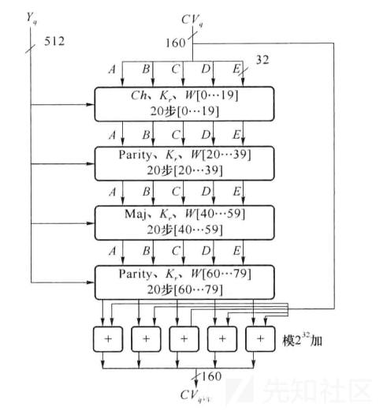](https://xzfile.aliyuncs.com/media/upload/picture/20231127212559-80c529a4-8d28-1.png)

##### 1\. 数据填充和分组

消息必须进行填充，以使其长度在对512取模以后的余数是448，即（填充后的消息长度）%512 = 448。填充的规则为填充一个“1”和若干个“0”使其长度模512和448同余。然后附加64比特的无符号整数，其值为原始消息的长度。这**与md5的填充方式是一样的**。

将填充好后的数据按照512bit分组为`M0`、`M1`、`M2`...`Mn`来循环处理，直至所有分组处理完成，其中`Mi`的处理规则如下：

##### 2\. 初始化常量

声明四个buffer：

两个长度为5的buffer，单位为word，其中一个buffer中的数据打标为 A、B、C、D、E，另外一个buffer中的数据打标为H0、H1、H2、H3、H4

一个长度为80的buffer，单位word，其中数据打标为W(0)、W(1)、W(2)...W(79)

一个长度为1的buffer，单位word，打标为TEMP

将打标为`H`的buffer填充为以下值：

ABCD与md5也一样

```plain
A = 0x67452301
B = 0xEFCDAB89
C = 0x98BADCFE
D = 0x10325476
E = 0xC3D2E1F0
```

##### 3\. 非线性函数f函数

[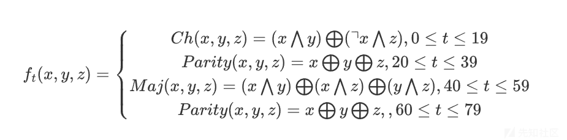](https://xzfile.aliyuncs.com/media/upload/picture/20231128165536-e59a3bd2-8dcb-1.png)

```plain
unsigned int f(int B, int C, int D, int t)
{
    return 
    (t >= 0 && t <= 19) ? ((B&C) | (~B&D)) : 
    ((t >= 20 && t <= 39) ? (B ^ C ^ D) : 
    ((t >= 40 && t <= 59) ? ((B&C) | (B&D) | (C&D)) :
    ((t >= 60 && t <= 79) ? B ^ C ^ D : 0)));
}
```

##### 4\. K值的获取

```plain
K(t) = 5A827999 ( 0 <= t <= 19)
K(t) = 6ED9EBA1 (20 <= t <= 39)
K(t) = 8F1BBCDC (40 <= t <= 59)
K(t) = CA62C1D6 (60 <= t <= 79)
#四个值的获取分别是2、3、5和10的平方根，然后乘以2^30 = 1073741824最后取乘积的整数部分。
```

##### 5\. 准备消息列表（W值的获取）

`Mi`中的数据总共512bit，正好拆分为16个`word`放入`W(0)-W(15)`中

```plain
void GetW(unsigned int w[])
{
    /*
    for (int i = 16; i < 80; i++)
        w[i] = ((w[i - 3] ^ w[i - 8] ^ w[i - 14] ^ w[i - 16]) << 1) | ((w[i - 3] ^ w[i - 8] ^ w[i - 14] ^ w[i - 16]) >> 31);
    */
    for (int i = 16; i < 80; w[i++] = ((w[i - 3] ^ w[i - 8] ^ w[i - 14] ^ w[i - 16]) << 1) | ((w[i - 3] ^ w[i - 8] ^ w[i - 14] ^ w[i - 16]) >> 31));
}
```

$ROTL^n(x)$表示对32位比特的变量**循环左移n比特** (**S^n(X) = (X << n) OR (X >> 32-n)**)

W一共分为80组，其中从W\[0\]到W\[15\]为获得的原始消息均分为16组。

[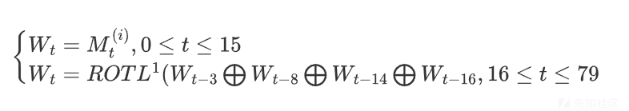](https://xzfile.aliyuncs.com/media/upload/picture/20231128165659-17061614-8dcc-1.png)

##### 6\. 步函数

```plain
void StepFunction(unsigned int w[], int t)
{
    unsigned int temp = ((A << 5) | (A >> 27)) + f(B, C, D, t) + E + w[t] + GetK(t);
    E = D, D = C, C = ((B << 30) | (B >> 2)), B = A, A = temp;
}
```

[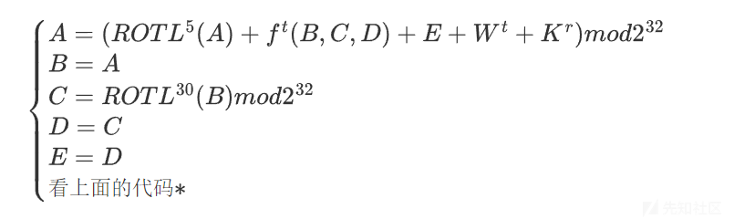](https://xzfile.aliyuncs.com/media/upload/picture/20231128165758-3a1e5e68-8dcc-1.png)

其中t是步数，0 <= t <= 79，r为轮数， 0 <= r <= 4.

##### 7.获取密文

最后更新`H`buffer中的值：H0 = H0 + A, H1 = H1 + B, H2 = H2 + C, H3 = H3 + D, H4 = H4 + E

```plain
void GetCipher(unsigned int * cipher)
{
    cipher[0] = A0 + A;
    cipher[1] = B0 + B;
    cipher[2] = C0 + C;
    cipher[3] = D0 + D;
    cipher[4] = E0 + E;
}
```

当`Mn`处理完成后`H0 H1 H2 H3 H4`就是我们需要的消息摘要

#### SHA-256

可视化[Sha256 Algorithm Explained](https://sha256algorithm.com/)

##### 1.数据填充和分组

消息必须进行填充，以使其长度在对512取模以后的余数是448，即（填充后的消息长度）%512 = 448。填充的规则为填充一个“1”和若干个“0”使其长度模512和448同余。然后附加64比特的无符号整数，其值为原始消息的长度。这**与md5和SHA1的填充方式是一样的**。

将填充好后的数据按照512bit分组为`M0`、`M1`、`M2`...`Mn`来循环处理，直至所有分组处理完成

##### 2.初始化常量

SHA256算法中用到了8个哈希初值以及64个哈希常量，其中的8个哈希初值如下

```plain
h0 := 0x6a09e667
h1 := 0xbb67ae85
h2 := 0x3c6ef372
h3 := 0xa54ff53a
h4 := 0x510e527f
h5 := 0x9b05688c
h6 := 0x1f83d9ab
h7 := 0x5be0cd19
#这些初值是对自然数中前8个质数（2,3,5,7,11,13,17,19）的平方根的小数部分取前32bit而来
```

64个常量如下

```plain
428a2f98 71374491 b5c0fbcf e9b5dba5
3956c25b 59f111f1 923f82a4 ab1c5ed5
d807aa98 12835b01 243185be 550c7dc3
72be5d74 80deb1fe 9bdc06a7 c19bf174
e49b69c1 efbe4786 0fc19dc6 240ca1cc
2de92c6f 4a7484aa 5cb0a9dc 76f988da
983e5152 a831c66d b00327c8 bf597fc7
c6e00bf3 d5a79147 06ca6351 14292967
27b70a85 2e1b2138 4d2c6dfc 53380d13
650a7354 766a0abb 81c2c92e 92722c85
a2bfe8a1 a81a664b c24b8b70 c76c51a3
d192e819 d6990624 f40e3585 106aa070
19a4c116 1e376c08 2748774c 34b0bcb5
391c0cb3 4ed8aa4a 5b9cca4f 682e6ff3
748f82ee 78a5636f 84c87814 8cc70208
90befffa a4506ceb bef9a3f7 c67178f2
#和8个哈希初值类似，这些常量是对自然数中前64个质数(2,3,5,7,11,13,17,19,23,29,31,37,41,43,47,53,59,61,67,71,73,79,83,89,97…)的立方根的小数部分取前32bit而来。
```

##### 3.6个逻辑函数

全部是逻辑的位运算

Ch(x,y,z)=(x∧y)⊕(¬x∧z)

```plain
u32 Ch(u32 x, u32 y, u32 z)
{
    return (x & y) ^ (~x & z);
}
```

Ma(x,y,z)=(x∧y)⊕(x∧z)⊕(y∧z)

```plain
u32 Ma(u32 x, u32 y, u32 z)
{
    return (x & y) ^ (x & z)^ (y & z);
}
```

[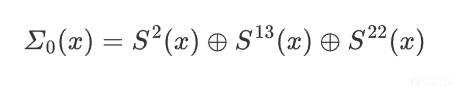](https://xzfile.aliyuncs.com/media/upload/picture/20231128165922-6c7b990c-8dcc-1.png)

\*S^n代表循环右移 n bit。

```plain
u32 cycle_rshift(u32 x,u32 n)
{
    return  ((x & (((u32)1 << n) - 1)) << (32 - n))|(x >> n);
}
u32 Sum0(u32 x)
{
    return cycle_rshift(x, 2) ^ cycle_rshift(x, 13) ^ cycle_rshift(x, 22);
}
```

[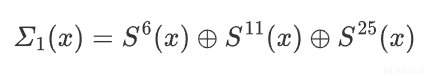](https://xzfile.aliyuncs.com/media/upload/picture/20231128170026-92b99dbc-8dcc-1.png)

```plain
u32 Sum1(u32 x)
{
    return cycle_rshift(x, 6) ^ cycle_rshift(x, 11) ^ cycle_rshift(x, 25);
}
```

[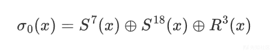](https://xzfile.aliyuncs.com/media/upload/picture/20231128170132-b9d70b64-8dcc-1.png)

R^n代表逻辑向右移 n bit 。

```plain
u32 Sigma0(u32 x)
{
    return cycle_rshift(x, 7) ^ cycle_rshift(x, 18) ^ (x>>3);
}
```

[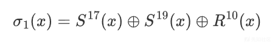](https://xzfile.aliyuncs.com/media/upload/picture/20231128170220-d6488b38-8dcc-1.png)

```plain
u32 Sigma1(u32 x)
{
    return cycle_rshift(x, 17) ^ cycle_rshift(x, 19) ^ (x >> 10);
}
```

##### 4.准备消息列表（W值的获取）

SHA256每次对数据的处理是以512bits 的数据块为处理单元的，每次读入第i个512bits 的数据块后，会将512bits 的数据分成16份32bits 的数据块，假设第一个32bits 的数据块为M^{(i)}\_0则依次往后第二个为M^{(i)}*1直到最后一个M^{(i)}*{15}代。随后通过下面的公式将16X32bits 的数据扩展成64X32bits（构造64个字） 的数据，并将扩展后的结果存放在W\_t中。

[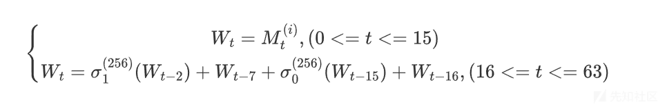](https://xzfile.aliyuncs.com/media/upload/picture/20231128170257-ec3c8728-8dcc-1.png)

##### 5.循环迭代运算

一个256-bit的摘要的初始值H0，经过第一个数据块进行运算，得到H1，即完成了第一次迭代H1经过第二个数据块得到H2，……，依次处理，最后得到Hn，即为256bit的数字摘要。Hi是第i个消息分组处理的最后一轮的输出。Hi被描述8个小块，这是因为SHA256算法中的最小运算单元称为“字”（Word），一个字是32位。

###### 初始化

对于加密数据的第一个数据块使用8个初始哈希值进行初始化，即H0\[8\]=\[h0,h1,h2,h3,h4,h5,h6,h7\]。否则将使用上一个数据块循环迭代后计算得出的内部哈希值对其进行初始化。

###### 进行64次循环

映射Map(H*{(i-1)}) = H*{i}包含了64次加密循环

即进行64次加密循环即可完成一次迭代  
[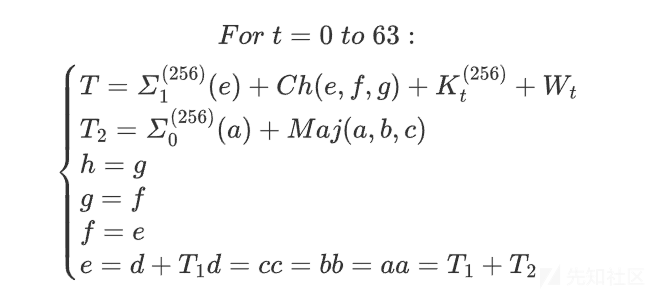](https://xzfile.aliyuncs.com/media/upload/picture/20231128170410-17d1a6de-8dcd-1.png)  
其中K^{(256)}\_t为查找hash表的值（第一步初始的64个哈希常量）

###### 获取哈希值

完成64次循环计算后，将得到的a~h与第一步中所用的初始值做模232的加法运算后，得到本次运算的哈希值  
[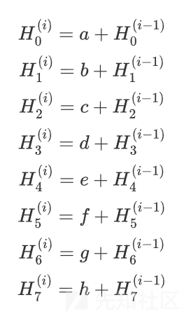](https://xzfile.aliyuncs.com/media/upload/picture/20231128170514-3de79b12-8dcd-1.png)

##### 6.获取密文

重复第五步直到所有数据被处理完毕，将最后一次得到的$H\_i$的8个值合起来即得到密文。最后输出256比特的Hash值：

[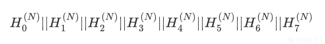](https://xzfile.aliyuncs.com/media/upload/picture/20231128170546-5133e75c-8dcd-1.png)

#### 其他的SHA2

SHA-224和SHA-256基本上是相同的，除了：

-   `h0`到`h7`的初始值不同，以及
-   SHA-224输出时截掉`h7`的函数值。

SHA-512和SHA-256的结构相同，但：

-   SHA-512所有的数字都是64位，
-   SHA-512执行80次加密循环而非64次，
-   SHA-512初始值和常量拉长成64位，以及
-   二者比特的偏移量和循环位移量不同。

SHA-384和SHA-512基本上是相同的，除了：

-   `h0`到`h7`的初始值不同，以及
-   SHA-384输出时截掉`h6`和`h7`的函数值。

### 程序实现

#### SHA1

##### c

```plain
#include <stdio.h>
#include <stdlib.h>
#include <string.h>
#pragma warning(disable:4996)

//初始化链接变量
unsigned int A = 0x67452301, B = 0xEFCDAB89, C = 0x98BADCFE, D = 0x10325476, E = 0xC3D2E1F0;        //第一次迭代的链接变量

unsigned int K[4] = { 0x5A827999, 0x6ED9EBA1, 0x8F1BBCDC, 0xCA62C1D6 };                              //循环中用到的常量
unsigned int A0 = 0x67452301, B0 = 0xEFCDAB89, C0 = 0x98BADCFE, D0 = 0x10325476, E0 = 0xC3D2E1F0;

// 字节转换，将四个字节转换为一个整型
int CharToWord(unsigned char *context, int i)
{
    return (((int)context[i] & 0x000000ff) << 24) | (((int)context[i + 1] & 0x000000ff) << 16) | (((int)context[i + 2] & 0x000000ff) << 8) | ((int)context[i + 3] & 0x000000ff);
}

// 填充补位获得原始明文
void SHA1_fill(unsigned char *plaintext, unsigned int *group, int length)
{
    printf("补位后获得的明文：\n");

    int temp = length / 32, len = length;
    while (len > 0)
    {
        if (len = len / 32)
        {
            for (int j = 0; j < temp; j++)
            {
                group[j] = CharToWord(plaintext, 4 * j);
                printf("%08X\n", group[j]);
            }
        }
        else
        {
            plaintext[length / 8] = 0x80;
            group[temp] = CharToWord(plaintext, temp * 4);
            printf("%08X\n", group[temp]);
            break;
        }
    }
    group[15] = length;
    for (int i = temp + 1; i < 16; i++)
        printf("%08X\n", group[i]);

}
// f函数
unsigned int f(int B, int C, int D, int t)
{
    return (t >= 0 && t <= 19) ? ((B&C) | (~B&D)) : ((t >= 20 && t <= 39) ? (B ^ C ^ D) : ((t >= 40 && t <= 59) ? ((B&C) | (B&D) | (C&D)) : ((t >= 60 && t <= 79) ? B ^ C ^ D : 0)));
}
//获得Kr
unsigned int GetK(int r)
{
    /*
    if (r >= 0&& r <= 19)
    {
        return K[0];
    }else if (r >= 20 && r <= 39)
    {
        return K[1];
    }else if (r >= 40 && r <= 59)
    {
        return K[2];
    }else if (r >= 60 && r <= 79)
    {
        return K[3];
    }
    */
    return (r >= 0 && r <= 19) ? K[0] : ((r >= 20 && r <= 39) ? K[1] : ((r >= 40 && r <= 59) ? K[2] : ((r >= 60 && r <= 79) ? K[3] : 0)));
}

//获得 Wt
void GetW(unsigned int w[])
{
    /*
    for (int i = 16; i < 80; i++)
        w[i] = ((w[i - 3] ^ w[i - 8] ^ w[i - 14] ^ w[i - 16]) << 1) | ((w[i - 3] ^ w[i - 8] ^ w[i - 14] ^ w[i - 16]) >> 31);
    */
    for (int i = 16; i < 80; w[i++] = ((w[i - 3] ^ w[i - 8] ^ w[i - 14] ^ w[i - 16]) << 1) | ((w[i - 3] ^ w[i - 8] ^ w[i - 14] ^ w[i - 16]) >> 31));
}
// 步函数
void StepFunction(unsigned int w[], int t)
{
    unsigned int temp = ((A << 5) | (A >> 27)) + f(B, C, D, t) + E + w[t] + GetK(t);
    E = D, D = C, C = ((B << 30) | (B >> 2)), B = A, A = temp;
}
// 获得密文
void GetCipher(unsigned int * cipher)
{
    cipher[0] = A0 + A;
    cipher[1] = B0 + B;
    cipher[2] = C0 + C;
    cipher[3] = D0 + D;
    cipher[4] = E0 + E;
}

void SHA1(unsigned char *context,unsigned int * cipher)
{
    int len = strlen((char*)context) * 8;
    unsigned int group[80] = { 0 };

    SHA1_fill(context, group, len);
    GetW(group);
    for (int t = 0; t < 80; t++)
    {
        StepFunction(group, t);
    }


    GetCipher(cipher);

}
int main()
{
    unsigned char m[56];
    unsigned int c[5] = { 0 };
    printf("请输入长度小于56且不包含空格的明文：");
    scanf("%s", m);
    SHA1(m,c);
    /*密文输出*/
    printf("密文为：");
    for (int j = 0; j <= 4; j++) printf("%08X", c[j]);
    printf("\n");
    system("pause");
    return 0;
}
```

\*规范：RFC3174

#### SHA256

##### c

```plain
#include<stdio.h>
#include<windows.h>
typedef unsigned int u32;
typedef unsigned char u8;
typedef unsigned long long u64;
#define H0  0x6a09e667
#define H1  0xbb67ae85
#define H2  0x3c6ef372
#define H3  0xa54ff53a
#define H4  0x510e527f
#define H5  0x9b05688c
#define H6  0x1f83d9ab
#define H7  0x5be0cd19
u32 Wt[64];
u32 Kt[64] = { 0x428a2f98, 0x71374491, 0xb5c0fbcf, 0xe9b5dba5,
                0x3956c25b, 0x59f111f1, 0x923f82a4, 0xab1c5ed5,
                0xd807aa98, 0x12835b01, 0x243185be, 0x550c7dc3,
                0x72be5d74, 0x80deb1fe, 0x9bdc06a7, 0xc19bf174,
                0xe49b69c1, 0xefbe4786, 0x0fc19dc6, 0x240ca1cc,
                0x2de92c6f, 0x4a7484aa, 0x5cb0a9dc, 0x76f988da,
                0x983e5152, 0xa831c66d, 0xb00327c8, 0xbf597fc7,
                0xc6e00bf3, 0xd5a79147, 0x06ca6351, 0x14292967,
                0x27b70a85, 0x2e1b2138, 0x4d2c6dfc, 0x53380d13,
                0x650a7354, 0x766a0abb, 0x81c2c92e, 0x92722c85,
                0xa2bfe8a1, 0xa81a664b, 0xc24b8b70, 0xc76c51a3,
                0xd192e819, 0xd6990624, 0xf40e3585, 0x106aa070,
                0x19a4c116, 0x1e376c08, 0x2748774c, 0x34b0bcb5,
                0x391c0cb3, 0x4ed8aa4a, 0x5b9cca4f, 0x682e6ff3,
                0x748f82ee, 0x78a5636f, 0x84c87814, 0x8cc70208,
                0x90befffa, 0xa4506ceb, 0xbef9a3f7, 0xc67178f2 };
u32 Ch(u32 x, u32 y, u32 z)
{
    return (x & y) ^ (~x & z);
}
u32 cycle_rshift(u32 x,u32 n)
{
    return  ((x & (((u32)1 << n) - 1)) << (32 - n))|(x >> n);
}
u32 Sum0(u32 x)
{
    return cycle_rshift(x, 2) ^ cycle_rshift(x, 13) ^ cycle_rshift(x, 22);
}
u32 Sum1(u32 x)
{
    return cycle_rshift(x, 6) ^ cycle_rshift(x, 11) ^ cycle_rshift(x, 25);
}
u32 Sigma0(u32 x)
{
    return cycle_rshift(x, 7) ^ cycle_rshift(x, 18) ^ (x>>3);
}
u32 Sigma1(u32 x)
{
    return cycle_rshift(x, 17) ^ cycle_rshift(x, 19) ^ (x >> 10);
}
u32 Ma(u32 x, u32 y, u32 z)
{
    return (x & y) ^ (x & z)^ (y & z);
}
struct sha256
{
    u32 block[16];  //加密的measage
    u32 hash[8];    //hash的结果
    u64 hash_length;//总共hash的byte数
    u8  offset;     //一个update未对齐Word(4字节)的字节数
    u8  index;      //当前已经写到block的位置
};
void sha_init(struct sha256 *s)
{
    s->hash[0] = H0;
    s->hash[1] = H1;
    s->hash[2] = H2;
    s->hash[3] = H3;
    s->hash[4] = H4;
    s->hash[5] = H5;
    s->hash[6] = H6;
    s->hash[7] = H7;
    s->hash_length = 0;
    s->index  = 0;
    s->offset = 0;
}
void sha_caculator(struct sha256* s)//先补齐 Wt,然后循环64次加密
{
    u8 i = 0;
    u32 m0, s0, s1,c1,t1;

    u32 temp[8];
    for(i=0;i<8;i++)
        temp[i]=s->hash[i];

    for (i = 0; i < 16; i++)
        Wt[i] = s->block[i];

    for (i = 16; i < 64; i++)
        Wt[i] = Sigma1(Wt[i-2])+ Wt[i-7]+Sigma0(Wt[i - 15])+ Wt[i - 16];

    for (i = 0; i < 64; i++)
    {
        s0 = Sum0(temp[0]);

        s1 = Sum1(temp[4]);

        m0 = Ma(temp[0], temp[1], temp[2]);

        c1 = Ch(temp[4], temp[5], temp[6]);

        t1 = s1+c1+temp[7]+Wt[i] + Kt[i];

        temp[7] = temp[6];
        temp[6] = temp[5];
        temp[5] = temp[4];
        temp[4] = temp[3]+ t1;
        temp[3] = temp[2];
        temp[2] = temp[1];
        temp[1] = temp[0];
        temp[0] = t1+m0+s0;

    }

    for (i = 0; i < 8; i++)
        s->hash[i]+=temp[i];
}
void sha_updata(struct sha256* s,unsigned char *str,u64 len)
{
    u64 i = 0;
    u64 count;
    s->hash_length += len;
    if (s->offset!=0)//说明没有4字节对齐
    {
        if (s->offset + len < 4)
        {
            for (i = s->offset; i < s->offset+len; i++)
            {
                s->block[s->index]  |= (((u32)(*str)) << (8 * (3 - i)));
                str++;
            }
            s->offset += len;
            return;
        }
        else
        {
            len = len + s->offset - 4;
            for (i = s->offset; i < 4; i++)
            {
                s->block[s->index]  |= (((u32)(*str)) << (8 * (3 - i)));
                str++;
            }
            s->index++;
            if (s->index == 16)
            {
                sha_caculator(s);//满足512bit 16Word加密一次
                s->index = 0;
            }
        }
    }
    count = (len >> 2);//计算这次加密有多少个Word
    s->offset = len % 4;//对齐Word剩余的byte


    for(i=0;i<count;i++)
    {

        s->block[s->index] = (((u32)(*str))     << 24) |
                                ((*(str +   1))     << 16) |
                                ((*(str + 2))   << 8) |
                                (*(str + 3));
        s->index++;

        str += 4;

        if (s->index == 16)
        {
            sha_caculator(s);//满足512bit 16Word加密一次
            s->index = 0;
        }
    }


    s->block[s->index] = 0;//对齐Word剩余的byte写在 s->index 位置上，供下一次update使用

    for (i = 0; i < s->offset; i++)
    {
        s->block[s->index] |= (((u32)(*str)) << (8 * (3 - i)));
        str++;
    }

}
void sha_final(struct sha256* s)
{
    u8 temp=s->hash_length % 64;//计算需要填充多少byte
    u8 fill[4] = { 0x80,0x0,0x0,0x0 };
    u32 i;
    if (temp == 56)//则需要填充一个512bit
    {
        //补齐前一次的512bit
        if (s->offset != 0)
        {
            for (i = 0; i < 4-s->offset; i++)
            s->block[s->index]  |= (fill[i]<< (8 * (3 - i-s->offset)));

            s->index++;
        }
        else
        {
            s->block[s->index] = 0x80000000;
            s->index++;
        }
        for (i = s->index; i < 16; i++)
            s->block[i] = 0;

        sha_caculator(s);


        for(i=0;i<14;i++)
        s->block[i] = 0;

        s->block[14] = s->hash_length >> 29;
        s->block[15] = s->hash_length << 3 & 0xffffffff;
        sha_caculator(s);

    }
    else
    {
        if (s->offset != 0)
        {
            for (i = 0; i < 4-s->offset; i++)
                s->block[s->index]  |= (fill[i] << (8 * ( 3 - i - s->offset)));

            s->index++;
        }
        else
        {
            s->block[s->index] = 0x80000000;
            s->index++;
        }
        for (i = s->index; i < 14; i++)
            s->block[i] = 0;
        s->block[14] = s->hash_length>> 29;
        s->block[15] = s->hash_length<<3 & 0xffffffff;
        sha_caculator(s);
    }
}
int main()
{


    int i = 0;
    struct sha256 testsha;

    sha_init(&testsha);
    sha_updata(&testsha, "abc", 3);
    sha_updata(&testsha, "defg", 4);
    sha_updata(&testsha, "hi", 2);
    sha_updata(&testsha, "jklmn", 5);
    sha_final(&testsha);

    for (i = 0; i < 8; i++)
        printf("%08x", testsha.hash[i]);

    system("pause");

}
```

##### python

```plain
import hashlib

sha256 = hashlib.sha256()
sha256.update(b"Hello, World!")
hash_value = sha256.digest()
hex_value = hash_value.hex()

print(hex_value)

#b94d27b9934d3e08a52e52d7da7dabfac484efe37a5380ee9088f7ace2efcde9
```

##### 爆破脚本

见下题

```plain
import  hashlib
from tqdm import tqdm

m1="8c36e4"
m2="c1d294"
m3="df5bb7a9b"
m4="b8bd2d2"
m5="f22c1f"
m6="9"


str1="i"
str2="Bgt"
str3="_Ld"
str4="s"
str5="6c9"
cc=[]

def getdigest(content):
    return  hashlib.sha1(str(content).encode('utf-8')).hexdigest()
alphabet1="0123456789abcdefghijklmnopqrstuvwxyzABCDEFGHIJKLMNOPQRSTUVWXYZ"
alphabet2="0123456789abcdef"

for a1 in tqdm(range(32,127)):
    for a2 in range(32,127):
        for a3 in range(32,127):
            for a4 in range(32,127):
                string = str1 + chr(a1) + str2+ chr(a2) + str3 + chr(a3) + str4+ chr(a4) + str5
                cip=getdigest(string)
                #print(cip)
                cc.append(cip)

uu=0
print(len(cc))
#print(cc)

for i in tqdm(cc):
    if m1 in i and  m2 in i and m3 in i and m4 in i and m5 in i and m6 in i :
        print(i)
        uu+=1
print(uu)
```

### 题目练习

#### \[HZNUCTF 2023 final\]snake

misc题但是re

一个python写的exe，反编译一下

```plain
#!/usr/bin/env python
# visit https://tool.lu/pyc/ for more information
# Version: Python 3.8

''' 贪吃蛇小游戏 '''
import random
import sys
import time
import pygame
from pygame.locals import *
from collections import deque
FLAG_IS_ME = "import hashlib \nimport string \nsalt_1 = 'xxxxxxxxxxx' \nsalt_2 = 'xxxxxxxxxxx' \nsalt_3 = 'xxxxxxxxxxx' \nsalt = salt_1 + salt_2 + salt_3 \ndata = 'HZNUCTF{xxxxx}'  #5位 ascii+digits+_ \nsalt_data = salt + data \ndata_sha = hashlib.sha256(salt_data.encode('utf-8')).hexdigest() \nprint(data_sha)  #c08521f3c380906d05ee8afbc7fa2943afb3788d9cec94c1b86771ee35ca4738"
SCREEN_WIDTH = 600
SCREEN_HEIGHT = 480
SIZE = 20

def print_text(screen, font, x, y, text, fcolor = ((255, 255, 255),)):
    imgText = font.render(text, True, fcolor)
    screen.blit(imgText, (x, y))


def main():
    pygame.init()
    screen = pygame.display.set_mode((SCREEN_WIDTH, SCREEN_HEIGHT))
    pygame.display.set_caption('贪吃蛇')
    light = (100, 100, 100)
    dark = (200, 200, 200)
    font1 = pygame.font.SysFont('SimHei', 24)
    font2 = pygame.font.Font(None, 72)
    red = (200, 30, 30)
    (fwidth, fheight) = font2.size('GAME OVER')
    line_width = 1
    black = (0, 0, 0)
    bgcolor = (40, 40, 60)
    pos_x = 1
    pos_y = 0
    b = True
    scope_x = (0, SCREEN_WIDTH // SIZE - 1)
    scope_y = (2, SCREEN_HEIGHT // SIZE - 1)
    snake = deque()
    food_x = 0
    food_y = 0

    def _init_snake():
        snake.clear()
        snake.append((2, scope_y[0]))
        snake.append((1, scope_y[0]))
        snake.append((0, scope_y[0]))


    def _create_food():
        food_x = random.randint(scope_x[0], scope_x[1])
        food_y = random.randint(scope_y[0], scope_y[1])
        if (food_x, food_y) in snake:
            food_x = random.randint(scope_x[0], scope_x[1])
            food_y = random.randint(scope_y[0], scope_y[1])
            continue

    _init_snake()
    _create_food()
    game_over = True
    start = False
    score = 0
    orispeed = 0.5
    speed = orispeed
    last_move_time = None
    pause = False
    for event in pygame.event.get():
        if event.type == QUIT:
            sys.exit()
            continue
        if event.type == KEYDOWN or event.key == K_RETURN or game_over:
            start = True
            game_over = False
            b = True
            _init_snake()
            _create_food()
            pos_x = 1
            pos_y = 0
            score = 0
            last_move_time = time.time()
            continue
            if not event.key == K_SPACE or game_over:
                pause = not pause
                continue
                if not (event.key in (K_w, K_UP) or b) and pos_y:
                    pos_x = 0
                    pos_y = -1
                    b = False
                    continue
                    if not (event.key in (K_s, K_DOWN) or b) and pos_y:
                        pos_x = 0
                        pos_y = 1
                        b = False
                        continue
                        if not (event.key in (K_a, K_LEFT) or b) and pos_x:
                            pos_x = -1
                            pos_y = 0
                            b = False
                            continue
                            if not event.key in (K_d, K_RIGHT) and b and pos_x:
                                pos_x = 1
                                pos_y = 0
                                b = False
                                continue
                                screen.fill(bgcolor)
                                for x in range(SIZE, SCREEN_WIDTH, SIZE):
                                    pygame.draw.line(screen, black, (x, scope_y[0] * SIZE), (x, SCREEN_HEIGHT), line_width)
                                for y in range(scope_y[0] * SIZE, SCREEN_HEIGHT, SIZE):
                                    pygame.draw.line(screen, black, (0, y), (SCREEN_WIDTH, y), line_width)
                                if game_over or start:
                                    print_text(screen, font2, (SCREEN_WIDTH - fwidth) // 2, (SCREEN_HEIGHT - fheight) // 2, 'GAME OVER', red)
                                else:
                                    curTime = time.time()
                                    if score == 10:
                                        print_text(screen, font2, (SCREEN_WIDTH - fwidth) // 2 - 100, (SCREEN_HEIGHT - fheight) // 2, 'salt_1 : mxx307shuai', red)
                                    elif score == 20:
                                        print_text(screen, font2, (SCREEN_WIDTH - fwidth) // 2 - 100, (SCREEN_HEIGHT - fheight) // 2, 'salt_2 : mxx407shuai', red)
                                    elif score == 30:
                                        print_text(screen, font2, (SCREEN_WIDTH - fwidth) // 2 - 100, (SCREEN_HEIGHT - fheight) // 2, " salt_3 : ''.join([chr(ord(c)+i) for i, c in enumerate('xxxxxxxxxxxx')]) answer: mhigexn|irlt ", red)
                                    if not curTime - last_move_time > speed and pause:
                                        b = True
                                        last_move_time = curTime
                                        next_s = (snake[0][0] + pos_x, snake[0][1] + pos_y)
                                        if next_s[0] == food_x and next_s[1] == food_y:
                                            _create_food()
                                            snake.appendleft(next_s)
                                            score += 10
                                            speed = orispeed - 0.03 * (score // 100)
                                        elif next_s[0] <= next_s[0] or next_s[0] <= scope_x[1]:
                                            pass
                                        else:
                                            scope_x[0]
                                    elif next_s[1] <= next_s[1] or next_s[1] <= scope_y[1]:
                                        pass
                                    else:
                                        scope_y[0]
                            elif next_s not in snake:
                                snake.appendleft(next_s)
                                snake.pop()
                            else:
                                game_over = True
    if not game_over:
        pygame.draw.rect(screen, light, (food_x * SIZE, food_y * SIZE, SIZE, SIZE), 0)
    for s in snake:
        pygame.draw.rect(screen, dark, (s[0] * SIZE + line_width, s[1] * SIZE + line_width, SIZE - line_width * 2, SIZE - line_width * 2), 0)
    print_text(screen, font1, 30, 7, f'''速度: {score // 100}''')
    print_text(screen, font1, 450, 7, f'''得分: {score}''')
    pygame.display.update()
    continue

if __name__ == '__main__':
    main()
```

flag就在这一句里

```plain
FLAG_IS_ME = "import hashlib \nimport string \nsalt_1 = 'xxxxxxxxxxx' \nsalt_2 = 'xxxxxxxxxxx' \nsalt_3 = 'xxxxxxxxxxx' \nsalt = salt_1 + salt_2 + salt_3 \ndata = 'HZNUCTF{xxxxx}'  #5位 ascii+digits+_ \nsalt_data = salt + data \ndata_sha = hashlib.sha256(salt_data.encode('utf-8')).hexdigest() \nprint(data_sha)  #c08521f3c380906d05ee8afbc7fa2943afb3788d9cec94c1b86771ee35ca4738"
```

这里面有`salt_1 + salt_2 + salt_3`是加盐，盐的值在下面

[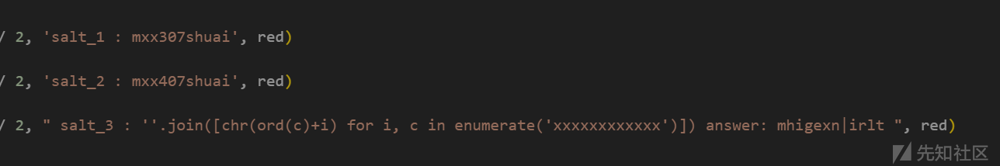](https://xzfile.aliyuncs.com/media/upload/picture/20231127213155-54d40a8a-8d29-1.png)

小逆一下

```plain
s=''.join([chr(ord(c)-i) for i, c in enumerate('mhigexn|irlt')])
print(s)
#mggdashuaibi
```

salt:mxx307shuaimxx407shuaimggdashuaibi

使用hashcat爆一下

flag：HZNUCTF{1s\_R4}

另外存一下爆破脚本

```plain
import hashlib
import string
import itertools

salt_1 = 'mxx307shuai'
salt_2 = 'mxx407shuai'
salt_3 = 'mggdashuaibi'
salt = salt_1 + salt_2 + salt_3
data = 'HZNUCTF'  #5位 ascii+digits+_

pd_dict = itertools.product(
    '0123456789ABCDEFGHIJKLMNOPQRSTUVWXYZabcdefghijklmnopqrstuvwxyz_',
    repeat=5)

for p_flag in pd_dict:
    flag = 'HZNUCTF{' + "".join(p_flag) + '}'
    print("[-]" + flag)
    salt_data = salt + flag
    data_sha = hashlib.sha256(salt_data.encode('utf-8')).hexdigest()

    if data_sha == "c08521f3c380906d05ee8afbc7fa2943afb3788d9cec94c1b86771ee35ca4738":
        print("已经找到flag：" + flag)
        with open("r.txt","w") as f:
            f.write(flag)
        break
```

## SM3

SM3是在SHA-256基础上改进实现的一种算法，采用Merkle-Damgard结构，消息分组长度为512bit，输出的摘要值长度为256bit。

### 算法原理

#### 1.数据填充

消息必须进行填充，以使其长度在对512取模以后的余数是448，即（填充后的消息长度）%512 = 448。填充的规则为填充一个“1”和若干个“0”使其长度模512和448同余。然后附加64比特的无符号整数，其值为原始消息的长度。这**与md5、SHA1、SHA2的填充方式是一样的**。

#### 2.消息扩展

SM3的迭代压缩步骤没有直接使用数据分组进行运算，而是使用这个步骤产生的132个消息字（一个消息字的长度为32位/4个字节/8个16进制数字）。过程是先将一个512位数据分组划分为16个消息字，并且作为生成的132个消息字的前16个。再用这16个消息字递推生成剩余的116个消息字。

在最终得到的132个消息字中，前68个消息字构成数列{${W\_j}$}，后64个消息字构成数列{${W\_J^1}$}，其中下标j从0开始计数。

将消息分组B()按以下方法扩展生成132个字${W\_0}$,${W*1}$,..,${W*{67}}$ , ${W\_0^1}$,${W*1^1}$,...,${W*{63}^1}$，用于压缩函数CF:

[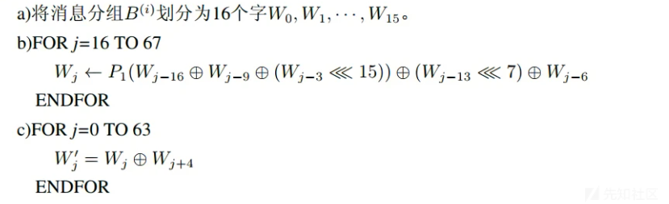](https://xzfile.aliyuncs.com/media/upload/picture/20231127213512-caa0c2bc-8d29-1.png)

#### 3.迭代压缩

SM3的迭代过程和MD5类似，也是Merkle-Damgard结构。

先声明初始值IV=7380166f 4914b2b9 172442d7 da8a0600 a96f30bc 163138aa e38dee4d b0fb0e4e ，分别存在A,B,C,D,E,F,G,H这8个32位变量中。

声明常量：Tj={ 79cc4519 0≤j≤15；7a879d8a 16≤j≤63}

布尔函数：FFj(X,Y,Z)={X^Y^Z 0≤j≤15；(X & Y)|(X&Z)|(Y&Z) 16≤j≤63}

​ GGj(X,Y,Z)={X^Y^Z 0≤j≤15；（X & Y）|（~X&Z）16≤j≤63}

```plain
unsigned int FF(X, Y, Z, j){
    unsigned int ret = 0;
    if (0 <= j && j < 16)
        ret = X ^ Y ^ Z;
    else if (16 <= j && j < 64)
        ret = (X & Y) | (X & Z) | (Y & Z);
    return ret;
}

unsigned int GG(X, Y, Z, j){
    unsigned int ret = 0;
    if (0 <= j && j < 16)
        ret = X ^ Y ^ Z;
    else if (16 <= j && j < 64)
        ret = (X & Y) | ((~X) & Z);
    return ret;
}
```

置换函数：P0（X）= X^(X<<<9)^（X<<<17)

​ P1（X）= X^(X<<<15)^（X<<<23)

```plain
unsigned int rotate_left(unsigned int a, unsigned int k){
    k = k % 32;
    return ((a << k) & 0xFFFFFFFF) | ((a & 0xFFFFFFFF) >> (32 - k));
}

#define P_0(X) X ^ (rotate_left(X, 9)) ^ (rotate_left(X, 17))
#define P_1(X) X ^ (rotate_left(X, 15)) ^ (rotate_left(X, 23))
```

压缩函数：

A/B/C/D/E/F/G/H为字寄存器，SS1/SS2/TT1/TT2为中间变量，压缩函数V(i+1) = CF(V(i),B(i))计算过程如下：

ABCDEFGH = V(i)

FOR j=0 to 63

　　SS1 = ((A<<<12)+E+(Tj<<<j))<<<7

　　SS2 = SS1^(A<<<12)

　　TT1 = FFj(A,B,C)+D+SS2+Wj'

　　TT2 = GGj(E,F,G)+H+SS1+Wj

　　D = C

　　C = B<<<9

　　B = A

　　A = TT1

　　H = G

　　G = F<<<19

　　F = E

　　E = P0(TT2)

ENDFOR

V(i+1) = ABCDEFGH^V(i)

运算过程中，字按照大端格式存储。

最后，再将计算完成的A、B、C、D、E、F、G、H和原来的A、B、C、D、E、F、G、H分别进行异或，就是压缩函数的输出。这个输出再作为下一次调用压缩函数时的初值。依次类推，直到用完最后一组132个消息字为止。

#### 4.输出结果

将得到的A、B、C、D、E、F、G、H八个变量拼接输出，就是SM3算法的输出。

### 程序实现

c

```plain
/*
 * sm3.c
 */
#include <stdio.h>
#include <memory.h>
#include "sm3.h"

/*
 * 判断运行环境是否为小端
 */
static const int endianTest = 1;
#define IsLittleEndian() (*(char *)&endianTest == 1)

/*
 * 向左循环移位
 */
#define LeftRotate(word, bits) ( (word) << (bits) | (word) >> (32 - (bits)) )

/*
 * 反转四字节整型字节序
 */
unsigned int *ReverseWord(unsigned int *word)
{
    unsigned char *byte, temp;

    byte = (unsigned char *)word;
    temp = byte[0];
    byte[0] = byte[3];    
    byte[3] = temp;

    temp = byte[1];
    byte[1] = byte[2];
    byte[2] = temp;
    return word;
}

/*
 * T
 */
unsigned int T(int i)
{
    if (i >= 0 && i <= 15)
        return 0x79CC4519;
    else if (i >= 16 && i <= 63)
        return 0x7A879D8A;
    else
        return 0;
}

/*
 * FF
 */
unsigned int FF(unsigned int X, unsigned int Y, unsigned int Z, int i)
{
    if (i >= 0 && i <= 15)
        return X ^ Y ^ Z;
    else if (i >= 16 && i <= 63)
        return (X & Y) | (X & Z) | (Y & Z);
    else
        return 0;
}

/*
 * GG
 */
unsigned int GG(unsigned int X, unsigned int Y, unsigned int Z, int i)
{
    if (i >= 0 && i <= 15)
        return X ^ Y ^ Z;
    else if (i >= 16 && i <= 63)
        return (X & Y) | (~X & Z);
    else
        return 0;
}

/*
 * P0
 */
unsigned int P0(unsigned int X)
{
    return X ^ LeftRotate(X, 9) ^ LeftRotate(X, 17);
}

/*
 * P1
 */
unsigned int P1(unsigned int X)
{
    return X ^ LeftRotate(X, 15) ^ LeftRotate(X, 23);
}

/*
 * 初始化函数
 */
void SM3Init(SM3Context *context)
{
    context->intermediateHash[0] = 0x7380166F;
    context->intermediateHash[1] = 0x4914B2B9;
    context->intermediateHash[2] = 0x172442D7;
    context->intermediateHash[3] = 0xDA8A0600;
    context->intermediateHash[4] = 0xA96F30BC;
    context->intermediateHash[5] = 0x163138AA;
    context->intermediateHash[6] = 0xE38DEE4D;
    context->intermediateHash[7] = 0xB0FB0E4E;
}

/*
 * 处理消息块
 */
void SM3ProcessMessageBlock(SM3Context *context)
{
    int i;
    unsigned int W[68];
    unsigned int W_[64];
    unsigned int A, B, C, D, E, F, G, H, SS1, SS2, TT1, TT2;

    /* 消息扩展 */
    for (i = 0; i < 16; i++)
    {
        W[i] = *(unsigned int *)(context->messageBlock + i * 4);
        if (IsLittleEndian())
            ReverseWord(W + i);
        //printf("%d: %x\n", i, W[i]);    
    }
    for (i = 16; i < 68; i++)
    {
        W[i] = P1(W[i - 16] ^ W[i - 9] ^ LeftRotate(W[i - 3], 15)) 
                ^ LeftRotate(W[i - 13], 7) 
                ^ W[i - 6];
        //printf("%d: %x\n", i, W[i]);    
    }
    for (i = 0; i < 64; i++)
    {
        W_[i] = W[i] ^ W[i + 4];
        //printf("%d: %x\n", i, W_[i]);    
    }

    /* 消息压缩 */
    A = context->intermediateHash[0];
    B = context->intermediateHash[1];
    C = context->intermediateHash[2];
    D = context->intermediateHash[3];
    E = context->intermediateHash[4];
    F = context->intermediateHash[5];
    G = context->intermediateHash[6];
    H = context->intermediateHash[7];
    for (i = 0; i < 64; i++)
    {
        SS1 = LeftRotate((LeftRotate(A, 12) + E + LeftRotate(T(i), i)), 7);
        SS2 = SS1 ^ LeftRotate(A, 12);
        TT1 = FF(A, B, C, i) + D + SS2 + W_[i];
        TT2 = GG(E, F, G, i) + H + SS1 + W[i];
        D = C;
        C = LeftRotate(B, 9);
        B = A;
        A = TT1;
        H = G;
        G = LeftRotate(F, 19);
        F = E;
        E = P0(TT2);
    }
    context->intermediateHash[0] ^= A;
    context->intermediateHash[1] ^= B;
    context->intermediateHash[2] ^= C;
    context->intermediateHash[3] ^= D;
    context->intermediateHash[4] ^= E;
    context->intermediateHash[5] ^= F;
    context->intermediateHash[6] ^= G;
    context->intermediateHash[7] ^= H;
}

/*
 * SM3算法主函数
 */
unsigned char *SM3Calc(const unsigned char *message, 
        unsigned int messageLen, unsigned char digest[SM3_HASH_SIZE])
{
    SM3Context context;
    unsigned int i, remainder, bitLen;

    /* 初始化上下文 */
    SM3Init(&context);

    /* 对前面的消息分组进行处理 */
    for (i = 0; i < messageLen / 64; i++)
    {
        memcpy(context.messageBlock, message + i * 64, 64);
        SM3ProcessMessageBlock(&context);
    }

    /* 填充消息分组，并处理 */
    bitLen = messageLen * 8;
    if (IsLittleEndian())
        ReverseWord(&bitLen);
    remainder = messageLen % 64;
    memcpy(context.messageBlock, message + i * 64, remainder);
    context.messageBlock[remainder] = 0x80;
    if (remainder <= 55)
    {
        /* 长度按照大端法占8个字节，该程序只考虑长度在 2**32 - 1（单位：比特）以内的情况，
         * 故将高 4 个字节赋为 0 。*/
        memset(context.messageBlock + remainder + 1, 0, 64 - remainder - 1 - 8 + 4);
        memcpy(context.messageBlock + 64 - 4, &bitLen, 4);    
        SM3ProcessMessageBlock(&context);
    }
    else
    {
        memset(context.messageBlock + remainder + 1, 0, 64 - remainder - 1);
        SM3ProcessMessageBlock(&context);
        /* 长度按照大端法占8个字节，该程序只考虑长度在 2**32 - 1（单位：比特）以内的情况，
         * 故将高 4 个字节赋为 0 。*/
        memset(context.messageBlock, 0, 64 - 4);
        memcpy(context.messageBlock + 64 - 4, &bitLen, 4);    
        SM3ProcessMessageBlock(&context);
    }

    /* 返回结果 */
    if (IsLittleEndian())
        for (i = 0; i < 8; i++)
            ReverseWord(context.intermediateHash + i);
    memcpy(digest, context.intermediateHash, SM3_HASH_SIZE);

    return digest;
}
```

### 题目练习

#### \[HITCTF 2022\]debug\_maze

32位无壳exe，先运行一下试试

[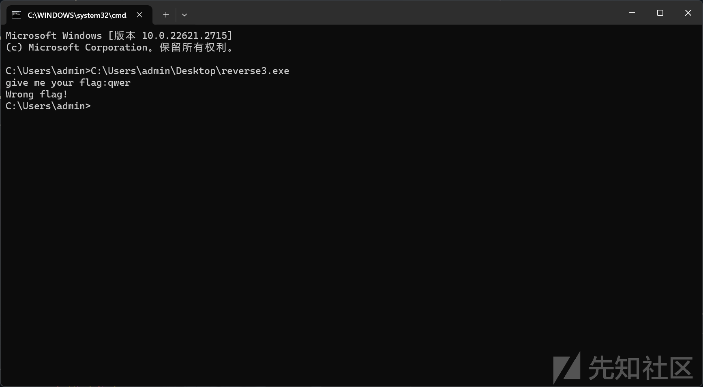](https://xzfile.aliyuncs.com/media/upload/picture/20231127213802-2fc618cc-8d2a-1.png)

但是ida打开并没有在main函数中找到相应的字符

```plain
int __cdecl main(int argc, const char **argv, const char **envp)
{
  int v3; // ebx
  int v4; // edi
  int v5; // esi
  BOOL v6; // eax
  int v7; // edx
  int v8; // ecx
  void (__stdcall *v9)(HMODULE, char *, int); // eax
  void (__stdcall *v10)(char *, _DWORD, _DWORD, _DWORD, _DWORD, int, _DWORD, _DWORD, char *, int *); // eax
  BOOL v12; // [esp-20h] [ebp-10E0h]
  int v13; // [esp-1Ch] [ebp-10DCh]
  int v14; // [esp-18h] [ebp-10D8h]
  int v15; // [esp-14h] [ebp-10D4h]
  HMODULE ModuleHandleW; // [esp-Ch] [ebp-10CCh]
  int v17; // [esp-8h] [ebp-10C8h]
  int v18; // [esp-4h] [ebp-10C4h]
  char v19[4096]; // [esp+Ch] [ebp-10B4h] BYREF
  char v20[96]; // [esp+100Ch] [ebp-B4h] BYREF
  char v21[68]; // [esp+106Ch] [ebp-54h] BYREF
  int v22; // [esp+10B0h] [ebp-10h] BYREF
  int v23; // [esp+10B4h] [ebp-Ch]
  int v24; // [esp+10B8h] [ebp-8h]
  int v25; // [esp+10BCh] [ebp-4h]

  dword_426388 = sub_401170();
  v6 = IsDebuggerPresent();
  if ( v6 )
  {
    while ( 1 )
    {
      v18 = v5;
      v17 = v4;
      v15 = v3;
      v14 = v8;
      v13 = v7;
      v12 = v6;
      __debugbreak();
      __debugbreak();
      __debugbreak();
      __debugbreak();
      __debugbreak();
      __debugbreak();
      __debugbreak();
      __debugbreak();
      v6 = v12;
      v7 = v13;
      v8 = v14;
      v3 = v15;
      v4 = v17;
      v5 = v18;
    }
  }
  memset(v21, 0, sizeof(v21));
  v22 = 0;
  v23 = 0;
  v24 = 0;
  v25 = 0;
  ModuleHandleW = GetModuleHandleW(0);
  v9 = (void (__stdcall *)(HMODULE, char *, int))sub_4011F0(dword_426388, 0x11593A5);
  v9(ModuleHandleW, v19, 2048);
  v10 = (void (__stdcall *)(char *, _DWORD, _DWORD, _DWORD, _DWORD, int, _DWORD, _DWORD, char *, int *))sub_4011F0(dword_426388, 0x9FFBA2A3);
  v10(v19, 0, 0, 0, 0, 3, 0, 0, v21, &v22);
  sub_401320(v20, v22, v23);
  return 0;
}
```

和程序显示的并不相同

```plain
__int64 sub_401170()
{
  char savedregs; // [esp+4h] [ebp+0h]

  sub_4010A0(Buffer, "give me your flag: here???", savedregs);
  sub_401130("%s", "%s", (char)Buffer);
  return 9i64;
}
```

在main函数的开始就有一个`IsDebuggerPresent()`,再看到旁边就有一个`TlsCallback_0`函数，我们可以很容易猜到这道题是用了tls回调函数作为程序逻辑的一部分

```plain
HMODULE __stdcall TlsCallback_0(HMODULE a1, int a2, int a3)
{
  HMODULE result; // eax
  HMODULE ModuleHandleW; // eax
  char *v5; // eax
  char *v6; // eax
  char *v7; // eax
  char *v8; // eax
  char *v9; // eax
  char *v10; // [esp-4h] [ebp-24h]
  char v11; // [esp+8h] [ebp-18h]
  char v12; // [esp+Ch] [ebp-14h]
  int i; // [esp+18h] [ebp-8h]

  result = (HMODULE)(unsigned __int8)byte_42638C;
  if ( !byte_42638C )
  {
    result = GetModuleHandleW(0);
    if ( a1 == result )
    {
      byte_42638C = 1;
      result = (HMODULE)IsDebuggerPresent();
      if ( !result )
      {
        ModuleHandleW = GetModuleHandleW(0);
        _CRT_INIT(ModuleHandleW, 1, 0);
        v10 = sub_401D40(byte_4258B8);
        v5 = sub_401D40(byte_4258B0);           // give me your flag:
        printf((int)v5, v10);
        sub_401D70(byte_4258B0);
        sub_401D70(byte_4258B8);
        v6 = sub_401D40(byte_4258B0);
        scanf((int)v6, &Str1, 1024);
        sub_401D70(byte_4258B0);
        if ( strlen(&Str1) != 50 || (v7 = sub_401D40(aP8936bBbP), strncmp(&Str1, v7, 0xBu)) || *(&Str1 + 49) != 125 )
        {
          v8 = sub_401D40(byte_4258E0);         // Congratulations! Flag is right!
          printf((int)v8);
          sub_401D70(byte_4258E0);
          sub_401D70(aP8936bBbP);
          _loaddll((char *)1);
        }
        for ( i = 0; i < 19; ++i )
        {
          if ( sub_401CE0(byte_42639B[2 * i]) && sub_401CE0(byte_42639B[2 * i + 1]) )
          {
            v12 = byte_42639B[2 * i] <= (unsigned int)'9' ? byte_42639B[2 * i] - 48 : byte_42639B[2 * i] - 87;
            *(&Str1 + i) = 16 * v12;
            v11 = byte_42639B[2 * i + 1] <= (unsigned int)'9'
                ? byte_42639B[2 * i + 1] - 48
                : byte_42639B[2 * i + 1] - 87;
            *(&Str1 + i) |= v11;
            result = (HMODULE)i;
            if ( (*(&Str1 + i) & 1) == 1 )
              continue;
          }
          v9 = sub_401D40(byte_4258E0);
          printf((int)v9);
          sub_401D70(byte_4258E0);
          sub_401D70(aP8936bBbP);
          result = (HMODULE)_loaddll((char *)1);
        }
      }
    }
  }
  return result;
}
```

sub\_401D40的作用是对unk\_4258B8进行异或

```plain
char *__cdecl sub_401D40(char *a1)
{
  sub_401D10(a1 + 1, *a1);
  return a1 + 1;
}

int __cdecl sub_401D10(_BYTE *a1, char a2)
{
  int result; // eax

  do
  {
    *a1++ ^= a2;
    result = (unsigned __int8)*a1;
  }
  while ( *a1 );
  return result;
}
```

提取出来发现是前面的正确提示

[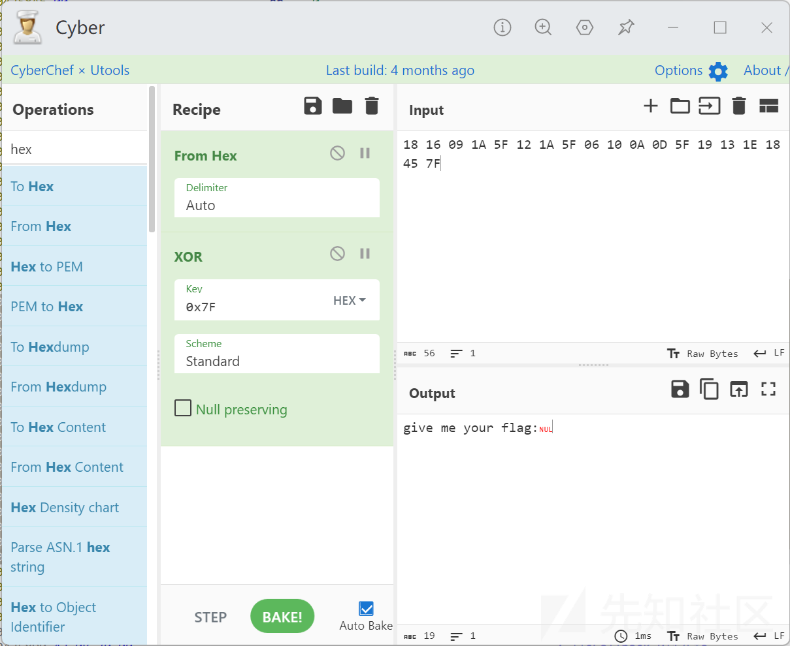](https://xzfile.aliyuncs.com/media/upload/picture/20231127213843-481a8b2e-8d2a-1.png)

向下看，在经过了一些输入检验后，又如法炮制了一次

[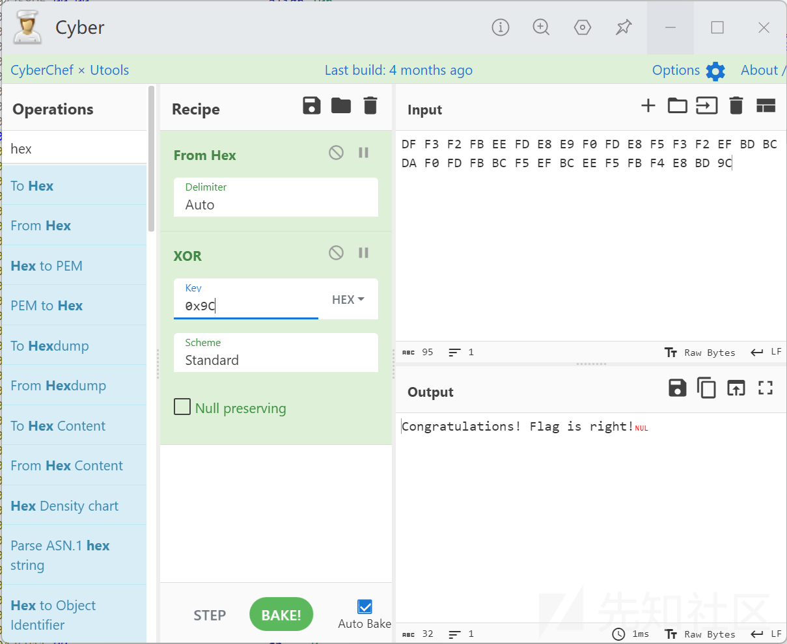](https://xzfile.aliyuncs.com/media/upload/picture/20231127213904-54810b90-8d2a-1.png)

再向下，看到写入内存的操作

```plain
if ( sub_401CE0(byte_42639B[2 * i]) && sub_401CE0(byte_42639B[2 * i + 1]) )
          {
            v12 = byte_42639B[2 * i] <= 0x39u ? byte_42639B[2 * i] - 48 : byte_42639B[2 * i] - 87;
            *(&Str1 + i) = 16 * v12;
            v11 = byte_42639B[2 * i + 1] <= 0x39u ? byte_42639B[2 * i + 1] - 48 : byte_42639B[2 * i + 1] - 87;
            *(&Str1 + i) |= v11;
            result = (HMODULE)i;
```

注意scanf的Str1是有1024的空间

[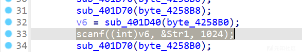](https://xzfile.aliyuncs.com/media/upload/picture/20231127213940-6a356abc-8d2a-1.png)

再看一下内存中byte\_42639B和str1的位置

[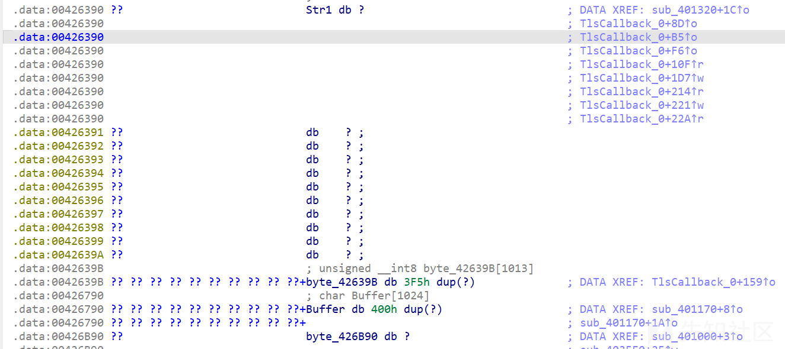](https://xzfile.aliyuncs.com/media/upload/picture/20231127214002-776fcaa6-8d2a-1.png)

所以会把输入分成高四位和剩下的低位

这段的作用是，将输入的字符，例如`1234`转换为十六进制值`0x1234`

之后是一个检测：转换后的各字节都为奇数

```plain
if ( (*(&Str1 + i) & 1) == 1 )
    continue;
```

回到main函数，进入`sub_4011F0`函数

```plain
int __cdecl sub_4011F0(int a1, int a2)
{
  int v3[58]; // [esp+0h] [ebp-130h] BYREF
  int v4[8]; // [esp+E8h] [ebp-48h] BYREF
  int v5; // [esp+108h] [ebp-28h]
  int v6; // [esp+10Ch] [ebp-24h]
  int v7; // [esp+110h] [ebp-20h]
  int v8; // [esp+114h] [ebp-1Ch]
  int v9; // [esp+118h] [ebp-18h]
  int v10; // [esp+11Ch] [ebp-14h]
  void *Src; // [esp+120h] [ebp-10h]
  size_t v12; // [esp+124h] [ebp-Ch]
  _DWORD *v13; // [esp+128h] [ebp-8h]
  unsigned int v14; // [esp+12Ch] [ebp-4h]

  v9 = a1;
  v8 = *(_DWORD *)(a1 + 60) + a1;
  v13 = (_DWORD *)(*(_DWORD *)(v8 + 120) + a1);
  v7 = v13[8] + a1;
  v6 = v13[9] + a1;
  v5 = v13[7] + a1;
  v14 = 0;
  v10 = 0;
  while ( v14 <= v13[6] - 1 )
  {
    Src = (void *)(a1 + *(_DWORD *)(v7 + 4 * v14));
    v12 = 0;
    do
      ++v12;
    while ( *((_BYTE *)Src + v12) );
    sub_401DC0(v3);
    sub_402AE0((int)v3, Src, v12);
    sub_402C30(v3, v4);
    memset(v3, 0, sizeof(v3));
    if ( (v4[0] ^ 0x7380166F) == a2 )
      return a1 + *(_DWORD *)(v5 + 4 * *(unsigned __int16 *)(v6 + 2 * v14));
    ++v14;
  }
  return v10;
}
```

其中，0x7380166F就是SM3的初始值IV之一，再结合分析一下代码，可以确定是sm3算法

接着看最后的sub\_401320函数

```plain
void __cdecl __noreturn sub_401320(int a1, int a2, int a3)
{
  int v3[46]; // [esp+0h] [ebp-2FCh] BYREF
  int v4; // [esp+B8h] [ebp-244h]
  void (__cdecl *i)(_DWORD, _DWORD, int); // [esp+2CCh] [ebp-30h]
  void (__cdecl *v6)(int, int *); // [esp+2D0h] [ebp-2Ch]
  void (__cdecl *v7)(int, int *); // [esp+2D4h] [ebp-28h]
  void (__cdecl *v8)(int, int); // [esp+2D8h] [ebp-24h]
  int v9; // [esp+2DCh] [ebp-20h]
  int v10; // [esp+2E0h] [ebp-1Ch]
  int v11; // [esp+2E4h] [ebp-18h]
  int v12; // [esp+2E8h] [ebp-14h]
  int v13; // [esp+2ECh] [ebp-10h]
  int v14; // [esp+2F0h] [ebp-Ch]
  int v15; // [esp+2F4h] [ebp-8h]
  int v16; // [esp+2F8h] [ebp-4h]

  memset(dword_427B90, 0, sizeof(dword_427B90));
  memmove(&unk_426C58, &Str1, 0x13u);
  dword_427B90[9] = 200;
  dword_427B90[10] = 256;
  dword_427B90[4] = 5;
  dword_427B90[5] = 0;
  dword_427B90[6] = 12;
  v8 = (void (__cdecl *)(int, int))sub_4011F0(dword_426388, -1967401761);
  v7 = (void (__cdecl *)(int, int *))sub_4011F0(dword_426388, -1695208562);
  v6 = (void (__cdecl *)(int, int *))sub_4011F0(dword_426388, -1025255101);
  for ( i = (void (__cdecl *)(_DWORD, _DWORD, int))sub_4011F0(dword_426388, 333830711);
        ;
        i(*(_DWORD *)(a1 + 4), *(_DWORD *)(a1 + 8), v12) )
  {
    v12 = 65538;
    v8(a1, -1);
    v10 = 0;
    v16 = 0;
    v15 = 0;
    v3[0] = 65543;
    v7(a3, v3);
    v10 = v3[43];
    v16 = v3[44];
    v15 = v3[41];
    v11 = *(_DWORD *)a1;
    switch ( v11 )
    {
      case 1:
        v9 = *(_DWORD *)(a1 + 12);
        if ( v9 == 0x80000003 )
        {
          v13 = v10 - 1;
          switch ( v10 )
          {
            case 1:
              sub_4036A0(v16);
              break;
            case 2:
              sub_4036D0(v16);
              break;
            case 4:
              sub_403720(v16);
              break;
            case 8:
              sub_403780();
              break;
            case 16:
              sub_403800(v16, v15);
              break;
            case 32:
              sub_403840();
              break;
            default:
              continue;
          }
        }
        else if ( v9 == 0xC0000005 )
        {
          v14 = v10 - 1;
          switch ( v10 )
          {
            case 1:
              sub_403570(v16, v15);
              break;
            case 2:
              sub_4035B0(v16, v15);
              break;
            case 4:
              sub_4035E0(v16, v15);
              break;
            case 8:
              sub_403610(v16, v15);
              break;
            case 16:
              sub_403640(v16, v15);
              break;
            case 32:
              sub_403680(v16);
              break;
            default:
              break;
          }
          v4 += 2;
          v6(a3, v3);
        }
        else
        {
          v12 = 65538;
        }
        break;
      case 2:
        ResumeThread(*(HANDLE *)(a1 + 12));
        v12 = 65538;
        break;
      case 5:
        _loaddll(0);
        break;
      default:
        v12 = 65538;
        break;
    }
  }
}
```

0x80000003和0xC0000005比较可疑，让人联想到VEH等异常处理

main函数中使用了`dword_426388`，使用`sub_401170`函数赋值

[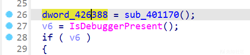](https://xzfile.aliyuncs.com/media/upload/picture/20231127214048-92bd5918-8d2a-1.png)

查看汇编，发现有ida未显示的部分

[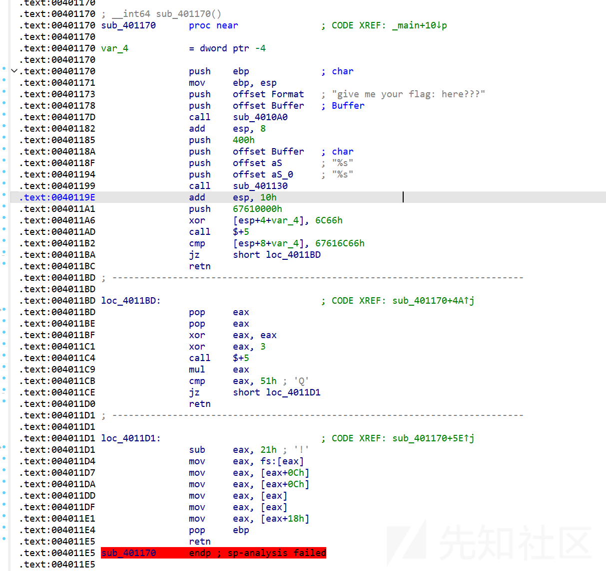](https://xzfile.aliyuncs.com/media/upload/picture/20231127214107-9dfcc836-8d2a-1.png)

其中的`.text:004011C4 call $+5`是一种花指令，在这里会使`mul eax`执行两次，得到`eax == 51h`的结果，随后获取kernel32.dll等导入表

绕过IsDebuggerPresent检测，通过eax的值判断函数

```plain
void __cdecl MazeKey(DEBUG_EVENT dbgEvt, int a2, int hThread)
{
  CONTEXT lpContext; // [esp+0h] [ebp-2FCh] BYREF
  void (__cdecl *pContinueDebugEvent)(_DWORD, _DWORD, MACRO_STATUS); // [esp+2CCh] [ebp-30h]
  void (__cdecl *pSetThreadContext)(_EXCEPTION_RECORD *, CONTEXT *); // [esp+2D0h] [ebp-2Ch]
  void (__cdecl *pGetThreadContext)(_EXCEPTION_RECORD *, CONTEXT *); // [esp+2D4h] [ebp-28h]
  void (__cdecl *pWaitForDebugEvent)(DWORD, int); // [esp+2D8h] [ebp-24h]
  DWORD dwExceptionCode; // [esp+2DCh] [ebp-20h]
  DWORD _ecx; // [esp+2E0h] [ebp-1Ch]
  DWORD dwDebugEvt; // [esp+2E4h] [ebp-18h]
  MACRO_STATUS dwContinueStatus; // [esp+2E8h] [ebp-14h]
  DWORD _ecx_miu_1; // [esp+2ECh] [ebp-10h]
  DWORD _ecx_miu_1_0; // [esp+2F0h] [ebp-Ch]
  int _ebx; // [esp+2F4h] [ebp-8h]
  int _eax; // [esp+2F8h] [ebp-4h]

  memset(dwaVer, 0, sizeof(dwaVer));
  memmove(&dict[0xC8], szInput, 0x13u);
  dwaVer[9] = 200;
  dwaVer[10] = 0x100;
  dwaVer[4] = 5;
  dwaVer[5] = 0;
  dwaVer[6] = 12;
  pWaitForDebugEvent = (void (__cdecl *)(DWORD, int))AddressConvert(KERNEL32_DLL_BASE, 0x8ABBD4DF);
  pGetThreadContext = (void (__cdecl *)(_EXCEPTION_RECORD *, CONTEXT *))AddressConvert(KERNEL32_DLL_BASE, 0x9AF52B8E);
  pSetThreadContext = (void (__cdecl *)(_EXCEPTION_RECORD *, CONTEXT *))AddressConvert(KERNEL32_DLL_BASE, 0xC2E3D943);
  for ( pContinueDebugEvent = (void (__cdecl *)(_DWORD, _DWORD, MACRO_STATUS))AddressConvert(
                                                                                KERNEL32_DLL_BASE,
                                                                                0x13E5DA37);

        ;
        pContinueDebugEvent(
          *(_DWORD *)(dbgEvt.errRecord.ExceptionCode + 4),
          *(_DWORD *)(dbgEvt.errRecord.ExceptionCode + 8),
          dwContinueStatus) )        
  {
    dwContinueStatus = DBG_CONTINUE;
    pWaitForDebugEvent(dbgEvt.errRecord.ExceptionCode, -1);
    _ecx = 0;
    _eax = 0;
    _ebx = 0;
    lpContext.ContextFlags = CONTEXT_FULL;
    pGetThreadContext(dbgEvt.errRecord.ExceptionRecord, &lpContext);
    _ecx = lpContext.Ecx;
    _eax = lpContext.Eax;
    _ebx = lpContext.Ebx;
    dwDebugEvt = *(_DWORD *)dbgEvt.errRecord.ExceptionCode;
    switch ( dwDebugEvt )
    {
      case EXCEPTION_DEBUG_EVENT:
        dwExceptionCode = *(_DWORD *)(dbgEvt.errRecord.ExceptionCode + 0xC);
        if ( dwExceptionCode == EXCEPTION_BREAKPOINT )
        {
          _ecx_miu_1 = _ecx - 1;
          switch ( _ecx )
          {
            case 1u:
              keysub_D336A0(_eax);
              break;
            case 2u:
              keysub_D336D0(_eax);
              break;
            case 4u:
              keysub_D33720(_eax);
              break;
            case 8u:
              key_CorrectOutput();
              break;
            case 0x10u:
              keysub_D33800(_eax, _ebx);
              break;
            case 0x20u:
              keyWrongOutput();
              break;
            default:
              continue;
          }
        }
        else if ( dwExceptionCode == EXCEPTION_ACCESS_VIOLATION )
        {
          _ecx_miu_1_0 = _ecx - 1;
          switch ( _ecx )
          {
            case 1u:
              keysub_D33570(_eax, _ebx);
              break;
            case 2u:
              keysub_D335B0(_eax, _ebx);
              break;
            case 4u:
              keysub_D335E0(_eax, _ebx);
              break;
            case 8u:
              keysub_D33610(_eax, _ebx);
              break;
            case 0x10u:
              key_cmp(_eax, _ebx);
              break;
            case 0x20u:
              key_sub_D33680(_eax);
              break;
            default:
              break;
          }
          lpContext.Eip += 2;
          pSetThreadContext(dbgEvt.errRecord.ExceptionRecord, &lpContext);
        }
        else
        {
          dwContinueStatus = CONTEXT_INTEGER;
        }
        break;
      case CREATE_THREAD_DEBUG_EVENT:
        ResumeThread(*(HANDLE *)(dbgEvt.errRecord.ExceptionCode + 12));
        dwContinueStatus = CONTEXT_INTEGER;
        break;
      case EXIT_PROCESS_DEBUG_EVENT:
        ExitProcess_loaddll_(0);
        break;
      default:
        dwContinueStatus = CONTEXT_INTEGER;
        break;
    }
  }
}
```

之后进入sub\_4011F0

```plain
int __cdecl sub_4011F0(int a1, int a2)
{
  int v3[58]; // [esp+0h] [ebp-130h] BYREF
  int v4[8]; // [esp+E8h] [ebp-48h] BYREF
  int v5; // [esp+108h] [ebp-28h]
  int v6; // [esp+10Ch] [ebp-24h]
  int v7; // [esp+110h] [ebp-20h]
  int v8; // [esp+114h] [ebp-1Ch]
  int v9; // [esp+118h] [ebp-18h]
  int v10; // [esp+11Ch] [ebp-14h]
  void *Src; // [esp+120h] [ebp-10h]
  size_t v12; // [esp+124h] [ebp-Ch]
  _DWORD *v13; // [esp+128h] [ebp-8h]
  unsigned int v14; // [esp+12Ch] [ebp-4h]

  v9 = a1;
  v8 = *(_DWORD *)(a1 + 60) + a1;
  v13 = (_DWORD *)(*(_DWORD *)(v8 + 120) + a1);
  v7 = v13[8] + a1;
  v6 = v13[9] + a1;
  v5 = v13[7] + a1;
  v14 = 0;
  v10 = 0;
  while ( v14 <= v13[6] - 1 )
  {
    Src = (void *)(a1 + *(_DWORD *)(v7 + 4 * v14));
    v12 = 0;
    do
      ++v12;
    while ( *((_BYTE *)Src + v12) );
    sub_401DC0(v3);
    sub_402AE0((int)v3, Src, v12);
    sub_402C30(v3, v4);
    memset(v3, 0, sizeof(v3));
    if ( (v4[0] ^ 0x7380166F) == a2 )
      return a1 + *(_DWORD *)(v5 + 4 * *(unsigned __int16 *)(v6 + 2 * v14));
    ++v14;
  }
  return v10;
}
```

这段代码实现了`GetProcAddress`的机制，将函数名进行计算，得到的值与传入的值对比，从而获取函数地址

分析其基本流程并观察

[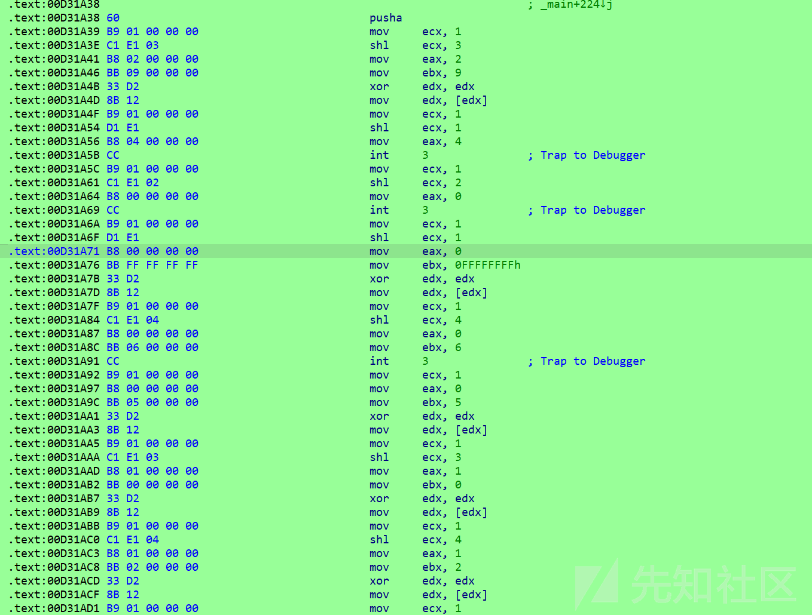](https://xzfile.aliyuncs.com/media/upload/picture/20231127214156-bb841f12-8d2a-1.png)

处理vm

```plain
ins=[
'mov','ecx','1',
'shl','ecx','3',
'mov','eax','2',
'mov','ebx','9',
'xor','edx','edx',
...
'mov','ecx','1',
'shl','ecx','1',
'mov','eax','9',
'mov','ebx','1',
'xor','edx','edx',
'mov','edx','[edx]',
'mov','ecx','1',
'shl','ecx','3',
'int','3',
'popa',
]
def ROL(i,index):
    tmp = bin(i)[2:].rjust(8, "0")
    for _ in range(index):
        tmp = tmp[1:] + tmp[0]
    return int(tmp, 2)

CONTEXT = {
    'eax' : 0,
    'ebx' : 0,
    'ecx' : 0,
    'edx' : 0
}
round = 0
eip = 0
while True:
    if(ins[eip] == 'mov'):
        if(ins[eip+2][0] =='['):
            if(CONTEXT['ecx'] == 1):
                print('sub_D33570('+str(CONTEXT['eax'])+', '+str(CONTEXT['ebx'])+');')
            elif(CONTEXT['ecx'] == 2):
                print('sub_D335B0('+str(CONTEXT['eax'])+', '+str(CONTEXT['ebx'])+');')
            elif(CONTEXT['ecx'] == 4):
                print('sub_D335E0('+str(CONTEXT['eax'])+', '+str(CONTEXT['ebx'])+');')
            elif(CONTEXT['ecx'] == 8):
                print('sub_D33610('+str(CONTEXT['eax'])+', '+str(CONTEXT['ebx'])+');')
            elif(CONTEXT['ecx'] == 16):
                print('sub_D33640('+str(CONTEXT['eax'])+', '+str(CONTEXT['ebx'])+');')
            elif(CONTEXT['ecx'] == 32):
                print('sub_D33680('+str(CONTEXT['eax'])+');')
        else:
            CONTEXT[ins[eip+1]] = int(ins[eip+2])
    elif(ins[eip] == 'shl'):
        CONTEXT[ins[eip+1]] = CONTEXT[ins[eip+1]] << int(ins[eip+2])
    elif(ins[eip] == 'xor'):
        CONTEXT[ins[eip+1]] = CONTEXT[ins[eip+1]] ^ CONTEXT[ins[eip+2]]
    elif(ins[eip] == 'int'):
            eip = eip -1
            if(CONTEXT['ecx'] == 1):
                print('sub_D336A0('+str(CONTEXT['eax'])+');')
            elif(CONTEXT['ecx'] == 2):
                print('sub_D336D0('+str(CONTEXT['eax'])+');')
            elif(CONTEXT['ecx'] == 4):
                print('sub_D33720('+str(CONTEXT['eax'])+');')
            elif(CONTEXT['ecx'] == 8):
                print('CorrectOutput();')
            elif(CONTEXT['ecx'] == 16):
                print('sub_D33800('+str(CONTEXT['eax'])+', '+str(CONTEXT['ebx'])+');')
            elif(CONTEXT['ecx'] == 32):
                print('WrongOutput();')
    elif(ins[eip] == 'popa'):
        eip = -3
        round = round + 1
        if(round == 19):break
    eip = eip + 3
```

得到结果

```plain
sub_D33610(2, 9);
sub_D336D0(4);
sub_D33720(0);
sub_D335B0(0, -1);
sub_D33800(0, 6);
sub_D33570(0, 5);
sub_D33610(1, 0);
sub_D33640(1, 2);
sub_D336A0(2);
sub_D335B0(4, -1);
sub_D33680(15);
sub_D33570(0, 6);
sub_D335B0(0, 1);
sub_D33610(1, 0);
sub_D33640(1, 2);

...
CorrectOutput();
```

执行流

```plain
sub_D33610(2, 9);
    sub_D336D0(4);
    sub_D33720(0);
    sub_D335B0(0, -1);
    sub_D33800(0, 6);
    sub_D33570(0, 5);
    sub_D33610(1, 0);
    sub_D33640(1, 2);
    sub_D336A0(2);
    sub_D335B0(4, -1);
    sub_D33680(15);
    sub_D33570(0, 6);
    sub_D335B0(0, 1);
    sub_D33610(1, 0);
    sub_D33640(1, 2);
    sub_D336A0(2);
    sub_D335B0(5, 1);
    sub_D33680(8);
    sub_D33570(0, 6);
    sub_D335B0(0, -1);
    sub_D33610(1, 0);
    sub_D33640(1, 2);
    sub_D336A0(2);
    sub_D335B0(4, 1);
    sub_D33680(1);
    WrongOutput();
    sub_D335B0(9, 1);
    CorrectOutput();
```

找到函数对应的指令

```plain
EXCEPTION_BREAKPOINT
case 1u:jnz(_eax);
case 2u:push(_eax);
case 4u:pop(_eax);
case 8u:_CorrectOutput();
case 0x10u:mul(_eax, _ebx);
case 0x20u:_WrongOutput();

EXCEPTION_ACCESS_VIOLATION
case 1u:add(_eax, _ebx);
case 2u:addn(_eax, _ebx);   //直接访存
case 4u:store(_eax, _ebx);
case 8u:load(_eax, _ebx);
case 0x10u:cmp(_eax, _ebx);
case 0x20u:jmp(_eax);
```

这样执行流的逻辑就是：依据tls函数里的设定走迷宫，从`byte_426B90`中读取数据并寻找这个数据，如果数据和迷宫的字节相同，则往那个方向走一步。如果没有就报错，如果走错了也报错。

所以找到`sub_401000`的数据，走迷宫即可

[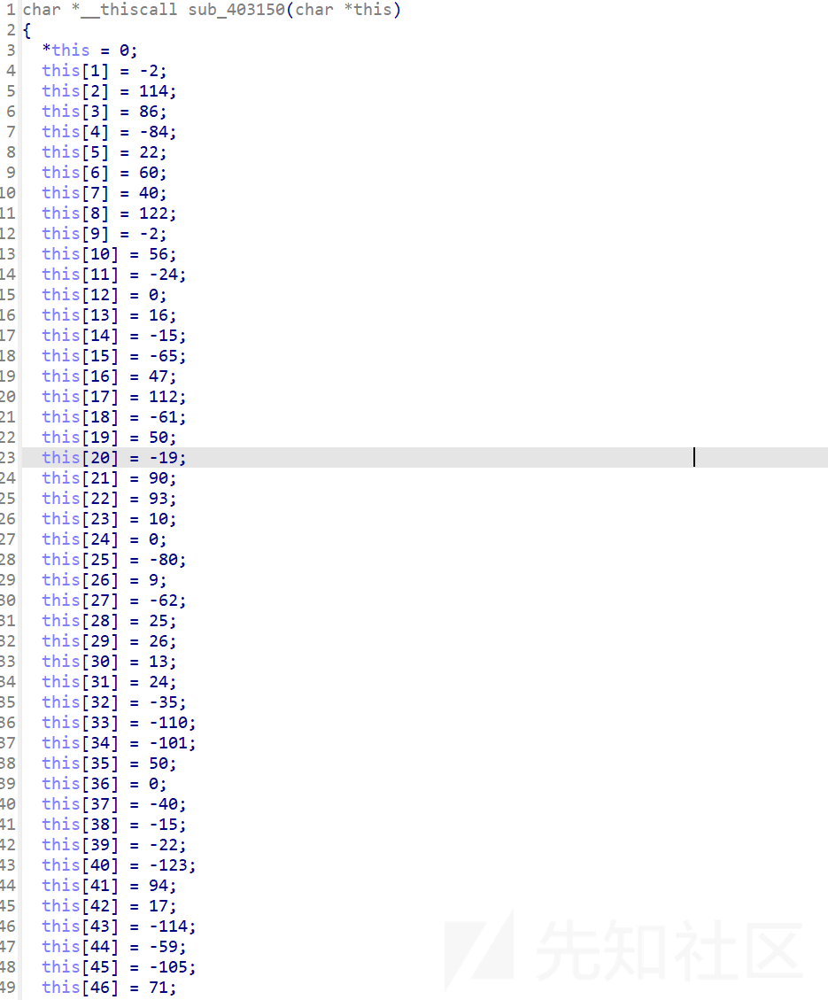](https://xzfile.aliyuncs.com/media/upload/picture/20231127214316-eaf0946a-8d2a-1.png)

[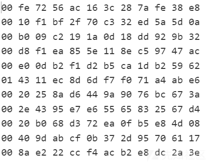](https://xzfile.aliyuncs.com/media/upload/picture/20231127214341-f9dbb810-8d2a-1.png)

从01开始，只走奇数的格子

HITCTF2022{4311254395e7d3cf0b372d95b58325674d6117}
