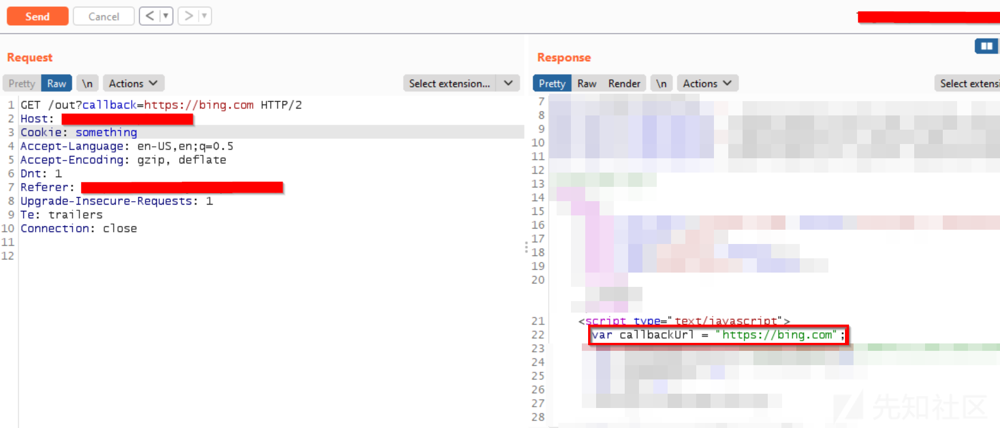
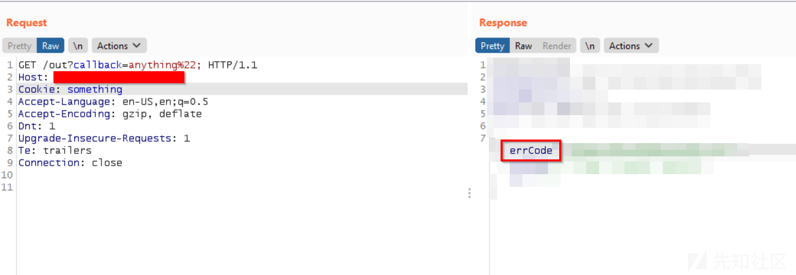
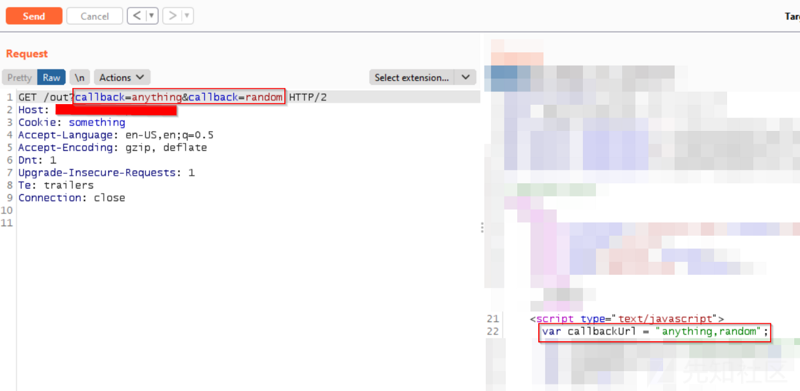
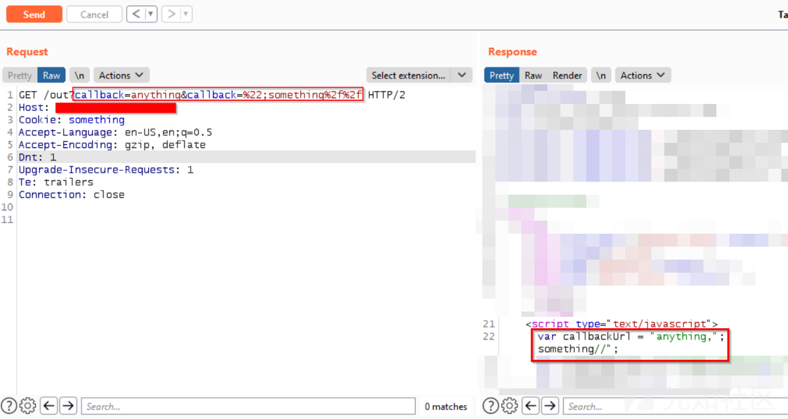
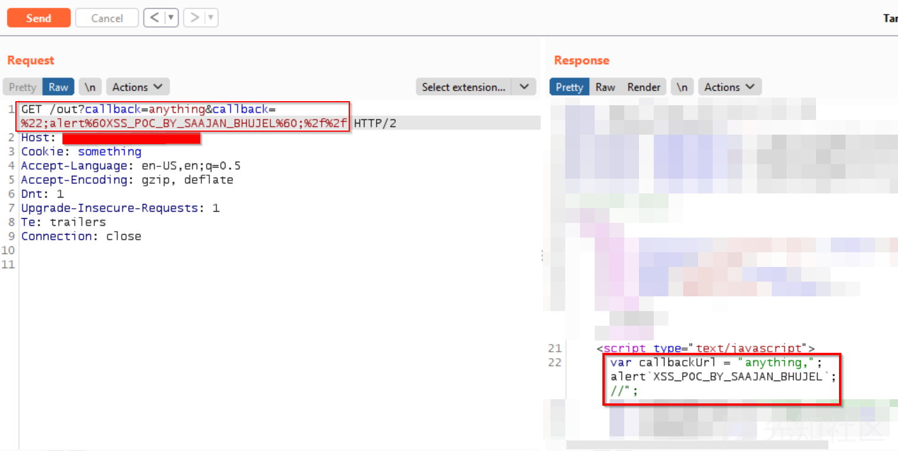
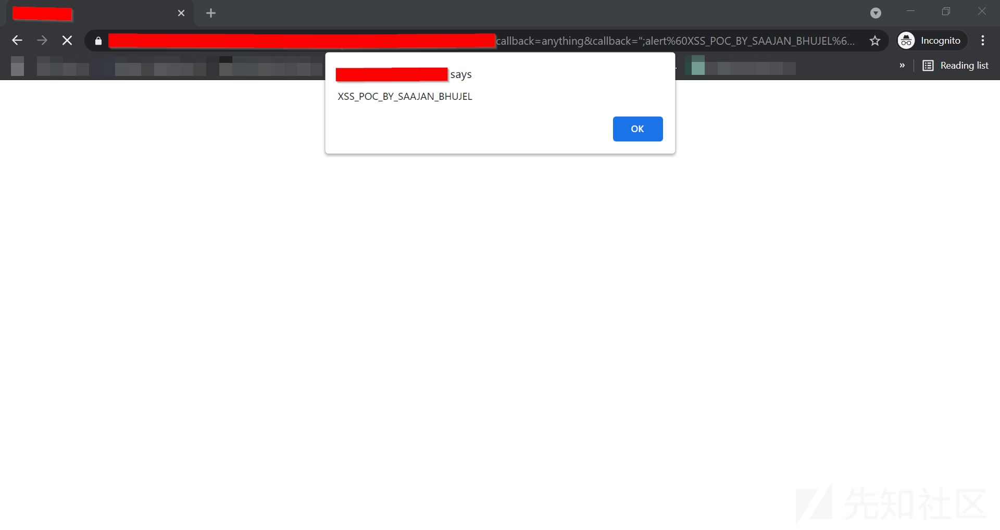

# 通过参数污染触发XSS - 先知社区

通过参数污染触发XSS

- - -

## **基础知识**

反射型XSS：恶意脚本来自当前HTTP请求。  
存储型XSS：恶意脚本来自网站的数据库。  
基于DOM的XSS：漏洞存在于客户端代码而不是服务器端代码中  
HTTP参数污染(HPP): HTTP参数污染会污染Web应用程序的HTTP参数，以执行或实现与Web应用程序预期行为不同的特定恶意任务/攻击。

## **漏洞发现**

在挖掘Hackerone和Bugcrowd众测平台上的网站漏洞时,我发现了一些诸如CSRF和业务逻辑缺陷之类的漏洞。但是，我的所有报告都是重复的。然后我决定寻找一些VDP程序的漏洞，经过2到3个小时的搜寻，我发现一个域名的URL使用回调参数将用户重定向到另一个域名,但是我无法透露目标的名称。因此，假设目标是site.com，而且URL看起来像这样：

```plain
https://site.com/out?callback=https://subdomain.site.com
```

这样如果我打开上面的链接它将重定向到subdomain.site.com

因此，在看到这种重定向之后，我尝试使用[https://bing.com](https://bing.com/) 更改回调参数的值。因为我想确认一下该网站在进行跳转的时候是否会进行任何形式的验证。如果网站在进行重定向时进行验证，仅允许跳转到site.com的子域，则该网站可能不容易受到Open Redirect的攻击，如果该网站未进行任何形式的验证，则该网站容易受到Open Redirect的攻击。在更改了回调参数的值之后,现在URL如下所示：

```plain
https://site.com/out?callback=https://bing.com
```

[](https://xzfile.aliyuncs.com/media/upload/picture/20210510164244-b08dccea-b16b-1.png)  
如果我打开上面的链接,它会重定向到bing.com。这意味着该网站未进行任何形式的验证，容易受到Open Redirect的攻击。但是，在Burpsuite中看到它的返回包之后我认为这也很容易受到跨站点脚本攻击，因为callback参数的值会反映到响应包中。

## **进阶阶段**

因为该值反映在script标签中，因此我尝试破坏代码。给变量callbackUrl简单地赋值％22，在发送此请求后，我收到一个错误，阻止了我的请求。我收到了同样的错误返回包在我发送其他值的时候，比如\[',"\]。  
[](https://xzfile.aliyuncs.com/media/upload/picture/20210510165134-ec7283f8-b16c-1.png)  
现在，我只有两个选择：  
第一种选择是将此问题报告为"打开重定向"。  
第二个选择是找到可以触发XSS的办法  
我记得几周前我观看了有关[HTTP参数污染](https://www.youtube.com/watch?v=QVZBl8yxVX0 "HTTP参数污染")的视频。因此，我决定看是否可以找到触发XSS的办法。因此我在URL中添加了另一个回调参数，以进行参数污染攻击。现在，URL如下所示：

```plain
https://site.com/out?callback=anything&callback=random
```

[](https://xzfile.aliyuncs.com/media/upload/picture/20210510165558-89dd9772-b16d-1.png)  
我注意到如果在URL中添加两个相同的参数。那么我将在响应中获得两个参数的值，并用逗号分隔。  
当我用值像\[',"\]的时候，我得到了一个错误返回包，阻止了我的请求。但是现在，我用两个相同的参数再次尝试破坏变量callbackUrl。我在第二个回调参数中添加了％22; something％2f％2f 。添加值后，现在URL如下所示

```plain
https://site.com/out?callback=anything&callback=%22;something%2f%2f
```

[](https://xzfile.aliyuncs.com/media/upload/picture/20210510165919-013cb7b2-b16e-1.png)  
并没有被拦截，这意味着网站没有对第二个回调参数进行任何验证。  
现在为了触发XSS，我在第二个回调参数中添加了％22; alert％281％29;％2f％2f 。现在的URL如下所示

```plain
https://site.com/out?callback=anything&callback=%22;alert%281%29;%2f%2f
```

[](https://xzfile.aliyuncs.com/media/upload/picture/20210510170133-51689aa8-b16e-1.png)  
绕过过滤器  
[](https://xzfile.aliyuncs.com/media/upload/picture/20210510170212-685e0126-b16e-1.png)  
现在我可以通过参数污染绕过过滤器限制触发XSS。而且就我而言我可以通过参数污染攻绕过过滤器对于某些值像\[',"\]的拦截

## **总结**

如果看到目标正在对参数进行某种验证检查，然后尝试添加一个或多个相同的参数，也许您可以绕过验证检查。

参考文章:  
[https://infosecwriteups.com/xss-through-parameter-pollution-9a55da150ab2](https://infosecwriteups.com/xss-through-parameter-pollution-9a55da150ab2)
