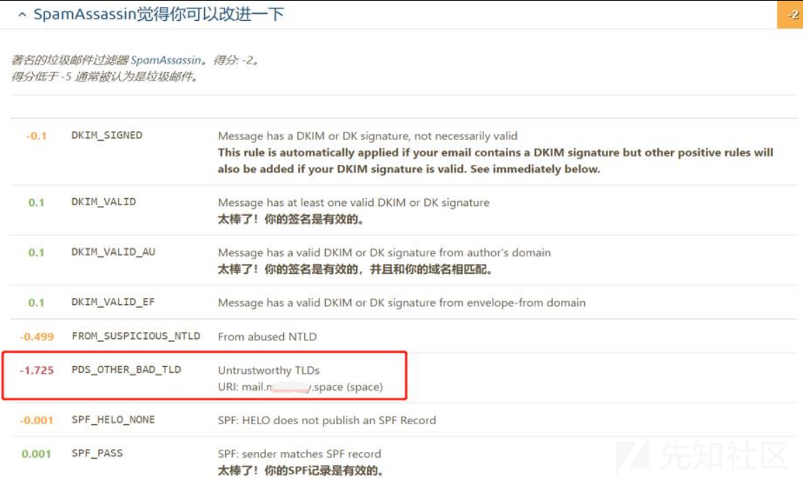
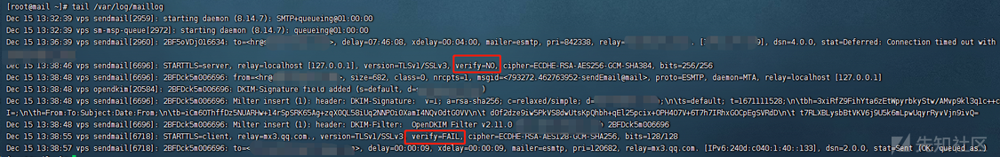
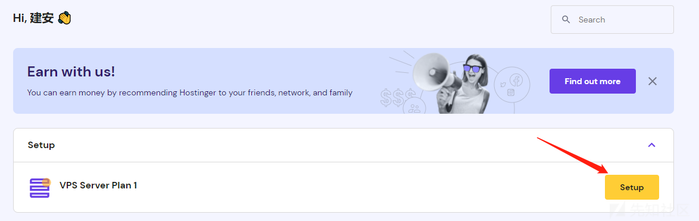

# 邮件可信其一邮件身份可信 - 先知社区

邮件可信其一邮件身份可信

- - -

# 前言

邮件钓鱼已经是老生常谈。不同的场景下当然有不一样的选择。在攻防演练中，我更加偏向于选择现有知名的邮件服务供应商，例如163、QQ等。因为是国内的演练，不会选择使用国外的邮件服务，更加别提臭名昭著的OutLook邮箱。在国内使用 163 可信度高，能让邮件的送达率高，但是往往在发送邮件的频率上有限制。  
在邮件钓鱼演练服务，针对企业大批量的钓鱼，我们可以选择自建邮件服务器。这样可以没有发件频率的限制，你可以伪造发件人，也可以改变发件人的IP，但有很多因素导致邮件信任度不高无法抵达对方的邮件，也有可能会被当做垃圾邮件处理。此篇文章讲述了一些提高邮件可信度的设置方法。  
其实邮件可信一方面是身份可信，一方面是内容可信。在身份可信上就有很多重校验，这一方面是需要我们第一步摆平的。这里涉及到IP地区、IP信任、IP网络可达；域名相似、域名信誉、域名购买时间；SPF/DKIM/DMARC/PTR身份认证；TLS/SSL证书、 S/MIME证书传输认证等。内容可信可以涉及到发件人名称、地址；邮件内容；邮件附件等。

# 前提条件选择

前提条件选的好，那就成功一半了。

## 邮件服务的选择

搭建邮件服务已经非常常见了，然而在选择邮件服务上还存在一些选项。  
我接触过 sendmail 、Ewoemail、iRedMail 其他的暂未了解，其中 sendmail 只提供了邮件服务没有可视化管理的界面。但好在小巧，安装方便，自定义程度高。Ewoemail和iRedMail，都有后台和用户邮件管理系统，体积大，可以省去很多功夫。这里我使用 sendmail 达到我们的目的。  
也可以选择使用 iRedMail 安装，它的配置教程：[https://v2rayssr.com/iredmail.html#%E5%87%86%E5%A4%87%E5%B7%A5%E5%85%B7](https://v2rayssr.com/iredmail.html#%E5%87%86%E5%A4%87%E5%B7%A5%E5%85%B7)

## VPS的选择

为了更好的搭建邮件服务，增加可信度，我们需要有一台满足以下条件的VPS：

-   25 端口开放且没有VPS提供商监管
-   可以设置 PTR Records
-   内存大于 1 GB

在国内，VPS提供商有的限制25端口，有的禁止25端口，大多都不允许自建提供于公网的邮件服务器；PTR 的设置需要VPS提供商设置，有的需要付费，有的禁止。这里我选择了国外的VPS提供商 hostinger，也是国内多少从业外贸商的选择。当然也可以从众选择搬瓦工，也可以选择小众或个人提供的VPS。尽管选择很多，但需要**注意IP的信誉度。**

## 域名提供商和域名的选择

全球有数不清的域名提供商，其中比较出名的是 Godaddy、Enom、TuCows。国内的域名注册用 Whois 查询可能可以获取到注册人的信息，但使用 Godaddy 可以不用担心这个。  
域名的选择可以参考这个 [https://www.maigoo.com/top/428603.html](https://www.maigoo.com/top/428603.html)。其中 .com 、.cn、.us比较常见，这些TLDs 顶级域名可信度较高。如果你选择使用类似于 .space 的域名，会碰到这种情况。

[](https://xzfile.aliyuncs.com/media/upload/picture/20221224200206-c9423f92-8382-1.png)

# 设置身份验证

通过身份验证的邮件：

-   有助于为收件人防范钓鱼式攻击邮件等恶意电子邮件。
-   不容易被 Gmail 拒收或标记为垃圾邮件。

邮件必须通过 SPF 或 DKIM 检查，才能通过身份验证。要通过 DMARC 检查，邮件必须先通过 SPF 或 DKIM 身份验证，而且身份验证网域必须与邮件的 From: 标头中的网域相同。

[](https://xzfile.aliyuncs.com/media/upload/picture/20221224200258-e8880760-8382-1.png)

## 邮件可信度测试地址

[https://www.mail-tester.com/](https://www.mail-tester.com/)  
一天只能免费测试三封邮件，注意把控次数。  
设置域名：mydomain.com  
**文中的这个域名请你自行替换成自己的域名。**  
根据以下内容设置完后邮件可信度测试如下所示，其中扣分的地方是我购买的域名还没超过28天。

[](https://xzfile.aliyuncs.com/media/upload/picture/20221224200329-faea04d0-8382-1.png)

还有一种被动检查方式  
[https://en.internet.nl/test-mail/](https://en.internet.nl/test-mail/)

[](https://xzfile.aliyuncs.com/media/upload/picture/20221224200351-07a03b5e-8383-1.png)

关于DANE设置可以看这篇 [https://blog.apnic.net/2019/11/20/better-mail-security-with-dane-for-smtp/](https://blog.apnic.net/2019/11/20/better-mail-security-with-dane-for-smtp/)

> 了解更多请看 [https://support.google.com/a/answer/81126?hl=zh-Hans](https://support.google.com/a/answer/81126?hl=zh-Hans)

## 设置 SPF 记录

SPF 记录是为了防止垃圾邮件而设定的，告知收件方，从设置的允许列表中发出的邮件都是合法的，设置方式为添加一条根域名的 TXT 解析记录  
内容为 `v=spf1 mx ~all`  
检测方式：`nslookup -type=txt mydomain.com`

[](https://xzfile.aliyuncs.com/media/upload/picture/20221224200442-2672aeae-8383-1.png)

上面的 `~all` 前缀代表软拒绝，对接收方来说，遇到有软拒绝的域名没有通过SPF校验，通常采取的策略是放行或者标记为垃圾邮件。

设置完成后可以使用这个地址来测试你的SPF。[https://www.kitterman.com/spf/validate.html](https://www.kitterman.com/spf/validate.html)

> 了解更多SPF相关内容可以参考：[https://github.com/internetstandards/toolbox-wiki/blob/main/SPF-how-to.md](https://github.com/internetstandards/toolbox-wiki/blob/main/SPF-how-to.md)  
> 了解如何绕过SPF：[https://www.freebuf.com/articles/system/238215.html](https://www.freebuf.com/articles/system/238215.html)

## 设置 A 记录

将 `mail.mydomain.com` 的 A 记录指向你的 VPS 服务器（邮件服务器）IPv4地址  
检测方式：`nslookup mail.mydomain.com`

[](https://xzfile.aliyuncs.com/media/upload/picture/20221224200623-62909a18-8383-1.png)

## 设置 AAAA 记录

将 `mail.mydomain.com` 的 AAAA 记录指向你的 VPS 服务器（邮件服务器）IPv6地址  
检测方式：`nslookup mail.mydomain.com`

[](https://xzfile.aliyuncs.com/media/upload/picture/20221224200648-71b0f286-8383-1.png)

## 设置 MX 记录

MX 记录就是邮件的解析记录，非常重要的一条记录，配置根域名的 MX 记录为自己的邮件域名地址，优先级为 10  
检测方式：`nslookup -type=mx mydomain.com`

[](https://xzfile.aliyuncs.com/media/upload/picture/20221224200721-8542867a-8383-1.png)

## 设置 DMARC 记录

DMARC 记录是当收件方检测到伪造邮件等行为时，将根据您的配置进行操作的一个记录，比如拒绝邮件或放入垃圾邮件以及不做处理等，同时会反馈一份检测报告到配置的邮箱地址内。  
添加方法就是增加一条 \_dmarc 的 TXT 解析，内容为配置选项，`v=DMARC1; p=none; pct=100; rua=mailto:dmarc@mydomain.com`  
检测方式：`nslookup -type=txt _dmarc.mydomain.com`

[](https://xzfile.aliyuncs.com/media/upload/picture/20221224200845-b74faf62-8383-1.png)

在检测中可能会遇到 DMARC 政策不够严格，我们可以设置成 `p=quarantine` 或者 `p=reject`，分别是隔离和拒绝政策，我们可以直接设置成 `v=DMARC1; p=reject; pct=100; rua=mailto:dmarc@mydomain.com`

> 了解更多关于DMARC相关知识参考：[https://github.com/internetstandards/toolbox-wiki/blob/main/DMARC-how-to.md](https://github.com/internetstandards/toolbox-wiki/blob/main/DMARC-how-to.md)

## 启用并设置 DNSSEC

域名系统安全扩展（DNS Security Extensions，简称DNSSEC）是用于确定源域名可靠性的数字签名 ，通过在域名中添加DNSSEC记录，可以增强对DNS域名服务器的身份认证，有效防止DNS缓存污染等攻击。本文为您介绍如何在阿里云域名服务控制台上添加及同步DNSSEC记录。

> 阿里云域名用户可以看这篇 [https://help.aliyun.com/document\_detail/101717.html](https://help.aliyun.com/document_detail/101717.html)

这里我使用的是 CF，到域名管理控制台左侧栏找到 DNS 中的 Settings，进入 DNS 设置页面启用 DNSSEC。

[](https://xzfile.aliyuncs.com/media/upload/picture/20221224200856-bdde0270-8383-1.png)

开启后会给出几个值。

[](https://xzfile.aliyuncs.com/media/upload/picture/20221224200903-c1ce0268-8383-1.png)

到你的域名注册商设置 DS 记录，我的域名注册商是Godaddy 到域名DNS设置处找到 DNSSEC。

> 官方教程 [https://sg.godaddy.com/help/enable-dnssec-on-my-domain-6420](https://sg.godaddy.com/help/enable-dnssec-on-my-domain-6420)

[](https://xzfile.aliyuncs.com/media/upload/picture/20221224200916-c9e17426-8383-1.png)

其中的 Key tag、Algorithm、Digest Type、Digest按照提供的数据填写后点击 Update 即可。

[](https://xzfile.aliyuncs.com/media/upload/picture/20221224200926-cf9c50a2-8383-1.png)

## 设置 DKIM 记录 【重点】

DKIM 可说是避免被判定为垃圾邮件的一大利器，DKIM 属于一种类似加密签名的解析记录，只有包含此加密数据，且公钥与密钥相匹配才属于合法邮件，要设置 DKIM 记录，首先要查询 DKIM 信息。

> 了解更多DKIM相关知识可以参考：[https://github.com/internetstandards/toolbox-wiki/blob/main/DKIM-how-to.md](https://github.com/internetstandards/toolbox-wiki/blob/main/DKIM-how-to.md)

### Amavisd 查询

如果你的邮件服务器使用的是类似 EwoMail 或者 iRedMail 等大型邮件服务器就可以使用这个方法。  
查询 DKIM 可以使用系统命令  
`amavisd showkeys` OR  
`amavisd -c /etc/amavisd/amavisd.conf showkeys`  
如果不存在 amavisd 可以使用命令安装 `yum --enablerepo=rpmforge,rpmforge-extras install amavisd-new -y`

### OpenDKIM 签名 【比较繁琐】

> 文中这节如果有一些描述没有读懂可以看这篇参考文章[https://meumobi.github.io/sendmail/2015/09/18/install-configure-dkim-sendmail-debian.html](https://meumobi.github.io/sendmail/2015/09/18/install-configure-dkim-sendmail-debian.html)

sendmail 的配置文件

-   /etc/mail/sendmail.cf 主配置文件
-   /etc/mail/sendmail.mc 模板文件
-   /etc/mail/access 完成中继转发功能,即加入允许访问的域名
-   /etc/aliases 该文件包含 sendmail 程序所用到的别名数据库的文本形式。
-   /etc/mail/local-host-names 本地主机名和域名的列表决定收到的邮件是本地邮件，还是远程邮件，然后决定是地投送还是转发。
-   /etc/mail/sendmail.cw 当一个主机有多个域名时，在此加入这些域名
-   /var/spool/mqueue 邮件队列临时存放的目录
-   /var/mail 存放所有收到的邮件
-   /var/log/maillog 日志文件  
    \#### 1、设置主机名  
    如果以及设置过可以跳过这一步。  
    `vim /etc/hosts`在hosts 文件添加一段
    
    ```plain
    127.0.0.1 mail.mydomain.com mail
    ```
    
    这里的 127.0.0.1 替换成你的 VPS IP。  
    `echo mail > /etc/hostname` 修改你的 hostname  
    验证 `hostname -f` 即可看到 `mail.mydomain.com`，而不加选项则是短名称，如果你的不是这样可以使用 `sudo hostname mail` 强制修改。

[](https://xzfile.aliyuncs.com/media/upload/picture/20221224200955-e0a50ac4-8383-1.png)

#### 2、安装服务

我使用的是 sendmail 作为我的邮件服务器，并安装 OpenDKIM 。安装命令如下。

```plain
yum install sendmail sendmail-cf mailutils sharutils opendkim opendkim-tools -y
```

为您的密钥创建新目录

```plain
mkdir -p /etc/opendkim/keys/mydomain.com
```

#### 3、生成签名密钥并配置opendkim

上面的命令将在新创建的目录下创建两个文件 default.private 和 default.txt 如果您对创建密钥时可用的其他选项感兴趣，可以执行 `man opendkim-genkey`查看更多选项。在此示例中，我使用了 -D（目录）选项、-d（域）选项和 -s（选择器）选项。  
请留意这里的 -s 选项，这里可以默认为 default 你可以选择自定义任意字符。

```plain
opendkim-genkey -D /etc/opendkim/keys/mydomain.com -d mydomain.com -s default
```

将所有权更改为 opendkim **这一步是必须的，不然opendkim没有权限访问 /etc/opendkim/keys/mydomain.com 文件夹，导致无法正常对邮件进行签名。**

```plain
chown -R opendkim:opendkim /etc/opendkim/keys/mydomain.com
chmod 640 /etc/opendkim/keys/mydomain.com/default.private
chmod 644 /etc/opendkim/keys/mydomain.com/default.txt
```

`vim /etc/opendkim.conf` 配置 OpenDKIM，这是我配置的文件。请对照着修改。

```plain
PidFile /var/run/opendkim/opendkim.pid

Mode    sv

Syslog  yes

SyslogSuccess   yes

LogWhy  yes

UserID  opendkim:opendkim

Socket  inet:8891@localhost

Umask   002

SendReports yes

SoftwareHeader  yes

Canonicalization    relaxed/simple

Domain  mydomain.com

Selector    default

MinimumKeyBits  1024

KeyFile /etc/opendkim/keys/mydomain.com/default.private

KeyTable    refile:/etc/opendkim/KeyTable

SigningTable    refile:/etc/opendkim/SigningTable

ExternalIgnoreList  refile:/etc/opendkim/TrustedHosts

InternalHosts   refile:/etc/opendkim/TrustedHosts

OversignHeaders From

AutoRestart             Yes
AutoRestartRate         10/1h
SignatureAlgorithm      rsa-sha256
```

`vim /etc/opendkim/KeyTable`在该文件添加下面一行。

```plain
default._domainkey.mydomain.com mydomain.com:default:/etc/opendkim/keys/mydomain.com/default.private
```

`vim /etc/opendkim/SigningTable`在该文件添加下面一行。

```plain
*@mydomain.com default._domainkey.mydomain.com
```

`vim /etc/opendkim/TrustedHosts`在该文件添加下面一行。

```plain
127.0.0.1
localhost
mydomain.com
```

也可以直接用这个命令设置，但同样的你需要替换其中的 mydomain.com

```plain
echo 'default._domainkey.mydomain.com mydomain.com:default:/etc/opendkim/keys/mydomain.com/default.private' >> /etc/opendkim/KeyTable
echo '*@mydomain.com default._domainkey.mydomain.com' >> /etc/opendkim/SigningTable
echo 'mydomain.com' >> /etc/opendkim/TrustedHosts
```

#### 4、配置 sendmail

设置 sendmail 每一封邮件都要经过 OpenDKIM 签名  
`vim /etc/mail/sendmail.mc` 在该文件添加下面一行。

```plain
INPUT_MAIL_FILTER(`opendkim', `S=inet:8891@127.0.0.1')
```

> 其他的 sendmail 配置可以参考这篇 [https://max.book118.com/html/2021/1018/8040072020004022.shtm](https://max.book118.com/html/2021/1018/8040072020004022.shtm)

`m4 /etc/mail/sendmail.mc > /etc/mail/sendmail.cf` 使用 m4 生成Sendmail的配置文件。  
启动需要的服务并查看他们的状态

```plain
systemctl restart sendmail saslauthd opendkim
systemctl status sendmail saslauthd opendkim
```

#### 5、添加 DNS 记录

这个是必须的，上面的配置是在每封邮件发出时进行签名，而这个 DNS 记录就是用来验证邮件里的 DKIM 签名的。其中我们需要注意的是这条 TXT 记录的 Name。  
它的构成是 Select.\_domainkey。这里的 Select 其实就是上面第2小节里生成签名密钥命令里的 `-s default`  
所以这里我们的命名为 default.\_domainkey。而内容可以通过 `cat /etc/opendkim/keys/mydomain.com/default.txt`命令获取。

[](https://xzfile.aliyuncs.com/media/upload/picture/20221224201010-ea125b2a-8383-1.png)

> 想进一步了解 DKIM 可以参考这篇 [https://www.konghaidashi.com/post/4376.html](https://www.konghaidashi.com/post/4376.html)

#### 6、发送测试

选择使用 sendEmail 服务进行邮件发送测试，注意不要和 sendmail 服务搞混。  
`yum install sendEmail -y` 安装服务，使用下面的命令进行测试。

```plain
sendEmail -f test@mydomain.com -t receiver@mail.com -u TestSendEmail -m Hi -s 127.0.0.1
```

使用说明：

```plain
-f 表示发送者的邮箱
-t 表示接收者的邮箱
-cc 表示抄送发给谁
-bcc 表示暗抄送给谁
-o message-content-type=html   邮件内容的格式,html表示它是html格式
-o message-charset=utf8        邮件内容编码
-s 表示SMTP服务器的域名或者ip
-u 表示邮件的主题
-xu 表示SMTP验证的用户名
-xp 表示SMTP验证的密码(注意,这个密码貌似有限制,例如我用d!5neyland就不能被正确识别)
-m 邮件的内容
-a 要发送的附件
```

使用样例：

```plain
$ sendEmail -f sender@mail.com \
            -t receiver@mail.com \
            -cc receiver_cc@mail.com \
            -bcc receiver_bcc@mail.com \
            -o message-content-type=html \
            -o message-charset=utf8 \
            -s mailserver.com \
            -u TestSendEmail \
            -xu sender \
            -xp xxxxxx \
            -m 邮件的内容：测试命令行发送邮件 \
            -a 附件
```

之后在邮件的头部就会包含 DKIM 标识了。

[](https://xzfile.aliyuncs.com/media/upload/picture/20221224201023-f19ea984-8383-1.png)

## 申请并设置 TLS/SSL 证书

> 有关邮件加密的相关描述 [https://support.google.com/mail/answer/6330403?visit\_id=638066867880173220-2329511212&p=tls&hl=zh-Hans&rd=1](https://support.google.com/mail/answer/6330403?visit_id=638066867880173220-2329511212&p=tls&hl=zh-Hans&rd=1)

加密邮件的方式有 S/MIME 增强型加密 和 TLS/SSL - 标准加密 两种，因为 S/MIME 比较繁琐，我们选择使用 TLS，即使用 TLS/SSL 自签证书加密。

### Acme 脚本申请证书

Acme 脚本申请证书，是我们用到的最常见的一种证书的申请方式，它有很多的申请方法，大家只需要找到一种适合自己的也就好了。  
安装 Acme 脚本  
`curl https://get.acme.sh | sh`

> 2021 年 6 月 17 日更新：从 acme.sh v 3.0.0 开始，acme.sh 使用 Zerossl 作为默认 ca，您必须先注册帐户（一次），然后才能颁发新证书。

`~/.acme.sh/acme.sh --register-account -m ca@mydomain.com`  
其中 ca@mydomain.com，ca 可以任意变更。

#### （1）两种方式申请验证

国内腾讯云的VPS，类似于 80、443、8080、8443 等WEB应用常用端口的使用都是需要备案的。然而很不幸的是，我们如果使用Web 验证申请证书，我们就需要使用 80 端口。如果你是使用的腾讯云的VPS，可以直接看第二种证书申请方式。

##### Web 验证申请证书

这种方式，需要开放 80 端口，并保持不被占用的状态，这种方式不支持泛域名。  
申请SSL证书时，需要先进行验证，确保你是该域名的所有者。以下有三种方式，可以按照自己的情况来继续进行验证申请。

###### 80 端口空闲的验证申请

如果你还没有运行任何 web 服务, 80 端口是空闲的, 那么 Acme.sh 还能假装自己是一个 WebServer, 临时监听在 80 端口，完成验证。这里需要安装 socat 来完成伪装。

```plain
yum install socat -y
~/.acme.sh/acme.sh  --issue -d mydomain.com -d mail.mydomain.com   --standalone
```

###### Nginx 的方式验证申请

这种方式需要你的服务器上面已经部署了 Nginx 环境，并且保证你申请的域名已经在 Nginx 进行了 conf 部署。（被申请的域名可以正常被打开）

```plain
~/.acme.sh/acme.sh --issue  -d mydomain.com -d mail.mydomain.com   --nginx
```

###### http 的方式验证申请

这种方式需要你的服务器上面已经部署了网站环境。（被申请的域名可以正常被打开）  
原理：Acme 自动在你的网站根目录下放置一个文件, （这个文件可以被互联网访问）来验证你的域名所有权,完成验证. 然后就可以生成证书了。  
实例代码：（后面的路径请更改为你的 网站根目录 绝对路径 ）

```plain
~/.acme.sh/acme.sh  --issue  -d mydomain.com -d mail.mydomain.com  --webroot  /home/wwwroot/mydomain.com/
```

##### DNS 验证申请证书 【推荐】

这种方式的好处是, 你不需要任何服务器， 不需要任何公网 ip， 只需要 dns 的解析记录即可完成验证。坏处是，如果不同时配置 Automatic DNS API，使用这种方式 acme.sh 将无法自动更新证书，每次都需要手动再次重新解析验证域名所有权。  
Acme.sh 目前支持 cloudflare, dnspod, cloudxns, godaddy 以及 ovh 等数十种解析商。该方式可以申请多域名、泛域名证书，达到很多域名可以共用一张证书的目的。

###### 为域名更换 cloudflare 域名服务器

这里我们使用常见的 cloudflare 来申请。  
首先进入到 cloudflare 控制台添加你的域名。[https://dash.cloudflare.com/](https://dash.cloudflare.com/)

[](https://xzfile.aliyuncs.com/media/upload/picture/20221224201113-0f6760b4-8384-1.png)

填入你的域名然后点击添加。

[](https://xzfile.aliyuncs.com/media/upload/picture/20221224201120-134f04c0-8384-1.png)

然后到你的域名商控制台，将域名服务器更换成 cloudflare 提供的域名服务器。

[](https://xzfile.aliyuncs.com/media/upload/picture/20221224201126-17672e8e-8384-1.png)

差不多过半个钟或者一个钟就能解析了。**需要注意，更换域名服务器未生效期间无法进行DNS验证SSL证书申请。**  
在等待期间我们可以先设置API Keys。先到 [https://dash.cloudflare.com/profile/api-tokens](https://dash.cloudflare.com/profile/api-tokens)

[](https://xzfile.aliyuncs.com/media/upload/picture/20221224201134-1c13a390-8384-1.png)

```plain
export CF_Key="你的Global API Key"
export CF_Email="你注册CF账号用的邮箱"
```

设置完之后就可以申请证书了。

```plain
~/.acme.sh/acme.sh --issue --dns dns_cf -d mydomain.com -d *.mydomain.com
```

#### （2）更新证书

如果中间没有故障，最终可以申请到SSL证书，如图所示，生成了很多的文件。

[](https://xzfile.aliyuncs.com/media/upload/picture/20221224201150-25b512f8-8384-1.png)

禁止直接使用 ACME 目录下面的证书文件，因此我们需要复制到自己的文件夹内。

```plain
mkdir /etc/mail/certs
cp /root/.acme.sh/mydomain.com/* /etc/mail/certs/
~/.acme.sh/acme.sh --installcert -d mydomain.com --key-file /etc/mail/certs/mydomain.com.key --fullchain-file /etc/mail/certs/fullchain.cer
~/.acme.sh/acme.sh --upgrade --auto-upgrade
chmod -R 700 /etc/mail/certs
cd /etc/mail/certs
for i in `ls | grep '.cer'`;do mv $i `echo $i | sed 's/\.[^.]*$//'`.pem;done;
wget http://www.cacert.org/revoke.crl
```

> 为了解决 STARTTLS: CRLFile missing 问题，这里我下载了 revoke.crl 文件。参考[http://www.linuxweblog.com/blogs/sandip/20071019/starttls-crlfile-missing-resolved](http://www.linuxweblog.com/blogs/sandip/20071019/starttls-crlfile-missing-resolved)

我们需要从 OpenSSL 那里获取到 `ca-bundle.crt` 文件。

> 里面标注了常见目录 [http://gagravarr.org/writing/openssl-certs/others.shtml#selfsigned-openssl](http://gagravarr.org/writing/openssl-certs/others.shtml#selfsigned-openssl)

我们可以直接通过 `openssl version -d` 找到 SSL 文件存放目录

[](https://xzfile.aliyuncs.com/media/upload/picture/20221224201730-efe43982-8384-1.png)

而`ca-bundle.crt` 文件一般放置于 certs 目录下

```plain
cp /etc/pki/tls/certs/ca-bundle.crt /etc/mail/certs/ca-bundle.crt
echo /etc/mail/certs/fullchain.pem >> /etc/mail/certs/ca-bundle.crt
ln -sf ca-bundle.crt `openssl x509 -hash -noout < ca-bundle.crt`.0
vim ca-bundle.crt
```

将 `fullchain.pem`追加到 `ca-bundle.crt`，需要注意不能直接复制保存，而是在每一个证书开头加一个换行。

[](https://xzfile.aliyuncs.com/media/upload/picture/20221224201823-0f82f4a4-8385-1.png)

`vim /etc/mail/sendmail.mc`对照下面修改项进行修改

```plain
dnl define(`confLOG_LEVEL', `20')dnl

define(`CERT_DIR', `/etc/mail/certs')dnl
define(`confSERVER_CERT', `CERT_DIR/fullchain.pem')dnl
define(`confSERVER_KEY', `CERT_DIR/mydomain.com.key')dnl
define(`confCLIENT_CERT', `CERT_DIR/fullchain.pem')dnl
define(`confCLIENT_KEY', `CERT_DIR/mydomain.com.key')dnl
define(`confCACERT_PATH', `CERT_DIR')dnl
define(`confCACERT', `CERT_DIR/ca-bundle.crt')dnl
define(`confCRL', `CERT_DIR/revoke.crl')
```

使用 m4 生成Sendmail的配置文件并重启 sendmail 服务。

```plain
m4 /etc/mail/sendmail.mc > /etc/mail/sendmail.cf
systemctl restart sendmail
systemctl status sendmail
```

通过发送邮件查看日志测试 SSL 验证。

```plain
sendmail recipient@mail.com
From: root@mydomain.com
To: recipient@mail.com
HI
.
```

[](https://xzfile.aliyuncs.com/media/upload/picture/20221224201834-162d3d64-8385-1.png)

注意最后的 `.`

```plain
tail -20 /var/log/maillog
```

看到接收方邮件服务器验证 `verify=OK` 即可。

[](https://xzfile.aliyuncs.com/media/upload/picture/20221224201841-1aae856e-8385-1.png)

如果是 `verify=FAIL`可以根据 `verifymsg`来判断问题。

[](https://xzfile.aliyuncs.com/media/upload/picture/20221224201848-1ecf7928-8385-1.png)

### FreeSSL 申请证书

这种方式申请证书，比较简单，而且还可以申请到为期一年的 “亚洲诚信” 的证书，但是，目前此网站申请证书需要进行手机验证，这里不演示。

## 设置 PTR 反向解析 【重点】

反向域名解析纪录(RDNS)就是和正向的DNS解析相反的一种反向解析，正向DNS解析把域名解析成IP地址，RDNS恰恰相反，就是反过来把 IP 解析成域名。反向域名格式如：X.X.X.in-addr.arpa。可逆 DNS(RDNS)的原理和 DNS 解析是完全相同的。

> 这里详细介绍了 PTR 拦截垃圾邮件是如何运作的。[https://www.800188.com/index.php/home/reference-news/86-technology/2044-rdns-3?tmpl=component&print=1](https://www.800188.com/index.php/home/reference-news/86-technology/2044-rdns-3?tmpl=component&print=1)

国内的VPS我不清楚有哪些可以设置 PTR，像腾讯云如果需要设置 PTR 是需要付费的，如果你使用的是腾讯云可以看官方的说明。[https://cloud.tencent.com/document/product/302/79828](https://cloud.tencent.com/document/product/302/79828)  
为了能够免费设置 PTR 我特地从 hostinger 供应商购买了VPS。

> 这个 hostinger 供应商提供的最优惠价格都是购买4年的，如果你购买一个月那价格可能会是个灾难。

购买后到 [https://hpanel.hostinger.com/](https://hpanel.hostinger.com/) 开始设置你的服务器。

[](https://xzfile.aliyuncs.com/media/upload/picture/20221224201900-25dfb0de-8385-1.png)

在 《2021中国企业邮箱安全性研究报告》中提到一段话：“在所有钓鱼邮件中，来自美国的钓鱼邮件最多，占国内企业用户收到的钓鱼邮件的41.0%；其次是中国，约占11.7%；新加坡排名第三，约占5.3%。”新加坡有垃圾邮件法，而美国监管不够严格。这里选择美国。

[](https://xzfile.aliyuncs.com/media/upload/picture/20221224201911-2c35a48e-8385-1.png)

后面选择 Centos 7 系统镜像，在设置机器名字时，我们可以写 mail.mydomain.com，就可以跳过设置 VPS 主机名。创建完成后按照官方说明设置 PTR [https://support.hostinger.com/en/articles/4805528-how-to-use-ptr-at-vps](https://support.hostinger.com/en/articles/4805528-how-to-use-ptr-at-vps)，IPv6的也设置上。

[](https://xzfile.aliyuncs.com/media/upload/picture/20221224201919-3133c5a6-8385-1.png)

在设置解析的域名，我们**需要填写 mail.mydomain.com 而不是 mydomain.com。**  
检测方式：`nslookup VPSIP`

# 此篇结语

通过机器对垃圾邮件进行区分，区分的规则需要我们了解。这有很多校验项，我们不需要费尽心思将每条校验项做好。但如果不按照规则来，很有可能没法进入对方的邮箱或者当成垃圾邮件。邮件可信除了邮件身份可信校验之外，还有针对邮件内容进行的可信校验，这个涉及的内容太多，不同场景不同话术，不仅要绕过机器还要绕过人心。
