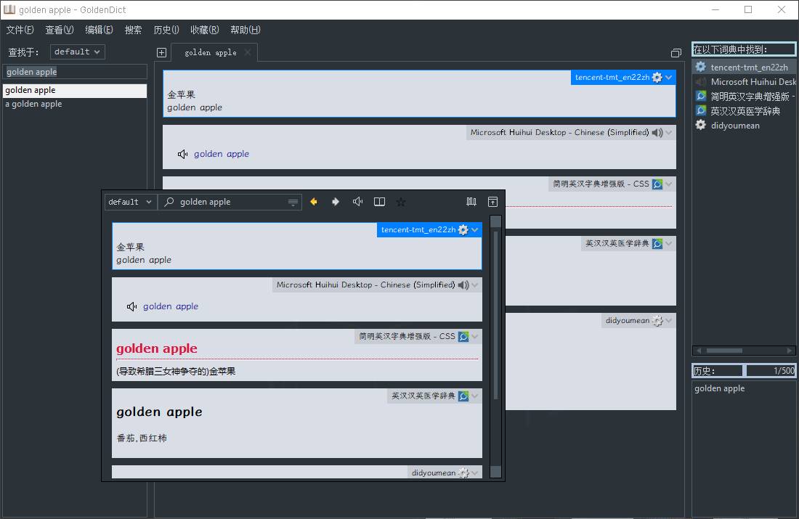
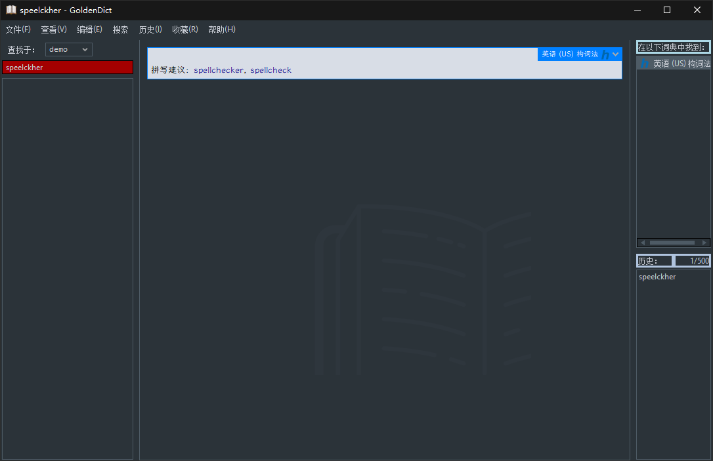
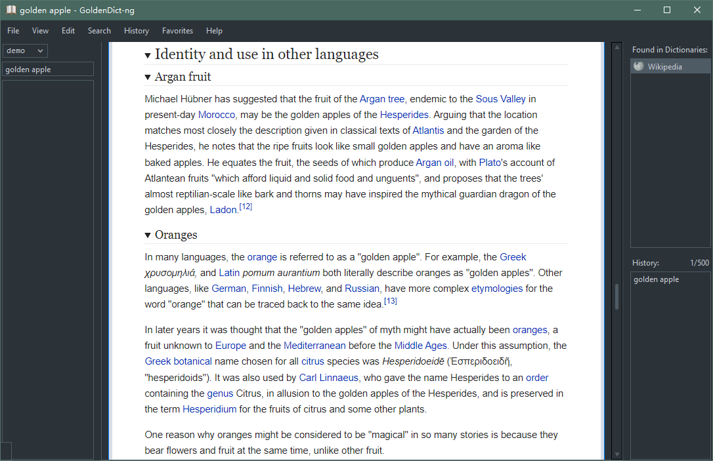
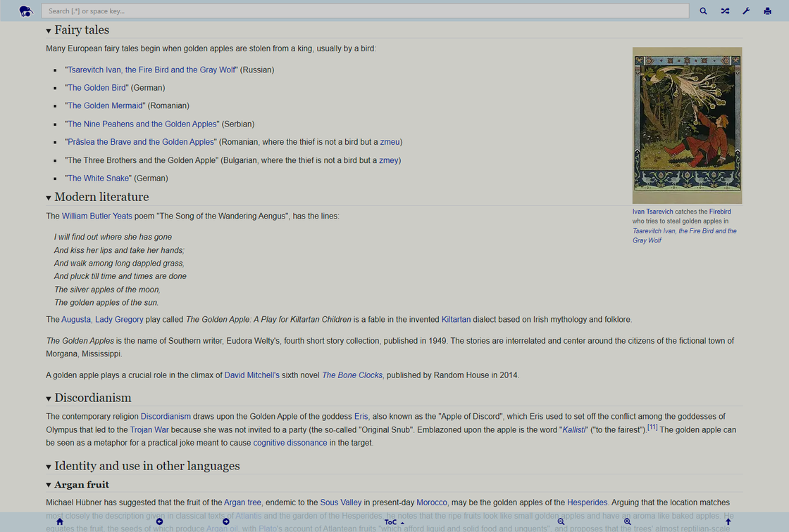
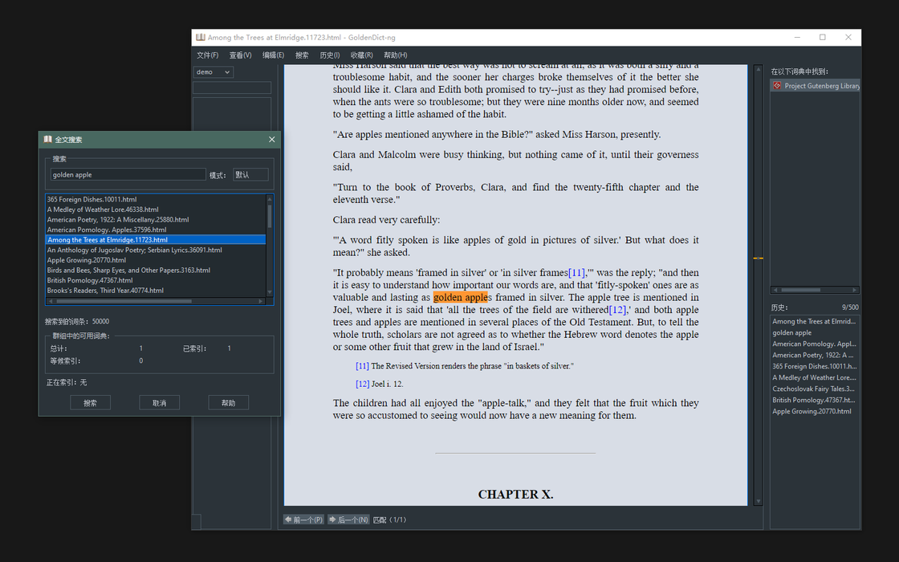
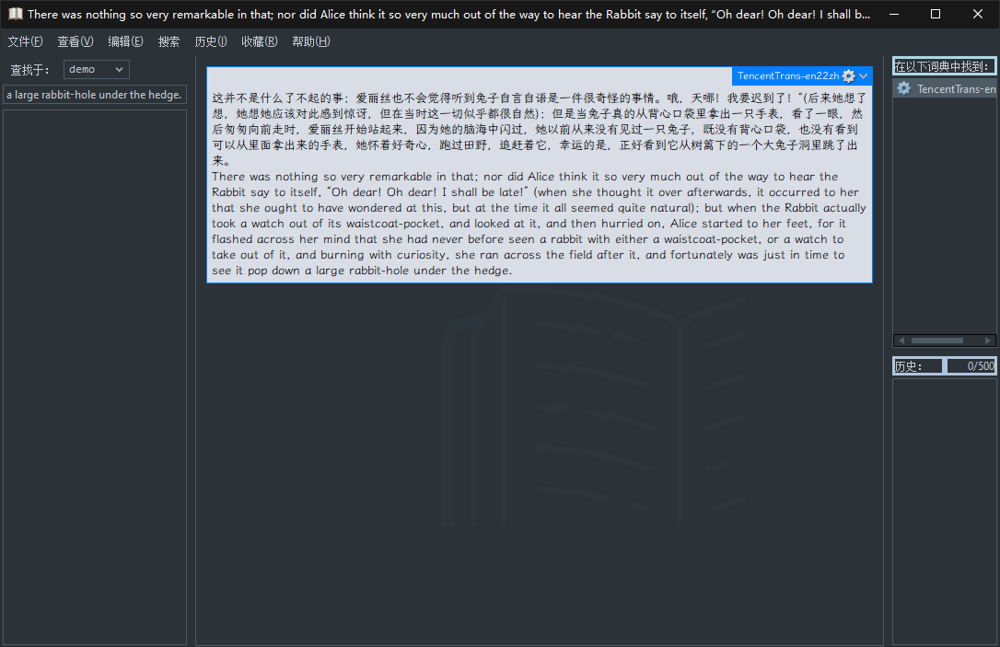
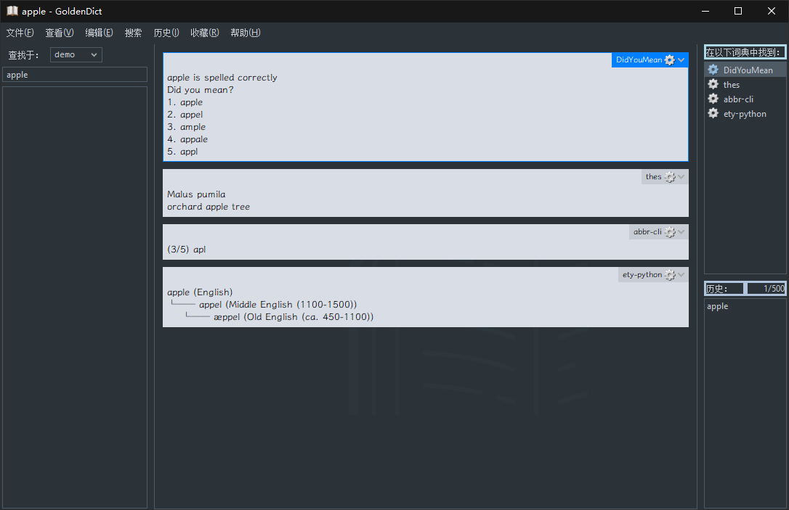

# 配置GoldenDict - 少数派

[GoldenDict](https://sspai.com/link?target=http%3A%2F%2Fgoldendict.org%2F)是一款开源的桌面端词典检索应用，跨平台，[支持多种词典格式](https://sspai.com/link?target=https%3A%2F%2Fgithub.com%2Fgoldendict%2Fgoldendict%2Fwiki%2FSupported-Dictionary-Formats)。它有十分丰富的可配置项，包括可离线使用的字典和字典组，拼写检查、单词发音、语音合成，和在线词典、在线翻译等。[GoldenDict-ng](https://sspai.com/link?target=https%3A%2F%2Fgithub.com%2Fxiaoyifang%2Fgoldendict-ng)是基于前者重写的新一代GoldenDict，修复了[一些长期累积的问题](https://sspai.com/link?target=https%3A%2F%2Fgithub.com%2Fxiaoyifang%2Fgoldendict-ng%2Fissues%2F587)，目前仍然处于积极开发中，安装时可看[发行版块](https://sspai.com/link?target=https%3A%2F%2Fgithub.com%2Fxiaoyifang%2Fgoldendict-ng%2Freleases)和[打包的版本](https://sspai.com/link?target=https%3A%2F%2Fxiaoyifang.github.io%2Fgoldendict-ng%2Finstall%2F)。

GoldenDict向前兼容一些Windows XP之类的老旧系统，我个人也一般使用软件的稳定版，这里就以配置GoldenDict为例。软件版本为[GoldenDict 1.5.0](https://sspai.com/link?target=https%3A%2F%2Fgithub.com%2Fgoldendict%2Fgoldendict%2Freleases%2Ftag%2F1.5.0)、[GoldenDict-ng-v23.09.29](https://sspai.com/link?target=https%3A%2F%2Fgithub.com%2Fxiaoyifang%2Fgoldendict-ng%2Freleases%2Ftag%2Fv23.09.29-MoonCake.7f0f8778)的`6.5.2-****.zip`。二者在菜单的配置步骤上，可能有小部分差异，而配置文件几乎可以共用（不推荐）。更多的使用说明见[GoldenDict文档](https://sspai.com/link?target=https%3A%2F%2Fgithub.com%2Fgoldendict%2Fgoldendict%2Fwiki)和[GoldenDict-ng文档](https://sspai.com/link?target=https%3A%2F%2Fxiaoyifang.github.io%2Fgoldendict-ng%2F)。

我用了Scoop来安装便携版，还需要手动删除`C:\Users\YourName\scoop\apps\goldendict\current\portable`目录，也就是挂掉配置文件夹`C:\Users\YourName\scoop\persist\goldendict`里的系统目录链接，而使用安装版的配置文件位置`C:\Users\YourName\AppData\Roaming\GoldenDict`，见[issue](https://sspai.com/link?target=https%3A%2F%2Fgithub.com%2Fgoldendict%2Fgoldendict%2Fissues%2F1560)。

## 黑暗主题

1.  下载[GoldenDict-Full-Dark-Theme](https://sspai.com/link?target=https%3A%2F%2Fgithub.com%2Fyozhic%2FGoldenDict-Full-Dark-Theme)，并按照说明安装（移动文件）
2.  GoldenDict → 编辑 → 首选项 → 附加样式 → Dark

我额外进行了一些调整：

```css
// 词典框的圆角改为直角等
.gdarticle
{
  border-radius: 0;
}

.programs_plaintext, .programs_html {
  margin-top: 20px;
}

.gdactivearticle .gddictname {
  border: none;
}

.gddictname {
  border: none;
  border-radius: 0;
}

// 「语音合成」词典的文字显示上有些问题
.voiceengines_play {
  margin-top: 22.5px;
}
```

一些字典内置的样式也可以修改，如编辑[ODE 3/e](https://sspai.com/link?target=https%3A%2F%2Fmdict.org%2Fpost%2F0011%2F)的`ODE.css`：

```css
// 字更小
.Od3 {
    font-size: 102%;
    line-height: 97%;
}
```

主窗口的布局可在菜单栏的「查看」中设置，窗口大小可手动调整。对于弹窗窗口，参考该[issue](https://sspai.com/link?target=https%3A%2F%2Fgithub.com%2Fgoldendict%2Fgoldendict%2Fissues%2F1010)来操作。



## 修改字典字体

去下载并安装收录全、完成度高的字体。

编辑`C:\Users\YourName\AppData\Roaming\GoldenDict\styles\Dark\article-style.css`，在开头添加：

```css
// 添加本地字体
@font-face {
  font-family: YourFont;
  src: local('Your Font') url('file:C:\\Users\\YourName\\AppData\\Local\\Microsoft\\Windows\\Fonts\\YourFont.ttf') format('truetype');
  font-weight: normal;
  font-style:  normal;
}
```

在末尾添加：

```css
body
{
  font-family: "Your Font", NotoSans;
  font-size:   10pt;
}

.dsl_t
{
  font-family: "Your Font", NotoSerif;
}
```

## 添加词典

去下载字典文件，如：

-   [Mdict.org](https://sspai.com/link?target=https%3A%2F%2Fmdict.org%2F)上的，添加了中文释义的[新牛津英汉双解词典](https://sspai.com/link?target=https%3A%2F%2Fmdict.org%2Fpost%2F0011%2F)、[企鹅英语词典](https://sspai.com/link?target=https%3A%2F%2Fmdict.org%2Fpost%2Fpenguin-english-dictionary-3rd%2F)、[柯林斯COBUILD英语用法大全](https://sspai.com/link?target=https%3A%2F%2Fmdict.org%2Fpost%2Fcollins-cobuild-english-usage%2F)、[韦氏发音词典](https://sspai.com/link?target=https%3A%2F%2Fmdict.org%2Fpost%2F0010%2F)等等
-   还是Mdict.org上的[汉语词典](https://sspai.com/link?target=https%3A%2F%2Fmdx.mdict.org%2F%25E6%258C%2589%25E8%25AF%258D%25E5%2585%25B8%25E8%25AF%25AD%25E7%25A7%258D%25E6%259D%25A5%25E5%2588%2586%25E7%25B1%25BB%2F%25E6%25B1%2589%25E8%25AF%25AD%2F%25E5%25AD%2597%25E5%2585%25B8%2F)，推荐`汉语大词典(简体精排).mdx`、`漢語大詞典.mdx`
-   [简明英汉字典增强版#css-版本](https://sspai.com/link?target=https%3A%2F%2Fgithub.com%2Fskywind3000%2FECDICT%2Fwiki%2F%25E7%25AE%2580%25E6%2598%258E%25E8%258B%25B1%25E6%25B1%2589%25E5%25AD%2597%25E5%2585%25B8%25E5%25A2%259E%25E5%25BC%25BA%25E7%2589%2588%23css-%25E7%2589%2588%25E6%259C%25AC)
-   离线的[Online Etymology Dictionary](https://sspai.com/link?target=https%3A%2F%2Fdownloads.freemdict.com%2F%25E5%25B0%259A%25E6%259C%25AA%25E6%2595%25B4%25E7%2590%2586%2F%25E5%2585%25B1%25E4%25BA%25AB2020.5.11%2Fcontent%2F1_english%2Fz_Grammar_others%2FOnline%2520Etymology%2520Dictionary%2F)
-   工具书，如[翻译人名](https://sspai.com/link?target=https%3A%2F%2Fgithub.com%2Flxs602%2FChinese-Mandarin-Dictionaries%2Ftree%2Fmain%2FChinese%2520Names%2520Corpus%2FEnglish-Chinese%2520Names)
-   别的语种，[Latin dictionaries](https://sspai.com/link?target=https%3A%2F%2Flatin-dict.github.io%2F)上的拉丁语词典、[proteusx](https://sspai.com/link?target=https%3A%2F%2Fgithub.com%2Fproteusx)制作的古希腊语词典

GoldenDict → 编辑 → 词典 → 词典来源/文件 → 添加 → 词典文件所在的目录 → 递归搜索 On → 应用。

## 添加词典群组

... 词典 → 群组 → 添加群组 → `TheGroup` → 将可用词典拖入群组 → 应用。

群组中，从上往下，可参考以下顺序：

```plain
在线翻译
单词发音
语音引擎
词典
专业词典
例句写作
拼写检查
其他
```

GoldenDict主界面 → 查找于 → TheGroup。

## 添加在线词典（可选）

参考[GoldenDict++](https://sspai.com/link?target=https%3A%2F%2Fgithub.com%2Fnonwill%2FGoldenDict-OCR)里的默认配置，可添加[DICT.org](https://sspai.com/link?target=https%3A%2F%2Fdict.org%2Fbin%2FDict)作为在线词典库。

GoldenDict → 编辑 → 词典 → 词典来源/词典服务器 → 添加：

-   已启用 On
-   名称 `dict.org`
-   地址 `dict://dict.org`
-   数据库 `*`
-   策略 `*`

## 添加拼写检查词库

软件已内置了部分词库，如果需要额外添加：

1.  去下载「Hunspell Dictionary」，如[English Spell Checker Dictionaries](https://sspai.com/link?target=http%3A%2F%2Fwordlist.aspell.net%2Fdicts%2F)上的「en\_US」。如果要添加多个拼写词典，需将所有的`.aff`、`.dic`文件放在同一目录
2.  ... 词典 → 词典来源/构词法规则库 → 变更 → `.aff`、`.dic`文件所在的目录 → 勾选库中条目 → 应用
3.  ... 群组 → 将拼写词典拖入词典群组



## 添加单词发音

1.  下载[pronunciations](https://sspai.com/link?target=https%3A%2F%2Fgithub.com%2Fyousefvand%2Fpronunciations)。仅英语，约2GB大小
2.  音频压缩包都放在同一个文件夹内， 解压到同名的文件夹
3.  ... 词典 → 词典来源/音频文件目录 → 添加 → 音频文件所在文件夹 → 应用

也可以从[该帖](https://sspai.com/link?target=https%3A%2F%2Frutracker.org%2Fforum%2Fviewtopic.php%3Ft%3D6211002) 下载[Forvo](https://sspai.com/link?target=https%3A%2F%2Fforvo.com%2F)的多语言语音，使用[qBittorrent](https://sspai.com/link?target=https%3A%2F%2Fwww.qbittorrent.org%2F)一类的工具。根据帖子上的内容，这样操作：

1.  `.opus`格式体积更小，音质也十分相近，所以下载时只勾选`Forvo_pronunciations/export/opus`，约24GB大小。下载完成后不用解压
2.  对话提到了「音频文件目录」这个功能不方便也不可靠，推荐使用`.dsl`文件，可以当作是目录册，指向了音频文件`.zip`
3.  补充了新版本的ForvoDSL，这是一个[MEGA分享链接](https://sspai.com/link?target=https%3A%2F%2Fmega.nz%2Ffolder%2F3CwCmR7D%2305Q08F-cTKPiOTdjKXAcuw)。[MEGAsync](https://sspai.com/link?target=https%3A%2F%2Fmega.nz%2Fsync)是一个安全可靠的云备份、同步服务。下载后解压`ForvoDSL-20220513.7z`
4.  重命名`Forvo_pronunciations/export/opus`里的`en.zip`为`ForvoEnglish.dsl.files.zip`，然后将它和`ForvoDSL/ForvoDSL-20220513`里的`ForvoEnglish.dsl`，放入一个在别处新建的文件夹，如`gd_Forvo_pronunciations`
5.  ... 词典 → 词典来源/文件 → 添加 → `...\gd_Forvo_pronunciations` → 应用

但是如果要添加所有发音词典，考虑到不去移动`Forvo_pronunciations`，且不重命名文件。利用`ForvoDSL/ForvoDSL-20220513/00README.txt`中的信息，可以编辑成一个长命令行脚本用来批量`mklink`。

1.  从`00README.txt`制作`.cmd`脚本。或者下载[mklink\_for\_dslfiles.cmd](https://sspai.com/link?target=https%3A%2F%2Fgist.github.com%2Fscillidan%2F6d5ceab14883a2c7a890e88e9f5532a7)
2.  每一行命令格式都是`mklink ...\gd_Forvo_pronunciations\ForvoEnglish.dsl.files.zip ...\Forvo_pronunciations\export\opus\en.zip`。替换所有的`...`为正确的路径
3.  终端中运行`mklink_for_dslfiles.cmd`
4.  ... 词典 → 词典来源/文件 → 添加 → `...\gd_Forvo_pronunciations` → 应用

GoldenDict\_pronunciation

 scillidan1 关注

00:01 / 00:13

自动

倍速

进入哔哩哔哩，观看更高清

## 添加语音引擎

1.  ... 词典 → 词典来源/语音合成 → 预览/可用语音引擎 → `Microsoft Huihui Desktop - Chinese (Simplified)` → 添加
2.  ... 预览/可用语音引擎 → `Microsoft David Desktop - English (United States)` → 添加

此处的语音引擎来自：Windows设置 → 时间和语言 → 语音 → 语音/选择语音。

## 添加离线维基（仅gd-ng）

Kiwix是一个离线的维基阅读器，也适用于另一些网络内容，如[StackExchange](https://sspai.com/link?target=https%3A%2F%2Fstackexchange.com%2F)([Stack Overflow](https://sspai.com/link?target=https%3A%2F%2Fstackoverflow.com%2F))、[Project Gutenberg](https://sspai.com/link?target=https%3A%2F%2Fwww.gutenberg.org%2F)等等，用于提供高速、稳定的档案访问服务。它支持高度压缩的`.zim`格式，可包含元数据、HTML、图像等资源。

从[Content in all languages](https://sspai.com/link?target=https%3A%2F%2Fwiki.kiwix.org%2Fwiki%2FContent_in_all_languages)的列表中选择档案，例如「wikipedia (English)」，型号「all maxi」包含除音频、视频等大型媒体文件外的所有内容。各型号的详细说明见该[issue1](https://sspai.com/link?target=https%3A%2F%2Fgithub.com%2Fopenzim%2Fzim-requests%2Fissues%2F129)，[issue2](https://sspai.com/link?target=https%3A%2F%2Fgithub.com%2Fopenzim%2Fmwoffliner%2Fissues%2F485)。配置步骤：

1.  下载`.zim`档案。如果是大体积的档案，推荐每个`.zim`单独放置，如下载`wikipedia_en_all_maxi_****.zim`到`gd_wikipedia`
2.  GoldenDict-ng → 编辑 → 词典 → 词典来源/文件 → 添加 → `.zim`所在的文件夹



也推荐使用[Kiwix客户端](https://sspai.com/link?target=https%3A%2F%2Fkiwix.org%2Fen%2Fapplications%2F)来阅读`.zim`。或者[Kiwix JS for PWA](https://sspai.com/link?target=https%3A%2F%2Fgithub.com%2Fkiwix%2Fkiwix-js-pwa)，如果要部署到本地，可参考笔记[kiwix-js-pwa.md](https://sspai.com/link?target=https%3A%2F%2Fgithub.com%2Fscillidan%2FPM2-demo%2Fblob%2Fmain%2F_readme%2Fkiwix-js-pwa.md)。



另外，这里再演示一下GoldenDict的「全文搜索」功能。例如，查找「古腾堡计划」的电子书库中提到了某个词的段落：GoldenDict-ng → 搜索 → 全文搜索 → `TheWord` → 搜索 → 单击条目。



## 添加在线翻译脚本

在「词典来源/程序」一栏，可添加命令行或者脚本工具。

1.  安装[Python](https://sspai.com/link?target=https%3A%2F%2Fwww.python.org%2Fdownloads%2F)，我装的是`python3.9`。安装过程全部选默认，勾选「添加Python到PATH」
2.  下载修改版的[TencentTrans\_en22zh.py](https://sspai.com/link?target=https%3A%2F%2Fgithub.com%2Fscillidan%2Ftencent-translate-for-goldendict%2Fblob%2Fmaster%2FTencentTrans_en22zh.py)并填写`SecretId`和`SecretKey`
3.  `pip install tencentcloud-sdk-python`
4.  ... 词典 → 词典来源/程序 → 添加：
    -   已启用 On
    -   类型 纯文本
    -   名称 `TencentTrans-en22zh`
    -   命令行 `python .../TencentTrans-en22zh.py %GDWORD%`



-   目前只支持中英文互译。有其他语言、特殊字符时可能会报错
-   输出的文本没有段落，因为[GoldenDict会删除换行符](https://sspai.com/link?target=https%3A%2F%2Fgithub.com%2Fgoldendict%2Fgoldendict%2Fissues%2F1606)

特别一提，对于在线翻译功能，[GoldenDict tools](https://sspai.com/link?target=https%3A%2F%2Fgithub.com%2FAjatt-Tools%2Fgd-tools)的[gd-mecab](https://sspai.com/link?target=https%3A%2F%2Fgithub.com%2FAjatt-Tools%2Fgd-tools%23gd-mecab)、[gd-marisa](https://sspai.com/link?target=https%3A%2F%2Fgithub.com%2FAjatt-Tools%2Fgd-tools%23gd-marisa)脚本演示了一种梦幻般的辅助功能，可置顶句子、分词、动态断句。但不支持Windows（我没有安装成功）。

## 添加其他脚本

[ety-python](https://sspai.com/link?target=https%3A%2F%2Fgithub.com%2Fjmsv%2Fety-python)是一个python工具，能够打印词源的各历史时期的树状信息图，数据来自[Etymological Wordnet](https://sspai.com/link?target=http%3A%2F%2Fwww1.icsi.berkeley.edu%2F~demelo%2Fetymwn%2F)项目，大部分信息是从[Wiktionary](https://sspai.com/link?target=https%3A%2F%2Fen.wiktionary.org%2Fwiki%2FWiktionary%3AMain_Page)中挖掘来。安装并运行：

```shell
pip install ety
```

运行：

```shell
ety -r -t apple
```

将输出：

```shell
apple (English)
└── appel (Middle English (1100-1500))
    └── æppel (Old English (ca. 450-1100))
```

不过要在Windows平台的GoldenDict里使用时，有些我不懂的问题（见[issue](https://sspai.com/link?target=https%3A%2F%2Fgithub.com%2Fgoldendict%2Fgoldendict%2Fissues%2F1678), [blog](https://sspai.com/link?target=https%3A%2F%2Fisaacong.me%2Fposts%2Funicodeencodeerror-when-redirecting-python-output%2F)）。可以让GoldenDict使用另外一个在隔离环境里的有修改的`ety-python`包，这样：

```shell
git clone https://github.com/jmsv/ety-python
cd ety-python
python -m venv venv
venv/Scripts/activate.bat
pip install -e .
```

修改`ety-python/ety/cli.py`。在开头的`import ety`后，加上一行：

```python
import sys
```

注释末尾的`print(output.strip())`，加上：

```python
encoded_output = output.strip().encode("utf-16", errors="replace")
sys.stdout.buffer.write(encoded_output)
sys.stdout.buffer.flush()
```

词典 → 词典来源/程序 → 添加：

-   已启用 On
-   类型 纯文本
-   名称 `ety-python`
-   命令行 `...\ety-python\venv\Scripts\python.exe ...\ety-python\ety\__main__.py -r -t %GDWORD%`

这样做没有优雅地解决问题，依旧在输入一些字符如空格时，显示乱码，但对我来说能够使用了。

另外，还可以添加其他脚本如：拼写提示[DoYouMean](https://sspai.com/link?target=https%3A%2F%2Fgithub.com%2Fhisbaan%2Fdidyoumean)、同义词词典[thes](https://sspai.com/link?target=https%3A%2F%2Fgithub.com%2Fgrantshandy%2Fthes)、缩写查询[abbr-cli](https://sspai.com/link?target=https%3A%2F%2Fgithub.com%2Fmhadidg%2Fabbr-cli)等。



## 设置鼠标取词

用到了[AutoHotKey](https://sspai.com/link?target=https%3A%2F%2Fwww.autohotkey.com%2F)脚本[GoldenDictOCR](https://sspai.com/link?target=https%3A%2F%2Fgithub.com%2FVimWei%2FGoldenDictOCR)。在它的「鼠标选择取词」模式，可以双击选词、划词来查词。GoldenDict默认的查词快捷键是`Ctrl+C+C`，如果已被占用，可修改为其他键。脚本中的键位也就需要一并修改。例如我用的是`Alt+Z`：

GoldenDict → 编辑 → 首选项 → 热键 → 使用下列热键翻译剪切板中的单词 → `Alt+Z`。

`clone`或下载[GoldenDictOCR](https://sspai.com/link?target=https%3A%2F%2Fgithub.com%2FVimWei%2FGoldenDictOCR)，进入文件夹。

编辑`IncludeAHK/GdOcrTool.ahk`。填写`GoldenDict.exe`所在的正确位置:

```autoit
Global GoldenDictFileName := "...\GoldenDict.exe"
```

编辑`GoldenDict.ahk`，修改两处键位：

-   [118行](https://sspai.com/link?target=https%3A%2F%2Fgithub.com%2FVimWei%2FGoldenDictOCR%2Fblob%2F3ffa7079de4c32c05619c3a8d25b22236eeb8528%2FIncludeAHK%2FGoldenDict.ahk%23L118)附近，`Send ^{c 2}` → `Send !z`
-   [37行](https://sspai.com/link?target=https%3A%2F%2Fgithub.com%2FVimWei%2FGoldenDictOCR%2Fblob%2F3ffa7079de4c32c05619c3a8d25b22236eeb8528%2FIncludeAHK%2FGoldenDict.ahk%23L37)附近，`^!i::` → `^!g::`

启动`GoldenDictOCR.ahk`后，按`Ctrl+Alt+G`即可开关「鼠标选择取词」。

GoldenDictOCR\_鼠标取词

 scillidan1 关注

00:00 / 00:15

自动

倍速

进入哔哩哔哩，观看更高清

## 设置OCR取词

[Umi-OCR](https://sspai.com/link?target=https%3A%2F%2Fgithub.com%2Fhiroi-sora%2FUmi-OCR)是一款开源、可离线、功能灵活的OCR软件。用于一般OCR时，它可提供高速稳定、准确率较高的中英文混合识别。并且可以再配置一组快捷键，在OCR后触发GoldenDict查词，即[「截图联动」](https://sspai.com/link?target=https%3A%2F%2Fgithub.com%2Fhiroi-sora%2FUmi-OCR%2Fissues%2F166)。配置步骤：

1.  Umi-OCR → 设置 → 截图联动 On → 快捷键/修改 → 例如`Win+Shift+X`
2.  ... 联动发送按键/修改 → `Alt+Z`

按`Win+Shift+X`进行框选即可查词。

GoldenDict\_Umi-OCR

 scillidan1 关注

00:00 / 00:11

自动

倍速

进入哔哩哔哩，观看更高清

另外提一提[GoldenDictOCR](https://sspai.com/link?target=https%3A%2F%2Fgithub.com%2FVimWei%2FGoldenDictOCR)的「OCR取词」模式，不是特别推荐，可以跳过。该模式下，按`Ctrl+右键单击`可识别鼠标附近字符，按`Ctrl+反引号`可进行框选。体验上比GoldenDict内置的「屏幕取词」好一些。

需要先安装OCR工具[Capture2Text](https://sspai.com/link?target=https%3A%2F%2Fcapture2text.sourceforge.net%2F)。默认OCR语言为英语，可通过[Installing Additional OCR Languages](https://sspai.com/link?target=https%3A%2F%2Fcapture2text.sourceforge.net%2F%23install_additional_languages)的说明添加额外的语言。

安装好后，进入`GoldenDictOCR`文件夹。编辑`IncludeAHK/GdOcrTool.ahk`，填写`Capture2Text.exe`所在的位置:

```plain
Global Capture2TextFileName := "...\Capture2Text.exe"
```

按`Ctrl+Alt+O`开关一次「OCR取词」。在`C:\Users\YourName\AppData\Roaming\Capture2Text`目录下，会生成配置文件`Capture2Text.ini`。

打开配置示例`IncludeAHK/Capture2Text.ini`，复制从`[BubbleCapture]`到`[Hotkey]`的内容，粘贴到配置文件的末尾。再添加或编辑以下两处，用于设置3个快捷键，来切换OCR语言，如：

```plain
[Hotkey]
Lang1=Shift+Alt+1
Lang2=Shift+Alt+2
Lang3=Shift+Alt+3
```

```plain
[OCR]
QuickAccessLang1=English
QuickAccessLang2=...
QuickAccessLang3=...
```

用来识别标准字形的单个英文小字时，识别率还可以，稳定性较差。

## 一些实用键位

[全部快捷键](https://sspai.com/link?target=https%3A%2F%2Fxiaoyifang.github.io%2Fgoldendict-ng%2Fui_shortcuts%2F) ，也可在主菜单的「帮助」中查看。以及一些[常用快捷键](https://sspai.com/link?target=https%3A%2F%2Fgithub.com%2Fgoldendict%2Fgoldendict%2Fwiki%2FUseful-Shortcuts)，如：

-   `Ctrl+L` 聚焦到输入框
-   `Alt-Right/Left` 前个/后个查询记录
